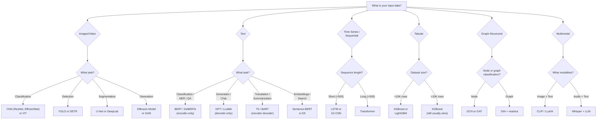

# Architecture Selection Guide

Choosing the right architecture is the most important decision in a deep learning project. The wrong architecture wastes weeks of training time. This guide provides decision trees and comparison tables to help you pick the right model for your task.

## Master Decision Tree



## Architecture Comparison by Task

### Image Tasks

| Task | Recommended | Alternative | Notes |
|------|------------|-------------|-------|
| **Image Classification** | EfficientNet-B0/B2 | ViT (if pretrained) | CNN wins on small data, ViT wins with pretraining |
| **Fine-Grained Classification** | ViT + fine-tune | EfficientNet with attention | Needs strong augmentation |
| **Object Detection** | YOLOv8 (real-time) | Faster R-CNN (accuracy) | DETR for end-to-end |
| **Instance Segmentation** | Mask R-CNN | YOLO-seg | SAM for zero-shot |
| **Semantic Segmentation** | DeepLabv3+ | U-Net (medical) | SegFormer for efficiency |
| **Image Generation** | Stable Diffusion | StyleGAN3 | Diffusion models dominate |
| **Super Resolution** | ESRGAN | SwinIR | Real-ESRGAN for practical use |
| **Style Transfer** | AdaIN | Neural style transfer | Fast inference with feedforward |

### NLP Tasks

| Task | Recommended | Alternative | Notes |
|------|------------|-------------|-------|
| **Text Classification** | DeBERTa-v3-base | RoBERTa | Fine-tune on your data |
| **Named Entity Recognition** | DeBERTa + token cls | SpaCy (for speed) | Use BIO tagging |
| **Question Answering** | DeBERTa-v3 | BERT-large | Extractive QA |
| **Text Generation** | LLaMA 3 / Mistral | GPT-2 (smaller) | Use RLHF/DPO for alignment |
| **Summarization** | BART / T5 | LLaMA (few-shot) | Encoder-decoder preferred |
| **Translation** | NLLB / mBART | T5 | Multilingual models |
| **Sentiment Analysis** | DistilBERT (fast) | DeBERTa (accurate) | Often fine-tune BERT |
| **Semantic Search** | all-MiniLM-L6-v2 | E5-large | Sentence-transformers |

### Sequence Tasks

| Task | Recommended | Alternative | Notes |
|------|------------|-------------|-------|
| **Time Series Forecast** | Transformer | LSTM | PatchTST for long series |
| **Speech Recognition** | Whisper | Wav2Vec2 | Whisper is multilingual |
| **Music Generation** | Transformer | WaveNet | MusicGen |
| **Anomaly Detection** | Autoencoder | LSTM | VAE for probabilistic |

### Structured Data

| Task | Recommended | Alternative | Notes |
|------|------------|-------------|-------|
| **Tabular Classification** | XGBoost / LightGBM | CatBoost | DL rarely wins on tabular |
| **Tabular Regression** | XGBoost | TabNet (if DL needed) | Feature engineering matters more |
| **Recommender Systems** | Two-tower + ANN | Graph NN | Matrix factorization baseline |
| **Molecular Property** | GNN (SchNet, DimeNet) | SMILES + Transformer | 3D-aware GNNs best |

## CNN vs RNN vs Transformer vs GNN

### Fundamental Comparison

| Property | CNN | RNN/LSTM | Transformer | GNN |
|----------|-----|---------|-------------|-----|
| **Input structure** | Grid (images) | Sequence | Sequence or set | Graph |
| **Key operation** | Convolution | Recurrence | Self-attention | Message passing |
| **Parallelizable** | Yes | No (sequential) | Yes | Partially |
| **Long-range deps** | Limited (receptive field) | Moderate (LSTM) | Excellent | K-hop neighborhood |
| **Complexity per layer** | $O(k^2 \cdot C^2 \cdot HW)$ | $O(n \cdot h^2)$ | $O(n^2 \cdot d)$ | $O(E \cdot d)$ |
| **Inductive bias** | Locality, translation equivariance | Sequential, temporal | None (learns from data) | Permutation invariance |
| **Data efficiency** | Good (strong bias) | Moderate | Poor (needs lots of data) | Depends on graph size |
| **Training speed** | Fast | Slow | Fast (parallel) | Moderate |
| **Best for** | Images, spatial data | Short sequences | Text, long sequences | Graphs, molecules |

### When Each Architecture Wins

**CNN wins when:**
- Data has spatial structure (images, spectrograms)
- Dataset is small (CNN's inductive bias helps)
- Real-time inference needed (efficient on hardware)
- Translation equivariance is desired

**RNN/LSTM wins when:**
- Processing streaming data (one token at a time)
- Memory budget is very tight (O(1) per step vs O(n) for attention)
- Sequence is short and simple

**Transformer wins when:**
- Long-range dependencies matter
- Large amounts of training data available
- Parallelism is important (GPU utilization)
- Pretrained models exist for the domain
- Default choice for 2026

**GNN wins when:**
- Data is naturally a graph (molecules, social networks, knowledge bases)
- Relationships between entities matter more than entity features
- Variable-size inputs with arbitrary connectivity

## Model Size Guidelines

### By Dataset Size

| Training Samples | Max Model Size | Architecture |
|-----------------|---------------|-------------|
| < 500 | Pretrained (freeze backbone) | Transfer learning |
| 500 -- 5K | Pretrained (fine-tune) | BERT-base, ResNet-50 |
| 5K -- 50K | Medium (10-100M params) | Train from scratch or fine-tune |
| 50K -- 500K | Large (100M-1B params) | Full training viable |
| > 1M | Very large (1B+) | Scale up aggressively |

### By Compute Budget

| Budget | Model | Training Time |
|--------|-------|--------------|
| 1 GPU-hour | ResNet-18 on CIFAR-10 | Quick experiment |
| 10 GPU-hours | ResNet-50 on custom dataset | Serious project |
| 100 GPU-hours | BERT fine-tuning | Production NLP |
| 1000 GPU-hours | Train medium LM | Research |
| 10K+ GPU-hours | Train large LM | Company-scale |

## Decision Checklist

Before choosing an architecture, answer these questions:

1. **What is my input modality?** (image, text, tabular, graph, multimodal)
2. **What is my output?** (class label, bounding box, generated text, embedding)
3. **How much data do I have?** (determines if you can train from scratch)
4. **What is my latency requirement?** (real-time vs batch)
5. **What is my compute budget?** (GPU hours available)
6. **Does a pretrained model exist?** (almost always start here)
7. **What are my accuracy requirements?** (determines model size)

## Quick Picks for 2026

| Scenario | Just Use This |
|----------|--------------|
| Image classification | `torchvision.models.efficientnet_b0(weights='DEFAULT')` |
| Text classification | `AutoModelForSequenceClassification.from_pretrained('microsoft/deberta-v3-base')` |
| Object detection | `YOLO('yolov8n.pt')` |
| Text generation | Fine-tuned LLaMA 3 or Mistral |
| Semantic search | `SentenceTransformer('all-MiniLM-L6-v2')` |
| Image generation | Stable Diffusion XL + LoRA |
| Speech-to-text | `whisper-large-v3` |
| Tabular data | XGBoost (not deep learning) |

## Complexity and Memory Analysis

Understanding the computational and memory cost of each architecture is critical for choosing the right model under hardware constraints.

### FLOPs per Layer

| Layer Type | FLOPs | Memory |
|-----------|-------|--------|
| Linear ($n \to m$) | $2nm$ | $nm$ params |
| Conv2d ($C_{in}, C_{out}, k$) | $2k^2 C_{in} C_{out} HW$ | $k^2 C_{in} C_{out}$ params |
| Self-Attention ($n$ tokens, $d$ dim) | $4nd^2 + 2n^2 d$ | $4d^2$ params, $n^2$ attention matrix |
| LSTM ($d$ hidden) | $8d^2$ per step | $8d^2$ params |
| GCN ($d$ features, $E$ edges) | $2Ed + 2nd^2$ | $d^2$ params |

### Memory Budget Calculator

```python
def estimate_memory(num_params, batch_size=32, seq_len=512, precision='fp32'):
    """Estimate GPU memory for training.

    Components:
    1. Model parameters
    2. Gradients (same size as params)
    3. Optimizer states (Adam: 2x params for m and v)
    4. Activations (depends on batch size and architecture)
    """
    bytes_per_param = {'fp32': 4, 'fp16': 2, 'bf16': 2, 'int8': 1}[precision]

    # Parameters + gradients
    param_memory = num_params * bytes_per_param
    grad_memory = num_params * bytes_per_param

    # Adam optimizer states (always fp32)
    optimizer_memory = num_params * 4 * 2  # m and v in fp32

    # Rough activation estimate (varies hugely by architecture)
    activation_memory = batch_size * seq_len * 4096 * bytes_per_param  # Rough

    total = param_memory + grad_memory + optimizer_memory + activation_memory
    print(f"Parameters:  {param_memory / 1e9:.2f} GB")
    print(f"Gradients:   {grad_memory / 1e9:.2f} GB")
    print(f"Optimizer:   {optimizer_memory / 1e9:.2f} GB")
    print(f"Activations: {activation_memory / 1e9:.2f} GB (estimate)")
    print(f"Total:       {total / 1e9:.2f} GB")
    return total

# ResNet-50: ~25M params
estimate_memory(25e6, batch_size=32)

# BERT-base: ~110M params
estimate_memory(110e6, batch_size=16, seq_len=512)

# LLaMA-7B: ~7B params
estimate_memory(7e9, batch_size=1, seq_len=2048, precision='fp16')
```

### Inference Latency Comparison

| Model | Parameters | GPU Latency | CPU Latency | Mobile |
|-------|-----------|-------------|-------------|--------|
| MobileNetV3-S | 2.5M | 1 ms | 15 ms | 5 ms |
| ResNet-50 | 25M | 4 ms | 80 ms | N/A |
| EfficientNet-B0 | 5M | 3 ms | 50 ms | 20 ms |
| ViT-B/16 | 86M | 8 ms | 200 ms | N/A |
| BERT-base | 110M | 10 ms | 300 ms | N/A |
| DistilBERT | 66M | 6 ms | 150 ms | 80 ms |
| YOLOv8n | 3M | 2 ms | 30 ms | 15 ms |
| Whisper-small | 244M | 50 ms/s | N/A | N/A |

## Architecture Anti-Patterns

Common mistakes when choosing architectures:

### 1. Using Deep Learning for Tabular Data

**Symptom:** You have a CSV with 50 features and 10K rows.

**Wrong:** Train a 5-layer MLP with batch norm and dropout.

**Right:** Use XGBoost or LightGBM. They almost always win on tabular data, require no GPU, and train in seconds. Only consider deep learning for tabular if you have >100K rows AND complex feature interactions.

### 2. Training ViT from Scratch on Small Data

**Symptom:** You have 5K images and train ViT-B from scratch.

**Wrong:** ViT has no inductive bias for spatial locality --- it needs massive data.

**Right:** Use a pretrained ViT or use a CNN (ResNet, EfficientNet) which has built-in spatial bias.

### 3. Using RNNs for Long Sequences in 2026

**Symptom:** You have 2000-token sequences and use a bidirectional LSTM.

**Wrong:** LSTMs cannot effectively capture dependencies beyond ~200 tokens even with gating.

**Right:** Use a transformer. Flash Attention makes long contexts practical.

### 4. Ignoring Pretrained Models

**Symptom:** You train everything from scratch.

**Wrong:** Training from random initialization when pretrained weights exist.

**Right:** Always check HuggingFace Model Hub, torchvision, or timm first. Transfer learning is almost always better.

### 5. Over-Engineering the Architecture

**Symptom:** Custom attention mechanisms, novel activation functions, bespoke normalization.

**Wrong:** Architecture novelty rarely matters as much as data quality and training recipe.

**Right:** Use a standard architecture (ResNet, BERT, ViT) with proper training techniques. Only innovate on architecture if you have a specific, measurable reason.

## Real-World Architecture Choices

### Autonomous Driving

| Component | Architecture | Why |
|-----------|-------------|-----|
| Object detection | BEVFormer / DETR3D | 3D detection from cameras |
| Lane detection | CNN + curve fitting | Fast, reliable |
| Traffic sign | EfficientNet | Small, accurate |
| Depth estimation | MiDaS (ViT) | Monocular depth |
| Planning | Transformer | Sequence decision making |

### Medical Imaging

| Task | Architecture | Why |
|------|-------------|-----|
| X-ray classification | DenseNet-121 (CheXpert) | Transfer learning, well-studied |
| Tumor segmentation | U-Net + attention | Skip connections for fine detail |
| Pathology | ViT-H (pretrained) | Large images, patch-based |
| Retinal screening | EfficientNet + CAM | Interpretability needed |

### Recommendation Systems

| Component | Architecture | Why |
|-----------|-------------|-----|
| User/item embeddings | Two-tower (MLP) | Efficient retrieval |
| Ranking | DeepFM / DCN | Feature interactions |
| Sequential | Transformer (SASRec) | Session-based |
| Graph-based | GNN (PinSage) | Social signals |

### Search and Retrieval

| Component | Architecture | Why |
|-----------|-------------|-----|
| Text encoding | Sentence-BERT / E5 | Dense retrieval |
| Image encoding | CLIP | Cross-modal search |
| Re-ranking | Cross-encoder (DeBERTa) | Accurate but slow |
| Multimodal | CLIP + fusion | Image + text queries |

## Choosing a Pretrained Model

### HuggingFace Model Selection

```python
# Text classification
from transformers import pipeline

# Quick selection guide:
# Speed-critical: distilbert-base-uncased
# Accuracy-critical: microsoft/deberta-v3-large
# Balanced: microsoft/deberta-v3-base

classifier = pipeline("text-classification",
                      model="microsoft/deberta-v3-base")

# Image classification
import timm

# Speed-critical: mobilenetv3_small_100
# Accuracy-critical: eva02_large_patch14_448
# Balanced: efficientnet_b0

model = timm.create_model('efficientnet_b0', pretrained=True, num_classes=10)

# Object detection
from ultralytics import YOLO

# Speed-critical: yolov8n (nano)
# Balanced: yolov8m (medium)
# Accuracy-critical: yolov8x (extra-large)

model = YOLO('yolov8m.pt')
```

### Benchmark Resources

| Resource | What It Measures |
|----------|-----------------|
| [Papers With Code](https://paperswithcode.com) | SOTA on standardized benchmarks |
| [Hugging Face Open LLM Leaderboard](https://huggingface.co/spaces/HuggingFaceH4/open_llm_leaderboard) | LLM benchmark comparisons |
| [timm leaderboard](https://huggingface.co/timm) | Vision model accuracy vs speed |
| [MTEB Leaderboard](https://huggingface.co/spaces/mteb/leaderboard) | Sentence embedding quality |

## Cross-References

- **CNN details:** [CNN](/deep-learning/cnn) --- convolution, ResNet, EfficientNet
- **RNN/LSTM details:** [RNN and LSTM](/deep-learning/rnn-lstm) --- recurrence, gates
- **Transformer details:** [Transformers](/deep-learning/transformers) --- attention, positional encoding
- **GNN details:** [Graph Neural Networks](/deep-learning/graph-neural-networks) --- message passing
- **Full checklist:** [DL Checklist](/deep-learning/dl-checklist) --- 40-item project guide
- **Optimization:** [Model Optimization](/deep-learning/model-optimization) --- deployment efficiency
- **Overview:** [Deep Learning Overview](/deep-learning/) --- when to use DL vs classical ML
