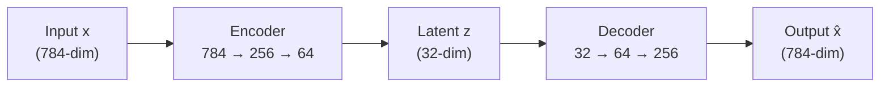
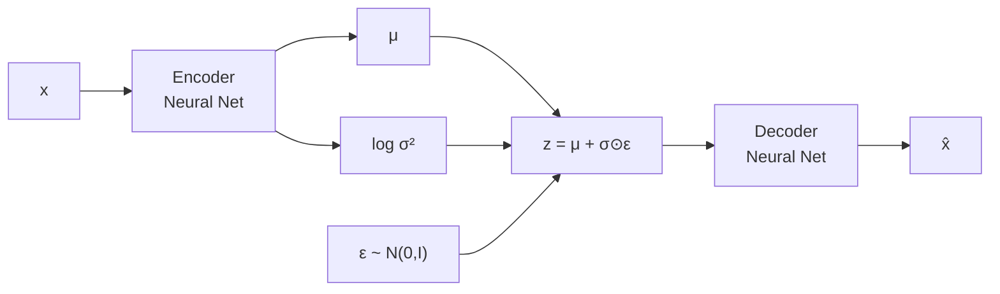

# Autoencoders

Autoencoders learn compressed representations of data by training a network to reconstruct its input through a bottleneck. This page builds from vanilla autoencoders through denoising autoencoders to variational autoencoders (VAEs) with full ELBO derivation, implements a VAE from scratch in PyTorch, generates MNIST digits, and applies autoencoders to anomaly detection.

## Vanilla Autoencoder

### Architecture

An autoencoder has two parts:

**Encoder** $f_\phi$: maps input $x$ to a latent representation $z$:

$$
z = f_\phi(x), \quad z \in \mathbb{R}^d, \quad d \ll D
$$

**Decoder** $g_\theta$: reconstructs the input from the latent:

$$
\hat{x} = g_\theta(z)
$$

**Loss:** Minimize reconstruction error:

$$
\mathcal{L}_{\text{AE}} = \|x - \hat{x}\|^2 = \|x - g_\theta(f_\phi(x))\|^2
$$



### Implementation

```python
import torch
import torch.nn as nn

class Autoencoder(nn.Module):
    def __init__(self, input_dim=784, latent_dim=32):
        super().__init__()
        self.encoder = nn.Sequential(
            nn.Linear(input_dim, 256),
            nn.ReLU(),
            nn.Linear(256, 128),
            nn.ReLU(),
            nn.Linear(128, latent_dim),
        )
        self.decoder = nn.Sequential(
            nn.Linear(latent_dim, 128),
            nn.ReLU(),
            nn.Linear(128, 256),
            nn.ReLU(),
            nn.Linear(256, input_dim),
            nn.Sigmoid(),  # Output in [0, 1] for normalized images
        )

    def forward(self, x):
        z = self.encoder(x)
        return self.decoder(z)

    def encode(self, x):
        return self.encoder(x)
```

### Limitations of Vanilla Autoencoders

1. **Irregular latent space:** The latent space has no structure. Points between two encoded digits do not necessarily produce meaningful digits.
2. **No generation:** You cannot sample from the latent space because you do not know its distribution.
3. **Overfitting:** The network can memorize training data rather than learning useful features.

## Denoising Autoencoder

Denoising autoencoders (Vincent et al., 2008) corrupt the input and train the network to reconstruct the clean version:

$$
\tilde{x} = x + \epsilon, \quad \epsilon \sim \mathcal{N}(0, \sigma^2 I)
$$

$$
\mathcal{L}_{\text{DAE}} = \|x - g_\theta(f_\phi(\tilde{x}))\|^2
$$

This forces the encoder to learn robust features rather than memorizing noise patterns.

```python
class DenoisingAutoencoder(nn.Module):
    def __init__(self, input_dim=784, latent_dim=32, noise_factor=0.3):
        super().__init__()
        self.noise_factor = noise_factor
        self.encoder = nn.Sequential(
            nn.Linear(input_dim, 256),
            nn.ReLU(),
            nn.Linear(256, latent_dim),
        )
        self.decoder = nn.Sequential(
            nn.Linear(latent_dim, 256),
            nn.ReLU(),
            nn.Linear(256, input_dim),
            nn.Sigmoid(),
        )

    def add_noise(self, x):
        noise = torch.randn_like(x) * self.noise_factor
        return torch.clamp(x + noise, 0.0, 1.0)

    def forward(self, x):
        if self.training:
            x_noisy = self.add_noise(x)
        else:
            x_noisy = x
        z = self.encoder(x_noisy)
        return self.decoder(z)
```

## Variational Autoencoder (VAE)

VAEs (Kingma and Welling, 2014) solve both problems of vanilla autoencoders by imposing a probability distribution on the latent space.

### The Generative Model

We posit a generative process:

1. Sample latent variable: $z \sim p(z) = \mathcal{N}(0, I)$
2. Generate data: $x \sim p_\theta(x|z)$

The goal is to maximize the marginal likelihood:

$$
p_\theta(x) = \int p_\theta(x|z) p(z) \, dz
$$

This integral is intractable (we would need to integrate over all possible $z$).

### The ELBO Derivation

We introduce an approximate posterior $q_\phi(z|x)$ (the encoder) and derive the Evidence Lower Bound.

Start with the log marginal likelihood:

$$
\log p_\theta(x) = \log \int p_\theta(x|z) p(z) \, dz
$$

Multiply and divide by $q_\phi(z|x)$:

$$
\log p_\theta(x) = \log \int \frac{p_\theta(x|z) p(z)}{q_\phi(z|x)} q_\phi(z|x) \, dz
$$

By Jensen's inequality ($\log$ is concave):

$$
\log p_\theta(x) \geq \int q_\phi(z|x) \log \frac{p_\theta(x|z) p(z)}{q_\phi(z|x)} \, dz
$$

Expanding:

$$
\log p_\theta(x) \geq \underbrace{\mathbb{E}_{q_\phi(z|x)}[\log p_\theta(x|z)]}_{\text{Reconstruction}} - \underbrace{D_{KL}(q_\phi(z|x) \| p(z))}_{\text{Regularization}}
$$

This is the **ELBO (Evidence Lower Bound)**:

$$
\mathcal{L}_{\text{ELBO}} = \mathbb{E}_{q_\phi(z|x)}[\log p_\theta(x|z)] - D_{KL}(q_\phi(z|x) \| p(z))
$$

The gap between $\log p_\theta(x)$ and the ELBO is exactly $D_{KL}(q_\phi(z|x) \| p_\theta(z|x))$, which is non-negative. Maximizing the ELBO simultaneously:
- Maximizes the reconstruction quality (first term)
- Pushes the approximate posterior toward the prior (second term)

### KL Divergence: Closed Form

When $q_\phi(z|x) = \mathcal{N}(\mu, \text{diag}(\sigma^2))$ and $p(z) = \mathcal{N}(0, I)$:

$$
D_{KL}(q \| p) = -\frac{1}{2} \sum_{j=1}^{d} \left(1 + \log(\sigma_j^2) - \mu_j^2 - \sigma_j^2\right)
$$

**Derivation:**

$$
D_{KL} = \int q(z) \log \frac{q(z)}{p(z)} dz = \frac{1}{2}\left[\text{tr}(\Sigma) + \mu^T\mu - d - \log\det(\Sigma)\right]
$$

For diagonal $\Sigma = \text{diag}(\sigma_1^2, \ldots, \sigma_d^2)$:

$$
= \frac{1}{2}\left[\sum_j \sigma_j^2 + \sum_j \mu_j^2 - d - \sum_j \log \sigma_j^2\right]
$$

$$
= -\frac{1}{2}\sum_j\left(1 + \log \sigma_j^2 - \mu_j^2 - \sigma_j^2\right)
$$

::: details Worked Example — KL Divergence for a 2D Latent Space

**Input:** Encoder outputs for one sample: $\mu = [0.5, -1.0]$, $\log\sigma^2 = [-0.5, 0.3]$

So $\sigma^2 = [e^{-0.5}, e^{0.3}] = [0.607, 1.350]$

**Step 1:** Compute per-dimension terms: $1 + \log\sigma_j^2 - \mu_j^2 - \sigma_j^2$

Dimension 0: $1 + (-0.5) - (0.5)^2 - 0.607 = 1 - 0.5 - 0.25 - 0.607 = -0.357$

Dimension 1: $1 + 0.3 - (-1.0)^2 - 1.350 = 1 + 0.3 - 1.0 - 1.350 = -1.050$

**Step 2:** Sum and negate with factor:
$$D_{KL} = -\frac{1}{2}(-0.357 + (-1.050)) = -\frac{1}{2}(-1.407) = 0.704$$

**Result:** $D_{KL} = 0.704$. Dimension 1 contributes more ($1.050/2 = 0.525$) because $\mu_1 = -1.0$ is far from the prior mean of 0, and $\sigma_1^2 = 1.35$ differs from the prior variance of 1. If $\mu = [0, 0]$ and $\sigma^2 = [1, 1]$ (matching the prior exactly), $D_{KL} = 0$.

:::

### The Reparameterization Trick

We cannot backpropagate through the sampling operation $z \sim q_\phi(z|x)$. The reparameterization trick makes sampling differentiable:

$$
z = \mu + \sigma \odot \epsilon, \quad \epsilon \sim \mathcal{N}(0, I)
$$

Now $z$ is a deterministic function of $\mu$, $\sigma$, and the random noise $\epsilon$. Gradients flow through $\mu$ and $\sigma$ to the encoder.

### VAE Architecture



### From-Scratch VAE

```python
import torch
import torch.nn as nn
import torch.nn.functional as F

class VAE(nn.Module):
    def __init__(self, input_dim=784, hidden_dim=256, latent_dim=20):
        super().__init__()
        # Encoder
        self.fc1 = nn.Linear(input_dim, hidden_dim)
        self.fc2 = nn.Linear(hidden_dim, hidden_dim)
        self.fc_mu = nn.Linear(hidden_dim, latent_dim)
        self.fc_logvar = nn.Linear(hidden_dim, latent_dim)

        # Decoder
        self.fc3 = nn.Linear(latent_dim, hidden_dim)
        self.fc4 = nn.Linear(hidden_dim, hidden_dim)
        self.fc5 = nn.Linear(hidden_dim, input_dim)

    def encode(self, x):
        h = F.relu(self.fc1(x))
        h = F.relu(self.fc2(h))
        return self.fc_mu(h), self.fc_logvar(h)

    def reparameterize(self, mu, logvar):
        std = torch.exp(0.5 * logvar)
        eps = torch.randn_like(std)
        return mu + eps * std

    def decode(self, z):
        h = F.relu(self.fc3(z))
        h = F.relu(self.fc4(h))
        return torch.sigmoid(self.fc5(h))

    def forward(self, x):
        mu, logvar = self.encode(x)
        z = self.reparameterize(mu, logvar)
        x_recon = self.decode(z)
        return x_recon, mu, logvar

def vae_loss(x_recon, x, mu, logvar):
    """VAE loss = Reconstruction + KL divergence."""
    # Reconstruction loss (binary cross-entropy)
    recon_loss = F.binary_cross_entropy(x_recon, x, reduction='sum')

    # KL divergence
    kl_loss = -0.5 * torch.sum(1 + logvar - mu.pow(2) - logvar.exp())

    return recon_loss + kl_loss
```

### Training the VAE on MNIST

```python
import torchvision
import torchvision.transforms as T
from torch.utils.data import DataLoader

# Data
transform = T.Compose([T.ToTensor()])
train_dataset = torchvision.datasets.MNIST(
    './data', train=True, download=True, transform=transform
)
train_loader = DataLoader(train_dataset, batch_size=128, shuffle=True)

# Model
device = torch.device('cuda' if torch.cuda.is_available() else 'cpu')
model = VAE(784, 256, 20).to(device)
optimizer = torch.optim.Adam(model.parameters(), lr=1e-3)

# Training
for epoch in range(50):
    model.train()
    total_loss = 0
    for images, _ in train_loader:
        images = images.view(-1, 784).to(device)
        optimizer.zero_grad()
        recon, mu, logvar = model(images)
        loss = vae_loss(recon, images, mu, logvar)
        loss.backward()
        optimizer.step()
        total_loss += loss.item()

    avg_loss = total_loss / len(train_dataset)
    if (epoch + 1) % 10 == 0:
        print(f"Epoch {epoch+1}: Loss = {avg_loss:.2f}")

# ── Generate new digits ──────────────────────────────────────────────
model.eval()
with torch.no_grad():
    z = torch.randn(64, 20).to(device)  # Sample from prior
    generated = model.decode(z).view(-1, 1, 28, 28)

    # Visualize
    import matplotlib.pyplot as plt
    fig, axes = plt.subplots(8, 8, figsize=(8, 8))
    for i, ax in enumerate(axes.flat):
        ax.imshow(generated[i].cpu().squeeze(), cmap='gray')
        ax.axis('off')
    plt.suptitle('VAE Generated Digits')
    plt.tight_layout()
    plt.show()

# ── Latent space interpolation ───────────────────────────────────────
with torch.no_grad():
    # Encode two images
    img1 = train_dataset[0][0].view(1, 784).to(device)
    img2 = train_dataset[1][0].view(1, 784).to(device)
    mu1, _ = model.encode(img1)
    mu2, _ = model.encode(img2)

    # Interpolate
    alphas = torch.linspace(0, 1, 10).to(device)
    interpolations = []
    for alpha in alphas:
        z = (1 - alpha) * mu1 + alpha * mu2
        img = model.decode(z).view(1, 28, 28)
        interpolations.append(img.cpu())

    # Plot interpolation
    fig, axes = plt.subplots(1, 10, figsize=(15, 2))
    for i, ax in enumerate(axes):
        ax.imshow(interpolations[i].squeeze(), cmap='gray')
        ax.axis('off')
    plt.suptitle('Latent Space Interpolation')
    plt.show()
```

## Beta-VAE: Disentangled Representations

Beta-VAE (Higgins et al., 2017) weights the KL term:

$$
\mathcal{L}_{\beta\text{-VAE}} = \mathbb{E}[\log p_\theta(x|z)] - \beta \cdot D_{KL}(q_\phi(z|x) \| p(z))
$$

- $\beta > 1$: Stronger regularization, more disentangled latent space, blurrier reconstructions
- $\beta < 1$: Better reconstructions, less disentangled
- $\beta = 1$: Standard VAE

## Convolutional VAE

For images, use convolutional encoder/decoder:

```python
class ConvVAE(nn.Module):
    def __init__(self, latent_dim=32):
        super().__init__()
        # Encoder
        self.encoder = nn.Sequential(
            nn.Conv2d(1, 32, 3, stride=2, padding=1),  # 28x28 -> 14x14
            nn.ReLU(),
            nn.Conv2d(32, 64, 3, stride=2, padding=1), # 14x14 -> 7x7
            nn.ReLU(),
            nn.Flatten(),
        )
        self.fc_mu = nn.Linear(64 * 7 * 7, latent_dim)
        self.fc_logvar = nn.Linear(64 * 7 * 7, latent_dim)

        # Decoder
        self.fc_decode = nn.Linear(latent_dim, 64 * 7 * 7)
        self.decoder = nn.Sequential(
            nn.ConvTranspose2d(64, 32, 3, stride=2, padding=1, output_padding=1),
            nn.ReLU(),
            nn.ConvTranspose2d(32, 1, 3, stride=2, padding=1, output_padding=1),
            nn.Sigmoid(),
        )

    def encode(self, x):
        h = self.encoder(x)
        return self.fc_mu(h), self.fc_logvar(h)

    def reparameterize(self, mu, logvar):
        std = torch.exp(0.5 * logvar)
        return mu + torch.randn_like(std) * std

    def decode(self, z):
        h = self.fc_decode(z).view(-1, 64, 7, 7)
        return self.decoder(h)

    def forward(self, x):
        mu, logvar = self.encode(x)
        z = self.reparameterize(mu, logvar)
        return self.decode(z), mu, logvar
```

## Anomaly Detection with Autoencoders

Autoencoders trained on normal data produce high reconstruction error on anomalies:

```python
def detect_anomalies(model, data_loader, threshold=None, device='cpu'):
    """Detect anomalies based on reconstruction error."""
    model.eval()
    errors = []
    with torch.no_grad():
        for batch, _ in data_loader:
            batch = batch.view(-1, 784).to(device)
            if isinstance(model, VAE):
                recon, _, _ = model(batch)
            else:
                recon = model(batch)
            error = F.mse_loss(recon, batch, reduction='none').mean(dim=1)
            errors.extend(error.cpu().numpy())

    errors = np.array(errors)

    if threshold is None:
        # Use mean + 2 * std as threshold
        threshold = errors.mean() + 2 * errors.std()

    anomalies = errors > threshold
    print(f"Threshold: {threshold:.4f}")
    print(f"Anomalies detected: {anomalies.sum()} / {len(errors)}")
    return anomalies, errors
```

## VAE vs GAN

| Feature | VAE | GAN |
|---------|-----|-----|
| Training | Stable (single loss) | Unstable (adversarial) |
| Output quality | Blurry (MSE/BCE loss) | Sharp |
| Latent space | Smooth, interpretable | Less structured |
| Likelihood | Tractable lower bound (ELBO) | No likelihood estimate |
| Mode coverage | Good (covers all modes) | Mode collapse risk |
| Best for | Representation learning, anomaly detection | High-quality generation |

## Cross-References

- **Competing approach:** [GANs](/deep-learning/gans) --- adversarial generation
- **Modern generation:** [Diffusion Models](/deep-learning/diffusion-models) --- state-of-the-art image generation
- **Foundations:** [Neural Network Basics](/deep-learning/neural-network-basics) --- backprop, loss functions
- **Training:** [Training Techniques](/deep-learning/training-techniques) --- regularization, scheduling
- **PyTorch:** [PyTorch Fundamentals](/deep-learning/pytorch-fundamentals) --- tensors, modules
