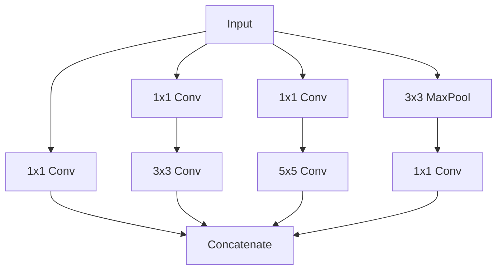

# Convolutional Neural Networks

Convolutional neural networks exploit the spatial structure of images by using local connectivity, weight sharing, and translation equivariance. This page derives the convolution operation mathematically, traces the evolution from LeNet to EfficientNet, implements a CNN from scratch in PyTorch, trains it on CIFAR-10, and visualizes learned features.

## The Convolution Operation

### Discrete 2D Convolution

For an input image $I$ and a kernel (filter) $K$ of size $k \times k$:

$$
(I * K)(i, j) = \sum_{m=0}^{k-1} \sum_{n=0}^{k-1} I(i+m, j+n) \cdot K(m, n)
$$

Technically, this is cross-correlation. True convolution flips the kernel, but deep learning uses cross-correlation and calls it "convolution."

### Multi-Channel Convolution

For an input with $C_{in}$ channels and $C_{out}$ filters:

$$
O_f(i, j) = b_f + \sum_{c=1}^{C_{in}} \sum_{m=0}^{k-1} \sum_{n=0}^{k-1} I_c(i \cdot s + m, j \cdot s + n) \cdot K_{f,c}(m, n)
$$

where $f$ indexes the output filter, $c$ indexes the input channel, $s$ is the stride, and $b_f$ is the bias.

### Output Size Formula

For input size $W$, kernel size $K$, padding $P$, and stride $S$:

$$
O = \left\lfloor \frac{W - K + 2P}{S} \right\rfloor + 1
$$

**Examples:**

| Input | Kernel | Padding | Stride | Output |
|-------|--------|---------|--------|--------|
| 32 | 3 | 1 | 1 | 32 (same padding) |
| 32 | 3 | 0 | 1 | 30 |
| 32 | 5 | 2 | 1 | 32 |
| 32 | 3 | 1 | 2 | 16 (halved) |
| 224 | 7 | 3 | 2 | 112 |

### Parameter Count

A Conv2d layer with $C_{in}$ input channels, $C_{out}$ output channels, and kernel size $k$:

$$
\text{Parameters} = C_{out} \times (C_{in} \times k^2 + 1)
$$

The $+1$ is for the bias per filter.

**Example:** `Conv2d(3, 64, 3)` has $64 \times (3 \times 9 + 1) = 1{,}792$ parameters.

### Why Convolutions Beat Fully Connected

For a 224x224x3 image:
- Fully connected to 1000 neurons: $224 \times 224 \times 3 \times 1000 = 150M$ parameters
- Conv2d(3, 64, 3): $1{,}792$ parameters

Convolutions exploit:
1. **Local connectivity:** Each neuron sees only a small receptive field
2. **Weight sharing:** Same filter applied everywhere
3. **Translation equivariance:** A cat is a cat regardless of position

## Pooling

Pooling reduces spatial dimensions, providing translation invariance and reducing computation.

### Max Pooling

$$
\text{MaxPool}(i, j) = \max_{(m,n) \in R_{ij}} I(m, n)
$$

where $R_{ij}$ is the pooling region centered at $(i, j)$.

### Average Pooling

$$
\text{AvgPool}(i, j) = \frac{1}{|R_{ij}|} \sum_{(m,n) \in R_{ij}} I(m, n)
$$

### Global Average Pooling (GAP)

Takes the mean over the entire spatial dimension, reducing $H \times W \times C$ to $1 \times 1 \times C$. Replaced fully connected layers in modern architectures (starting with GoogLeNet):

```python
# PyTorch
gap = nn.AdaptiveAvgPool2d(1)  # Output: (batch, channels, 1, 1)
```

## Architecture Evolution

### LeNet-5 (1998)

The first successful CNN. Yann LeCun used it for digit recognition.

```python
class LeNet5(nn.Module):
    def __init__(self):
        super().__init__()
        self.features = nn.Sequential(
            nn.Conv2d(1, 6, 5),         # 28x28 -> 24x24
            nn.Tanh(),
            nn.AvgPool2d(2, 2),         # 24x24 -> 12x12
            nn.Conv2d(6, 16, 5),        # 12x12 -> 8x8
            nn.Tanh(),
            nn.AvgPool2d(2, 2),         # 8x8 -> 4x4
        )
        self.classifier = nn.Sequential(
            nn.Linear(16 * 4 * 4, 120),
            nn.Tanh(),
            nn.Linear(120, 84),
            nn.Tanh(),
            nn.Linear(84, 10),
        )

    def forward(self, x):
        x = self.features(x)
        x = x.view(x.size(0), -1)
        return self.classifier(x)
```

### AlexNet (2012)

Won ImageNet 2012 by a huge margin. Key innovations: ReLU, dropout, data augmentation, GPU training.

- 5 conv layers, 3 FC layers, ~60M parameters
- First to use ReLU instead of tanh
- Trained on 2 GTX 580 GPUs (3GB VRAM each)
- Top-5 error: 15.3% (vs 26.2% for second place)

### VGG (2014)

Showed that depth matters. Used only 3x3 convolutions stacked deep.

**Key insight:** Two 3x3 convolutions have the same receptive field as one 5x5, but with fewer parameters and more nonlinearity:

$$
\text{Two 3x3: } 2 \times (3^2 C^2) = 18C^2 \quad \text{vs.} \quad \text{One 5x5: } 25C^2
$$

VGG-16: 16 weight layers, ~138M parameters. Simple and elegant but very memory-hungry.

### GoogLeNet/Inception (2014)

Introduced the Inception module --- parallel convolutions of different kernel sizes concatenated:



1x1 convolutions reduce channel dimensions before expensive 3x3 and 5x5 convolutions (bottleneck).

### ResNet (2015)

The breakthrough that enabled very deep networks (100+ layers). Introduced skip connections (residual learning).

**The degradation problem:** Deeper networks had higher training error than shallow ones --- not overfitting, but optimization difficulty. Adding layers to a good network should not hurt (at worst, the extra layers learn identity).

**Residual block:**

$$
y = F(x, \{W_i\}) + x
$$

Instead of learning $H(x)$ directly, the network learns the residual $F(x) = H(x) - x$. Learning "how to modify the input" is easier than learning the output from scratch.

```python
class ResidualBlock(nn.Module):
    def __init__(self, in_channels, out_channels, stride=1):
        super().__init__()
        self.conv1 = nn.Conv2d(in_channels, out_channels, 3,
                               stride=stride, padding=1, bias=False)
        self.bn1 = nn.BatchNorm2d(out_channels)
        self.conv2 = nn.Conv2d(out_channels, out_channels, 3,
                               stride=1, padding=1, bias=False)
        self.bn2 = nn.BatchNorm2d(out_channels)

        self.shortcut = nn.Sequential()
        if stride != 1 or in_channels != out_channels:
            self.shortcut = nn.Sequential(
                nn.Conv2d(in_channels, out_channels, 1,
                         stride=stride, bias=False),
                nn.BatchNorm2d(out_channels),
            )

    def forward(self, x):
        out = torch.relu(self.bn1(self.conv1(x)))
        out = self.bn2(self.conv2(out))
        out += self.shortcut(x)  # Skip connection
        out = torch.relu(out)
        return out
```

### Bottleneck Block (ResNet-50+)

For deeper ResNets, a bottleneck reduces computation:

$$
1 \times 1 \text{ (reduce)} \to 3 \times 3 \text{ (process)} \to 1 \times 1 \text{ (expand)}
$$

```python
class Bottleneck(nn.Module):
    expansion = 4

    def __init__(self, in_channels, mid_channels, stride=1):
        super().__init__()
        out_channels = mid_channels * self.expansion
        self.conv1 = nn.Conv2d(in_channels, mid_channels, 1, bias=False)
        self.bn1 = nn.BatchNorm2d(mid_channels)
        self.conv2 = nn.Conv2d(mid_channels, mid_channels, 3,
                               stride=stride, padding=1, bias=False)
        self.bn2 = nn.BatchNorm2d(mid_channels)
        self.conv3 = nn.Conv2d(mid_channels, out_channels, 1, bias=False)
        self.bn3 = nn.BatchNorm2d(out_channels)

        self.shortcut = nn.Sequential()
        if stride != 1 or in_channels != out_channels:
            self.shortcut = nn.Sequential(
                nn.Conv2d(in_channels, out_channels, 1,
                         stride=stride, bias=False),
                nn.BatchNorm2d(out_channels),
            )

    def forward(self, x):
        out = torch.relu(self.bn1(self.conv1(x)))
        out = torch.relu(self.bn2(self.conv2(out)))
        out = self.bn3(self.conv3(out))
        out += self.shortcut(x)
        return torch.relu(out)
```

### EfficientNet (2019)

Systematically scales depth, width, and resolution together using compound scaling:

$$
\text{depth: } d = \alpha^\phi, \quad \text{width: } w = \beta^\phi, \quad \text{resolution: } r = \gamma^\phi
$$

subject to $\alpha \cdot \beta^2 \cdot \gamma^2 \approx 2$ (to roughly double FLOPS when $\phi$ increases by 1).

Uses MBConv blocks (mobile inverted bottleneck with squeeze-and-excitation).

### Architecture Timeline

| Year | Architecture | Top-5 Error | Key Innovation |
|------|-------------|-------------|----------------|
| 1998 | LeNet-5 | N/A | First CNN |
| 2012 | AlexNet | 15.3% | ReLU, GPU training |
| 2014 | VGG-16 | 7.3% | Deep 3x3 stacks |
| 2014 | GoogLeNet | 6.7% | Inception module |
| 2015 | ResNet-152 | 3.6% | Skip connections |
| 2017 | SENet | 2.3% | Channel attention |
| 2019 | EfficientNet-B7 | 2.9% | Compound scaling |
| 2021 | ViT | ~1.5% | Transformer on patches |

## Transfer Learning with Pretrained CNNs

Use pretrained ImageNet weights as a starting point for your task.

```python
import torchvision.models as models

# Load pretrained ResNet-50
model = models.resnet50(weights=models.ResNet50_Weights.IMAGENET1K_V2)

# Replace final layer for your number of classes
num_classes = 5
model.fc = nn.Linear(model.fc.in_features, num_classes)

# Option 1: Fine-tune all layers
optimizer = optim.Adam(model.parameters(), lr=1e-4)

# Option 2: Freeze backbone, train only head
for param in model.parameters():
    param.requires_grad = False
for param in model.fc.parameters():
    param.requires_grad = True
optimizer = optim.Adam(model.fc.parameters(), lr=1e-3)

# Option 3: Gradual unfreezing (train head first, then unfreeze)
# Train head for 5 epochs, then unfreeze all and train with lower LR
```

## Complete CNN: CIFAR-10

```python
import torch
import torch.nn as nn
import torch.optim as optim
import torchvision
import torchvision.transforms as T
from torch.utils.data import DataLoader

# ── Data ─────────────────────────────────────────────────────────────
train_transform = T.Compose([
    T.RandomCrop(32, padding=4),
    T.RandomHorizontalFlip(),
    T.ToTensor(),
    T.Normalize((0.4914, 0.4822, 0.4465), (0.2470, 0.2435, 0.2616)),
])

train_set = torchvision.datasets.CIFAR10(
    './data', train=True, download=True, transform=train_transform)
test_set = torchvision.datasets.CIFAR10(
    './data', train=False, download=True,
    transform=T.Compose([
        T.ToTensor(),
        T.Normalize((0.4914, 0.4822, 0.4465), (0.2470, 0.2435, 0.2616)),
    ]))

train_loader = DataLoader(train_set, batch_size=128, shuffle=True, num_workers=2)
test_loader = DataLoader(test_set, batch_size=128, shuffle=False, num_workers=2)

# ── Model ────────────────────────────────────────────────────────────
class SmallResNet(nn.Module):
    def __init__(self, num_classes=10):
        super().__init__()
        self.conv1 = nn.Conv2d(3, 64, 3, padding=1, bias=False)
        self.bn1 = nn.BatchNorm2d(64)

        self.layer1 = self._make_layer(64, 64, 2, stride=1)
        self.layer2 = self._make_layer(64, 128, 2, stride=2)
        self.layer3 = self._make_layer(128, 256, 2, stride=2)

        self.gap = nn.AdaptiveAvgPool2d(1)
        self.fc = nn.Linear(256, num_classes)

    def _make_layer(self, in_ch, out_ch, num_blocks, stride):
        layers = [ResidualBlock(in_ch, out_ch, stride)]
        for _ in range(1, num_blocks):
            layers.append(ResidualBlock(out_ch, out_ch, 1))
        return nn.Sequential(*layers)

    def forward(self, x):
        x = torch.relu(self.bn1(self.conv1(x)))
        x = self.layer1(x)
        x = self.layer2(x)
        x = self.layer3(x)
        x = self.gap(x)
        x = x.view(x.size(0), -1)
        return self.fc(x)

# ── Train ────────────────────────────────────────────────────────────
device = torch.device('cuda' if torch.cuda.is_available() else 'cpu')
model = SmallResNet().to(device)
criterion = nn.CrossEntropyLoss()
optimizer = optim.SGD(model.parameters(), lr=0.1, momentum=0.9, weight_decay=5e-4)
scheduler = optim.lr_scheduler.CosineAnnealingLR(optimizer, T_max=200)

for epoch in range(200):
    model.train()
    for inputs, targets in train_loader:
        inputs, targets = inputs.to(device), targets.to(device)
        optimizer.zero_grad()
        loss = criterion(model(inputs), targets)
        loss.backward()
        optimizer.step()
    scheduler.step()

    if (epoch + 1) % 10 == 0:
        model.eval()
        correct = sum(
            (model(x.to(device)).argmax(1) == y.to(device)).sum().item()
            for x, y in test_loader
        )
        print(f"Epoch {epoch+1}: {100*correct/len(test_set):.2f}%")

# Expected: ~93% after 200 epochs
```

## Visualizing Feature Maps

```python
import matplotlib.pyplot as plt

def visualize_features(model, image, layer_name='conv1'):
    """Visualize feature maps of a specific layer."""
    activation = {}

    def hook_fn(module, input, output):
        activation[layer_name] = output.detach()

    # Register hook
    layer = dict(model.named_modules())[layer_name]
    hook = layer.register_forward_hook(hook_fn)

    # Forward pass
    model.eval()
    with torch.no_grad():
        model(image.unsqueeze(0).to(next(model.parameters()).device))

    hook.remove()

    # Plot first 16 feature maps
    feat = activation[layer_name].cpu().squeeze(0)
    fig, axes = plt.subplots(4, 4, figsize=(10, 10))
    for i, ax in enumerate(axes.flat):
        if i < feat.size(0):
            ax.imshow(feat[i], cmap='viridis')
        ax.axis('off')
    plt.suptitle(f'Feature Maps: {layer_name}')
    plt.tight_layout()
    plt.show()
```

## 1x1 Convolutions

A $1 \times 1$ convolution is a per-pixel fully connected layer across channels. It:

1. **Reduces/increases channel dimensions** (bottleneck)
2. **Adds nonlinearity** (with activation after it)
3. **Mixes channel information** without spatial mixing

```python
# Reduce 512 channels to 64
bottleneck = nn.Conv2d(512, 64, kernel_size=1)
# Parameters: 512 * 64 + 64 = 32,832
```

## Receptive Field

The receptive field is the region of the input that influences a particular output neuron. It grows with depth.

For a stack of $n$ layers with kernel size $k$ and stride 1:

$$
\text{Receptive field} = n(k - 1) + 1
$$

For a layer with stride $s$ on top of receptive field $r$:

$$
r_{new} = r + (k - 1) \times \prod_{i} s_i
$$

## Cross-References

- **Foundations:** [Neural Network Basics](/deep-learning/neural-network-basics) --- backprop, activations
- **Training:** [Training Techniques](/deep-learning/training-techniques) --- BatchNorm, dropout, augmentation
- **Beyond CNNs:** [Transformers](/deep-learning/transformers) --- ViT applies transformers to images
- **Detection:** [Object Detection](/deep-learning/object-detection) --- using CNN backbones for localization
- **Segmentation:** [Image Segmentation](/deep-learning/image-segmentation) --- pixel-level classification
- **Transfer learning:** [Transfer Learning](/deep-learning/transfer-learning) --- using pretrained CNNs
- **Optimize for deployment:** [Model Optimization](/deep-learning/model-optimization) --- pruning, quantization
