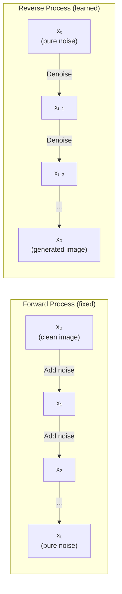
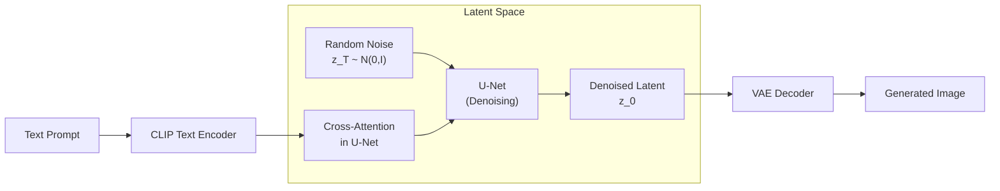

# Diffusion Models

Diffusion models generate data by learning to reverse a gradual noise-adding process. Starting from pure noise, the model iteratively denoises to produce realistic images. They have surpassed GANs in image quality and now power Stable Diffusion, DALL-E, Midjourney, and Sora. This page derives the forward and reverse processes, implements DDPM, explains classifier-free guidance, details the Stable Diffusion architecture, and covers LoRA and ControlNet.

## The Idea



## Forward Diffusion Process

Gradually add Gaussian noise over $T$ steps:

$$
q(x_t | x_{t-1}) = \mathcal{N}(x_t; \sqrt{1 - \beta_t} \, x_{t-1}, \beta_t I)
$$

where $\beta_t \in (0, 1)$ is the noise schedule (how much noise to add at step $t$).

### Direct Sampling at Any Timestep

Using $\alpha_t = 1 - \beta_t$ and $\bar{\alpha}_t = \prod_{s=1}^{t} \alpha_s$:

$$
q(x_t | x_0) = \mathcal{N}(x_t; \sqrt{\bar{\alpha}_t} \, x_0, (1 - \bar{\alpha}_t) I)
$$

This means we can sample $x_t$ directly from $x_0$ without iterating:

$$
x_t = \sqrt{\bar{\alpha}_t} \, x_0 + \sqrt{1 - \bar{\alpha}_t} \, \epsilon, \quad \epsilon \sim \mathcal{N}(0, I)
$$

**Derivation:** By recursion. At step 1: $x_1 = \sqrt{\alpha_1} x_0 + \sqrt{1-\alpha_1} \epsilon_1$. At step 2: $x_2 = \sqrt{\alpha_2} x_1 + \sqrt{1-\alpha_2} \epsilon_2$. Substituting and using the fact that the sum of two independent Gaussians $\mathcal{N}(0, \sigma_1^2) + \mathcal{N}(0, \sigma_2^2) = \mathcal{N}(0, \sigma_1^2 + \sigma_2^2)$:

$$
x_2 = \sqrt{\alpha_1 \alpha_2} x_0 + \sqrt{1 - \alpha_1 \alpha_2} \, \bar{\epsilon}
$$

By induction: $x_t = \sqrt{\bar{\alpha}_t} x_0 + \sqrt{1 - \bar{\alpha}_t} \, \epsilon$.

::: details Worked Example — Forward Noise Addition at Different Timesteps

**Setup:** 1D signal $x_0 = 1.0$ (scalar for simplicity). Linear schedule: $\beta_1 = 0.001$, $\beta_2 = 0.002$, $\beta_3 = 0.003$.

$\alpha_t = 1 - \beta_t$: $\alpha_1 = 0.999$, $\alpha_2 = 0.998$, $\alpha_3 = 0.997$

$\bar{\alpha}_t = \prod_{s=1}^t \alpha_s$: $\bar{\alpha}_1 = 0.999$, $\bar{\alpha}_2 = 0.997$, $\bar{\alpha}_3 = 0.994$

Let $\epsilon = 0.5$ (sampled noise, fixed for illustration).

**Step-by-step noising:**

| $t$ | $\sqrt{\bar{\alpha}_t}$ | $\sqrt{1-\bar{\alpha}_t}$ | $x_t = \sqrt{\bar{\alpha}_t} \cdot 1.0 + \sqrt{1-\bar{\alpha}_t} \cdot 0.5$ |
|---|---|---|---|
| 0 | 1.000 | 0.000 | **1.000** (clean) |
| 1 | 0.9995 | 0.0316 | **1.015** |
| 2 | 0.9985 | 0.0548 | **1.026** |
| 3 | 0.9970 | 0.0775 | **1.036** |
| 100 | ~0.951 | ~0.309 | **1.106** |
| 500 | ~0.607 | ~0.795 | **1.004** |
| 1000 | ~0.006 | ~1.000 | **0.506** (mostly noise) |

**Result:** At $t=0$, the signal is pure. At early steps ($t=1,2,3$), noise is barely perceptible. By $t=1000$ with a full schedule, $\sqrt{\bar{\alpha}_{1000}} \approx 0.006$, so only 0.6% of the original signal remains --- it's essentially pure noise. The model must learn to reverse this entire process.

:::

## Reverse Process

The reverse process is also Gaussian (for small $\beta_t$):

$$
p_\theta(x_{t-1} | x_t) = \mathcal{N}(x_{t-1}; \mu_\theta(x_t, t), \sigma_t^2 I)
$$

The model learns $\mu_\theta$ by predicting the noise $\epsilon_\theta(x_t, t)$ that was added.

### Predicting Noise

Given $x_t = \sqrt{\bar{\alpha}_t} x_0 + \sqrt{1 - \bar{\alpha}_t} \epsilon$, rearranging:

$$
x_0 = \frac{x_t - \sqrt{1 - \bar{\alpha}_t} \epsilon}{\sqrt{\bar{\alpha}_t}}
$$

Substituting into the posterior mean:

$$
\mu_\theta(x_t, t) = \frac{1}{\sqrt{\alpha_t}} \left(x_t - \frac{\beta_t}{\sqrt{1 - \bar{\alpha}_t}} \epsilon_\theta(x_t, t)\right)
$$

### Training Objective

The simplified DDPM loss:

$$
\mathcal{L}_{\text{simple}} = \mathbb{E}_{t, x_0, \epsilon}\left[\|\epsilon - \epsilon_\theta(x_t, t)\|^2\right]
$$

This is just MSE between the true noise and the predicted noise.

### Training Algorithm

```
repeat:
    x_0 ~ q(x_0)                    # Sample clean image
    t ~ Uniform({1, ..., T})         # Random timestep
    ε ~ N(0, I)                      # Random noise
    x_t = √ᾱ_t · x_0 + √(1-ᾱ_t) · ε  # Noisy image
    Take gradient step on ‖ε - ε_θ(x_t, t)‖²
until converged
```

### Sampling Algorithm

```
x_T ~ N(0, I)                       # Start from noise
for t = T, T-1, ..., 1:
    z ~ N(0, I) if t > 1, else z = 0
    x_{t-1} = (1/√α_t)(x_t - β_t/√(1-ᾱ_t) · ε_θ(x_t, t)) + σ_t · z
return x_0
```

## Noise Schedules

### Linear Schedule

$$
\beta_t = \beta_1 + \frac{t-1}{T-1}(\beta_T - \beta_1)
$$

Original DDPM: $\beta_1 = 10^{-4}$, $\beta_T = 0.02$, $T = 1000$.

### Cosine Schedule

$$
\bar{\alpha}_t = \frac{f(t)}{f(0)}, \quad f(t) = \cos\left(\frac{t/T + s}{1 + s} \cdot \frac{\pi}{2}\right)^2
$$

Produces a more gradual noise increase, better for high-resolution images.

```python
import torch
import numpy as np

def cosine_schedule(T, s=0.008):
    steps = torch.linspace(0, T, T + 1)
    f_t = torch.cos((steps / T + s) / (1 + s) * np.pi / 2) ** 2
    alpha_bar = f_t / f_t[0]
    betas = 1 - alpha_bar[1:] / alpha_bar[:-1]
    return torch.clamp(betas, 0.0001, 0.999)
```

## U-Net for Diffusion

The denoising network is typically a U-Net with:
- **Time embedding:** Sinusoidal + MLP, added to each block
- **Residual blocks:** ConvBlock with GroupNorm
- **Self-attention:** At lower resolutions (16x16, 8x8)
- **Cross-attention:** For conditioning (text, class)

```python
import torch
import torch.nn as nn
import math

class SinusoidalTimeEmbedding(nn.Module):
    def __init__(self, dim):
        super().__init__()
        self.dim = dim

    def forward(self, t):
        half = self.dim // 2
        freqs = torch.exp(-math.log(10000) * torch.arange(half, device=t.device) / half)
        args = t[:, None].float() * freqs[None]
        return torch.cat([torch.cos(args), torch.sin(args)], dim=-1)


class ResBlock(nn.Module):
    def __init__(self, in_ch, out_ch, time_dim):
        super().__init__()
        self.conv1 = nn.Sequential(
            nn.GroupNorm(8, in_ch),
            nn.SiLU(),
            nn.Conv2d(in_ch, out_ch, 3, padding=1),
        )
        self.time_mlp = nn.Sequential(
            nn.SiLU(),
            nn.Linear(time_dim, out_ch),
        )
        self.conv2 = nn.Sequential(
            nn.GroupNorm(8, out_ch),
            nn.SiLU(),
            nn.Conv2d(out_ch, out_ch, 3, padding=1),
        )
        self.skip = nn.Conv2d(in_ch, out_ch, 1) if in_ch != out_ch else nn.Identity()

    def forward(self, x, t_emb):
        h = self.conv1(x)
        h = h + self.time_mlp(t_emb)[:, :, None, None]
        h = self.conv2(h)
        return h + self.skip(x)


class SimpleDiffusionUNet(nn.Module):
    def __init__(self, in_ch=3, dim=64, time_dim=256):
        super().__init__()
        self.time_emb = nn.Sequential(
            SinusoidalTimeEmbedding(time_dim),
            nn.Linear(time_dim, time_dim),
            nn.SiLU(),
            nn.Linear(time_dim, time_dim),
        )
        # Encoder
        self.down1 = ResBlock(in_ch, dim, time_dim)
        self.down2 = ResBlock(dim, dim * 2, time_dim)
        self.pool = nn.MaxPool2d(2)
        # Bottleneck
        self.bot = ResBlock(dim * 2, dim * 2, time_dim)
        # Decoder
        self.up2 = ResBlock(dim * 4, dim, time_dim)
        self.up1 = ResBlock(dim * 2, dim, time_dim)
        self.upsample = nn.Upsample(scale_factor=2, mode='bilinear', align_corners=False)
        self.out = nn.Conv2d(dim, in_ch, 1)

    def forward(self, x, t):
        t_emb = self.time_emb(t)
        d1 = self.down1(x, t_emb)
        d2 = self.down2(self.pool(d1), t_emb)
        b = self.bot(self.pool(d2), t_emb)
        u2 = self.up2(torch.cat([self.upsample(b), d2], dim=1), t_emb)
        u1 = self.up1(torch.cat([self.upsample(u2), d1], dim=1), t_emb)
        return self.out(u1)
```

## Classifier-Free Guidance

Classifier-free guidance (Ho and Salimans, 2022) trades diversity for quality by amplifying the conditional signal.

During training, randomly drop the conditioning (set it to null) with probability $p_{\text{uncond}}$ (e.g., 10%):

$$
\epsilon_\theta(x_t, t, c) \quad \text{and} \quad \epsilon_\theta(x_t, t, \varnothing)
$$

During sampling, interpolate between conditional and unconditional predictions:

$$
\tilde{\epsilon} = \epsilon_\theta(x_t, t, \varnothing) + w \cdot (\epsilon_\theta(x_t, t, c) - \epsilon_\theta(x_t, t, \varnothing))
$$

where $w$ is the guidance scale. Higher $w$ means stronger adherence to the condition (more faithful but less diverse). Typical values: $w = 7.5$ for Stable Diffusion.

::: details Worked Example — Classifier-Free Guidance

**Setup:** At one denoising step, the model produces noise predictions (scalar for simplicity):

- Unconditional prediction: $\epsilon_\theta(x_t, t, \varnothing) = 0.3$ (generic noise)
- Conditional prediction (prompt "a cat"): $\epsilon_\theta(x_t, t, c) = 0.8$ (cat-specific noise)

**Different guidance scales:**

| $w$ | $\tilde{\epsilon} = 0.3 + w(0.8 - 0.3)$ | Effect |
|---|---|---|
| 0 | $0.3 + 0(0.5) = 0.3$ | Ignore condition entirely |
| 1 | $0.3 + 1(0.5) = 0.8$ | Standard conditional (no amplification) |
| 3 | $0.3 + 3(0.5) = 1.8$ | Moderately amplified |
| 7.5 | $0.3 + 7.5(0.5) = 4.05$ | Strongly amplified (typical SD setting) |
| 15 | $0.3 + 15(0.5) = 7.8$ | Very strongly amplified (oversaturated) |

**Result:** At $w = 7.5$, the guidance amplifies the difference between conditional and unconditional by 7.5x. This pushes the generation strongly toward "cat-like" images. Too-high guidance ($w > 15$) produces oversaturated, artifact-heavy images because the noise prediction is pushed far beyond the training distribution.

:::

## Stable Diffusion Architecture

Stable Diffusion operates in a compressed latent space rather than pixel space, making it tractable:



### Components

1. **VAE encoder:** Compress images from $512 \times 512 \times 3$ to $64 \times 64 \times 4$ latent space (8x spatial compression)
2. **U-Net:** Predict noise in latent space (with cross-attention for text conditioning)
3. **CLIP text encoder:** Convert text prompt to embeddings for cross-attention
4. **VAE decoder:** Decompress denoised latent back to pixel space

### Why Latent Space?

Operating at $64 \times 64$ instead of $512 \times 512$ means:
- $64\times$ fewer pixels
- Attention is $64^2 = 4096$ instead of $512^2 = 262{,}144$ (quadratic savings)
- Training on a single A100 instead of a cluster

## LoRA: Low-Rank Adaptation

LoRA (Hu et al., 2022) fine-tunes large models by adding small trainable matrices:

$$
W' = W + \Delta W = W + BA
$$

where $B \in \mathbb{R}^{d \times r}$, $A \in \mathbb{R}^{r \times k}$, and $r \ll \min(d, k)$.

::: details Worked Example — LoRA Parameter Savings

**Setup:** A linear layer $W \in \mathbb{R}^{4096 \times 4096}$ (typical in LLaMA 7B)

Full fine-tuning: $4096 \times 4096 = 16{,}777{,}216$ parameters to update.

**LoRA with rank $r = 4$:**
$$\Delta W = BA, \quad B \in \mathbb{R}^{4096 \times 4}, \quad A \in \mathbb{R}^{4 \times 4096}$$

LoRA parameters: $4096 \times 4 + 4 \times 4096 = 16{,}384 + 16{,}384 = 32{,}768$

**Savings:** $32{,}768 / 16{,}777{,}216 = 0.2\%$ of original parameters.

**LoRA with rank $r = 16$:**
$$\text{params} = 4096 \times 16 \times 2 = 131{,}072 \quad (0.8\%)$$

**Result:** LoRA with $r = 4$ trains only 0.2% of the parameters while typically retaining 95-99% of full fine-tuning performance. For a 7B model with ~200 linear layers, total LoRA params at $r = 4$ would be ~$200 \times 32{,}768 = 6.5M$ (vs 7B for full fine-tuning --- a 1000x reduction).

:::

### Parameter Savings

| Model | Full Fine-Tune | LoRA (r=4) | LoRA (r=16) |
|-------|---------------|-----------|-------------|
| Stable Diffusion | 860M | 3.2M (0.4%) | 12.8M (1.5%) |
| LLaMA 7B | 7B | 4.2M (0.06%) | 16.8M (0.24%) |

```python
# Using PEFT library
from peft import LoraConfig, get_peft_model

lora_config = LoraConfig(
    r=16,                    # Rank
    lora_alpha=32,           # Scaling factor
    target_modules=["q_proj", "v_proj"],  # Which layers
    lora_dropout=0.05,
)

model = get_peft_model(base_model, lora_config)
model.print_trainable_parameters()
# trainable params: 16,777,216 || all params: 7,000,000,000 || trainable%: 0.24
```

## ControlNet

ControlNet (Zhang et al., 2023) adds spatial conditioning (edges, depth, pose) to Stable Diffusion by creating a trainable copy of the encoder blocks:

$$
y_c = F(x; \Theta) + \mathcal{Z}(F(x + \mathcal{Z}(c; \Theta_z1); \Theta_c); \Theta_{z2})
$$

where $\mathcal{Z}$ is a zero-initialized convolution that starts at zero and gradually learns to incorporate the condition.

### Conditioning Types

| Condition | Source | Use Case |
|-----------|--------|----------|
| Canny edges | Edge detection | Preserve structure |
| Depth map | MiDaS | 3D-aware generation |
| OpenPose | Pose estimation | Character poses |
| Segmentation | Semantic map | Scene layout |
| Scribble | User drawing | Guided creation |

## DDIM: Faster Sampling

DDPM requires $T = 1000$ steps. DDIM (Song et al., 2021) enables deterministic sampling with far fewer steps (20-50) by using a non-Markovian reverse process:

$$
x_{t-1} = \sqrt{\bar{\alpha}_{t-1}} \cdot \underbrace{\frac{x_t - \sqrt{1-\bar{\alpha}_t} \epsilon_\theta}{\sqrt{\bar{\alpha}_t}}}_{\text{predicted } x_0} + \sqrt{1 - \bar{\alpha}_{t-1}} \cdot \epsilon_\theta
$$

This is deterministic ($\eta = 0$), making it reproducible with the same seed.

## Minimal DDPM Training Loop

```python
import torch
import torch.nn as nn
from torchvision import datasets, transforms
from torch.utils.data import DataLoader

# ── Noise schedule ───────────────────────────────────────────────────
def linear_schedule(T=1000, beta_start=1e-4, beta_end=0.02):
    betas = torch.linspace(beta_start, beta_end, T)
    alphas = 1 - betas
    alpha_bar = torch.cumprod(alphas, dim=0)
    return betas, alphas, alpha_bar

T = 1000
betas, alphas, alpha_bar = linear_schedule(T)

# ── Forward diffusion ────────────────────────────────────────────────
def q_sample(x_0, t, noise=None):
    """Add noise to x_0 at timestep t."""
    if noise is None:
        noise = torch.randn_like(x_0)
    sqrt_alpha_bar = alpha_bar[t].sqrt().view(-1, 1, 1, 1)
    sqrt_one_minus = (1 - alpha_bar[t]).sqrt().view(-1, 1, 1, 1)
    return sqrt_alpha_bar * x_0 + sqrt_one_minus * noise, noise

# ── Data ─────────────────────────────────────────────────────────────
transform = transforms.Compose([
    transforms.Resize(32),
    transforms.ToTensor(),
    transforms.Normalize([0.5], [0.5]),
])
dataset = datasets.MNIST('./data', train=True, download=True, transform=transform)
loader = DataLoader(dataset, batch_size=128, shuffle=True)

# ── Training ─────────────────────────────────────────────────────────
device = 'cuda' if torch.cuda.is_available() else 'cpu'
model = SimpleDiffusionUNet(in_ch=1, dim=64).to(device)
alpha_bar = alpha_bar.to(device)
optimizer = torch.optim.Adam(model.parameters(), lr=2e-4)

for epoch in range(50):
    total_loss = 0
    for images, _ in loader:
        images = images.to(device)
        t = torch.randint(0, T, (images.size(0),), device=device)
        noise = torch.randn_like(images)
        x_t, _ = q_sample(images, t, noise)

        predicted_noise = model(x_t, t)
        loss = nn.MSELoss()(predicted_noise, noise)

        optimizer.zero_grad()
        loss.backward()
        optimizer.step()
        total_loss += loss.item()

    if (epoch + 1) % 10 == 0:
        print(f"Epoch {epoch+1}: Loss={total_loss / len(loader):.4f}")

# ── Sampling ─────────────────────────────────────────────────────────
@torch.no_grad()
def p_sample(model, x_t, t):
    """Single reverse step."""
    beta_t = betas[t].to(device)
    alpha_t = alphas[t].to(device)
    alpha_bar_t = alpha_bar[t].to(device)

    eps = model(x_t, torch.tensor([t], device=device).expand(x_t.size(0)))
    mean = (1 / alpha_t.sqrt()) * (x_t - beta_t / (1 - alpha_bar_t).sqrt() * eps)

    if t > 0:
        noise = torch.randn_like(x_t)
        return mean + beta_t.sqrt() * noise
    return mean

@torch.no_grad()
def sample(model, shape=(16, 1, 32, 32)):
    x = torch.randn(shape, device=device)
    for t in reversed(range(T)):
        x = p_sample(model, x, t)
    return x

samples = sample(model)
```

## Diffusion vs GANs vs VAEs

| Feature | Diffusion | GAN | VAE |
|---------|-----------|-----|-----|
| Training stability | Excellent | Poor | Good |
| Sample quality | Excellent | Excellent | Blurry |
| Diversity | Excellent | Mode collapse risk | Good |
| Sampling speed | Slow (many steps) | Fast (single pass) | Fast (single pass) |
| Likelihood | Tractable bound | None | Tractable bound (ELBO) |
| Controllability | Excellent (guidance) | Moderate | Moderate |
| Current SOTA (2026) | Yes | No | No |

## Practical Tips for Diffusion Models

1. **Start with pretrained models:** Do not train Stable Diffusion from scratch. Use LoRA or DreamBooth for customization.
2. **Guidance scale matters:** $w = 7.5$ is a good default. Higher values are more faithful but less creative.
3. **Schedulers affect quality:** DDIM for speed (20 steps), DPM-Solver++ for quality (20-50 steps), Euler for balance.
4. **Negative prompts help:** "blurry, low quality, distorted" in the negative prompt improves output.
5. **Seed control:** Set seeds for reproducibility. Same prompt + seed + settings = same image.

## Cross-References

- **Autoencoders:** [Autoencoders](/deep-learning/autoencoders) --- VAE for latent space
- **GANs:** [GANs](/deep-learning/gans) --- previous state-of-the-art for generation
- **U-Net:** [Image Segmentation](/deep-learning/image-segmentation) --- U-Net architecture
- **Text conditioning:** [Transformers](/deep-learning/transformers) --- cross-attention
- **CLIP:** [Multimodal Models](/deep-learning/multimodal-models) --- text encoder
- **Efficiency:** [Model Optimization](/deep-learning/model-optimization) --- LoRA, quantization
