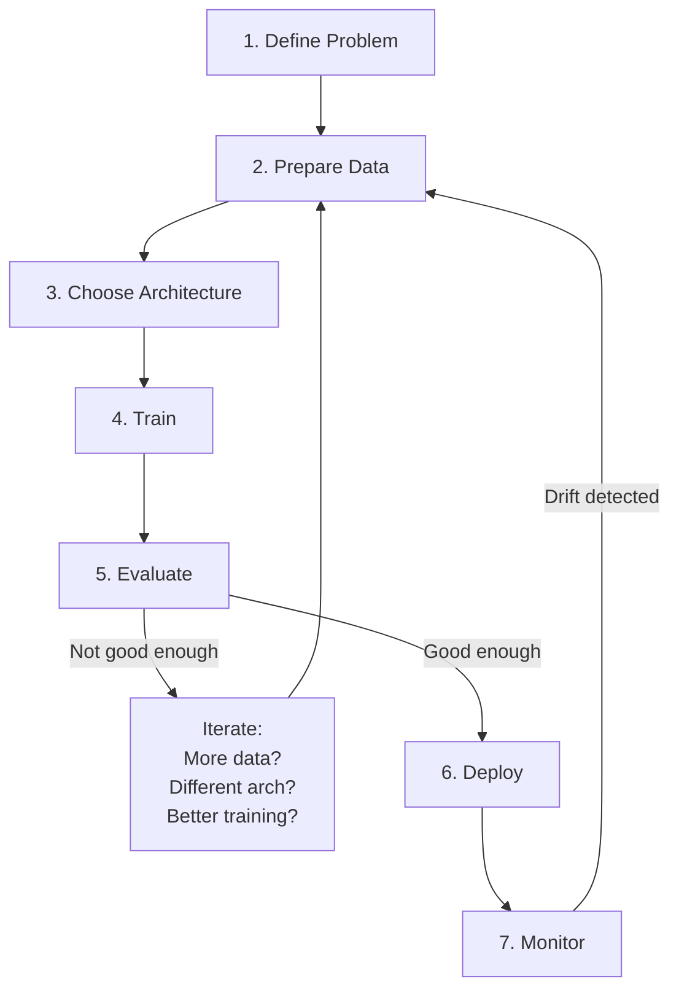
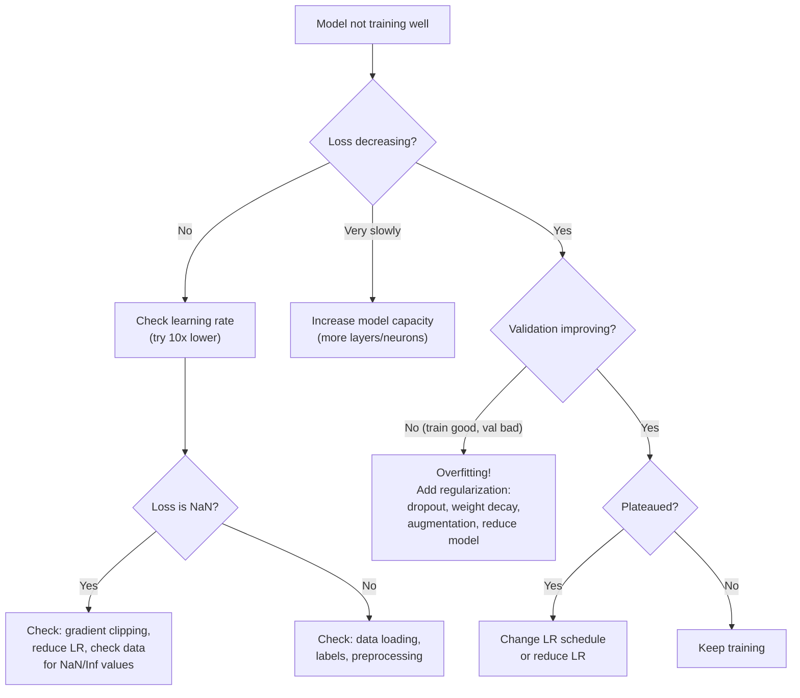

# Deep Learning Project Checklist

This 40-item checklist covers every phase of a deep learning project, from problem definition through deployment and monitoring. Use it as a pre-flight check before starting any DL project and as a review guide before shipping to production.

## Phase 1: Problem Definition (Items 1--5)

### 1. Define the Problem Clearly

- [ ] Can you state the problem in one sentence?
- [ ] What is the input? What is the output?
- [ ] Is this classification, regression, generation, detection, or segmentation?
- [ ] What metric defines success? (accuracy, F1, BLEU, FID, latency)

### 2. Verify Deep Learning Is Needed

- [ ] Have you tried simpler baselines? (logistic regression, random forest, XGBoost)
- [ ] Is the data unstructured (images, text, audio)? If tabular, gradient boosting may win
- [ ] Do you have enough data? (>1K for transfer learning, >10K for training from scratch)
- [ ] Is the expected improvement worth the complexity?

### 3. Set Success Criteria

- [ ] Define a minimum viable accuracy/performance threshold
- [ ] Define latency requirements (max inference time per sample)
- [ ] Define cost constraints (training budget, serving budget)
- [ ] Define a timeline

### 4. Establish a Baseline

- [ ] Random baseline (e.g., random class assignment)
- [ ] Simple heuristic baseline (e.g., majority class, moving average)
- [ ] Classical ML baseline (e.g., XGBoost, SVM)
- [ ] Pretrained model baseline (e.g., off-the-shelf BERT, ResNet)

### 5. Check Ethical Considerations

- [ ] Is the training data representative? Any demographic biases?
- [ ] Could the model cause harm if wrong? (medical, legal, safety)
- [ ] Are there privacy concerns? (PII in training data)
- [ ] Do you have the right to use the data?

## Phase 2: Data (Items 6--14)

### 6. Data Collection

- [ ] Sufficient volume for the task?
- [ ] Representative of the real-world distribution?
- [ ] Proper licensing and usage rights?

### 7. Data Exploration (EDA)

- [ ] Class distribution --- is it balanced?
- [ ] Data quality --- missing values, corrupted files, duplicates?
- [ ] Feature distributions --- outliers, scale differences?
- [ ] Visualize samples from each class/category

### 8. Data Cleaning

- [ ] Remove or fix corrupted samples
- [ ] Handle missing values (impute or remove)
- [ ] Remove exact and near-duplicates
- [ ] Fix labeling errors (spot-check random samples)

### 9. Data Splitting

- [ ] Train/validation/test split (typical: 80/10/10)
- [ ] Stratified split for imbalanced classes
- [ ] No data leakage between splits
- [ ] Time-based split for temporal data (never train on future data)

### 10. Data Preprocessing

- [ ] Normalize inputs (zero mean, unit variance or [0, 1])
- [ ] Compute normalization statistics on training set only
- [ ] Resize/pad images to consistent dimensions
- [ ] Tokenize text with appropriate tokenizer

### 11. Data Augmentation

- [ ] Apply task-appropriate augmentations (flip, crop, color jitter for images)
- [ ] Use advanced augmentation (Mixup, CutMix, RandAugment)
- [ ] Augment only training data, never validation/test
- [ ] Verify augmentations do not change the label semantics

### 12. DataLoader Configuration

- [ ] Appropriate batch size (start with 32-128)
- [ ] Shuffle training data (not validation/test)
- [ ] Sufficient num_workers for parallel loading
- [ ] pin_memory=True for GPU training

### 13. Handle Class Imbalance

- [ ] Weighted loss function (inversely proportional to class frequency)
- [ ] Oversampling minority classes or undersampling majority
- [ ] SMOTE or other synthetic augmentation for tabular data
- [ ] Use appropriate metrics (F1, precision, recall --- not just accuracy)

### 14. Data Version Control

- [ ] Track dataset version (hash, timestamp, or DVC)
- [ ] Document preprocessing steps
- [ ] Store raw data separately from processed data

## Phase 3: Architecture (Items 15--19)

### 15. Choose Architecture

- [ ] Match architecture to data type:
  - Images: CNN (ResNet, EfficientNet) or ViT
  - Text: Transformer (BERT, GPT)
  - Sequences: LSTM/Transformer
  - Graphs: GNN (GCN, GAT)
  - Tabular: MLP or gradient boosting

### 16. Start Simple

- [ ] Begin with the simplest architecture that might work
- [ ] Use pretrained models when available (transfer learning)
- [ ] Add complexity only if simple model underfits

### 17. Model Sizing

- [ ] Model should have at least 10x fewer parameters than training samples (rough rule)
- [ ] Check GPU memory requirements: params x 4 bytes (FP32) x 4 (gradients + optimizer)
- [ ] Start small, scale up if needed

### 18. Regularization

- [ ] Dropout (0.1-0.5 depending on architecture)
- [ ] Weight decay (1e-4 to 1e-2)
- [ ] Batch normalization or layer normalization
- [ ] Data augmentation (the best regularizer)

### 19. Verify Architecture

- [ ] Forward pass works with correct input/output shapes
- [ ] Parameter count is reasonable
- [ ] Model can overfit a small batch (sanity check)

## Phase 4: Training (Items 20--28)

### 20. Optimizer Selection

- [ ] Default: AdamW with lr=3e-4 and weight_decay=0.01
- [ ] Alternative: SGD with momentum for vision (sometimes better generalization)
- [ ] Set appropriate betas for Adam ($\beta_1=0.9$, $\beta_2=0.999$)

### 21. Learning Rate

- [ ] Run LR finder to identify good range
- [ ] Use learning rate scheduling (cosine annealing or one-cycle)
- [ ] Use warmup for transformer training (first 5-10% of steps)

### 22. Weight Initialization

- [ ] He/Kaiming for ReLU layers
- [ ] Xavier/Glorot for sigmoid/tanh layers
- [ ] Load pretrained weights when available

### 23. Sanity Checks Before Full Training

- [ ] Can the model overfit a single batch? (loss should go to ~0)
- [ ] Does loss decrease on first epoch?
- [ ] Are all parameters being updated? (check gradient norms)
- [ ] Is the loss in the expected range for random initialization?

### 24. Training Monitoring

- [ ] Log training and validation loss every epoch
- [ ] Log learning rate
- [ ] Monitor gradient norms (check for vanishing/exploding)
- [ ] Track training and validation accuracy/metrics

### 25. Mixed Precision Training

- [ ] Enable AMP (torch.amp.autocast) for faster training
- [ ] Use GradScaler for FP16 gradient stability
- [ ] Verify no NaN issues

### 26. Gradient Clipping

- [ ] Clip gradient norms to 1.0 (especially for RNNs and transformers)
- [ ] Monitor gradient norms to set appropriate clip value

### 27. Early Stopping

- [ ] Track validation metric
- [ ] Stop if no improvement for N epochs (patience)
- [ ] Save the best checkpoint based on validation metric

### 28. Checkpointing

- [ ] Save model weights, optimizer state, epoch, and best metric
- [ ] Save at regular intervals (not just at the end)
- [ ] Test that you can resume training from a checkpoint

## Phase 5: Evaluation (Items 29--33)

### 29. Evaluate on Held-Out Test Set

- [ ] Never tune hyperparameters on the test set
- [ ] Report metrics on the test set only once (final evaluation)
- [ ] Use model.eval() and torch.no_grad()

### 30. Use Appropriate Metrics

- [ ] Classification: accuracy, precision, recall, F1, AUC-ROC
- [ ] Detection: mAP, IoU
- [ ] Segmentation: mIoU, Dice
- [ ] Generation: FID, IS, BLEU, ROUGE
- [ ] Regression: MSE, MAE, R-squared

### 31. Error Analysis

- [ ] Examine misclassified samples --- patterns?
- [ ] Confusion matrix --- which classes are confused?
- [ ] Performance by subgroup (demographics, data source)
- [ ] Edge cases and failure modes

### 32. Ablation Study

- [ ] What is the impact of each component? (augmentation, regularization, architecture choices)
- [ ] Document which changes helped and which did not

### 33. Compare Against Baselines

- [ ] Is the deep learning model actually better than the classical baseline?
- [ ] Is the improvement statistically significant?
- [ ] Is the improvement worth the added complexity?

## Phase 6: Deployment (Items 34--37)

### 34. Model Export

- [ ] Export to appropriate format (ONNX, TorchScript, TensorRT)
- [ ] Verify exported model produces same outputs as PyTorch model
- [ ] Measure inference latency and memory usage

### 35. Optimization for Production

- [ ] Apply quantization (INT8 for 2-4x speedup)
- [ ] Apply pruning if needed
- [ ] Batch inference for throughput
- [ ] Profile and optimize bottlenecks

### 36. API / Serving

- [ ] Wrap model in serving framework (TorchServe, Triton, FastAPI)
- [ ] Add input validation and error handling
- [ ] Set up health checks and readiness probes
- [ ] Load test under expected traffic

### 37. Documentation

- [ ] Document model architecture, training data, and hyperparameters
- [ ] Document input/output format and preprocessing requirements
- [ ] Document known limitations and failure modes
- [ ] Version the model artifact

## Phase 7: Monitoring (Items 38--40)

### 38. Prediction Monitoring

- [ ] Log prediction distributions (detect drift)
- [ ] Monitor confidence scores (low confidence = potential issues)
- [ ] Track per-class performance over time

### 39. Data Drift Detection

- [ ] Compare input feature distributions to training data
- [ ] Set alerts for significant distribution shifts
- [ ] Retrain on schedule or when drift detected

### 40. Feedback Loop

- [ ] Collect user feedback on predictions
- [ ] Use feedback for active learning (label uncertain samples)
- [ ] Retrain and redeploy on regular cadence
- [ ] A/B test new model versions

## Quick Reference



## Hyperparameter Cheat Sheet

### Optimizers

| Hyperparameter | Default | Range | Notes |
|---------------|---------|-------|-------|
| Optimizer | AdamW | Adam, SGD, AdamW | AdamW for transformers, SGD+momentum for CNNs |
| Learning rate | 3e-4 | 1e-5 to 1e-2 | Most important hyperparameter |
| Weight decay | 0.01 | 1e-4 to 0.1 | Higher for larger models |
| $\beta_1$ (Adam) | 0.9 | 0.8 to 0.95 | Momentum for first moment |
| $\beta_2$ (Adam) | 0.999 | 0.99 to 0.9999 | Momentum for second moment |
| $\epsilon$ (Adam) | 1e-8 | 1e-8 to 1e-6 | Numerical stability |

### Architecture

| Hyperparameter | Default | Range | Notes |
|---------------|---------|-------|-------|
| Batch size | 32-128 | 16-512 | Larger = more stable gradients |
| Hidden dimensions | 256-768 | 64-4096 | Scale with data complexity |
| Number of layers | 4-12 | 2-100+ | Deeper = more capacity |
| Dropout rate | 0.1-0.3 | 0.0-0.5 | Higher for smaller datasets |
| Attention heads | 8-12 | 4-64 | Must divide hidden dim |

### Training Schedule

| Hyperparameter | Default | Range | Notes |
|---------------|---------|-------|-------|
| Total epochs | 20-100 | 3-1000 | Use early stopping |
| Warmup steps | 5-10% | 0-20% | Essential for transformers |
| LR schedule | Cosine | Step, cosine, linear | Cosine is safe default |
| Gradient clip | 1.0 | 0.5-5.0 | Essential for RNNs/transformers |
| Label smoothing | 0.1 | 0.0-0.2 | Helps calibration |

### Data

| Hyperparameter | Default | Range | Notes |
|---------------|---------|-------|-------|
| Train/val/test split | 80/10/10 | 60/20/20 to 90/5/5 | Stratify for imbalanced classes |
| Augmentation strength | Medium | None to aggressive | More augmentation for small data |
| Max sequence length | 128-512 | 32-8192 | Longer = more memory |
| Image resolution | 224 | 32-1024 | Higher = more compute |

## Debugging Decision Tree



## Common Training Recipes

### CIFAR-10 (93%+ accuracy)

```python
# Architecture: ResNet-18 (modified for 32x32)
# Optimizer: SGD, lr=0.1, momentum=0.9, weight_decay=5e-4
# Schedule: Cosine annealing, 200 epochs
# Augmentation: RandomCrop(32, padding=4), RandomHorizontalFlip
# Batch size: 128
```

### ImageNet (80%+ top-1)

```python
# Architecture: ResNet-50 or EfficientNet-B0
# Optimizer: SGD, lr=0.1, momentum=0.9, weight_decay=1e-4
# Schedule: Cosine annealing with warmup, 90 epochs
# Augmentation: RandomResizedCrop(224), RandAugment, Mixup, CutMix
# Batch size: 256 (across GPUs)
# Mixed precision: Yes
```

### BERT Fine-Tuning (GLUE tasks)

```python
# Optimizer: AdamW, lr=2e-5, weight_decay=0.01
# Schedule: Linear warmup (6% of steps) + linear decay
# Epochs: 3-5
# Batch size: 32
# Max sequence length: 128 (or 512 for longer tasks)
# Dropout: 0.1 (default BERT)
```

### LLM Fine-Tuning (LoRA)

```python
# Optimizer: AdamW, lr=2e-4, weight_decay=0.01
# Schedule: Cosine with warmup
# Epochs: 1-3
# Batch size: 4 (with gradient accumulation 8 = effective 32)
# LoRA rank: 16, alpha: 32
# Target modules: q_proj, v_proj (or all linear)
# Mixed precision: BF16
```

## Experiment Tracking Template

Track every experiment with this information:

| Field | Example |
|-------|---------|
| Experiment ID | exp-2026-03-25-001 |
| Goal | Improve validation F1 from 0.85 to 0.90 |
| Change | Added CutMix augmentation (alpha=1.0) |
| Architecture | ResNet-50 |
| Dataset | Custom-v2 (10K train, 2K val) |
| Optimizer | AdamW, lr=1e-4, wd=0.01 |
| Schedule | Cosine, 50 epochs |
| Batch size | 64 |
| Train loss | 0.12 |
| Val loss | 0.35 |
| Val F1 | 0.88 |
| Training time | 45 minutes (1x A100) |
| Notes | CutMix helped +0.03 F1, some instability early on |
| Conclusion | Keep CutMix, try Mixup next |

## Cross-References

- **Training recipes:** [Training Techniques](/deep-learning/training-techniques) --- BatchNorm, dropout, scheduling
- **Architecture guide:** [Architecture Selection Guide](/deep-learning/architecture-selection-guide) --- decision tree
- **PyTorch:** [PyTorch Fundamentals](/deep-learning/pytorch-fundamentals) --- implementation details
- **Deployment:** [Model Optimization](/deep-learning/model-optimization) --- quantization, ONNX
- **Learning path:** [ML/DL Engineer Learning Path](/learning-paths/ml-dl-engineer) --- study plan
