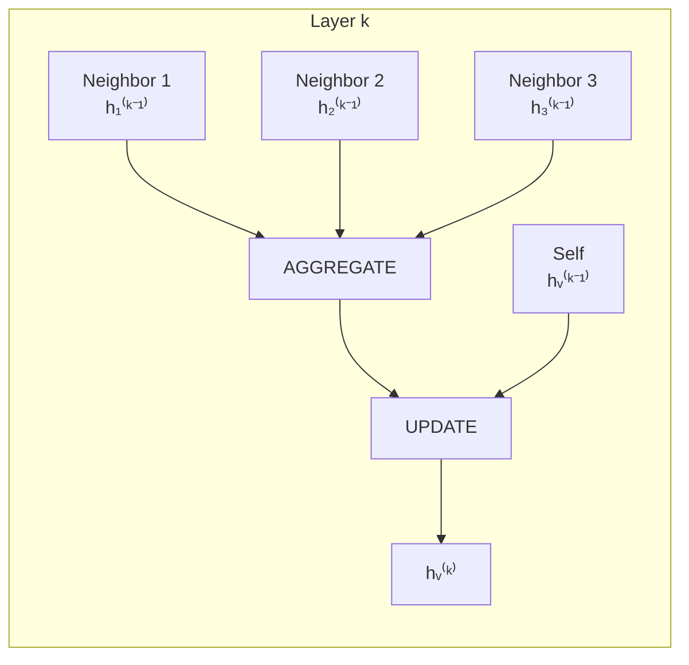

# Graph Neural Networks

Graphs are everywhere --- social networks, molecules, knowledge bases, recommendation systems, road networks. Standard neural networks (CNNs, transformers) assume grid or sequence structure. Graph neural networks (GNNs) operate directly on arbitrary graph topologies. This page covers the message passing framework, derives GCN from spectral graph theory, implements GraphSAGE and GAT, and builds a node classifier on the Cora citation network.

## Why Graphs?

| Data Type | Structure | Examples |
|-----------|-----------|----------|
| Social networks | User-user connections | Friend recommendations |
| Molecules | Atom-bond graphs | Drug discovery |
| Knowledge graphs | Entity-relation triples | Question answering |
| Citation networks | Paper-paper citations | Paper classification |
| Scene graphs | Object-relationship | Visual reasoning |
| Traffic networks | Intersection-road | Traffic prediction |

Standard neural networks cannot handle:
- Variable number of neighbors per node
- No canonical ordering of nodes
- Permutation invariance requirement

## The Message Passing Framework

All GNNs follow the same high-level pattern. At each layer $k$, every node $v$ updates its representation by:

**1. Aggregate** messages from neighbors:

$$
m_v^{(k)} = \text{AGGREGATE}^{(k)}\left(\left\{h_u^{(k-1)} : u \in \mathcal{N}(v)\right\}\right)
$$

**2. Update** the node's representation:

$$
h_v^{(k)} = \text{UPDATE}^{(k)}\left(h_v^{(k-1)}, m_v^{(k)}\right)
$$

Different GNN variants differ in how they implement AGGREGATE and UPDATE.



### Receptive Field Growth

After $K$ layers of message passing, each node's representation captures information from its $K$-hop neighborhood. This is analogous to receptive fields in CNNs.

## Graph Convolutional Network (GCN)

### Spectral Derivation

The graph Laplacian is $L = D - A$ where $D$ is the degree matrix and $A$ is the adjacency matrix. The normalized Laplacian:

$$
\tilde{L} = I - D^{-1/2} A D^{-1/2}
$$

Spectral graph convolution applies a filter $g_\theta$ in the spectral domain:

$$
g_\theta * x = U g_\theta(\Lambda) U^T x
$$

where $L = U \Lambda U^T$ is the eigendecomposition. Computing this is $O(n^2)$.

Kipf and Welling (2017) approximate the spectral filter with first-order Chebyshev polynomials, yielding:

$$
H^{(l+1)} = \sigma\left(\tilde{D}^{-1/2} \tilde{A} \tilde{D}^{-1/2} H^{(l)} W^{(l)}\right)
$$

where $\tilde{A} = A + I$ (add self-loops) and $\tilde{D}_{ii} = \sum_j \tilde{A}_{ij}$.

### Per-Node View

For a single node $v$:

$$
h_v^{(l+1)} = \sigma\left(W^{(l)} \sum_{u \in \mathcal{N}(v) \cup \{v\}} \frac{h_u^{(l)}}{\sqrt{\deg(u) \cdot \deg(v)}}\right)
$$

This is mean aggregation with symmetric normalization.

::: details Worked Example — Message Passing on a 4-Node Graph

**Setup:** 4-node graph with edges: 0--1, 0--2, 1--2, 2--3. Each node has a 2D feature.

```
Node 0 --- Node 1
  \        /
   Node 2 --- Node 3
```

**Node features** $H^{(0)}$:

| Node | $h_1$ | $h_2$ | Degree |
|---|---|---|---|
| 0 | 1.0 | 0.0 | 2 |
| 1 | 0.0 | 1.0 | 2 |
| 2 | 0.5 | 0.5 | 3 |
| 3 | 1.0 | 1.0 | 1 |

Weight matrix $W = \begin{bmatrix} 1 & 0 \\ 0 & 1 \end{bmatrix}$ (identity for simplicity)

**Step 1:** Add self-loops. $\tilde{A} = A + I$. New degrees: $\tilde{d}_0 = 3, \tilde{d}_1 = 3, \tilde{d}_2 = 4, \tilde{d}_3 = 2$

**Step 2:** Compute $h_v^{(1)}$ for node 0 (neighbors: 1, 2, plus self):
$$h_0^{(1)} = \sigma\left(W \sum_{u \in \{0,1,2\}} \frac{h_u}{\sqrt{\tilde{d}_u \cdot \tilde{d}_0}}\right)$$

$$= \sigma\left(\frac{[1,0]}{\sqrt{3 \cdot 3}} + \frac{[0,1]}{\sqrt{3 \cdot 3}} + \frac{[0.5,0.5]}{\sqrt{4 \cdot 3}}\right)$$

$$= \sigma\left(\frac{[1,0]}{3} + \frac{[0,1]}{3} + \frac{[0.5,0.5]}{3.46}\right) = \sigma([0.333 + 0 + 0.144,\; 0 + 0.333 + 0.144])$$

$$= \sigma([0.478, 0.478]) = \text{ReLU}([0.478, 0.478]) = [0.478, 0.478]$$

**Step 3:** For node 3 (neighbors: 2, plus self):
$$h_3^{(1)} = \sigma\left(\frac{[0.5,0.5]}{\sqrt{4 \cdot 2}} + \frac{[1,1]}{\sqrt{2 \cdot 2}}\right) = \sigma\left(\frac{[0.5,0.5]}{2.83} + \frac{[1,1]}{2}\right) = \sigma([0.677, 0.677]) = [0.677, 0.677]$$

**Result:** After one GCN layer, node 0 (originally $[1,0]$) became $[0.478, 0.478]$ --- it absorbed features from its neighbors 1 ($[0,1]$) and 2 ($[0.5,0.5]$), averaging toward the local neighborhood. Node 3 has high values because both it and its neighbor (node 2) had positive features. The symmetric normalization prevents high-degree nodes from dominating.

:::

### GCN Implementation

```python
import torch
import torch.nn as nn
import torch.nn.functional as F

class GCNLayer(nn.Module):
    def __init__(self, in_features, out_features):
        super().__init__()
        self.weight = nn.Parameter(torch.randn(in_features, out_features) * 0.01)
        self.bias = nn.Parameter(torch.zeros(out_features))

    def forward(self, X, A_hat):
        """
        X: (num_nodes, in_features) node features
        A_hat: (num_nodes, num_nodes) normalized adjacency (D^{-1/2} A_tilde D^{-1/2})
        """
        support = X @ self.weight + self.bias
        output = A_hat @ support  # Neighborhood aggregation
        return output

class GCN(nn.Module):
    def __init__(self, n_features, n_hidden, n_classes, dropout=0.5):
        super().__init__()
        self.gc1 = GCNLayer(n_features, n_hidden)
        self.gc2 = GCNLayer(n_hidden, n_classes)
        self.dropout = dropout

    def forward(self, X, A_hat):
        h = F.relu(self.gc1(X, A_hat))
        h = F.dropout(h, self.dropout, training=self.training)
        h = self.gc2(h, A_hat)
        return F.log_softmax(h, dim=1)
```

## GraphSAGE: Inductive Learning

GCN is transductive --- it requires the full graph during training. GraphSAGE (Hamilton et al., 2017) learns generalizable aggregation functions that work on unseen nodes.

### Algorithm

For each layer $k$:

1. **Sample** a fixed number of neighbors (not all)
2. **Aggregate** neighbor features:

$$
h_{\mathcal{N}(v)}^{(k)} = \text{AGGREGATE}_k\left(\left\{h_u^{(k-1)}, \forall u \in \mathcal{N}_{\text{sample}}(v)\right\}\right)
$$

3. **Concatenate and transform:**

$$
h_v^{(k)} = \sigma\left(W^{(k)} \cdot \text{CONCAT}\left(h_v^{(k-1)}, h_{\mathcal{N}(v)}^{(k)}\right)\right)
$$

4. **Normalize:**

$$
h_v^{(k)} = \frac{h_v^{(k)}}{\|h_v^{(k)}\|_2}
$$

### Aggregation Functions

| Aggregator | Formula | Properties |
|-----------|---------|------------|
| Mean | $\frac{1}{|\mathcal{N}|} \sum_{u} h_u$ | Simple, GCN-equivalent |
| Max pool | $\max(\{\sigma(W_{\text{pool}} h_u + b)\})$ | Captures salient features |
| LSTM | LSTM on random permutation | Expressive but order-dependent |

```python
class GraphSAGELayer(nn.Module):
    def __init__(self, in_features, out_features, aggregator='mean'):
        super().__init__()
        self.aggregator = aggregator
        # Input is concatenation of self + aggregated neighbor features
        self.linear = nn.Linear(in_features * 2, out_features)

    def forward(self, X, adj_lists):
        """
        X: (num_nodes, features)
        adj_lists: dict mapping node -> list of neighbor indices
        """
        num_nodes = X.size(0)
        neigh_feats = torch.zeros_like(X)

        for node in range(num_nodes):
            neighbors = adj_lists[node]
            if len(neighbors) > 0:
                if self.aggregator == 'mean':
                    neigh_feats[node] = X[neighbors].mean(dim=0)
                elif self.aggregator == 'max':
                    neigh_feats[node] = X[neighbors].max(dim=0)[0]

        combined = torch.cat([X, neigh_feats], dim=1)
        output = self.linear(combined)
        # L2 normalize
        output = F.normalize(output, p=2, dim=1)
        return output
```

## Graph Attention Network (GAT)

GAT (Velickovic et al., 2018) learns different attention weights for different neighbors, rather than treating all neighbors equally.

### Attention Mechanism

For node $v$ and neighbor $u$:

$$
e_{vu} = \text{LeakyReLU}\left(\vec{a}^T [W h_v \| W h_u]\right)
$$

$$
\alpha_{vu} = \frac{\exp(e_{vu})}{\sum_{k \in \mathcal{N}(v)} \exp(e_{vk})}
$$

$$
h_v' = \sigma\left(\sum_{u \in \mathcal{N}(v)} \alpha_{vu} W h_u\right)
$$

Multi-head attention (concatenate or average $K$ heads):

$$
h_v' = \Big\|_{k=1}^{K} \sigma\left(\sum_{u \in \mathcal{N}(v)} \alpha_{vu}^k W^k h_u\right)
$$

### GCN vs GraphSAGE vs GAT

| Feature | GCN | GraphSAGE | GAT |
|---------|-----|-----------|-----|
| Aggregation | Symmetric normalization | Learned (mean/max/LSTM) | Attention-weighted |
| Neighbor weighting | Fixed (degree-based) | Equal | Learned per edge |
| Inductive | No (transductive) | Yes | Yes |
| Scalability | Full graph needed | Mini-batch via sampling | Mini-batch possible |
| Expressiveness | Low | Medium | High |

## PyTorch Geometric: Cora Classification

PyTorch Geometric (PyG) is the standard library for GNNs.

```python
import torch
import torch.nn.functional as F
from torch_geometric.datasets import Planetoid
from torch_geometric.nn import GCNConv, GATConv

# ── Load Cora Dataset ────────────────────────────────────────────────
dataset = Planetoid(root='./data', name='Cora')
data = dataset[0]

print(f"Nodes: {data.num_nodes}")         # 2708
print(f"Edges: {data.num_edges}")         # 10556
print(f"Features: {data.num_features}")   # 1433
print(f"Classes: {dataset.num_classes}")  # 7
print(f"Train nodes: {data.train_mask.sum()}")  # 140

# ── GCN Model ────────────────────────────────────────────────────────
class GCNModel(torch.nn.Module):
    def __init__(self, n_features, n_hidden, n_classes):
        super().__init__()
        self.conv1 = GCNConv(n_features, n_hidden)
        self.conv2 = GCNConv(n_hidden, n_classes)

    def forward(self, data):
        x, edge_index = data.x, data.edge_index
        x = F.relu(self.conv1(x, edge_index))
        x = F.dropout(x, p=0.5, training=self.training)
        x = self.conv2(x, edge_index)
        return F.log_softmax(x, dim=1)

# ── GAT Model ────────────────────────────────────────────────────────
class GATModel(torch.nn.Module):
    def __init__(self, n_features, n_hidden, n_classes, heads=8):
        super().__init__()
        self.conv1 = GATConv(n_features, n_hidden, heads=heads, dropout=0.6)
        self.conv2 = GATConv(n_hidden * heads, n_classes, heads=1, dropout=0.6)

    def forward(self, data):
        x, edge_index = data.x, data.edge_index
        x = F.dropout(x, p=0.6, training=self.training)
        x = F.elu(self.conv1(x, edge_index))
        x = F.dropout(x, p=0.6, training=self.training)
        x = self.conv2(x, edge_index)
        return F.log_softmax(x, dim=1)

# ── Training ─────────────────────────────────────────────────────────
device = torch.device('cuda' if torch.cuda.is_available() else 'cpu')
model = GATModel(dataset.num_features, 8, dataset.num_classes).to(device)
data = data.to(device)
optimizer = torch.optim.Adam(model.parameters(), lr=0.005, weight_decay=5e-4)

for epoch in range(200):
    model.train()
    optimizer.zero_grad()
    out = model(data)
    loss = F.nll_loss(out[data.train_mask], data.y[data.train_mask])
    loss.backward()
    optimizer.step()

    if (epoch + 1) % 50 == 0:
        model.eval()
        pred = model(data).argmax(dim=1)
        test_acc = (pred[data.test_mask] == data.y[data.test_mask]).float().mean()
        print(f"Epoch {epoch+1}: Test Accuracy = {test_acc:.4f}")

# Expected: ~82-83% (GCN), ~83-85% (GAT)
```

## Graph-Level Tasks

For graph classification (e.g., molecule property prediction), we need a graph-level representation.

### Graph Readout

$$
h_G = \text{READOUT}\left(\{h_v^{(K)} : v \in G\}\right)
$$

Common readout functions:
- **Mean pooling:** $h_G = \frac{1}{|V|} \sum_v h_v$
- **Sum pooling:** $h_G = \sum_v h_v$
- **Hierarchical pooling:** Learn to coarsen the graph (DiffPool, TopKPool)

```python
from torch_geometric.nn import global_mean_pool, GINConv

class GraphClassifier(torch.nn.Module):
    def __init__(self, n_features, n_hidden, n_classes):
        super().__init__()
        nn1 = torch.nn.Sequential(
            torch.nn.Linear(n_features, n_hidden),
            torch.nn.ReLU(),
            torch.nn.Linear(n_hidden, n_hidden),
        )
        nn2 = torch.nn.Sequential(
            torch.nn.Linear(n_hidden, n_hidden),
            torch.nn.ReLU(),
            torch.nn.Linear(n_hidden, n_hidden),
        )
        self.conv1 = GINConv(nn1)
        self.conv2 = GINConv(nn2)
        self.classifier = torch.nn.Linear(n_hidden, n_classes)

    def forward(self, data):
        x, edge_index, batch = data.x, data.edge_index, data.batch
        x = F.relu(self.conv1(x, edge_index))
        x = F.relu(self.conv2(x, edge_index))
        x = global_mean_pool(x, batch)  # Graph-level readout
        return self.classifier(x)
```

## Over-Smoothing Problem

As GNN depth increases, all node representations converge to the same value. After many layers of averaging neighbor features, distinct node features become indistinguishable.

**Solutions:**
- Use few layers (2-3 is usually optimal)
- Skip connections (like ResNet)
- DropEdge: randomly remove edges during training
- PairNorm: normalize to prevent convergence

## Expressiveness: The WL Test

The Weisfeiler-Leman (WL) graph isomorphism test provides an upper bound on GNN expressiveness.

Standard GNNs (GCN, GraphSAGE) are at most as powerful as the 1-WL test. This means they cannot distinguish certain non-isomorphic graphs. GIN (Graph Isomorphism Network) achieves exactly the 1-WL power by using:

$$
h_v^{(k)} = \text{MLP}^{(k)}\left((1 + \epsilon^{(k)}) h_v^{(k-1)} + \sum_{u \in \mathcal{N}(v)} h_u^{(k-1)}\right)
$$

where $\epsilon$ is a learnable parameter.

### What GNNs Cannot Distinguish

Two regular graphs with the same degree sequence but different structure (e.g., a 6-cycle vs two 3-cycles) look identical to 1-WL. Higher-order GNNs (k-WL) or subgraph GNNs are needed for these cases.

## Link Prediction

Predict whether an edge should exist between two nodes:

```python
class LinkPredictor(torch.nn.Module):
    def __init__(self, in_channels, hidden_channels):
        super().__init__()
        self.conv1 = GCNConv(in_channels, hidden_channels)
        self.conv2 = GCNConv(hidden_channels, hidden_channels)

    def encode(self, x, edge_index):
        x = F.relu(self.conv1(x, edge_index))
        x = self.conv2(x, edge_index)
        return x

    def decode(self, z, edge_label_index):
        """Predict edge existence via dot product."""
        return (z[edge_label_index[0]] * z[edge_label_index[1]]).sum(dim=-1)

    def forward(self, x, edge_index, edge_label_index):
        z = self.encode(x, edge_index)
        return self.decode(z, edge_label_index)
```

## Heterogeneous Graphs

Real-world graphs often have multiple node and edge types (e.g., paper-author-venue).

```python
from torch_geometric.nn import HeteroConv, SAGEConv

class HeteroGNN(torch.nn.Module):
    def __init__(self, metadata, hidden_channels):
        super().__init__()
        self.conv1 = HeteroConv({
            edge_type: SAGEConv((-1, -1), hidden_channels)
            for edge_type in metadata[1]
        })
        self.conv2 = HeteroConv({
            edge_type: SAGEConv((-1, -1), hidden_channels)
            for edge_type in metadata[1]
        })

    def forward(self, x_dict, edge_index_dict):
        x_dict = self.conv1(x_dict, edge_index_dict)
        x_dict = {key: F.relu(x) for key, x in x_dict.items()}
        x_dict = self.conv2(x_dict, edge_index_dict)
        return x_dict
```

## Temporal Graphs

For graphs that change over time (e.g., transaction networks), use temporal GNNs that process snapshots or continuous-time events:

| Method | Approach | Use Case |
|--------|----------|----------|
| TGAT | Temporal attention | Continuous-time events |
| TGN | Memory + attention | Dynamic interactions |
| Snapshot | GNN per timestep | Periodic updates |
| EvolveGCN | Evolving GCN weights | Slowly changing graphs |

## GNN Applications in Practice

### Molecular Property Prediction

```python
from torch_geometric.datasets import MoleculeNet
from torch_geometric.nn import GINConv, global_add_pool

# Load ESOL (water solubility prediction)
dataset = MoleculeNet(root='./data', name='ESOL')

class MoleculeGNN(torch.nn.Module):
    def __init__(self, in_channels, hidden_channels):
        super().__init__()
        nn1 = torch.nn.Sequential(
            torch.nn.Linear(in_channels, hidden_channels),
            torch.nn.ReLU(),
            torch.nn.Linear(hidden_channels, hidden_channels)
        )
        nn2 = torch.nn.Sequential(
            torch.nn.Linear(hidden_channels, hidden_channels),
            torch.nn.ReLU(),
            torch.nn.Linear(hidden_channels, hidden_channels)
        )
        self.conv1 = GINConv(nn1)
        self.conv2 = GINConv(nn2)
        self.fc = torch.nn.Linear(hidden_channels, 1)

    def forward(self, data):
        x, edge_index, batch = data.x, data.edge_index, data.batch
        x = F.relu(self.conv1(x, edge_index))
        x = F.relu(self.conv2(x, edge_index))
        x = global_add_pool(x, batch)
        return self.fc(x).squeeze()
```

## Scalability Techniques

| Technique | Description | Scale |
|-----------|-------------|-------|
| Mini-batch (GraphSAGE) | Sample neighbors per layer | Millions of nodes |
| Cluster-GCN | Partition graph, train on subgraphs | Millions of nodes |
| GraphSAINT | Subgraph sampling with normalization | Billions of edges |
| DistDGL | Distributed GNN training | Multi-machine |

## Cross-References

- **Foundations:** [Neural Network Basics](/deep-learning/neural-network-basics) --- backprop through computation graphs
- **Attention mechanism:** [Transformers](/deep-learning/transformers) --- attention applied to sequences
- **Architecture guide:** [Architecture Selection Guide](/deep-learning/architecture-selection-guide) --- when to use GNNs
- **Training:** [Training Techniques](/deep-learning/training-techniques) --- dropout, normalization
- **Multimodal:** [Multimodal Models](/deep-learning/multimodal-models) --- combining graph + text + vision
