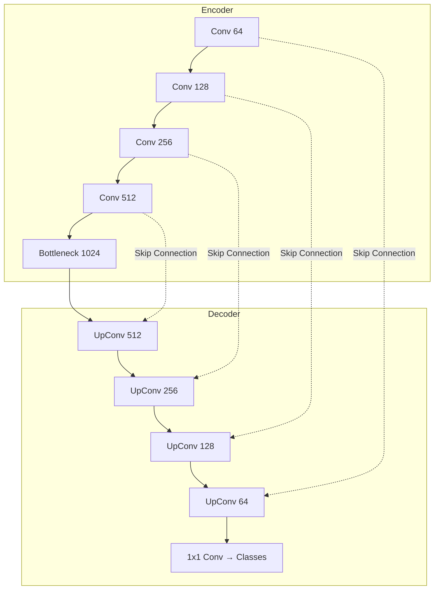
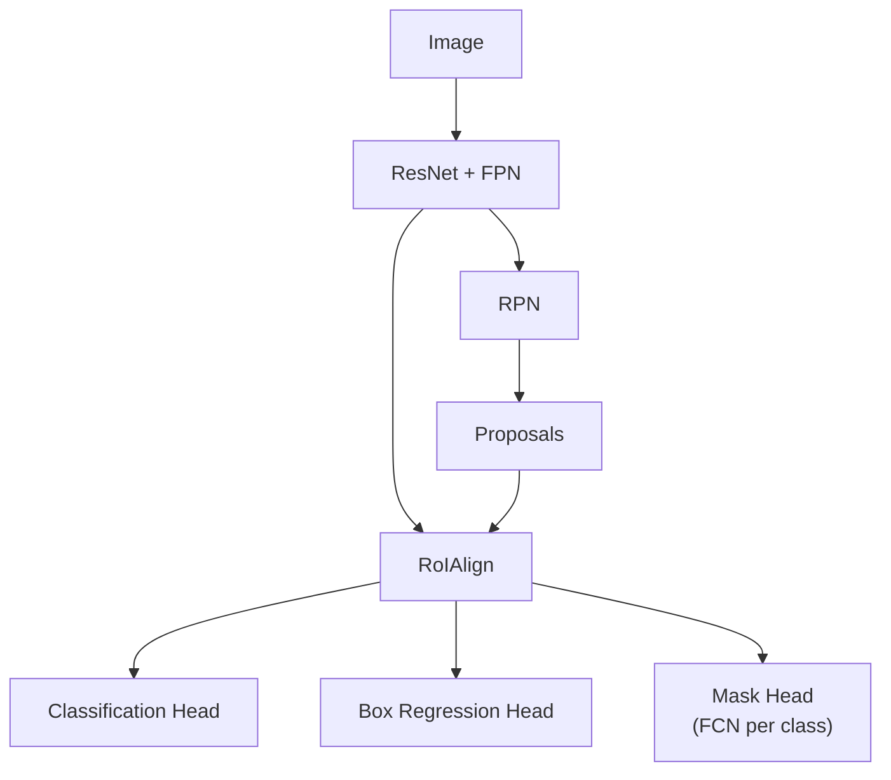

# Image Segmentation

Image segmentation assigns a class label to every pixel in an image. It is critical for autonomous driving (road vs sidewalk), medical imaging (tumor vs healthy tissue), and satellite imagery (land use). This page covers the three types of segmentation, builds U-Net from scratch, explains DeepLab's atrous convolutions, walks through Mask R-CNN, introduces SAM, and trains a medical image segmenter.

## Types of Segmentation

| Type | Output | Example |
|------|--------|---------|
| **Semantic** | Per-pixel class label (no instance distinction) | All cars = same color |
| **Instance** | Per-pixel class + instance ID | Each car = different color |
| **Panoptic** | Semantic + instance for countable objects | Cars are instances, sky is semantic |

## U-Net

### Architecture

U-Net (Ronneberger et al., 2015) has an encoder-decoder structure with skip connections that concatenate encoder features directly to the decoder at each level:



### Why Skip Connections?

The encoder loses spatial detail through downsampling. Skip connections provide the decoder with fine-grained spatial information from the encoder, combined with the semantic information from the bottleneck.

### U-Net From Scratch

```python
import torch
import torch.nn as nn
import torch.nn.functional as F

class DoubleConv(nn.Module):
    """Two consecutive Conv-BN-ReLU blocks."""
    def __init__(self, in_ch, out_ch):
        super().__init__()
        self.conv = nn.Sequential(
            nn.Conv2d(in_ch, out_ch, 3, padding=1, bias=False),
            nn.BatchNorm2d(out_ch),
            nn.ReLU(inplace=True),
            nn.Conv2d(out_ch, out_ch, 3, padding=1, bias=False),
            nn.BatchNorm2d(out_ch),
            nn.ReLU(inplace=True),
        )

    def forward(self, x):
        return self.conv(x)


class UNet(nn.Module):
    def __init__(self, in_channels=1, num_classes=2, features=[64, 128, 256, 512]):
        super().__init__()
        self.encoder = nn.ModuleList()
        self.decoder = nn.ModuleList()
        self.pool = nn.MaxPool2d(2, 2)

        # Encoder
        for f in features:
            self.encoder.append(DoubleConv(in_channels, f))
            in_channels = f

        # Bottleneck
        self.bottleneck = DoubleConv(features[-1], features[-1] * 2)

        # Decoder
        for f in reversed(features):
            self.decoder.append(
                nn.ConvTranspose2d(f * 2, f, kernel_size=2, stride=2)
            )
            self.decoder.append(DoubleConv(f * 2, f))

        # Final 1x1 convolution
        self.final_conv = nn.Conv2d(features[0], num_classes, kernel_size=1)

    def forward(self, x):
        skip_connections = []

        # Encoder path
        for enc in self.encoder:
            x = enc(x)
            skip_connections.append(x)
            x = self.pool(x)

        x = self.bottleneck(x)
        skip_connections = skip_connections[::-1]

        # Decoder path
        for i in range(0, len(self.decoder), 2):
            x = self.decoder[i](x)  # Upsample
            skip = skip_connections[i // 2]

            # Handle size mismatch (if input is not divisible by 2^n)
            if x.shape != skip.shape:
                x = F.interpolate(x, size=skip.shape[2:])

            x = torch.cat([skip, x], dim=1)  # Concatenate skip connection
            x = self.decoder[i + 1](x)       # Double conv

        return self.final_conv(x)

# Test
model = UNet(in_channels=1, num_classes=2)
x = torch.randn(1, 1, 256, 256)
out = model(x)
print(f"Input: {x.shape}, Output: {out.shape}")
# Input: (1, 1, 256, 256), Output: (1, 2, 256, 256)
```

## Loss Functions for Segmentation

### Dice Loss

The Dice coefficient measures overlap between prediction and ground truth:

$$
\text{Dice} = \frac{2|P \cap G|}{|P| + |G|} = \frac{2\sum_i p_i g_i}{\sum_i p_i + \sum_i g_i}
$$

$$
\mathcal{L}_{\text{Dice}} = 1 - \frac{2\sum_i p_i g_i + \epsilon}{\sum_i p_i + \sum_i g_i + \epsilon}
$$

```python
class DiceLoss(nn.Module):
    def __init__(self, smooth=1e-6):
        super().__init__()
        self.smooth = smooth

    def forward(self, pred, target):
        pred = torch.sigmoid(pred)
        pred = pred.view(-1)
        target = target.view(-1)

        intersection = (pred * target).sum()
        dice = (2 * intersection + self.smooth) / (
            pred.sum() + target.sum() + self.smooth
        )
        return 1 - dice
```

### Combined Loss

$$
\mathcal{L} = \alpha \mathcal{L}_{\text{BCE}} + (1 - \alpha) \mathcal{L}_{\text{Dice}}
$$

Combining BCE (per-pixel) with Dice (region-level) often works best.

### Focal Loss

For class-imbalanced segmentation (e.g., small tumors in large images):

$$
\mathcal{L}_{\text{focal}} = -\alpha_t (1 - p_t)^\gamma \log(p_t)
$$

where $\gamma = 2$ downweights easy pixels and focuses on hard ones.

## DeepLab: Atrous (Dilated) Convolution

### The Problem

Standard convolutions with pooling reduce spatial resolution. Upsampling loses detail. Atrous convolution increases the receptive field without reducing resolution.

### Atrous Convolution

A standard 3x3 kernel samples 9 adjacent pixels. An atrous (dilated) convolution with rate $r$ samples 9 pixels spaced $r$ apart:

$$
(F *_r k)(p) = \sum_{s+rt=p} F(s) k(t)
$$

Effective receptive field of a 3x3 kernel with dilation $r$: $(2r + 1) \times (2r + 1)$.

### Atrous Spatial Pyramid Pooling (ASPP)

DeepLabv3+ applies multiple atrous convolutions in parallel at different rates:

```python
class ASPP(nn.Module):
    def __init__(self, in_channels, out_channels=256, rates=[6, 12, 18]):
        super().__init__()
        modules = [
            nn.Sequential(
                nn.Conv2d(in_channels, out_channels, 1, bias=False),
                nn.BatchNorm2d(out_channels),
                nn.ReLU(),
            )
        ]
        for rate in rates:
            modules.append(nn.Sequential(
                nn.Conv2d(in_channels, out_channels, 3,
                         padding=rate, dilation=rate, bias=False),
                nn.BatchNorm2d(out_channels),
                nn.ReLU(),
            ))
        # Global average pooling branch
        modules.append(nn.Sequential(
            nn.AdaptiveAvgPool2d(1),
            nn.Conv2d(in_channels, out_channels, 1, bias=False),
            nn.BatchNorm2d(out_channels),
            nn.ReLU(),
        ))
        self.convs = nn.ModuleList(modules)
        self.project = nn.Sequential(
            nn.Conv2d(out_channels * (len(rates) + 2), out_channels, 1, bias=False),
            nn.BatchNorm2d(out_channels),
            nn.ReLU(),
        )

    def forward(self, x):
        outputs = []
        for conv in self.convs[:-1]:
            outputs.append(conv(x))
        # Global pooling branch
        gap = self.convs[-1](x)
        gap = F.interpolate(gap, size=x.shape[2:], mode='bilinear', align_corners=False)
        outputs.append(gap)
        return self.project(torch.cat(outputs, dim=1))
```

## Mask R-CNN

Extends Faster R-CNN with a parallel mask prediction branch.

### RoIAlign

RoI Pooling uses quantization (rounding to grid cells), losing spatial precision. RoIAlign uses bilinear interpolation to sample features at exact fractional locations:

$$
f(x, y) = \sum_{i,j} f_{ij} \max(0, 1 - |x - i|) \max(0, 1 - |y - j|)
$$

This eliminates the quantization error and improves mask quality.

### Architecture



The mask head outputs a $K \times m \times m$ binary mask ($K$ classes, $m \times m$ spatial resolution).

## Segment Anything Model (SAM)

SAM (Kirillov et al., 2023) is a foundation model for segmentation. Trained on 11M images with 1B masks, it segments any object given a prompt (point, box, or text).

### Architecture Components

1. **Image encoder:** ViT-H (heavyweight, runs once per image)
2. **Prompt encoder:** Encodes points, boxes, or text prompts
3. **Mask decoder:** Lightweight transformer decoder that produces masks

```python
from segment_anything import SamPredictor, sam_model_registry

sam = sam_model_registry["vit_h"](checkpoint="sam_vit_h.pth")
predictor = SamPredictor(sam)

# Set image (runs image encoder once)
predictor.set_image(image)

# Prompt with a point
masks, scores, logits = predictor.predict(
    point_coords=np.array([[500, 375]]),
    point_labels=np.array([1]),  # 1 = foreground
    multimask_output=True,
)
# Returns 3 masks (ambiguity: part, whole, or background)
```

## Medical Imaging: U-Net for Lung Segmentation

```python
import torch
import torch.nn as nn
from torch.utils.data import Dataset, DataLoader
import numpy as np
from PIL import Image
import os

class MedicalDataset(Dataset):
    def __init__(self, image_dir, mask_dir, transform=None):
        self.images = sorted(os.listdir(image_dir))
        self.masks = sorted(os.listdir(mask_dir))
        self.image_dir = image_dir
        self.mask_dir = mask_dir
        self.transform = transform

    def __len__(self):
        return len(self.images)

    def __getitem__(self, idx):
        img = np.array(Image.open(
            os.path.join(self.image_dir, self.images[idx])
        ).convert('L'), dtype=np.float32) / 255.0
        mask = np.array(Image.open(
            os.path.join(self.mask_dir, self.masks[idx])
        ).convert('L'), dtype=np.float32) / 255.0

        img = torch.from_numpy(img).unsqueeze(0)
        mask = torch.from_numpy(mask).unsqueeze(0)

        if self.transform:
            # Apply same random transform to both
            seed = np.random.randint(2147483647)
            torch.manual_seed(seed)
            img = self.transform(img)
            torch.manual_seed(seed)
            mask = self.transform(mask)

        return img, mask

# ── Training ─────────────────────────────────────────────────────────
device = torch.device('cuda' if torch.cuda.is_available() else 'cpu')
model = UNet(in_channels=1, num_classes=1).to(device)
optimizer = torch.optim.Adam(model.parameters(), lr=1e-4)
criterion = nn.BCEWithLogitsLoss()
dice_loss = DiceLoss()

# train_loader = DataLoader(...)

for epoch in range(50):
    model.train()
    total_loss = 0
    for images, masks in train_loader:
        images, masks = images.to(device), masks.to(device)

        optimizer.zero_grad()
        outputs = model(images)
        loss = criterion(outputs, masks) + dice_loss(outputs, masks)
        loss.backward()
        optimizer.step()
        total_loss += loss.item()

    # Evaluate with Dice score
    model.eval()
    dice_scores = []
    with torch.no_grad():
        for images, masks in val_loader:
            images, masks = images.to(device), masks.to(device)
            preds = torch.sigmoid(model(images)) > 0.5
            intersection = (preds * masks).sum()
            dice = (2 * intersection) / (preds.sum() + masks.sum() + 1e-8)
            dice_scores.append(dice.item())

    print(f"Epoch {epoch+1}: Loss={total_loss/len(train_loader):.4f}, "
          f"Dice={np.mean(dice_scores):.4f}")
```

## Segmentation Metrics

| Metric | Formula | Range |
|--------|---------|-------|
| Pixel Accuracy | $\frac{\text{correct pixels}}{\text{total pixels}}$ | [0, 1] |
| IoU (per class) | $\frac{TP}{TP + FP + FN}$ | [0, 1] |
| mIoU | Mean IoU across classes | [0, 1] |
| Dice | $\frac{2TP}{2TP + FP + FN}$ | [0, 1] |
| Boundary F1 | F1 at boundary pixels | [0, 1] |

## Post-Processing for Segmentation

### Connected Component Analysis

Remove small isolated predicted regions:

```python
import numpy as np
from scipy import ndimage

def remove_small_components(mask, min_size=100):
    """Remove connected components smaller than min_size pixels."""
    labeled, num_features = ndimage.label(mask)
    sizes = ndimage.sum(mask, labeled, range(1, num_features + 1))
    small_components = np.where(sizes < min_size)[0] + 1
    for comp in small_components:
        mask[labeled == comp] = 0
    return mask
```

### Conditional Random Fields (CRF)

CRF post-processing refines segmentation boundaries by considering pixel color similarity:

```python
# Using pydensecrf
import pydensecrf.densecrf as dcrf
from pydensecrf.utils import unary_from_softmax

def crf_refine(image, probs, n_iters=5):
    """Apply dense CRF to refine segmentation probabilities."""
    h, w = image.shape[:2]
    n_classes = probs.shape[0]

    d = dcrf.DenseCRF2D(w, h, n_classes)
    unary = unary_from_softmax(probs)
    d.setUnaryEnergy(unary)

    # Pairwise: appearance (color) + smoothness
    d.addPairwiseGaussian(sxy=3, compat=3)
    d.addPairwiseBilateral(sxy=80, srgb=13, rgbim=image, compat=10)

    Q = d.inference(n_iters)
    return np.array(Q).reshape(n_classes, h, w)
```

## SegFormer: Transformer-Based Segmentation

SegFormer (Xie et al., 2021) uses a hierarchical transformer encoder with a simple MLP decoder:

```python
from transformers import SegformerForSemanticSegmentation

model = SegformerForSemanticSegmentation.from_pretrained(
    "nvidia/segformer-b2-finetuned-ade-512-512"
)

# Inference
inputs = processor(images=image, return_tensors="pt")
with torch.no_grad():
    outputs = model(**inputs)

# Upsample logits to original image size
logits = F.interpolate(
    outputs.logits, size=image.size[::-1],
    mode='bilinear', align_corners=False
)
prediction = logits.argmax(dim=1).squeeze().numpy()
```

### Architecture Comparison for Segmentation

| Model | Backbone | Params | mIoU (ADE20K) | Speed |
|-------|----------|--------|---------------|-------|
| FCN | VGG-16 | 134M | 29.4 | Slow |
| U-Net | Custom | ~31M | N/A (medical) | Fast |
| DeepLabv3+ | ResNet-101 | 63M | 45.1 | Medium |
| SegFormer-B2 | MiT-B2 | 25M | 46.5 | Fast |
| Mask2Former | Swin-L | 216M | 57.7 | Slow |
| SAM | ViT-H | 641M | Promptable | Very slow |

## Data Augmentation for Segmentation

The same spatial transform must be applied to both image and mask:

```python
import albumentations as A

transform = A.Compose([
    A.RandomCrop(256, 256),
    A.HorizontalFlip(p=0.5),
    A.VerticalFlip(p=0.5),
    A.RandomRotate90(p=0.5),
    A.ElasticTransform(alpha=120, sigma=120 * 0.05, p=0.3),
    A.GridDistortion(p=0.3),
    A.RandomBrightnessContrast(p=0.3),
    A.Normalize(mean=[0.485, 0.456, 0.406], std=[0.229, 0.224, 0.225]),
])

# Apply to both image and mask simultaneously
augmented = transform(image=image, mask=mask)
aug_image = augmented['image']
aug_mask = augmented['mask']
```

## Multi-Class Segmentation

For $K$ classes, the model outputs $K$ channels. Use cross-entropy loss per pixel:

```python
# Model output: (batch, K, H, W)
# Target: (batch, H, W) with integer class labels

criterion = nn.CrossEntropyLoss(
    weight=class_weights,  # Handle imbalance
    ignore_index=255,      # Ignore unlabeled pixels
)

loss = criterion(output, target)
```

## Common Segmentation Pitfalls

| Issue | Symptom | Fix |
|-------|---------|-----|
| Jagged edges | Boundaries not smooth | CRF post-processing, higher resolution |
| Missing small objects | Small structures not detected | Use FPN, increase resolution, weighted loss |
| Class imbalance | Background dominates | Dice loss, focal loss, class weights |
| Checkerboard artifacts | Grid pattern in output | Use bilinear upsampling instead of transposed conv |
| Train/val inconsistency | Val much worse than train | Ensure same preprocessing for both |

## Cross-References

- **CNN backbones:** [CNN](/deep-learning/cnn) --- ResNet, feature extraction
- **Detection:** [Object Detection](/deep-learning/object-detection) --- Faster R-CNN base
- **Transformers:** [Transformers](/deep-learning/transformers) --- ViT for SAM
- **Training:** [Training Techniques](/deep-learning/training-techniques) --- augmentation, scheduling
- **Deployment:** [Model Optimization](/deep-learning/model-optimization) --- mobile segmentation
