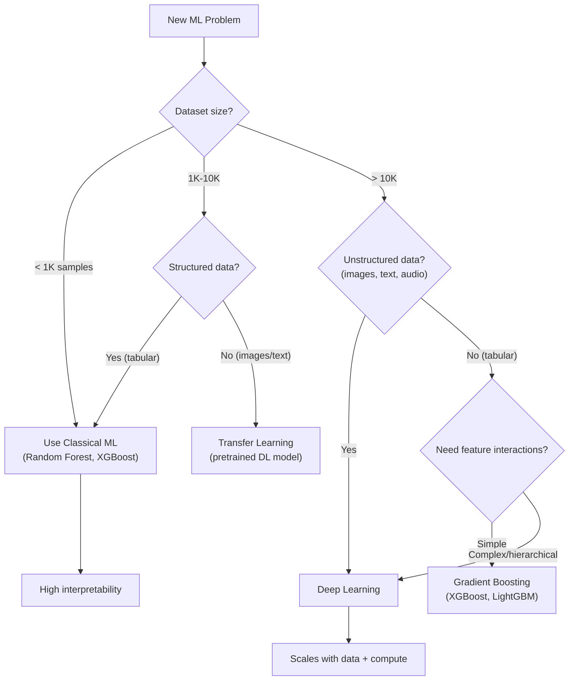
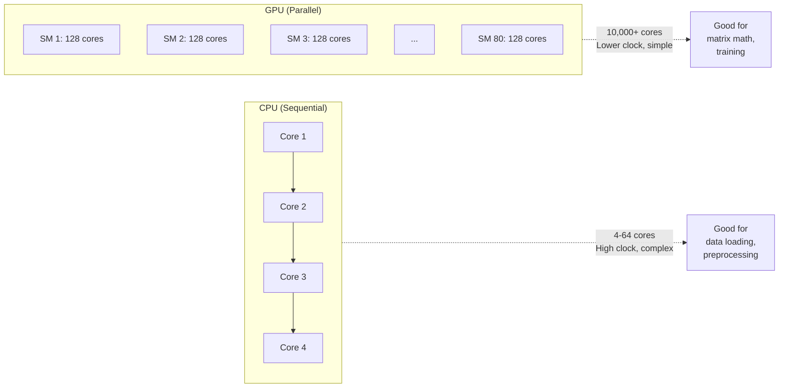
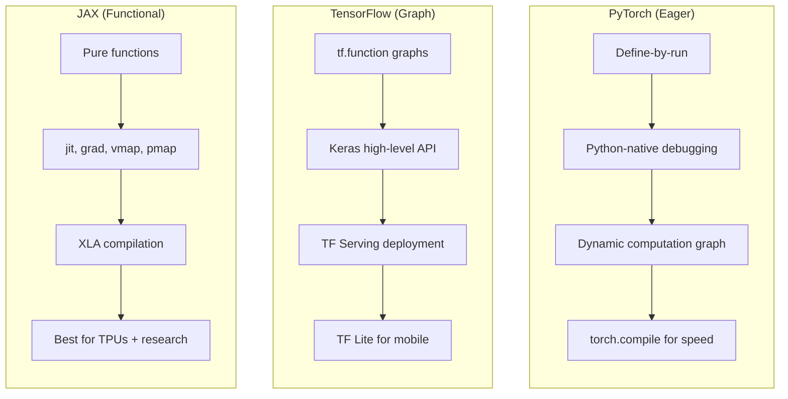
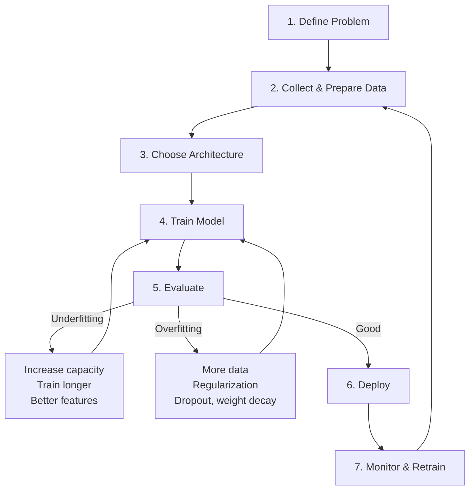
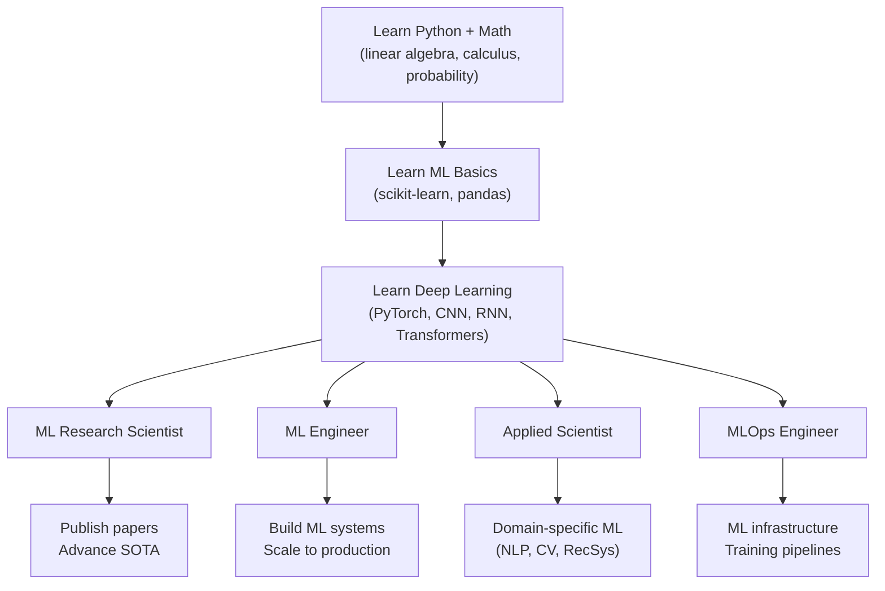

# Deep Learning Overview

Deep learning is the subfield of machine learning that uses neural networks with many layers to learn hierarchical representations of data. It has driven every major AI breakthrough since 2012 --- image recognition, machine translation, protein folding, game playing, and large language models. This page explains what deep learning actually is, why it works, when you should (and should not) use it, and how to build a career around it.

## Why This Page Exists

Most introductions to deep learning either stay too shallow (just marketing) or jump straight into math without building intuition. This page bridges the gap: you will leave understanding what deep learning is, why it works mathematically, when it beats classical ML, what hardware you need, which framework to pick, and where to go next.

## Explain It Like I Am Five

Imagine you have a box of LEGOs. You can build a car, a house, or a spaceship --- but you need to follow instructions (rules). Classical programming is like writing those instructions yourself.

Now imagine a magic box that *looks at pictures* of cars and *figures out the instructions on its own*. You just show it thousands of pictures of cars and it learns how to recognize them. That is machine learning.

Deep learning is like having *many magic boxes stacked on top of each other*. The first box learns simple things (edges, colors). The next box combines those into shapes. The next combines shapes into parts (wheels, windows). The top box combines parts into the whole car. Each box learns more complex things by building on the box below it. That stack of boxes is a deep neural network.

## What Is Deep Learning?

Deep learning is function approximation at scale. Given input data $x$ and desired output $y$, deep learning finds a function $f_\theta(x) \approx y$ where $\theta$ represents millions (or billions) of learnable parameters organized into layers:

$$
f_\theta(x) = f_L \circ f_{L-1} \circ \cdots \circ f_2 \circ f_1(x)
$$

Each layer $f_l$ applies a linear transformation followed by a nonlinear activation:

$$
f_l(h) = \sigma(W_l h + b_l)
$$

where $W_l$ is a weight matrix, $b_l$ is a bias vector, and $\sigma$ is a nonlinear activation function.

The "deep" in deep learning refers to the number of layers $L$. Depth gives the network the ability to learn hierarchical representations --- each layer builds abstractions on top of the previous layer's output.

### The Universal Approximation Theorem

The theoretical foundation for why neural networks work comes from the Universal Approximation Theorem (Cybenko, 1989; Hornik, 1991):

> A feedforward network with a single hidden layer containing a finite number of neurons can approximate any continuous function on a compact subset of $\mathbb{R}^n$ to arbitrary accuracy.

Formally, for any continuous function $g: [0,1]^n \to \mathbb{R}$ and any $\epsilon > 0$, there exists a network:

$$
f(x) = \sum_{i=1}^{N} \alpha_i \sigma\left(\sum_{j=1}^{n} w_{ij} x_j + b_i\right)
$$

such that $|f(x) - g(x)| < \epsilon$ for all $x \in [0,1]^n$.

::: warning Existence vs. Efficiency
The theorem says such a network *exists* --- it says nothing about how to *find* it or how many neurons $N$ you need. In practice, shallow networks may need exponentially many neurons. Deep networks achieve the same approximation with far fewer parameters. This is why depth matters.
:::

### Intuition: Why Depth Helps

Consider representing a function that depends on $n$ binary inputs. A shallow network might need $O(2^n)$ neurons. A deep network can exploit compositional structure:

$$
\text{shallow: } O(2^n) \text{ neurons} \quad \text{vs.} \quad \text{deep: } O(n \cdot \text{poly}(n)) \text{ neurons}
$$

Real-world data has compositional structure: images are made of parts, parts of edges, edges of pixels. Language has words forming phrases forming sentences forming paragraphs. Deep networks exploit this hierarchy naturally.

## Deep Learning vs. Classical Machine Learning

Not every problem needs deep learning. Understanding when to use it is as important as knowing how.

### Decision Guide



### Comparison Table

| Dimension | Classical ML | Deep Learning |
|-----------|-------------|---------------|
| **Data requirement** | 100s--1000s of samples | 10K+ (or transfer learning) |
| **Feature engineering** | Manual, domain-expert | Automatic from raw data |
| **Tabular data** | Often wins (XGBoost) | Competitive but not dominant |
| **Images/video** | Poor without handcrafted features | State-of-the-art |
| **Text/NLP** | Bag-of-words, TF-IDF | Transformers dominate |
| **Audio/speech** | MFCCs + classical | End-to-end deep learning |
| **Interpretability** | High (decision trees, SHAP) | Lower (black box) |
| **Training time** | Seconds to minutes | Hours to weeks |
| **Inference cost** | Very low | Can be high (GPU needed) |
| **When it wins** | Small data, tabular, fast iteration | Large data, unstructured, SOTA needed |

::: tip The Tabular Data Exception
As of 2026, gradient-boosted trees (XGBoost, LightGBM, CatBoost) still match or beat deep learning on most tabular datasets. Deep learning excels on unstructured data (images, text, audio, video). If your data fits in a spreadsheet, start with gradient boosting.
:::

## Hardware for Deep Learning

Deep learning's compute demands are fundamentally different from classical ML. Understanding hardware is essential for practical work.

### GPU Architecture

GPUs excel at deep learning because neural network operations are massively parallel matrix multiplications. A single forward pass through a layer is:

$$
Y = \sigma(XW + b)
$$

where $X \in \mathbb{R}^{B \times d_{in}}$, $W \in \mathbb{R}^{d_{in} \times d_{out}}$. This matrix multiply parallelizes across $B \times d_{out}$ independent multiply-accumulate chains.



### Hardware Comparison

| Hardware | Memory | FP16 TFLOPS | Use Case | Cost (cloud/hr) |
|----------|--------|-------------|----------|-----------------|
| **NVIDIA RTX 4090** | 24 GB | 165 | Personal research | $0.40 (vast.ai) |
| **NVIDIA A100 80GB** | 80 GB | 312 | Production training | $2.00 (AWS) |
| **NVIDIA H100 SXM** | 80 GB | 990 | Large-scale training | $3.50 (AWS) |
| **NVIDIA B200** | 192 GB | 2250 | Frontier models | $5.00+ |
| **Google TPU v5p** | 96 GB HBM | 459 | JAX/TensorFlow | $3.22 (GCP) |
| **Apple M3 Ultra** | 192 GB unified | 27 (ANE) | Mac development | One-time purchase |

::: info Memory Is Usually the Bottleneck
GPU compute has grown faster than GPU memory. The limiting factor for most practitioners is VRAM, not FLOPS. Techniques like gradient checkpointing, mixed precision, and model parallelism exist primarily to work around memory limits.
:::

### Quick PyTorch GPU Check

```python
import torch

# Check GPU availability
print(f"CUDA available: {torch.cuda.is_available()}")
if torch.cuda.is_available():
    print(f"Device: {torch.cuda.get_device_name(0)}")
    print(f"Memory: {torch.cuda.get_device_properties(0).total_mem / 1e9:.1f} GB")

    # Simple benchmark: matrix multiply
    size = 4096
    a = torch.randn(size, size, device='cuda')
    b = torch.randn(size, size, device='cuda')

    # Warmup
    for _ in range(10):
        c = torch.mm(a, b)
    torch.cuda.synchronize()

    import time
    start = time.perf_counter()
    for _ in range(100):
        c = torch.mm(a, b)
    torch.cuda.synchronize()
    elapsed = time.perf_counter() - start

    flops = 2 * size**3 * 100 / elapsed
    print(f"MatMul TFLOPS: {flops / 1e12:.1f}")
```

## Framework Comparison: PyTorch vs TensorFlow vs JAX

### Architecture Philosophy



### Feature Comparison

| Feature | PyTorch | TensorFlow | JAX |
|---------|---------|------------|-----|
| **Paradigm** | Imperative (eager) | Declarative (graph) | Functional |
| **Debugging** | Standard Python debugger | Harder (graph mode) | Requires pure functions |
| **Research adoption** | ~85% of papers (2025) | ~10% | ~5% (growing) |
| **Industry adoption** | Growing rapidly | Still dominant in production | Google internal |
| **Auto-differentiation** | `autograd` | `GradientTape` | `jax.grad` (composable) |
| **Compilation** | `torch.compile` (2.0+) | `tf.function` | `jax.jit` (XLA) |
| **Distributed training** | DDP, FSDP | `tf.distribute` | `pmap`, `pjit` |
| **Mobile deployment** | ExecuTorch | TF Lite | Limited |
| **Ecosystem** | HuggingFace, Lightning | TF Hub, TF Extended | Flax, Haiku, Optax |
| **Best for** | Research + production | Production pipelines | TPU research, scientific computing |

::: tip Pick PyTorch
As of 2026, PyTorch is the default choice. ~85% of ML research papers use PyTorch. The ecosystem (HuggingFace, Lightning, torchvision, torchaudio) is unmatched. Start with PyTorch unless you have a specific reason not to. Use JAX if you are doing heavy scientific computing on TPUs.
:::

### Hello World in Each Framework

::: code-group

```python [PyTorch]
import torch
import torch.nn as nn

model = nn.Sequential(
    nn.Linear(784, 128),
    nn.ReLU(),
    nn.Linear(128, 10)
)

x = torch.randn(32, 784)
output = model(x)  # Shape: (32, 10)
loss = nn.CrossEntropyLoss()(output, torch.randint(0, 10, (32,)))
loss.backward()
```

```python [TensorFlow]
import tensorflow as tf

model = tf.keras.Sequential([
    tf.keras.layers.Dense(128, activation='relu', input_shape=(784,)),
    tf.keras.layers.Dense(10)
])

x = tf.random.normal((32, 784))
with tf.GradientTape() as tape:
    output = model(x)
    loss = tf.keras.losses.sparse_categorical_crossentropy(
        tf.random.uniform((32,), 0, 10, dtype=tf.int32), output, from_logits=True
    )
grads = tape.gradient(loss, model.trainable_variables)
```

```python [JAX]
import jax
import jax.numpy as jnp
from flax import linen as nn

class MLP(nn.Module):
    @nn.compact
    def __call__(self, x):
        x = nn.Dense(128)(x)
        x = nn.relu(x)
        x = nn.Dense(10)(x)
        return x

model = MLP()
params = model.init(jax.random.PRNGKey(0), jnp.ones((32, 784)))
output = model.apply(params, jax.random.normal(jax.random.PRNGKey(1), (32, 784)))
```

:::

## The Deep Learning Workflow

Every deep learning project follows the same high-level workflow, regardless of the specific architecture:



### Step-by-Step Breakdown

**1. Define the problem.** Classification? Regression? Generation? Determine your input modality (images, text, tabular, time series) and output format. This determines your architecture.

**2. Collect and prepare data.** Data quality matters more than model complexity. Split into train/validation/test (typically 80/10/10). Apply normalization, augmentation, and proper preprocessing.

**3. Choose architecture.** Match the architecture to the data:

| Data Type | Architecture | Example |
|-----------|-------------|---------|
| Images | CNN (ResNet, EfficientNet) | Image classification |
| Text | Transformer (BERT, GPT) | Sentiment analysis |
| Sequences | LSTM/Transformer | Time series forecasting |
| Graphs | GNN (GCN, GAT) | Molecule property prediction |
| Tabular | MLP or Gradient Boosting | Customer churn |
| Generation | VAE, GAN, Diffusion | Image synthesis |

**4. Train.** Write the training loop (or use PyTorch Lightning). Monitor loss curves. Use proper learning rate scheduling.

**5. Evaluate.** Use held-out test data. Check for overfitting (training loss much lower than validation loss). Use domain-appropriate metrics (accuracy, F1, BLEU, FID).

**6. Deploy.** Export the model (ONNX, TorchScript). Serve with TorchServe, Triton, or a simple FastAPI endpoint.

**7. Monitor.** Track prediction distributions in production. Detect data drift. Retrain on a schedule.

## When Deep Learning Beats Classical ML

Deep learning wins decisively in these scenarios:

1. **Unstructured data.** Images, text, audio, video --- deep learning learns features automatically. Classical ML requires manual feature engineering that cannot match learned representations.

2. **Massive datasets.** DL performance scales with data. At 1M+ samples, DL typically outperforms everything else.

3. **Complex patterns.** Hierarchical, compositional, or long-range dependencies that no handcrafted feature can capture.

4. **Transfer learning available.** Pretrained models (ImageNet for vision, BERT/GPT for text) let you achieve strong performance with limited labeled data.

5. **End-to-end learning.** Instead of a pipeline of hand-tuned components, DL learns the entire mapping from raw input to output.

### When Classical ML Wins

1. **Small datasets** (< 1000 samples)
2. **Tabular/structured data** (XGBoost still wins most Kaggle tabular competitions)
3. **Interpretability required** (regulated industries: healthcare, finance)
4. **Low latency/low compute** (edge devices without GPU)
5. **Quick iteration** (train in seconds, not hours)

## Career Paths in Deep Learning



### Skills by Role

| Role | Core Skills | Typical Background |
|------|------------|-------------------|
| **ML Research Scientist** | Math, novel architectures, paper writing | PhD in CS/Math/Physics |
| **ML Engineer** | PyTorch, distributed training, MLOps | CS degree + engineering experience |
| **Applied Scientist** | Domain expertise + DL, experiment design | MS/PhD + industry experience |
| **MLOps Engineer** | Kubernetes, model serving, CI/CD for ML | DevOps + ML knowledge |
| **AI Product Manager** | Understanding capabilities/limitations | Technical PM + ML exposure |

### Recommended Learning Path

1. **Math foundations** (2--4 weeks): Linear algebra (3Blue1Brown), calculus, probability
2. **Python + data** (2 weeks): NumPy, pandas, matplotlib
3. **Classical ML** (4 weeks): scikit-learn, understand bias-variance, cross-validation
4. **Deep learning** (8--12 weeks): PyTorch, neural network basics, CNNs, RNNs, Transformers
5. **Specialization** (ongoing): Pick a domain (NLP, CV, RL, generative models)
6. **Projects** (ongoing): Build end-to-end projects, contribute to open source

## Common Mistakes

| Mistake | Why It Happens | Fix |
|---------|---------------|-----|
| Using DL for tabular data with < 1K rows | Hype-driven development | Start with XGBoost |
| Not normalizing inputs | Forget preprocessing | Standardize to mean 0, std 1 |
| Choosing architecture before understanding data | Architecture tourism | EDA first, architecture second |
| Training from scratch when pretrained models exist | NIH syndrome | Always check HuggingFace, timm |
| Ignoring data quality | Focus on model complexity | Clean data > complex model |
| No validation set | Want to use all data for training | Always hold out 10--20% |
| Reporting training accuracy | Confusing train and test metrics | Only report test set metrics |

## Cross-References

- **Next step:** [Neural Network Basics](/deep-learning/neural-network-basics) --- learn the math behind neurons, layers, and backpropagation
- **PyTorch setup:** [PyTorch Fundamentals](/deep-learning/pytorch-fundamentals) --- tensors, autograd, and training loops
- **Training recipes:** [Training Techniques](/deep-learning/training-techniques) --- batch norm, dropout, learning rate scheduling
- **Vision:** [Convolutional Neural Networks](/deep-learning/cnn) --- image classification and computer vision
- **Sequences:** [RNN & LSTM](/deep-learning/rnn-lstm) --- sequential data processing
- **Modern architecture:** [Transformers](/deep-learning/transformers) --- the architecture behind LLMs
- **Generative models:** [Autoencoders](/deep-learning/autoencoders) | [GANs](/deep-learning/gans)
- **Graph data:** [Graph Neural Networks](/deep-learning/graph-neural-networks)
- **Applied AI:** [AI/ML Engineering](/ai-ml-engineering/) --- production ML systems, RAG, agents
- **Classical ML comparison:** [Algorithms & Data Structures](/algorithms/) for interview prep
