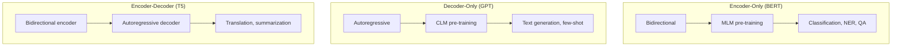

# Language Models

A language model assigns probabilities to sequences of tokens. This seemingly simple task --- predicting the next word --- turns out to be the foundation of modern AI. This page traces the evolution from n-gram models through neural LMs to transformer-based GPT, BERT, and T5, explains pre-training objectives, derives scaling laws, discusses emergent abilities, and builds a tiny language model from scratch.

## What Is a Language Model?

A language model defines a probability distribution over sequences of tokens:

$$
P(w_1, w_2, \ldots, w_T) = \prod_{t=1}^{T} P(w_t | w_1, \ldots, w_{t-1})
$$

This factorization (the chain rule of probability) says: the probability of a sentence is the product of conditional probabilities of each word given all previous words.

**Uses:**
- Text generation (complete the sentence)
- Perplexity scoring (which sentence is more likely)
- Feature extraction (contextual embeddings)
- Zero-shot classification (which label is most likely)

## N-gram Language Models

### Markov Assumption

An $n$-gram model assumes each word depends only on the previous $n-1$ words:

$$
P(w_t | w_1, \ldots, w_{t-1}) \approx P(w_t | w_{t-n+1}, \ldots, w_{t-1})
$$

**Bigram ($n=2$):**

$$
P(w_t | w_{t-1}) = \frac{\text{count}(w_{t-1}, w_t)}{\text{count}(w_{t-1})}
$$

### Smoothing

Many valid n-grams have zero count in the training corpus. Smoothing assigns non-zero probability to unseen n-grams.

**Laplace (add-1) smoothing:**

$$
P(w_t | w_{t-1}) = \frac{\text{count}(w_{t-1}, w_t) + 1}{\text{count}(w_{t-1}) + V}
$$

**Kneser-Ney smoothing** (state-of-the-art for n-grams): uses absolute discounting and a backoff distribution based on how many different contexts a word appears in.

### Limitations

- **Sparse:** Most n-grams are never observed, even with smoothing
- **No generalization:** "cat sat on mat" gives no information about "dog sat on rug"
- **Fixed context:** 5-gram is practical maximum (memory explodes)

```python
from collections import defaultdict, Counter
import random

class BigramLM:
    def __init__(self):
        self.bigram_counts = defaultdict(Counter)
        self.unigram_counts = Counter()

    def train(self, corpus):
        """corpus: list of sentences, each a list of tokens."""
        for sentence in corpus:
            tokens = ['<s>'] + sentence + ['</s>']
            for i in range(1, len(tokens)):
                self.bigram_counts[tokens[i-1]][tokens[i]] += 1
                self.unigram_counts[tokens[i-1]] += 1

    def probability(self, word, context, alpha=1.0):
        """P(word | context) with Laplace smoothing."""
        vocab_size = len(set(w for counts in self.bigram_counts.values()
                           for w in counts))
        return ((self.bigram_counts[context][word] + alpha) /
                (self.unigram_counts[context] + alpha * vocab_size))

    def generate(self, max_len=20):
        tokens = ['<s>']
        for _ in range(max_len):
            context = tokens[-1]
            candidates = list(self.bigram_counts[context].keys())
            if not candidates or tokens[-1] == '</s>':
                break
            weights = [self.bigram_counts[context][w] for w in candidates]
            next_word = random.choices(candidates, weights=weights)[0]
            tokens.append(next_word)
        return ' '.join(tokens[1:-1])
```

## Neural Language Models

### Feed-Forward Neural LM (Bengio et al., 2003)

The first neural language model looked up word embeddings and fed a fixed context window through a feed-forward network:

$$
P(w_t | w_{t-n+1}, \ldots, w_{t-1}) = \text{softmax}(W_2 \tanh(W_1 [e_{t-n+1}; \ldots; e_{t-1}] + b_1) + b_2)
$$

**Key insight:** Similar words get similar embeddings, so the model generalizes: seeing "the cat sat" helps predict after "the dog sat."

### RNN Language Model (Mikolov et al., 2010)

RNNs removed the fixed context window:

$$
h_t = \tanh(W_{hh} h_{t-1} + W_{xh} e_t)
$$

$$
P(w_{t+1}) = \text{softmax}(W_{hy} h_t)
$$

But vanishing gradients limited effective context to ~20 tokens. LSTMs extended this but were still fundamentally sequential.

## Transformer Language Models

### Pre-Training Objectives

#### Causal Language Modeling (CLM)

Used by GPT, GPT-2, GPT-3, LLaMA. Predict the next token given all previous tokens:

$$
\mathcal{L}_{\text{CLM}} = -\sum_{t=1}^{T} \log P(w_t | w_1, \ldots, w_{t-1})
$$

The model uses a causal mask so position $t$ can only attend to positions $\leq t$.

```python
# Causal LM loss in PyTorch
import torch.nn.functional as F

logits = model(input_ids)          # (batch, seq_len, vocab_size)
shift_logits = logits[:, :-1, :]   # Predict next token
shift_labels = input_ids[:, 1:]    # Target is shifted by 1
loss = F.cross_entropy(
    shift_logits.reshape(-1, vocab_size),
    shift_labels.reshape(-1)
)
```

#### Masked Language Modeling (MLM)

Used by BERT. Randomly mask 15% of tokens and predict them:

$$
\mathcal{L}_{\text{MLM}} = -\sum_{i \in \mathcal{M}} \log P(w_i | w_{\backslash \mathcal{M}})
$$

where $\mathcal{M}$ is the set of masked positions. The model sees the full context (bidirectional).

Of the 15% selected:
- 80% are replaced with `[MASK]`
- 10% are replaced with a random token
- 10% are kept unchanged

#### Span Corruption (T5)

Replace random contiguous spans with sentinel tokens and predict the missing spans. More sample-efficient than MLM.

### The Big Three Architectures



| Architecture | Models | Pre-training | Best For |
|-------------|--------|-------------|----------|
| Encoder-only | BERT, RoBERTa, DeBERTa | MLM | Classification, NER, extraction |
| Decoder-only | GPT-2/3/4, LLaMA, Mistral | CLM | Generation, few-shot, chat |
| Encoder-decoder | T5, BART, mT5 | Span corruption | Translation, summarization |

## Scaling Laws

Kaplan et al. (2020) discovered that LM performance follows predictable power laws:

### Loss vs Parameters

$$
L(N) = \left(\frac{N_c}{N}\right)^{\alpha_N}, \quad \alpha_N \approx 0.076
$$

### Loss vs Data

$$
L(D) = \left(\frac{D_c}{D}\right)^{\alpha_D}, \quad \alpha_D \approx 0.095
$$

### Loss vs Compute

$$
L(C) = \left(\frac{C_c}{C}\right)^{\alpha_C}, \quad \alpha_C \approx 0.050
$$

### Chinchilla Scaling (Hoffmann et al., 2022)

The optimal allocation of a compute budget $C$ is:

$$
N_{\text{opt}} \propto C^{0.5}, \quad D_{\text{opt}} \propto C^{0.5}
$$

This means parameters and data should be scaled equally. Prior models (GPT-3, Gopher) were significantly undertrained --- too many parameters, not enough data. Chinchilla (70B params, 1.4T tokens) outperformed Gopher (280B params, 300B tokens).

### Implications

| Model | Parameters | Training Tokens | Chinchilla-Optimal? |
|-------|-----------|----------------|-------------------|
| GPT-3 | 175B | 300B | No (undertrained) |
| Chinchilla | 70B | 1.4T | Yes |
| LLaMA | 65B | 1.4T | Approximately |
| LLaMA 2 | 70B | 2T | Over-trained (for inference efficiency) |
| LLaMA 3 | 70B | 15T | Heavily over-trained |

::: tip Over-Training Is Intentional
Modern practice deliberately over-trains (more data than Chinchilla-optimal) because inference cost depends only on parameter count, not training data. A smaller, over-trained model is cheaper to serve.
:::

## Emergent Abilities

Abilities that appear suddenly at certain model scales, absent in smaller models:

- **Few-shot learning:** appears around 10B parameters
- **Chain-of-thought reasoning:** appears around 100B parameters
- **Instruction following:** emerges with scale + fine-tuning

Whether emergence is real or a measurement artifact is debated (Schaeffer et al., 2023 suggest it depends on the evaluation metric).

## Building a Tiny Language Model from Scratch

```python
import torch
import torch.nn as nn
import torch.nn.functional as F
import math

class TinyLM(nn.Module):
    """A minimal GPT-style language model."""
    def __init__(self, vocab_size, d_model=256, n_heads=4,
                 n_layers=4, d_ff=512, max_len=512, dropout=0.1):
        super().__init__()
        self.d_model = d_model
        self.token_emb = nn.Embedding(vocab_size, d_model)
        self.pos_emb = nn.Embedding(max_len, d_model)
        self.dropout = nn.Dropout(dropout)

        self.layers = nn.ModuleList([
            TransformerBlock(d_model, n_heads, d_ff, dropout)
            for _ in range(n_layers)
        ])
        self.ln_f = nn.LayerNorm(d_model)
        self.head = nn.Linear(d_model, vocab_size, bias=False)

        # Weight tying
        self.head.weight = self.token_emb.weight

        self.apply(self._init_weights)

    def _init_weights(self, module):
        if isinstance(module, nn.Linear):
            nn.init.normal_(module.weight, mean=0.0, std=0.02)
            if module.bias is not None:
                nn.init.zeros_(module.bias)
        elif isinstance(module, nn.Embedding):
            nn.init.normal_(module.weight, mean=0.0, std=0.02)

    def forward(self, idx, targets=None):
        B, T = idx.shape
        tok_emb = self.token_emb(idx)
        pos_emb = self.pos_emb(torch.arange(T, device=idx.device))
        x = self.dropout(tok_emb + pos_emb)

        # Create causal mask
        mask = torch.tril(torch.ones(T, T, device=idx.device)).unsqueeze(0).unsqueeze(0)

        for layer in self.layers:
            x = layer(x, mask)

        x = self.ln_f(x)
        logits = self.head(x)

        loss = None
        if targets is not None:
            loss = F.cross_entropy(
                logits.view(-1, logits.size(-1)),
                targets.view(-1)
            )
        return logits, loss

    @torch.no_grad()
    def generate(self, idx, max_new_tokens, temperature=1.0, top_k=None):
        for _ in range(max_new_tokens):
            # Crop to max length
            idx_cond = idx[:, -512:]
            logits, _ = self(idx_cond)
            logits = logits[:, -1, :] / temperature

            if top_k is not None:
                v, _ = torch.topk(logits, top_k)
                logits[logits < v[:, [-1]]] = float('-inf')

            probs = F.softmax(logits, dim=-1)
            idx_next = torch.multinomial(probs, num_samples=1)
            idx = torch.cat([idx, idx_next], dim=1)
        return idx


class TransformerBlock(nn.Module):
    def __init__(self, d_model, n_heads, d_ff, dropout):
        super().__init__()
        self.attn = CausalSelfAttention(d_model, n_heads, dropout)
        self.ff = nn.Sequential(
            nn.Linear(d_model, d_ff),
            nn.GELU(),
            nn.Linear(d_ff, d_model),
            nn.Dropout(dropout),
        )
        self.ln1 = nn.LayerNorm(d_model)
        self.ln2 = nn.LayerNorm(d_model)

    def forward(self, x, mask):
        x = x + self.attn(self.ln1(x), mask)
        x = x + self.ff(self.ln2(x))
        return x


class CausalSelfAttention(nn.Module):
    def __init__(self, d_model, n_heads, dropout):
        super().__init__()
        self.n_heads = n_heads
        self.d_k = d_model // n_heads
        self.qkv = nn.Linear(d_model, 3 * d_model)
        self.proj = nn.Linear(d_model, d_model)
        self.dropout = nn.Dropout(dropout)

    def forward(self, x, mask):
        B, T, C = x.shape
        qkv = self.qkv(x).reshape(B, T, 3, self.n_heads, self.d_k)
        qkv = qkv.permute(2, 0, 3, 1, 4)
        q, k, v = qkv[0], qkv[1], qkv[2]

        att = (q @ k.transpose(-2, -1)) / math.sqrt(self.d_k)
        att = att.masked_fill(mask == 0, float('-inf'))
        att = self.dropout(F.softmax(att, dim=-1))
        y = att @ v

        y = y.transpose(1, 2).contiguous().view(B, T, C)
        return self.proj(y)


# ── Training on Shakespeare ─────────────────────────────────────────
def train_tiny_lm():
    # Load text (e.g., tiny Shakespeare)
    with open('input.txt', 'r') as f:
        text = f.read()

    # Character-level tokenization
    chars = sorted(set(text))
    char2idx = {c: i for i, c in enumerate(chars)}
    idx2char = {i: c for c, i in char2idx.items()}
    vocab_size = len(chars)

    data = torch.tensor([char2idx[c] for c in text], dtype=torch.long)

    # Train/val split
    n = int(0.9 * len(data))
    train_data, val_data = data[:n], data[n:]

    # Model
    device = 'cuda' if torch.cuda.is_available() else 'cpu'
    model = TinyLM(vocab_size, d_model=128, n_heads=4, n_layers=4).to(device)
    optimizer = torch.optim.AdamW(model.parameters(), lr=3e-4)

    block_size = 128
    batch_size = 32

    for step in range(5000):
        # Sample random batch
        ix = torch.randint(len(train_data) - block_size, (batch_size,))
        x = torch.stack([train_data[i:i+block_size] for i in ix]).to(device)
        y = torch.stack([train_data[i+1:i+block_size+1] for i in ix]).to(device)

        _, loss = model(x, y)
        optimizer.zero_grad()
        loss.backward()
        optimizer.step()

        if (step + 1) % 500 == 0:
            print(f"Step {step+1}: loss={loss.item():.4f}")

    # Generate
    start = torch.zeros(1, 1, dtype=torch.long, device=device)
    generated = model.generate(start, max_new_tokens=200, temperature=0.8)
    print(''.join([idx2char[i.item()] for i in generated[0]]))

if __name__ == '__main__':
    train_tiny_lm()
```

## Perplexity

The standard evaluation metric for language models:

$$
\text{PPL} = \exp\left(-\frac{1}{T} \sum_{t=1}^{T} \log P(w_t | w_{<t})\right)
$$

Lower perplexity = better model. Perplexity can be interpreted as the effective number of equally likely next tokens at each position.

| Model | Perplexity (WikiText-103) |
|-------|--------------------------|
| 5-gram KN | ~150 |
| LSTM | ~48 |
| GPT-2 (117M) | ~30 |
| GPT-2 (1.5B) | ~18 |
| GPT-3 (175B) | ~10 |

::: details Worked Example — Perplexity Calculation

**Setup:** A language model evaluated on the sentence "the cat sat" (3 tokens). The model assigns these probabilities:

| Position | Token | $P(w_t | w_{<t})$ | $\log P$ |
|---|---|---|---|
| 1 | the | 0.10 | $-2.303$ |
| 2 | cat | 0.05 | $-2.996$ |
| 3 | sat | 0.20 | $-1.609$ |

**Step 1:** Average negative log-likelihood:
$$-\frac{1}{3}\sum \log P = -\frac{1}{3}(-2.303 + (-2.996) + (-1.609)) = \frac{6.908}{3} = 2.303$$

**Step 2:** Exponentiate:
$$\text{PPL} = e^{2.303} = 10.0$$

**Interpretation:** On average, the model is as uncertain as choosing uniformly among 10 equally likely tokens at each position. A model assigning $P = 0.5$ to every token would have PPL = 2 (like a coin flip). A perfect model with $P = 1.0$ for every token would have PPL = 1.

**Compare two models:**
- Model A: PPL = 10 on test set (like choosing from 10 options)
- Model B: PPL = 30 on test set (like choosing from 30 options)
- Model A is better --- it's less "confused" about the next token.

:::

## Cross-References

- **Architecture:** [Transformers](/deep-learning/transformers) --- self-attention, positional encoding
- **Embeddings:** [NLP Fundamentals](/deep-learning/nlp-fundamentals) --- Word2Vec, tokenization
- **BERT details:** [BERT Family](/deep-learning/bert-family) --- encoder-only models
- **Generation:** [Text Generation](/deep-learning/text-generation) --- decoding, RLHF
- **Scaling:** [Model Optimization](/deep-learning/model-optimization) --- quantization, distillation
- **Multimodal:** [Multimodal Models](/deep-learning/multimodal-models) --- vision-language models
