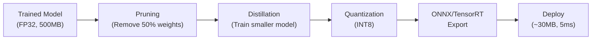

# Model Optimization

Production models must be fast, small, and efficient. A 70B-parameter model is useless if it takes 30 seconds to respond. This page covers every major optimization technique: pruning (removing unnecessary weights), quantization (reducing precision), knowledge distillation (training a smaller model), and deployment with ONNX and TensorRT.

## Why Optimize?

| Metric | Unoptimized | Optimized | Technique |
|--------|-----------|-----------|-----------|
| Model size | 500 MB | 125 MB | INT8 quantization |
| Inference latency | 100 ms | 25 ms | TensorRT + INT8 |
| Memory usage | 8 GB | 2 GB | Quantization + pruning |
| Throughput | 10 req/s | 60 req/s | Batching + optimization |
| Mobile deployment | Impossible | Possible | Distillation + quantization |

## Pruning

Remove unnecessary weights (set them to zero) to reduce model size and computation.

### Unstructured Pruning

Remove individual weights based on magnitude:

$$
W_{ij}' = \begin{cases} W_{ij} & \text{if } |W_{ij}| > \tau \\ 0 & \text{otherwise} \end{cases}
$$

where $\tau$ is the pruning threshold, often set to achieve a target sparsity (e.g., 90%).

```python
import torch
import torch.nn.utils.prune as prune

model = torchvision.models.resnet50(weights='DEFAULT')

# Prune 30% of weights in each Conv2d layer
for name, module in model.named_modules():
    if isinstance(module, torch.nn.Conv2d):
        prune.l1_unstructured(module, name='weight', amount=0.3)

# Check sparsity
total = 0
zero = 0
for name, module in model.named_modules():
    if isinstance(module, torch.nn.Conv2d):
        total += module.weight.nelement()
        zero += (module.weight == 0).sum().item()
print(f"Sparsity: {100 * zero / total:.1f}%")

# Make pruning permanent
for name, module in model.named_modules():
    if isinstance(module, torch.nn.Conv2d):
        prune.remove(module, 'weight')
```

### Structured Pruning

Remove entire channels, filters, or layers. More hardware-friendly (no sparse matrix support needed):

```python
# Remove 20% of channels from each Conv2d
for name, module in model.named_modules():
    if isinstance(module, torch.nn.Conv2d):
        prune.ln_structured(module, name='weight', amount=0.2, n=2, dim=0)
```

### Iterative Magnitude Pruning (IMP)

The Lottery Ticket Hypothesis (Frankle and Carlin, 2019): dense networks contain sparse subnetworks that can train to the same accuracy.

1. Train the full network
2. Prune the smallest 20% of weights
3. Reset remaining weights to their initial values
4. Retrain
5. Repeat

## Quantization

Reduce the precision of weights and/or activations from FP32 to INT8 or lower.

### Quantization Fundamentals

Map floating-point values to integers:

$$
q = \text{round}\left(\frac{x}{s}\right) + z
$$

where $s$ (scale) and $z$ (zero-point) are calibration parameters:

$$
s = \frac{x_{\max} - x_{\min}}{q_{\max} - q_{\min}}, \quad z = \text{round}\left(\frac{-x_{\min}}{s}\right)
$$

Dequantize back to float:

$$
x = s \cdot (q - z)
$$

::: details Worked Example — INT8 Quantization of a Small Weight Matrix

**Input:** FP32 weight matrix:
$$W = \begin{bmatrix} 0.35 & -1.20 & 0.80 \\ -0.50 & 1.50 & 0.05 \end{bmatrix}$$

INT8 range: $q_{\min} = -128$, $q_{\max} = 127$

**Step 1:** Find min/max of weights:
$$x_{\min} = -1.20, \quad x_{\max} = 1.50$$

**Step 2:** Compute scale and zero-point:
$$s = \frac{1.50 - (-1.20)}{127 - (-128)} = \frac{2.70}{255} = 0.01059$$
$$z = \text{round}\left(\frac{-(-1.20)}{0.01059}\right) = \text{round}(113.3) = 113$$

**Step 3:** Quantize each weight $q = \text{round}(x/s) + z$:

| $W_{ij}$ | $\text{round}(W_{ij}/0.01059)$ | $+ z = 113$ | Quantized |
|---|---|---|---|
| 0.35 | 33 | 146 → clamp to **127** | 127 |
| -1.20 | -113 | 0 | **0** |
| 0.80 | 76 | 189 → clamp to **127** | 127 |
| -0.50 | -47 | 66 | **66** |
| 1.50 | 142 | 255 → clamp to **127** | 127 |
| 0.05 | 5 | 118 | **118** |

**Step 4:** Dequantize to verify accuracy: $x' = s \cdot (q - z)$

| Quantized $q$ | $q - 113$ | $\times 0.01059$ | Dequantized | Original | Error |
|---|---|---|---|---|---|
| 127 | 14 | 0.148 | 0.148 | 0.35 | 0.202 |
| 0 | -113 | -1.197 | -1.197 | -1.20 | 0.003 |
| 127 | 14 | 0.148 | 0.148 | 0.80 | 0.652 |
| 66 | -47 | -0.498 | -0.498 | -0.50 | 0.002 |
| 127 | 14 | 0.148 | 0.148 | 1.50 | 1.352 |
| 118 | 5 | 0.053 | 0.053 | 0.05 | 0.003 |

**Result:** Values near the extremes (0.35, 0.80, 1.50) all got clamped to 127, causing large errors. This happens because INT8 has limited range. In practice, outlier-aware methods like AWQ handle this by scaling important weights before quantization to protect them from clipping.

:::

### Precision Comparison

| Precision | Bits | Range | Model Size (7B params) |
|-----------|------|-------|----------------------|
| FP32 | 32 | $\pm 3.4 \times 10^{38}$ | 28 GB |
| FP16 | 16 | $\pm 6.5 \times 10^4$ | 14 GB |
| BF16 | 16 | $\pm 3.4 \times 10^{38}$ (less precision) | 14 GB |
| INT8 | 8 | -128 to 127 | 7 GB |
| INT4 | 4 | -8 to 7 | 3.5 GB |

### Post-Training Quantization (PTQ)

Quantize a trained model without retraining:

```python
import torch

# Dynamic quantization (weights quantized, activations quantized at runtime)
quantized_model = torch.quantization.quantize_dynamic(
    model,
    {torch.nn.Linear},  # Which layers to quantize
    dtype=torch.qint8,
)

# Compare sizes
import os
torch.save(model.state_dict(), 'fp32_model.pth')
torch.save(quantized_model.state_dict(), 'int8_model.pth')
fp32_size = os.path.getsize('fp32_model.pth') / 1e6
int8_size = os.path.getsize('int8_model.pth') / 1e6
print(f"FP32: {fp32_size:.1f} MB, INT8: {int8_size:.1f} MB")
print(f"Compression: {fp32_size / int8_size:.1f}x")
```

### Static Quantization (Better Accuracy)

Calibrate activation ranges on representative data:

```python
# 1. Prepare model
model.eval()
model.qconfig = torch.quantization.get_default_qconfig('x86')
model_prepared = torch.quantization.prepare(model)

# 2. Calibrate on representative data
with torch.no_grad():
    for batch in calibration_loader:
        model_prepared(batch)

# 3. Convert
model_quantized = torch.quantization.convert(model_prepared)
```

### Quantization-Aware Training (QAT)

Simulate quantization during training to learn robust weights:

```python
model.train()
model.qconfig = torch.quantization.get_default_qat_qconfig('x86')
model_qat = torch.quantization.prepare_qat(model)

# Train with fake quantization (simulates INT8 rounding during forward pass)
for epoch in range(num_epochs):
    for inputs, targets in train_loader:
        optimizer.zero_grad()
        outputs = model_qat(inputs)
        loss = criterion(outputs, targets)
        loss.backward()
        optimizer.step()

# Convert to quantized model
model_quantized = torch.quantization.convert(model_qat.eval())
```

### GPTQ: Post-Training Quantization for LLMs

GPTQ (Frantar et al., 2023) quantizes LLMs to 4-bit with minimal accuracy loss by solving a layer-wise quantization problem:

$$
\arg\min_{\hat{W}} \|WX - \hat{W}X\|_2^2
$$

It quantizes one weight at a time, compensating for each quantization error by adjusting the remaining weights.

```python
from transformers import AutoModelForCausalLM, AutoTokenizer, GPTQConfig

quantization_config = GPTQConfig(
    bits=4,
    dataset="c4",
    tokenizer=AutoTokenizer.from_pretrained("meta-llama/Llama-2-7b-hf"),
)

model = AutoModelForCausalLM.from_pretrained(
    "meta-llama/Llama-2-7b-hf",
    quantization_config=quantization_config,
    device_map="auto",
)
# 7B model: 28GB → ~4GB
```

### AWQ: Activation-aware Weight Quantization

AWQ (Lin et al., 2024) observes that not all weights are equally important. Weights corresponding to large activation channels are more important:

$$
\text{Importance}(w_j) \propto \mathbb{E}[|X_j|]
$$

AWQ scales important weights up before quantization (protecting them from quantization error):

$$
Q(w \cdot s) / s \approx w \quad \text{(better approximation for important weights)}
$$

### Quantization Comparison for LLMs

| Method | Bits | Calibration | Speed | Quality |
|--------|------|------------|-------|---------|
| GPTQ | 4 | Requires data | Fast inference | Good |
| AWQ | 4 | Requires data | Fastest inference | Best |
| GGUF (llama.cpp) | 2-8 | No calibration | Good (CPU) | Varies |
| bitsandbytes | 4/8 | None | Training + inference | Good |

## Knowledge Distillation

Train a small "student" model to mimic a large "teacher" model.

### The Distillation Loss

$$
\mathcal{L} = \alpha \mathcal{L}_{\text{hard}} + (1 - \alpha) T^2 \cdot D_{KL}\left(\text{softmax}\left(\frac{z_s}{T}\right) \Big\| \text{softmax}\left(\frac{z_t}{T}\right)\right)
$$

- $\mathcal{L}_{\text{hard}}$: standard cross-entropy with true labels
- $z_s, z_t$: student and teacher logits
- $T$: temperature (typically 3-20)
- $\alpha$: weight (typically 0.1-0.5)

**Why temperature?** Softmax with high $T$ produces softer probabilities that reveal relationships between classes. A teacher might say "this 7 looks a bit like a 1 and a 9" --- this "dark knowledge" helps the student learn.

::: details Worked Example — Knowledge Distillation Temperature Effect

**Setup:** Teacher logits for a digit "7": $z_t = [0.1, 1.2, 0.3, 0.5, 0.2, 0.1, 0.4, 8.0, 0.3, 1.5]$ (classes 0-9)

**$T = 1$ (standard softmax):**
- $P(\text{class 7}) = 0.975$, $P(\text{class 9}) = 0.015$, $P(\text{class 1}) = 0.010$
- Hard target: almost all probability mass on 7

**$T = 5$ (soft softmax, divide logits by 5 first):**
- Scaled logits: $[0.02, 0.24, 0.06, 0.10, 0.04, 0.02, 0.08, 1.60, 0.06, 0.30]$
- $P(\text{class 7}) = 0.332$, $P(\text{class 9}) = 0.091$, $P(\text{class 1}) = 0.085$

**Result at $T = 5$:** The softened distribution reveals that the teacher thinks this "7" is somewhat similar to a "9" (9.1%) and a "1" (8.5%) --- both visually similar digits. A "0" gets only 6.8%. This "dark knowledge" teaches the student about inter-class relationships, not just the correct label. The $T^2$ scaling in the loss compensates for the reduced gradient magnitudes.

:::

```python
import torch
import torch.nn as nn
import torch.nn.functional as F

class DistillationLoss(nn.Module):
    def __init__(self, temperature=4.0, alpha=0.3):
        super().__init__()
        self.T = temperature
        self.alpha = alpha

    def forward(self, student_logits, teacher_logits, labels):
        # Hard loss (true labels)
        hard_loss = F.cross_entropy(student_logits, labels)

        # Soft loss (teacher's knowledge)
        soft_student = F.log_softmax(student_logits / self.T, dim=1)
        soft_teacher = F.softmax(teacher_logits / self.T, dim=1)
        soft_loss = F.kl_div(soft_student, soft_teacher, reduction='batchmean')

        return self.alpha * hard_loss + (1 - self.alpha) * self.T**2 * soft_loss

# Training
teacher = load_teacher_model()  # Large model
teacher.eval()
student = create_student_model()  # Small model
criterion = DistillationLoss(temperature=4.0, alpha=0.3)

for inputs, labels in train_loader:
    with torch.no_grad():
        teacher_logits = teacher(inputs)

    student_logits = student(inputs)
    loss = criterion(student_logits, teacher_logits, labels)
    loss.backward()
    optimizer.step()
```

## ONNX Export

ONNX (Open Neural Network Exchange) is a universal model format:

```python
import torch

model.eval()
dummy_input = torch.randn(1, 3, 224, 224)

torch.onnx.export(
    model,
    dummy_input,
    'model.onnx',
    input_names=['input'],
    output_names=['output'],
    dynamic_axes={
        'input': {0: 'batch_size'},
        'output': {0: 'batch_size'},
    },
    opset_version=17,
)

# Verify
import onnx
model_onnx = onnx.load('model.onnx')
onnx.checker.check_model(model_onnx)

# Run with ONNX Runtime
import onnxruntime as ort
session = ort.InferenceSession('model.onnx')
result = session.run(None, {'input': dummy_input.numpy()})
```

## TensorRT Optimization

NVIDIA TensorRT provides kernel fusion, precision calibration, and hardware-specific optimization:

```python
import torch
import torch_tensorrt

model = torchvision.models.resnet50(weights='DEFAULT').eval().cuda()

# Compile with TensorRT
trt_model = torch_tensorrt.compile(
    model,
    inputs=[torch_tensorrt.Input(
        shape=[1, 3, 224, 224],
        dtype=torch.float16,
    )],
    enabled_precisions={torch.float16},
    workspace_size=1 << 30,  # 1 GB
)

# Benchmark
import time
input_tensor = torch.randn(1, 3, 224, 224).half().cuda()

# Warmup
for _ in range(50):
    trt_model(input_tensor)
torch.cuda.synchronize()

# Benchmark
start = time.perf_counter()
for _ in range(1000):
    trt_model(input_tensor)
torch.cuda.synchronize()
elapsed = time.perf_counter() - start
print(f"TensorRT: {elapsed / 1000 * 1000:.2f} ms per inference")
```

## Mobile Deployment

### ExecuTorch (PyTorch Mobile)

```python
import torch
from executorch.exir import to_edge

model.eval()
example_input = (torch.randn(1, 3, 224, 224),)

# Export
edge_program = to_edge(torch.export.export(model, example_input))
et_program = edge_program.to_executorch()

# Save
with open('model.pte', 'wb') as f:
    f.write(et_program.buffer)
```

### Optimization Pipeline Summary



## Benchmarking and Profiling

### Measuring Inference Latency

```python
import torch
import time

def benchmark_model(model, input_shape, device='cuda', n_warmup=50, n_runs=200):
    """Benchmark model inference latency."""
    model = model.to(device).eval()
    x = torch.randn(*input_shape, device=device)

    # Warmup
    with torch.no_grad():
        for _ in range(n_warmup):
            model(x)
    torch.cuda.synchronize()

    # Benchmark
    start = time.perf_counter()
    with torch.no_grad():
        for _ in range(n_runs):
            model(x)
    torch.cuda.synchronize()
    elapsed = time.perf_counter() - start

    latency_ms = elapsed / n_runs * 1000
    throughput = n_runs / elapsed
    print(f"Latency: {latency_ms:.2f} ms")
    print(f"Throughput: {throughput:.0f} samples/s")
    return latency_ms

# Compare FP32 vs INT8
fp32_latency = benchmark_model(model, (1, 3, 224, 224))
int8_latency = benchmark_model(quantized_model, (1, 3, 224, 224), device='cpu')
print(f"Speedup: {fp32_latency / int8_latency:.2f}x")
```

### PyTorch Profiler

```python
from torch.profiler import profile, record_function, ProfilerActivity

with profile(
    activities=[ProfilerActivity.CPU, ProfilerActivity.CUDA],
    record_shapes=True,
    profile_memory=True,
    with_stack=True,
) as prof:
    with record_function("model_inference"):
        model(input_tensor)

print(prof.key_averages().table(sort_by="cuda_time_total", row_limit=10))
# Shows which layers consume the most time and memory
```

## Serving Architectures

### Single Model Serving

```python
from fastapi import FastAPI
from pydantic import BaseModel
import torch
import base64
from io import BytesIO
from PIL import Image

app = FastAPI()
model = load_optimized_model()  # ONNX or TorchScript

class PredictRequest(BaseModel):
    image_base64: str

@app.post("/predict")
def predict(req: PredictRequest):
    # Decode image
    image_bytes = base64.b64decode(req.image_base64)
    image = Image.open(BytesIO(image_bytes)).convert('RGB')

    # Preprocess
    tensor = preprocess(image).unsqueeze(0)

    # Inference
    with torch.no_grad():
        output = model(tensor)
        probs = torch.softmax(output, dim=1)
        class_idx = probs.argmax().item()
        confidence = probs.max().item()

    return {
        "class": CLASS_NAMES[class_idx],
        "confidence": confidence,
    }
```

### Batched Inference

Accumulate requests and process as a batch for higher throughput:

```python
import asyncio
from collections import deque

class BatchPredictor:
    def __init__(self, model, max_batch=32, max_wait_ms=50):
        self.model = model
        self.max_batch = max_batch
        self.max_wait = max_wait_ms / 1000
        self.queue = deque()

    async def predict(self, input_tensor):
        future = asyncio.get_event_loop().create_future()
        self.queue.append((input_tensor, future))

        if len(self.queue) >= self.max_batch:
            self._process_batch()
        else:
            await asyncio.sleep(self.max_wait)
            if not future.done():
                self._process_batch()

        return await future

    def _process_batch(self):
        batch_items = []
        while self.queue and len(batch_items) < self.max_batch:
            batch_items.append(self.queue.popleft())

        inputs = torch.stack([item[0] for item in batch_items])
        with torch.no_grad():
            outputs = self.model(inputs)

        for i, (_, future) in enumerate(batch_items):
            if not future.done():
                future.set_result(outputs[i])
```

## Optimization Decision Matrix

| Constraint | Technique | Expected Improvement |
|-----------|-----------|---------------------|
| Model too large for deployment | INT8 quantization | 4x smaller, 2x faster |
| Latency too high | TensorRT + FP16 | 2-4x faster |
| Need to run on mobile | Distillation + INT8 + ONNX | 10-100x smaller |
| Training too expensive | LoRA fine-tuning | 100x fewer parameters |
| Memory limited for LLM | GPTQ/AWQ 4-bit | 4-8x less memory |
| Edge deployment (no GPU) | Pruning + quantization + ONNX Runtime | CPU-friendly |

## Cross-References

- **Training:** [Training Techniques](/deep-learning/training-techniques) --- mixed precision, regularization
- **Architectures:** [CNN](/deep-learning/cnn) --- models to optimize
- **LLMs:** [Language Models](/deep-learning/language-models) --- scaling and efficiency
- **BERT compression:** [BERT Family](/deep-learning/bert-family) --- DistilBERT
- **Diffusion:** [Diffusion Models](/deep-learning/diffusion-models) --- LoRA for efficient fine-tuning
