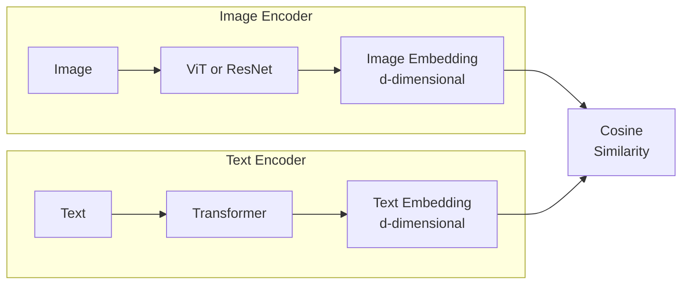
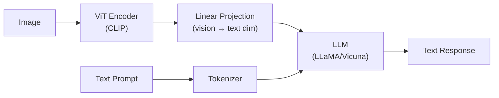

# Multimodal Models

Multimodal models process and relate information across different modalities --- text, images, audio, video. CLIP aligns images and text in a shared embedding space. Vision-language models (GPT-4V, LLaVA) understand and generate text about images. This page covers contrastive learning, zero-shot classification, image captioning, VQA, and builds a CLIP-based image search system.

## Why Multimodal?

The world is inherently multimodal. A description of a cat and a photo of a cat refer to the same concept. Multimodal models learn to connect these representations.

| Capability | Example |
|-----------|---------|
| Image search by text | "sunset over mountains" $\to$ matching photos |
| Zero-shot classification | Classify any image without training examples |
| Image captioning | Image $\to$ "A dog playing in the park" |
| Visual QA | Image + "What color is the car?" $\to$ "Red" |
| Text-to-image | "A cat wearing a hat" $\to$ generated image |

## CLIP: Contrastive Language-Image Pre-training

### Architecture

CLIP (Radford et al., 2021) trains two encoders --- one for images, one for text --- to produce aligned embeddings:



### Contrastive Learning Objective

Given a batch of $N$ image-text pairs, CLIP maximizes the cosine similarity of matching pairs and minimizes it for non-matching pairs:

$$
\mathcal{L} = -\frac{1}{2N} \sum_{i=1}^{N} \left[\log \frac{\exp(\text{sim}(I_i, T_i) / \tau)}{\sum_{j=1}^{N} \exp(\text{sim}(I_i, T_j) / \tau)} + \log \frac{\exp(\text{sim}(T_i, I_i) / \tau)}{\sum_{j=1}^{N} \exp(\text{sim}(T_i, I_j) / \tau)}\right]
$$

where $\text{sim}(I, T) = \frac{f_I(I) \cdot f_T(T)}{\|f_I(I)\| \|f_T(T)\|}$ and $\tau$ is a learned temperature.

**Interpretation:** For each image, the matching text should have the highest similarity (and vice versa) among all $N$ options in the batch. This is InfoNCE loss.

### Why Contrastive Learning Works

1. **Scale:** Trained on 400M image-text pairs from the internet
2. **Natural supervision:** Alt text, captions, descriptions are free labels
3. **Rich learning signal:** Each batch provides $N^2 - N$ negative pairs
4. **Compositionality:** Text descriptions can express complex visual concepts

### Implementation

```python
import torch
import torch.nn as nn
import torch.nn.functional as F

class CLIPModel(nn.Module):
    def __init__(self, image_encoder, text_encoder, embed_dim=512):
        super().__init__()
        self.image_encoder = image_encoder
        self.text_encoder = text_encoder
        self.image_proj = nn.Linear(image_encoder.output_dim, embed_dim)
        self.text_proj = nn.Linear(text_encoder.output_dim, embed_dim)
        self.temperature = nn.Parameter(torch.tensor(0.07))

    def encode_image(self, images):
        features = self.image_encoder(images)
        projected = self.image_proj(features)
        return F.normalize(projected, dim=-1)

    def encode_text(self, text):
        features = self.text_encoder(text)
        projected = self.text_proj(features)
        return F.normalize(projected, dim=-1)

    def forward(self, images, text):
        image_emb = self.encode_image(images)
        text_emb = self.encode_text(text)

        # Cosine similarity matrix
        logits = (image_emb @ text_emb.T) / self.temperature.exp()

        # Symmetric cross-entropy loss
        labels = torch.arange(len(images), device=images.device)
        loss_i2t = F.cross_entropy(logits, labels)
        loss_t2i = F.cross_entropy(logits.T, labels)

        return (loss_i2t + loss_t2i) / 2
```

## Zero-Shot Classification with CLIP

Classify images into arbitrary categories without any training:

```python
from transformers import CLIPProcessor, CLIPModel
from PIL import Image
import torch

model = CLIPModel.from_pretrained("openai/clip-vit-base-patch32")
processor = CLIPProcessor.from_pretrained("openai/clip-vit-base-patch32")

def zero_shot_classify(image_path, candidate_labels, template="a photo of a {}."):
    """Classify an image using text descriptions."""
    image = Image.open(image_path)
    text_prompts = [template.format(label) for label in candidate_labels]

    inputs = processor(
        text=text_prompts,
        images=image,
        return_tensors="pt",
        padding=True,
    )

    with torch.no_grad():
        outputs = model(**inputs)
        logits = outputs.logits_per_image
        probs = logits.softmax(dim=1)[0]

    results = sorted(zip(candidate_labels, probs.tolist()), key=lambda x: -x[1])
    for label, prob in results:
        print(f"  {label}: {prob:.3f}")
    return results

# Example: classify a medical image
zero_shot_classify(
    "xray.jpg",
    ["normal chest x-ray", "pneumonia", "lung cancer", "tuberculosis"]
)
```

### Prompt Engineering for CLIP

The text prompt matters. Templates improve accuracy:

```python
# ImageNet prompt ensembling (80 templates)
templates = [
    "a photo of a {}.",
    "a blurry photo of a {}.",
    "a black and white photo of a {}.",
    "a low contrast photo of a {}.",
    "a bright photo of a {}.",
    "a sculpture of a {}.",
    "a drawing of a {}.",
    "a painting of a {}.",
    # ... more templates
]

def ensemble_classify(image, labels, model, processor, templates):
    """Average predictions across multiple prompt templates."""
    all_text = []
    for label in labels:
        for template in templates:
            all_text.append(template.format(label))

    inputs = processor(text=all_text, images=image, return_tensors="pt", padding=True)
    with torch.no_grad():
        text_emb = model.get_text_features(
            input_ids=inputs['input_ids'],
            attention_mask=inputs['attention_mask']
        )
        image_emb = model.get_image_features(pixel_values=inputs['pixel_values'])

    # Reshape and average across templates
    text_emb = text_emb.view(len(labels), len(templates), -1).mean(dim=1)
    text_emb = F.normalize(text_emb, dim=-1)
    image_emb = F.normalize(image_emb, dim=-1)

    sims = (image_emb @ text_emb.T).softmax(dim=-1)
    return dict(zip(labels, sims[0].tolist()))
```

## Vision-Language Models

### Architecture Evolution

| Year | Model | Architecture | Capability |
|------|-------|-------------|-----------|
| 2021 | CLIP | Dual encoder | Zero-shot classification |
| 2022 | Flamingo | Cross-attention fusion | Few-shot visual QA |
| 2023 | LLaVA | ViT + LLM (projection) | Visual instruction following |
| 2023 | GPT-4V | Proprietary | General visual understanding |
| 2024 | LLaVA-NeXT | Improved resolution | Fine-grained understanding |

### LLaVA Architecture

LLaVA (Liu et al., 2023) connects a vision encoder to an LLM via a simple linear projection:



The visual tokens are simply concatenated with text tokens in the LLM's input sequence.

## Image Captioning

### Encoder-Decoder Approach

```python
import torch
import torch.nn as nn
from torchvision import models

class ImageCaptioner(nn.Module):
    def __init__(self, embed_dim, hidden_dim, vocab_size, num_layers=2):
        super().__init__()
        # CNN encoder (pretrained ResNet)
        resnet = models.resnet50(weights='DEFAULT')
        self.encoder = nn.Sequential(*list(resnet.children())[:-1])
        self.encoder_proj = nn.Linear(2048, embed_dim)

        # LSTM decoder
        self.embedding = nn.Embedding(vocab_size, embed_dim)
        self.lstm = nn.LSTM(embed_dim, hidden_dim, num_layers, batch_first=True)
        self.fc = nn.Linear(hidden_dim, vocab_size)
        self.dropout = nn.Dropout(0.3)

    def forward(self, images, captions):
        # Encode image
        with torch.no_grad():
            features = self.encoder(images).squeeze()
        features = self.encoder_proj(features).unsqueeze(1)

        # Embed captions and prepend image features
        cap_emb = self.embedding(captions)
        inputs = torch.cat([features, cap_emb[:, :-1]], dim=1)

        # Decode
        outputs, _ = self.lstm(inputs)
        outputs = self.fc(self.dropout(outputs))
        return outputs

    def generate(self, image, max_len=50, start_token=1, end_token=2):
        with torch.no_grad():
            features = self.encoder(image.unsqueeze(0)).squeeze()
        features = self.encoder_proj(features).unsqueeze(0).unsqueeze(0)

        tokens = [start_token]
        hidden = None
        input_emb = features

        for _ in range(max_len):
            output, hidden = self.lstm(input_emb, hidden)
            logits = self.fc(output[:, -1, :])
            token = logits.argmax(dim=-1).item()
            tokens.append(token)
            if token == end_token:
                break
            input_emb = self.embedding(torch.tensor([[token]])).to(features.device)

        return tokens
```

## Visual Question Answering (VQA)

VQA takes an image and a question, and outputs an answer.

### Simple VQA Model

```python
class VQAModel(nn.Module):
    def __init__(self, image_dim, text_dim, hidden_dim, num_answers):
        super().__init__()
        self.image_proj = nn.Linear(image_dim, hidden_dim)
        self.text_proj = nn.Linear(text_dim, hidden_dim)
        self.classifier = nn.Sequential(
            nn.Linear(hidden_dim, hidden_dim),
            nn.ReLU(),
            nn.Dropout(0.3),
            nn.Linear(hidden_dim, num_answers),
        )

    def forward(self, image_features, text_features):
        img = self.image_proj(image_features)
        txt = self.text_proj(text_features)
        # Element-wise multiplication (Hadamard product fusion)
        combined = img * txt
        return self.classifier(combined)
```

### Modern Approach: Use a VLM

```python
from transformers import AutoProcessor, AutoModelForVision2Seq

model = AutoModelForVision2Seq.from_pretrained("llava-hf/llava-1.5-7b-hf")
processor = AutoProcessor.from_pretrained("llava-hf/llava-1.5-7b-hf")

image = Image.open("image.jpg")
prompt = "USER: <image>\nWhat is happening in this image?\nASSISTANT:"

inputs = processor(text=prompt, images=image, return_tensors="pt")
output = model.generate(**inputs, max_new_tokens=200)
answer = processor.decode(output[0], skip_special_tokens=True)
```

## Building Image Search with CLIP

```python
import torch
import numpy as np
from PIL import Image
from transformers import CLIPProcessor, CLIPModel
from pathlib import Path
import json

class CLIPImageSearch:
    def __init__(self, model_name="openai/clip-vit-base-patch32"):
        self.model = CLIPModel.from_pretrained(model_name)
        self.processor = CLIPProcessor.from_pretrained(model_name)
        self.model.eval()
        self.image_paths = []
        self.image_embeddings = None

    def build_index(self, image_dir):
        """Encode all images in a directory."""
        self.image_paths = sorted(Path(image_dir).glob("*.jpg"))
        embeddings = []

        for path in self.image_paths:
            image = Image.open(path).convert("RGB")
            inputs = self.processor(images=image, return_tensors="pt")
            with torch.no_grad():
                emb = self.model.get_image_features(**inputs)
                emb = emb / emb.norm(dim=-1, keepdim=True)
            embeddings.append(emb.cpu().numpy())

        self.image_embeddings = np.vstack(embeddings)
        print(f"Indexed {len(self.image_paths)} images")

    def search_by_text(self, query, top_k=5):
        """Search images using a text query."""
        inputs = self.processor(text=[query], return_tensors="pt", padding=True)
        with torch.no_grad():
            text_emb = self.model.get_text_features(**inputs)
            text_emb = text_emb / text_emb.norm(dim=-1, keepdim=True)

        similarities = (text_emb.cpu().numpy() @ self.image_embeddings.T)[0]
        top_indices = similarities.argsort()[-top_k:][::-1]

        results = []
        for idx in top_indices:
            results.append({
                'path': str(self.image_paths[idx]),
                'score': float(similarities[idx]),
            })
        return results

    def search_by_image(self, query_image_path, top_k=5):
        """Search similar images using an image query."""
        image = Image.open(query_image_path).convert("RGB")
        inputs = self.processor(images=image, return_tensors="pt")
        with torch.no_grad():
            query_emb = self.model.get_image_features(**inputs)
            query_emb = query_emb / query_emb.norm(dim=-1, keepdim=True)

        similarities = (query_emb.cpu().numpy() @ self.image_embeddings.T)[0]
        top_indices = similarities.argsort()[-top_k:][::-1]

        return [
            {'path': str(self.image_paths[i]), 'score': float(similarities[i])}
            for i in top_indices
        ]

# Usage
searcher = CLIPImageSearch()
searcher.build_index("./photos")
results = searcher.search_by_text("a sunset over the ocean")
for r in results:
    print(f"  {r['path']}: {r['score']:.3f}")
```

## Multimodal Embedding Spaces

### Alignment Quality Matters

| Model | ImageNet Zero-Shot | Retrieval (Flickr30k) |
|-------|-------------------|----------------------|
| CLIP ViT-B/32 | 63.2% | 88.0% |
| CLIP ViT-L/14 | 75.3% | 93.4% |
| SigLIP | 77.1% | 94.2% |
| OpenCLIP ViT-G/14 | 80.1% | 95.1% |

### Embedding Space Properties

- **Linear separability:** Classes are linearly separable in CLIP space
- **Compositionality:** "red car" is near both "red" and "car" embeddings
- **Cross-modal alignment:** Image of a cat is near text "a cat"
- **Zero-shot transfer:** Embeddings generalize to unseen categories

## Cross-References

- **CLIP details:** [Transfer Learning](/deep-learning/transfer-learning) --- zero-shot CLIP
- **Transformers:** [Transformers](/deep-learning/transformers) --- attention mechanism
- **ViT:** [Image Classification](/deep-learning/image-classification) --- vision transformer
- **Text conditioning:** [Diffusion Models](/deep-learning/diffusion-models) --- CLIP in Stable Diffusion
- **NLP encoding:** [BERT Family](/deep-learning/bert-family) --- text encoders
- **Generative:** [Text Generation](/deep-learning/text-generation) --- multimodal generation
