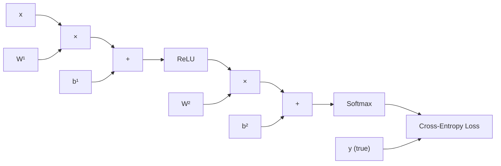

# Neural Network Basics

Everything in deep learning rests on a handful of ideas: neurons that compute weighted sums, nonlinear activations, a forward pass that turns input into prediction, a backward pass that turns error into gradients, and an optimizer that updates weights. This page derives every one of those pieces from first principles, then glues them together into a working MLP trained on MNIST with nothing but NumPy.

## The Perceptron

The perceptron is the simplest neural network --- a single neuron that makes binary decisions.

Given an input vector $x \in \mathbb{R}^n$ and a weight vector $w \in \mathbb{R}^n$ with bias $b$, the perceptron computes:

$$
\hat{y} = \begin{cases} 1 & \text{if } w \cdot x + b > 0 \\ 0 & \text{otherwise} \end{cases}
$$

The decision boundary is a hyperplane $w \cdot x + b = 0$.

### Perceptron Learning Rule

The weight update for a misclassified sample is:

$$
w \leftarrow w + \eta (y - \hat{y}) x
$$

$$
b \leftarrow b + \eta (y - \hat{y})
$$

where $\eta$ is the learning rate and $y$ is the true label.

::: warning The XOR Problem
A single perceptron can only learn linearly separable functions. It cannot learn XOR. This limitation drove the development of multi-layer networks.
:::

### Perceptron in Python

```python
import numpy as np

class Perceptron:
    def __init__(self, n_features, lr=0.01):
        self.w = np.zeros(n_features)
        self.b = 0.0
        self.lr = lr

    def predict(self, x):
        return 1 if np.dot(self.w, x) + self.b > 0 else 0

    def train(self, X, y, epochs=100):
        for _ in range(epochs):
            for xi, yi in zip(X, y):
                pred = self.predict(xi)
                error = yi - pred
                self.w += self.lr * error * xi
                self.b += self.lr * error

# AND gate
X = np.array([[0, 0], [0, 1], [1, 0], [1, 1]])
y = np.array([0, 0, 0, 1])
p = Perceptron(2)
p.train(X, y)
print([p.predict(xi) for xi in X])  # [0, 0, 0, 1]
```

## Multi-Layer Perceptron (MLP)

An MLP stacks multiple layers of neurons. Each neuron in layer $l$ receives input from every neuron in layer $l-1$ (fully connected). With nonlinear activations between layers, MLPs can approximate any continuous function.

### Architecture

For an MLP with $L$ layers:

$$
a^{(0)} = x \quad \text{(input)}
$$

$$
z^{(l)} = W^{(l)} a^{(l-1)} + b^{(l)} \quad \text{(pre-activation)}
$$

$$
a^{(l)} = \sigma^{(l)}(z^{(l)}) \quad \text{(activation)}
$$

$$
\hat{y} = a^{(L)} \quad \text{(output)}
$$

where $W^{(l)} \in \mathbb{R}^{n_l \times n_{l-1}}$ is the weight matrix for layer $l$, $b^{(l)} \in \mathbb{R}^{n_l}$ is the bias, and $\sigma^{(l)}$ is the activation function.

## Activation Functions

Activation functions introduce nonlinearity. Without them, stacking linear layers collapses to a single linear transformation: $W_2(W_1 x + b_1) + b_2 = W' x + b'$.

### Sigmoid

$$
\sigma(x) = \frac{1}{1 + e^{-x}}
$$

**Derivative:**

$$
\sigma'(x) = \sigma(x)(1 - \sigma(x))
$$

**Derivation:** Let $\sigma = (1 + e^{-x})^{-1}$. By the chain rule:

$$
\frac{d\sigma}{dx} = -1 \cdot (1 + e^{-x})^{-2} \cdot (-e^{-x}) = \frac{e^{-x}}{(1 + e^{-x})^2}
$$

Since $e^{-x} = \frac{1}{\sigma} - 1 = \frac{1 - \sigma}{\sigma}$:

$$
\sigma' = \frac{\frac{1-\sigma}{\sigma}}{\frac{1}{\sigma^2}} = \sigma(1 - \sigma)
$$

**Properties:** Output in $(0, 1)$. Suffers from vanishing gradients --- when $|x|$ is large, $\sigma' \approx 0$, which kills gradient flow. Used mainly in output layers for binary classification.

### Tanh

$$
\tanh(x) = \frac{e^x - e^{-x}}{e^x + e^{-x}}
$$

**Derivative:**

$$
\tanh'(x) = 1 - \tanh^2(x)
$$

**Derivation:** Using the quotient rule on $\tanh = \frac{e^x - e^{-x}}{e^x + e^{-x}}$:

$$
\tanh' = \frac{(e^x + e^{-x})^2 - (e^x - e^{-x})^2}{(e^x + e^{-x})^2} = 1 - \tanh^2(x)
$$

**Properties:** Output in $(-1, 1)$, zero-centered (unlike sigmoid). Still suffers from vanishing gradients at extremes. Common in RNN hidden states.

### ReLU (Rectified Linear Unit)

$$
\text{ReLU}(x) = \max(0, x)
$$

**Derivative:**

$$
\text{ReLU}'(x) = \begin{cases} 1 & \text{if } x > 0 \\ 0 & \text{if } x < 0 \end{cases}
$$

(Undefined at $x = 0$; conventionally set to 0 or 1.)

**Properties:** No vanishing gradient for positive inputs. Sparse activations (many neurons output 0). Computationally efficient. Suffers from "dying ReLU" --- neurons with negative input always output 0 and never recover.

### Leaky ReLU

$$
\text{LeakyReLU}(x) = \begin{cases} x & \text{if } x > 0 \\ \alpha x & \text{if } x \le 0 \end{cases}
$$

where $\alpha$ is typically 0.01. Fixes the dying ReLU problem by allowing a small gradient for negative inputs.

### GELU (Gaussian Error Linear Unit)

$$
\text{GELU}(x) = x \cdot \Phi(x) = x \cdot \frac{1}{2}\left[1 + \text{erf}\left(\frac{x}{\sqrt{2}}\right)\right]
$$

**Approximate form:**

$$
\text{GELU}(x) \approx 0.5x\left(1 + \tanh\left[\sqrt{\frac{2}{\pi}}\left(x + 0.044715 x^3\right)\right]\right)
$$

**Properties:** Smooth, non-monotonic. Used in BERT, GPT, and most modern transformers. Combines the benefits of ReLU (non-saturating for large positive $x$) with a smooth transition near zero.

### Softmax (for output layers)

$$
\text{softmax}(z_i) = \frac{e^{z_i}}{\sum_{j=1}^{K} e^{z_j}}
$$

Converts a vector of logits into a probability distribution. Used in the output layer of multi-class classifiers.

### Activation Function Comparison

```python
import numpy as np
import matplotlib.pyplot as plt

x = np.linspace(-5, 5, 1000)

fig, axes = plt.subplots(2, 3, figsize=(15, 8))

# Sigmoid
axes[0, 0].plot(x, 1 / (1 + np.exp(-x)), 'b-', linewidth=2)
axes[0, 0].set_title('Sigmoid')
axes[0, 0].axhline(y=0, color='k', linewidth=0.5)
axes[0, 0].axvline(x=0, color='k', linewidth=0.5)
axes[0, 0].grid(True, alpha=0.3)

# Tanh
axes[0, 1].plot(x, np.tanh(x), 'r-', linewidth=2)
axes[0, 1].set_title('Tanh')
axes[0, 1].axhline(y=0, color='k', linewidth=0.5)
axes[0, 1].axvline(x=0, color='k', linewidth=0.5)
axes[0, 1].grid(True, alpha=0.3)

# ReLU
axes[0, 2].plot(x, np.maximum(0, x), 'g-', linewidth=2)
axes[0, 2].set_title('ReLU')
axes[0, 2].axhline(y=0, color='k', linewidth=0.5)
axes[0, 2].axvline(x=0, color='k', linewidth=0.5)
axes[0, 2].grid(True, alpha=0.3)

# Leaky ReLU
axes[1, 0].plot(x, np.where(x > 0, x, 0.01 * x), 'm-', linewidth=2)
axes[1, 0].set_title('Leaky ReLU (α=0.01)')
axes[1, 0].axhline(y=0, color='k', linewidth=0.5)
axes[1, 0].axvline(x=0, color='k', linewidth=0.5)
axes[1, 0].grid(True, alpha=0.3)

# GELU
from scipy.special import erf
gelu = 0.5 * x * (1 + erf(x / np.sqrt(2)))
axes[1, 1].plot(x, gelu, 'c-', linewidth=2)
axes[1, 1].set_title('GELU')
axes[1, 1].axhline(y=0, color='k', linewidth=0.5)
axes[1, 1].axvline(x=0, color='k', linewidth=0.5)
axes[1, 1].grid(True, alpha=0.3)

# Derivatives comparison
sig = 1 / (1 + np.exp(-x))
axes[1, 2].plot(x, sig * (1 - sig), 'b--', label="Sigmoid'", linewidth=2)
axes[1, 2].plot(x, 1 - np.tanh(x)**2, 'r--', label="Tanh'", linewidth=2)
axes[1, 2].plot(x, np.where(x > 0, 1, 0).astype(float), 'g--', label="ReLU'", linewidth=2)
axes[1, 2].set_title('Derivatives')
axes[1, 2].legend()
axes[1, 2].grid(True, alpha=0.3)

plt.tight_layout()
plt.savefig('activations.png', dpi=150)
```

## The Forward Pass

The forward pass computes the output of the network layer by layer.

For a 3-layer MLP with input $x$, hidden sizes $h_1, h_2$, and output size $K$:

$$
z^{(1)} = W^{(1)} x + b^{(1)}, \quad a^{(1)} = \text{ReLU}(z^{(1)})
$$

$$
z^{(2)} = W^{(2)} a^{(1)} + b^{(2)}, \quad a^{(2)} = \text{ReLU}(z^{(2)})
$$

$$
z^{(3)} = W^{(3)} a^{(2)} + b^{(3)}, \quad \hat{y} = \text{softmax}(z^{(3)})
$$

Each step is a matrix multiplication followed by an element-wise nonlinearity. The forward pass stores all intermediate values ($z^{(l)}$ and $a^{(l)}$) because backpropagation needs them.

## Loss Functions

The loss function measures how far the prediction $\hat{y}$ is from the true label $y$. Training minimizes this loss.

### Mean Squared Error (MSE)

$$
\mathcal{L}_{\text{MSE}} = \frac{1}{N} \sum_{i=1}^{N} (y_i - \hat{y}_i)^2
$$

Used for regression. Derivative: $\frac{\partial \mathcal{L}}{\partial \hat{y}_i} = \frac{2}{N}(\hat{y}_i - y_i)$.

### Cross-Entropy Loss

For classification with $K$ classes:

$$
\mathcal{L}_{\text{CE}} = -\sum_{i=1}^{N} \sum_{k=1}^{K} y_{ik} \log(\hat{y}_{ik})
$$

With one-hot labels ($y_{ik} = 1$ only for the correct class $c$):

$$
\mathcal{L}_{\text{CE}} = -\frac{1}{N} \sum_{i=1}^{N} \log(\hat{y}_{i,c_i})
$$

**Why cross-entropy, not MSE, for classification?** MSE gradients near 0 or 1 are tiny (due to sigmoid saturation), so learning is very slow. Cross-entropy produces large gradients when the prediction is wrong, enabling faster learning.

### Binary Cross-Entropy

$$
\mathcal{L}_{\text{BCE}} = -\frac{1}{N} \sum_{i=1}^{N} \left[ y_i \log(\hat{y}_i) + (1 - y_i) \log(1 - \hat{y}_i) \right]
$$

## Backpropagation: Full Derivation

Backpropagation is just the chain rule applied systematically from the loss back through the network.

### Setup

Consider a single training example with a 2-layer network:

$$
z^{(1)} = W^{(1)} x + b^{(1)}, \quad a^{(1)} = \sigma(z^{(1)})
$$

$$
z^{(2)} = W^{(2)} a^{(1)} + b^{(2)}, \quad \hat{y} = \text{softmax}(z^{(2)})
$$

$$
\mathcal{L} = -\sum_k y_k \log(\hat{y}_k)
$$

### Step 1: Output Layer Gradient

We need $\frac{\partial \mathcal{L}}{\partial z^{(2)}}$. For softmax + cross-entropy, this simplifies beautifully:

$$
\frac{\partial \mathcal{L}}{\partial z^{(2)}_k} = \hat{y}_k - y_k
$$

**Full derivation:** The softmax output is $\hat{y}_k = \frac{e^{z_k}}{\sum_j e^{z_j}}$. The cross-entropy is $\mathcal{L} = -\sum_k y_k \log \hat{y}_k$.

For $\frac{\partial \hat{y}_k}{\partial z_i}$, we have two cases:

When $i = k$:

$$
\frac{\partial \hat{y}_k}{\partial z_k} = \hat{y}_k(1 - \hat{y}_k)
$$

When $i \neq k$:

$$
\frac{\partial \hat{y}_k}{\partial z_i} = -\hat{y}_k \hat{y}_i
$$

Combining with the cross-entropy derivative $\frac{\partial \mathcal{L}}{\partial \hat{y}_k} = -\frac{y_k}{\hat{y}_k}$:

$$
\frac{\partial \mathcal{L}}{\partial z_i} = \sum_k \frac{\partial \mathcal{L}}{\partial \hat{y}_k} \frac{\partial \hat{y}_k}{\partial z_i} = -\sum_k \frac{y_k}{\hat{y}_k} \frac{\partial \hat{y}_k}{\partial z_i}
$$

$$
= -y_i(1 - \hat{y}_i) + \sum_{k \neq i} y_k \hat{y}_i = -y_i + y_i \hat{y}_i + \hat{y}_i \sum_{k \neq i} y_k
$$

$$
= -y_i + \hat{y}_i \sum_k y_k = \hat{y}_i - y_i
$$

(using $\sum_k y_k = 1$ for one-hot labels).

Let $\delta^{(2)} = \hat{y} - y$.

### Step 2: Weight Gradients (Output Layer)

$$
\frac{\partial \mathcal{L}}{\partial W^{(2)}} = \delta^{(2)} (a^{(1)})^T
$$

$$
\frac{\partial \mathcal{L}}{\partial b^{(2)}} = \delta^{(2)}
$$

### Step 3: Propagate to Hidden Layer

$$
\delta^{(1)} = (W^{(2)})^T \delta^{(2)} \odot \sigma'(z^{(1)})
$$

where $\odot$ is element-wise multiplication and $\sigma'$ is the derivative of the activation function.

### Step 4: Weight Gradients (Hidden Layer)

$$
\frac{\partial \mathcal{L}}{\partial W^{(1)}} = \delta^{(1)} x^T
$$

$$
\frac{\partial \mathcal{L}}{\partial b^{(1)}} = \delta^{(1)}
$$

### General Backpropagation Rule

For layer $l$:

$$
\delta^{(l)} = \left[(W^{(l+1)})^T \delta^{(l+1)}\right] \odot \sigma'(z^{(l)})
$$

$$
\frac{\partial \mathcal{L}}{\partial W^{(l)}} = \delta^{(l)} (a^{(l-1)})^T
$$

$$
\frac{\partial \mathcal{L}}{\partial b^{(l)}} = \delta^{(l)}
$$

This is why we store $z^{(l)}$ and $a^{(l)}$ during the forward pass --- we need them to compute the gradients.

## Gradient Descent Variants

Once we have gradients, we need an optimizer to update the weights.

### Vanilla SGD

$$
\theta_{t+1} = \theta_t - \eta \nabla_\theta \mathcal{L}
$$

Simple but slow. Oscillates in ravines (dimensions with very different curvatures).

### SGD with Momentum

$$
v_t = \beta v_{t-1} + (1 - \beta) \nabla_\theta \mathcal{L}
$$

$$
\theta_{t+1} = \theta_t - \eta v_t
$$

Momentum ($\beta \approx 0.9$) accumulates past gradients, damping oscillations and accelerating movement along consistent gradient directions. Think of a ball rolling downhill with inertia.

### RMSProp

$$
s_t = \beta s_{t-1} + (1 - \beta) g_t^2
$$

$$
\theta_{t+1} = \theta_t - \frac{\eta}{\sqrt{s_t + \epsilon}} g_t
$$

Adapts the learning rate per parameter. Parameters with large gradients get smaller effective learning rates.

### Adam (Adaptive Moment Estimation)

Adam combines momentum with RMSProp:

**First moment (mean):**

$$
m_t = \beta_1 m_{t-1} + (1 - \beta_1) g_t
$$

**Second moment (uncentered variance):**

$$
v_t = \beta_2 v_{t-1} + (1 - \beta_2) g_t^2
$$

**Bias correction** (crucial for early steps when $m$ and $v$ are biased toward zero):

$$
\hat{m}_t = \frac{m_t}{1 - \beta_1^t}, \quad \hat{v}_t = \frac{v_t}{1 - \beta_2^t}
$$

**Parameter update:**

$$
\theta_{t+1} = \theta_t - \frac{\eta}{\sqrt{\hat{v}_t} + \epsilon} \hat{m}_t
$$

Default hyperparameters: $\beta_1 = 0.9$, $\beta_2 = 0.999$, $\epsilon = 10^{-8}$.

::: tip Adam Is the Default
Adam works well out of the box for most problems. Start with Adam and a learning rate of $3 \times 10^{-4}$. Switch to SGD+momentum only if you need the last bit of generalization (SGD often finds flatter minima).
:::

### AdamW (Adam with Decoupled Weight Decay)

Standard Adam applies weight decay through the gradient, which interacts poorly with adaptive learning rates. AdamW decouples them:

$$
\theta_{t+1} = \theta_t - \eta \left( \frac{\hat{m}_t}{\sqrt{\hat{v}_t} + \epsilon} + \lambda \theta_t \right)
$$

where $\lambda$ is the weight decay coefficient. AdamW is the standard optimizer for transformer training.

## From-Scratch MLP in NumPy: MNIST

Here is a complete MLP trained on MNIST using only NumPy, implementing everything derived above.

```python
import numpy as np

# ── Activation functions ─────────────────────────────────────────────
def relu(z):
    return np.maximum(0, z)

def relu_derivative(z):
    return (z > 0).astype(float)

def softmax(z):
    # Subtract max for numerical stability
    exp_z = np.exp(z - np.max(z, axis=1, keepdims=True))
    return exp_z / np.sum(exp_z, axis=1, keepdims=True)

# ── Loss ─────────────────────────────────────────────────────────────
def cross_entropy_loss(y_pred, y_true):
    """y_true is one-hot, y_pred is softmax output."""
    N = y_true.shape[0]
    # Clip to avoid log(0)
    y_pred = np.clip(y_pred, 1e-12, 1 - 1e-12)
    loss = -np.sum(y_true * np.log(y_pred)) / N
    return loss

# ── Weight initialization (He) ───────────────────────────────────────
def he_init(fan_in, fan_out):
    return np.random.randn(fan_in, fan_out) * np.sqrt(2.0 / fan_in)

# ── MLP class ────────────────────────────────────────────────────────
class MLP:
    def __init__(self, layer_sizes, lr=0.001):
        """
        layer_sizes: list, e.g., [784, 128, 64, 10]
        """
        self.lr = lr
        self.weights = []
        self.biases = []
        for i in range(len(layer_sizes) - 1):
            W = he_init(layer_sizes[i], layer_sizes[i + 1])
            b = np.zeros((1, layer_sizes[i + 1]))
            self.weights.append(W)
            self.biases.append(b)

    def forward(self, X):
        """Forward pass. Store intermediates for backprop."""
        self.activations = [X]
        self.pre_activations = []
        a = X
        for i in range(len(self.weights) - 1):
            z = a @ self.weights[i] + self.biases[i]
            self.pre_activations.append(z)
            a = relu(z)
            self.activations.append(a)
        # Output layer: softmax
        z = a @ self.weights[-1] + self.biases[-1]
        self.pre_activations.append(z)
        a = softmax(z)
        self.activations.append(a)
        return a

    def backward(self, y_true):
        """Backpropagation. Returns gradients and updates weights."""
        N = y_true.shape[0]
        n_layers = len(self.weights)

        # Output layer: softmax + cross-entropy gradient
        delta = (self.activations[-1] - y_true) / N

        for i in reversed(range(n_layers)):
            # Weight and bias gradients
            dW = self.activations[i].T @ delta
            db = np.sum(delta, axis=0, keepdims=True)

            # Propagate delta to previous layer (if not input layer)
            if i > 0:
                delta = (delta @ self.weights[i].T) * relu_derivative(
                    self.pre_activations[i - 1]
                )

            # Update weights
            self.weights[i] -= self.lr * dW
            self.biases[i] -= self.lr * db

    def predict(self, X):
        return np.argmax(self.forward(X), axis=1)

# ── Data loading ─────────────────────────────────────────────────────
def load_mnist():
    """Load MNIST using sklearn (for simplicity)."""
    from sklearn.datasets import fetch_openml
    mnist = fetch_openml('mnist_784', version=1, as_frame=False, parser='auto')
    X, y = mnist.data, mnist.target.astype(int)

    # Normalize to [0, 1]
    X = X / 255.0

    # One-hot encode labels
    y_onehot = np.zeros((y.shape[0], 10))
    y_onehot[np.arange(y.shape[0]), y] = 1

    # Split: 60K train, 10K test
    X_train, X_test = X[:60000], X[60000:]
    y_train, y_test = y_onehot[:60000], y_onehot[60000:]
    y_test_labels = y[60000:]

    return X_train, y_train, X_test, y_test, y_test_labels

# ── Training ─────────────────────────────────────────────────────────
def train():
    X_train, y_train, X_test, y_test, y_test_labels = load_mnist()

    model = MLP(layer_sizes=[784, 256, 128, 10], lr=0.001)
    batch_size = 64
    epochs = 20

    for epoch in range(epochs):
        # Shuffle training data
        indices = np.random.permutation(X_train.shape[0])
        X_shuffled = X_train[indices]
        y_shuffled = y_train[indices]

        epoch_loss = 0
        n_batches = 0

        for i in range(0, X_train.shape[0], batch_size):
            X_batch = X_shuffled[i:i + batch_size]
            y_batch = y_shuffled[i:i + batch_size]

            # Forward pass
            y_pred = model.forward(X_batch)
            loss = cross_entropy_loss(y_pred, y_batch)
            epoch_loss += loss
            n_batches += 1

            # Backward pass (updates weights internally)
            model.backward(y_batch)

        # Evaluate
        test_preds = model.predict(X_test)
        accuracy = np.mean(test_preds == y_test_labels)
        print(
            f"Epoch {epoch + 1:2d} | "
            f"Loss: {epoch_loss / n_batches:.4f} | "
            f"Test Accuracy: {accuracy:.4f}"
        )

if __name__ == "__main__":
    train()
```

**Expected output:**

```
Epoch  1 | Loss: 0.5832 | Test Accuracy: 0.9112
Epoch  5 | Loss: 0.1254 | Test Accuracy: 0.9598
Epoch 10 | Loss: 0.0612 | Test Accuracy: 0.9701
Epoch 20 | Loss: 0.0198 | Test Accuracy: 0.9752
```

::: info From Scratch to Framework
This NumPy implementation does exactly what PyTorch does under the hood. The key difference is that PyTorch builds a computation graph automatically and computes gradients via autograd, so you never write `backward()` by hand. See [PyTorch Fundamentals](/deep-learning/pytorch-fundamentals) for the framework version.
:::

## The Computational Graph

Backpropagation works by traversing a directed acyclic graph (DAG) of operations in reverse order. Every operation records its inputs and the local gradient.



Each node stores $\frac{\partial \text{output}}{\partial \text{input}}$ (local gradient). Backprop multiplies these local gradients along every path from the loss to each parameter.

## Numerical Gradient Checking

Always verify your analytical gradients with numerical gradients during development:

```python
def numerical_gradient(f, x, eps=1e-5):
    """Compute numerical gradient of f at x."""
    grad = np.zeros_like(x)
    it = np.nditer(x, flags=['multi_index'], op_flags=['readwrite'])
    while not it.finished:
        idx = it.multi_index
        old_val = x[idx]

        x[idx] = old_val + eps
        f_plus = f(x)
        x[idx] = old_val - eps
        f_minus = f(x)
        x[idx] = old_val

        grad[idx] = (f_plus - f_minus) / (2 * eps)
        it.iternext()
    return grad

# Usage: compare with analytical gradient
# relative_error = |analytical - numerical| / max(|analytical|, |numerical|)
# Should be < 1e-5 for float64
```

## Mini-Batch SGD: Why Batches?

| Strategy | Batch Size | Pros | Cons |
|----------|-----------|------|------|
| **Full-batch GD** | All data | Stable gradient | Slow, needs lots of memory |
| **Stochastic GD** | 1 sample | Fast updates | Very noisy |
| **Mini-batch SGD** | 32--512 | Balance of speed and stability | Requires batch size tuning |

Mini-batch SGD is the standard. Typical batch sizes are powers of 2 (32, 64, 128, 256) for GPU memory alignment.

The gradient of a mini-batch of size $B$ is:

$$
g_B = \frac{1}{B} \sum_{i=1}^{B} \nabla_\theta \mathcal{L}(x_i, y_i)
$$

This is an unbiased estimate of the true gradient: $\mathbb{E}[g_B] = \nabla_\theta \mathcal{L}$.

## Common Pitfalls

| Mistake | Symptom | Fix |
|---------|---------|-----|
| Learning rate too high | Loss explodes or oscillates wildly | Reduce LR by 10x |
| Learning rate too low | Loss decreases extremely slowly | Increase LR or use scheduler |
| No input normalization | Training unstable, slow convergence | Normalize to mean 0, std 1 |
| Incorrect shapes | Dimension mismatch errors | Print shapes at every layer |
| Forgetting bias | Underfitting | Always include bias terms |
| Not shuffling data | Model learns order, not patterns | Shuffle each epoch |
| Integer labels with cross-entropy | Wrong loss values | One-hot encode labels |

## Cross-References

- **Next step:** [PyTorch Fundamentals](/deep-learning/pytorch-fundamentals) --- do this with autograd instead of manual backprop
- **Training recipes:** [Training Techniques](/deep-learning/training-techniques) --- BatchNorm, dropout, LR scheduling
- **First architecture:** [Convolutional Neural Networks](/deep-learning/cnn) --- apply these concepts to images
- **Mathematical foundations:** [Deep Learning Overview](/deep-learning/) --- the big picture
- **Optimization deep dive:** [Reinforcement Learning](/deep-learning/reinforcement-learning) --- gradient-based optimization in a different setting
