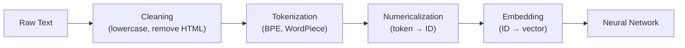

# NLP Fundamentals

Natural language processing bridges human language and machine computation. Before transformers can process text, raw characters must become numbers. This page builds that pipeline from the ground up: tokenization algorithms (including BPE from scratch), word embedding methods (Word2Vec, GloVe, FastText) with full mathematical derivations, and an end-to-end IMDB text classifier.

## Text Preprocessing Pipeline



## Tokenization

### Word-Level Tokenization

Split on whitespace and punctuation. Simple but creates huge vocabularies and cannot handle out-of-vocabulary (OOV) words.

```python
def word_tokenize(text):
    import re
    text = text.lower()
    tokens = re.findall(r'\b\w+\b', text)
    return tokens

word_tokenize("The cat sat on the mat.")
# ['the', 'cat', 'sat', 'on', 'the', 'mat']
```

**Problems:** "unhappiness" is OOV if not in training data. Vocabulary of 100K+ words needed for English.

### Character-Level Tokenization

Every character is a token. Tiny vocabulary (~256) but very long sequences, and the model must learn word structure from scratch.

### Subword Tokenization: BPE

Byte Pair Encoding (Sennrich et al., 2016) finds the optimal middle ground. Start with characters, iteratively merge the most frequent pair.

**BPE from scratch:**

```python
def get_pair_counts(vocab):
    """Count frequency of all adjacent symbol pairs."""
    pairs = {}
    for word, freq in vocab.items():
        symbols = word.split()
        for i in range(len(symbols) - 1):
            pair = (symbols[i], symbols[i + 1])
            pairs[pair] = pairs.get(pair, 0) + freq
    return pairs

def merge_pair(pair, vocab):
    """Merge all occurrences of a pair in the vocabulary."""
    new_vocab = {}
    bigram = ' '.join(pair)
    replacement = ''.join(pair)
    for word, freq in vocab.items():
        new_word = word.replace(bigram, replacement)
        new_vocab[new_word] = freq
    return new_vocab

def learn_bpe(corpus, num_merges=100):
    """Learn BPE merge operations from a corpus.

    Args:
        corpus: dict mapping word -> frequency
        num_merges: number of merge operations to learn
    Returns:
        merges: list of (pair, merged) tuples
    """
    # Initialize: split each word into characters + end-of-word marker
    vocab = {}
    for word, freq in corpus.items():
        symbols = ' '.join(list(word)) + ' </w>'
        vocab[symbols] = freq

    merges = []
    for i in range(num_merges):
        pairs = get_pair_counts(vocab)
        if not pairs:
            break
        best_pair = max(pairs, key=pairs.get)
        vocab = merge_pair(best_pair, vocab)
        merges.append(best_pair)
        if (i + 1) % 20 == 0:
            print(f"Merge {i+1}: {best_pair} (freq={pairs[best_pair]})")

    return merges, vocab

# Example usage
corpus = {
    'low': 5, 'lower': 2, 'newest': 6, 'widest': 3,
    'new': 4, 'wide': 2, 'the': 10, 'there': 3,
}
merges, final_vocab = learn_bpe(corpus, num_merges=30)

print("\nFinal vocabulary tokens:")
all_tokens = set()
for word in final_vocab:
    all_tokens.update(word.split())
print(sorted(all_tokens))
```

### BPE Tokenization (Applying Learned Merges)

```python
def apply_bpe(word, merges):
    """Tokenize a word using learned BPE merges."""
    symbols = list(word) + ['</w>']

    for pair in merges:
        i = 0
        while i < len(symbols) - 1:
            if symbols[i] == pair[0] and symbols[i + 1] == pair[1]:
                symbols = symbols[:i] + [''.join(pair)] + symbols[i + 2:]
            else:
                i += 1

    return symbols

# Example
tokens = apply_bpe('lowest', merges)
print(tokens)  # e.g., ['low', 'est</w>'] after sufficient merges
```

### WordPiece (Used by BERT)

Similar to BPE but selects the pair that maximizes the likelihood of the training data:

$$
\text{score}(a, b) = \frac{\text{freq}(ab)}{\text{freq}(a) \times \text{freq}(b)}
$$

Subword tokens are prefixed with `##` (e.g., "playing" becomes ["play", "##ing"]).

### SentencePiece

Language-agnostic tokenizer that treats the input as a raw byte stream (no pre-tokenization). Used by T5, LLaMA, and most multilingual models.

### Tokenizer Comparison

| Tokenizer | Used By | Vocab Size | Approach |
|-----------|---------|-----------|----------|
| BPE | GPT-2, GPT-3 | 50K | Frequency-based merging |
| WordPiece | BERT | 30K | Likelihood-based merging |
| SentencePiece (Unigram) | T5, LLaMA | 32K | Probabilistic subword |
| Tiktoken (BPE) | GPT-4, Claude | 100K | Byte-level BPE |

## Word2Vec

### Skip-gram Model

Given a center word $w_c$, predict context words $w_o$ within a window.

The probability of context word $w_o$ given center word $w_c$:

$$
P(w_o | w_c) = \frac{\exp(v'_{w_o} \cdot v_{w_c})}{\sum_{w=1}^{V} \exp(v'_w \cdot v_{w_c})}
$$

where $v_{w_c}$ is the center word embedding and $v'_{w_o}$ is the context word embedding. $V$ is the vocabulary size.

**Objective:** Maximize the log-likelihood over the corpus:

$$
\mathcal{L} = \sum_{t=1}^{T} \sum_{-c \leq j \leq c, j \neq 0} \log P(w_{t+j} | w_t)
$$

### Negative Sampling

Computing the softmax denominator over the entire vocabulary is too expensive. Negative sampling approximates it by training a binary classifier:

For each positive pair $(w_c, w_o)$, sample $k$ negative words $w_{neg}$ from a noise distribution $P_n(w) \propto f(w)^{3/4}$ (unigram distribution raised to the 3/4 power).

$$
\mathcal{L}_{\text{NEG}} = \log \sigma(v'_{w_o} \cdot v_{w_c}) + \sum_{i=1}^{k} \mathbb{E}_{w_i \sim P_n} \left[\log \sigma(-v'_{w_i} \cdot v_{w_c})\right]
$$

This turns the problem from $V$-class classification to $k+1$ binary classifications.

### Word2Vec Implementation

```python
import torch
import torch.nn as nn
import torch.optim as optim
from collections import Counter
import numpy as np

class Word2Vec(nn.Module):
    def __init__(self, vocab_size, embed_dim):
        super().__init__()
        self.center_embeddings = nn.Embedding(vocab_size, embed_dim)
        self.context_embeddings = nn.Embedding(vocab_size, embed_dim)
        # Initialize
        nn.init.xavier_uniform_(self.center_embeddings.weight)
        nn.init.zeros_(self.context_embeddings.weight)

    def forward(self, center, context, negatives):
        """
        center: (batch,) center word IDs
        context: (batch,) positive context word IDs
        negatives: (batch, k) negative sample IDs
        """
        center_emb = self.center_embeddings(center)     # (batch, dim)
        context_emb = self.context_embeddings(context)   # (batch, dim)
        neg_emb = self.context_embeddings(negatives)     # (batch, k, dim)

        # Positive score
        pos_score = torch.sum(center_emb * context_emb, dim=1)  # (batch,)
        pos_loss = -torch.log(torch.sigmoid(pos_score) + 1e-10)

        # Negative scores
        neg_score = torch.bmm(neg_emb, center_emb.unsqueeze(2)).squeeze(2)
        neg_loss = -torch.sum(torch.log(torch.sigmoid(-neg_score) + 1e-10), dim=1)

        return (pos_loss + neg_loss).mean()

def train_word2vec(corpus, embed_dim=100, window=5, k_neg=5, epochs=5):
    # Build vocabulary
    word_counts = Counter(corpus)
    vocab = sorted(word_counts.keys())
    word2idx = {w: i for i, w in enumerate(vocab)}
    vocab_size = len(vocab)

    # Negative sampling distribution: P(w) ∝ freq(w)^(3/4)
    freqs = np.array([word_counts[w] for w in vocab], dtype=np.float64)
    freqs = freqs ** 0.75
    neg_dist = freqs / freqs.sum()

    model = Word2Vec(vocab_size, embed_dim)
    optimizer = optim.Adam(model.parameters(), lr=0.001)

    indices = [word2idx[w] for w in corpus]

    for epoch in range(epochs):
        total_loss = 0
        pairs = []
        for i, center_idx in enumerate(indices):
            for j in range(max(0, i - window), min(len(indices), i + window + 1)):
                if j != i:
                    pairs.append((center_idx, indices[j]))

        # Mini-batch training
        np.random.shuffle(pairs)
        batch_size = 512
        for start in range(0, len(pairs), batch_size):
            batch = pairs[start:start + batch_size]
            centers = torch.tensor([p[0] for p in batch])
            contexts = torch.tensor([p[1] for p in batch])
            negatives = torch.tensor(
                np.random.choice(vocab_size, (len(batch), k_neg), p=neg_dist)
            )

            optimizer.zero_grad()
            loss = model(centers, contexts, negatives)
            loss.backward()
            optimizer.step()
            total_loss += loss.item()

        print(f"Epoch {epoch+1}: Loss={total_loss:.4f}")

    return model, word2idx, vocab
```

## GloVe: Global Vectors

GloVe (Pennington et al., 2014) combines the benefits of count-based and prediction-based methods.

### Objective

Minimize:

$$
J = \sum_{i,j=1}^{V} f(X_{ij}) \left(w_i^T \tilde{w}_j + b_i + \tilde{b}_j - \log X_{ij}\right)^2
$$

where $X_{ij}$ is the co-occurrence count, $f(x) = \min\left(\left(\frac{x}{x_{\max}}\right)^{3/4}, 1\right)$ is a weighting function that downweights very frequent pairs.

**Key insight:** The ratio of co-occurrence probabilities encodes semantic relationships:

$$
\frac{P(k|\text{ice})}{P(k|\text{steam})} \approx \begin{cases} \text{large} & \text{if } k = \text{solid} \\ \text{small} & \text{if } k = \text{gas} \\ \approx 1 & \text{if } k = \text{water or fashion} \end{cases}
$$

## FastText

FastText (Bojanowski et al., 2017) extends Word2Vec by representing each word as a bag of character n-grams.

For the word "where" with $n = 3$: `<wh`, `whe`, `her`, `ere`, `re>`, plus the whole word `<where>`.

The word vector is the sum of its n-gram vectors:

$$
v_w = \sum_{g \in G(w)} z_g
$$

**Advantage:** Can generate embeddings for OOV words by composing their n-grams.

## Embedding Properties

### Analogies

The famous $\text{king} - \text{man} + \text{woman} \approx \text{queen}$ works because embeddings capture linear relationships:

```python
def analogy(word2idx, embeddings, a, b, c, top_k=5):
    """a is to b as c is to ?"""
    vec = embeddings[word2idx[b]] - embeddings[word2idx[a]] + embeddings[word2idx[c]]
    # Find nearest neighbors
    sims = torch.cosine_similarity(vec.unsqueeze(0), embeddings)
    # Exclude input words
    for w in [a, b, c]:
        sims[word2idx[w]] = -1
    top_indices = sims.topk(top_k).indices
    return [vocab[i] for i in top_indices]
```

### Bias in Embeddings

Word embeddings trained on real-world text encode societal biases:

$$
\vec{\text{doctor}} - \vec{\text{man}} + \vec{\text{woman}} \approx \vec{\text{nurse}}
$$

Debiasing techniques include post-hoc projection (Bolukbasi et al., 2016) and training-time interventions.

## Text Classification: IMDB

End-to-end text classification using pretrained embeddings and a simple CNN:

```python
import torch
import torch.nn as nn
import torch.nn.functional as F

class TextCNN(nn.Module):
    """Yoon Kim (2014) CNN for text classification."""
    def __init__(self, vocab_size, embed_dim, num_classes,
                 filter_sizes=[3, 4, 5], num_filters=100, dropout=0.5):
        super().__init__()
        self.embedding = nn.Embedding(vocab_size, embed_dim)
        self.convs = nn.ModuleList([
            nn.Conv1d(embed_dim, num_filters, fs) for fs in filter_sizes
        ])
        self.dropout = nn.Dropout(dropout)
        self.fc = nn.Linear(num_filters * len(filter_sizes), num_classes)

    def forward(self, x):
        """x: (batch, seq_len) token IDs."""
        x = self.embedding(x)       # (batch, seq_len, embed_dim)
        x = x.transpose(1, 2)       # (batch, embed_dim, seq_len) for Conv1d

        # Apply each filter size and max-pool
        conv_outputs = []
        for conv in self.convs:
            c = F.relu(conv(x))              # (batch, num_filters, seq_len - fs + 1)
            c = F.max_pool1d(c, c.size(2))   # (batch, num_filters, 1)
            conv_outputs.append(c.squeeze(2))

        # Concatenate all filter outputs
        x = torch.cat(conv_outputs, dim=1)   # (batch, num_filters * len(filter_sizes))
        x = self.dropout(x)
        return self.fc(x)

# Training
model = TextCNN(vocab_size=30000, embed_dim=128, num_classes=2)
criterion = nn.CrossEntropyLoss()
optimizer = torch.optim.Adam(model.parameters(), lr=1e-3)

# Use IMDB dataset loading from the RNN-LSTM page
# Expected accuracy: ~87-89%
```

## Pretrained Embeddings

### Loading GloVe

```python
def load_glove(path, word2idx, embed_dim=300):
    """Load GloVe vectors for words in vocabulary."""
    embeddings = torch.randn(len(word2idx), embed_dim) * 0.01
    found = 0
    with open(path, 'r', encoding='utf-8') as f:
        for line in f:
            values = line.split()
            word = values[0]
            if word in word2idx:
                vector = torch.tensor([float(v) for v in values[1:]])
                embeddings[word2idx[word]] = vector
                found += 1

    print(f"Found {found}/{len(word2idx)} words in GloVe")
    return embeddings

# Use in model
pretrained = load_glove('glove.6B.300d.txt', word2idx)
model.embedding.weight.data.copy_(pretrained)
model.embedding.weight.requires_grad = False  # Freeze initially
```

## Text Preprocessing Best Practices

### Cleaning Pipeline

```python
import re
import html

def clean_text(text):
    """Standard text cleaning pipeline."""
    # Decode HTML entities
    text = html.unescape(text)
    # Remove HTML tags
    text = re.sub(r'<[^>]+>', '', text)
    # Remove URLs
    text = re.sub(r'https?://\S+|www\.\S+', '[URL]', text)
    # Remove email addresses
    text = re.sub(r'\S+@\S+', '[EMAIL]', text)
    # Normalize whitespace
    text = re.sub(r'\s+', ' ', text).strip()
    # Remove repeated punctuation
    text = re.sub(r'([!?.]){2,}', r'\1', text)
    return text

# Example
raw = "<p>Check out  https://example.com !! It's great!!</p>"
print(clean_text(raw))
# "Check out [URL] ! It's great!"
```

### Handling Out-of-Vocabulary Words

| Strategy | Approach | Trade-off |
|----------|----------|-----------|
| Subword tokenization | BPE, WordPiece, Unigram | Best general approach |
| Character fallback | Unknown words → character n-grams | Handles any input |
| Hash embedding | Hash word to fixed bucket | Fixed vocab, collision risk |
| UNK token | Replace rare words with `<UNK>` | Simple but loses information |

### Vocabulary Size Trade-offs

| Vocab Size | Pros | Cons |
|-----------|------|------|
| Small (1K-5K) | Short sequences, fast | Many multi-token words, loses meaning |
| Medium (30K-50K) | Good balance (BERT, GPT-2) | Standard choice |
| Large (100K+) | Fewer tokens per word, multilingual | Large embedding matrix |

## TF-IDF: The Classical Baseline

Before deep learning, TF-IDF was the standard text representation:

$$
\text{TF-IDF}(t, d, D) = \text{TF}(t, d) \times \text{IDF}(t, D)
$$

$$
\text{TF}(t, d) = \frac{\text{count}(t, d)}{|d|}, \quad \text{IDF}(t, D) = \log \frac{|D|}{|\{d \in D : t \in d\}|}
$$

```python
from sklearn.feature_extraction.text import TfidfVectorizer
from sklearn.linear_model import LogisticRegression
from sklearn.pipeline import Pipeline

# TF-IDF + Logistic Regression baseline
pipeline = Pipeline([
    ('tfidf', TfidfVectorizer(max_features=10000, ngram_range=(1, 2))),
    ('clf', LogisticRegression(max_iter=1000)),
])

pipeline.fit(train_texts, train_labels)
accuracy = pipeline.score(test_texts, test_labels)
print(f"TF-IDF Baseline: {accuracy:.4f}")
# Often achieves 85-88% on IMDB --- a strong baseline!
```

::: tip Always Start with TF-IDF
TF-IDF + logistic regression is a surprisingly strong baseline for text classification. It trains in seconds, needs no GPU, and often achieves 90%+ of BERT performance. Always try it first.
:::

## Embedding Evaluation

### Intrinsic Evaluation

Test embedding quality directly on linguistic tasks:

| Task | Dataset | What It Tests |
|------|---------|--------------|
| Word similarity | SimLex-999, WS-353 | Semantic similarity |
| Analogies | Google analogy dataset | Relational structure |
| Categorization | AP dataset | Cluster quality |

### Extrinsic Evaluation

Test embeddings on downstream tasks:

| Task | Metric | Shows |
|------|--------|-------|
| Text classification | Accuracy/F1 | Discriminative quality |
| NER | F1 | Token-level representation |
| Semantic similarity | Spearman correlation | Sentence-level quality |

## Common NLP Pitfalls

| Pitfall | Impact | Fix |
|---------|--------|-----|
| Not lowercasing (when appropriate) | Vocabulary explosion | Lowercase for uncased models |
| Ignoring class imbalance | Model predicts majority class | Weighted loss, oversampling |
| Truncating long documents | Losing important context | Summarize, chunk, or use Longformer |
| Not handling special characters | Tokenizer errors | Clean text before tokenizing |
| Using wrong pretrained embeddings | Poor downstream performance | Match domain (biomedical? legal?) |

## Cross-References

- **Modern NLP:** [Language Models](/deep-learning/language-models) --- from Word2Vec to GPT
- **Transformers:** [Transformers](/deep-learning/transformers) --- self-attention for NLP
- **BERT:** [BERT Family](/deep-learning/bert-family) --- contextual embeddings
- **Generation:** [Text Generation](/deep-learning/text-generation) --- decoding strategies
- **Sequences:** [RNN and LSTM](/deep-learning/rnn-lstm) --- recurrent models for text
