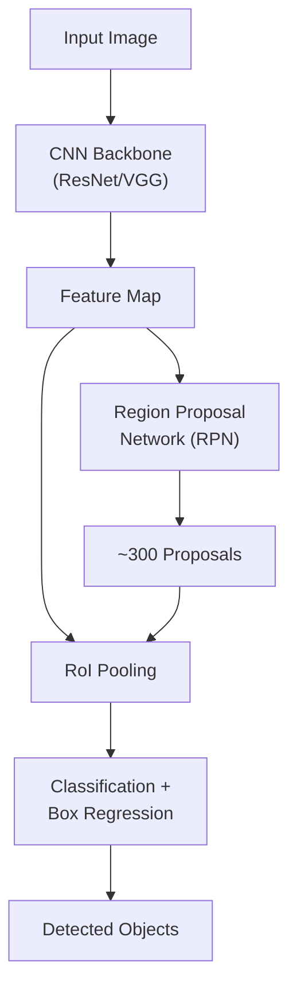
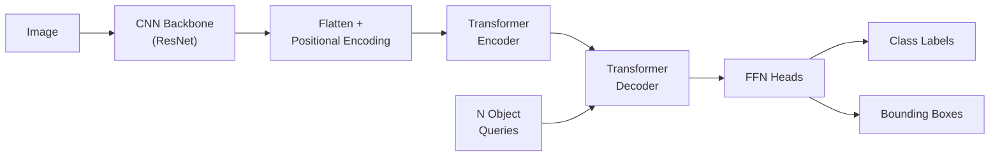
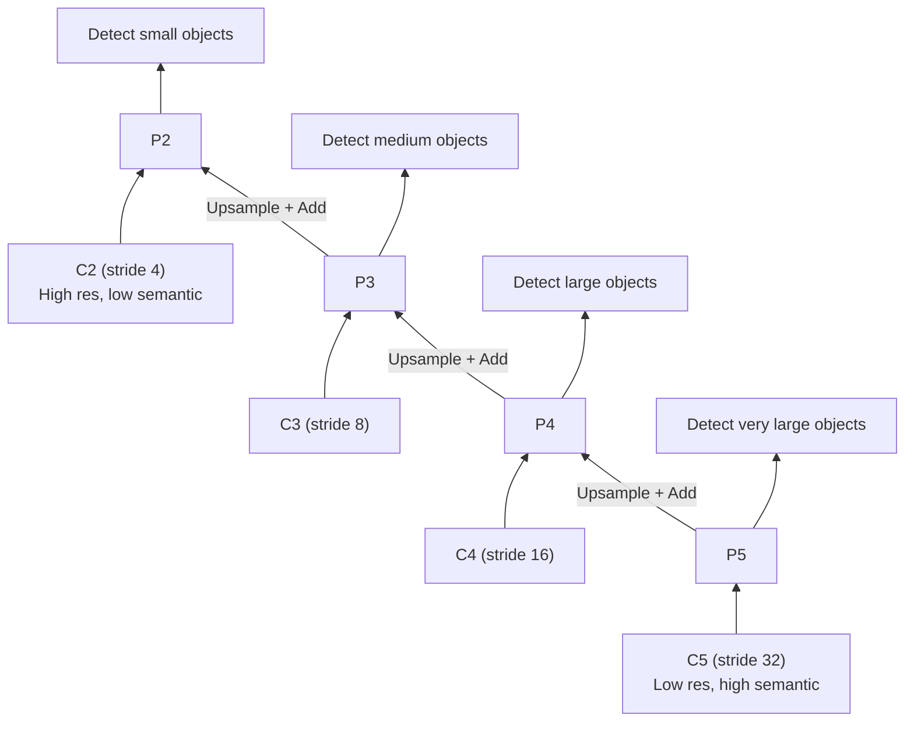

# Object Detection

Object detection combines classification (what is it?) with localization (where is it?). This page traces the evolution from R-CNN to DETR, derives IoU and mAP metrics, explains YOLO's grid-cell approach, and trains YOLOv8 on a custom dataset.

## The Detection Problem

Given an image, output a set of bounding boxes with class labels:

$$
\{(x_1, y_1, x_2, y_2, c, p) \mid \text{for each detected object}\}
$$

where $(x_1, y_1, x_2, y_2)$ define the box, $c$ is the class, and $p$ is the confidence.

## Intersection over Union (IoU)

IoU measures the overlap between predicted and ground-truth boxes:

$$
\text{IoU} = \frac{|A \cap B|}{|A \cup B|} = \frac{\text{Area of Intersection}}{\text{Area of Union}}
$$

```python
def compute_iou(box1, box2):
    """Compute IoU between two boxes [x1, y1, x2, y2]."""
    x1 = max(box1[0], box2[0])
    y1 = max(box1[1], box2[1])
    x2 = min(box1[2], box2[2])
    y2 = min(box1[3], box2[3])

    intersection = max(0, x2 - x1) * max(0, y2 - y1)
    area1 = (box1[2] - box1[0]) * (box1[3] - box1[1])
    area2 = (box2[2] - box2[0]) * (box2[3] - box2[1])
    union = area1 + area2 - intersection

    return intersection / (union + 1e-6)
```

### IoU Thresholds

| IoU | Interpretation |
|-----|---------------|
| 0.5 | PASCAL VOC standard (loose) |
| 0.75 | COCO strict |
| 0.5:0.95 | COCO AP (average over 10 thresholds) |

## R-CNN Family Evolution

### R-CNN (2014)

1. Generate ~2000 region proposals (Selective Search)
2. Warp each to fixed size and pass through CNN
3. Classify with SVM + regress bounding box

**Problem:** Process each region independently --- extremely slow (47 seconds per image).

### Fast R-CNN (2015)

1. Pass the entire image through CNN once to get a feature map
2. Project region proposals onto the feature map
3. RoI Pooling extracts fixed-size features from each region
4. Classify + regress in one forward pass

**RoI Pooling:** Divide the projected region into a fixed grid (e.g., 7x7) and max-pool within each cell.

**Improvement:** Sharing computation across proposals. ~0.3 seconds per image.

### Faster R-CNN (2016)

Replace Selective Search with a Region Proposal Network (RPN) that generates proposals from the feature map itself.

**RPN:** At each position in the feature map, predict $k$ anchor boxes (different scales and aspect ratios):

- Objectness score: is there an object? (binary)
- Box regression: adjust anchor to fit object ($\Delta x, \Delta y, \Delta w, \Delta h$)



### Anchor Boxes

Anchors are predefined boxes at each feature map location. For 3 scales and 3 aspect ratios, $k = 9$ anchors per position.

The RPN predicts offsets from anchors:

$$
t_x = \frac{x - x_a}{w_a}, \quad t_y = \frac{y - y_a}{h_a}
$$

$$
t_w = \log\frac{w}{w_a}, \quad t_h = \log\frac{h}{h_a}
$$

### Non-Maximum Suppression (NMS)

Multiple overlapping detections of the same object must be merged:

```python
def nms(boxes, scores, iou_threshold=0.5):
    """Apply Non-Maximum Suppression.
    boxes: (N, 4) [x1, y1, x2, y2]
    scores: (N,) confidence scores
    """
    order = scores.argsort(descending=True)
    keep = []

    while len(order) > 0:
        i = order[0]
        keep.append(i)

        if len(order) == 1:
            break

        ious = compute_iou_batch(boxes[i].unsqueeze(0), boxes[order[1:]])
        remaining = (ious < iou_threshold).nonzero(as_tuple=True)[0]
        order = order[remaining + 1]

    return keep
```

## YOLO: You Only Look Once

YOLO (Redmon et al., 2016) frames detection as a single regression problem.

### Grid Cell Approach

1. Divide the image into an $S \times S$ grid
2. Each cell predicts $B$ bounding boxes + confidence + $C$ class probabilities
3. Output tensor: $S \times S \times (B \times 5 + C)$

For YOLOv1: $S=7$, $B=2$, $C=20$ (PASCAL VOC) $\to$ $7 \times 7 \times 30$

**Loss function:**

$$
\mathcal{L} = \lambda_{\text{coord}} \mathcal{L}_{\text{box}} + \mathcal{L}_{\text{obj}} + \lambda_{\text{noobj}} \mathcal{L}_{\text{noobj}} + \mathcal{L}_{\text{class}}
$$

The coordinate loss uses $\sqrt{w}$ and $\sqrt{h}$ to weight small box errors more heavily than large box errors.

### YOLO Evolution

| Version | Year | Key Innovation | mAP (COCO) |
|---------|------|---------------|-----------|
| YOLOv1 | 2016 | Single-stage detection | 63.4 |
| YOLOv2 | 2017 | Anchor boxes, batch norm | 78.6 |
| YOLOv3 | 2018 | Multi-scale predictions, Darknet-53 | 33.0 |
| YOLOv4 | 2020 | CSPDarknet, Mosaic augmentation | 43.5 |
| YOLOv5 | 2020 | PyTorch native, Focus module | 50.7 |
| YOLOv8 | 2023 | Anchor-free, decoupled head | 53.9 |
| YOLOv11 | 2024 | Efficient architecture, GELAN | 54.7 |

## SSD: Single Shot MultiBox Detector

SSD detects objects at multiple scales using feature maps from different layers:

- Early layers (high resolution): detect small objects
- Later layers (low resolution): detect large objects

Each feature map cell predicts $k$ boxes with class scores.

## DETR: Detection Transformer

DETR (Carion et al., 2020) eliminates anchors, NMS, and region proposals by treating detection as a set prediction problem.

### Architecture



**Object Queries:** $N$ learnable embeddings (e.g., $N=100$) that each learn to detect one object. The decoder uses cross-attention to attend to relevant image regions.

**Bipartite Matching Loss:** Uses the Hungarian algorithm to find the optimal one-to-one matching between predictions and ground truth:

$$
\hat{\sigma} = \arg\min_{\sigma \in \mathfrak{S}_N} \sum_{i=1}^{N} \mathcal{L}_{\text{match}}(y_i, \hat{y}_{\sigma(i)})
$$

## Mean Average Precision (mAP)

### Precision and Recall

For each class, sort detections by confidence. At each threshold:

$$
\text{Precision} = \frac{TP}{TP + FP}, \quad \text{Recall} = \frac{TP}{TP + FN}
$$

### AP (Average Precision)

Area under the precision-recall curve:

$$
AP = \int_0^1 p(r) \, dr
$$

Approximated using 11-point interpolation (PASCAL VOC) or all-point interpolation (COCO).

### mAP

Average AP across all classes:

$$
mAP = \frac{1}{C} \sum_{c=1}^{C} AP_c
$$

COCO mAP averages over IoU thresholds from 0.5 to 0.95 (step 0.05).

```python
def compute_ap(precision, recall):
    """Compute AP using all-point interpolation."""
    # Add sentinel values
    mrec = np.concatenate(([0.0], recall, [1.0]))
    mpre = np.concatenate(([1.0], precision, [0.0]))

    # Smooth precision curve (make it monotonically decreasing)
    for i in range(len(mpre) - 2, -1, -1):
        mpre[i] = max(mpre[i], mpre[i + 1])

    # Compute area under curve
    i = np.where(mrec[1:] != mrec[:-1])[0]
    ap = np.sum((mrec[i + 1] - mrec[i]) * mpre[i + 1])
    return ap
```

## YOLOv8 on Custom Dataset

```python
from ultralytics import YOLO

# ── Load pretrained YOLOv8 ───────────────────────────────────────────
model = YOLO('yolov8n.pt')  # nano model (fastest)

# ── Dataset structure (YOLO format) ──────────────────────────────────
# dataset/
#   train/
#     images/
#     labels/   (one .txt per image: class cx cy w h)
#   val/
#     images/
#     labels/
#   data.yaml

# data.yaml content:
# train: ./train/images
# val: ./val/images
# nc: 3
# names: ['cat', 'dog', 'bird']

# ── Training ─────────────────────────────────────────────────────────
results = model.train(
    data='dataset/data.yaml',
    epochs=100,
    imgsz=640,
    batch=16,
    lr0=0.01,
    lrf=0.01,       # Final LR factor
    momentum=0.937,
    weight_decay=0.0005,
    warmup_epochs=3,
    augment=True,
    mosaic=1.0,      # Mosaic augmentation
    mixup=0.1,
    copy_paste=0.1,
    device=0,        # GPU
    name='custom_detector',
)

# ── Inference ────────────────────────────────────────────────────────
model = YOLO('runs/detect/custom_detector/weights/best.pt')

# Single image
results = model('test_image.jpg')
for r in results:
    boxes = r.boxes
    for box in boxes:
        xyxy = box.xyxy[0]      # [x1, y1, x2, y2]
        conf = box.conf[0]       # confidence
        cls = int(box.cls[0])    # class index
        print(f"Class: {r.names[cls]}, Conf: {conf:.2f}, Box: {xyxy}")

# ── Export for deployment ────────────────────────────────────────────
model.export(format='onnx')  # ONNX
model.export(format='torchscript')  # TorchScript
model.export(format='tflite')  # TensorFlow Lite (mobile)
```

## Two-Stage vs One-Stage Detectors

| Feature | Two-Stage (Faster R-CNN) | One-Stage (YOLO) |
|---------|------------------------|------------------|
| Speed | ~5-15 FPS | ~30-160 FPS |
| Accuracy | Higher (especially small objects) | Slightly lower |
| Architecture | RPN + detection head | Single network |
| Use case | Accuracy-critical | Real-time applications |
| Training | More complex | Simpler |

## Loss Functions for Object Detection

### Classification Loss

Standard cross-entropy or focal loss for class prediction:

$$
\mathcal{L}_{\text{focal}} = -\alpha_t (1 - p_t)^\gamma \log(p_t)
$$

Focal loss (Lin et al., 2017) down-weights easy negatives. With $\gamma = 2$, easy examples ($p_t > 0.9$) contribute very little to the loss. This is essential because most anchor boxes are background (negative).

### Box Regression Loss

**Smooth L1 Loss (Faster R-CNN):**

$$
\text{smooth}_{L1}(x) = \begin{cases} 0.5x^2 & \text{if } |x| < 1 \\ |x| - 0.5 & \text{otherwise} \end{cases}
$$

**CIoU Loss (Complete IoU, used in YOLO):**

$$
\mathcal{L}_{\text{CIoU}} = 1 - \text{IoU} + \frac{\rho^2(b, b^{gt})}{c^2} + \alpha v
$$

where $\rho$ is the Euclidean distance between centers, $c$ is the diagonal of the smallest enclosing box, and $v$ measures aspect ratio consistency.

### GIoU (Generalized IoU)

$$
\text{GIoU} = \text{IoU} - \frac{|C \setminus (A \cup B)|}{|C|}
$$

where $C$ is the smallest convex hull enclosing both $A$ and $B$. GIoU provides gradients even when boxes do not overlap (IoU = 0).

```python
def giou_loss(pred_boxes, target_boxes):
    """Compute GIoU loss between predicted and target boxes."""
    # Compute IoU
    inter_x1 = torch.max(pred_boxes[:, 0], target_boxes[:, 0])
    inter_y1 = torch.max(pred_boxes[:, 1], target_boxes[:, 1])
    inter_x2 = torch.min(pred_boxes[:, 2], target_boxes[:, 2])
    inter_y2 = torch.min(pred_boxes[:, 3], target_boxes[:, 3])

    inter_area = torch.clamp(inter_x2 - inter_x1, min=0) * torch.clamp(inter_y2 - inter_y1, min=0)
    pred_area = (pred_boxes[:, 2] - pred_boxes[:, 0]) * (pred_boxes[:, 3] - pred_boxes[:, 1])
    target_area = (target_boxes[:, 2] - target_boxes[:, 0]) * (target_boxes[:, 3] - target_boxes[:, 1])
    union = pred_area + target_area - inter_area
    iou = inter_area / (union + 1e-6)

    # Compute enclosing box
    enc_x1 = torch.min(pred_boxes[:, 0], target_boxes[:, 0])
    enc_y1 = torch.min(pred_boxes[:, 1], target_boxes[:, 1])
    enc_x2 = torch.max(pred_boxes[:, 2], target_boxes[:, 2])
    enc_y2 = torch.max(pred_boxes[:, 3], target_boxes[:, 3])
    enc_area = (enc_x2 - enc_x1) * (enc_y2 - enc_y1)

    giou = iou - (enc_area - union) / (enc_area + 1e-6)
    return 1 - giou.mean()
```

## Data Annotation for Detection

### Annotation Formats

| Format | Used By | Structure |
|--------|---------|-----------|
| PASCAL VOC | VOC dataset | XML per image |
| COCO JSON | COCO dataset | Single JSON for all images |
| YOLO | Ultralytics | TXT per image: `class cx cy w h` |
| Label Studio | Generic | JSON with bounding boxes |

### YOLO Label Format

Each image has a corresponding `.txt` file with one line per object:

```
# class_id center_x center_y width height (all normalized 0-1)
0 0.5 0.4 0.3 0.6
1 0.2 0.7 0.15 0.2
```

### Converting Between Formats

```python
def voc_to_yolo(voc_box, img_w, img_h):
    """Convert VOC [xmin, ymin, xmax, ymax] to YOLO [cx, cy, w, h] (normalized)."""
    xmin, ymin, xmax, ymax = voc_box
    cx = (xmin + xmax) / 2.0 / img_w
    cy = (ymin + ymax) / 2.0 / img_h
    w = (xmax - xmin) / img_w
    h = (ymax - ymin) / img_h
    return [cx, cy, w, h]

def yolo_to_voc(yolo_box, img_w, img_h):
    """Convert YOLO [cx, cy, w, h] to VOC [xmin, ymin, xmax, ymax]."""
    cx, cy, w, h = yolo_box
    xmin = (cx - w / 2) * img_w
    ymin = (cy - h / 2) * img_h
    xmax = (cx + w / 2) * img_w
    ymax = (cy + h / 2) * img_h
    return [xmin, ymin, xmax, ymax]

def coco_to_voc(coco_box):
    """Convert COCO [x, y, w, h] to VOC [xmin, ymin, xmax, ymax]."""
    x, y, w, h = coco_box
    return [x, y, x + w, y + h]
```

## Feature Pyramid Network (FPN)

FPN (Lin et al., 2017) constructs multi-scale feature maps for detecting objects of different sizes:



Each level of the pyramid handles a different object scale. Small objects are detected at high-resolution, low-level features; large objects at low-resolution, high-level features.

## Common Pitfalls

| Mistake | Symptom | Fix |
|---------|---------|-----|
| Wrong annotation format | Model trains but mAP is 0 | Verify box coordinates and class IDs |
| Images not resized | CUDA OOM | Resize to 640x640 for YOLO |
| Forgetting NMS | Duplicate detections | Apply NMS (IoU threshold 0.5) |
| Too few anchors | Missing small/large objects | Use FPN or multi-scale anchors |
| Imbalanced classes | Model ignores rare classes | Use focal loss or oversampling |
| Train/val leakage | Inflated mAP | Ensure no duplicate images across splits |

## Cross-References

- **CNN backbones:** [CNN](/deep-learning/cnn) --- ResNet, EfficientNet for feature extraction
- **Transformer-based:** [Transformers](/deep-learning/transformers) --- DETR architecture
- **Segmentation:** [Image Segmentation](/deep-learning/image-segmentation) --- pixel-level detection
- **Classification:** [Image Classification](/deep-learning/image-classification) --- ViT, transfer learning
- **Deployment:** [Model Optimization](/deep-learning/model-optimization) --- quantization for real-time
