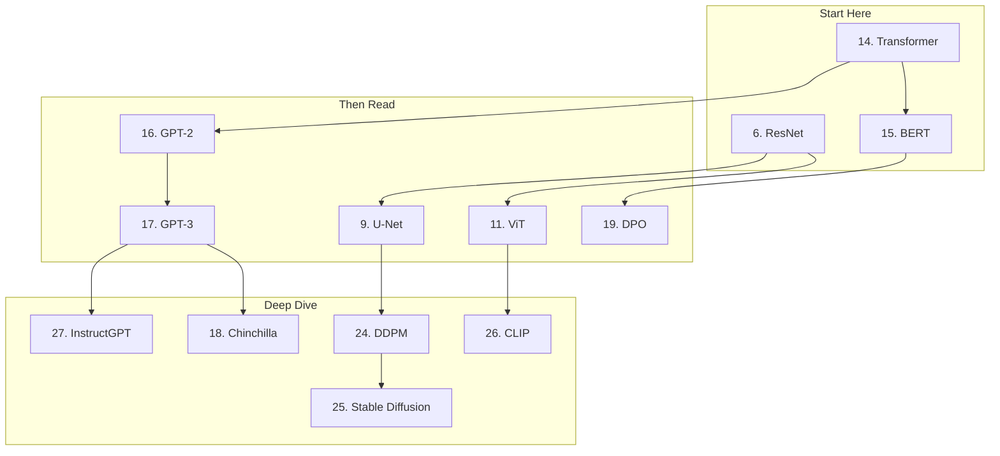
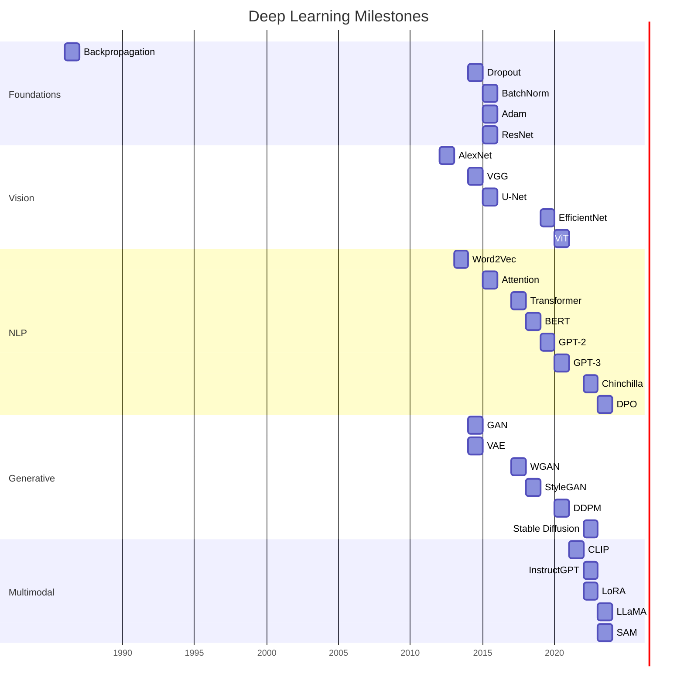

# Deep Learning Papers Reading List

These 30 papers shaped modern deep learning. Each entry includes a one-paragraph summary, the key insight you should take away, and why it matters. Read them in order within each section --- later papers build on earlier ones.

## How to Read ML Papers

1. **First pass (10 min):** Read title, abstract, introduction, section headings, and conclusion. Skip math and experiments.
2. **Second pass (1 hour):** Read the whole paper. Understand the figures and key equations. Skip proofs.
3. **Third pass (3--5 hours):** Reproduce the key result. Understand every equation. This is optional for most papers.

## Foundations (Papers 1--6)

### 1. Backpropagation (Rumelhart et al., 1986)

**"Learning representations by back-propagating errors"**

The paper that made neural networks trainable. Showed that the chain rule could be used to compute gradients through multi-layer networks, enabling learning of internal representations. Before this, neural networks with hidden layers were considered untrainable.

**Key insight:** The chain rule applied layer by layer makes gradient computation tractable for arbitrarily deep networks. Every modern deep learning system uses this algorithm.

---

### 2. Universal Approximation (Hornik, 1991)

**"Approximation capabilities of multilayer feedforward networks"**

Proved that a feedforward network with a single hidden layer and any "squashing" activation function can approximate any continuous function to arbitrary accuracy, given enough neurons.

**Key insight:** Neural networks are universal function approximators. The question is not whether they can represent any function, but whether gradient descent can find the right parameters efficiently.

---

### 3. Dropout (Srivastava et al., 2014)

**"Dropout: A Simple Way to Prevent Neural Networks from Overfitting"**

Introduced dropout regularization --- randomly zeroing neurons during training. This prevents co-adaptation and can be interpreted as training an ensemble of $2^n$ sub-networks simultaneously.

**Key insight:** Injecting noise into the training process is a powerful regularizer. Dropout is now standard in virtually every neural network architecture.

---

### 4. Batch Normalization (Ioffe and Szegedy, 2015)

**"Batch Normalization: Accelerating Deep Network Training by Reducing Internal Covariate Shift"**

Normalizing layer inputs within each mini-batch stabilizes training, allows higher learning rates, and acts as a regularizer. The original explanation (reducing internal covariate shift) has been challenged, but the technique remains indispensable.

**Key insight:** Normalizing intermediate representations makes optimization landscapes smoother, enabling faster and more stable training.

---

### 5. Adam Optimizer (Kingma and Ba, 2015)

**"Adam: A Method for Stochastic Optimization"**

Combined momentum (first moment) with RMSProp (second moment) into a single adaptive optimizer with bias correction. Became the default optimizer for deep learning.

**Key insight:** Adaptive per-parameter learning rates with momentum work robustly across a wide range of problems. Adam is the safe default; SGD with momentum sometimes generalizes better.

---

### 6. ResNet (He et al., 2016)

**"Deep Residual Learning for Image Recognition"**

Introduced skip connections (residual learning) that enable training of 100+ layer networks. Won ImageNet 2015 with 152 layers. The key observation: deeper networks had higher training error, not just test error --- a pure optimization problem.

**Key insight:** Learning residuals ($F(x) = H(x) - x$) is easier than learning direct mappings. Skip connections are now in every modern architecture (transformers, U-Nets, diffusion models).

## Computer Vision (Papers 7--11)

### 7. AlexNet (Krizhevsky et al., 2012)

**"ImageNet Classification with Deep Convolutional Neural Networks"**

Won ImageNet 2012 by a massive margin (15.3% vs 26.2% top-5 error). Used ReLU activations, dropout, data augmentation, and GPU training. This paper launched the deep learning era.

**Key insight:** Deep CNNs trained on GPUs with large datasets dramatically outperform hand-engineered features. This result convinced the field that deep learning works.

---

### 8. VGG (Simonyan and Zisserman, 2015)

**"Very Deep Convolutional Networks for Large-Scale Image Recognition"**

Showed that network depth (up to 19 layers) with small 3x3 filters outperforms shallower networks with larger filters. Two 3x3 convolutions have the same receptive field as one 5x5 but with fewer parameters and more nonlinearity.

**Key insight:** Deeper is better (up to a point), and small filters with depth beat large filters with less depth.

---

### 9. U-Net (Ronneberger et al., 2015)

**"U-Net: Convolutional Networks for Biomedical Image Segmentation"**

Encoder-decoder architecture with skip connections for pixel-level segmentation. Designed for medical imaging with limited data. The skip connections provide fine spatial detail to the decoder.

**Key insight:** Skip connections between encoder and decoder at matching resolutions preserve spatial information lost during downsampling. This architecture is now used in diffusion models.

---

### 10. EfficientNet (Tan and Le, 2019)

**"EfficientNet: Rethinking Model Scaling for Convolutional Neural Networks"**

Introduced compound scaling --- systematically scaling network depth, width, and resolution together. Achieved state-of-the-art accuracy with far fewer parameters than previous models.

**Key insight:** Scaling one dimension alone (depth, width, or resolution) yields diminishing returns. Balanced scaling across all three dimensions is optimal.

---

### 11. Vision Transformer (Dosovitskiy et al., 2021)

**"An Image is Worth 16x16 Words: Transformers for Image Recognition at Scale"**

Applied the transformer architecture to images by splitting them into 16x16 patches and treating each patch as a token. Outperformed CNNs on ImageNet when trained on large datasets (JFT-300M).

**Key insight:** Transformers can match or beat CNNs on vision tasks, but require much more data. The self-attention mechanism learns flexible, data-dependent receptive fields.

## NLP and Language Models (Papers 12--19)

### 12. Word2Vec (Mikolov et al., 2013)

**"Efficient Estimation of Word Representations in Vector Space"**

Showed that simple neural networks trained on word co-occurrence learn semantic relationships. "king - man + woman = queen" emerged from the geometry of the embedding space.

**Key insight:** Distributed representations (dense vectors) capture semantic relationships as linear directions in vector space. This was the foundation for all modern NLP.

---

### 13. Attention Mechanism (Bahdanau et al., 2015)

**"Neural Machine Translation by Jointly Learning to Align and Translate"**

Introduced attention for machine translation, allowing the decoder to focus on relevant parts of the source sentence at each generation step. Solved the bottleneck problem of compressing the entire source into a fixed-size vector.

**Key insight:** Letting the model learn which parts of the input to attend to, rather than compressing everything into a fixed vector, dramatically improves sequence-to-sequence tasks.

---

### 14. Transformer (Vaswani et al., 2017)

**"Attention Is All You Need"**

Replaced recurrence entirely with self-attention. Introduced multi-head attention, positional encoding, and the encoder-decoder transformer architecture. Achieved new SOTA on machine translation while being faster to train.

**Key insight:** Self-attention provides direct connections between all positions (O(1) path length), enabling parallelism and better long-range modeling than RNNs. This is the foundation architecture of modern AI.

---

### 15. BERT (Devlin et al., 2019)

**"BERT: Pre-training of Deep Bidirectional Transformers for Language Understanding"**

Showed that bidirectional pre-training (MLM + NSP) produces representations that transfer to virtually any NLP task. Fine-tuning BERT beat task-specific architectures on 11 benchmarks.

**Key insight:** Pre-training on unlabeled text followed by task-specific fine-tuning is more effective than training from scratch. Bidirectional context matters for understanding.

---

### 16. GPT-2 (Radford et al., 2019)

**"Language Models are Unsupervised Multitask Learners"**

Trained a 1.5B parameter autoregressive LM on web text. Showed that language models perform tasks (translation, QA, summarization) without any task-specific training --- zero-shot learning from pretraining alone.

**Key insight:** Scale unlocks emergent capabilities. A sufficiently large language model trained on diverse text implicitly learns many tasks.

---

### 17. GPT-3 / Scaling Laws (Brown et al., 2020; Kaplan et al., 2020)

**"Language Models are Few-Shot Learners" and "Scaling Laws for Neural Language Models"**

GPT-3 (175B parameters) demonstrated in-context learning: provide a few examples in the prompt, and the model performs the task. The scaling laws paper showed that LM performance follows predictable power laws with parameters, data, and compute.

**Key insight:** Scale (parameters + data + compute) predictably improves performance. In-context learning emerges at sufficient scale without any gradient updates.

---

### 18. Chinchilla (Hoffmann et al., 2022)

**"Training Compute-Optimal Large Language Models"**

Showed that previous LLMs (GPT-3, Gopher) were undertrained: they had too many parameters for the amount of training data. The optimal allocation is to scale parameters and data equally.

**Key insight:** A smaller model trained on more data outperforms a larger model trained on less data, given the same compute budget. This changed how the industry sizes training runs.

---

### 19. DPO (Rafailov et al., 2023)

**"Direct Preference Optimization: Your Language Model Is Secretly a Reward Model"**

Showed that RLHF can be simplified to a supervised learning problem by deriving a closed-form relationship between the reward function and the optimal policy. Eliminates the need for a separate reward model and PPO training.

**Key insight:** Preference optimization can be done directly, without reward model training or reinforcement learning, making alignment much simpler and more stable.

## Generative Models (Papers 20--25)

### 20. GAN (Goodfellow et al., 2014)

**"Generative Adversarial Networks"**

Introduced the adversarial training framework: a generator creates fake data, a discriminator distinguishes real from fake. The two networks train against each other until the generator produces realistic data.

**Key insight:** Adversarial training is a powerful framework for generative modeling. The minimax game implicitly minimizes the Jensen-Shannon divergence.

---

### 21. VAE (Kingma and Welling, 2014)

**"Auto-Encoding Variational Bayes"**

Introduced variational autoencoders, combining deep learning with variational Bayesian inference. The reparameterization trick enables gradient-based optimization of the ELBO.

**Key insight:** Probabilistic latent variable models can be trained end-to-end with neural networks using the reparameterization trick, producing structured latent spaces.

---

### 22. WGAN (Arjovsky et al., 2017)

**"Wasserstein Generative Adversarial Networks"**

Identified that the JS divergence used in standard GANs provides no gradient when distributions do not overlap. Proposed using the Wasserstein distance, which provides useful gradients everywhere.

**Key insight:** The choice of divergence measure fundamentally affects training stability. The Wasserstein distance provides gradients even when distributions have non-overlapping support.

---

### 23. StyleGAN (Karras et al., 2019)

**"A Style-Based Generator Architecture for Generative Adversarial Networks"**

Introduced a mapping network that transforms latent vectors into intermediate space, then applies styles at each layer. This produces controllable, high-quality image synthesis with disentangled attributes.

**Key insight:** Separating high-level attributes (style) from stochastic variation (noise) at each scale enables fine-grained control over generation.

---

### 24. DDPM (Ho et al., 2020)

**"Denoising Diffusion Probabilistic Models"**

Showed that diffusion models (gradually adding and removing noise) can generate high-quality images competitive with GANs. The simplified training objective (predict the noise) made training stable.

**Key insight:** Breaking generation into many small denoising steps produces excellent results. The simple MSE loss (predict the noise) is sufficient for training, making diffusion models much more stable than GANs.

---

### 25. Stable Diffusion / Latent Diffusion (Rombach et al., 2022)

**"High-Resolution Image Synthesis with Latent Diffusion Models"**

Moved diffusion from pixel space to a compressed latent space (via a pretrained autoencoder), making high-resolution generation tractable. Added cross-attention for text conditioning.

**Key insight:** Performing diffusion in a compressed latent space reduces computation by orders of magnitude while maintaining quality. This made text-to-image generation accessible.

## Multimodal and Alignment (Papers 26--30)

### 26. CLIP (Radford et al., 2021)

**"Learning Transferable Visual Models From Natural Language Supervision"**

Trained image and text encoders jointly on 400M image-text pairs using contrastive learning. The resulting model can classify any image using natural language descriptions, without task-specific training.

**Key insight:** Natural language supervision (image-text pairs from the web) produces visual representations that transfer zero-shot to diverse tasks, outperforming ImageNet-supervised models on many benchmarks.

---

### 27. InstructGPT / RLHF (Ouyang et al., 2022)

**"Training Language Models to Follow Instructions with Human Feedback"**

Showed that RLHF (supervised fine-tuning + reward model + PPO) makes language models follow instructions, be helpful, and avoid harmful outputs. A 1.3B RLHF model was preferred over a 175B GPT-3 model.

**Key insight:** Aligning models to human preferences with RLHF produces dramatically better user experience, even in models that are 100x smaller than the base model.

---

### 28. LoRA (Hu et al., 2022)

**"LoRA: Low-Rank Adaptation of Large Language Models"**

Showed that task-specific fine-tuning can be done by adding small low-rank matrices to frozen pretrained weights. Reduces trainable parameters by 10000x while matching full fine-tuning performance.

**Key insight:** Weight updates during fine-tuning have low intrinsic rank. Representing them as low-rank matrices enables efficient adaptation without catastrophic forgetting.

---

### 29. LLaMA (Touvron et al., 2023)

**"LLaMA: Open and Efficient Foundation Language Models"**

Demonstrated that open-weight models trained on publicly available data can match proprietary models. Applied Chinchilla-optimal training: 7B-65B models trained on 1-1.4T tokens.

**Key insight:** Open models trained on more data with smaller architectures are practical and powerful. This democratized LLM research and spawned the open-source LLM ecosystem.

---

### 30. SAM (Kirillov et al., 2023)

**"Segment Anything"**

Built a foundation model for segmentation by training on 11M images with 1B masks. SAM can segment any object given a point, box, or text prompt, without task-specific training.

**Key insight:** Foundation models are not limited to language. With sufficient data and scale, foundation models can be built for perception tasks like segmentation, enabling zero-shot generalization.

## Reading Roadmap

## Paper Impact Timeline

## Paper Complexity Guide

| Difficulty | Papers | Prerequisites |
|-----------|--------|--------------|
| **Beginner** | AlexNet, Word2Vec, Dropout, BatchNorm | Linear algebra, basic ML |
| **Intermediate** | ResNet, Attention, Adam, VGG, U-Net, EfficientNet | Neural network basics |
| **Advanced** | Transformer, BERT, GPT-2/3, GAN, VAE, WGAN | Probability, optimization |
| **Expert** | Scaling Laws, DPO, DDPM, Stable Diffusion, SAM | All of the above |

## How to Keep Up with New Papers

### Curated Sources

| Source | Frequency | Focus |
|--------|-----------|-------|
| Papers With Code Newsletter | Weekly | SOTA results |
| The Batch (deeplearning.ai) | Weekly | Industry summaries |
| Hugging Face Daily Papers | Daily | NLP and multimodal |
| ML Twitter/X (key researchers) | Real-time | Breaking results |
| Yannic Kilcher (YouTube) | Weekly | Paper explanations |
| Two Minute Papers (YouTube) | Bi-weekly | Visual summaries |

### ArXiv Categories to Follow

| Category | Code | Content |
|----------|------|---------|
| Machine Learning | cs.LG | General ML |
| Computer Vision | cs.CV | Vision models |
| Computation and Language | cs.CL | NLP and LLMs |
| Artificial Intelligence | cs.AI | General AI |
| Information Retrieval | cs.IR | Search and recommendation |

### Reading Strategy

1. **Stay broad:** Skim 10--20 paper titles per week from arXiv
2. **Go deep:** Do a full read on 1--2 papers per week
3. **Implement:** Reproduce 1 key result per month
4. **Share:** Explain papers to others (best way to learn)

## Citation Counts and Impact

As of early 2026, approximate Google Scholar citations:

| Paper | Citations | Impact |
|-------|-----------|--------|
| ResNet (2015) | ~210,000 | Most cited DL paper |
| Adam (2015) | ~195,000 | Default optimizer |
| Batch Normalization (2015) | ~65,000 | Standard technique |
| Attention Is All You Need (2017) | ~120,000 | Foundation of modern AI |
| BERT (2019) | ~85,000 | Transformed NLP |
| GAN (2014) | ~65,000 | New generative paradigm |
| GPT-3 (2020) | ~25,000 | In-context learning |
| CLIP (2021) | ~15,000 | Multimodal foundation |
| DDPM (2020) | ~10,000 | Diffusion revolution |
| LoRA (2022) | ~8,000 | Efficient fine-tuning |

::: tip Citations Are Not Everything
Some highly impactful papers (DPO, Flash Attention, Chinchilla) have fewer citations because they are newer. Impact is measured by adoption, not just citations.
:::

## Cross-References

- **Implementations:** Each paper's concepts are implemented in the corresponding Archon page:
  - ResNet: [CNN](/deep-learning/cnn)
  - Transformer: [Transformers](/deep-learning/transformers)
  - BERT: [BERT Family](/deep-learning/bert-family)
  - GPT: [Language Models](/deep-learning/language-models)
  - DDPM: [Diffusion Models](/deep-learning/diffusion-models)
  - CLIP: [Multimodal Models](/deep-learning/multimodal-models)
- **Study plan:** [ML/DL Engineer Learning Path](/learning-paths/ml-dl-engineer)
