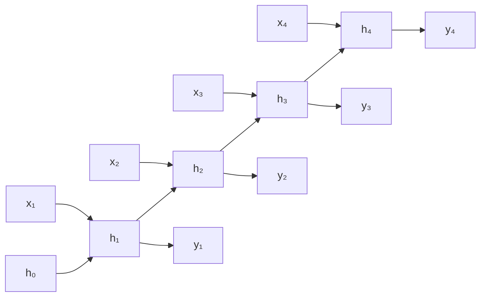
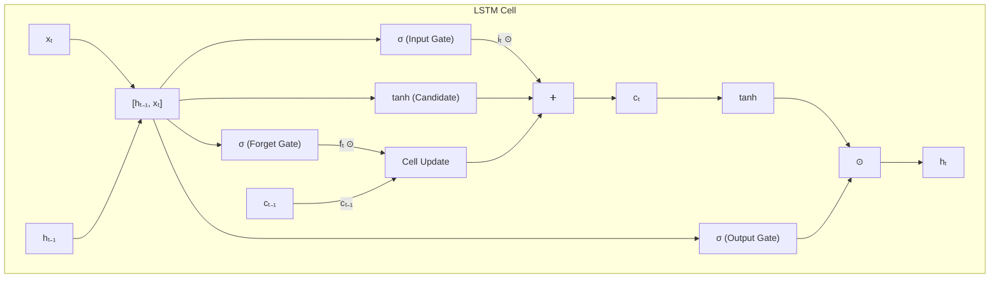

# RNN and LSTM

Recurrent neural networks process sequential data by maintaining a hidden state that carries information across time steps. This page derives the vanilla RNN, demonstrates why gradients vanish, builds LSTM and GRU from the equations up, implements them from scratch in PyTorch, and applies them to IMDB sentiment analysis and stock price prediction.

## Vanilla RNN

### The Equations

At each time step $t$, the RNN updates its hidden state:

$$
h_t = \tanh(W_{hh} h_{t-1} + W_{xh} x_t + b_h)
$$

$$
y_t = W_{hy} h_t + b_y
$$

where:
- $x_t \in \mathbb{R}^d$ is the input at time $t$
- $h_t \in \mathbb{R}^n$ is the hidden state
- $W_{xh} \in \mathbb{R}^{n \times d}$ maps input to hidden
- $W_{hh} \in \mathbb{R}^{n \times n}$ maps hidden to hidden (recurrence)
- $W_{hy} \in \mathbb{R}^{o \times n}$ maps hidden to output

### Unrolling Through Time



The same weights $W_{hh}$, $W_{xh}$ are shared across all time steps.

### From-Scratch RNN

```python
import torch
import torch.nn as nn

class RNNFromScratch(nn.Module):
    def __init__(self, input_size, hidden_size, output_size):
        super().__init__()
        self.hidden_size = hidden_size
        self.W_xh = nn.Parameter(torch.randn(input_size, hidden_size) * 0.01)
        self.W_hh = nn.Parameter(torch.randn(hidden_size, hidden_size) * 0.01)
        self.b_h = nn.Parameter(torch.zeros(hidden_size))
        self.W_hy = nn.Parameter(torch.randn(hidden_size, output_size) * 0.01)
        self.b_y = nn.Parameter(torch.zeros(output_size))

    def forward(self, x, h_prev=None):
        """
        x: (batch, seq_len, input_size)
        Returns: outputs (batch, seq_len, output_size), h_final
        """
        batch_size, seq_len, _ = x.shape
        if h_prev is None:
            h_prev = torch.zeros(batch_size, self.hidden_size, device=x.device)

        outputs = []
        h = h_prev
        for t in range(seq_len):
            h = torch.tanh(x[:, t] @ self.W_xh + h @ self.W_hh + self.b_h)
            y = h @ self.W_hy + self.b_y
            outputs.append(y.unsqueeze(1))

        return torch.cat(outputs, dim=1), h
```

## The Vanishing Gradient Problem

### Mathematical Analysis

During backpropagation through time (BPTT), the gradient of the loss at time $T$ with respect to the hidden state at time $t$ involves a product of Jacobians:

$$
\frac{\partial h_T}{\partial h_t} = \prod_{k=t+1}^{T} \frac{\partial h_k}{\partial h_{k-1}}
$$

Each factor is:

$$
\frac{\partial h_k}{\partial h_{k-1}} = \text{diag}(\tanh'(z_k)) \cdot W_{hh}
$$

where $\tanh'(z) = 1 - \tanh^2(z) \in (0, 1]$.

The gradient magnitude depends on the spectral norm of $W_{hh}$:

- If the largest singular value $\sigma_{\max}(W_{hh}) < 1$: gradients **vanish** exponentially as $T - t$ grows
- If $\sigma_{\max}(W_{hh}) > 1$: gradients **explode** exponentially

$$
\left\| \frac{\partial h_T}{\partial h_t} \right\| \leq \left( \sigma_{\max}(W_{hh}) \right)^{T-t}
$$

For a 100-step sequence with $\sigma_{\max} = 0.9$:

$$
0.9^{100} \approx 2.66 \times 10^{-5}
$$

The gradient from the end of the sequence barely reaches the beginning. The network cannot learn long-range dependencies.

### Gradient Clipping (Partial Fix)

Gradient clipping handles exploding gradients but not vanishing ones:

```python
torch.nn.utils.clip_grad_norm_(model.parameters(), max_norm=5.0)
```

## LSTM: Long Short-Term Memory

LSTMs (Hochreiter and Schmidhuber, 1997) solve the vanishing gradient problem by introducing a cell state $c_t$ that carries information across time with additive (not multiplicative) updates, plus gates that control information flow.

### LSTM Equations

**Forget gate** --- what to erase from the cell state:

$$
f_t = \sigma(W_f [h_{t-1}, x_t] + b_f)
$$

**Input gate** --- what new information to write:

$$
i_t = \sigma(W_i [h_{t-1}, x_t] + b_i)
$$

**Candidate cell state** --- what to potentially add:

$$
\tilde{c}_t = \tanh(W_c [h_{t-1}, x_t] + b_c)
$$

**Cell state update** --- the key innovation (additive, not multiplicative):

$$
c_t = f_t \odot c_t + i_t \odot \tilde{c}_t
$$

**Output gate** --- what to expose to the next layer:

$$
o_t = \sigma(W_o [h_{t-1}, x_t] + b_o)
$$

**Hidden state:**

$$
h_t = o_t \odot \tanh(c_t)
$$

### Why LSTMs Fix Vanishing Gradients

The cell state gradient flows through:

$$
\frac{\partial c_t}{\partial c_{t-1}} = f_t
$$

Since $f_t \in (0, 1)$ is a sigmoid output, the gradient can persist if the forget gate stays close to 1. The network learns when to remember (high $f_t$) and when to forget (low $f_t$). This is an additive path --- no repeated multiplication by weight matrices.

### LSTM Gate Visualization



### From-Scratch LSTM

```python
class LSTMFromScratch(nn.Module):
    def __init__(self, input_size, hidden_size):
        super().__init__()
        self.hidden_size = hidden_size

        # Combined weights for efficiency (all 4 gates at once)
        self.W_ih = nn.Parameter(torch.randn(4 * hidden_size, input_size) * 0.01)
        self.W_hh = nn.Parameter(torch.randn(4 * hidden_size, hidden_size) * 0.01)
        self.bias = nn.Parameter(torch.zeros(4 * hidden_size))

        # Initialize forget gate bias to 1 (remember by default)
        self.bias.data[hidden_size:2*hidden_size].fill_(1.0)

    def forward(self, x, state=None):
        """
        x: (batch, seq_len, input_size)
        state: tuple of (h, c), each (batch, hidden_size)
        """
        batch_size, seq_len, _ = x.shape
        if state is None:
            h = torch.zeros(batch_size, self.hidden_size, device=x.device)
            c = torch.zeros(batch_size, self.hidden_size, device=x.device)
        else:
            h, c = state

        outputs = []
        for t in range(seq_len):
            gates = x[:, t] @ self.W_ih.T + h @ self.W_hh.T + self.bias
            i, f, g, o = gates.chunk(4, dim=1)

            i = torch.sigmoid(i)   # Input gate
            f = torch.sigmoid(f)   # Forget gate
            g = torch.tanh(g)      # Candidate
            o = torch.sigmoid(o)   # Output gate

            c = f * c + i * g      # Cell state update
            h = o * torch.tanh(c)  # Hidden state

            outputs.append(h.unsqueeze(1))

        return torch.cat(outputs, dim=1), (h, c)
```

::: tip Forget Gate Bias
Initialize the forget gate bias to 1. This makes the LSTM remember by default at the start of training, which helps learning. This was proposed by Jozefowicz et al. (2015) and is now standard practice.
:::

## GRU: Gated Recurrent Unit

GRU (Cho et al., 2014) simplifies LSTM by merging the cell and hidden state and using only two gates.

### GRU Equations

**Reset gate:**

$$
r_t = \sigma(W_r [h_{t-1}, x_t] + b_r)
$$

**Update gate:**

$$
z_t = \sigma(W_z [h_{t-1}, x_t] + b_z)
$$

**Candidate hidden state:**

$$
\tilde{h}_t = \tanh(W_h [r_t \odot h_{t-1}, x_t] + b_h)
$$

**Hidden state update:**

$$
h_t = (1 - z_t) \odot h_{t-1} + z_t \odot \tilde{h}_t
$$

### LSTM vs GRU

| Feature | LSTM | GRU |
|---------|------|-----|
| Gates | 3 (forget, input, output) | 2 (reset, update) |
| States | 2 (hidden + cell) | 1 (hidden) |
| Parameters | More (~4x hidden) | Fewer (~3x hidden) |
| Performance | Slightly better on long sequences | Comparable, faster to train |
| When to use | Default for sequences | When speed matters |

## Bidirectional RNNs

Process the sequence in both directions, capturing both past and future context:

$$
\overrightarrow{h_t} = \text{RNN}(\overrightarrow{h_{t-1}}, x_t) \quad \text{(forward)}
$$

$$
\overleftarrow{h_t} = \text{RNN}(\overleftarrow{h_{t+1}}, x_t) \quad \text{(backward)}
$$

$$
h_t = [\overrightarrow{h_t}; \overleftarrow{h_t}] \quad \text{(concatenation)}
$$

```python
# PyTorch bidirectional LSTM
lstm = nn.LSTM(
    input_size=300,
    hidden_size=256,
    num_layers=2,
    batch_first=True,
    bidirectional=True,
    dropout=0.3,
)
# Output shape: (batch, seq_len, 2 * hidden_size)
# h_n shape: (2 * num_layers, batch, hidden_size)
```

## Application 1: IMDB Sentiment Analysis

```python
import torch
import torch.nn as nn
from torchtext.datasets import IMDB
from torchtext.data.utils import get_tokenizer
from torchtext.vocab import build_vocab_from_iterator
from torch.utils.data import DataLoader
from torch.nn.utils.rnn import pad_sequence

# ── Data Preparation ─────────────────────────────────────────────────
tokenizer = get_tokenizer('basic_english')

def yield_tokens(data_iter):
    for label, text in data_iter:
        yield tokenizer(text)

train_iter = IMDB(split='train')
vocab = build_vocab_from_iterator(yield_tokens(train_iter), specials=['<unk>', '<pad>'])
vocab.set_default_index(vocab['<unk>'])

def text_pipeline(text):
    return vocab(tokenizer(text))

def collate_batch(batch):
    labels, texts = [], []
    for label, text in batch:
        labels.append(1 if label == 'pos' else 0)
        tokens = text_pipeline(text)[:512]  # Truncate to 512 tokens
        texts.append(torch.tensor(tokens, dtype=torch.long))
    labels = torch.tensor(labels, dtype=torch.float)
    texts = pad_sequence(texts, batch_first=True, padding_value=vocab['<pad>'])
    return texts, labels

train_loader = DataLoader(
    list(IMDB(split='train')), batch_size=64,
    shuffle=True, collate_fn=collate_batch
)
test_loader = DataLoader(
    list(IMDB(split='test')), batch_size=64,
    shuffle=False, collate_fn=collate_batch
)

# ── Model ────────────────────────────────────────────────────────────
class SentimentLSTM(nn.Module):
    def __init__(self, vocab_size, embed_dim, hidden_dim, num_layers, dropout=0.3):
        super().__init__()
        self.embedding = nn.Embedding(vocab_size, embed_dim, padding_idx=vocab['<pad>'])
        self.lstm = nn.LSTM(
            embed_dim, hidden_dim, num_layers,
            batch_first=True, bidirectional=True, dropout=dropout
        )
        self.fc = nn.Linear(hidden_dim * 2, 1)
        self.dropout = nn.Dropout(dropout)

    def forward(self, x):
        embedded = self.dropout(self.embedding(x))
        output, (h_n, _) = self.lstm(embedded)
        # Concatenate final hidden states from both directions
        hidden = torch.cat([h_n[-2], h_n[-1]], dim=1)
        return self.fc(self.dropout(hidden)).squeeze(1)

# ── Training ─────────────────────────────────────────────────────────
device = torch.device('cuda' if torch.cuda.is_available() else 'cpu')
model = SentimentLSTM(len(vocab), 128, 256, 2).to(device)
criterion = nn.BCEWithLogitsLoss()
optimizer = torch.optim.Adam(model.parameters(), lr=1e-3)

for epoch in range(10):
    model.train()
    total_loss = 0
    for texts, labels in train_loader:
        texts, labels = texts.to(device), labels.to(device)
        optimizer.zero_grad()
        output = model(texts)
        loss = criterion(output, labels)
        loss.backward()
        torch.nn.utils.clip_grad_norm_(model.parameters(), 1.0)
        optimizer.step()
        total_loss += loss.item()

    # Evaluate
    model.eval()
    correct = 0
    total = 0
    with torch.no_grad():
        for texts, labels in test_loader:
            texts, labels = texts.to(device), labels.to(device)
            preds = (torch.sigmoid(model(texts)) > 0.5).float()
            correct += (preds == labels).sum().item()
            total += labels.size(0)

    print(f"Epoch {epoch+1}: Loss={total_loss/len(train_loader):.4f}, "
          f"Acc={100*correct/total:.2f}%")
# Expected: ~87-89% accuracy
```

## Application 2: Stock Price Prediction

```python
import numpy as np
import torch
import torch.nn as nn
from torch.utils.data import Dataset, DataLoader

# ── Data ─────────────────────────────────────────────────────────────
def create_sequences(data, seq_length):
    X, y = [], []
    for i in range(len(data) - seq_length):
        X.append(data[i:i+seq_length])
        y.append(data[i+seq_length])
    return np.array(X), np.array(y)

# Simulate stock data (replace with real data from yfinance)
np.random.seed(42)
days = 1000
prices = np.cumsum(np.random.randn(days) * 2 + 0.05) + 100
prices = (prices - prices.mean()) / prices.std()  # Normalize

seq_length = 30
X, y = create_sequences(prices, seq_length)

# Split
split = int(0.8 * len(X))
X_train, X_test = X[:split], X[split:]
y_train, y_test = y[:split], y[split:]

class StockDataset(Dataset):
    def __init__(self, X, y):
        self.X = torch.FloatTensor(X).unsqueeze(-1)  # (N, seq, 1)
        self.y = torch.FloatTensor(y)

    def __len__(self):
        return len(self.X)

    def __getitem__(self, idx):
        return self.X[idx], self.y[idx]

train_loader = DataLoader(StockDataset(X_train, y_train), batch_size=32, shuffle=True)
test_loader = DataLoader(StockDataset(X_test, y_test), batch_size=32)

# ── Model ────────────────────────────────────────────────────────────
class StockLSTM(nn.Module):
    def __init__(self, input_size=1, hidden_size=64, num_layers=2):
        super().__init__()
        self.lstm = nn.LSTM(input_size, hidden_size, num_layers,
                           batch_first=True, dropout=0.2)
        self.fc = nn.Linear(hidden_size, 1)

    def forward(self, x):
        out, _ = self.lstm(x)
        return self.fc(out[:, -1, :]).squeeze(1)  # Use last time step

model = StockLSTM().to(device)
criterion = nn.MSELoss()
optimizer = torch.optim.Adam(model.parameters(), lr=1e-3)

for epoch in range(50):
    model.train()
    for X_batch, y_batch in train_loader:
        X_batch, y_batch = X_batch.to(device), y_batch.to(device)
        optimizer.zero_grad()
        loss = criterion(model(X_batch), y_batch)
        loss.backward()
        optimizer.step()

    if (epoch + 1) % 10 == 0:
        model.eval()
        with torch.no_grad():
            test_loss = sum(
                criterion(model(x.to(device)), y.to(device)).item()
                for x, y in test_loader
            ) / len(test_loader)
        print(f"Epoch {epoch+1}: Test MSE={test_loss:.4f}")
```

::: warning Stock Prediction Caveat
LSTM stock prediction is a learning exercise. In practice, stock markets are largely efficient and simple LSTM models do not beat buy-and-hold strategies on real data. The technique is useful for other time series tasks (weather, energy, sensor data).
:::

## When to Use RNN/LSTM vs Transformers

| Criterion | RNN/LSTM | Transformer |
|-----------|----------|-------------|
| Sequence length | Short-medium (<500) | Any length (with attention) |
| Training speed | Slower (sequential) | Faster (parallelizable) |
| Long-range dependencies | Moderate (LSTM helps) | Excellent (direct attention) |
| Memory efficiency | O(1) per step | O(n^2) attention matrix |
| Streaming/online | Natural (process one token at a time) | Requires full context |
| 2026 recommendation | Niche use cases | Default for most tasks |

## Cross-References

- **Foundations:** [Neural Network Basics](/deep-learning/neural-network-basics) --- backprop, gradients
- **Modern alternative:** [Transformers](/deep-learning/transformers) --- self-attention replaces recurrence
- **NLP context:** [NLP Fundamentals](/deep-learning/nlp-fundamentals) --- tokenization, embeddings
- **Language models:** [Language Models](/deep-learning/language-models) --- from RNN LMs to GPT
- **Training:** [Training Techniques](/deep-learning/training-techniques) --- gradient clipping, dropout
