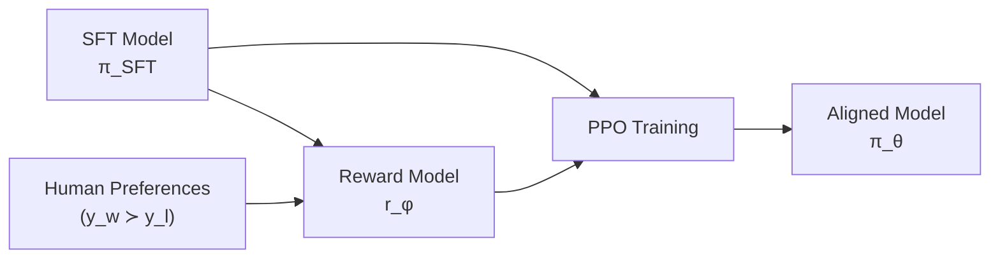

# Text Generation

A language model produces a probability distribution over the next token. How you select from that distribution dramatically affects output quality. This page covers every major decoding strategy with mathematical formulations, explains RLHF and DPO alignment techniques, and fine-tunes GPT-2 for controlled text generation.

## The Generation Problem

Given a prompt $x = (x_1, \ldots, x_n)$, generate a continuation $y = (y_1, \ldots, y_m)$ by sampling tokens autoregressively:

$$
P(y | x) = \prod_{t=1}^{m} P(y_t | x, y_{<t})
$$

At each step, the model outputs logits $z \in \mathbb{R}^V$ (one per vocabulary token). The question is: how do we pick $y_t$ from these logits?

## Greedy Decoding

Pick the most probable token at each step:

$$
y_t = \arg\max_{w \in V} P(w | x, y_{<t})
$$

```python
def greedy_decode(model, tokenizer, prompt, max_length=50):
    input_ids = tokenizer.encode(prompt, return_tensors='pt')
    for _ in range(max_length):
        with torch.no_grad():
            outputs = model(input_ids)
            next_token_logits = outputs.logits[:, -1, :]
            next_token = next_token_logits.argmax(dim=-1, keepdim=True)
        input_ids = torch.cat([input_ids, next_token], dim=1)
        if next_token.item() == tokenizer.eos_token_id:
            break
    return tokenizer.decode(input_ids[0])
```

**Problems:**
- Misses high-probability sequences where the first token is not the most likely
- Produces repetitive, generic text ("the the the...")
- No randomness --- always deterministic

## Beam Search

Maintain $k$ (beam width) partial hypotheses at each step. Expand each by all possible next tokens, keep the top-$k$ by cumulative log-probability.

$$
\text{score}(y) = \sum_{t=1}^{|y|} \log P(y_t | x, y_{<t})
$$

### Length Normalization

Without normalization, beam search favors shorter sequences (fewer negative log-prob terms). Normalize by length:

$$
\text{score}(y) = \frac{1}{|y|^\alpha} \sum_{t=1}^{|y|} \log P(y_t | x, y_{<t})
$$

where $\alpha \in [0.6, 1.0]$ is a tunable parameter.

```python
def beam_search(model, tokenizer, prompt, beam_width=5, max_length=50, alpha=0.7):
    input_ids = tokenizer.encode(prompt, return_tensors='pt')
    # Each beam: (log_prob, token_ids)
    beams = [(0.0, input_ids)]

    for step in range(max_length):
        all_candidates = []
        for score, ids in beams:
            if ids[0, -1].item() == tokenizer.eos_token_id:
                all_candidates.append((score, ids))
                continue

            with torch.no_grad():
                logits = model(ids).logits[:, -1, :]
                log_probs = torch.log_softmax(logits, dim=-1)

            top_k_probs, top_k_ids = log_probs.topk(beam_width)
            for i in range(beam_width):
                new_score = score + top_k_probs[0, i].item()
                new_ids = torch.cat([ids, top_k_ids[:, i:i+1]], dim=1)
                all_candidates.append((new_score, new_ids))

        # Length-normalized scoring
        scored = [(s / (ids.size(1) ** alpha), s, ids) for s, ids in all_candidates]
        scored.sort(key=lambda x: x[0], reverse=True)
        beams = [(s, ids) for _, s, ids in scored[:beam_width]]

    best_score, best_ids = max(beams, key=lambda x: x[0] / (x[1].size(1) ** alpha))
    return tokenizer.decode(best_ids[0])
```

**Good for:** Machine translation, summarization (where there is a "correct" output).

**Bad for:** Open-ended generation (produces generic, boring text).

## Temperature Scaling

Scale the logits before softmax to control randomness:

$$
P(x_i) = \frac{\exp(z_i / T)}{\sum_j \exp(z_j / T)}
$$

- $T = 1$: standard softmax
- $T < 1$: sharper distribution (more confident, more deterministic)
- $T > 1$: flatter distribution (more random, more creative)
- $T \to 0$: greedy decoding
- $T \to \infty$: uniform random

```python
def sample_with_temperature(logits, temperature=1.0):
    scaled_logits = logits / temperature
    probs = torch.softmax(scaled_logits, dim=-1)
    return torch.multinomial(probs, num_samples=1)
```

### Temperature Guidelines

| Temperature | Behavior | Use Case |
|------------|----------|----------|
| 0.1--0.3 | Very focused, near-deterministic | Code generation, factual QA |
| 0.5--0.7 | Balanced creativity/coherence | General assistant, writing |
| 0.8--1.0 | Creative, diverse | Story writing, brainstorming |
| 1.2--1.5 | Very creative, occasional nonsense | Poetry, experimental |

## Top-k Sampling

Only sample from the $k$ most probable tokens:

$$
P'(x_i) = \begin{cases} \frac{P(x_i)}{\sum_{j \in \text{top-}k} P(x_j)} & \text{if } x_i \in \text{top-}k \\ 0 & \text{otherwise} \end{cases}
$$

```python
def top_k_sampling(logits, k=50, temperature=1.0):
    scaled = logits / temperature
    top_k_values, top_k_indices = scaled.topk(k)

    # Set everything outside top-k to -inf
    filtered = torch.full_like(scaled, float('-inf'))
    filtered.scatter_(1, top_k_indices, top_k_values)

    probs = torch.softmax(filtered, dim=-1)
    return torch.multinomial(probs, num_samples=1)
```

**Problem:** Fixed $k$ is wrong for every distribution. For a peaked distribution (model is confident), $k=50$ includes many low-probability tokens. For a flat distribution (model is uncertain), $k=50$ might cut off reasonable options.

::: details Worked Example — Temperature Scaling, Top-k, and Top-p with Actual Logits

**Input logits** (vocabulary of 6 tokens):
$$z = [\underbrace{3.0}_{\text{Paris}}, \underbrace{1.5}_{\text{London}}, \underbrace{1.0}_{\text{the}}, \underbrace{0.5}_{\text{Berlin}}, \underbrace{-1.0}_{\text{cat}}, \underbrace{-2.0}_{\text{xyz}}]$$

**Standard softmax** ($T = 1.0$):

| Token | $e^{z_i}$ | $P(x_i)$ |
|---|---|---|
| Paris | 20.09 | **0.659** |
| London | 4.48 | 0.147 |
| the | 2.72 | 0.089 |
| Berlin | 1.65 | 0.054 |
| cat | 0.37 | 0.012 |
| xyz | 0.14 | 0.004 |

**Temperature $T = 0.5$** (sharper --- divide logits by 0.5 first):
- $z/T = [6.0, 3.0, 2.0, 1.0, -2.0, -4.0]$
- Paris: **0.880**, London: 0.088, the: 0.032, Berlin: 0.012, cat: 0.001, xyz: 0.0

**Temperature $T = 2.0$** (flatter --- divide logits by 2.0 first):
- $z/T = [1.5, 0.75, 0.5, 0.25, -0.5, -1.0]$
- Paris: **0.338**, London: 0.160, the: 0.125, Berlin: 0.097, cat: 0.046, xyz: 0.028

**Top-k ($k = 3$):** Keep only Paris, London, the. Renormalize:
- Paris: $0.659/0.895 = 0.736$, London: 0.164, the: 0.100

**Top-p ($p = 0.9$):** Cumulative from highest:
- Paris: 0.659 (cumsum = 0.659 < 0.9, keep)
- London: 0.147 (cumsum = 0.806 < 0.9, keep)
- the: 0.089 (cumsum = 0.895 < 0.9, keep)
- Berlin: 0.054 (cumsum = 0.950 > 0.9, stop before this)

Keep: Paris, London, the (3 tokens). But if Paris had $P = 0.92$, top-p would keep only 1 token.

**Result:** Temperature controls the sharpness of the distribution. $T=0.5$ makes the model 88% confident in "Paris" vs 66% at $T=1.0$. Top-p adapts dynamically: for confident predictions, it keeps few tokens; for uncertain ones, it keeps many.

:::

## Top-p (Nucleus) Sampling

Dynamically select the smallest set of tokens whose cumulative probability exceeds $p$:

$$
\sum_{x_i \in V^{(p)}} P(x_i) \geq p
$$

```python
def top_p_sampling(logits, p=0.9, temperature=1.0):
    scaled = logits / temperature
    probs = torch.softmax(scaled, dim=-1)

    # Sort in descending order
    sorted_probs, sorted_indices = torch.sort(probs, descending=True)
    cumulative_probs = torch.cumsum(sorted_probs, dim=-1)

    # Remove tokens with cumulative probability above p
    sorted_indices_to_remove = cumulative_probs - sorted_probs > p
    sorted_probs[sorted_indices_to_remove] = 0.0

    # Renormalize
    sorted_probs = sorted_probs / sorted_probs.sum(dim=-1, keepdim=True)

    # Sample
    token_idx = torch.multinomial(sorted_probs, num_samples=1)
    return sorted_indices.gather(1, token_idx)
```

### Why Nucleus Sampling Works

For a peaked distribution (e.g., "The capital of France is ___"):
- $p = 0.9$ might select only 2-3 tokens (Paris, the, ...)
- No low-probability noise

For a flat distribution (e.g., "I like to eat ___"):
- $p = 0.9$ might select 50+ tokens
- Preserves diversity

### Recommended Settings

| Task | Temperature | Top-p | Top-k |
|------|-----------|-------|-------|
| Chat/Assistant | 0.7 | 0.9 | -- |
| Code generation | 0.2 | 0.95 | -- |
| Creative writing | 0.9 | 0.95 | -- |
| Translation | 0.1 | 0.9 | -- |
| Data extraction | 0.0 | -- | 1 (greedy) |

## Repetition Penalty

Penalize tokens that have already appeared:

$$
z_i' = \begin{cases} z_i / \theta & \text{if } z_i > 0 \text{ and } x_i \in \text{generated} \\ z_i \times \theta & \text{if } z_i \leq 0 \text{ and } x_i \in \text{generated} \end{cases}
$$

where $\theta > 1$ is the repetition penalty factor.

## RLHF: Reinforcement Learning from Human Feedback

RLHF aligns language models with human preferences in three steps:

### Step 1: Supervised Fine-Tuning (SFT)

Fine-tune the base model on high-quality demonstration data:

$$
\mathcal{L}_{\text{SFT}} = -\sum_{t} \log P_\theta(y_t | x, y_{<t})
$$

### Step 2: Reward Model Training

Train a reward model $r_\phi(x, y)$ on human preference data. Given pairs $(y_w, y_l)$ where $y_w$ is preferred:

$$
\mathcal{L}_{\text{RM}} = -\mathbb{E}\left[\log \sigma(r_\phi(x, y_w) - r_\phi(x, y_l))\right]
$$

This is the Bradley-Terry model of pairwise preferences.

### Step 3: PPO Optimization

Optimize the policy (LM) to maximize reward while staying close to the SFT model:

$$
\mathcal{L}_{\text{PPO}} = \mathbb{E}\left[r_\phi(x, y) - \beta D_{KL}(\pi_\theta \| \pi_{\text{SFT}})\right]
$$

The KL penalty prevents the model from gaming the reward model (reward hacking).

::: details Worked Example — RLHF Reward Model Training

**Setup:** Prompt: "Explain gravity." Two responses ranked by a human:

- $y_w$ (preferred): "Gravity is a force that pulls objects toward each other..."
- $y_l$ (rejected): "Gravity is complicated. Look it up."

Reward model scores: $r_\phi(x, y_w) = 2.5$, $r_\phi(x, y_l) = -0.8$

**Bradley-Terry loss:**
$$\mathcal{L} = -\log\sigma(r_\phi(x, y_w) - r_\phi(x, y_l)) = -\log\sigma(2.5 - (-0.8)) = -\log\sigma(3.3)$$
$$= -\log(0.964) = 0.037$$

The loss is low (0.037) because the reward model correctly assigns a much higher score to the preferred response.

**If the model were confused** ($r_w = 0.5$, $r_l = 0.3$):
$$\mathcal{L} = -\log\sigma(0.5 - 0.3) = -\log\sigma(0.2) = -\log(0.550) = 0.598$$

**Result:** The reward model loss is low (0.037) when the score gap is large and correct, high (0.598) when the model barely distinguishes the two. Training pushes the reward model to assign higher scores to human-preferred responses.

:::



## DPO: Direct Preference Optimization

DPO (Rafailov et al., 2023) eliminates the need for a separate reward model by directly optimizing preferences:

$$
\mathcal{L}_{\text{DPO}} = -\mathbb{E}\left[\log \sigma\left(\beta \log \frac{\pi_\theta(y_w|x)}{\pi_{\text{ref}}(y_w|x)} - \beta \log \frac{\pi_\theta(y_l|x)}{\pi_{\text{ref}}(y_l|x)}\right)\right]
$$

**Key insight:** The optimal RLHF policy has a closed-form relationship to the reward:

$$
r(x, y) = \beta \log \frac{\pi^*(y|x)}{\pi_{\text{ref}}(y|x)} + \beta \log Z(x)
$$

Substituting this into the Bradley-Terry model eliminates $r$ and $Z$, yielding the DPO loss.

### RLHF vs DPO

| Feature | RLHF (PPO) | DPO |
|---------|----------|-----|
| Reward model | Required (separate training) | Not needed |
| Training stability | Harder (RL instabilities) | Easier (supervised loss) |
| Compute | Higher (RM + PPO) | Lower (single fine-tuning) |
| Performance | Slightly better at scale | Comparable |
| Implementation | Complex | Simple (like SFT) |

## GPT-2 Fine-Tuning

```python
from transformers import (
    GPT2LMHeadModel, GPT2Tokenizer,
    Trainer, TrainingArguments, DataCollatorForLanguageModeling
)
from datasets import load_dataset

# Load model and tokenizer
tokenizer = GPT2Tokenizer.from_pretrained('gpt2')
tokenizer.pad_token = tokenizer.eos_token
model = GPT2LMHeadModel.from_pretrained('gpt2')

# Load dataset (e.g., a custom text dataset)
dataset = load_dataset('wikitext', 'wikitext-2-raw-v1')

def tokenize_function(examples):
    return tokenizer(
        examples['text'],
        truncation=True,
        max_length=256,
        padding='max_length',
    )

tokenized = dataset.map(tokenize_function, batched=True, remove_columns=['text'])

# Data collator for CLM
data_collator = DataCollatorForLanguageModeling(
    tokenizer=tokenizer,
    mlm=False,  # Causal LM, not masked LM
)

# Training
training_args = TrainingArguments(
    output_dir='./gpt2-finetuned',
    num_train_epochs=3,
    per_device_train_batch_size=8,
    gradient_accumulation_steps=4,
    learning_rate=5e-5,
    warmup_steps=500,
    weight_decay=0.01,
    logging_steps=100,
    save_steps=1000,
    fp16=True,
)

trainer = Trainer(
    model=model,
    args=training_args,
    train_dataset=tokenized['train'],
    eval_dataset=tokenized['validation'],
    data_collator=data_collator,
)

trainer.train()

# ── Generate text ────────────────────────────────────────────────────
from transformers import pipeline

generator = pipeline('text-generation', model=model, tokenizer=tokenizer)
output = generator(
    "The future of artificial intelligence",
    max_length=100,
    temperature=0.8,
    top_p=0.9,
    do_sample=True,
    num_return_sequences=3,
)
for i, seq in enumerate(output):
    print(f"\n--- Generation {i+1} ---")
    print(seq['generated_text'])
```

## Constrained Generation

### Structured Output

Force the model to produce valid JSON, code, or other structured formats:

```python
from transformers import LogitsProcessor

class JSONLogitsProcessor(LogitsProcessor):
    """Enforce valid JSON structure during generation."""
    def __init__(self, tokenizer):
        self.tokenizer = tokenizer
        self.open_braces = 0

    def __call__(self, input_ids, scores):
        # Get last generated token
        last_token = self.tokenizer.decode(input_ids[0, -1:])

        if '{' in last_token:
            self.open_braces += 1
        if '}' in last_token:
            self.open_braces -= 1

        # If no open braces and we have content, prefer EOS
        if self.open_braces == 0 and input_ids.size(1) > 5:
            scores[:, self.tokenizer.eos_token_id] += 10.0

        return scores
```

## Evaluation Metrics for Generation

### Perplexity

$$
\text{PPL} = \exp\left(-\frac{1}{T} \sum_{t=1}^{T} \log P(w_t | w_{<t})\right)
$$

Lower is better. Measures how well the model predicts the test set.

### BLEU (Bilingual Evaluation Understudy)

Measures n-gram overlap between generated and reference text:

$$
\text{BLEU} = BP \cdot \exp\left(\sum_{n=1}^{N} w_n \log p_n\right)
$$

where $p_n$ is the modified n-gram precision and $BP$ is the brevity penalty.

```python
from nltk.translate.bleu_score import sentence_bleu

reference = [['the', 'cat', 'sat', 'on', 'the', 'mat']]
candidate = ['the', 'cat', 'is', 'on', 'the', 'mat']
score = sentence_bleu(reference, candidate)
print(f"BLEU: {score:.4f}")  # ~0.67
```

### ROUGE

Recall-oriented metric for summarization:

- **ROUGE-1:** Unigram overlap
- **ROUGE-2:** Bigram overlap
- **ROUGE-L:** Longest common subsequence

### Human Evaluation

For open-ended generation, human evaluation remains the gold standard:

| Criterion | Description |
|-----------|-------------|
| Fluency | Is the text grammatically correct? |
| Coherence | Does the text make logical sense? |
| Relevance | Does it address the prompt? |
| Factuality | Are the claims accurate? |
| Helpfulness | Is it useful to the user? |

## Watermarking Generated Text

Watermarking (Kirchenbauer et al., 2023) embeds a detectable signal in generated text by biasing the token selection:

1. At each step, hash the previous token to create a "green list" of tokens
2. Add a small bias $\delta$ to green list token logits
3. Detection: count the fraction of green list tokens in a text

This allows statistical detection of AI-generated text without affecting quality.

## Speculative Decoding

Speed up generation by using a small "draft" model to propose tokens and a large "target" model to verify:

1. Draft model generates $K$ tokens autoregressively (fast)
2. Target model evaluates all $K$ tokens in parallel (one forward pass)
3. Accept tokens until the first rejection
4. Sample a correction token from the adjusted distribution

Expected speedup: 2-3x with no quality loss (mathematically equivalent to sampling from the target model).

```python
def speculative_decode(draft_model, target_model, prompt_ids, K=5, max_tokens=100):
    generated = prompt_ids.clone()

    while generated.size(1) < max_tokens:
        # Draft model generates K candidate tokens
        draft_tokens = []
        draft_probs = []
        draft_input = generated
        for _ in range(K):
            with torch.no_grad():
                logits = draft_model(draft_input).logits[:, -1, :]
                probs = torch.softmax(logits, dim=-1)
                token = torch.multinomial(probs, 1)
                draft_tokens.append(token)
                draft_probs.append(probs)
                draft_input = torch.cat([draft_input, token], dim=1)

        # Target model evaluates all K tokens in one pass
        with torch.no_grad():
            target_logits = target_model(draft_input).logits
            target_probs = torch.softmax(target_logits[:, -(K+1):-1, :], dim=-1)

        # Accept/reject each drafted token
        accepted = 0
        for i in range(K):
            t = draft_tokens[i].item()
            p_target = target_probs[0, i, t].item()
            p_draft = draft_probs[i][0, t].item()

            if torch.rand(1).item() < min(1, p_target / (p_draft + 1e-10)):
                accepted += 1
            else:
                break

        generated = draft_input[:, :generated.size(1) + accepted + 1]

    return generated
```

## Cross-References

- **Model architecture:** [Transformers](/deep-learning/transformers) --- attention, positional encoding
- **Pre-training:** [Language Models](/deep-learning/language-models) --- CLM, MLM, scaling
- **BERT alternative:** [BERT Family](/deep-learning/bert-family) --- encoder-only models
- **Reward modeling:** [Reinforcement Learning](/deep-learning/reinforcement-learning) --- PPO, policy gradients
- **Deployment:** [Model Optimization](/deep-learning/model-optimization) --- quantization for faster inference
- **API usage:** [OpenAI API](/ai-ml-engineering/openai-api) | [Anthropic API](/ai-ml-engineering/anthropic-claude-api)
