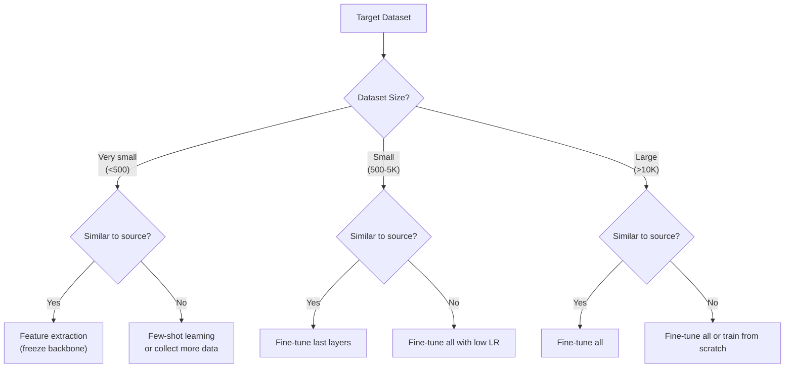

# Transfer Learning

Transfer learning uses knowledge learned on one task (source) to improve performance on a different task (target). It is the single most impactful technique in modern deep learning --- almost nobody trains from scratch anymore. This page explains why transfer learning works, compares feature extraction with fine-tuning, covers domain adaptation, builds Siamese networks for few-shot learning, and demonstrates zero-shot classification with CLIP.

## Why Transfer Learning Works

### Hierarchical Feature Learning

Deep networks learn increasingly abstract features:

| Layer | Learns | Transferable? |
|-------|--------|--------------|
| Layer 1-2 | Edges, textures | Highly (universal) |
| Layer 3-5 | Parts, patterns | Moderately |
| Layer 6+ | Task-specific concepts | Least |

Early layers learn features that are useful for virtually any visual task. Later layers specialize. Transfer learning reuses the universal features and only retrains the specialized ones.

### Mathematical Intuition

Let $f_\theta$ be a network pre-trained on source task $S$. For target task $T$:

$$
\theta^*_T = \arg\min_\theta \mathcal{L}_T(f_\theta) \quad \text{starting from } \theta_S
$$

If $S$ and $T$ share low-level features, $\theta_S$ is a much better initialization than random $\theta_0$. The loss landscape near $\theta_S$ already has good gradients for $T$.

### When Does It Help?



## Feature Extraction vs Fine-Tuning

### Feature Extraction (Frozen Backbone)

Use the pretrained model as a fixed feature extractor:

```python
import torch
import torch.nn as nn
import torchvision.models as models

# Load pretrained ResNet-50
model = models.resnet50(weights=models.ResNet50_Weights.IMAGENET1K_V2)

# Freeze all layers
for param in model.parameters():
    param.requires_grad = False

# Replace classifier
model.fc = nn.Sequential(
    nn.Linear(2048, 256),
    nn.ReLU(),
    nn.Dropout(0.3),
    nn.Linear(256, num_classes),
)

# Only classifier parameters train
optimizer = torch.optim.Adam(model.fc.parameters(), lr=1e-3)
```

**Pros:** Fast (fewer parameters to train), works with tiny datasets.
**Cons:** Limited adaptation to target domain.

### Fine-Tuning

Unfreeze some or all pretrained layers:

```python
# Strategy 1: Discriminative learning rates
optimizer = torch.optim.AdamW([
    {'params': model.layer1.parameters(), 'lr': 1e-5},
    {'params': model.layer2.parameters(), 'lr': 5e-5},
    {'params': model.layer3.parameters(), 'lr': 1e-4},
    {'params': model.layer4.parameters(), 'lr': 5e-4},
    {'params': model.fc.parameters(), 'lr': 1e-3},
], weight_decay=0.01)

# Strategy 2: Gradual unfreezing
# Epoch 1-3: Only train fc
# Epoch 4-6: Unfreeze layer4
# Epoch 7+: Unfreeze all
def unfreeze_schedule(model, epoch):
    if epoch == 4:
        for param in model.layer4.parameters():
            param.requires_grad = True
    elif epoch == 7:
        for param in model.parameters():
            param.requires_grad = True
```

### Complete Transfer Learning Pipeline

```python
import torch
import torch.nn as nn
import torchvision
import torchvision.transforms as T
from torch.utils.data import DataLoader

# ── Data ─────────────────────────────────────────────────────────────
train_transform = T.Compose([
    T.RandomResizedCrop(224),
    T.RandomHorizontalFlip(),
    T.ToTensor(),
    T.Normalize([0.485, 0.456, 0.406], [0.229, 0.224, 0.225]),
])
val_transform = T.Compose([
    T.Resize(256),
    T.CenterCrop(224),
    T.ToTensor(),
    T.Normalize([0.485, 0.456, 0.406], [0.229, 0.224, 0.225]),
])

# ImageFolder dataset structure:
# dataset/train/class1/*.jpg, dataset/train/class2/*.jpg, ...
train_set = torchvision.datasets.ImageFolder('dataset/train', train_transform)
val_set = torchvision.datasets.ImageFolder('dataset/val', val_transform)

train_loader = DataLoader(train_set, batch_size=32, shuffle=True, num_workers=4)
val_loader = DataLoader(val_set, batch_size=32, num_workers=4)

# ── Model ────────────────────────────────────────────────────────────
model = torchvision.models.efficientnet_b0(
    weights=torchvision.models.EfficientNet_B0_Weights.IMAGENET1K_V1
)
model.classifier = nn.Sequential(
    nn.Dropout(0.2),
    nn.Linear(1280, len(train_set.classes)),
)

device = torch.device('cuda' if torch.cuda.is_available() else 'cpu')
model = model.to(device)

# ── Phase 1: Train head only ────────────────────────────────────────
for param in model.features.parameters():
    param.requires_grad = False

optimizer = torch.optim.Adam(model.classifier.parameters(), lr=1e-3)
criterion = nn.CrossEntropyLoss()

for epoch in range(5):
    model.train()
    for inputs, targets in train_loader:
        inputs, targets = inputs.to(device), targets.to(device)
        optimizer.zero_grad()
        loss = criterion(model(inputs), targets)
        loss.backward()
        optimizer.step()

# ── Phase 2: Fine-tune all ──────────────────────────────────────────
for param in model.parameters():
    param.requires_grad = True

optimizer = torch.optim.AdamW(model.parameters(), lr=1e-4, weight_decay=0.01)
scheduler = torch.optim.lr_scheduler.CosineAnnealingLR(optimizer, T_max=20)

for epoch in range(20):
    model.train()
    for inputs, targets in train_loader:
        inputs, targets = inputs.to(device), targets.to(device)
        optimizer.zero_grad()
        loss = criterion(model(inputs), targets)
        loss.backward()
        optimizer.step()
    scheduler.step()
```

## Domain Adaptation

When the source and target domains differ significantly (e.g., photos vs sketches), standard transfer learning may not work. Domain adaptation techniques align the feature distributions.

### Types

| Type | Source Labels | Target Labels | Example |
|------|-------------|---------------|---------|
| Supervised | Yes | Yes | Both labeled |
| Semi-supervised | Yes | Some | Few target labels |
| Unsupervised | Yes | No | No target labels |

### DANN (Domain-Adversarial Neural Network)

Train a feature extractor that is:
- Discriminative for the task (classification loss)
- Indistinguishable across domains (domain confusion loss via gradient reversal)

$$
\mathcal{L} = \mathcal{L}_{\text{task}} - \lambda \mathcal{L}_{\text{domain}}
$$

The gradient reversal layer flips the gradient sign during backprop, making the feature extractor learn domain-invariant features.

## Few-Shot Learning

### The Problem

Given only $K$ examples per class ($K$-shot), classify new examples. Standard fine-tuning fails with 1-5 examples.

### Siamese Networks

Learn a similarity function rather than class labels:

$$
P(\text{same}) = \sigma(|f_\theta(x_1) - f_\theta(x_2)|)
$$

```python
class SiameseNetwork(nn.Module):
    def __init__(self, backbone):
        super().__init__()
        self.backbone = backbone
        self.fc = nn.Sequential(
            nn.Linear(2048, 256),
            nn.ReLU(),
            nn.Linear(256, 1),
        )

    def forward_one(self, x):
        return self.backbone(x)

    def forward(self, x1, x2):
        f1 = self.forward_one(x1)
        f2 = self.forward_one(x2)
        diff = torch.abs(f1 - f2)
        return torch.sigmoid(self.fc(diff))
```

### Contrastive Loss

$$
\mathcal{L} = (1 - y) \frac{1}{2} d^2 + y \frac{1}{2} \max(0, m - d)^2
$$

where $d = \|f(x_1) - f(x_2)\|$, $y = 0$ for same class, $y = 1$ for different class, and $m$ is the margin.

### Prototypical Networks

Compute class prototypes (mean embeddings) and classify by nearest prototype:

$$
c_k = \frac{1}{|S_k|} \sum_{(x_i, y_i) \in S_k} f_\theta(x_i)
$$

$$
P(y = k | x) = \frac{\exp(-d(f_\theta(x), c_k))}{\sum_{k'} \exp(-d(f_\theta(x), c_{k'}))}
$$

## Zero-Shot Learning with CLIP

CLIP (Contrastive Language-Image Pre-training) learns to align image and text embeddings, enabling zero-shot classification without any task-specific training.

### How CLIP Works

CLIP trains on 400M image-text pairs with a contrastive objective:

$$
\mathcal{L} = -\frac{1}{N} \sum_{i=1}^{N} \left[\log \frac{\exp(\text{sim}(I_i, T_i) / \tau)}{\sum_j \exp(\text{sim}(I_i, T_j) / \tau)}\right]
$$

where $\text{sim}(I, T) = \frac{f_I(I) \cdot f_T(T)}{|f_I(I)| |f_T(T)|}$ is cosine similarity.

### Zero-Shot Classification

```python
import torch
from PIL import Image
from transformers import CLIPProcessor, CLIPModel

model = CLIPModel.from_pretrained("openai/clip-vit-base-patch32")
processor = CLIPProcessor.from_pretrained("openai/clip-vit-base-patch32")

image = Image.open("photo.jpg")
candidate_labels = ["a photo of a cat", "a photo of a dog", "a photo of a bird"]

inputs = processor(
    text=candidate_labels,
    images=image,
    return_tensors="pt",
    padding=True,
)

with torch.no_grad():
    outputs = model(**inputs)
    logits = outputs.logits_per_image
    probs = logits.softmax(dim=1)

for label, prob in zip(candidate_labels, probs[0]):
    print(f"{label}: {prob:.3f}")
# Example output:
# a photo of a cat: 0.942
# a photo of a dog: 0.051
# a photo of a bird: 0.007
```

### CLIP for Image Search

```python
import numpy as np

def build_image_index(model, processor, image_paths):
    """Encode all images into CLIP embeddings."""
    embeddings = []
    for path in image_paths:
        image = Image.open(path)
        inputs = processor(images=image, return_tensors="pt")
        with torch.no_grad():
            emb = model.get_image_features(**inputs)
            emb = emb / emb.norm(dim=-1, keepdim=True)
        embeddings.append(emb.cpu().numpy())
    return np.vstack(embeddings)

def search(query, model, processor, image_index, image_paths, top_k=5):
    """Search images by text query."""
    inputs = processor(text=[query], return_tensors="pt", padding=True)
    with torch.no_grad():
        text_emb = model.get_text_features(**inputs)
        text_emb = text_emb / text_emb.norm(dim=-1, keepdim=True)

    similarities = (text_emb.cpu().numpy() @ image_index.T)[0]
    top_indices = similarities.argsort()[-top_k:][::-1]
    return [(image_paths[i], similarities[i]) for i in top_indices]
```

## Transfer Learning for NLP

Transfer learning in NLP follows the same principles as vision but with different pretrained models.

### HuggingFace Transfer Learning

```python
from transformers import AutoModelForSequenceClassification, AutoTokenizer
from transformers import Trainer, TrainingArguments

# Step 1: Choose a pretrained model
model_name = "microsoft/deberta-v3-base"
tokenizer = AutoTokenizer.from_pretrained(model_name)
model = AutoModelForSequenceClassification.from_pretrained(
    model_name, num_labels=3
)

# Step 2: Prepare data
def tokenize(examples):
    return tokenizer(examples['text'], truncation=True, max_length=256)

# Step 3: Fine-tune
training_args = TrainingArguments(
    output_dir="./results",
    num_train_epochs=3,
    per_device_train_batch_size=16,
    learning_rate=2e-5,          # Low LR for fine-tuning
    warmup_ratio=0.1,            # Warmup is essential
    weight_decay=0.01,
    eval_strategy="epoch",
)

trainer = Trainer(
    model=model,
    args=training_args,
    train_dataset=train_dataset,
    eval_dataset=val_dataset,
)
trainer.train()
```

### Adapter-Based Transfer Learning

Instead of fine-tuning all parameters, insert small adapter modules:

| Method | Trainable Params | Performance | Memory |
|--------|-----------------|-------------|--------|
| Full fine-tuning | 100% | Best | High |
| LoRA (r=16) | ~0.2% | 98% of full | Very low |
| Adapters | ~2% | 97% of full | Low |
| Prompt tuning | ~0.01% | 90-95% of full | Minimal |
| Prefix tuning | ~0.1% | 95% of full | Low |

## Common Transfer Learning Mistakes

| Mistake | Consequence | Fix |
|---------|------------|-----|
| LR too high for backbone | Pretrained features destroyed | Use 10-100x lower LR for backbone |
| No warmup | Training instability | Warmup for 5-10% of steps |
| Wrong image normalization | Features misaligned | Use same normalization as pretraining (ImageNet mean/std) |
| Freezing everything | Insufficient adaptation | At least fine-tune the last few layers |
| Wrong input size | Performance drop | Match pretrained model's expected input size |
| Using wrong tokenizer | Garbage output | Always use the matching tokenizer |

## Measuring Transfer Gap

The effectiveness of transfer depends on the similarity between source and target domains:

$$
\text{Transfer Gap} = \text{Performance}_{\text{target, from scratch}} - \text{Performance}_{\text{target, transferred}}
$$

| Source $\to$ Target | Expected Benefit |
|-------|-----------------|
| ImageNet $\to$ Medical (X-ray) | Moderate (different domain but shared low-level features) |
| ImageNet $\to$ Satellite | Good (natural images share textures) |
| ImageNet $\to$ Microscopy | Moderate (very different visual domain) |
| English BERT $\to$ French NLP | Poor (different language, use multilingual model) |
| General LLM $\to$ Domain-specific | Excellent (language structure transfers) |

## Cross-References

- **CNN architectures:** [CNN](/deep-learning/cnn) --- ResNet, EfficientNet backbones
- **Image classification:** [Image Classification](/deep-learning/image-classification) --- ViT, augmentation
- **BERT transfer:** [BERT Family](/deep-learning/bert-family) --- fine-tuning NLP models
- **Optimization:** [Model Optimization](/deep-learning/model-optimization) --- distillation, quantization
- **Multimodal:** [Multimodal Models](/deep-learning/multimodal-models) --- CLIP, vision-language
- **Training recipes:** [Training Techniques](/deep-learning/training-techniques) --- LR scheduling, dropout
