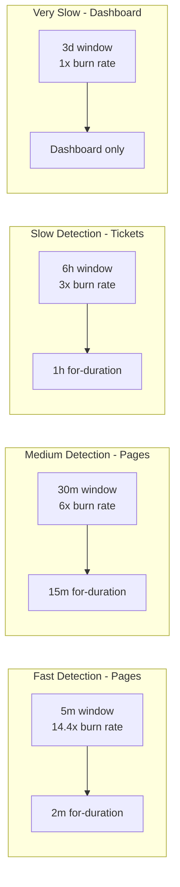
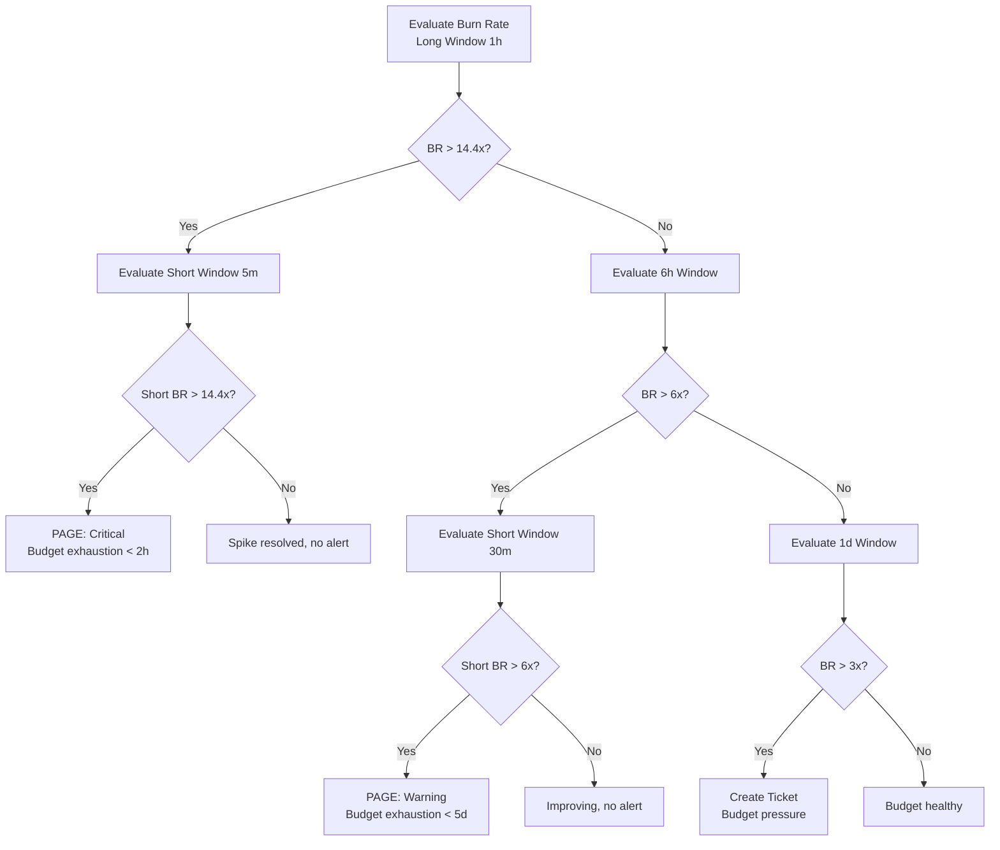
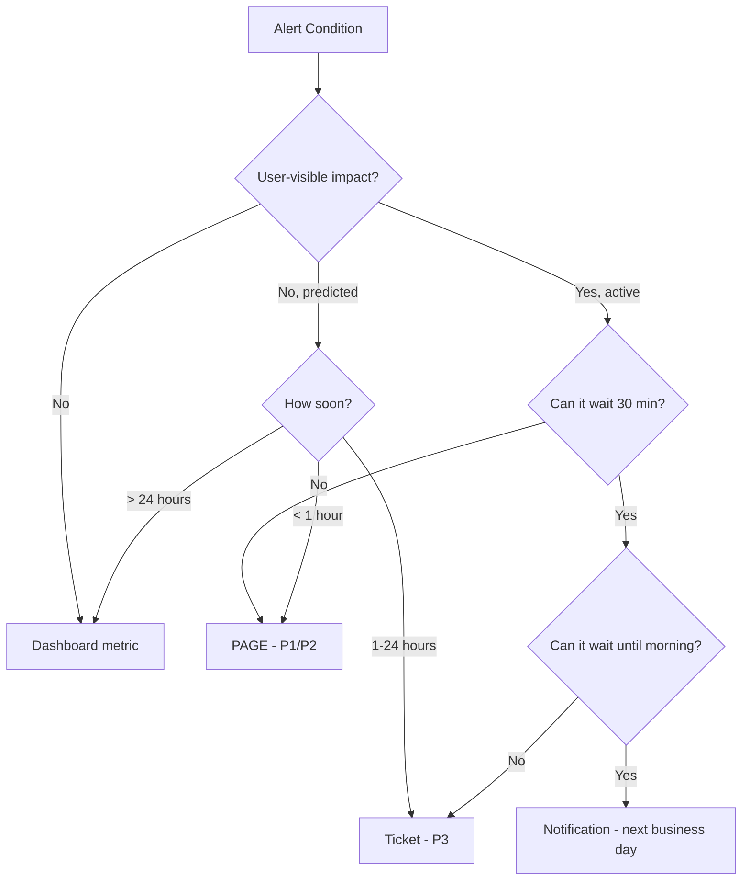

# Alert Design

## Why It Exists

Most engineering teams drown in alerts. The average on-call engineer at a mid-size company receives 50-200 alert notifications per shift, of which only 5-15% require actual intervention. This is not a monitoring problem - it is an alert design problem. The alerts are doing exactly what they were configured to do; they were just configured wrong.

The root cause is that most alerts are designed backwards. Engineers start with a metric ("CPU usage"), pick an arbitrary threshold ("80%"), add a minimal for-duration ("5 minutes"), and ship it. This creates alerts that are technically correct but operationally useless. CPU at 80% for 5 minutes may be completely normal during a daily batch job, or it may be a sign of a memory leak that will crash the process in 30 minutes. The alert doesn't distinguish between these cases.

Good alert design starts with the question: **"What user-visible behavior am I trying to protect?"** and works backwards to the metrics that indicate that behavior is degraded.

### Historical Evolution

The evolution of alert design methodologies:

| Era | Methodology | Limitation |
|-----|------------|------------|
| **Static thresholds** (pre-2010) | Alert when metric > fixed value | No context, ignores seasonality |
| **Dynamic thresholds** (2010-2015) | Alert when metric > rolling average + N sigma | Slow to adapt, misses gradual degradation |
| **Rate-based alerts** (2015-2018) | Alert on rate of change | Can miss sustained degradation |
| **SLO-based alerts** (2018+) | Alert when error budget consumption is too fast | Current best practice |
| **Multi-window burn-rate** (2020+) | Multiple time windows for different urgencies | Most sophisticated, recommended |

## First Principles

### The Error Budget Model

An SLO (Service Level Objective) defines the acceptable level of unreliability. For a 99.9% availability SLO over 30 days:

$$
\text{Error Budget} = (1 - 0.999) \times 30 \times 24 \times 60 = 43.2 \text{ minutes/month}
$$

The error budget is finite and consumable. The question is not "is the service down?" but "how fast are we consuming our budget?"

### Burn Rate

The burn rate is the ratio of actual error rate to the SLO-tolerated error rate:

$$
\text{Burn Rate} = \frac{\text{Actual Error Rate}}{\text{SLO Error Budget Rate}}
$$

For a 99.9% SLO (0.1% error rate budget):
- Burn rate 1.0 = consuming budget at exactly the sustainable rate (will exhaust in 30 days)
- Burn rate 14.4 = consuming budget 14.4x faster (will exhaust in ~2 hours)
- Burn rate 6.0 = consuming budget 6x faster (will exhaust in ~5 days worth in 1 day)
- Burn rate 0.0 = no errors, budget is preserved

### Why Multiple Windows?

A single burn-rate threshold creates a dilemma:
- Set it low (e.g., 2x) to catch slow burns: triggers too many alerts during minor blips
- Set it high (e.g., 14x) to avoid noise: misses sustained moderate degradation

The solution is **multi-window, multi-burn-rate alerting**: use multiple time windows with different burn rates to catch both acute spikes and slow burns.



## Core Mechanics

### Multi-Window Burn-Rate Algorithm

The Google SRE Workbook recommends this specific configuration for a 30-day SLO window:

| Burn Rate | Long Window | Short Window | Action | Time to Exhaust Budget |
|-----------|-------------|--------------|--------|----------------------|
| 14.4x | 1h | 5m | Page (P1) | 2 hours |
| 6x | 6h | 30m | Page (P2) | 5 days |
| 3x | 1d | 2h | Ticket | 10 days |
| 1x | 3d | 6h | Log/Dashboard | 30 days |

The **short window** confirms the problem is current (not historical). Without it, you would alert on problems that already resolved.



### The Math Behind 14.4x

Why specifically 14.4? It comes from the detection time requirement:

For a 30-day window, if we want to detect a complete outage within 2% budget consumption:

$$
\text{Burn Rate} = \frac{\text{Window Size}}{\text{Detection Time}}
$$

$$
14.4 = \frac{30 \text{ days}}{30 \text{ days} \times 0.02 / 1} = \frac{1}{0.02 \times (1\text{h} / 720\text{h})}
$$

More precisely, for a 1-hour long window and 2% budget consumption trigger:

$$
b = \frac{p \cdot W}{w}
$$

Where:
- $b$ = burn rate threshold
- $p$ = fraction of budget consumed before alerting (0.02)
- $W$ = SLO window (720 hours for 30 days)
- $w$ = alert window (1 hour)

$$
b = \frac{0.02 \times 720}{1} = 14.4
$$

### Error Types for SLOs

SLOs typically cover two dimensions:

**Availability SLO**: Fraction of successful requests

$$
\text{SLI}_{availability} = \frac{\text{good requests}}{\text{total requests}} = 1 - \frac{\sum \mathbb{1}[\text{status} \geq 500]}{\sum \mathbb{1}[\text{all requests}]}
$$

**Latency SLO**: Fraction of requests below a threshold

$$
\text{SLI}_{latency} = \frac{\text{requests below threshold}}{\text{total requests}} = P(\text{latency} < \theta)
$$

Both can be expressed as burn rates and monitored with the same multi-window approach.

## Implementation

### Complete Multi-Window Burn-Rate Alert System

```typescript
interface SLODefinition {
  name: string;
  target: number; // e.g., 0.999 for 99.9%
  windowDays: number; // e.g., 30
  errorRatioMetric: string; // PromQL for error ratio
  totalMetric: string; // PromQL for total requests
}

interface BurnRateWindow {
  burnRate: number;
  longWindow: string;
  shortWindow: string;
  severity: 'critical' | 'warning' | 'ticket';
  forDuration: string;
}

interface GeneratedAlert {
  name: string;
  expr: string;
  forDuration: string;
  labels: Record<string, string>;
  annotations: Record<string, string>;
}

class MultiWindowBurnRateAlertGenerator {
  private readonly defaultWindows: BurnRateWindow[] = [
    {
      burnRate: 14.4,
      longWindow: '1h',
      shortWindow: '5m',
      severity: 'critical',
      forDuration: '2m',
    },
    {
      burnRate: 6,
      longWindow: '6h',
      shortWindow: '30m',
      severity: 'warning',
      forDuration: '15m',
    },
    {
      burnRate: 3,
      longWindow: '1d',
      shortWindow: '2h',
      severity: 'ticket',
      forDuration: '1h',
    },
  ];

  generateAlerts(slo: SLODefinition): GeneratedAlert[] {
    const errorBudget = 1 - slo.target; // e.g., 0.001 for 99.9%
    const alerts: GeneratedAlert[] = [];

    for (const window of this.defaultWindows) {
      const threshold = errorBudget * window.burnRate;
      const alertName = `${slo.name}BurnRate${window.severity.charAt(0).toUpperCase() + window.severity.slice(1)}`;

      // Long window checks sustained burn
      const longWindowExpr = this.buildRateExpr(
        slo.errorRatioMetric,
        slo.totalMetric,
        window.longWindow
      );

      // Short window confirms it's current
      const shortWindowExpr = this.buildRateExpr(
        slo.errorRatioMetric,
        slo.totalMetric,
        window.shortWindow
      );

      const expr = `(${longWindowExpr} > ${threshold}) and (${shortWindowExpr} > ${threshold})`;

      alerts.push({
        name: alertName,
        expr,
        forDuration: window.forDuration,
        labels: {
          severity: window.severity,
          slo: slo.name,
          burn_rate: String(window.burnRate),
          error_budget_fraction: String(errorBudget),
        },
        annotations: {
          summary: `${slo.name} SLO burn rate is too high (${window.burnRate}x)`,
          description: [
            `The ${slo.name} service is consuming its error budget`,
            `${window.burnRate}x faster than sustainable.`,
            `Long window (${window.longWindow}): current error ratio is above ${(threshold * 100).toFixed(2)}%.`,
            `At this rate, the ${(slo.target * 100).toFixed(1)}% SLO will be breached`,
            `within ${this.timeToExhaustion(slo.windowDays, window.burnRate)}.`,
          ].join(' '),
          runbook_url: `https://runbooks.example.com/slo/${slo.name.toLowerCase()}`,
          dashboard_url: `https://grafana.example.com/d/slo-${slo.name.toLowerCase()}`,
        },
      });
    }

    return alerts;
  }

  private buildRateExpr(
    errorMetric: string,
    totalMetric: string,
    window: string
  ): string {
    return `sum(rate(${errorMetric}[${window}])) / sum(rate(${totalMetric}[${window}]))`;
  }

  private timeToExhaustion(windowDays: number, burnRate: number): string {
    const hours = (windowDays * 24) / burnRate;
    if (hours < 1) return `${Math.round(hours * 60)} minutes`;
    if (hours < 24) return `${Math.round(hours)} hours`;
    return `${Math.round(hours / 24)} days`;
  }

  /**
   * Generate recording rules to pre-compute error rates.
   * This dramatically reduces alert evaluation cost.
   */
  generateRecordingRules(slo: SLODefinition): Array<{
    record: string;
    expr: string;
  }> {
    const windows = ['5m', '30m', '1h', '2h', '6h', '1d', '3d'];

    return windows.map((w) => ({
      record: `slo:${slo.name}:error_ratio:rate_${w}`,
      expr: `sum(rate(${slo.errorRatioMetric}[${w}])) / sum(rate(${slo.totalMetric}[${w}]))`,
    }));
  }

  /**
   * Generate Prometheus rules YAML from SLO definitions
   */
  toPrometheusYaml(slos: SLODefinition[]): string {
    let yaml = 'groups:\n';

    // Recording rules group
    yaml += '  - name: slo_recording_rules\n';
    yaml += '    interval: 30s\n';
    yaml += '    rules:\n';
    for (const slo of slos) {
      for (const rule of this.generateRecordingRules(slo)) {
        yaml += `      - record: ${rule.record}\n`;
        yaml += `        expr: ${rule.expr}\n`;
      }
    }

    // Alert rules group
    yaml += '  - name: slo_alert_rules\n';
    yaml += '    rules:\n';
    for (const slo of slos) {
      for (const alert of this.generateAlerts(slo)) {
        yaml += `      - alert: ${alert.name}\n`;
        yaml += `        expr: ${alert.expr}\n`;
        yaml += `        for: ${alert.forDuration}\n`;
        yaml += '        labels:\n';
        for (const [k, v] of Object.entries(alert.labels)) {
          yaml += `          ${k}: "${v}"\n`;
        }
        yaml += '        annotations:\n';
        for (const [k, v] of Object.entries(alert.annotations)) {
          yaml += `          ${k}: "${v}"\n`;
        }
      }
    }

    return yaml;
  }
}

// --- Usage ---

const generator = new MultiWindowBurnRateAlertGenerator();

const slos: SLODefinition[] = [
  {
    name: 'ApiGateway',
    target: 0.999,
    windowDays: 30,
    errorRatioMetric: 'http_requests_total{status=~"5.."}',
    totalMetric: 'http_requests_total',
  },
  {
    name: 'PaymentService',
    target: 0.9999,
    windowDays: 30,
    errorRatioMetric: 'payment_requests_total{result="error"}',
    totalMetric: 'payment_requests_total',
  },
  {
    name: 'SearchLatency',
    target: 0.99,
    windowDays: 30,
    errorRatioMetric: 'search_duration_seconds_bucket{le="0.5"}',
    totalMetric: 'search_duration_seconds_count',
  },
];

console.log(generator.toPrometheusYaml(slos));
```

### Symptom-Based Alert Design

Instead of alerting on causes (CPU high, disk full), alert on symptoms (users affected):

```typescript
interface SymptomAlert {
  symptom: string;
  userImpact: string;
  sli: string;
  threshold: number;
  possibleCauses: string[];
  verificationQueries: string[];
}

const symptomAlerts: SymptomAlert[] = [
  {
    symptom: 'Elevated error rate on checkout API',
    userImpact: 'Users cannot complete purchases',
    sli: 'sum(rate(checkout_requests_total{status="error"}[5m])) / sum(rate(checkout_requests_total[5m]))',
    threshold: 0.01, // 1% error rate
    possibleCauses: [
      'Payment gateway timeout',
      'Inventory service unavailable',
      'Database connection pool exhaustion',
      'Invalid request format from client update',
    ],
    verificationQueries: [
      'rate(payment_gateway_requests_total{status="timeout"}[5m])',
      'up{job="inventory-service"}',
      'pg_stat_activity_count{state="active"} / pg_settings_max_connections',
      'rate(checkout_requests_total{status="400"}[5m])',
    ],
  },
  {
    symptom: 'High latency on search API',
    userImpact: 'Search results take > 2s to load',
    sli: '1 - (sum(rate(search_duration_seconds_bucket{le="2.0"}[5m])) / sum(rate(search_duration_seconds_count[5m])))',
    threshold: 0.05, // 5% of searches above 2s
    possibleCauses: [
      'Elasticsearch cluster degraded',
      'Cache miss rate spike',
      'Query of death (expensive search term)',
      'GC pressure on search nodes',
    ],
    verificationQueries: [
      'elasticsearch_cluster_health_status',
      'rate(search_cache_misses_total[5m]) / rate(search_cache_requests_total[5m])',
      'topk(5, sum by (query_hash) (rate(search_query_duration_seconds_sum[5m])))',
      'rate(jvm_gc_pause_seconds_sum{service="search"}[5m])',
    ],
  },
];

/**
 * Generate a comprehensive alert package for a symptom,
 * including the primary alert, diagnostic queries, and runbook links.
 */
function generateSymptomAlertPackage(alert: SymptomAlert): string {
  const rules: string[] = [];

  // Primary symptom alert
  rules.push(`
- alert: ${alert.symptom.replace(/\s+/g, '')}
  expr: ${alert.sli} > ${alert.threshold}
  for: 5m
  labels:
    severity: critical
    type: symptom
  annotations:
    summary: "${alert.symptom}"
    impact: "${alert.userImpact}"
    possible_causes: "${alert.possibleCauses.join('; ')}"
    verification_queries: |
${alert.verificationQueries.map((q) => `      - ${q}`).join('\n')}
    runbook_url: "https://runbooks.example.com/symptom/${alert.symptom.toLowerCase().replace(/\s+/g, '-')}"
`);

  return rules.join('\n');
}
```

## Edge Cases and Failure Modes

### 1. Low Traffic Bias

With low request volumes, a single error can cause a 100% error rate over a short window. This triggers burn-rate alerts even though the absolute impact is minimal.

**Solution**: Add a minimum traffic threshold:

```
(error_rate > threshold) AND (request_rate > minimum_rps)
```

For a service doing 10 req/min, 1 error = 10% error rate, which would trigger any reasonable alert. Add:

```
sum(rate(http_requests_total[5m])) > 0.5  # At least 0.5 rps
```

### 2. Deployment Noise

Every deployment causes a brief spike in errors as old pods drain and new pods warm up. This can trigger burn-rate alerts.

```typescript
interface DeploymentAwareAlertConfig {
  baseExpression: string;
  deploymentAnnotation: string;
  cooldownPeriod: string;
  minTraffic: number;
}

function generateDeploymentAwareAlert(
  config: DeploymentAwareAlertConfig
): string {
  // Suppress alerts during deployment cooldown
  return `
    (${config.baseExpression})
    unless on()
    (
      time() - kube_deployment_status_observed_generation{deployment="${config.deploymentAnnotation}"}
      < ${parseDurationToSeconds(config.cooldownPeriod)}
    )
  `;
}

function parseDurationToSeconds(duration: string): number {
  const match = duration.match(/^(\d+)([smh])$/);
  if (!match) return 300;
  const val = parseInt(match[1], 10);
  switch (match[2]) {
    case 's': return val;
    case 'm': return val * 60;
    case 'h': return val * 3600;
    default: return 300;
  }
}
```

### 3. The Ratio Trap

When both numerator and denominator drop to zero (service fully down), the error ratio is undefined (0/0). Prometheus returns `NaN`, which doesn't trigger `>` comparisons. Your burn-rate alert silently does nothing during a complete outage.

**Solution**: Add an absence alert:

```yaml
- alert: ServiceCompletelyDown
  expr: absent(rate(http_requests_total[5m]) > 0) == 1
  for: 2m
  labels:
    severity: critical
  annotations:
    summary: "No traffic detected - service may be completely down"
```

### 4. Seasonal Baselines

A 30% error rate at 3 AM when traffic is 100 rps may be 30 failing requests. A 0.5% error rate at noon when traffic is 100,000 rps may be 500 failing requests. The absolute impact differs by 16x, but the burn-rate alert fires harder for the 3 AM case.

**Solution**: Weight burn rate by traffic volume, or use absolute error count as a secondary signal.

::: warning Alert Design Anti-Patterns
1. **Alerting on causes, not symptoms**: "CPU > 80%" tells you nothing about user impact. Alert on what users experience.
2. **Copy-paste alerts**: Using the same thresholds for all services. A 99.99% SLO service needs very different alerts than a 99% SLO service.
3. **Alert on every metric**: If you have 500 metrics, you do not need 500 alerts. Most metrics are diagnostic, not alertable.
4. **No for-duration**: Instant alerts on volatile metrics cause massive noise.
5. **Symmetric thresholds**: Alert on high latency but not on suspiciously low latency (which may indicate responses being served from error cache).
6. **Missing runbook**: An alert without a runbook forces the on-call engineer to figure out what to do at 3 AM.
:::

## Performance Characteristics

### Alert Evaluation Cost Model

For $n$ SLOs, each with $w$ windows and $m$ underlying metric series:

$$
T_{eval} = n \cdot w \cdot \left(T_{query}(m) + T_{state\_update}\right)
$$

With recording rules pre-computing rates:

$$
T_{eval\_optimized} = n \cdot w \cdot \left(T_{lookup} + T_{state\_update}\right)
$$

Where $T_{lookup} \ll T_{query}(m)$, typically:
- $T_{query}(1000 \text{ series, 1h range})$: 50-200ms
- $T_{lookup}(\text{recorded metric})$: 0.5-2ms

This means recording rules provide a **25-400x speedup** for alert evaluation.

### Burn-Rate Detection Sensitivity

The relationship between burn rate, detection time, and budget consumed:

| Burn Rate | Detection Time (with for-duration) | Budget Consumed at Detection | Monthly Impact |
|-----------|-----------------------------------|------------------------------|---------------|
| 14.4x | ~7 min (5m window + 2m for) | 0.14% | Exhausted in 2h if sustained |
| 6x | ~45 min (30m window + 15m for) | 3.1% | Exhausted in 5d if sustained |
| 3x | ~3h (2h window + 1h for) | 12.5% | Exhausted in 10d if sustained |
| 1x | No alert (dashboard only) | N/A | Exactly at budget |

## Mathematical Foundations

### Optimal Window Selection

Given a desired detection sensitivity $s$ (fraction of budget consumed before alert) and maximum false positive rate $f$:

$$
w_{long} = \frac{s \cdot W}{b}
$$

Where $W$ is the SLO window and $b$ is the burn rate.

The short window should be:

$$
w_{short} \geq \frac{1}{\text{request rate} \cdot \text{min samples}}
$$

To ensure statistical significance. For a service at 100 rps needing at least 50 samples:

$$
w_{short} \geq \frac{50}{100} = 0.5 \text{ seconds}
$$

In practice, 5 minutes is the minimum useful short window due to metric scrape intervals (typically 15-30 seconds).

### False Positive Rate Under Normal Variation

If the error rate follows a normal distribution $\mathcal{N}(\mu, \sigma^2)$ during normal operation:

$$
P(\text{false alert}) = P\left(\bar{X}_w > b \cdot e\right)
$$

Where $\bar{X}_w$ is the sample mean over window $w$, $b$ is the burn rate, and $e$ is the error budget rate.

By the Central Limit Theorem:

$$
\bar{X}_w \sim \mathcal{N}\left(\mu, \frac{\sigma^2}{n}\right)
$$

Where $n = \text{request rate} \times w$.

$$
P(\text{false alert}) = 1 - \Phi\left(\frac{b \cdot e - \mu}{\sigma / \sqrt{n}}\right)
$$

For larger windows ($n$), the false positive rate decreases, but detection is slower.

## Real-World War Stories

::: info War Story
**The SLO That Was Too Tight (2021)**

A payments team set a 99.99% availability SLO, giving them a monthly error budget of 4.3 minutes. Their burn-rate alerts were correctly configured, but they were paging 3-4 times per week for issues that resolved in under 30 seconds each. The problem: transient network hiccups between their service and the payment gateway caused 1-2 seconds of errors during each TCP connection reset. Each incident consumed ~0.5% of their monthly budget.

The team was burning out from pages, but the alerts were working correctly - these incidents really did threaten the SLO. The fix was not to change the alerts but to renegotiate the SLO. After analyzing user impact, they found that users experienced a seamless retry (the client had retry logic), so the actual user-visible SLO was 99.95%, not 99.99%. Relaxing the SLO reduced pages by 85%.

**Lesson**: The alert is only as good as the SLO. An SLO tighter than what users actually need creates artificial urgency.
:::

::: info War Story
**The Canary That Barked at Midnight (2023)**

A team implemented burn-rate alerts on their API gateway. At 2 AM, the P1 alert fired: 14.4x burn rate on the 5-minute window. The on-call engineer jumped into the war room, spent 30 minutes investigating, and found... a single customer running a load test that was sending malformed requests at 500 rps. The error rate was 50%, but only for that customer's traffic.

The aggregated error rate across all customers triggered the burn-rate alert, even though 99.9% of customers were unaffected. The fix: add per-tenant SLOs in addition to the global SLO, and use `without(customer_id)` in the global alert to exclude outlier tenants.
:::

## Decision Framework

### When to Page vs. Ticket vs. Dashboard



### Alert Design Checklist

Before shipping any alert, verify:

| Criterion | Question | Fail Action |
|-----------|----------|-------------|
| **Actionable** | Can the on-call take a specific action? | Remove or downgrade to notification |
| **Runbook** | Does a runbook exist with step-by-step instructions? | Write the runbook first |
| **For-duration** | Is the for-duration long enough to avoid transients? | Increase to match P99 of normal spikes |
| **Tested** | Has this alert been tested with real incident data? | Replay past incidents through the rule |
| **Owner** | Is there a team that owns this alert? | Assign an owner or delete |
| **Review date** | When will this alert be reviewed for relevance? | Set a 90-day review reminder |
| **SLO link** | Does this alert protect a defined SLO? | Link to SLO or question its existence |

## Advanced Topics

### Adaptive Burn Rates

Instead of fixed burn-rate thresholds, adapt them based on current traffic patterns:

```typescript
interface AdaptiveBurnRateConfig {
  baseBurnRate: number;
  trafficBands: Array<{
    minRps: number;
    maxRps: number;
    burnRateMultiplier: number;
  }>;
  seasonalAdjustment: boolean;
}

function computeAdaptiveBurnRate(
  config: AdaptiveBurnRateConfig,
  currentRps: number,
  hourOfDay: number
): number {
  let burnRate = config.baseBurnRate;

  // Adjust for traffic volume - lower traffic gets higher threshold
  // to avoid noise from small sample sizes
  for (const band of config.trafficBands) {
    if (currentRps >= band.minRps && currentRps < band.maxRps) {
      burnRate *= band.burnRateMultiplier;
      break;
    }
  }

  // Seasonal adjustment - tighter during peak hours
  if (config.seasonalAdjustment) {
    const isPeakHour = hourOfDay >= 9 && hourOfDay <= 17;
    if (isPeakHour) {
      burnRate *= 0.8; // More sensitive during peak
    } else {
      burnRate *= 1.5; // Less sensitive off-peak
    }
  }

  return burnRate;
}
```

### Compound SLOs

For services with multiple SLIs, define compound SLOs:

$$
\text{SLO}_{compound} = \prod_{i=1}^{n} \text{SLI}_i \geq \text{target}
$$

For a service with availability (99.9%) and latency (99%) SLIs:

$$
\text{SLO}_{compound} = 0.999 \times 0.99 = 0.98901
$$

The compound burn rate:

$$
b_{compound} = \max(b_{availability}, b_{latency})
$$

Alert when any dimension's burn rate threatens the compound target.

### Alert Testing Framework

```typescript
interface AlertTestCase {
  name: string;
  metricValues: Array<{ timestamp: number; value: number }>;
  expectedOutcome: 'fires' | 'does_not_fire';
  expectedSeverity?: string;
  expectedWithin?: string;
}

class AlertRuleTester {
  private rule: GeneratedAlert;

  constructor(rule: GeneratedAlert) {
    this.rule = rule;
  }

  /**
   * Simulate alert evaluation against historical metric data.
   * Returns whether the alert would have fired and when.
   */
  simulate(testCase: AlertTestCase): {
    fired: boolean;
    firedAt?: number;
    severity?: string;
  } {
    const forDurationMs = this.parseDurationMs(this.rule.forDuration);
    let pendingSince: number | null = null;

    for (const point of testCase.metricValues) {
      const wouldTrigger = this.evaluateExpression(point.value);

      if (wouldTrigger) {
        if (pendingSince === null) {
          pendingSince = point.timestamp;
        } else if (point.timestamp - pendingSince >= forDurationMs) {
          return {
            fired: true,
            firedAt: point.timestamp,
            severity: this.rule.labels.severity,
          };
        }
      } else {
        pendingSince = null;
      }
    }

    return { fired: false };
  }

  private evaluateExpression(value: number): boolean {
    // Simplified - in practice, parse the PromQL expression
    const threshold = parseFloat(
      this.rule.expr.match(/>\s*([\d.]+)/)?.[1] ?? '0'
    );
    return value > threshold;
  }

  private parseDurationMs(duration: string): number {
    const match = duration.match(/^(\d+)([smh])$/);
    if (!match) return 0;
    const val = parseInt(match[1], 10);
    switch (match[2]) {
      case 's': return val * 1000;
      case 'm': return val * 60_000;
      case 'h': return val * 3_600_000;
      default: return 0;
    }
  }
}
```

## Cross-References

- [Alerting Overview](./index.md) - Foundation concepts and pipeline architecture
- [Severity Levels](./severity-levels.md) - How burn-rate maps to P0-P4 classification
- [Metrics Design](../monitoring/metrics-design.md) - Designing the metrics that feed alerts
- [Prometheus Deep Dive](../monitoring/prometheus-deep-dive.md) - PromQL for alert expressions
- [On-Call Best Practices](./on-call-best-practices.md) - Operating alerts sustainably
