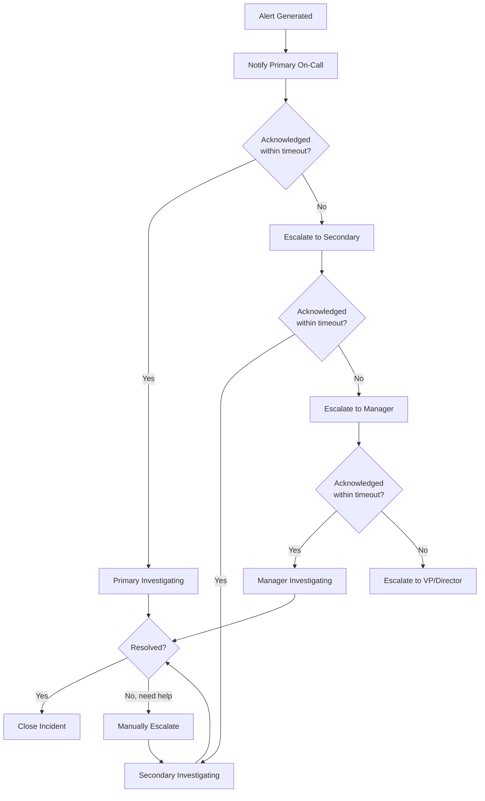
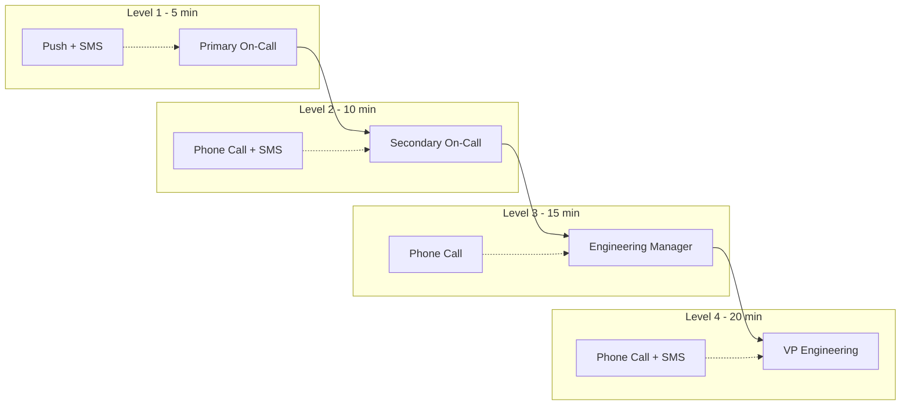
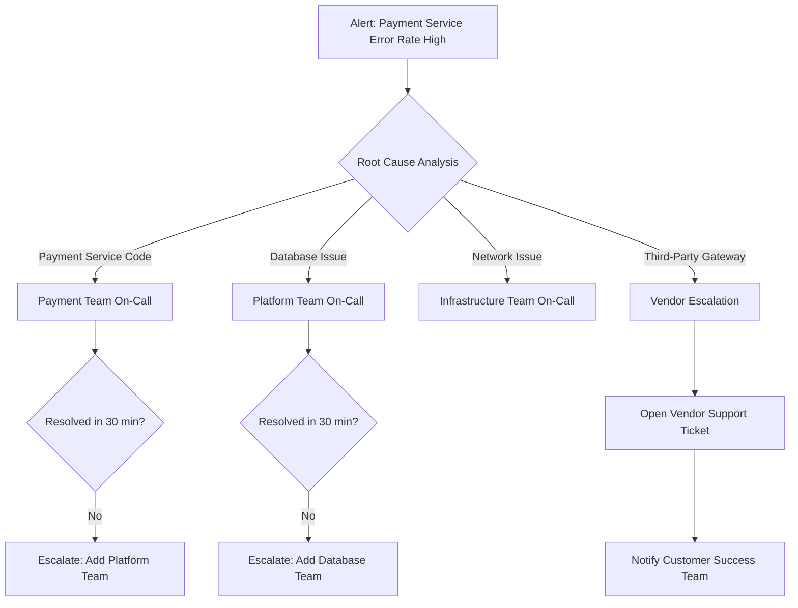

# Escalation Policies

## Why It Exists

An alert fires. Nobody responds. Why? Maybe the on-call engineer's phone was on silent. Maybe they stepped away during their shift. Maybe they're already drowning in another incident and didn't see this one. Without an escalation policy, a missed alert becomes a missed incident becomes a customer-facing outage that nobody addresses until someone tweets about it.

Escalation policies solve the reliability gap between "alert sent" and "human acting on it." They define a deterministic chain: if Person A doesn't respond in X minutes, page Person B. If Person B doesn't respond, page Manager C. If nobody responds, page the VP. The chain ensures that every alert eventually reaches someone who will act.

### The Mathematics of Reliability

If a single on-call engineer has a 95% probability of responding to a page within 5 minutes (accounting for sleep, bathroom breaks, dropped signal, etc.), then over a month with 10 critical incidents:

$$
P(\text{all incidents responded}) = 0.95^{10} = 0.599
$$

Only a 60% chance of responding to all incidents. With a two-tier escalation (primary + secondary), each with 95% response rate:

$$
P(\text{at least one responds}) = 1 - (1 - 0.95)^2 = 0.9975
$$

With three tiers:

$$
P(\text{at least one responds}) = 1 - (0.05)^3 = 0.999875
$$

This is why escalation policies exist - they provide defense-in-depth for human reliability.

## First Principles

### Escalation as a Feedback Loop

An escalation policy is a closed-loop control system:



### Key Design Principles

1. **Bounded latency**: Every escalation level has a maximum wait time. The total worst-case response time is the sum of all timeouts, which must be less than the SLA for that severity.

2. **Separation of concerns**: Primary responder handles triage. Secondary provides backup and expertise. Managers handle communication and resource allocation, not debugging.

3. **Notification diversity**: Each level should use different notification channels. If the primary on-call's phone is off, SMS to the secondary won't help if they're in the same room. Use different modalities: push notification, phone call, SMS, Slack.

4. **Symmetry**: Primary and secondary on-call should have equivalent access, permissions, and tools. An escalation should never fail because the secondary doesn't have access to the production dashboard.

## Core Mechanics

### Escalation Policy Structure



### PagerDuty Escalation Model

PagerDuty's escalation works through these concepts:

| Concept | Description |
|---------|------------|
| **Service** | The monitored system (e.g., "API Gateway Production") |
| **Escalation Policy** | The chain of people to notify for a service |
| **Escalation Level** | One tier in the chain (who to notify) |
| **Schedule** | Who is on-call at any given time |
| **Override** | Temporary change to the schedule |
| **Acknowledgement** | Responder confirms they're looking at the incident |
| **Resolution** | Incident is fixed |
| **Reassignment** | Responder transfers to someone else |

### OpsGenie Escalation Model

OpsGenie uses a similar but distinct model:

| Concept | Description |
|---------|------------|
| **Team** | Group of engineers responsible for a service |
| **Routing Rule** | Determines which escalation policy based on alert properties |
| **Escalation** | Time-based chain with multiple steps |
| **Schedule Rotation** | Defines on-call schedule within a team |
| **Notification Rule** | Per-user preferences for how they want to be contacted |
| **Integration** | Source of alerts (Prometheus, Datadog, etc.) |

## Implementation

### PagerDuty Configuration via Terraform

```typescript
// pagerduty-escalation-config.ts
// Generates Terraform configuration for PagerDuty escalation policies

interface PagerDutyUser {
  id: string;
  name: string;
  email: string;
  role: 'responder' | 'manager' | 'stakeholder';
  notificationRules: Array<{
    type: 'sms' | 'phone' | 'push' | 'email';
    delayMinutes: number;
    contactMethodId: string;
  }>;
}

interface ScheduleLayer {
  name: string;
  rotationType: 'daily' | 'weekly' | 'custom';
  handoffTime: string; // HH:MM in UTC
  handoffDay?: 'monday' | 'tuesday' | 'wednesday' | 'thursday' | 'friday';
  users: string[]; // user IDs
  restrictions?: Array<{
    type: 'daily_restriction';
    startTime: string;
    endTime: string;
    startDay?: number;
    endDay?: number;
  }>;
}

interface EscalationLevel {
  delayMinutes: number;
  targets: Array<{
    type: 'schedule' | 'user';
    id: string;
  }>;
}

interface EscalationPolicyConfig {
  name: string;
  description: string;
  numLoops: number; // How many times to repeat the entire escalation chain
  levels: EscalationLevel[];
  services: string[];
}

class PagerDutyConfigGenerator {
  private users: Map<string, PagerDutyUser> = new Map();
  private schedules: Map<string, ScheduleLayer[]> = new Map();
  private policies: EscalationPolicyConfig[] = [];

  addUser(user: PagerDutyUser): this {
    this.users.set(user.id, user);
    return this;
  }

  addSchedule(name: string, layers: ScheduleLayer[]): this {
    this.schedules.set(name, layers);
    return this;
  }

  addEscalationPolicy(policy: EscalationPolicyConfig): this {
    this.policies.push(policy);
    return this;
  }

  generateTerraform(): string {
    let tf = '';

    // Generate schedule resources
    for (const [name, layers] of this.schedules) {
      tf += this.generateScheduleTf(name, layers);
    }

    // Generate escalation policy resources
    for (const policy of this.policies) {
      tf += this.generateEscalationPolicyTf(policy);
    }

    return tf;
  }

  private generateScheduleTf(name: string, layers: ScheduleLayer[]): string {
    const resourceName = name.replace(/[^a-zA-Z0-9]/g, '_').toLowerCase();

    let tf = `
resource "pagerduty_schedule" "${resourceName}" {
  name      = "${name}"
  time_zone = "UTC"

`;

    for (let i = 0; i < layers.length; i++) {
      const layer = layers[i];
      tf += `  layer {
    name                         = "${layer.name}"
    start                        = "2024-01-01T${layer.handoffTime}:00Z"
    rotation_virtual_start       = "2024-01-01T${layer.handoffTime}:00Z"
    rotation_turn_length_seconds = ${this.getRotationSeconds(layer.rotationType)}
    users                        = [${layer.users.map((u) => `"${u}"`).join(', ')}]
`;

      if (layer.restrictions) {
        for (const restriction of layer.restrictions) {
          tf += `
    restriction {
      type              = "${restriction.type}"
      start_time_of_day = "${restriction.startTime}"
      duration_seconds  = ${this.getDurationSeconds(restriction.startTime, restriction.endTime)}
    }
`;
        }
      }

      tf += '  }\n\n';
    }

    tf += '}\n\n';
    return tf;
  }

  private generateEscalationPolicyTf(
    policy: EscalationPolicyConfig
  ): string {
    const resourceName = policy.name
      .replace(/[^a-zA-Z0-9]/g, '_')
      .toLowerCase();

    let tf = `
resource "pagerduty_escalation_policy" "${resourceName}" {
  name      = "${policy.name}"
  num_loops = ${policy.numLoops}

`;

    for (const level of policy.levels) {
      tf += `  rule {
    escalation_delay_in_minutes = ${level.delayMinutes}
`;

      for (const target of level.targets) {
        if (target.type === 'schedule') {
          tf += `    target {
      type = "schedule_reference"
      id   = pagerduty_schedule.${target.id.replace(/[^a-zA-Z0-9]/g, '_').toLowerCase()}.id
    }
`;
        } else {
          tf += `    target {
      type = "user_reference"
      id   = "${target.id}"
    }
`;
        }
      }

      tf += '  }\n\n';
    }

    tf += '}\n\n';
    return tf;
  }

  private getRotationSeconds(type: string): number {
    switch (type) {
      case 'daily': return 86400;
      case 'weekly': return 604800;
      default: return 86400;
    }
  }

  private getDurationSeconds(start: string, end: string): number {
    const [sh, sm] = start.split(':').map(Number);
    const [eh, em] = end.split(':').map(Number);
    let duration = (eh * 60 + em) - (sh * 60 + sm);
    if (duration < 0) duration += 24 * 60;
    return duration * 60;
  }

  /**
   * Validate the configuration for common mistakes
   */
  validate(): string[] {
    const errors: string[] = [];

    for (const policy of this.policies) {
      // Check for minimum 2 escalation levels
      if (policy.levels.length < 2) {
        errors.push(`${policy.name}: fewer than 2 escalation levels`);
      }

      // Check total escalation time is reasonable
      const totalMinutes = policy.levels.reduce(
        (sum, l) => sum + l.delayMinutes,
        0
      );
      if (totalMinutes > 60) {
        errors.push(
          `${policy.name}: total escalation time ${totalMinutes}min exceeds 60min`
        );
      }

      // Check first level delay is appropriate
      if (policy.levels[0]?.delayMinutes > 10) {
        errors.push(
          `${policy.name}: first level delay ${policy.levels[0].delayMinutes}min is too long`
        );
      }

      // Check for single points of failure
      for (const level of policy.levels) {
        if (
          level.targets.length === 1 &&
          level.targets[0].type === 'user'
        ) {
          errors.push(
            `${policy.name}: level has single user target - no redundancy`
          );
        }
      }
    }

    return errors;
  }
}

// --- Example Configuration ---

const generator = new PagerDutyConfigGenerator();

// Define on-call schedule
generator.addSchedule('platform-primary', [
  {
    name: 'Weekday Primary',
    rotationType: 'weekly',
    handoffTime: '09:00',
    handoffDay: 'monday',
    users: ['user_alice', 'user_bob', 'user_charlie', 'user_diana'],
    restrictions: [
      {
        type: 'daily_restriction',
        startTime: '09:00',
        endTime: '09:00', // 24h
      },
    ],
  },
]);

generator.addSchedule('platform-secondary', [
  {
    name: 'Weekday Secondary',
    rotationType: 'weekly',
    handoffTime: '09:00',
    handoffDay: 'monday',
    users: ['user_diana', 'user_alice', 'user_bob', 'user_charlie'],
  },
]);

// Define escalation policy
generator.addEscalationPolicy({
  name: 'Platform Team Critical',
  description: 'Escalation for platform team P0/P1 incidents',
  numLoops: 2,
  levels: [
    {
      delayMinutes: 5,
      targets: [
        { type: 'schedule', id: 'platform-primary' },
      ],
    },
    {
      delayMinutes: 10,
      targets: [
        { type: 'schedule', id: 'platform-secondary' },
      ],
    },
    {
      delayMinutes: 15,
      targets: [
        { type: 'user', id: 'user_engineering_manager' },
      ],
    },
  ],
  services: ['api-gateway', 'auth-service', 'payment-service'],
});

console.log(generator.generateTerraform());
const errors = generator.validate();
if (errors.length > 0) {
  console.error('Validation errors:', errors);
}
```

### Intelligent Escalation Router

```typescript
interface EscalationContext {
  alertName: string;
  severity: 'P0' | 'P1' | 'P2' | 'P3' | 'P4';
  service: string;
  labels: Record<string, string>;
  startedAt: Date;
  acknowledgedBy?: string;
  currentLevel: number;
  previousIncidents: Array<{
    service: string;
    resolvedBy: string;
    resolutionTime: number; // minutes
    rootCause: string;
  }>;
}

interface EscalationDecision {
  action: 'wait' | 'escalate' | 'page_specialist' | 'trigger_war_room';
  target?: string;
  reason: string;
  estimatedResponseTime: number; // minutes
}

class IntelligentEscalationRouter {
  private specialistRegistry: Map<string, string[]> = new Map();
  private responseHistory: Map<string, number[]> = new Map();

  registerSpecialist(domain: string, userIds: string[]): void {
    this.specialistRegistry.set(domain, userIds);
  }

  recordResponse(userId: string, responseTimeMinutes: number): void {
    const history = this.responseHistory.get(userId) ?? [];
    history.push(responseTimeMinutes);
    // Keep last 50 response times
    if (history.length > 50) history.shift();
    this.responseHistory.set(userId, history);
  }

  decide(context: EscalationContext): EscalationDecision {
    const elapsedMinutes =
      (Date.now() - context.startedAt.getTime()) / 60_000;

    // P0 with no acknowledgment after 10 minutes: war room
    if (context.severity === 'P0' && !context.acknowledgedBy && elapsedMinutes > 10) {
      return {
        action: 'trigger_war_room',
        reason: 'P0 unacknowledged for 10+ minutes',
        estimatedResponseTime: 5,
      };
    }

    // Check if a specialist would be more effective
    const specialist = this.findBestSpecialist(context);
    if (specialist && elapsedMinutes > 15 && context.acknowledgedBy) {
      return {
        action: 'page_specialist',
        target: specialist,
        reason: `Specialist in ${this.inferDomain(context)} available`,
        estimatedResponseTime: this.getEstimatedResponseTime(specialist),
      };
    }

    // Standard escalation
    if (!context.acknowledgedBy) {
      const timeoutMinutes = this.getEscalationTimeout(context.severity, context.currentLevel);
      if (elapsedMinutes > timeoutMinutes) {
        return {
          action: 'escalate',
          reason: `No acknowledgment after ${Math.round(elapsedMinutes)} minutes`,
          estimatedResponseTime: timeoutMinutes,
        };
      }
    }

    return {
      action: 'wait',
      reason: 'Within normal response window',
      estimatedResponseTime: this.getEscalationTimeout(context.severity, context.currentLevel) - elapsedMinutes,
    };
  }

  private findBestSpecialist(context: EscalationContext): string | null {
    const domain = this.inferDomain(context);
    const specialists = this.specialistRegistry.get(domain);
    if (!specialists || specialists.length === 0) return null;

    // Sort by average response time
    return specialists.sort((a, b) => {
      return this.getEstimatedResponseTime(a) - this.getEstimatedResponseTime(b);
    })[0];
  }

  private inferDomain(context: EscalationContext): string {
    // Look at previous similar incidents to determine domain
    const similarIncidents = context.previousIncidents.filter(
      (i) => i.service === context.service
    );

    if (similarIncidents.length > 0) {
      // Most common root cause category
      const causes = similarIncidents.map((i) => i.rootCause);
      const counts = new Map<string, number>();
      for (const cause of causes) {
        counts.set(cause, (counts.get(cause) ?? 0) + 1);
      }
      let maxCause = '';
      let maxCount = 0;
      for (const [cause, count] of counts) {
        if (count > maxCount) {
          maxCause = cause;
          maxCount = count;
        }
      }
      return maxCause;
    }

    // Infer from labels
    if (context.labels.component === 'database') return 'database';
    if (context.labels.component === 'network') return 'networking';
    if (context.labels.component === 'kubernetes') return 'infrastructure';

    return context.service;
  }

  private getEstimatedResponseTime(userId: string): number {
    const history = this.responseHistory.get(userId);
    if (!history || history.length === 0) return 10; // default

    // Use median response time
    const sorted = [...history].sort((a, b) => a - b);
    return sorted[Math.floor(sorted.length / 2)];
  }

  private getEscalationTimeout(severity: string, level: number): number {
    const timeouts: Record<string, number[]> = {
      P0: [5, 10, 15, 20],
      P1: [10, 15, 30, 60],
      P2: [30, 60, 120, 240],
      P3: [60, 240, 480, 1440],
      P4: [480, 1440, 2880, 10080],
    };

    const levels = timeouts[severity] ?? timeouts.P3;
    return levels[Math.min(level, levels.length - 1)];
  }
}
```

### On-Call Schedule Builder

```typescript
interface ScheduleConfig {
  teamName: string;
  members: string[];
  rotationType: 'weekly' | 'biweekly' | 'daily';
  handoffDay: number; // 0=Sunday, 1=Monday, etc.
  handoffHour: number; // 0-23
  timezone: string;
  excludeDates: string[]; // ISO dates (holidays)
  restrictions: Array<{
    type: 'business_hours' | 'after_hours' | 'weekend';
    overrideMembers?: string[]; // Different pool for this restriction
  }>;
}

interface ScheduleEntry {
  userId: string;
  startTime: Date;
  endTime: Date;
  type: 'primary' | 'secondary' | 'override';
}

class ScheduleBuilder {
  private config: ScheduleConfig;

  constructor(config: ScheduleConfig) {
    this.config = config;
  }

  /**
   * Generate schedule entries for a given date range
   */
  generateSchedule(startDate: Date, endDate: Date): ScheduleEntry[] {
    const entries: ScheduleEntry[] = [];
    const rotationDays = this.config.rotationType === 'weekly' ? 7 : 14;
    let currentDate = new Date(startDate);
    let memberIndex = 0;

    while (currentDate < endDate) {
      const rotationEnd = new Date(currentDate);
      rotationEnd.setDate(rotationEnd.getDate() + rotationDays);

      // Primary on-call
      entries.push({
        userId: this.config.members[memberIndex % this.config.members.length],
        startTime: new Date(currentDate),
        endTime: new Date(rotationEnd),
        type: 'primary',
      });

      // Secondary on-call (next person in rotation)
      entries.push({
        userId: this.config.members[(memberIndex + 1) % this.config.members.length],
        startTime: new Date(currentDate),
        endTime: new Date(rotationEnd),
        type: 'secondary',
      });

      memberIndex++;
      currentDate = rotationEnd;
    }

    return entries;
  }

  /**
   * Check for fairness in on-call distribution
   */
  analyzeDistribution(entries: ScheduleEntry[]): Map<string, {
    totalHours: number;
    weekendHours: number;
    holidayHours: number;
    primaryShifts: number;
    secondaryShifts: number;
  }> {
    const stats = new Map<string, {
      totalHours: number;
      weekendHours: number;
      holidayHours: number;
      primaryShifts: number;
      secondaryShifts: number;
    }>();

    for (const entry of entries) {
      const existing = stats.get(entry.userId) ?? {
        totalHours: 0,
        weekendHours: 0,
        holidayHours: 0,
        primaryShifts: 0,
        secondaryShifts: 0,
      };

      const hours =
        (entry.endTime.getTime() - entry.startTime.getTime()) / 3_600_000;
      existing.totalHours += hours;

      if (entry.type === 'primary') existing.primaryShifts++;
      else existing.secondaryShifts++;

      // Count weekend hours
      const weekendHours = this.countWeekendHours(
        entry.startTime,
        entry.endTime
      );
      existing.weekendHours += weekendHours;

      // Count holiday hours
      const holidayHours = this.countHolidayHours(
        entry.startTime,
        entry.endTime
      );
      existing.holidayHours += holidayHours;

      stats.set(entry.userId, existing);
    }

    return stats;
  }

  private countWeekendHours(start: Date, end: Date): number {
    let hours = 0;
    const current = new Date(start);

    while (current < end) {
      const day = current.getDay();
      if (day === 0 || day === 6) {
        hours++;
      }
      current.setHours(current.getHours() + 1);
    }

    return hours;
  }

  private countHolidayHours(start: Date, end: Date): number {
    let hours = 0;
    const current = new Date(start);
    const holidays = new Set(this.config.excludeDates);

    while (current < end) {
      const dateStr = current.toISOString().split('T')[0];
      if (holidays.has(dateStr)) {
        hours++;
      }
      current.setHours(current.getHours() + 1);
    }

    return hours;
  }
}
```

## Edge Cases and Failure Modes

### 1. The Circular Escalation

If the primary and secondary on-call are the same person (due to a scheduling error), escalation level 2 notifies someone who is already looking at the alert. This wastes an escalation step.

**Prevention**: Validation rule that checks no user appears in two consecutive escalation levels during the same time period.

### 2. Timezone Handoff Gaps

Team A hands off at 5 PM PST. Team B picks up at 9 AM IST. There is no overlap. An incident at 5:01 PM PST has no on-call coverage.

**Prevention**: Follow-the-sun schedules must have at least 1 hour overlap, and the handoff protocol requires the outgoing on-call to not leave until the incoming confirms they are ready.

### 3. Escalation During Maintenance Window

A planned maintenance creates expected alerts. The escalation policy dutifully pages through all levels for expected behavior.

**Solution**: Integrate maintenance windows into the escalation system:

```typescript
interface MaintenanceWindow {
  id: string;
  services: string[];
  startTime: Date;
  endTime: Date;
  suppressedAlerts: string[]; // Alert name patterns
  onCallOverride?: string; // Specific person for maintenance issues
}

function shouldEscalate(
  alert: { name: string; service: string; firedAt: Date },
  maintenanceWindows: MaintenanceWindow[]
): boolean {
  for (const window of maintenanceWindows) {
    if (
      alert.firedAt >= window.startTime &&
      alert.firedAt <= window.endTime &&
      window.services.includes(alert.service)
    ) {
      // Check if this alert is suppressed during maintenance
      for (const pattern of window.suppressedAlerts) {
        if (new RegExp(pattern).test(alert.name)) {
          return false; // Don't escalate expected alerts
        }
      }
    }
  }
  return true;
}
```

::: warning Common Escalation Mistakes
1. **Too many levels**: More than 4 escalation levels adds complexity without value. By level 4, the incident should be a war room.
2. **Equal delays at all levels**: The first escalation should be fast (5 min). Later levels can wait longer (10-15 min) because the severity of non-response increases.
3. **Escalation without context**: Each level should receive all context accumulated by previous levels, not just the original alert.
4. **No loop limit**: Without `num_loops`, an unacknowledged alert can page indefinitely, burning through the entire team's sleep.
5. **Hardcoded users instead of schedules**: Using specific users instead of schedule references means the escalation breaks when someone goes on vacation.
:::

## Performance Characteristics

### Escalation Latency Budget

For a P0 incident with a 15-minute response SLA:

| Phase | Budget | Cumulative |
|-------|--------|-----------|
| Alert evaluation + delivery | 30s | 0:30 |
| Level 1 notification timeout | 5 min | 5:30 |
| Level 2 notification timeout | 5 min | 10:30 |
| Level 3 notification + response | 4.5 min | 15:00 |

This means you can afford 3 escalation levels within a 15-minute SLA, assuming 30 seconds for alert pipeline latency.

### Notification Delivery Reliability

| Channel | Delivery Rate | Median Latency | P99 Latency |
|---------|--------------|---------------|-------------|
| Push notification | 98.5% | 2s | 30s |
| SMS | 99.2% | 5s | 60s |
| Phone call | 99.8% | 3s | 15s |
| Slack/Teams | 99.9% | 1s | 10s |
| Email | 99.5% | 30s | 300s |

Multi-channel notification at each level (push + SMS + phone) increases effective delivery rate:

$$
P(\text{delivered}) = 1 - \prod_{i=1}^{n} (1 - p_i)
$$

For push (98.5%) + SMS (99.2%) + phone (99.8%):

$$
P(\text{delivered}) = 1 - (0.015)(0.008)(0.002) = 0.99999976 \approx 99.99998\%
$$

## Mathematical Foundations

### Markov Chain Model of Escalation

Model the escalation process as a Markov chain with states: {Unacknowledged at Level $i$, Acknowledged, Resolved, Missed}

Transition probabilities:

$$
P = \begin{bmatrix}
0 & p_1 & 0 & 1-p_1-q_1 & q_1 \\
0 & 0 & p_2 & 1-p_2-q_2 & q_2 \\
0 & 0 & 0 & 1-p_3 & p_3 \\
0 & 0 & 0 & 1 & 0 \\
0 & 0 & 0 & 0 & 1
\end{bmatrix}
$$

Where $p_i$ is the probability of acknowledgment at level $i$ and $q_i$ is the probability of escalation to the next level (which equals $1 - p_i$ minus the probability of the alert being resolved by the system).

The expected number of escalation steps before acknowledgment:

$$
E[\text{steps}] = \sum_{i=1}^{n} i \cdot p_i \prod_{j=1}^{i-1}(1-p_j)
$$

## Real-World War Stories

::: info War Story
**The Infinite Escalation Loop (2020)**

A company set `num_loops: 0` in their PagerDuty escalation policy, meaning "loop forever." During a weekend when the primary on-call was hiking (no cell service), secondary was at a concert (phone on silent), and the manager was on a flight, the escalation policy looped 47 times over 4 hours. Each loop sent notifications to all three, resulting in 141 total pages. When the primary finally got service, they had 47 missed calls, 47 SMS messages, and 47 push notifications. They assumed the system was broken and ignored all of them.

The actual incident (a database running out of disk) self-resolved when a log rotation job freed space, but only after 3 hours of degraded service.

**Fix**: Set `num_loops: 3` and added a fourth escalation level that pages the VP and triggers an automated incident bridge call.
:::

::: info War Story
**The Follow-the-Sun Gap (2022)**

A global company had three on-call regions: US Pacific, EU, and APAC. The schedule was designed for 8-hour shifts with handoffs at 8 AM local time. The math worked on paper, but in practice:
- US Pacific 8 AM = 4 PM UTC
- EU 8 AM = 8 AM UTC
- APAC 8 AM = 0 AM UTC (midnight)

The APAC team's handoff at midnight UTC overlapped with nobody, creating a gap from midnight to 8 AM UTC (8 hours!). During this window, a redis cluster failure went unnoticed for 2 hours.

**Fix**: Shifted all handoffs to overlap by 1 hour, and added a "golden hour" schedule layer where a designated senior engineer covers the transition period.
:::

## Decision Framework

### Choosing Escalation Timeouts

| Factor | Shorter Timeout (3-5 min) | Longer Timeout (10-15 min) |
|--------|--------------------------|--------------------------|
| **Severity** | P0 - Critical | P2/P3 - Moderate/Minor |
| **Business hours** | Less critical (people available) | After hours (give time to wake up) |
| **Team size** | Large team (others available) | Small team (fewer backup options) |
| **Alert confidence** | High (validated, real impact) | Medium (may self-resolve) |
| **Customer impact** | Direct, immediate | Indirect, delayed |

### Escalation Policy Templates

**Small Team (3-5 engineers)**:
- Level 1: Primary on-call (5 min)
- Level 2: All team members simultaneously (10 min)
- Level 3: Engineering manager (15 min)
- Loops: 2

**Medium Team (6-15 engineers)**:
- Level 1: Primary on-call (5 min)
- Level 2: Secondary on-call (10 min)
- Level 3: Team lead (15 min)
- Level 4: Engineering manager (20 min)
- Loops: 2

**Large Organization (multiple teams)**:
- Level 1: Service team primary on-call (5 min)
- Level 2: Service team secondary on-call (10 min)
- Level 3: Platform team on-call (15 min, for infrastructure issues)
- Level 4: Engineering manager of affected service (20 min)
- Level 5: VP of Engineering (25 min)
- Loops: 1

## Advanced Topics

### Predictive Escalation

Instead of waiting for timeouts, predict whether the current responder will acknowledge based on historical patterns:

```typescript
interface ResponderProfile {
  userId: string;
  avgResponseTimeMinutes: number;
  responseRateByHour: Map<number, number>; // hour -> response probability
  currentStatus: 'active' | 'dnd' | 'offline' | 'unknown';
  lastActivityTimestamp: Date;
}

function predictResponseProbability(
  profile: ResponderProfile,
  currentHour: number
): number {
  const hourlyRate = profile.responseRateByHour.get(currentHour) ?? 0.5;

  // Adjust for current status
  let statusMultiplier = 1.0;
  switch (profile.currentStatus) {
    case 'active': statusMultiplier = 1.2; break;
    case 'dnd': statusMultiplier = 0.3; break;
    case 'offline': statusMultiplier = 0.1; break;
    case 'unknown': statusMultiplier = 0.7; break;
  }

  // Adjust for time since last activity
  const minutesSinceActivity =
    (Date.now() - profile.lastActivityTimestamp.getTime()) / 60_000;
  const activityDecay = Math.exp(-minutesSinceActivity / 120); // 2-hour half-life

  return Math.min(1, hourlyRate * statusMultiplier * (0.5 + 0.5 * activityDecay));
}

/**
 * Pre-emptively escalate if the primary is unlikely to respond,
 * rather than waiting for the full timeout.
 */
function shouldPreemptivelyEscalate(
  primary: ResponderProfile,
  secondary: ResponderProfile,
  currentHour: number,
  severityTimeoutMinutes: number
): boolean {
  const primaryProbability = predictResponseProbability(primary, currentHour);
  const secondaryProbability = predictResponseProbability(secondary, currentHour);

  // If primary is unlikely to respond AND secondary is more likely
  if (primaryProbability < 0.3 && secondaryProbability > 0.7) {
    return true;
  }

  // If primary response time typically exceeds half the timeout
  if (primary.avgResponseTimeMinutes > severityTimeoutMinutes * 0.5) {
    return true;
  }

  return false;
}
```

### Cross-Team Escalation for Shared Dependencies



## Cross-References

- [Severity Levels](./severity-levels.md) - How severity drives escalation timing
- [On-Call Best Practices](./on-call-best-practices.md) - Designing sustainable rotations that feed into escalation
- [War Room Procedures](../incident-response/war-room-procedures.md) - What happens when escalation triggers a war room
- [Runbook Templates](./runbook-templates.md) - The instructions each escalation level follows
- [Alert Design](./alert-design.md) - Designing alerts that provide enough context for each escalation level
