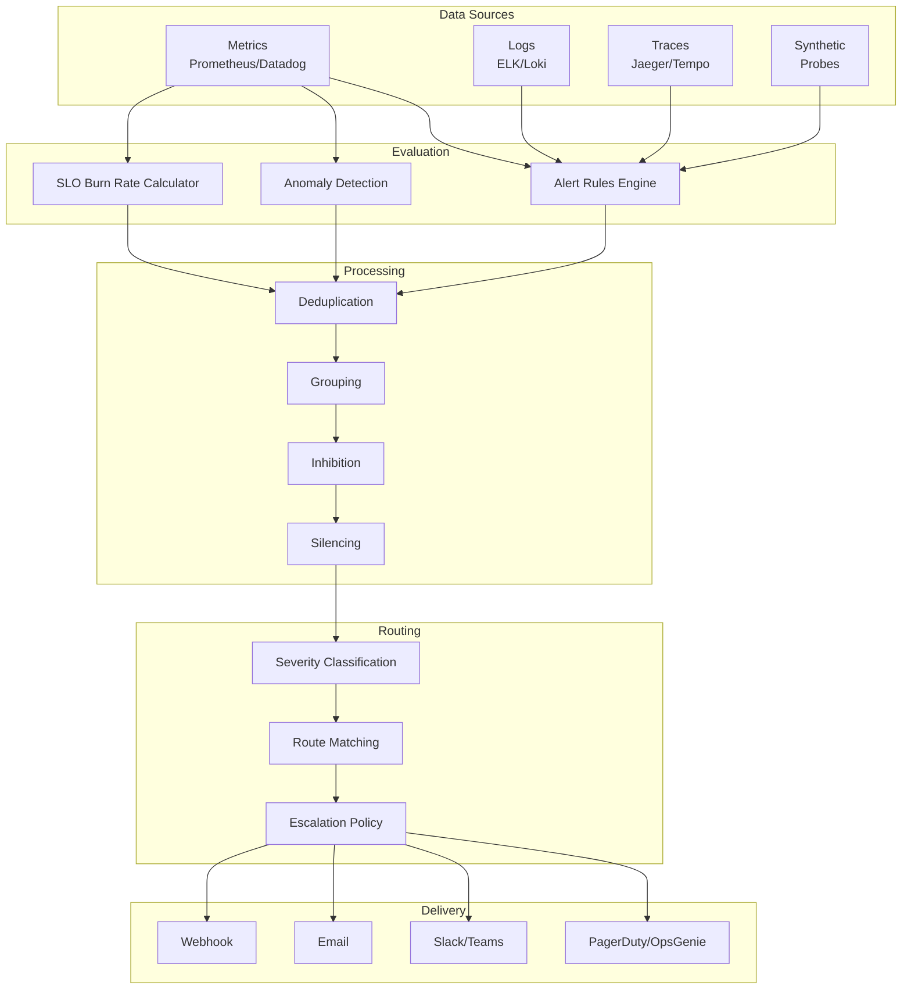
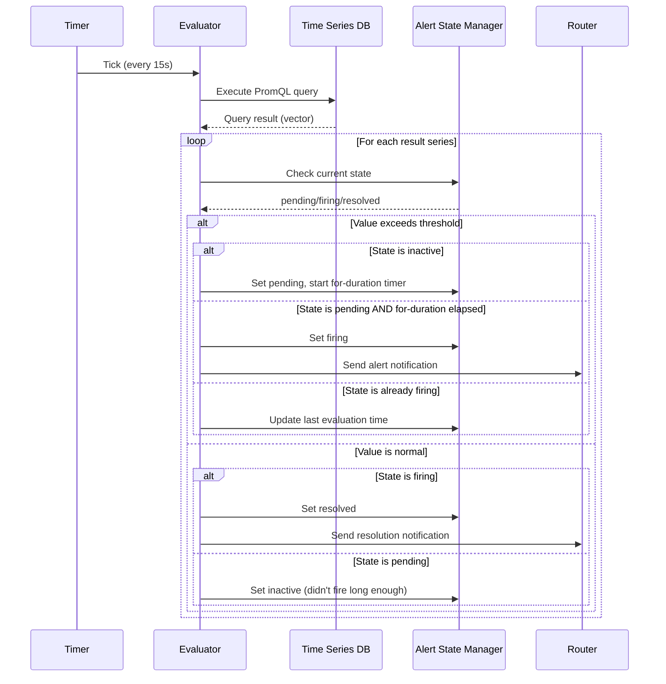
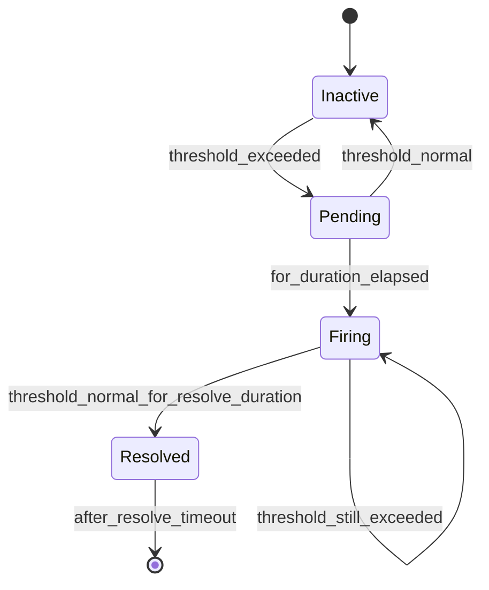
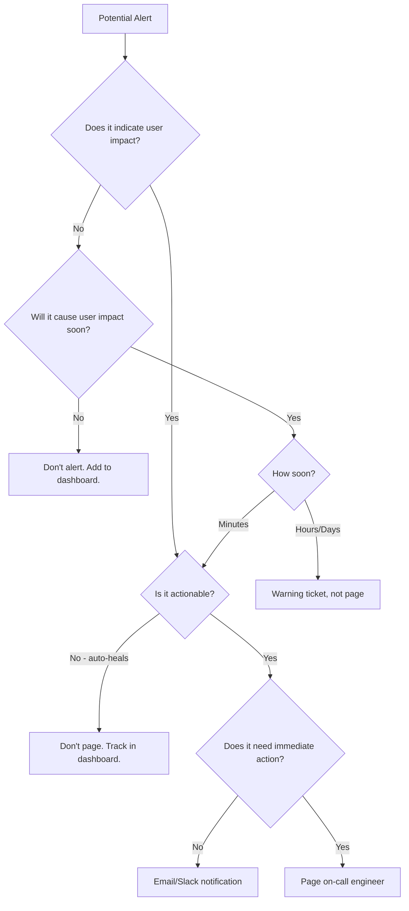

# Alerting

## Why It Exists

Monitoring tells you what is happening. Alerting tells you when you need to care. The fundamental problem alerting solves is bridging the gap between system telemetry and human action. Without alerting, you would need humans staring at dashboards 24/7 - which is both unsustainable and ineffective. The human visual system is terrible at detecting gradual degradation across dozens of metrics.

The history of alerting follows the evolution of systems complexity:

1. **Manual checks era (1970s-1990s)**: Operators checked system health via terminal commands (`uptime`, `df`, `top`). Alerts were threshold checks in cron jobs that sent emails.
2. **Nagios era (1999-2010)**: Centralized check-based monitoring. Host/service status checks with escalation. Worked for static infrastructure.
3. **Metric-based era (2010-2018)**: Prometheus, Graphite, Datadog. Time-series queries replacing binary up/down checks. Enabled rate-of-change and trend-based alerts.
4. **SLO-based era (2018-present)**: Google SRE book popularized error budgets and multi-window burn-rate alerting. Focus shifted from "is the server up?" to "is the user experience degraded?"
5. **AI-assisted era (2024+)**: Anomaly detection, automatic correlation, intelligent routing. Still emerging and not replacing fundamentals.

### The Cost of Bad Alerting

Bad alerting is worse than no alerting. The consequences:

| Problem | Impact | Cost |
|---------|--------|------|
| **Alert fatigue** | Engineers ignore alerts, miss real incidents | Mean Time to Detect (MTTD) increases 300-500% |
| **Missing alerts** | Incidents discovered by customers | Revenue loss, reputation damage |
| **Poorly routed alerts** | Wrong person paged, delays triage | MTTR increases by escalation time |
| **No context** | Engineer paged without enough info to act | 15-30 min wasted per page gathering context |
| **Flapping alerts** | Alert fires and resolves repeatedly | Trains engineers to dismiss all alerts |

Google's SRE team found that teams with more than 2 pages per on-call shift that require no action (false positives) see a 40% increase in attrition for on-call participants.

## First Principles

### The Signal Detection Theory of Alerting

Alerting is fundamentally a classification problem. Every moment in time, your system is in one of two states: **needs attention** or **operating normally**. Your alerting system classifies these moments, and like any classifier, it has four outcomes:

```
                    Actual State
                    Needs Action    Normal
Alert     Fires    True Positive   False Positive
          Silent   False Negative  True Negative
```

The goal is to maximize true positives and true negatives while minimizing false positives (noise) and false negatives (missed incidents).

### Precision vs. Recall Trade-off

$$
\text{Precision} = \frac{\text{True Positives}}{\text{True Positives} + \text{False Positives}}
$$

$$
\text{Recall} = \frac{\text{True Positives}}{\text{True Positives} + \text{False Negatives}}
$$

For alerting:
- **High precision** = every alert requires action (low noise)
- **High recall** = every incident triggers an alert (nothing missed)

You cannot maximize both simultaneously. The optimal trade-off depends on the cost of each type of error:

$$
\text{Expected Cost} = C_{FP} \cdot P(FP) + C_{FN} \cdot P(FN)
$$

Where $C_{FP}$ is the cost of a false positive (engineer interrupted, context switch) and $C_{FN}$ is the cost of a false negative (undetected outage, customer impact).

For a high-revenue e-commerce site:
- $C_{FP} \approx \$200$ (30 min of engineer time + context switch cost)
- $C_{FN} \approx \$50{,}000$ (1 hour of undetected downtime for a $50M ARR service)

This means you should tolerate a false positive ratio up to $50{,}000 / 200 = 250:1$ before the noise cost exceeds the miss cost. In practice, alert fatigue sets in much earlier (around 5:1), so you need to optimize aggressively for precision.

### The Three Properties of Good Alerts

Every alert should have these three properties. If any is missing, the alert should not exist:

1. **Actionable**: A human can take a specific action in response to this alert. If the only action is "acknowledge and wait," it should be a notification, not a page.
2. **Urgent**: The action must be taken within the on-call response window (typically 5-15 minutes). If it can wait until business hours, it should not page.
3. **Real**: The alert indicates an actual problem that affects users or will affect users imminently. If it fires during normal operation, it is misconfigured.

## Core Mechanics

### Alerting Pipeline Architecture



### Alert Rule Evaluation

Alert rules are evaluated at regular intervals (typically 15-60 seconds). The evaluation cycle:



### Alert State Machine



The `for` duration prevents transient spikes from triggering alerts. The resolve duration prevents flapping (briefly normal before failing again).

## Implementation

### Prometheus Alerting Rules in TypeScript Config Generator

```typescript
interface AlertRule {
  name: string;
  expression: string;
  forDuration: string;
  severity: 'critical' | 'warning' | 'info';
  summary: string;
  description: string;
  runbookUrl: string;
  labels?: Record<string, string>;
  annotations?: Record<string, string>;
}

interface AlertGroup {
  name: string;
  rules: AlertRule[];
  interval?: string;
}

class AlertRuleBuilder {
  private groups: Map<string, AlertGroup> = new Map();

  addGroup(name: string, interval?: string): this {
    this.groups.set(name, { name, rules: [], interval });
    return this;
  }

  addRule(groupName: string, rule: AlertRule): this {
    const group = this.groups.get(groupName);
    if (!group) throw new Error(`Group ${groupName} not found`);
    group.rules.push(rule);
    return this;
  }

  /**
   * Generate Prometheus alerting rules YAML
   */
  toYaml(): string {
    const groups = Array.from(this.groups.values());

    let yaml = 'groups:\n';
    for (const group of groups) {
      yaml += `  - name: ${group.name}\n`;
      if (group.interval) {
        yaml += `    interval: ${group.interval}\n`;
      }
      yaml += '    rules:\n';

      for (const rule of group.rules) {
        yaml += `      - alert: ${rule.name}\n`;
        yaml += `        expr: ${rule.expression}\n`;
        yaml += `        for: ${rule.forDuration}\n`;
        yaml += '        labels:\n';
        yaml += `          severity: ${rule.severity}\n`;
        if (rule.labels) {
          for (const [k, v] of Object.entries(rule.labels)) {
            yaml += `          ${k}: "${v}"\n`;
          }
        }
        yaml += '        annotations:\n';
        yaml += `          summary: "${rule.summary}"\n`;
        yaml += `          description: "${rule.description}"\n`;
        yaml += `          runbook_url: "${rule.runbookUrl}"\n`;
        if (rule.annotations) {
          for (const [k, v] of Object.entries(rule.annotations)) {
            yaml += `          ${k}: "${v}"\n`;
          }
        }
      }
    }

    return yaml;
  }

  /**
   * Validate all rules for common mistakes
   */
  validate(): string[] {
    const errors: string[] = [];

    for (const group of this.groups.values()) {
      for (const rule of group.rules) {
        // Every alert must have a runbook
        if (!rule.runbookUrl || rule.runbookUrl === '') {
          errors.push(`${rule.name}: missing runbook URL`);
        }

        // Critical alerts should have short for-duration
        if (rule.severity === 'critical') {
          const minutes = this.parseDuration(rule.forDuration);
          if (minutes > 10) {
            errors.push(
              `${rule.name}: critical alert has for-duration > 10m (${rule.forDuration})`
            );
          }
        }

        // Warning alerts shouldn't be too short (causes flapping)
        if (rule.severity === 'warning') {
          const minutes = this.parseDuration(rule.forDuration);
          if (minutes < 5) {
            errors.push(
              `${rule.name}: warning alert has for-duration < 5m (${rule.forDuration}), may cause flapping`
            );
          }
        }

        // Description should include template variables
        if (!rule.description.includes('$')) {
          errors.push(
            `${rule.name}: description has no template variables, consider adding context`
          );
        }
      }
    }

    return errors;
  }

  private parseDuration(duration: string): number {
    const match = duration.match(/^(\d+)([smhd])$/);
    if (!match) return 0;
    const value = parseInt(match[1], 10);
    const unit = match[2];
    switch (unit) {
      case 's': return value / 60;
      case 'm': return value;
      case 'h': return value * 60;
      case 'd': return value * 1440;
      default: return 0;
    }
  }
}

// --- Example: Building standard alert rules ---

const builder = new AlertRuleBuilder();

builder
  .addGroup('slo_alerts', '30s')
  .addRule('slo_alerts', {
    name: 'HighErrorBurnRate',
    expression:
      'sum(rate(http_requests_total{status=~"5.."}[5m])) / sum(rate(http_requests_total[5m])) > 14.4 * 0.001',
    forDuration: '2m',
    severity: 'critical',
    summary: 'High error burn rate detected',
    description:
      'Error burn rate is $value (14.4x budget consumption). At this rate, the monthly error budget will be exhausted in < 1 hour.',
    runbookUrl: 'https://runbooks.example.com/slo/high-error-burn-rate',
  })
  .addRule('slo_alerts', {
    name: 'MediumErrorBurnRate',
    expression:
      'sum(rate(http_requests_total{status=~"5.."}[30m])) / sum(rate(http_requests_total[30m])) > 6 * 0.001',
    forDuration: '15m',
    severity: 'warning',
    summary: 'Medium error burn rate detected',
    description:
      'Error burn rate is $value (6x budget consumption). At this rate, the monthly error budget will be exhausted in < 6 hours.',
    runbookUrl: 'https://runbooks.example.com/slo/medium-error-burn-rate',
  });

builder
  .addGroup('infrastructure_alerts')
  .addRule('infrastructure_alerts', {
    name: 'HighMemoryUsage',
    expression: '(node_memory_MemTotal_bytes - node_memory_MemAvailable_bytes) / node_memory_MemTotal_bytes > 0.9',
    forDuration: '10m',
    severity: 'warning',
    summary: 'High memory usage on $labels.instance',
    description: 'Memory usage is at $value on $labels.instance. OOM killer may trigger.',
    runbookUrl: 'https://runbooks.example.com/infra/high-memory',
  })
  .addRule('infrastructure_alerts', {
    name: 'DiskSpaceCritical',
    expression: '(node_filesystem_avail_bytes / node_filesystem_size_bytes) < 0.05',
    forDuration: '5m',
    severity: 'critical',
    summary: 'Disk space critically low on $labels.instance',
    description: 'Only $value available on $labels.mountpoint at $labels.instance.',
    runbookUrl: 'https://runbooks.example.com/infra/disk-space',
  });

console.log(builder.toYaml());
const errors = builder.validate();
if (errors.length > 0) {
  console.error('Validation errors:', errors);
}
```

### Alertmanager Configuration Generator

```typescript
interface Route {
  match?: Record<string, string>;
  matchRegex?: Record<string, string>;
  receiver: string;
  groupBy?: string[];
  groupWait?: string;
  groupInterval?: string;
  repeatInterval?: string;
  muteTimeIntervals?: string[];
  continueMatching?: boolean;
  routes?: Route[];
}

interface Receiver {
  name: string;
  pagerdutyConfigs?: PagerDutyConfig[];
  slackConfigs?: SlackConfig[];
  emailConfigs?: EmailConfig[];
  webhookConfigs?: WebhookConfig[];
}

interface PagerDutyConfig {
  serviceKey: string;
  severity: string;
  description: string;
  details?: Record<string, string>;
}

interface SlackConfig {
  apiUrl: string;
  channel: string;
  title: string;
  text: string;
  sendResolved?: boolean;
}

interface EmailConfig {
  to: string;
  from: string;
  smarthost: string;
  requireTls: boolean;
}

interface WebhookConfig {
  url: string;
  sendResolved: boolean;
  maxAlerts?: number;
}

interface InhibitionRule {
  sourceMatch: Record<string, string>;
  targetMatch: Record<string, string>;
  equal: string[];
}

class AlertmanagerConfigBuilder {
  private routes: Route[] = [];
  private receivers: Receiver[] = [];
  private inhibitionRules: InhibitionRule[] = [];
  private globalConfig: Record<string, string> = {};

  setGlobal(config: Record<string, string>): this {
    this.globalConfig = config;
    return this;
  }

  addReceiver(receiver: Receiver): this {
    this.receivers.push(receiver);
    return this;
  }

  addRoute(route: Route): this {
    this.routes.push(route);
    return this;
  }

  addInhibitionRule(rule: InhibitionRule): this {
    this.inhibitionRules.push(rule);
    return this;
  }

  validate(): string[] {
    const errors: string[] = [];
    const receiverNames = new Set(this.receivers.map((r) => r.name));

    // Check all routes reference valid receivers
    const checkRoute = (route: Route, path: string): void => {
      if (!receiverNames.has(route.receiver)) {
        errors.push(`Route ${path}: receiver "${route.receiver}" not defined`);
      }
      route.routes?.forEach((r, i) => checkRoute(r, `${path}.routes[${i}]`));
    };

    this.routes.forEach((r, i) => checkRoute(r, `routes[${i}]`));

    // Check for catch-all route
    const hasCatchAll = this.routes.some(
      (r) => !r.match && !r.matchRegex
    );
    if (!hasCatchAll) {
      errors.push('No catch-all route defined. Some alerts may be dropped.');
    }

    return errors;
  }
}
```

## Edge Cases and Failure Modes

::: danger Critical Failure Modes
1. **Alertmanager itself goes down**: Who alerts you when the alerting system is broken? You need a meta-monitoring layer (e.g., Deadman's switch or a separate watchdog service).
2. **Time series database overloaded**: When your system is under the most stress (when you need alerts most), the TSDB may be too slow to evaluate rules. Pre-compute critical alerts as recording rules.
3. **Network partition**: Alertmanager cluster members cannot communicate, leading to duplicate alerts or missed inhibitions. Use gossip protocol with proper mesh configuration.
4. **Clock skew**: Alert evaluation depends on accurate timestamps. NTP drift can cause alerts to fire on stale data or miss recent spikes.
5. **Cardinality explosion**: A label with unbounded values (e.g., user ID) causes the alert rule to create millions of time series, crashing the evaluator.
:::

### The "Works on My Dashboard" Problem

An alert query that works perfectly in Grafana may behave differently in the alerting pipeline because:

- Grafana uses `$__interval` which adapts to the zoom level; alert rules use a fixed evaluation interval
- Grafana queries are one-shot; alert rules maintain state across evaluations
- Grafana uses instant queries; some alert rules need range queries

## Performance Characteristics

### Alert Evaluation Cost

For $n$ alert rules, each querying $m$ time series over a range of $w$ data points:

$$
T_{eval} = O(n \cdot m \cdot w)
$$

Practical numbers:

| Configuration | Rules | Series per Rule | Eval Interval | CPU per Eval |
|--------------|-------|----------------|---------------|-------------|
| Small startup | 50 | 100 | 30s | 0.2 cores |
| Medium company | 500 | 1,000 | 15s | 2.1 cores |
| Large enterprise | 5,000 | 10,000 | 15s | 18.5 cores |

### Recording Rules for Performance

Pre-compute expensive queries as recording rules to reduce alert evaluation time:

$$
T_{with\_recording} = T_{record\_once} + n_{alerts} \cdot O(1) \text{ lookup}
$$

vs.

$$
T_{without} = n_{alerts} \cdot T_{full\_query}
$$

## Mathematical Foundations

### Optimal Alert Threshold Selection

Given a metric $X$ that follows a distribution $f(x)$ under normal operation:

The false positive rate for threshold $\theta$:
$$
\text{FPR}(\theta) = P(X > \theta | \text{normal}) = 1 - F(\theta)
$$

Where $F$ is the CDF. For normally distributed metrics:
$$
\text{FPR}(\theta) = 1 - \Phi\left(\frac{\theta - \mu}{\sigma}\right)
$$

Setting $\theta = \mu + 3\sigma$ gives FPR = 0.13%, but may miss gradual degradation. Setting $\theta = \mu + 2\sigma$ gives FPR = 2.28%, catching more real issues but with more noise.

### Error Budget Consumption Rate

The burn rate $b$ is defined as:
$$
b = \frac{\text{actual error rate}}{\text{SLO error rate}}
$$

For an SLO of 99.9% (error budget = 0.1% over 30 days):
$$
\text{budget remaining} = 1 - \frac{b \cdot t_{elapsed}}{t_{window}}
$$

A burn rate of 1 means you will exactly consume your budget over the window. A burn rate of 14.4 means your budget will be consumed in $30 \text{ days} / 14.4 \approx 2 \text{ hours}$.

## Real-World War Stories

::: info War Story
**The Alert That Cried Wolf - 2,000 Times (2020)**

A fintech company configured alerts on individual request latency: "alert if any request takes > 2 seconds." In a microservices architecture with 200 services, each processing thousands of requests per second, there was always some request exceeding 2 seconds due to garbage collection, network retries, or cold starts.

The result: 2,000+ alert notifications per day. Engineers muted the Slack channel. When a real database failover caused 100% of requests to time out, nobody noticed for 23 minutes because the alert looked identical to the noise.

**Fix**: Replaced individual request threshold with SLO-based burn-rate alerts: "alert if the 99th percentile latency exceeds 2 seconds for more than 5 minutes across 10% of services." Alerts dropped to 2-3 per week, all actionable.
:::

::: info War Story
**The Missing Meta-Monitor (2022)**

A SaaS company ran Prometheus + Alertmanager on a single Kubernetes cluster. During a cluster upgrade, the node running Alertmanager was drained. Prometheus continued evaluating rules, but had nowhere to send the alerts. For 47 minutes during peak traffic, a database connection pool exhaustion went unnoticed.

**Fix**: Added a Deadman's switch alert that fires when Alertmanager has NOT received the "watchdog" heartbeat alert within the last 5 minutes. This meta-alert was sent through a completely separate pathway (a SaaS service, not self-hosted) to ensure independence from the primary stack.
:::

## Decision Framework

### Choosing Alert Type

| Signal Type | Best For | Alert Approach |
|------------|---------|---------------|
| **SLO burn rate** | User-facing services | Multi-window burn-rate (recommended for most services) |
| **Threshold** | Infrastructure metrics (disk, memory) | Simple threshold with appropriate for-duration |
| **Rate of change** | Sudden shifts (traffic spike, error spike) | `rate()` or `deriv()` with threshold |
| **Anomaly detection** | Seasonal patterns, complex baselines | ML-based, useful as warning, not for paging |
| **Absence of data** | Heartbeat, expected events | `absent()` or `absent_over_time()` |
| **Composite** | Complex conditions (multiple signals) | Boolean combinations of sub-rules |

### Alert or Not? Decision Tree



## Advanced Topics

### Composite Alert Correlation

Instead of alerting on individual symptoms, correlate multiple signals to identify the root cause:

```typescript
interface CorrelationRule {
  name: string;
  conditions: Array<{
    alertName: string;
    within: string; // time window
    required: boolean;
  }>;
  resultingSeverity: string;
  resultingAlert: string;
}

const correlationRules: CorrelationRule[] = [
  {
    name: 'database_failover',
    conditions: [
      { alertName: 'DatabaseConnectionPoolExhausted', within: '5m', required: true },
      { alertName: 'HighQueryLatency', within: '5m', required: true },
      { alertName: 'ReplicationLagHigh', within: '10m', required: false },
    ],
    resultingSeverity: 'critical',
    resultingAlert: 'ProbableDatabaseFailover',
  },
  {
    name: 'network_partition',
    conditions: [
      { alertName: 'ServiceUnreachable', within: '2m', required: true },
      { alertName: 'HighPacketLoss', within: '2m', required: true },
      { alertName: 'DNSResolutionFailure', within: '5m', required: false },
    ],
    resultingSeverity: 'critical',
    resultingAlert: 'ProbableNetworkPartition',
  },
];
```

### AIOps Alert Noise Reduction

Using clustering to deduplicate related alerts:

$$
d(a_i, a_j) = \alpha \cdot d_{temporal}(t_i, t_j) + \beta \cdot d_{label}(l_i, l_j) + \gamma \cdot d_{metric}(m_i, m_j)
$$

Where:
- $d_{temporal}$ is the normalized time difference between alert fires
- $d_{label}$ is the Jaccard distance between label sets
- $d_{metric}$ is the cosine similarity between the metric vectors that triggered the alerts
- $\alpha, \beta, \gamma$ are weights tuned to your environment

Alerts with $d(a_i, a_j) < \theta$ are grouped into a single incident.

## Section Overview

This section covers the complete alerting lifecycle:

- [Alert Design](./alert-design.md) - Designing actionable alerts with multi-window burn-rate methodology
- [Severity Levels](./severity-levels.md) - P0-P4 classification system for consistent incident prioritization
- [Escalation Policies](./escalation-policies.md) - PagerDuty/OpsGenie configuration, rotation schedules
- [On-Call Best Practices](./on-call-best-practices.md) - Sustainable on-call rotation design and burnout prevention
- [Runbook Templates](./runbook-templates.md) - Structured runbooks for consistent incident response
