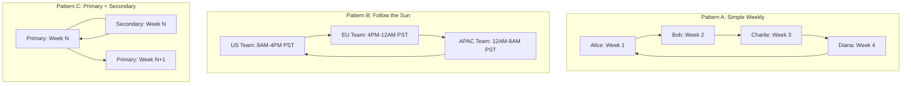
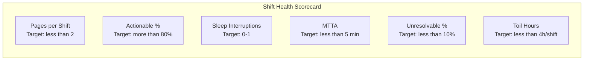

# On-Call Best Practices

## Why It Exists

On-call is the operational tax that every production system requires. Someone must be available when things break at 3 AM. The question is not whether to have on-call, but how to design it so it does not destroy your team. The industry's track record is poor: surveys consistently show that 60-70% of on-call engineers report burnout symptoms, 40% cite on-call as a reason for leaving their job, and companies with toxic on-call cultures spend 2-3x more on hiring due to turnover.

The fundamental tension is between reliability (someone must always be reachable) and human sustainability (people cannot be "always on" without breaking). Good on-call design resolves this tension through structure: clear rotations, bounded responsibilities, quality alerts, adequate compensation, and systematic reduction of operational burden.

### Historical Context

On-call in software engineering evolved from the operations world (NOCs, telecom) where 24/7 coverage was staffed by dedicated ops teams. The DevOps movement (2009+) shifted on-call responsibility to development teams under the principle "you build it, you run it." This was philosophically sound but operationally brutal: developers who had never been paged before were suddenly responsible for 4 AM incidents with no training, no runbooks, and no support structure.

Google's SRE book (2016) formalized on-call practices with quantitative targets: maximum 25% of an SRE's time on operational work, maximum 2 events per 12-hour shift, and mandatory postmortems when these limits are exceeded. These became the baseline for the industry.

## First Principles

### The On-Call Contract

On-call is a contract between the engineer and the organization with obligations on both sides:

| Engineer Obligations | Organization Obligations |
|---------------------|------------------------|
| Be reachable within response SLA | Provide clear, actionable alerts |
| Have laptop and internet access | Maintain runbooks for all alerts |
| Acknowledge and triage alerts | Compensate on-call time fairly |
| Escalate when unable to resolve | Limit on-call frequency (max 1 in 4) |
| Document actions taken | Invest in reducing on-call burden |
| Participate in postmortems | Provide training and shadowing |

### The Toil Budget

Google SRE defines **toil** as operational work that is manual, repetitive, automatable, tactical, without enduring value, and scales linearly with service growth.

$$
\text{Toil Budget} = \text{Total Work Hours} \times \text{Max Toil Percentage}
$$

For a 40-hour work week with a 25% toil cap:

$$
\text{Toil Budget} = 40 \times 0.25 = 10 \text{ hours/week}
$$

On-call shifts count toward the toil budget:

$$
\text{Remaining Engineering Time} = \text{Total} - \text{On-Call Hours} - \text{Incident Response} - \text{Operational Toil}
$$

If on-call + operational toil exceeds 50%, the team cannot make forward progress and enters a death spiral: no time to automate leads to more toil leads to less time to automate.

### Burnout Model

Burnout is not just "feeling tired." It is a clinically recognized syndrome (WHO ICD-11) with three dimensions:

1. **Emotional exhaustion**: Feeling drained, unable to cope
2. **Depersonalization**: Cynicism toward the work, detachment from incidents
3. **Reduced accomplishment**: Feeling ineffective, questioning the value of the work

The Maslach Burnout Inventory maps these to on-call stressors:

$$
B = \alpha \cdot F_{pages} + \beta \cdot D_{disruption} + \gamma \cdot U_{unresolvable} + \delta \cdot L_{lack\_control}
$$

Where:
- $F_{pages}$ = frequency of pages per shift
- $D_{disruption}$ = severity of sleep/life disruption
- $U_{unresolvable}$ = percentage of pages the on-call cannot resolve
- $L_{lack\_control}$ = inability to reduce future incidents
- $\alpha, \beta, \gamma, \delta$ = individual sensitivity weights

## Core Mechanics

### Rotation Design Patterns



### Rotation Sizing Formula

Minimum team size for sustainable on-call:

$$
n_{min} = \frac{T_{total}}{T_{shift}} \times \frac{1}{f_{max}}
$$

Where:
- $T_{total}$ = total hours to cover (168 hours/week for 24/7)
- $T_{shift}$ = hours per shift
- $f_{max}$ = maximum on-call frequency per person (recommended: 1 in 4 weeks)

For 24/7 coverage with weekly shifts and 1-in-4 frequency:

$$
n_{min} = \frac{168}{168} \times 4 = 4 \text{ people minimum}
$$

For 24/7 with 12-hour shifts (day/night split):

$$
n_{min} = \frac{168}{84} \times 4 = 8 \text{ people minimum}
$$

::: danger Under-Staffed On-Call
With fewer than 4 people in a weekly rotation, each person is on-call 25%+ of the time. Research shows burnout risk increases dramatically above 25% on-call time. If you have fewer than 4 people, consider:
- Sharing on-call across teams
- Hiring specifically for on-call coverage
- Using a managed on-call service for off-hours
- Reducing the scope of what requires on-call (accept some latency in incident response for non-critical systems)
:::

### Shift Quality Metrics



## Implementation

### On-Call Health Dashboard

```typescript
interface OnCallShift {
  engineer: string;
  startTime: Date;
  endTime: Date;
  incidents: Incident[];
  pages: Page[];
  notes: string;
}

interface Incident {
  id: string;
  severity: 'P0' | 'P1' | 'P2' | 'P3' | 'P4';
  startTime: Date;
  acknowledgedAt?: Date;
  resolvedAt?: Date;
  wasActionable: boolean;
  wasResolvableByOnCall: boolean;
  requiredEscalation: boolean;
  sleepInterruption: boolean;
  rootCause?: string;
}

interface Page {
  timestamp: Date;
  alertName: string;
  acknowledged: boolean;
  timeToAcknowledgeMs?: number;
  wasActionable: boolean;
  notes?: string;
}

interface ShiftHealthReport {
  engineer: string;
  shiftDuration: number; // hours
  totalPages: number;
  actionablePages: number;
  actionablePercent: number;
  sleepInterruptions: number;
  avgTimeToAcknowledge: number; // minutes
  p0p1Incidents: number;
  escalationRate: number;
  unresolvableRate: number;
  healthScore: number; // 0-100
  recommendations: string[];
}

class OnCallHealthAnalyzer {
  analyzeShift(shift: OnCallShift): ShiftHealthReport {
    const durationHours =
      (shift.endTime.getTime() - shift.startTime.getTime()) / 3_600_000;

    const totalPages = shift.pages.length;
    const actionablePages = shift.pages.filter((p) => p.wasActionable).length;
    const actionablePercent = totalPages > 0
      ? (actionablePages / totalPages) * 100
      : 100;

    const sleepInterruptions = shift.incidents.filter(
      (i) => i.sleepInterruption
    ).length;

    const acknowledgedPages = shift.pages.filter(
      (p) => p.timeToAcknowledgeMs !== undefined
    );
    const avgTimeToAcknowledge = acknowledgedPages.length > 0
      ? acknowledgedPages.reduce(
          (sum, p) => sum + (p.timeToAcknowledgeMs ?? 0),
          0
        ) / acknowledgedPages.length / 60_000
      : 0;

    const p0p1 = shift.incidents.filter(
      (i) => i.severity === 'P0' || i.severity === 'P1'
    ).length;

    const escalated = shift.incidents.filter(
      (i) => i.requiredEscalation
    ).length;
    const escalationRate = shift.incidents.length > 0
      ? (escalated / shift.incidents.length) * 100
      : 0;

    const unresolvable = shift.incidents.filter(
      (i) => !i.wasResolvableByOnCall
    ).length;
    const unresolvableRate = shift.incidents.length > 0
      ? (unresolvable / shift.incidents.length) * 100
      : 0;

    // Health score calculation
    const healthScore = this.calculateHealthScore({
      pagesPerShift: totalPages / (durationHours / 168), // normalize to weekly
      actionablePercent,
      sleepInterruptions,
      avgTimeToAcknowledge,
      escalationRate,
      unresolvableRate,
    });

    const recommendations = this.generateRecommendations({
      totalPages,
      actionablePercent,
      sleepInterruptions,
      unresolvableRate,
      escalationRate,
      durationHours,
    });

    return {
      engineer: shift.engineer,
      shiftDuration: durationHours,
      totalPages,
      actionablePages,
      actionablePercent,
      sleepInterruptions,
      avgTimeToAcknowledge,
      p0p1Incidents: p0p1,
      escalationRate,
      unresolvableRate,
      healthScore,
      recommendations,
    };
  }

  private calculateHealthScore(metrics: {
    pagesPerShift: number;
    actionablePercent: number;
    sleepInterruptions: number;
    avgTimeToAcknowledge: number;
    escalationRate: number;
    unresolvableRate: number;
  }): number {
    let score = 100;

    // Deduct for excessive pages (target: <= 2 per week)
    if (metrics.pagesPerShift > 2) {
      score -= Math.min(30, (metrics.pagesPerShift - 2) * 5);
    }

    // Deduct for non-actionable alerts (target: >= 80%)
    if (metrics.actionablePercent < 80) {
      score -= Math.min(25, (80 - metrics.actionablePercent) * 1);
    }

    // Deduct for sleep interruptions (target: 0-1)
    if (metrics.sleepInterruptions > 1) {
      score -= Math.min(20, (metrics.sleepInterruptions - 1) * 10);
    }

    // Deduct for slow acknowledgment (target: < 5 min)
    if (metrics.avgTimeToAcknowledge > 5) {
      score -= Math.min(10, (metrics.avgTimeToAcknowledge - 5) * 2);
    }

    // Deduct for high unresolvable rate (target: < 10%)
    if (metrics.unresolvableRate > 10) {
      score -= Math.min(15, (metrics.unresolvableRate - 10) * 0.5);
    }

    return Math.max(0, Math.round(score));
  }

  private generateRecommendations(metrics: {
    totalPages: number;
    actionablePercent: number;
    sleepInterruptions: number;
    unresolvableRate: number;
    escalationRate: number;
    durationHours: number;
  }): string[] {
    const recs: string[] = [];

    if (metrics.actionablePercent < 80) {
      recs.push(
        `${(100 - metrics.actionablePercent).toFixed(0)}% of pages were not actionable. ` +
        'Review and tune or remove non-actionable alerts.'
      );
    }

    if (metrics.sleepInterruptions > 2) {
      recs.push(
        `${metrics.sleepInterruptions} sleep interruptions this shift. ` +
        'Consider adjusting alert thresholds for off-hours or deferring non-critical alerts to business hours.'
      );
    }

    if (metrics.unresolvableRate > 20) {
      recs.push(
        `${metrics.unresolvableRate.toFixed(0)}% of incidents were not resolvable by on-call. ` +
        'Update runbooks, add automation, or re-route these alerts to specialist teams.'
      );
    }

    if (metrics.totalPages / (metrics.durationHours / 168) > 5) {
      recs.push(
        'More than 5 pages per week-equivalent. Team is likely experiencing alert fatigue. ' +
        'Prioritize alert reduction sprint.'
      );
    }

    if (metrics.escalationRate > 30) {
      recs.push(
        `${metrics.escalationRate.toFixed(0)}% escalation rate. ` +
        'On-call may lack necessary skills or access. Schedule training or pair programming.'
      );
    }

    return recs;
  }

  /**
   * Analyze trends across multiple shifts to detect deterioration
   */
  analyzeTrend(
    shifts: OnCallShift[],
    windowWeeks: number = 12
  ): {
    trend: 'improving' | 'stable' | 'deteriorating';
    avgHealthScore: number;
    scoreChange: number;
    topIssues: string[];
  } {
    const reports = shifts.map((s) => this.analyzeShift(s));
    const midpoint = Math.floor(reports.length / 2);

    const firstHalf = reports.slice(0, midpoint);
    const secondHalf = reports.slice(midpoint);

    const avgFirst =
      firstHalf.reduce((sum, r) => sum + r.healthScore, 0) / firstHalf.length;
    const avgSecond =
      secondHalf.reduce((sum, r) => sum + r.healthScore, 0) / secondHalf.length;

    const scoreChange = avgSecond - avgFirst;

    let trend: 'improving' | 'stable' | 'deteriorating';
    if (scoreChange > 5) trend = 'improving';
    else if (scoreChange < -5) trend = 'deteriorating';
    else trend = 'stable';

    // Identify top issues across all shifts
    const allRecs = reports.flatMap((r) => r.recommendations);
    const recCounts = new Map<string, number>();
    for (const rec of allRecs) {
      const key = rec.split('.')[0]; // First sentence as key
      recCounts.set(key, (recCounts.get(key) ?? 0) + 1);
    }

    const topIssues = Array.from(recCounts.entries())
      .sort((a, b) => b[1] - a[1])
      .slice(0, 3)
      .map(([issue]) => issue);

    return {
      trend,
      avgHealthScore: (avgFirst + avgSecond) / 2,
      scoreChange,
      topIssues,
    };
  }
}
```

### Compensation Calculator

```typescript
interface CompensationPolicy {
  baseOnCallStipend: number; // per shift (weekly)
  nightPageBonus: number; // per page between 10PM-7AM
  weekendMultiplier: number; // multiplier on base stipend
  holidayMultiplier: number; // multiplier on base stipend
  incidentResponseRate: number; // per hour of active incident work
  p0Bonus: number; // bonus per P0 incident handled
  maxShiftsPerMonth: number; // hard cap for burnout prevention
}

interface ShiftCompensation {
  baseStipend: number;
  nightPageBonuses: number;
  weekendBonus: number;
  holidayBonus: number;
  incidentResponsePay: number;
  p0Bonuses: number;
  totalCompensation: number;
  breakdown: string[];
}

function calculateShiftCompensation(
  shift: OnCallShift,
  policy: CompensationPolicy
): ShiftCompensation {
  let baseStipend = policy.baseOnCallStipend;
  const breakdown: string[] = [];

  // Check for weekend/holiday
  const startDay = shift.startTime.getDay();
  const isWeekend = startDay === 0 || startDay === 6;
  const isHoliday = false; // Would check against holiday calendar

  let weekendBonus = 0;
  let holidayBonus = 0;

  if (isWeekend) {
    weekendBonus = baseStipend * (policy.weekendMultiplier - 1);
    breakdown.push(`Weekend multiplier: ${policy.weekendMultiplier}x`);
  }

  if (isHoliday) {
    holidayBonus = baseStipend * (policy.holidayMultiplier - 1);
    breakdown.push(`Holiday multiplier: ${policy.holidayMultiplier}x`);
  }

  // Night page bonuses
  const nightPages = shift.pages.filter((p) => {
    const hour = p.timestamp.getHours();
    return hour >= 22 || hour < 7;
  });
  const nightPageBonuses = nightPages.length * policy.nightPageBonus;
  if (nightPages.length > 0) {
    breakdown.push(
      `Night pages: ${nightPages.length} x $${policy.nightPageBonus}`
    );
  }

  // Active incident response time
  let totalIncidentHours = 0;
  for (const incident of shift.incidents) {
    if (incident.acknowledgedAt && incident.resolvedAt) {
      const hours =
        (incident.resolvedAt.getTime() - incident.acknowledgedAt.getTime()) /
        3_600_000;
      totalIncidentHours += hours;
    }
  }
  const incidentResponsePay = totalIncidentHours * policy.incidentResponseRate;
  if (totalIncidentHours > 0) {
    breakdown.push(
      `Incident response: ${totalIncidentHours.toFixed(1)}h x $${policy.incidentResponseRate}/h`
    );
  }

  // P0 bonuses
  const p0Count = shift.incidents.filter(
    (i) => i.severity === 'P0'
  ).length;
  const p0Bonuses = p0Count * policy.p0Bonus;
  if (p0Count > 0) {
    breakdown.push(`P0 incidents: ${p0Count} x $${policy.p0Bonus}`);
  }

  const totalCompensation =
    baseStipend + nightPageBonuses + weekendBonus + holidayBonus +
    incidentResponsePay + p0Bonuses;

  return {
    baseStipend,
    nightPageBonuses,
    weekendBonus,
    holidayBonus,
    incidentResponsePay,
    p0Bonuses,
    totalCompensation,
    breakdown,
  };
}

// Example policy
const policy: CompensationPolicy = {
  baseOnCallStipend: 500,       // $500 per weekly shift
  nightPageBonus: 50,            // $50 per night page
  weekendMultiplier: 1.5,        // 1.5x for weekend shifts
  holidayMultiplier: 2.0,        // 2x for holiday shifts
  incidentResponseRate: 75,      // $75/hour for active incident work
  p0Bonus: 200,                  // $200 per P0 handled
  maxShiftsPerMonth: 2,          // No more than 2 shifts per month
};
```

### Handoff Protocol

```typescript
interface HandoffChecklist {
  outgoingEngineer: string;
  incomingEngineer: string;
  handoffTime: Date;
  activeIncidents: Array<{
    id: string;
    summary: string;
    severity: string;
    status: string;
    nextSteps: string;
  }>;
  pendingActions: Array<{
    description: string;
    deadline?: Date;
    context: string;
  }>;
  systemHealth: Array<{
    service: string;
    status: 'healthy' | 'degraded' | 'at_risk';
    notes?: string;
  }>;
  recentChanges: Array<{
    description: string;
    timestamp: Date;
    riskLevel: 'low' | 'medium' | 'high';
  }>;
  upcomingMaintenance: Array<{
    description: string;
    scheduledTime: Date;
    expectedDuration: string;
    runbookUrl: string;
  }>;
  knownIssues: string[];
  shiftNotes: string;
}

class HandoffManager {
  generateHandoffDocument(checklist: HandoffChecklist): string {
    let doc = `# On-Call Handoff\n\n`;
    doc += `**From:** ${checklist.outgoingEngineer}\n`;
    doc += `**To:** ${checklist.incomingEngineer}\n`;
    doc += `**Time:** ${checklist.handoffTime.toISOString()}\n\n`;

    // Active incidents
    if (checklist.activeIncidents.length > 0) {
      doc += `## Active Incidents\n\n`;
      for (const incident of checklist.activeIncidents) {
        doc += `### ${incident.id} - ${incident.summary}\n`;
        doc += `- **Severity:** ${incident.severity}\n`;
        doc += `- **Status:** ${incident.status}\n`;
        doc += `- **Next Steps:** ${incident.nextSteps}\n\n`;
      }
    } else {
      doc += `## Active Incidents\n\nNone - all clear.\n\n`;
    }

    // Pending actions
    if (checklist.pendingActions.length > 0) {
      doc += `## Pending Actions\n\n`;
      for (const action of checklist.pendingActions) {
        doc += `- ${action.description}`;
        if (action.deadline) {
          doc += ` (due: ${action.deadline.toISOString()})`;
        }
        doc += `\n  Context: ${action.context}\n`;
      }
      doc += '\n';
    }

    // System health
    doc += `## System Health\n\n`;
    doc += `| Service | Status | Notes |\n`;
    doc += `|---------|--------|-------|\n`;
    for (const system of checklist.systemHealth) {
      const statusEmoji =
        system.status === 'healthy' ? 'OK' :
        system.status === 'degraded' ? 'DEGRADED' : 'AT RISK';
      doc += `| ${system.service} | ${statusEmoji} | ${system.notes ?? '-'} |\n`;
    }
    doc += '\n';

    // Recent changes
    if (checklist.recentChanges.length > 0) {
      doc += `## Recent Changes (Last 24h)\n\n`;
      for (const change of checklist.recentChanges) {
        doc += `- [${change.riskLevel.toUpperCase()}] ${change.description} (${change.timestamp.toISOString()})\n`;
      }
      doc += '\n';
    }

    // Upcoming maintenance
    if (checklist.upcomingMaintenance.length > 0) {
      doc += `## Upcoming Maintenance\n\n`;
      for (const maint of checklist.upcomingMaintenance) {
        doc += `- **${maint.description}**\n`;
        doc += `  Scheduled: ${maint.scheduledTime.toISOString()}\n`;
        doc += `  Duration: ${maint.expectedDuration}\n`;
        doc += `  Runbook: ${maint.runbookUrl}\n\n`;
      }
    }

    // Known issues
    if (checklist.knownIssues.length > 0) {
      doc += `## Known Issues\n\n`;
      for (const issue of checklist.knownIssues) {
        doc += `- ${issue}\n`;
      }
      doc += '\n';
    }

    // Shift notes
    if (checklist.shiftNotes) {
      doc += `## Shift Notes\n\n${checklist.shiftNotes}\n`;
    }

    return doc;
  }

  validateHandoff(checklist: HandoffChecklist): string[] {
    const issues: string[] = [];

    // Active incidents must have next steps
    for (const incident of checklist.activeIncidents) {
      if (!incident.nextSteps || incident.nextSteps.trim() === '') {
        issues.push(
          `Incident ${incident.id} has no next steps defined`
        );
      }
    }

    // High-risk recent changes should be highlighted
    const highRiskChanges = checklist.recentChanges.filter(
      (c) => c.riskLevel === 'high'
    );
    if (highRiskChanges.length > 0 && !checklist.shiftNotes.includes('risk')) {
      issues.push(
        'High-risk changes deployed but shift notes do not mention them'
      );
    }

    // System health should be populated
    if (checklist.systemHealth.length === 0) {
      issues.push('System health section is empty');
    }

    return issues;
  }
}
```

## Edge Cases and Failure Modes

### 1. The Hero Culture Problem

One senior engineer always handles incidents, even when others are on-call. They jump in because they're faster, but this prevents others from learning and creates a single point of failure.

**Solution**: Enforce a "shadow first" policy where the hero becomes the secondary and coaches the primary through resolution. Track incident resolution by responder to ensure distribution.

### 2. The Never-Ending Incident

An incident spans multiple on-call shifts. The handoff loses context. The new on-call re-investigates from scratch.

**Solution**: For incidents lasting more than 4 hours, assign an Incident Commander who persists through the incident regardless of on-call rotation. The IC can hand off, but must explicitly transfer all context.

### 3. Simultaneous Incidents

Two P1 incidents fire at the same time. One on-call engineer cannot effectively handle both.

**Solution**: Automatic secondary paging when the primary is already engaged in an active incident:

```typescript
function shouldPageSecondary(
  primaryStatus: 'idle' | 'investigating' | 'in_war_room',
  newIncidentSeverity: string,
  activeIncidentCount: number
): boolean {
  // Always page secondary if primary is in a war room
  if (primaryStatus === 'in_war_room') return true;

  // Page secondary if primary is already investigating and new incident is P0/P1
  if (
    primaryStatus === 'investigating' &&
    (newIncidentSeverity === 'P0' || newIncidentSeverity === 'P1')
  ) {
    return true;
  }

  // Page secondary if more than 2 active incidents
  if (activeIncidentCount >= 2) return true;

  return false;
}
```

::: warning Signs Your On-Call Is Unhealthy
- Engineers swapping shifts to avoid on-call
- On-call engineer always has laptop open during personal time "just in case"
- Shift handoff takes less than 2 minutes (nobody cares enough to do it properly)
- New team members refuse to join the on-call rotation
- The same 2-3 people handle every P0, regardless of who is on-call
- On-call is used as a punishment or hazing ritual for new hires
- No one reviews on-call load metrics
:::

## Performance Characteristics

### On-Call Load Targets

| Metric | Healthy | Warning | Critical |
|--------|---------|---------|----------|
| Pages per week | 0-2 | 3-5 | >5 |
| Actionable page rate | >80% | 60-80% | <60% |
| Sleep interruptions per shift | 0-1 | 2-3 | >3 |
| MTTA (minutes) | <5 | 5-15 | >15 |
| On-call frequency | <= 1 in 4 | 1 in 3 | 1 in 2 or worse |
| Escalation rate | <15% | 15-30% | >30% |
| Postmortem action completion | >80% | 50-80% | <50% |

### The Cost of Poor On-Call

$$
\text{Annual Cost} = C_{turnover} + C_{productivity} + C_{incidents} + C_{compensation}
$$

For a team of 8 with poor on-call practices:

| Component | Calculation | Annual Cost |
|-----------|------------|-------------|
| Turnover (1 person/year) | $150K recruiting + onboarding | $150,000 |
| Productivity loss (20% for all 8) | 8 x $180K salary x 20% | $288,000 |
| Extended incident resolution | 30% longer MTTR x 50 incidents x $5K/hour | $75,000 |
| Overtime/compensation | 8 x $500/week x 52 | $208,000 |
| **Total** | | **$721,000** |

Investing $100K in automation, alert tuning, and better tooling typically pays for itself within 6 months.

## Mathematical Foundations

### Optimal Rotation Size

Given:
- $n$ = team size
- $k$ = number of on-call slots to fill simultaneously
- $p$ = maximum acceptable on-call fraction per person
- $v$ = vacation/sick rate

$$
n_{required} = \frac{k}{p \cdot (1 - v)}
$$

For 2 slots (primary + secondary), 25% max on-call time, 10% vacation rate:

$$
n_{required} = \frac{2}{0.25 \times 0.9} = 8.89 \approx 9 \text{ people}
$$

### Burnout Risk Prediction

Using a logistic regression model:

$$
P(\text{burnout}) = \frac{1}{1 + e^{-(\beta_0 + \beta_1 x_1 + \beta_2 x_2 + ... + \beta_n x_n)}}
$$

Where features include:
- $x_1$: pages per shift (normalized)
- $x_2$: consecutive weeks on-call
- $x_3$: sleep interruptions per week
- $x_4$: unresolvable incident rate
- $x_5$: tenure in months (protective factor)

Calibrated on industry data:

$$
P(\text{burnout}) = \frac{1}{1 + e^{-(0.3 \cdot \text{pages} + 0.8 \cdot \text{consecutive\_weeks} + 0.5 \cdot \text{sleep\_disruptions} - 0.02 \cdot \text{tenure} - 2.1)}}
$$

At 5 pages/shift, 3 consecutive weeks, 2 sleep disruptions, 12 months tenure:

$$
P(\text{burnout}) = \frac{1}{1 + e^{-(1.5 + 2.4 + 1.0 - 0.24 - 2.1)}} = \frac{1}{1 + e^{-2.56}} = 0.928
$$

93% burnout probability - this engineer needs relief immediately.

## Real-World War Stories

::: info War Story
**The 72-Hour On-Call Shift (2019)**

A startup with a 3-person engineering team had each person on-call for one week at a time, with no secondary. During one engineer's vacation, the two remaining engineers split the week. One of them got food poisoning on a Tuesday and couldn't respond to pages. The remaining engineer was effectively on-call for 72 consecutive hours during a week with 2 P1 incidents.

By Thursday, this engineer was making errors due to sleep deprivation: they accidentally ran a migration against the production database instead of staging, causing a 4-hour outage. The postmortem traced the root cause not to the migration script, but to the unsustainable on-call load that impaired decision-making.

**Fix**: The company hired two more engineers specifically to bring the rotation to 5 people, implemented a mandatory secondary on-call, and added a policy that no one could be primary for more than 7 consecutive days.
:::

::: info War Story
**The Alert Reduction Sprint That Saved a Team (2021)**

A platform team at a mid-size company was losing one engineer per quarter to burnout. On-call averaged 12 pages per shift, with only 35% being actionable. The remaining 65% were noise: threshold alerts on metrics that fluctuated normally, missing dependencies for services that were intentionally down, and flapping health checks.

Management approved a 2-week "alert reduction sprint" where the entire team focused exclusively on:
1. Deleting alerts that had never resulted in action (42 alerts removed)
2. Converting threshold alerts to burn-rate alerts (15 alerts redesigned)
3. Adding appropriate for-duration and inhibition rules (23 alerts tuned)
4. Writing runbooks for every remaining alert (31 runbooks created)

Results after 3 months:
- Pages per shift: 12 -> 1.8
- Actionable rate: 35% -> 91%
- Sleep interruptions: 3.2/shift -> 0.4/shift
- Team attrition: 0 in the following 6 months

The sprint cost 2 weeks of feature development but saved an estimated $450K in turnover costs.
:::

## Decision Framework

### On-Call Readiness Checklist

Before putting a team on-call for a new service:

| Requirement | Status |
|------------|--------|
| All alerts have runbooks | Required |
| On-call engineer has production access | Required |
| Shadowing shifts completed (min 2) | Required |
| Escalation policy configured and tested | Required |
| Monitoring dashboards reviewed | Required |
| Incident communication channels set up | Required |
| Compensation policy communicated | Required |
| Break-glass procedures documented | Required |
| At least 4 people in rotation | Strongly recommended |
| Post-incident review process defined | Required |

### When to Expand the Rotation

| Signal | Action |
|--------|--------|
| Average >3 pages per shift | Add people or reduce alert noise |
| On-call frequency > 1 in 3 | Hire or merge rotations |
| >2 sleep interruptions per shift | Tune off-hours alerts |
| >30% escalation rate | Training needed or wrong team owns alerts |
| Burnout survey scores declining | Immediate intervention: reduce scope, add people |
| New service added to team's scope | Re-evaluate rotation size before onboarding the service |

## Advanced Topics

### Cognitive Load Theory and On-Call

The human brain has a working memory capacity of approximately $7 \pm 2$ items (Miller's Law). During an on-call incident, the engineer must simultaneously hold:

1. Current system state
2. Recent changes (potential causes)
3. Remediation steps
4. Communication obligations
5. Blast radius assessment
6. Customer impact estimate
7. Escalation criteria

This is already at the limit. Adding a second concurrent incident or a poorly documented system pushes past it, leading to errors.

**Practical implication**: Runbooks reduce cognitive load by externalizing items 3, 5, and 7. Good dashboards externalize items 1 and 6. This is why tooling investment has such high ROI for on-call quality.

### On-Call Maturity Model

| Level | Characteristics | Typical Metrics |
|-------|----------------|----------------|
| **1 - Reactive** | No runbooks, no schedules, random paging | >10 pages/shift, <30% actionable |
| **2 - Structured** | Schedules exist, basic runbooks, PagerDuty configured | 5-10 pages/shift, 50% actionable |
| **3 - Measured** | Health metrics tracked, regular reviews, compensation | 2-5 pages/shift, 70% actionable |
| **4 - Optimized** | SLO-based alerts, automation reduces toil, proactive improvements | 1-2 pages/shift, 85%+ actionable |
| **5 - Self-Healing** | Most incidents auto-remediated, on-call is boring | <1 page/shift, 95%+ actionable |

Most companies are at Level 2-3. Level 5 is aspirational and only achieved for specific, well-understood failure modes.

## Cross-References

- [Escalation Policies](./escalation-policies.md) - How escalation chain complements on-call rotation
- [Alert Design](./alert-design.md) - Reducing page volume through better alert design
- [Runbook Templates](./runbook-templates.md) - Making on-call incidents resolvable
- [Burnout prevention strategies](../incident-response/war-room-procedures.md) - Managing stress during active incidents
- [Monitoring Anti-Patterns](../monitoring/monitoring-antipatterns.md) - Eliminating noise at the source
