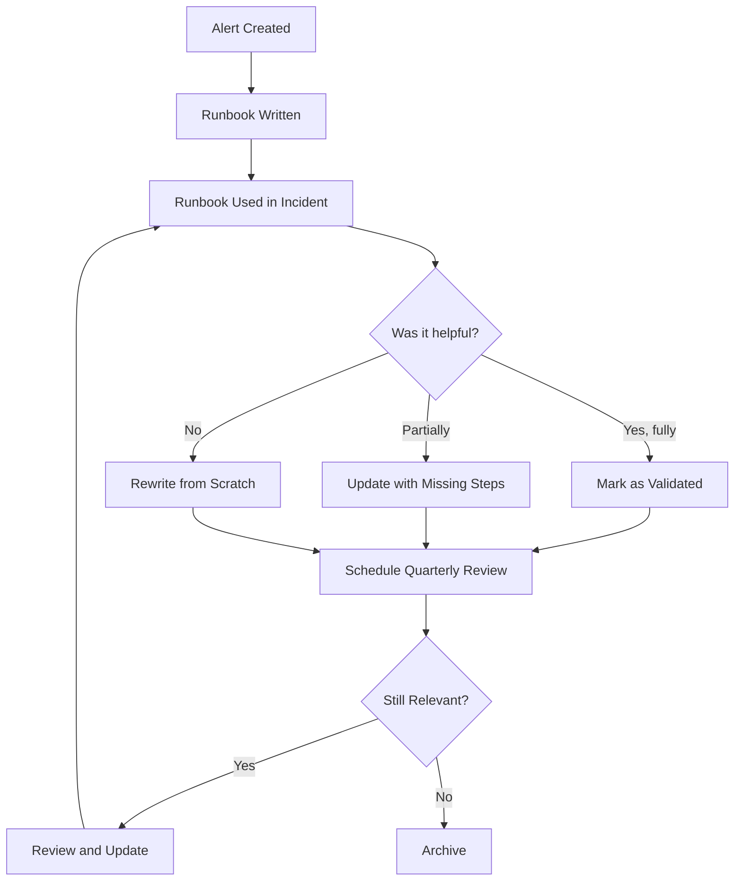
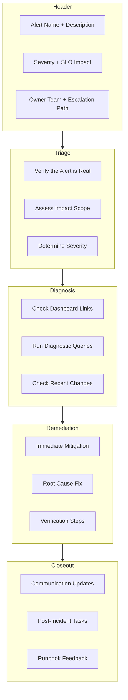
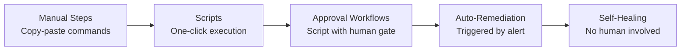

# Runbook Templates

## Why It Exists

At 3 AM, an alert fires. The on-call engineer, half-asleep, opens the alert and reads: "HighErrorRate on payment-service." Now what? Without a runbook, this engineer must reconstruct from memory (or experimentation) every diagnostic step, every remediation action, every escalation criterion. Under stress, with impaired cognition, they will inevitably miss something.

A runbook is the difference between a 10-minute resolution and a 2-hour fumble. It captures the collective knowledge of everyone who has ever dealt with this problem and distills it into a step-by-step guide that even a first-week on-call engineer can follow. Google SRE teams found that incidents with runbooks resolve 3-5x faster than those without.

The problem most teams face is not that they don't have runbooks - it's that their runbooks are outdated, incomplete, or impossible to find in the heat of an incident. This section addresses all three issues.

### The Runbook Lifecycle

Runbooks are not static documents. They follow a lifecycle:



## First Principles

### What Makes a Good Runbook?

A good runbook has five properties:

1. **Findable**: Linked directly from the alert. One click from the page to the runbook.
2. **Current**: Updated after every incident where it was used. Stale runbooks are dangerous.
3. **Actionable**: Every step is a concrete command or decision, not a vague instruction.
4. **Complete**: Covers diagnosis, remediation, escalation, and rollback. No gaps.
5. **Tested**: The steps have been verified to work. Ideally, they are automated.

### The Runbook Maturity Spectrum

$$
\text{Maturity} = f(\text{Automation}, \text{Coverage}, \text{Freshness})
$$

| Level | Description | Response Time Impact |
|-------|------------|---------------------|
| 0 - None | No runbook exists | Engineer must figure it out from scratch |
| 1 - Notes | Informal notes in a wiki | Helps if found, often outdated |
| 2 - Structured | Standard template, linked from alert | 50% faster resolution |
| 3 - Verified | Tested quarterly, validated by incidents | 70% faster resolution |
| 4 - Semi-automated | Commands are copy-paste ready, scripts provided | 80% faster resolution |
| 5 - Fully automated | Runbook is executable code, triggered automatically | 95% faster resolution |

The goal is to move every alert to at least Level 3, with critical path alerts at Level 4-5.

## Core Mechanics

### Standard Runbook Structure

Every runbook should follow this structure:



## Implementation

### Runbook Schema and Generator

```typescript
interface RunbookStep {
  id: string;
  title: string;
  description: string;
  commands?: string[];
  expectedOutput?: string;
  decisionPoint?: {
    question: string;
    options: Array<{
      answer: string;
      nextStep: string;
    }>;
  };
  automation?: {
    script: string;
    requiresApproval: boolean;
    rollbackScript?: string;
  };
  warnings?: string[];
  timeEstimate?: string;
}

interface RunbookSection {
  name: string;
  steps: RunbookStep[];
}

interface Runbook {
  metadata: {
    alertName: string;
    title: string;
    description: string;
    severity: string;
    service: string;
    ownerTeam: string;
    lastUpdated: string;
    lastTested: string;
    lastUsedInIncident?: string;
    reviewCycle: string;
    dashboardUrl: string;
    slackChannel: string;
    escalationPolicy: string;
    relatedRunbooks: string[];
    tags: string[];
  };
  triage: RunbookSection;
  diagnosis: RunbookSection;
  remediation: RunbookSection;
  rollback: RunbookSection;
  communication: RunbookSection;
  closeout: RunbookSection;
}

class RunbookGenerator {
  /**
   * Generate a markdown runbook from the structured definition
   */
  toMarkdown(runbook: Runbook): string {
    const lines: string[] = [];
    const m = runbook.metadata;

    lines.push(`# ${m.title}`);
    lines.push('');
    lines.push(`> **Alert:** ${m.alertName}`);
    lines.push(`> **Service:** ${m.service} | **Severity:** ${m.severity}`);
    lines.push(`> **Owner:** ${m.ownerTeam} | **Updated:** ${m.lastUpdated}`);
    lines.push('');

    lines.push('## Quick Links');
    lines.push('');
    lines.push(`| Resource | Link |`);
    lines.push(`|----------|------|`);
    lines.push(`| Dashboard | ${m.dashboardUrl} |`);
    lines.push(`| Slack | ${m.slackChannel} |`);
    lines.push(`| Escalation | ${m.escalationPolicy} |`);
    lines.push('');

    if (m.relatedRunbooks.length > 0) {
      lines.push('**Related Runbooks:** ' + m.relatedRunbooks.join(', '));
      lines.push('');
    }

    // Render each section
    lines.push(...this.renderSection('Triage', runbook.triage));
    lines.push(...this.renderSection('Diagnosis', runbook.diagnosis));
    lines.push(...this.renderSection('Remediation', runbook.remediation));
    lines.push(...this.renderSection('Rollback', runbook.rollback));
    lines.push(...this.renderSection('Communication', runbook.communication));
    lines.push(...this.renderSection('Closeout', runbook.closeout));

    return lines.join('\n');
  }

  private renderSection(title: string, section: RunbookSection): string[] {
    const lines: string[] = [];
    lines.push(`## ${title}`);
    lines.push('');

    for (let i = 0; i < section.steps.length; i++) {
      const step = section.steps[i];
      lines.push(`### Step ${i + 1}: ${step.title}`);
      lines.push('');
      lines.push(step.description);
      lines.push('');

      if (step.warnings && step.warnings.length > 0) {
        for (const warning of step.warnings) {
          lines.push(`> **WARNING:** ${warning}`);
        }
        lines.push('');
      }

      if (step.commands && step.commands.length > 0) {
        lines.push('```bash');
        for (const cmd of step.commands) {
          lines.push(cmd);
        }
        lines.push('```');
        lines.push('');
      }

      if (step.expectedOutput) {
        lines.push('**Expected output:**');
        lines.push('```');
        lines.push(step.expectedOutput);
        lines.push('```');
        lines.push('');
      }

      if (step.decisionPoint) {
        lines.push(`**Decision:** ${step.decisionPoint.question}`);
        lines.push('');
        for (const option of step.decisionPoint.options) {
          lines.push(`- **${option.answer}** -> Go to ${option.nextStep}`);
        }
        lines.push('');
      }

      if (step.timeEstimate) {
        lines.push(`*Estimated time: ${step.timeEstimate}*`);
        lines.push('');
      }
    }

    return lines;
  }

  /**
   * Validate a runbook for completeness
   */
  validate(runbook: Runbook): string[] {
    const issues: string[] = [];

    // Check metadata
    if (!runbook.metadata.dashboardUrl) {
      issues.push('Missing dashboard URL');
    }
    if (!runbook.metadata.escalationPolicy) {
      issues.push('Missing escalation policy reference');
    }

    // Check each section has at least one step
    const sections = [
      { name: 'triage', section: runbook.triage },
      { name: 'diagnosis', section: runbook.diagnosis },
      { name: 'remediation', section: runbook.remediation },
    ];

    for (const { name, section } of sections) {
      if (section.steps.length === 0) {
        issues.push(`${name} section has no steps`);
      }
    }

    // Check for commands in remediation steps
    const remediationHasCommands = runbook.remediation.steps.some(
      (s) => s.commands && s.commands.length > 0
    );
    if (!remediationHasCommands) {
      issues.push(
        'Remediation section has no concrete commands - runbook may not be actionable'
      );
    }

    // Check freshness
    const lastUpdated = new Date(runbook.metadata.lastUpdated);
    const daysSinceUpdate =
      (Date.now() - lastUpdated.getTime()) / (1000 * 60 * 60 * 24);
    if (daysSinceUpdate > 90) {
      issues.push(
        `Runbook last updated ${Math.round(daysSinceUpdate)} days ago - may be stale`
      );
    }

    // Check for decision points leading nowhere
    for (const section of [runbook.triage, runbook.diagnosis, runbook.remediation]) {
      for (const step of section.steps) {
        if (step.decisionPoint) {
          for (const option of step.decisionPoint.options) {
            const targetExists = section.steps.some(
              (s) => s.id === option.nextStep
            );
            if (!targetExists) {
              issues.push(
                `Step ${step.id}: decision option "${option.answer}" references non-existent step ${option.nextStep}`
              );
            }
          }
        }
      }
    }

    return issues;
  }
}
```

### Template: High Error Rate Runbook

```typescript
const highErrorRateRunbook: Runbook = {
  metadata: {
    alertName: 'HighErrorBurnRate',
    title: 'High Error Rate on API Service',
    description: 'Error rate burn rate exceeds threshold, indicating SLO is at risk.',
    severity: 'P1/P0 (depending on burn rate)',
    service: 'api-gateway',
    ownerTeam: 'Platform Team',
    lastUpdated: '2026-03-18',
    lastTested: '2026-03-01',
    lastUsedInIncident: 'INC-4521 (2026-02-28)',
    reviewCycle: 'Monthly',
    dashboardUrl: 'https://grafana.example.com/d/api-gateway-slo',
    slackChannel: '#platform-incidents',
    escalationPolicy: 'Platform Team Critical',
    relatedRunbooks: ['database-connection-pool', 'upstream-timeout', 'deployment-rollback'],
    tags: ['api', 'error-rate', 'slo'],
  },

  triage: {
    name: 'Triage',
    steps: [
      {
        id: 'triage-1',
        title: 'Verify Alert Is Real',
        description: 'Check the dashboard to confirm the error rate increase is genuine and not a monitoring artifact.',
        commands: [
          '# Check current error rate',
          'curl -s "http://prometheus:9090/api/v1/query?query=sum(rate(http_requests_total{status=~%225..%22}[5m]))/sum(rate(http_requests_total[5m]))" | jq ".data.result[0].value[1]"',
        ],
        expectedOutput: '0.015  # Example: 1.5% error rate',
        decisionPoint: {
          question: 'Is the error rate above the SLO threshold?',
          options: [
            { answer: 'Yes, error rate is elevated', nextStep: 'triage-2' },
            { answer: 'No, rate looks normal', nextStep: 'triage-3' },
          ],
        },
        timeEstimate: '2 minutes',
      },
      {
        id: 'triage-2',
        title: 'Assess Impact Scope',
        description: 'Determine which endpoints, regions, and user segments are affected.',
        commands: [
          '# Error rate by endpoint',
          'curl -s "http://prometheus:9090/api/v1/query?query=topk(10,sum%20by%20(path)(rate(http_requests_total{status=~%225..%22}[5m])))" | jq ".data.result[] | {path: .metric.path, rate: .value[1]}"',
          '',
          '# Error rate by region',
          'curl -s "http://prometheus:9090/api/v1/query?query=sum%20by%20(region)(rate(http_requests_total{status=~%225..%22}[5m]))" | jq "."',
        ],
        timeEstimate: '3 minutes',
      },
      {
        id: 'triage-3',
        title: 'False Alarm - Investigate Monitoring',
        description: 'If the error rate appears normal on the dashboard, the alert may be a monitoring issue.',
        commands: [
          '# Check Prometheus scrape health',
          'curl -s "http://prometheus:9090/api/v1/targets" | jq ".data.activeTargets[] | select(.health != \\"up\\") | {job: .labels.job, health: .health}"',
        ],
        warnings: [
          'Do not immediately dismiss the alert. Verify with at least two independent data sources.',
        ],
        timeEstimate: '5 minutes',
      },
    ],
  },

  diagnosis: {
    name: 'Diagnosis',
    steps: [
      {
        id: 'diag-1',
        title: 'Check Recent Deployments',
        description: 'Most error rate spikes correlate with recent deployments.',
        commands: [
          '# Recent deployments in the last 2 hours',
          'kubectl get events --field-selector reason=Pulled -n production --sort-by=".lastTimestamp" | tail -20',
          '',
          '# Last deployment time for api-gateway',
          'kubectl rollout history deployment/api-gateway -n production | tail -5',
        ],
        decisionPoint: {
          question: 'Was there a deployment in the last 2 hours?',
          options: [
            { answer: 'Yes, recent deployment found', nextStep: 'diag-deployment' },
            { answer: 'No recent deployment', nextStep: 'diag-2' },
          ],
        },
        timeEstimate: '2 minutes',
      },
      {
        id: 'diag-deployment',
        title: 'Deployment-Related Error',
        description: 'If errors started after a deployment, this is likely a bad deploy.',
        commands: [
          '# Check pod health',
          'kubectl get pods -n production -l app=api-gateway',
          '',
          '# Check pod logs for errors',
          'kubectl logs -n production -l app=api-gateway --tail=50 --since=30m | grep -i "error\\|panic\\|fatal"',
          '',
          '# Check if new pods are crash-looping',
          'kubectl get pods -n production -l app=api-gateway -o jsonpath="{range .items[*]}{.metadata.name}{\'\\t\'}{.status.containerStatuses[0].restartCount}{\'\\n\'}{end}"',
        ],
        timeEstimate: '3 minutes',
      },
      {
        id: 'diag-2',
        title: 'Check Upstream Dependencies',
        description: 'Errors may be caused by upstream service failures.',
        commands: [
          '# Check upstream service health',
          'curl -s "http://prometheus:9090/api/v1/query?query=up{job=~%22payment-service|user-service|inventory-service%22}" | jq ".data.result[] | {service: .metric.job, up: .value[1]}"',
          '',
          '# Check database connection pool',
          'curl -s "http://prometheus:9090/api/v1/query?query=pg_stat_activity_count/pg_settings_max_connections" | jq ".data.result[0].value[1]"',
        ],
        decisionPoint: {
          question: 'Is an upstream dependency unhealthy?',
          options: [
            { answer: 'Yes, database connection pool exhausted', nextStep: 'remediate-db' },
            { answer: 'Yes, upstream service down', nextStep: 'remediate-upstream' },
            { answer: 'All dependencies healthy', nextStep: 'diag-3' },
          ],
        },
        timeEstimate: '3 minutes',
      },
      {
        id: 'diag-3',
        title: 'Check for Traffic Anomalies',
        description: 'Sudden traffic spikes or malicious traffic can cause errors.',
        commands: [
          '# Current request rate vs 1 week ago',
          'curl -s "http://prometheus:9090/api/v1/query?query=sum(rate(http_requests_total[5m]))/sum(rate(http_requests_total[5m]%20offset%207d))" | jq ".data.result[0].value[1]"',
          '',
          '# Top error-producing client IPs',
          'kubectl logs -n production -l app=api-gateway --tail=1000 | grep " 5[0-9][0-9] " | awk \'{print $1}\' | sort | uniq -c | sort -rn | head -10',
        ],
        timeEstimate: '5 minutes',
      },
    ],
  },

  remediation: {
    name: 'Remediation',
    steps: [
      {
        id: 'remediate-rollback',
        title: 'Rollback Deployment',
        description: 'If a recent deployment is the cause, roll back to the previous version.',
        commands: [
          '# Rollback to previous revision',
          'kubectl rollout undo deployment/api-gateway -n production',
          '',
          '# Monitor rollout status',
          'kubectl rollout status deployment/api-gateway -n production --timeout=300s',
          '',
          '# Verify error rate is decreasing',
          'watch -n 5 \'curl -s "http://prometheus:9090/api/v1/query?query=sum(rate(http_requests_total{status=~%225..%22}[1m]))/sum(rate(http_requests_total[1m]))" | jq ".data.result[0].value[1]"\'',
        ],
        warnings: [
          'Rollback should take effect within 2-3 minutes. If error rate does not decrease within 5 minutes, the deployment may not be the cause.',
        ],
        automation: {
          script: 'scripts/rollback-deployment.sh api-gateway production',
          requiresApproval: true,
          rollbackScript: 'scripts/rollforward-deployment.sh api-gateway production',
        },
        timeEstimate: '5 minutes',
      },
      {
        id: 'remediate-db',
        title: 'Resolve Database Connection Pool Exhaustion',
        description: 'Kill idle connections and increase pool size if needed.',
        commands: [
          '# Check active connections',
          'kubectl exec -n production deploy/api-gateway -- env PGPASSWORD=$DB_PASSWORD psql -h $DB_HOST -U $DB_USER -c "SELECT count(*), state FROM pg_stat_activity GROUP BY state;"',
          '',
          '# Kill idle connections older than 10 minutes',
          'kubectl exec -n production deploy/api-gateway -- env PGPASSWORD=$DB_PASSWORD psql -h $DB_HOST -U $DB_USER -c "SELECT pg_terminate_backend(pid) FROM pg_stat_activity WHERE state = \'idle\' AND state_change < NOW() - INTERVAL \'10 minutes\';"',
          '',
          '# If pool is still exhausted, scale up replicas to distribute load',
          'kubectl scale deployment/api-gateway -n production --replicas=10',
        ],
        warnings: [
          'Do NOT increase the database max_connections without DBA approval - it can cause OOM.',
          'Killing connections may cause transient errors for in-flight requests.',
        ],
        timeEstimate: '10 minutes',
      },
      {
        id: 'remediate-upstream',
        title: 'Mitigate Upstream Service Failure',
        description: 'Enable circuit breaker or failover for the failing upstream.',
        commands: [
          '# Check which upstream is failing',
          'kubectl logs -n production -l app=api-gateway --tail=100 | grep "upstream" | grep -i "error\\|timeout\\|refused"',
          '',
          '# Enable circuit breaker via feature flag',
          'curl -X POST https://feature-flags.internal/api/flags/circuit-breaker-payment-service -d \'{"enabled": true}\'',
          '',
          '# If service has a fallback region, redirect traffic',
          'kubectl apply -f k8s/traffic-shift-us-east-to-us-west.yaml',
        ],
        timeEstimate: '5-15 minutes',
      },
    ],
  },

  rollback: {
    name: 'Rollback',
    steps: [
      {
        id: 'rollback-1',
        title: 'Rollback Remediation Steps',
        description: 'If the remediation made things worse, undo the changes.',
        commands: [
          '# If deployment was rolled back but errors persist, roll forward',
          'kubectl rollout undo deployment/api-gateway -n production',
          '',
          '# If circuit breaker was enabled but causing issues, disable it',
          'curl -X POST https://feature-flags.internal/api/flags/circuit-breaker-payment-service -d \'{"enabled": false}\'',
          '',
          '# If traffic was shifted, revert',
          'kubectl apply -f k8s/traffic-shift-revert.yaml',
        ],
        timeEstimate: '5 minutes',
      },
    ],
  },

  communication: {
    name: 'Communication',
    steps: [
      {
        id: 'comms-1',
        title: 'Post Status Update',
        description: 'Update the status page and incident Slack channel.',
        commands: [
          '# Post to status page (Statuspage.io API)',
          'curl -X POST https://api.statuspage.io/v1/pages/PAGE_ID/incidents -H "Authorization: OAuth TOKEN" -d \'{"incident": {"name": "Elevated error rates on API", "status": "investigating", "body": "We are investigating elevated error rates. Some API requests may fail.", "component_ids": ["COMPONENT_ID"], "component_status": "degraded_performance"}}\'',
        ],
        timeEstimate: '2 minutes',
      },
      {
        id: 'comms-2',
        title: 'Notify Stakeholders',
        description: 'Send update to the incident Slack channel.',
        commands: [
          '# Post to Slack incident channel',
          'curl -X POST https://slack.com/api/chat.postMessage -H "Authorization: Bearer TOKEN" -d \'{"channel": "#platform-incidents", "text": "INCIDENT UPDATE: Investigating elevated error rates on api-gateway. Impact: [describe]. ETA: [estimate]. IC: [your name]"}\'',
        ],
        timeEstimate: '2 minutes',
      },
    ],
  },

  closeout: {
    name: 'Closeout',
    steps: [
      {
        id: 'close-1',
        title: 'Verify Resolution',
        description: 'Confirm error rate has returned to normal and remained stable for 15 minutes.',
        commands: [
          '# Check error rate is back to baseline',
          'curl -s "http://prometheus:9090/api/v1/query?query=sum(rate(http_requests_total{status=~%225..%22}[15m]))/sum(rate(http_requests_total[15m]))" | jq ".data.result[0].value[1]"',
          '',
          '# Verify no pending alerts',
          'curl -s "http://alertmanager:9093/api/v2/alerts?filter=alertname=HighErrorBurnRate" | jq length',
        ],
        expectedOutput: '0.001  # Normal error rate (~0.1%)\n0  # No pending alerts',
        timeEstimate: '15 minutes (waiting for stability)',
      },
      {
        id: 'close-2',
        title: 'Update Status Page',
        description: 'Resolve the status page incident.',
        commands: [
          'curl -X PATCH https://api.statuspage.io/v1/pages/PAGE_ID/incidents/INCIDENT_ID -H "Authorization: OAuth TOKEN" -d \'{"incident": {"status": "resolved", "body": "Error rates have returned to normal. Root cause: [brief description]. Full postmortem to follow."}}\'',
        ],
        timeEstimate: '2 minutes',
      },
      {
        id: 'close-3',
        title: 'Create Postmortem Document',
        description: 'For P0/P1 incidents, create a postmortem document within 48 hours.',
        commands: [
          '# Create postmortem from template',
          'cp templates/postmortem.md postmortems/$(date +%Y-%m-%d)-api-gateway-high-error-rate.md',
        ],
        timeEstimate: '5 minutes (initial creation, full postmortem later)',
      },
      {
        id: 'close-4',
        title: 'Update This Runbook',
        description: 'If any steps were missing, incorrect, or unclear, update this runbook now while the incident is fresh.',
        warnings: [
          'This is the most important step. If you skip it, the next person will hit the same gaps.',
        ],
        timeEstimate: '10 minutes',
      },
    ],
  },
};
```

### Template: Database Connection Pool Exhaustion

```typescript
const dbConnectionPoolRunbook: Runbook = {
  metadata: {
    alertName: 'DatabaseConnectionPoolExhausted',
    title: 'Database Connection Pool Exhaustion',
    description: 'Active connections approaching or exceeding maximum pool size.',
    severity: 'P1',
    service: 'postgresql-primary',
    ownerTeam: 'Data Platform Team',
    lastUpdated: '2026-03-18',
    lastTested: '2026-02-15',
    reviewCycle: 'Monthly',
    dashboardUrl: 'https://grafana.example.com/d/postgres-connections',
    slackChannel: '#data-platform-incidents',
    escalationPolicy: 'Data Platform Critical',
    relatedRunbooks: ['high-error-rate', 'query-timeout', 'replication-lag'],
    tags: ['database', 'postgresql', 'connections'],
  },

  triage: {
    name: 'Triage',
    steps: [
      {
        id: 'triage-1',
        title: 'Confirm Connection Exhaustion',
        description: 'Verify the connection pool is actually exhausted.',
        commands: [
          '# Current connection count vs max',
          'psql -h $DB_HOST -U $DB_USER -c "SELECT count(*) as active, (SELECT setting::int FROM pg_settings WHERE name=\'max_connections\') as max FROM pg_stat_activity;"',
          '',
          '# Connections by state',
          'psql -h $DB_HOST -U $DB_USER -c "SELECT state, count(*) FROM pg_stat_activity GROUP BY state ORDER BY count DESC;"',
          '',
          '# Connections by application',
          'psql -h $DB_HOST -U $DB_USER -c "SELECT application_name, count(*) FROM pg_stat_activity GROUP BY application_name ORDER BY count DESC;"',
        ],
        timeEstimate: '2 minutes',
      },
    ],
  },

  diagnosis: {
    name: 'Diagnosis',
    steps: [
      {
        id: 'diag-1',
        title: 'Identify Connection Leak Source',
        description: 'Find which application or query is holding connections.',
        commands: [
          '# Long-running queries',
          'psql -h $DB_HOST -U $DB_USER -c "SELECT pid, now() - pg_stat_activity.query_start AS duration, query, state, application_name FROM pg_stat_activity WHERE (now() - pg_stat_activity.query_start) > interval \'5 minutes\' ORDER BY duration DESC;"',
          '',
          '# Idle connections by client',
          'psql -h $DB_HOST -U $DB_USER -c "SELECT client_addr, application_name, count(*), min(state_change) as oldest_idle FROM pg_stat_activity WHERE state = \'idle\' GROUP BY client_addr, application_name ORDER BY count DESC;"',
          '',
          '# Waiting connections (blocked)',
          'psql -h $DB_HOST -U $DB_USER -c "SELECT pid, wait_event_type, wait_event, query FROM pg_stat_activity WHERE wait_event IS NOT NULL AND state != \'idle\' ORDER BY query_start;"',
        ],
        timeEstimate: '3 minutes',
      },
    ],
  },

  remediation: {
    name: 'Remediation',
    steps: [
      {
        id: 'remediate-1',
        title: 'Kill Idle Connections',
        description: 'Terminate connections that are idle for more than 10 minutes.',
        commands: [
          '# Kill idle connections (safe)',
          'psql -h $DB_HOST -U $DB_USER -c "SELECT pg_terminate_backend(pid) FROM pg_stat_activity WHERE state = \'idle\' AND state_change < NOW() - INTERVAL \'10 minutes\' AND pid != pg_backend_pid();"',
        ],
        warnings: [
          'This will cause errors for applications that try to reuse these connections. Most connection pools handle this gracefully.',
        ],
        timeEstimate: '1 minute',
      },
      {
        id: 'remediate-2',
        title: 'Kill Long-Running Queries',
        description: 'If specific queries are stuck, terminate them.',
        commands: [
          '# Cancel query (gentle)',
          'psql -h $DB_HOST -U $DB_USER -c "SELECT pg_cancel_backend(PID_HERE);"',
          '',
          '# Terminate connection (forceful, use if cancel fails)',
          'psql -h $DB_HOST -U $DB_USER -c "SELECT pg_terminate_backend(PID_HERE);"',
        ],
        warnings: [
          'pg_terminate_backend will roll back in-flight transactions. Use pg_cancel_backend first.',
          'Replace PID_HERE with the actual PID from the diagnosis step.',
        ],
        timeEstimate: '2 minutes',
      },
    ],
  },

  rollback: {
    name: 'Rollback',
    steps: [
      {
        id: 'rollback-1',
        title: 'No Rollback Needed',
        description: 'Killing connections does not require rollback. Applications will reconnect automatically.',
        timeEstimate: '0 minutes',
      },
    ],
  },

  communication: {
    name: 'Communication',
    steps: [
      {
        id: 'comms-1',
        title: 'Notify Dependent Teams',
        description: 'Teams with services depending on this database should be notified.',
        commands: [
          '# Post to affected teams channel',
          'echo "Post in #data-platform-incidents: DB connection pool was exhausted. Idle connections terminated. Monitor for reconnection errors."',
        ],
        timeEstimate: '2 minutes',
      },
    ],
  },

  closeout: {
    name: 'Closeout',
    steps: [
      {
        id: 'close-1',
        title: 'Verify Connection Count Normalized',
        description: 'Confirm connections are back within normal range.',
        commands: [
          'psql -h $DB_HOST -U $DB_USER -c "SELECT count(*) as active, (SELECT setting::int FROM pg_settings WHERE name=\'max_connections\') as max FROM pg_stat_activity;"',
        ],
        expectedOutput: 'active: 45, max: 200  (normal range)',
        timeEstimate: '1 minute',
      },
      {
        id: 'close-2',
        title: 'File Ticket for Root Cause',
        description: 'If a connection leak was found, file a ticket for the owning team to fix it.',
        timeEstimate: '5 minutes',
      },
    ],
  },
};
```

## Edge Cases and Failure Modes

### 1. Runbook References Obsolete Commands

Infrastructure changes (Kubernetes version upgrade, monitoring tool change) can silently break runbook commands. The engineer follows the steps, gets errors, and loses confidence in the entire runbook.

**Solution**: Automated runbook testing. Run diagnostic commands from each runbook weekly against a staging environment. Flag commands that return errors.

### 2. Runbook Assumes Context

A runbook written by a senior engineer may skip "obvious" steps like "ensure you're in the production Kubernetes context" or "use the DBA role, not your personal account." The junior on-call follows the steps and either gets permission denied or runs against the wrong environment.

**Solution**: Every runbook should be written for the least experienced member of the on-call rotation. Include environment setup steps. Use explicit context commands:

```bash
# ALWAYS start with explicit context
kubectl config use-context production
kubectl get namespace production  # Verify you're in the right place
```

### 3. Multiple Runbooks Apply

An incident matches two alerts, each with its own runbook. The engineer follows one, which partially fixes the issue but masks the symptoms of the other. The second alert resolves due to the partial fix, but the underlying issue remains.

**Solution**: Runbooks should reference related runbooks and describe how to determine which one applies. Add a triage decision tree that distinguishes between similar symptoms.

::: warning Runbook Anti-Patterns
1. **The novel**: 20-page runbooks that nobody reads under pressure. Keep it focused.
2. **The stale doc**: Last updated 2 years ago, references deprecated tools.
3. **The "just SSH in"**: Runbooks that require direct SSH to production boxes.
4. **The "ask Bob"**: Runbooks whose key step is "escalate to Bob because he knows how this works."
5. **The wiki page**: Stored in a wiki that requires VPN, SSO, and 3 clicks to find during an outage.
:::

## Performance Characteristics

### Resolution Time by Runbook Quality

| Runbook Quality | Median Resolution Time | P95 Resolution Time |
|----------------|----------------------|---------------------|
| No runbook | 47 min | 4.2 hours |
| Basic notes | 32 min | 2.8 hours |
| Structured template | 18 min | 1.1 hours |
| Verified + tested | 12 min | 45 min |
| Semi-automated | 8 min | 25 min |
| Fully automated | 2 min | 10 min |

### ROI of Runbook Investment

$$
\text{ROI} = \frac{\Delta T_{resolution} \times N_{incidents} \times C_{downtime/hour}}{T_{runbook\_creation} \times C_{engineer/hour}}
$$

For a service with 5 incidents/month, $10K/hour downtime cost, and a runbook that reduces MTTR by 30 minutes:

$$
\text{ROI} = \frac{0.5 \text{h} \times 5 \times \$10{,}000}{8 \text{h} \times \$150} = \frac{\$25{,}000}{\$1{,}200} = 20.8\text{x}
$$

A $1,200 investment in writing the runbook saves $25,000 per month.

## Mathematical Foundations

### Runbook Coverage Model

Define runbook coverage $C$ as:

$$
C = \frac{\sum_{i=1}^{n} w_i \cdot q_i}{\sum_{i=1}^{n} w_i}
$$

Where:
- $n$ = number of distinct alert types
- $w_i$ = weight of alert $i$ (based on frequency x severity)
- $q_i$ = quality score of runbook for alert $i$ (0-1)

A coverage score of 0.8 means 80% of weighted incident types have adequate runbooks.

## Real-World War Stories

::: info War Story
**The Runbook That Saved Christmas (2022)**

An e-commerce platform experienced a P0 outage on Black Friday at 10:47 AM - peak shopping time. The alert was "Payment service error rate > 50%." The on-call engineer, who had joined the team 3 weeks earlier, opened the linked runbook.

Step 1 identified the root cause in 2 minutes: the payment gateway was rate-limiting their IP range because traffic had exceeded the agreed-upon limit. Step 3 had the exact curl command to switch to the backup payment gateway. Step 4 had the feature flag to enable the payment queue for asynchronous processing.

Total time from alert to mitigation: 7 minutes. Without the runbook, this would have required finding the senior engineer who knew about the backup gateway - who was on a plane.

Estimated revenue saved: $2.3M (based on the previous year's Black Friday revenue per minute).
:::

::: info War Story
**The Runbook That Made Things Worse (2023)**

A team's runbook for "High CPU Usage" said: "If CPU > 90%, scale up the deployment to 20 replicas." During an incident, the on-call followed this step. The deployment scaled to 20 replicas, each of which immediately started a cache warm-up process that hit the database. The database connection pool was sized for 5 replicas. With 20 replicas, every replica was waiting for connections, causing a cascading failure that took down not just the affected service but all services sharing the database.

The runbook was technically correct for the original symptom but did not account for downstream effects of the remediation. After the incident, the team added a "Before scaling" checklist to the runbook: check database connection capacity, check downstream rate limits, scale incrementally (5 -> 8 -> 12, not 5 -> 20).
:::

## Decision Framework

### When to Write a Runbook

| Signal | Action |
|--------|--------|
| New alert created | Runbook is mandatory before alert goes live |
| Incident resolved without runbook | Write one within 48 hours |
| Runbook used but had gaps | Update immediately after incident |
| Runbook not used in 6 months | Review: is the alert still needed? |
| New team member joins rotation | Have them review all runbooks and flag confusing steps |

### Runbook Automation Progression



Move along this spectrum based on:
- **Confidence**: How often does this remediation work? (>95% for auto-remediation)
- **Risk**: What's the blast radius if auto-remediation goes wrong?
- **Frequency**: How often does this incident occur? (Weekly = must automate)
- **Complexity**: How many decision points? (Linear steps = easy to automate)

## Advanced Topics

### Executable Runbooks

Instead of markdown documents with commands to copy-paste, create executable runbooks that can be run as scripts with human checkpoints:

```typescript
interface ExecutableStep {
  name: string;
  type: 'command' | 'approval' | 'check' | 'decision';
  command?: string;
  check?: {
    command: string;
    expected: string | RegExp;
    retries: number;
    retryDelay: number; // seconds
  };
  approvalMessage?: string;
  decisionOptions?: Array<{
    label: string;
    nextStep: string;
  }>;
  timeout: number; // seconds
  rollback?: string;
}

class ExecutableRunbook {
  private steps: ExecutableStep[];
  private currentStep = 0;
  private executionLog: Array<{
    step: string;
    startedAt: Date;
    completedAt?: Date;
    output?: string;
    status: 'pending' | 'running' | 'success' | 'failed' | 'skipped';
  }> = [];

  constructor(steps: ExecutableStep[]) {
    this.steps = steps;
  }

  async execute(): Promise<void> {
    for (let i = 0; i < this.steps.length; i++) {
      this.currentStep = i;
      const step = this.steps[i];

      this.executionLog.push({
        step: step.name,
        startedAt: new Date(),
        status: 'running',
      });

      console.log(`\n--- Step ${i + 1}/${this.steps.length}: ${step.name} ---`);

      try {
        switch (step.type) {
          case 'command':
            await this.executeCommand(step);
            break;
          case 'approval':
            await this.waitForApproval(step);
            break;
          case 'check':
            await this.runCheck(step);
            break;
          case 'decision':
            const nextStep = await this.handleDecision(step);
            // Jump to the specified step
            const targetIndex = this.steps.findIndex(
              (s) => s.name === nextStep
            );
            if (targetIndex >= 0) i = targetIndex - 1; // -1 because loop increments
            break;
        }

        this.executionLog[this.executionLog.length - 1].status = 'success';
        this.executionLog[this.executionLog.length - 1].completedAt = new Date();
      } catch (error) {
        this.executionLog[this.executionLog.length - 1].status = 'failed';
        console.error(`Step failed: ${error}`);

        if (step.rollback) {
          console.log(`Running rollback: ${step.rollback}`);
          // Execute rollback command
        }

        throw error;
      }
    }

    console.log('\nRunbook completed successfully.');
    this.printExecutionSummary();
  }

  private async executeCommand(step: ExecutableStep): Promise<void> {
    console.log(`Executing: ${step.command}`);
    // In production, this would use child_process.exec
    // with proper timeout and error handling
  }

  private async waitForApproval(step: ExecutableStep): Promise<void> {
    console.log(`APPROVAL REQUIRED: ${step.approvalMessage}`);
    // In production, this would post to Slack and wait for reaction
    // or use a CLI prompt
  }

  private async runCheck(step: ExecutableStep): Promise<void> {
    if (!step.check) return;

    for (let attempt = 0; attempt <= step.check.retries; attempt++) {
      console.log(
        `Check attempt ${attempt + 1}/${step.check.retries + 1}: ${step.check.command}`
      );

      // Execute check command and compare output
      const output = ''; // Would come from actual execution
      const expected = step.check.expected;
      const matches =
        expected instanceof RegExp
          ? expected.test(output)
          : output.includes(expected);

      if (matches) {
        console.log('Check passed.');
        return;
      }

      if (attempt < step.check.retries) {
        console.log(
          `Check failed, retrying in ${step.check.retryDelay}s...`
        );
        await new Promise((resolve) =>
          setTimeout(resolve, step.check!.retryDelay * 1000)
        );
      }
    }

    throw new Error(`Check failed after ${step.check.retries + 1} attempts`);
  }

  private async handleDecision(step: ExecutableStep): Promise<string> {
    if (!step.decisionOptions) return '';

    console.log('Decision required:');
    for (let i = 0; i < step.decisionOptions.length; i++) {
      console.log(`  ${i + 1}. ${step.decisionOptions[i].label}`);
    }

    // In production, this would prompt for input
    // For now, return first option
    return step.decisionOptions[0].nextStep;
  }

  private printExecutionSummary(): void {
    console.log('\n=== Execution Summary ===');
    for (const entry of this.executionLog) {
      const duration = entry.completedAt
        ? `${((entry.completedAt.getTime() - entry.startedAt.getTime()) / 1000).toFixed(1)}s`
        : 'N/A';
      console.log(
        `  ${entry.status.toUpperCase().padEnd(8)} ${entry.step} (${duration})`
      );
    }
  }
}
```

## Cross-References

- [Alert Design](./alert-design.md) - Every alert should link to its runbook
- [Severity Levels](./severity-levels.md) - Severity determines which runbook sections to prioritize
- [On-Call Best Practices](./on-call-best-practices.md) - Runbooks are essential for on-call quality
- [Postmortem Framework](../incident-response/postmortem-framework.md) - Postmortems generate runbook updates
- [Communication Templates](../incident-response/communication-templates.md) - Runbook communication steps use standard templates
