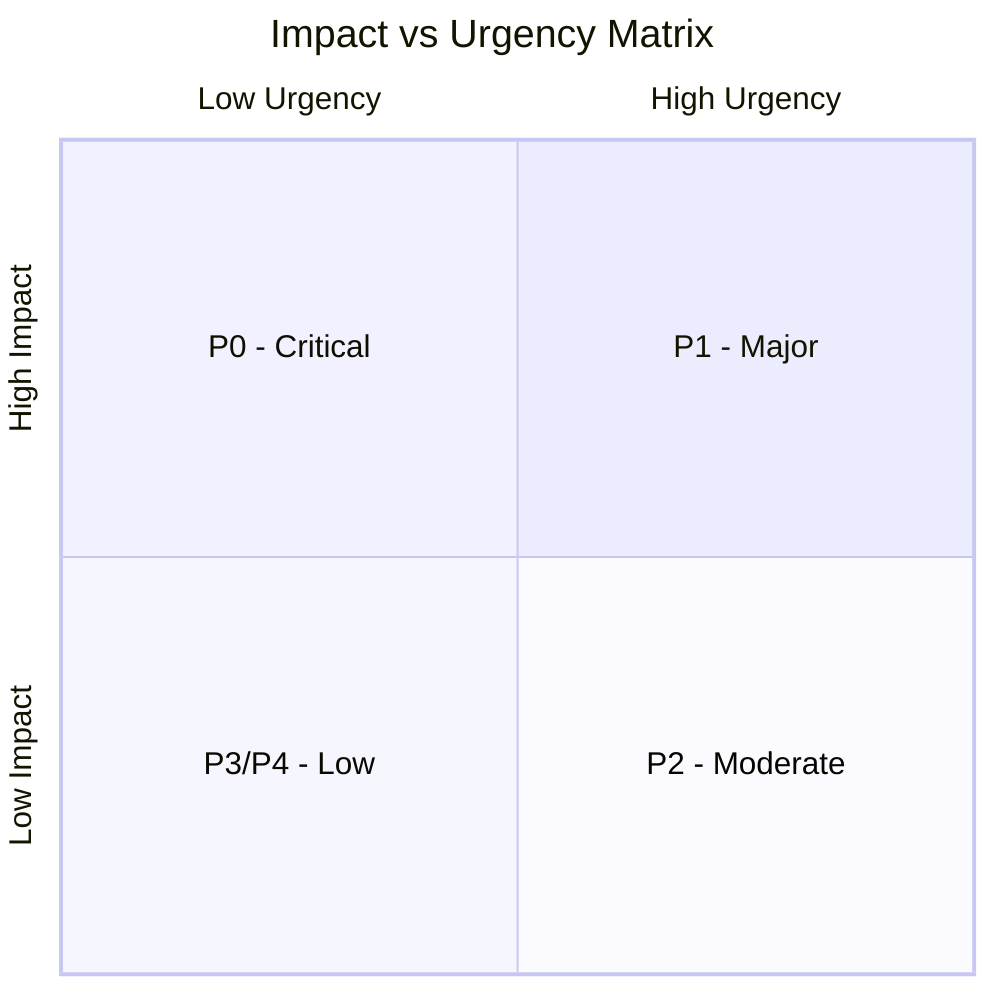
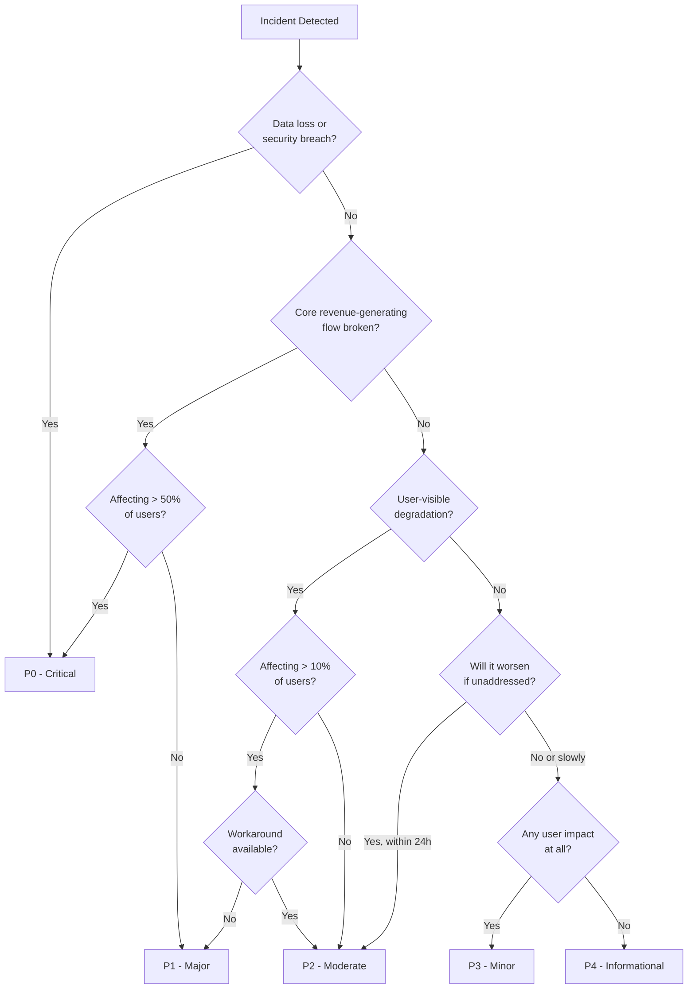

# Severity Levels

## Why It Exists

When an alert fires at 3 AM, the on-call engineer has approximately 30 seconds to decide: "Do I wake up and respond immediately, or can this wait until morning?" Without a clear severity classification, every alert feels equally urgent (or equally ignorable). The result is either chronic sleep deprivation from responding to non-critical issues, or missed critical incidents because the engineer has been conditioned to ignore pages.

Severity levels solve the classification problem by creating a shared language between monitoring systems, engineers, managers, and customers about how bad something is and how fast it needs to be fixed. A P0 at any company in the world means "drop everything" - that consistency is the value.

### Historical Context

The P0-P4 system evolved from the ITIL (Information Technology Infrastructure Library) incident priority framework developed in the 1980s by the UK government's CCTA. ITIL defined Impact (how many users affected) and Urgency (how quickly it needs resolution) as orthogonal dimensions, with Priority as their intersection. Google's SRE teams simplified this into a linear P0-P4 scale that maps directly to response expectations, and this became the industry standard.

The military analogy is useful: DEFCON levels (5 = normal, 1 = maximum readiness) inspired the severity inversion where lower numbers mean more severe. P0 is your DEFCON 1.

## First Principles

### The Two Dimensions of Severity

Every incident has two independent properties:

**Impact**: How much damage is occurring right now?
- Number of users affected
- Revenue impact per minute
- Data integrity risk
- Safety/compliance implications

**Urgency**: How quickly will the situation worsen if unaddressed?
- Is the system degrading further?
- Is there a cascading failure risk?
- Is there a compliance deadline?
- Is the blast radius expanding?

Severity is the synthesis of these two:

$$
\text{Severity} = f(\text{Impact}, \text{Urgency})
$$

### Impact-Urgency Matrix



| | High Urgency | Medium Urgency | Low Urgency |
|---|---|---|---|
| **High Impact** | **P0** - Critical | **P1** - Major | **P2** - Moderate |
| **Medium Impact** | **P1** - Major | **P2** - Moderate | **P3** - Minor |
| **Low Impact** | **P2** - Moderate | **P3** - Minor | **P4** - Informational |

## Core Mechanics

### The P0-P4 Classification System

#### P0 - Critical (All Hands on Deck)

**Definition**: Complete service outage or severe data integrity issue affecting all or most users. Immediate, sustained action required.

| Attribute | Value |
|-----------|-------|
| **Response Time** | < 5 minutes |
| **Update Cadence** | Every 15 minutes |
| **Escalation** | Immediate to VP of Engineering |
| **Customer Communication** | Status page update within 15 min |
| **War Room** | Mandatory |
| **Postmortem** | Required within 48 hours |
| **Example** | Production database down, payment processing failed for all users, data breach detected |

**Quantitative Thresholds**:
- Error rate > 50% for > 5 minutes
- Revenue-generating flow completely broken
- Data loss or corruption detected
- Security breach in progress

#### P1 - Major (Immediate Response)

**Definition**: Significant degradation affecting a large portion of users or a critical business function. Workaround may exist but is not acceptable long-term.

| Attribute | Value |
|-----------|-------|
| **Response Time** | < 15 minutes |
| **Update Cadence** | Every 30 minutes |
| **Escalation** | To engineering manager after 30 min |
| **Customer Communication** | Status page update within 30 min |
| **War Room** | If not resolved in 30 min |
| **Postmortem** | Required within 72 hours |
| **Example** | API latency > 10x normal, partial outage in one region, authentication intermittently failing |

**Quantitative Thresholds**:
- Error rate > 10% for > 10 minutes
- P99 latency > 10x SLO target
- Single region or availability zone completely down
- 30%+ of users experiencing degradation

#### P2 - Moderate (Business Hours Response)

**Definition**: Noticeable degradation for a subset of users, or a non-critical function is broken. Does not require immediate response but should be addressed during business hours.

| Attribute | Value |
|-----------|-------|
| **Response Time** | < 4 hours (business hours) |
| **Update Cadence** | Daily |
| **Escalation** | To team lead if unresolved in 24h |
| **Customer Communication** | Status page only if customer-reported |
| **War Room** | Not required |
| **Postmortem** | Optional (recommended if recurring) |
| **Example** | Admin dashboard slow, email notifications delayed, non-critical API endpoint returning errors for < 5% of requests |

**Quantitative Thresholds**:
- Error rate 1-10% sustained
- P99 latency 3-10x SLO target
- Non-critical feature completely broken
- < 10% of users affected

#### P3 - Minor (Next Sprint)

**Definition**: Minor issue with minimal user impact. Workaround available. Should be addressed but not urgently.

| Attribute | Value |
|-----------|-------|
| **Response Time** | < 1 business day |
| **Update Cadence** | Weekly |
| **Escalation** | Standard sprint prioritization |
| **Customer Communication** | Not required |
| **War Room** | Not required |
| **Postmortem** | Not required |
| **Example** | Cosmetic UI issue, log formatting error, deprecated API version showing wrong error message |

#### P4 - Informational (Backlog)

**Definition**: No current impact. Identified improvement opportunity, technical debt, or potential future issue.

| Attribute | Value |
|-----------|-------|
| **Response Time** | No SLA |
| **Update Cadence** | Quarterly review |
| **Escalation** | None |
| **Customer Communication** | Not applicable |
| **War Room** | Not applicable |
| **Postmortem** | Not applicable |
| **Example** | Dependency update available, configuration optimization opportunity, test coverage gap |

### Severity Decision Flow



## Implementation

### Automated Severity Classification

```typescript
interface IncidentSignal {
  errorRate: number;         // Current error rate (0-1)
  affectedUsers: number;     // Estimated affected users
  totalUsers: number;        // Total active users
  latencyMultiplier: number; // Current P99 / SLO P99
  isRevenueFlow: boolean;    // Affects revenue-generating path
  dataIntegrityRisk: boolean;// Potential data loss/corruption
  securityRisk: boolean;     // Security implications
  regionsAffected: number;   // Number of affected regions
  totalRegions: number;      // Total regions
  hasWorkaround: boolean;    // Known workaround exists
  isWorsening: boolean;      // Situation deteriorating
}

type Severity = 'P0' | 'P1' | 'P2' | 'P3' | 'P4';

interface ClassificationResult {
  severity: Severity;
  confidence: number;
  reasons: string[];
  responseTimeMinutes: number;
  escalationRequired: boolean;
  warRoomRequired: boolean;
  customerCommsRequired: boolean;
}

function classifyIncidentSeverity(signal: IncidentSignal): ClassificationResult {
  const reasons: string[] = [];
  let severity: Severity = 'P4';
  let confidence = 0.5;

  const userImpactPercent = (signal.affectedUsers / signal.totalUsers) * 100;
  const regionImpactPercent = (signal.regionsAffected / signal.totalRegions) * 100;

  // P0 conditions
  if (signal.securityRisk) {
    severity = 'P0';
    confidence = 0.95;
    reasons.push('Security risk detected');
  } else if (signal.dataIntegrityRisk) {
    severity = 'P0';
    confidence = 0.95;
    reasons.push('Data integrity risk detected');
  } else if (signal.errorRate > 0.5 && signal.isRevenueFlow) {
    severity = 'P0';
    confidence = 0.9;
    reasons.push(`Error rate ${(signal.errorRate * 100).toFixed(1)}% on revenue flow`);
  } else if (userImpactPercent > 50) {
    severity = 'P0';
    confidence = 0.85;
    reasons.push(`${userImpactPercent.toFixed(0)}% of users affected`);
  }
  // P1 conditions
  else if (signal.errorRate > 0.1 && signal.isRevenueFlow) {
    severity = 'P1';
    confidence = 0.85;
    reasons.push(`Error rate ${(signal.errorRate * 100).toFixed(1)}% on revenue flow`);
  } else if (userImpactPercent > 10 && !signal.hasWorkaround) {
    severity = 'P1';
    confidence = 0.8;
    reasons.push(`${userImpactPercent.toFixed(0)}% of users affected, no workaround`);
  } else if (signal.latencyMultiplier > 10) {
    severity = 'P1';
    confidence = 0.75;
    reasons.push(`Latency ${signal.latencyMultiplier.toFixed(1)}x above SLO`);
  } else if (regionImpactPercent >= 100 / signal.totalRegions * 100 && signal.totalRegions > 1) {
    severity = 'P1';
    confidence = 0.8;
    reasons.push(`Full region outage (${signal.regionsAffected}/${signal.totalRegions})`);
  }
  // P2 conditions
  else if (signal.errorRate > 0.01) {
    severity = 'P2';
    confidence = 0.8;
    reasons.push(`Error rate ${(signal.errorRate * 100).toFixed(2)}%`);
  } else if (userImpactPercent > 1) {
    severity = 'P2';
    confidence = 0.75;
    reasons.push(`${userImpactPercent.toFixed(1)}% of users affected`);
  } else if (signal.latencyMultiplier > 3) {
    severity = 'P2';
    confidence = 0.7;
    reasons.push(`Latency ${signal.latencyMultiplier.toFixed(1)}x above SLO`);
  }
  // P3 conditions
  else if (signal.affectedUsers > 0) {
    severity = 'P3';
    confidence = 0.7;
    reasons.push(`${signal.affectedUsers} users minimally affected`);
  }

  // Escalation adjustments
  if (signal.isWorsening && severity !== 'P0') {
    const previousSeverity = severity;
    severity = upgradeSeverity(severity);
    reasons.push(`Upgraded from ${previousSeverity}: situation worsening`);
    confidence *= 0.9; // Slightly less confident on upgraded severity
  }

  return {
    severity,
    confidence,
    reasons,
    responseTimeMinutes: getResponseTime(severity),
    escalationRequired: severity === 'P0' || severity === 'P1',
    warRoomRequired: severity === 'P0',
    customerCommsRequired: severity === 'P0' || severity === 'P1',
  };
}

function upgradeSeverity(severity: Severity): Severity {
  const upgrade: Record<Severity, Severity> = {
    P4: 'P3',
    P3: 'P2',
    P2: 'P1',
    P1: 'P0',
    P0: 'P0',
  };
  return upgrade[severity];
}

function getResponseTime(severity: Severity): number {
  const times: Record<Severity, number> = {
    P0: 5,
    P1: 15,
    P2: 240,
    P3: 480,
    P4: Infinity,
  };
  return times[severity];
}
```

### Severity-Aware Alert Router

```typescript
interface AlertNotification {
  alertName: string;
  severity: Severity;
  summary: string;
  description: string;
  labels: Record<string, string>;
  startsAt: Date;
  endsAt?: Date;
}

interface NotificationChannel {
  type: 'pagerduty' | 'slack' | 'email' | 'webhook' | 'sms';
  target: string;
  config?: Record<string, unknown>;
}

interface RoutingRule {
  severity: Severity;
  channels: NotificationChannel[];
  repeatInterval: number; // minutes
  autoEscalateAfter?: number; // minutes
  autoEscalateTo?: Severity;
}

const routingRules: RoutingRule[] = [
  {
    severity: 'P0',
    channels: [
      { type: 'pagerduty', target: 'primary-oncall' },
      { type: 'pagerduty', target: 'secondary-oncall' },
      { type: 'slack', target: '#incident-critical' },
      { type: 'sms', target: 'engineering-manager' },
      { type: 'email', target: 'engineering-leadership@company.com' },
    ],
    repeatInterval: 5,
    autoEscalateAfter: 15,
  },
  {
    severity: 'P1',
    channels: [
      { type: 'pagerduty', target: 'primary-oncall' },
      { type: 'slack', target: '#incident-major' },
      { type: 'email', target: 'team-oncall@company.com' },
    ],
    repeatInterval: 15,
    autoEscalateAfter: 30,
    autoEscalateTo: 'P0',
  },
  {
    severity: 'P2',
    channels: [
      { type: 'slack', target: '#alerts-moderate' },
      { type: 'email', target: 'team-oncall@company.com' },
    ],
    repeatInterval: 60,
    autoEscalateAfter: 240,
    autoEscalateTo: 'P1',
  },
  {
    severity: 'P3',
    channels: [
      { type: 'slack', target: '#alerts-low' },
    ],
    repeatInterval: 480,
  },
  {
    severity: 'P4',
    channels: [
      { type: 'email', target: 'team-backlog@company.com' },
    ],
    repeatInterval: 10080, // weekly
  },
];

class SeverityRouter {
  private rules: Map<Severity, RoutingRule>;
  private activeAlerts: Map<string, {
    notification: AlertNotification;
    acknowledgedAt?: Date;
    escalatedTo?: Severity;
    lastNotifiedAt: Date;
  }>;

  constructor(rules: RoutingRule[]) {
    this.rules = new Map(rules.map((r) => [r.severity, r]));
    this.activeAlerts = new Map();
  }

  async route(notification: AlertNotification): Promise<void> {
    const rule = this.rules.get(notification.severity);
    if (!rule) {
      console.error(`No routing rule for severity ${notification.severity}`);
      return;
    }

    this.activeAlerts.set(notification.alertName, {
      notification,
      lastNotifiedAt: new Date(),
    });

    // Send to all channels for this severity
    const results = await Promise.allSettled(
      rule.channels.map((channel) =>
        this.sendToChannel(channel, notification)
      )
    );

    // Log failures
    results.forEach((result, index) => {
      if (result.status === 'rejected') {
        console.error(
          `Failed to send to ${rule.channels[index].type}:${rule.channels[index].target}:`,
          result.reason
        );
      }
    });
  }

  /**
   * Check for alerts that need re-notification or auto-escalation
   */
  async checkEscalations(): Promise<void> {
    const now = new Date();

    for (const [alertName, state] of this.activeAlerts) {
      if (state.acknowledgedAt) continue; // Already acknowledged
      if (state.notification.endsAt) continue; // Resolved

      const rule = this.rules.get(
        state.escalatedTo ?? state.notification.severity
      );
      if (!rule) continue;

      const minutesSinceLastNotification =
        (now.getTime() - state.lastNotifiedAt.getTime()) / 60_000;

      // Auto-escalate if not acknowledged within threshold
      if (
        rule.autoEscalateAfter &&
        rule.autoEscalateTo &&
        minutesSinceLastNotification >= rule.autoEscalateAfter &&
        !state.escalatedTo
      ) {
        state.escalatedTo = rule.autoEscalateTo;
        const escalatedNotification = {
          ...state.notification,
          severity: rule.autoEscalateTo,
          summary: `[ESCALATED] ${state.notification.summary}`,
        };
        await this.route(escalatedNotification);
        continue;
      }

      // Re-notify at repeat interval
      if (minutesSinceLastNotification >= rule.repeatInterval) {
        state.lastNotifiedAt = now;
        await this.route(state.notification);
      }
    }
  }

  private async sendToChannel(
    channel: NotificationChannel,
    notification: AlertNotification
  ): Promise<void> {
    // Implementation would call PagerDuty API, Slack webhook, etc.
    console.log(
      `[${channel.type}] -> ${channel.target}: [${notification.severity}] ${notification.summary}`
    );
  }

  acknowledge(alertName: string): void {
    const state = this.activeAlerts.get(alertName);
    if (state) {
      state.acknowledgedAt = new Date();
    }
  }

  resolve(alertName: string): void {
    this.activeAlerts.delete(alertName);
  }
}
```

## Edge Cases and Failure Modes

### 1. Severity Inflation

Over time, teams tend to classify everything as P1 or P0 to ensure fast response. This is equivalent to having no severity system at all.

**Detection**: Track severity distribution over time. A healthy system has:
- P0: < 1 per month
- P1: 2-5 per month
- P2: 10-20 per month
- P3: 20-50 per month

If P0+P1 exceeds 30% of all incidents, severity inflation is occurring.

**Fix**: Quarterly severity calibration reviews where past incidents are re-classified with hindsight.

### 2. Severity Deflation

The opposite problem: teams under-classify to avoid the overhead of P0/P1 processes (war rooms, postmortems, status page updates).

**Detection**: Monitor mean time to detect (MTTD) and mean time to resolve (MTTR) for each severity. If P2 incidents have MTTR > 4 hours, many may be mis-classified P1s.

### 3. Ambiguous Multi-Service Impact

A database slowdown causes degradation across 20 microservices. Each service team sees minor impact (P3), but the aggregate user impact is P1. No single team escalates.

**Solution**: Implement aggregate severity detection:

```typescript
function checkAggregateImpact(
  activeIncidents: Array<{
    service: string;
    severity: Severity;
    affectedUsersPercent: number;
  }>
): Severity | null {
  // Sum affected users across all incidents
  const totalAffectedPercent = activeIncidents.reduce(
    (sum, i) => sum + i.affectedUsersPercent,
    0
  );

  // If aggregate impact exceeds threshold, escalate
  if (totalAffectedPercent > 30 && activeIncidents.length > 3) {
    return 'P1';
  }
  if (totalAffectedPercent > 50) {
    return 'P0';
  }

  // Check for correlated incidents (shared root cause)
  const servicesWithIncidents = new Set(activeIncidents.map((i) => i.service));
  if (servicesWithIncidents.size > 5) {
    return 'P1'; // Likely systemic issue
  }

  return null;
}
```

::: danger Severity Classification Anti-Patterns
1. **Using severity as priority**: Severity describes the current impact, not the business priority of fixing it. A P3 for a VIP customer may be higher priority than a P2 affecting free-tier users.
2. **Changing severity mid-incident**: If impact worsens, open a new incident at the higher severity. Changing severity mid-stream confuses metrics and communication.
3. **No downgrade path**: If impact decreases, you should be able to downgrade. Many teams lack this process.
4. **Customer-driven severity**: Letting customer complaints determine severity leads to squeaky-wheel bias. Use objective metrics.
5. **Ignoring blast radius**: Severity based on current impact ignoring potential for cascading failure.
:::

## Performance Characteristics

### Response Time by Severity

Industry benchmarks (from surveys of 500+ companies):

| Severity | Target Response | Actual Median | Actual P95 | Top Quartile |
|----------|----------------|---------------|-------------|-------------|
| P0 | 5 min | 8 min | 25 min | 4 min |
| P1 | 15 min | 22 min | 60 min | 12 min |
| P2 | 4 hours | 3.5 hours | 18 hours | 1.5 hours |
| P3 | 1 business day | 2.3 days | 14 days | 0.8 days |
| P4 | No SLA | 30 days | Never | 7 days |

### Cost Per Incident by Severity

$$
\text{Cost}_{P_i} = \text{Revenue Impact} + \text{Engineering Hours} \times \text{Hourly Rate} + \text{Customer Compensation} + \text{Reputation Damage}
$$

Typical ranges for a $50M ARR SaaS company:

| Severity | Revenue Impact | Engineering Cost | Customer Comp | Total Range |
|----------|---------------|-----------------|---------------|-------------|
| P0 | $5K-500K | $5K-20K | $1K-50K | $10K-570K |
| P1 | $1K-50K | $2K-10K | $500-5K | $3.5K-65K |
| P2 | $0-5K | $500-3K | $0-1K | $500-9K |
| P3 | $0-500 | $200-1K | $0 | $200-1.5K |
| P4 | $0 | $100-500 | $0 | $100-500 |

## Mathematical Foundations

### Optimal Severity Threshold Calibration

Given a cost function for each severity level and the probability distribution of incident impact:

$$
\theta^*_i = \arg\min_\theta \left[ C_{over}(i) \cdot P(\text{impact} < \theta | \text{classified as } P_i) + C_{under}(i) \cdot P(\text{impact} \geq \theta | \text{classified as } P_{i+1}) \right]
$$

Where:
- $C_{over}(i)$ = cost of over-classifying (unnecessary war room, wasted engineering time)
- $C_{under}(i)$ = cost of under-classifying (delayed response, customer impact)

For most organizations, $C_{under} \gg C_{over}$, which means thresholds should err toward higher severity.

### Queuing Theory for Incident Response

Incidents arrive as a Poisson process with rate $\lambda_i$ for severity $i$. Response time follows an Erlang distribution with $k$ stages (investigation, diagnosis, fix, verification).

Expected time in queue for severity $i$ with $s$ on-call engineers:

$$
W_q = \frac{P_0 \cdot (\lambda/\mu)^s}{s! \cdot (1 - \rho)^2 \cdot s\mu}
$$

Where $\rho = \lambda / (s\mu)$ is server utilization.

For a team with 2 on-call engineers, average incident arrival rate of 3/day, and average resolution time of 2 hours:

$$
\rho = \frac{3/24}{2 \times 1/2} = 0.125
$$

$$
W_q \approx \frac{(0.125)^2}{2 \times (1-0.125)^2 \times 1} \approx 0.01 \text{ hours} = 36 \text{ seconds}
$$

Low utilization means minimal queueing - which is correct for on-call. You want on-call engineers to be idle most of the time.

## Real-World War Stories

::: info War Story
**The P2 That Was Actually a P0 (2022)**

A SaaS company's monitoring showed a 0.1% increase in 500 errors on their authentication service. Automated classification: P3 (minor). The on-call engineer acknowledged it and planned to investigate in the morning.

What the classification missed: the 0.1% error rate was for the auth service as a whole, but 100% of new user signups were failing. The signup endpoint represented only 0.1% of total auth traffic, but was the most business-critical flow. By morning, 8 hours of signups were lost - approximately 2,400 potential customers.

**Fix**: Added business-criticality weighting to the severity classifier. Each endpoint was tagged with a business impact score. The signup endpoint's score of 10 (max) would have boosted this to at least P1 regardless of the aggregate error rate.
:::

::: info War Story
**The Severity Inflation Death Spiral (2021)**

A fintech team had a quarterly incident review and found that 73% of their incidents in Q3 were classified P0 or P1. The on-call engineers were averaging 4 pages per shift, all "critical." In reality, only 15% of those actually required immediate human intervention.

The cascade: teams started ignoring P0 pages like they ignored P1 pages. When a real P0 hit (database corruption during a migration), the mean time to response was 47 minutes instead of the target 5 minutes.

**Fix**: Implemented a "severity court" - a weekly 15-minute meeting where three senior engineers re-classified the past week's incidents using the impact-urgency matrix. Over 8 weeks, P0 incidents dropped from 73% to 8%, and MTTD for real P0s dropped to 6 minutes.
:::

## Decision Framework

### Choosing Between Severity Levels

| Question | P0 Answer | P1 Answer | P2 Answer | P3+ Answer |
|----------|-----------|-----------|-----------|------------|
| Is the CEO going to ask about this? | Very likely | Possibly | No | No |
| Would you wake up the entire team? | Yes | Some people | No | No |
| Is revenue being lost right now? | Yes, significantly | Some | Possibly minor | No |
| Will this be on HackerNews? | Could be | Unlikely | No | No |
| Is data being lost or corrupted? | Yes | No | No | No |
| Would a customer notice without us telling them? | Definitely | Probably | Maybe | No |

### Severity vs. Priority

Severity and priority are often confused but serve different purposes:

| | Severity | Priority |
|---|---|---|
| **Measures** | Current impact | Business importance of fixing |
| **Who decides** | Objective criteria / automated | Product/business stakeholders |
| **Changes during incident** | Only if impact changes | Can be adjusted based on context |
| **Drives** | Response time, communication | Resource allocation, scheduling |
| **Example** | "50% of users can't log in" (P0) | "Fix login before launching marketing campaign" (High Priority) |

A low-severity, high-priority issue: A typo on the pricing page (P4 severity, but CEO wants it fixed NOW).
A high-severity, low-priority issue: Production database is down, but it's a sandbox environment with no real users (P0 severity by metrics, but low actual priority).

## Advanced Topics

### Machine Learning Severity Classification

```typescript
interface IncidentFeatures {
  errorRate: number;
  latencyP99Ratio: number;
  affectedUsersFraction: number;
  isBusinessHours: boolean;
  dayOfWeek: number;
  serviceCategory: 'core' | 'supporting' | 'internal';
  recentDeployment: boolean;
  correlatedAlertCount: number;
  previousIncidentSeverity?: Severity;
  previousIncidentRecency?: number; // hours since last incident on same service
}

/**
 * Feature engineering for severity classification.
 * Transforms raw incident signals into ML-friendly features.
 */
function engineerFeatures(incident: IncidentFeatures): number[] {
  return [
    incident.errorRate,
    Math.log1p(incident.latencyP99Ratio),
    incident.affectedUsersFraction,
    incident.isBusinessHours ? 1 : 0,
    Math.sin((2 * Math.PI * incident.dayOfWeek) / 7), // Cyclical encoding
    Math.cos((2 * Math.PI * incident.dayOfWeek) / 7),
    incident.serviceCategory === 'core' ? 1 : 0,
    incident.serviceCategory === 'supporting' ? 0.5 : 0,
    incident.recentDeployment ? 1 : 0,
    Math.log1p(incident.correlatedAlertCount),
    incident.previousIncidentSeverity
      ? severityToNumber(incident.previousIncidentSeverity)
      : -1,
    incident.previousIncidentRecency
      ? Math.log1p(incident.previousIncidentRecency)
      : -1,
  ];
}

function severityToNumber(severity: Severity): number {
  const map: Record<Severity, number> = { P0: 4, P1: 3, P2: 2, P3: 1, P4: 0 };
  return map[severity];
}
```

### Dynamic Severity Based on Business Context

```typescript
interface BusinessContext {
  isMarketingCampaignActive: boolean;
  isQuarterEnd: boolean;
  isHolidaySeason: boolean;
  currentTrafficMultiplier: number;
  upcomingEvents: Array<{ name: string; hoursUntil: number }>;
}

function adjustSeverityForContext(
  baseSeverity: Severity,
  context: BusinessContext
): Severity {
  let adjusted = baseSeverity;

  // During active marketing campaigns, upgrade user-facing issues
  if (context.isMarketingCampaignActive && baseSeverity >= 'P2') {
    adjusted = upgradeSeverity(adjusted);
  }

  // Quarter-end for revenue-critical services
  if (context.isQuarterEnd && baseSeverity >= 'P2') {
    adjusted = upgradeSeverity(adjusted);
  }

  // High traffic periods get elevated severity
  if (context.currentTrafficMultiplier > 3 && baseSeverity >= 'P2') {
    adjusted = upgradeSeverity(adjusted);
  }

  // Imminent events
  const imminentEvent = context.upcomingEvents.find(
    (e) => e.hoursUntil < 4
  );
  if (imminentEvent && baseSeverity >= 'P2') {
    adjusted = upgradeSeverity(adjusted);
  }

  return adjusted;
}
```

## Cross-References

- [Alert Design](./alert-design.md) - How burn rates map to severity levels
- [Escalation Policies](./escalation-policies.md) - What happens after severity is assigned
- [Incident Classification](../incident-response/incident-classification.md) - Full incident classification framework
- [Communication Templates](../incident-response/communication-templates.md) - Severity-appropriate communication
- [War Room Procedures](../incident-response/war-room-procedures.md) - When severity triggers a war room
