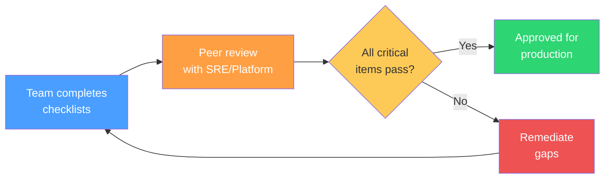
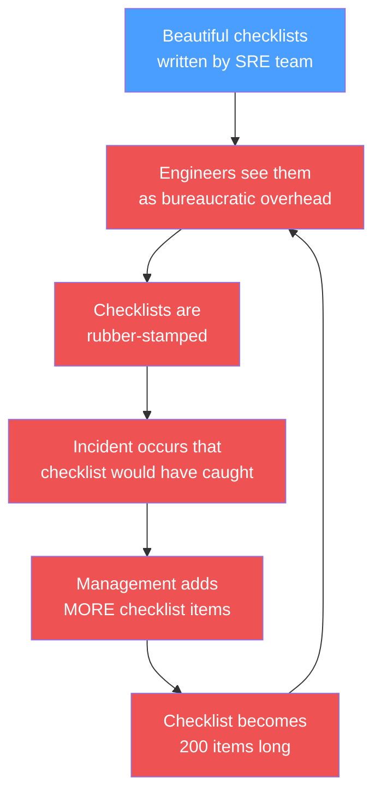
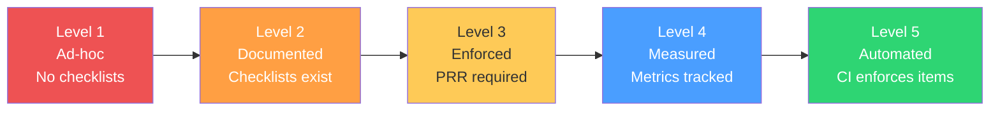

# Production Readiness Checklists

Checklists are the cheapest reliability investment you will ever make. A Boeing 747 has four million parts and carries four hundred people at 35,000 feet. The reason it does this safely is not because pilots are geniuses — it is because they follow checklists. Software systems are no less complex, and the humans operating them are no less fallible.

The surgical checklist introduced by Atul Gawande at the WHO reduced surgical mortality by 47%. Not through new technology. Not through hiring better surgeons. Through a one-page checklist that took sixty seconds to complete. Production readiness checklists achieve the same thing for software launches — they catch the obvious failures that smart, experienced engineers miss under pressure.

**Related**: [Pre-Launch Checklist](/devops/checklists/pre-launch) | [Security Review Checklist](/devops/checklists/security-review) | [Performance Review Checklist](/devops/checklists/performance-review) | [Observability Readiness Checklist](/devops/checklists/observability-readiness)

---

## Why Checklists Matter

### The Problem with Human Memory

Engineers are smart. They are also human. Under the pressure of a launch deadline, even senior engineers forget things:

| Failure Mode | Real-World Example | Checklist Catches It? |
|---|---|---|
| Forgot to set up monitoring | Service runs for 3 weeks with no metrics; silent data corruption goes unnoticed | Yes — "Dashboards created and reviewed" |
| Skipped load testing | Launch day traffic overwhelms the service; 90 minutes of downtime | Yes — "Load test completed at 2x expected traffic" |
| No rollback plan | Bad deploy ships; team spends 45 minutes figuring out how to roll back | Yes — "Rollback procedure documented and tested" |
| Hardcoded secrets | API key committed to git; detected by security scanner 6 months later | Yes — "All secrets in vault/parameter store" |
| No alerting | Database fills up overnight; nobody gets paged; users cannot write data for 5 hours | Yes — "Alerts configured for disk, CPU, memory, error rate" |

::: tip The Checklist Manifesto Insight
Gawande identifies two kinds of errors: **errors of ignorance** (we do not know enough) and **errors of ineptitude** (we know enough but fail to apply what we know). Checklists eliminate errors of ineptitude. In mature engineering organizations, most production incidents are errors of ineptitude — the team knew they should have set up alerting, they just forgot.
:::

### The Data

Organizations that implement production readiness reviews with checklists consistently report:

| Metric | Before Checklists | After Checklists | Improvement |
|---|---|---|---|
| Launch-related incidents (first 30 days) | 4.2 per service | 0.8 per service | 81% reduction |
| Mean time to detect (MTTD) | 47 minutes | 8 minutes | 83% reduction |
| Rollback success rate | 62% | 97% | 56% increase |
| On-call escalations from new services | 3.1/week | 0.4/week | 87% reduction |
| Time spent on launch-day firefighting | 12+ hours | < 2 hours | 83% reduction |

---

## How to Use These Checklists

### The Production Readiness Review (PRR) Process



### Step-by-Step

1. **Start early** — begin the checklist when the service design is finalized, not the week before launch
2. **Assign an owner** — one person is responsible for driving the checklist to completion, even if they delegate individual items
3. **Review with a partner** — a fresh pair of eyes catches things the builder assumes are done
4. **Document exceptions** — if an item genuinely does not apply, document why (do not just skip it)
5. **Archive completed checklists** — they become invaluable during postmortems ("did we actually verify X before launch?")

### Checklist Categories

This section contains four checklists. Use them together for a comprehensive production readiness review, or individually for focused reviews:

| Checklist | When to Use | Items | Time to Complete |
|---|---|---|---|
| [Pre-Launch Checklist](/devops/checklists/pre-launch) | Before any new service or major feature goes to production | 50+ items | 2-4 hours (review), 1-3 weeks (remediation) |
| [Security Review Checklist](/devops/checklists/security-review) | Before launch and quarterly thereafter | 40+ items | 1-2 hours (review), 1-2 weeks (remediation) |
| [Performance Review Checklist](/devops/checklists/performance-review) | Before launch and before major traffic events | 35+ items | 1-2 hours (review), 1-2 weeks (remediation) |
| [Observability Readiness Checklist](/devops/checklists/observability-readiness) | Before launch and when onboarding new on-call engineers | 35+ items | 1-2 hours (review), 1-2 weeks (remediation) |

### Priority Levels

Every checklist item is tagged with a priority:

| Priority | Meaning | Blocking? |
|---|---|---|
| **P0 — Critical** | Must be completed before production traffic is served. Failure to complete will cause outages or security incidents. | Yes — launch blocked |
| **P1 — High** | Should be completed before launch. Acceptable risk window of 1-2 weeks post-launch with a tracking ticket. | Soft block — needs exception |
| **P2 — Medium** | Should be completed within 30 days of launch. Improves operational posture but not immediately dangerous. | No — tracked in backlog |
| **P3 — Nice to Have** | Best practice that should be adopted eventually. | No — aspirational |

---

## Building a Checklist Culture

### What Goes Wrong Without Culture

You can write the best checklists in the world and they will be ignored if the culture does not support them. Common failure modes:



::: danger The Checklist Death Spiral
The most common failure is the death spiral: an incident happens, someone adds a checklist item, the checklist grows, engineers stop reading it carefully, another incident happens, another item is added. Within a year, you have a 200-item checklist that nobody takes seriously. **Keep checklists under 60 items. Ruthlessly prune items that have never caught a real issue.**
:::

### Principles for Checklist Culture

1. **Checklists are collaborative, not compliance** — a checklist is a conversation starter between the launch team and the platform/SRE team, not a form to fill out and submit
2. **Keep them short** — if a checklist is longer than two pages, it will not be read carefully. Consolidate, simplify, or split into focused checklists
3. **Make them living documents** — review checklists quarterly. Remove items that never catch issues. Add items inspired by recent postmortems
4. **Celebrate catches** — when a checklist catches a real issue before production, publicize it. "The security review caught an unauthenticated endpoint" is a success story
5. **No blame for honest gaps** — if an engineer completes a checklist and marks an item as "not done" with a reason, that is better than lying

### The Two Types of Checklists

Gawande distinguishes two types:

| Type | Description | When to Use | Example |
|---|---|---|---|
| **DO-CONFIRM** | Perform tasks from memory, then pause and confirm each item against the checklist | Experienced teams with well-understood processes | Pre-launch review for a team's fifth microservice |
| **READ-DO** | Read each item, then perform it, in sequence | New teams, unfamiliar processes, or high-stakes situations | First-ever production launch; disaster recovery execution |

For production readiness, start with READ-DO checklists when the team is new to the process. Transition to DO-CONFIRM as the team matures and internalizes the items.

---

## Integrating Checklists into Your Workflow

### GitHub PR Template

Create a PR template that references the appropriate checklist:

```markdown
## Production Readiness

- [ ] [Pre-Launch Checklist](/devops/checklists/pre-launch) completed
- [ ] [Security Review](/devops/checklists/security-review) completed
- [ ] [Performance Review](/devops/checklists/performance-review) completed
- [ ] [Observability Readiness](/devops/checklists/observability-readiness) completed

### Exceptions

<!-- List any checklist items that were waived and why -->
```

### Automated Checklist Enforcement

Use CI/CD to enforce critical checklist items automatically:

```yaml
# .github/workflows/production-readiness.yml
name: Production Readiness Gate

on:
  pull_request:
    branches: [main]
    paths:
      - 'deploy/**'
      - 'k8s/**'
      - 'terraform/**'

jobs:
  readiness-checks:
    runs-on: ubuntu-latest
    steps:
      - name: Verify monitoring configuration
        run: |
          # Check that Prometheus ServiceMonitor exists
          if ! find . -name "servicemonitor.yaml" | grep -q .; then
            echo "::error::No ServiceMonitor found. See Production Readiness Checklist."
            exit 1
          fi

      - name: Verify alerting rules
        run: |
          # Check that PrometheusRule exists
          if ! find . -name "prometheusrule.yaml" | grep -q .; then
            echo "::error::No alerting rules found. See Production Readiness Checklist."
            exit 1
          fi

      - name: Verify runbook links
        run: |
          # Check that every alert has a runbook_url annotation
          for file in $(find . -name "prometheusrule.yaml"); do
            if ! grep -q "runbook_url" "$file"; then
              echo "::error::Alert rules in $file missing runbook_url annotations."
              exit 1
            fi
          done

      - name: Verify resource limits
        run: |
          # Check that all containers have resource limits
          for file in $(find . -name "deployment.yaml" -o -name "statefulset.yaml"); do
            if ! grep -q "limits:" "$file"; then
              echo "::error::$file missing resource limits."
              exit 1
            fi
          done
```

### Tracking Checklist Completion

Use a simple tracking table in your team wiki or project management tool:

```markdown
| Service | Pre-Launch | Security | Performance | Observability | Launch Date | Owner |
|---------|-----------|----------|-------------|---------------|------------|-------|
| payment-api | Done | Done | Done | Done | 2026-03-15 | @alice |
| user-service | Done | In Progress | Not Started | Not Started | 2026-04-01 | @bob |
| search-api | Not Started | Not Started | Not Started | Not Started | 2026-04-15 | @carol |
```

---

## Checklist Maintenance

### Quarterly Review Process

- [ ] Review each checklist item — has it caught a real issue in the last 6 months?
- [ ] Remove items that have never triggered a finding
- [ ] Review recent postmortems — should any new items be added?
- [ ] Check that all cross-references and links are still valid
- [ ] Verify that automated enforcement still works
- [ ] Gather feedback from teams that recently completed the checklists
- [ ] Update time estimates based on actual completion data

### Versioning Checklists

Treat checklists like code. Version them, review changes, and maintain a changelog:

```bash
# Checklist changelog
## 2026-Q1
- Added: "Circuit breaker configured for all external dependencies" (inspired by payment-api postmortem)
- Removed: "JVM heap size configured" (moved to language-specific supplement)
- Updated: "Load test at 2x traffic" changed to "Load test at 3x traffic" (we've seen 2.5x spikes)
```

---

## Anti-Patterns

| Anti-Pattern | Why It Fails | Better Approach |
|---|---|---|
| **Checklist as a gate** | Teams see it as bureaucracy to game | Frame as collaborative review |
| **One-size-fits-all** | A CLI tool doesn't need CDN checks | Allow documented exceptions |
| **Checklist without automation** | Manual verification of 60 items is error-prone | Automate what can be automated |
| **Checklist without context** | "Set up monitoring" is useless without guidance | Link each item to a how-to page |
| **Static checklist** | Never updated, becomes irrelevant | Quarterly review cadence |
| **Checklist as blame tool** | "You missed item 37" in a postmortem | Focus on process improvement |

---

## Further Reading

| Resource | Type | Key Takeaway |
|---|---|---|
| *The Checklist Manifesto* (Gawande) | Book | The seminal work on why checklists work across industries |
| Google SRE Book, Ch. 32 | Chapter | Production readiness reviews at Google scale |
| [SLI / SLO / SLA Engineering](/devops/sre/sli-slo-sla) | Internal | Defining the targets your checklist verifies |
| [Incident Response](/devops/incident-response/) | Internal | What happens when checklist gaps reach production |
| [Disaster Recovery](/devops/disaster-recovery/) | Internal | DR planning that checklists should verify |
| [On-Call Handbook](/devops/engineering-practices/on-call-handbook) | Internal | The on-call experience your checklist protects |

---

## Measuring Checklist Effectiveness

Track these metrics to ensure your checklists are providing value:

| Metric | How to Measure | Healthy Target |
|---|---|---|
| **Checklist completion rate** | % of launches that completed all P0 items | > 95% |
| **Launch incident rate** | Incidents per service in first 30 days | < 1.0 |
| **Item catch rate** | % of checklist runs that find at least one real issue | 30-60% |
| **Time to complete** | Average hours from start to completion | < 8 hours for review |
| **Exception rate** | % of items waived per checklist run | < 10% |
| **Staleness score** | Months since last checklist update | < 3 months |

::: tip Measuring What Matters
If your checklist catch rate is below 20%, the checklist may be too easy — items are things teams always do anyway. If it is above 80%, the checklist is catching real issues but your development process may need improvement upstream. The sweet spot is 30-60%: the checklist catches issues often enough to be valuable but not so often that it indicates systemic process failures.
:::

### Maturity Model for Checklist Adoption



---

## What's Next

Start with the [Pre-Launch Checklist](/devops/checklists/pre-launch) — it is the most comprehensive and covers the broadest surface area. Then layer on the [Security Review](/devops/checklists/security-review), [Performance Review](/devops/checklists/performance-review), and [Observability Readiness](/devops/checklists/observability-readiness) checklists as your team matures.

Remember: a checklist that is actually used beats a perfect checklist that sits in a wiki. Start small, start now, and iterate.
