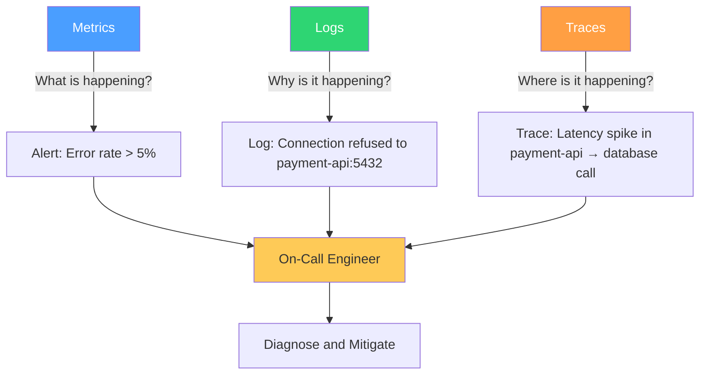
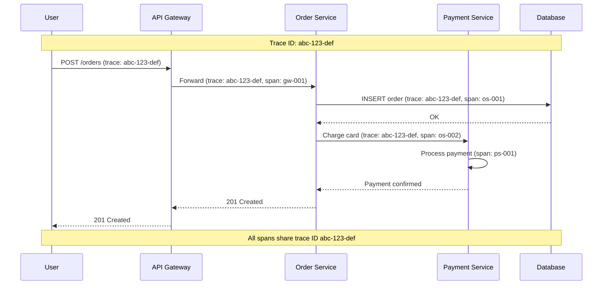

# Observability Readiness Checklist

A service without observability is a service you cannot operate. When something goes wrong — and it will — you need to answer three questions in under five minutes: *What is broken?* *Since when?* *What is the blast radius?* If you cannot answer those questions from your dashboards, logs, and traces, you are flying blind.

This checklist ensures that before your service takes production traffic, the observability foundation is solid enough that an on-call engineer who has never seen this service before can diagnose and mitigate an issue at 3 AM.

**Related**: [Monitoring Overview](/devops/monitoring/) | [Structured Logging](/devops/logging/structured-logging) | [Alert Design](/devops/alerting/alert-design) | [SLI / SLO / SLA Engineering](/devops/sre/sli-slo-sla) | [On-Call Handbook](/devops/engineering-practices/on-call-handbook)

---

## The Three Pillars

Your observability stack must cover all three pillars. Each pillar answers a different question:



| Pillar | Tool | Storage | Query Language | Retention |
|---|---|---|---|---|
| **Metrics** | Prometheus / Datadog / CloudWatch | TSDB | PromQL / DQL | 15-90 days (raw), 1-2 years (downsampled) |
| **Logs** | Loki / Elasticsearch / CloudWatch Logs | Object store / Index | LogQL / KQL | 30-90 days (hot), 1 year+ (cold) |
| **Traces** | Jaeger / Tempo / X-Ray | Object store | TraceQL | 7-30 days |

::: tip OpenTelemetry Convergence
OpenTelemetry (OTel) is the industry standard for instrumentation. It provides a single SDK for metrics, logs, and traces — so you instrument once and send data to whatever backend you choose. If you are starting fresh, use OTel. If you have existing instrumentation, plan a migration.
:::

---

## 1. Metrics Instrumentation

- [ ] **1.1** (P0) — RED metrics instrumented for every endpoint:
  - **R**ate — requests per second
  - **E**rrors — error rate (4xx, 5xx)
  - **D**uration — latency percentiles (p50, p95, p99)
- [ ] **1.2** (P0) — USE metrics instrumented for infrastructure:
  - **U**tilization — CPU, memory, disk, network usage
  - **S**aturation — queue depth, thread pool saturation
  - **E**rrors — hardware errors, OOM kills
- [ ] **1.3** (P0) — Health check endpoint implemented (`/healthz`, `/readyz`)
- [ ] **1.4** (P1) — Business metrics tracked (signups/sec, orders/min, API calls by customer tier)
- [ ] **1.5** (P1) — Metric names follow a consistent naming convention (`{namespace}_{subsystem}_{name}_{unit}`)
- [ ] **1.6** (P1) — Histogram buckets configured for expected latency distribution
- [ ] **1.7** (P2) — Custom metrics for service-specific operational concerns

```python
# Example: OpenTelemetry metrics instrumentation (Python)
from opentelemetry import metrics
from opentelemetry.sdk.metrics import MeterProvider
from opentelemetry.sdk.metrics.export import PeriodicExportingMetricReader
from opentelemetry.exporter.otlp.proto.grpc.metric_exporter import OTLPMetricExporter

# Initialize
reader = PeriodicExportingMetricReader(OTLPMetricExporter())
provider = MeterProvider(metric_readers=[reader])
metrics.set_meter_provider(provider)

meter = metrics.get_meter("my-service", "1.0.0")

# RED metrics
request_counter = meter.create_counter(
    name="http_requests_total",
    description="Total HTTP requests",
    unit="requests",
)

request_duration = meter.create_histogram(
    name="http_request_duration_seconds",
    description="HTTP request duration in seconds",
    unit="s",
)

# Business metrics
orders_counter = meter.create_counter(
    name="business_orders_total",
    description="Total orders placed",
    unit="orders",
)

# Usage in middleware
def metrics_middleware(request, call_next):
    start = time.time()
    response = call_next(request)
    duration = time.time() - start

    request_counter.add(1, {
        "method": request.method,
        "path": request.url.path,
        "status": str(response.status_code),
    })
    request_duration.record(duration, {
        "method": request.method,
        "path": request.url.path,
    })
    return response
```

### Metric Naming Convention

| Pattern | Example | Description |
|---|---|---|
| `{namespace}_http_requests_total` | `myservice_http_requests_total` | Counter: total requests |
| `{namespace}_http_request_duration_seconds` | `myservice_http_request_duration_seconds` | Histogram: request latency |
| `{namespace}_db_connections_active` | `myservice_db_connections_active` | Gauge: active DB connections |
| `{namespace}_queue_depth` | `myservice_queue_depth` | Gauge: messages waiting |
| `{namespace}_cache_hits_total` | `myservice_cache_hits_total` | Counter: cache hits |

---

## 2. Dashboards

- [ ] **2.1** (P0) — Service overview dashboard created with RED metrics and key health indicators
- [ ] **2.2** (P0) — Dashboard is accessible to all on-call engineers (no special permissions needed at 3 AM)
- [ ] **2.3** (P1) — Dashboard has a "first five things to check" section at the top
- [ ] **2.4** (P1) — Dashboard includes dependency health (status of upstream/downstream services)
- [ ] **2.5** (P1) — Dashboard includes recent deployments overlay (correlate deploys with metric changes)
- [ ] **2.6** (P2) — Business metrics dashboard for product/management stakeholders
- [ ] **2.7** (P2) — Dashboard templates standardized across all services

### Dashboard Layout Template

```
┌─────────────────────────────────────────────────────────────────┐
│  SERVICE OVERVIEW: my-service                                    │
│  Status: HEALTHY | Last Deploy: 2h ago | On-Call: @alice         │
├─────────────────────────────────────────────────────────────────┤
│                    FIRST FIVE THINGS TO CHECK                    │
│  ┌───────────┐  ┌───────────┐  ┌───────────┐  ┌───────────┐    │
│  │ Error Rate│  │ P99 Latency│  │ Request   │  │ CPU Usage │    │
│  │   0.02%   │  │   142ms   │  │  Rate     │  │   34%     │    │
│  │   ✅ OK   │  │   ✅ OK    │  │  850 RPS  │  │   ✅ OK   │    │
│  └───────────┘  └───────────┘  └───────────┘  └───────────┘    │
├──────────────────────┬──────────────────────────────────────────┤
│  RED METRICS         │  INFRASTRUCTURE                          │
│  ┌────────────────┐  │  ┌────────────────┐                      │
│  │ Request Rate   │  │  │ CPU / Memory   │                      │
│  │ (graph)        │  │  │ (graph)        │                      │
│  └────────────────┘  │  └────────────────┘                      │
│  ┌────────────────┐  │  ┌────────────────┐                      │
│  │ Error Rate     │  │  │ DB Connections │                      │
│  │ (graph)        │  │  │ (graph)        │                      │
│  └────────────────┘  │  └────────────────┘                      │
│  ┌────────────────┐  │  ┌────────────────┐                      │
│  │ Latency p50/99 │  │  │ Disk / Network │                      │
│  │ (graph)        │  │  │ (graph)        │                      │
│  └────────────────┘  │  └────────────────┘                      │
├──────────────────────┴──────────────────────────────────────────┤
│  DEPENDENCIES                                                    │
│  PostgreSQL: ✅  |  Redis: ✅  |  Payment API: ✅  |  S3: ✅     │
├─────────────────────────────────────────────────────────────────┤
│  RECENT DEPLOYMENTS (annotations on all graphs above)            │
│  • 2h ago: v2.3.1 (commit abc123) by @bob                       │
│  • 1d ago: v2.3.0 (commit def456) by @alice                     │
└─────────────────────────────────────────────────────────────────┘
```

```promql
# Key PromQL queries for the overview dashboard

# Request rate (RPS)
sum(rate(http_requests_total{service="my-service"}[5m]))

# Error rate (%)
sum(rate(http_requests_total{service="my-service",status=~"5.."}[5m]))
/
sum(rate(http_requests_total{service="my-service"}[5m]))

# P99 latency
histogram_quantile(0.99,
  sum(rate(http_request_duration_seconds_bucket{service="my-service"}[5m])) by (le)
)

# Active database connections
myservice_db_connections_active

# Error budget remaining (30-day window)
1 - (
  sum(rate(http_requests_total{service="my-service",status=~"5.."}[30d]))
  /
  sum(rate(http_requests_total{service="my-service"}[30d]))
) / (1 - 0.999)  # SLO target: 99.9%
```

---

## 3. Alerting

- [ ] **3.1** (P0) — Critical alerts configured:
  - Service completely down (0 successful responses for 2 minutes)
  - Error rate > 5% for 5 minutes
  - P99 latency > SLO for 10 minutes
  - Disk usage > 85%
- [ ] **3.2** (P0) — Alert routing configured to the correct on-call team in PagerDuty/OpsGenie
- [ ] **3.3** (P0) — Every alert has a `runbook_url` annotation linking to the runbook
- [ ] **3.4** (P1) — Warning alerts configured for early detection:
  - Error rate > 1% for 15 minutes
  - P99 latency > 80% of SLO
  - Disk usage > 70%
  - Certificate expiry < 30 days
- [ ] **3.5** (P1) — Alert thresholds validated against baseline metrics (no false positives from day one)
- [ ] **3.6** (P1) — Alert notification includes context: current value, threshold, dashboard link, runbook link
- [ ] **3.7** (P2) — Alert silencing/snoozing procedure documented for maintenance windows

```yaml
# Example: Alert with full context
apiVersion: monitoring.coreos.com/v1
kind: PrometheusRule
metadata:
  name: my-service-alerts
spec:
  groups:
    - name: my-service.critical
      rules:
        - alert: MyServiceDown
          expr: |
            sum(rate(http_requests_total{service="my-service",status="200"}[2m])) == 0
            AND
            sum(rate(http_requests_total{service="my-service"}[2m])) > 0
          for: 2m
          labels:
            severity: critical
            team: platform
          annotations:
            summary: "my-service is returning zero successful responses"
            description: |
              my-service has returned 0 successful (200) responses in the last 2 minutes
              while still receiving traffic. Current error rate: {​{ $value | humanizePercentage }​}
            dashboard: "https://grafana.example.com/d/my-service/overview"
            runbook_url: "https://wiki.example.com/runbooks/my-service/service-down"

    - name: my-service.warning
      rules:
        - alert: MyServiceHighLatency
          expr: |
            histogram_quantile(0.99,
              sum(rate(http_request_duration_seconds_bucket{service="my-service"}[5m])) by (le)
            ) > 0.5
          for: 10m
          labels:
            severity: warning
            team: platform
          annotations:
            summary: "my-service P99 latency above 500ms"
            description: |
              P99 latency is {​{ $value | humanizeDuration }​} (threshold: 500ms).
              This is {​{ $value | humanizePercentage }​} of the SLO target.
            dashboard: "https://grafana.example.com/d/my-service/overview?var-view=latency"
            runbook_url: "https://wiki.example.com/runbooks/my-service/high-latency"
```

::: warning Alert Fatigue Kills
If your on-call engineer receives more than 2 pages per shift that do not require action, they will start ignoring pages. Every alert must be:
1. **Actionable** — there is something the on-call can do right now
2. **Relevant** — it indicates a real problem, not a transient blip
3. **Urgent** — it requires attention now, not tomorrow

If an alert does not meet all three criteria, it should be a warning (Slack notification), not a page.
:::

---

## 4. Distributed Tracing

- [ ] **4.1** (P1) — Tracing SDK installed and configured (OpenTelemetry preferred)
- [ ] **4.2** (P1) — Trace context propagated across all service boundaries (HTTP headers, message queues)
- [ ] **4.3** (P1) — Key spans annotated with business context (user ID, order ID, customer tier)
- [ ] **4.4** (P1) — Sampling strategy configured (head-based or tail-based)
- [ ] **4.5** (P2) — Trace-to-log correlation: trace ID appears in log entries
- [ ] **4.6** (P2) — Trace-to-metrics correlation: exemplars link metrics to traces
- [ ] **4.7** (P2) — Service map generated from trace data



### Sampling Strategy Guide

| Strategy | Trace Rate | Cost | Best For |
|---|---|---|---|
| **Always sample** | 100% | $$$$ | Development, low-traffic services |
| **Probabilistic** | 1-10% | $$ | Medium-traffic services |
| **Rate-limited** | N traces/sec | $$ | High-traffic services |
| **Tail-based** | 100% decision at completion | $$$ | Capturing all errors and slow requests |

::: tip Start with Tail-Based Sampling
Tail-based sampling waits until a trace completes, then decides whether to keep it. This means you always capture error traces and slow traces (the ones you actually need for debugging), while sampling down healthy traffic. The tradeoff is higher memory usage in the collector.
:::

---

## 5. Structured Logging

- [ ] **5.1** (P0) — All logs are structured JSON (not plain text) with consistent field names
- [ ] **5.2** (P0) — Every log entry includes: `timestamp`, `level`, `service`, `message`, `request_id`
- [ ] **5.3** (P0) — Correlation ID (`request_id`) propagated across all service calls
- [ ] **5.4** (P0) — Sensitive data redacted from logs (passwords, tokens, PII, credit card numbers)
- [ ] **5.5** (P1) — Log levels used consistently:
  - `ERROR` — something failed that should not have (requires investigation)
  - `WARN` — something unexpected but handled (worth monitoring)
  - `INFO` — significant business events (order placed, user registered)
  - `DEBUG` — detailed diagnostic info (disabled in production by default)
- [ ] **5.6** (P1) — Logs searchable within 60 seconds of emission (near-real-time ingestion)
- [ ] **5.7** (P2) — Log-based metrics extracted for alerting (error count by type, specific error patterns)

```json
{
  "timestamp": "2026-03-20T10:30:00.123Z",
  "level": "ERROR",
  "service": "order-service",
  "version": "2.3.1",
  "environment": "production",
  "request_id": "req-abc-123",
  "trace_id": "trace-def-456",
  "span_id": "span-ghi-789",
  "user_id": "usr-12345",
  "message": "Failed to process payment",
  "error": {
    "type": "PaymentGatewayTimeout",
    "message": "Connection timed out after 10000ms",
    "stack": "PaymentGatewayTimeout: Connection timed out...\n  at PaymentClient.charge (payment.js:42)\n  at OrderService.processOrder (order.js:87)"
  },
  "context": {
    "order_id": "ord-67890",
    "amount_cents": 4999,
    "payment_method": "card_****1234",
    "retry_attempt": 2,
    "circuit_breaker_state": "half-open"
  }
}
```

---

## 6. SLO Tracking

- [ ] **6.1** (P0) — SLOs defined for the service ([SLI / SLO / SLA guide](/devops/sre/sli-slo-sla))
- [ ] **6.2** (P1) — Error budget calculated and displayed on the dashboard
- [ ] **6.3** (P1) — Error budget burn rate alerts configured:
  - Fast burn: consuming > 2% of budget/hour (page immediately)
  - Slow burn: consuming > 5% of budget/day (warning notification)
- [ ] **6.4** (P2) — Error budget policy documented (what happens when budget is exhausted)
- [ ] **6.5** (P2) — SLO reports generated monthly for stakeholders

| SLO | Target | Error Budget (30 days) | Budget in Minutes |
|---|---|---|---|
| Availability | 99.9% | 0.1% of requests can fail | ~43 minutes of downtime |
| P99 Latency | < 500ms | 1% of requests can exceed | ~432 minutes of slow requests |
| Correctness | 99.99% | 0.01% of responses can be incorrect | ~4.3 minutes of wrong answers |

```promql
# Error budget remaining (availability SLO: 99.9%, 30-day window)
# Returns 1.0 when full, 0 when exhausted, negative when overspent

1 - (
  (
    1 - (
      sum(rate(http_requests_total{service="my-service",status!~"5.."}[30d]))
      /
      sum(rate(http_requests_total{service="my-service"}[30d]))
    )
  ) / (1 - 0.999)
)
```

---

## 7. Runbooks

- [ ] **7.1** (P0) — Runbook exists for every critical alert ([Runbook Collection](/devops/runbooks/))
- [ ] **7.2** (P0) — Runbooks are linked from alert annotations (clickable link in the page notification)
- [ ] **7.3** (P1) — Runbooks follow a standard template (symptoms, diagnosis, mitigation, escalation)
- [ ] **7.4** (P1) — Runbooks include actual commands, not just descriptions ("Run `kubectl rollout restart` not "Restart the service")
- [ ] **7.5** (P2) — Runbooks reviewed and updated after every incident involving the service
- [ ] **7.6** (P2) — Runbooks tested during game days

### Runbook Template

```markdown
# Alert: [Alert Name]

## Severity
Critical / Warning

## Symptoms
What does this alert mean? What is the user-facing impact?

## Diagnosis
Step-by-step commands to identify the root cause:

1. Check the dashboard: [link]
2. Check recent deployments: `kubectl rollout history deployment/my-service -n production`
3. Check logs: `kubectl logs -l app=my-service -n production --tail=100 | grep ERROR`
4. Check dependencies: [links to dependency dashboards]

## Mitigation
Ordered list of actions to restore service:

1. **If caused by recent deploy**: `kubectl rollout undo deployment/my-service -n production`
2. **If dependency is down**: Enable circuit breaker fallback [link]
3. **If traffic spike**: Scale up: `kubectl scale deployment/my-service --replicas=20 -n production`

## Escalation
- Primary on-call: [team] via PagerDuty
- Secondary: [manager name]
- VP escalation (> 30 min): [VP name]
```

---

## 8. On-Call Readiness

- [ ] **8.1** (P0) — On-call rotation established with at least 2 engineers
- [ ] **8.2** (P0) — On-call engineers have access to all dashboards, logs, and deployment tools
- [ ] **8.3** (P0) — On-call engineers have completed a walkthrough of the service architecture
- [ ] **8.4** (P1) — On-call handoff document maintained (known issues, recent changes, upcoming risks)
- [ ] **8.5** (P1) — On-call shadow shift completed for new engineers before primary on-call
- [ ] **8.6** (P2) — On-call retrospective held monthly to improve the experience

### On-Call Onboarding Checklist

| Step | Action | Verified By |
|---|---|---|
| 1 | PagerDuty/OpsGenie account created and phone verified | |
| 2 | Added to on-call rotation schedule | |
| 3 | Grafana access verified — can view all service dashboards | |
| 4 | Log access verified — can search logs in Kibana/Loki | |
| 5 | kubectl access verified — can view pods and logs in production | |
| 6 | VPN access verified — can connect from home | |
| 7 | Runbooks read for all services in rotation | |
| 8 | Shadow shift completed (1 week alongside experienced on-call) | |
| 9 | Escalation contacts known and saved in phone | |
| 10 | Can demonstrate: find error logs, check dashboard, rollback deployment | |

---

## 9. Escalation Policy

- [ ] **9.1** (P0) — Escalation policy defined and configured in PagerDuty/OpsGenie
- [ ] **9.2** (P0) — Escalation timeline documented:


- [ ] **9.3** (P1) — Severity-based escalation rules:

| Severity | Response Time | Escalation After | Communication Channel |
|---|---|---|---|
| **SEV1** (service down) | 5 minutes | 15 min no ack → manager | Incident Slack channel + bridge call |
| **SEV2** (degraded) | 15 minutes | 30 min no ack → manager | Incident Slack channel |
| **SEV3** (minor impact) | 1 hour | Next business day | Team Slack channel |
| **SEV4** (no impact) | Next business day | N/A | Ticket |

- [ ] **9.4** (P1) — Escalation tested: verify page reaches primary, secondary, and manager
- [ ] **9.5** (P2) — Cross-team escalation paths documented (when to involve database team, network team, security team)

---

## Observability Readiness Summary

| Section | P0 Items | Total Items | Key Risk If Missing |
|---|---|---|---|
| Metrics Instrumentation | 3 | 7 | Cannot detect problems |
| Dashboards | 2 | 7 | Cannot diagnose problems |
| Alerting | 3 | 7 | Nobody knows there is a problem |
| Distributed Tracing | 0 | 7 | Cannot find where the problem is |
| Structured Logging | 4 | 7 | Cannot understand why the problem happened |
| SLO Tracking | 1 | 5 | Cannot measure reliability objectively |
| Runbooks | 2 | 6 | On-call engineer has no guidance |
| On-Call Readiness | 3 | 6 | Nobody can respond to problems |
| Escalation Policy | 2 | 5 | Unresolved problems persist |
| **Total** | **20** | **57** | |

::: danger The 3 AM Test
The ultimate test of observability readiness: Can an on-call engineer who was woken up at 3 AM, has never worked on this service before, and is operating on four hours of sleep — can they diagnose and mitigate an issue within 15 minutes using your dashboards, alerts, logs, and runbooks? If not, your observability is not ready.
:::
