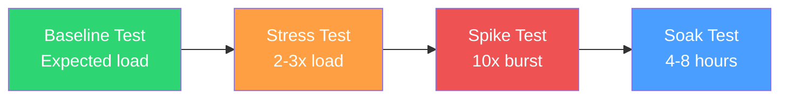
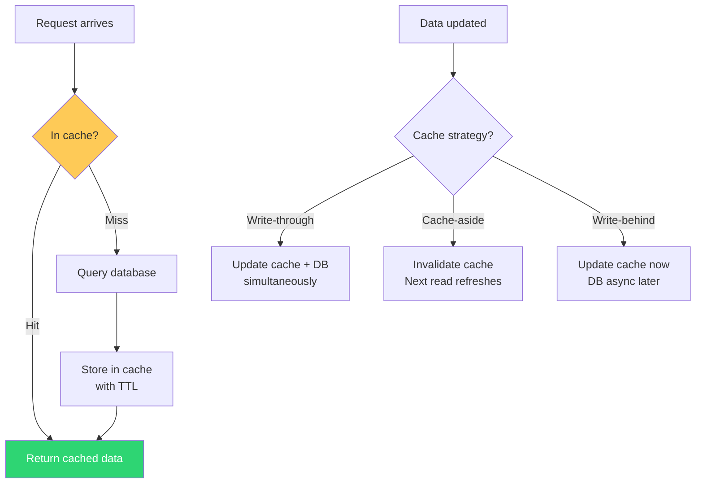
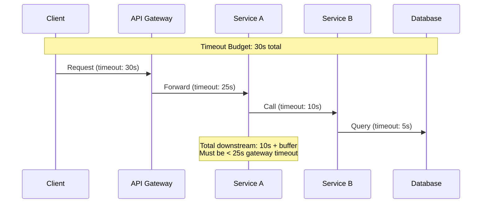
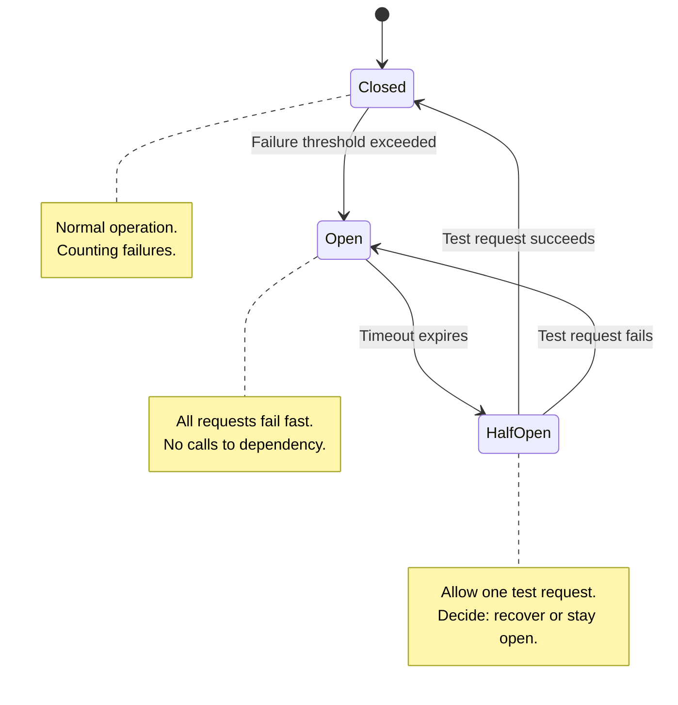

# Performance Review Checklist

Performance is not something you optimize after launch — it is something you design for before launch and verify continuously. A service that responds in 200ms under development load and 15 seconds under production load has not been performance reviewed. This checklist ensures that your service will perform acceptably under real-world conditions, including traffic spikes, dependency failures, and sustained high load.

The cost of poor performance is concrete: Amazon found that every 100ms of latency cost them 1% of sales. Google found that an extra 500ms in search page generation dropped traffic by 20%. Your users will not wait, and your business will not grow, if your service is slow.

**Related**: [Pre-Launch Checklist](/devops/checklists/pre-launch) | [SLI / SLO / SLA Engineering](/devops/sre/sli-slo-sla) | [Capacity Planning](/devops/sre/capacity-planning) | [Service Degradation Runbook](/devops/runbooks/service-degradation)

---

## Performance Budget

Before reviewing individual items, establish your performance budget:

| Metric | Target | Measurement Point | SLO |
|---|---|---|---|
| P50 latency | < 100ms | Load balancer | 99.9% of 5-minute windows |
| P95 latency | < 300ms | Load balancer | 99.5% of 5-minute windows |
| P99 latency | < 500ms | Load balancer | 99% of 5-minute windows |
| Error rate | < 0.1% | Application metrics | 99.9% of 5-minute windows |
| Throughput | > 1000 RPS | Load balancer | Sustained for 4+ hours |
| Time to first byte (TTFB) | < 200ms | Client-side | 95th percentile |

::: tip Set Budgets Before You Test
Define your performance budget before running load tests. Otherwise, you will rationalize whatever numbers you get. "P99 is 2.3 seconds? That's probably fine." No — decide what "fine" means first, then test against it.
:::

---

## 1. Load Testing

- [ ] **1.1** (P0) — Baseline load test completed at expected peak traffic
- [ ] **1.2** (P0) — Stress test completed at 2-3x expected peak traffic
- [ ] **1.3** (P1) — Spike test completed (sudden 10x burst for 2-5 minutes)
- [ ] **1.4** (P1) — Soak test completed (sustained load for 4-8 hours to detect memory leaks and resource exhaustion)
- [ ] **1.5** (P1) — Load tests run against a production-like environment (same hardware, same data volume, same network topology)
- [ ] **1.6** (P1) — Load test results documented with graphs and analysis
- [ ] **1.7** (P2) — Load tests automated and run on every major release



### Load Test Types Explained

| Test Type | Purpose | Pattern | Duration | What It Catches |
|---|---|---|---|---|
| **Baseline** | Verify normal performance | Constant expected load | 15-30 min | Basic performance issues |
| **Stress** | Find the breaking point | Gradually increasing load | 30-60 min | Bottlenecks, scaling limits |
| **Spike** | Test sudden traffic surges | Instant jump to high load | 5-10 min burst | Autoscaling lag, cold start issues |
| **Soak** | Detect slow resource leaks | Constant moderate load | 4-8 hours | Memory leaks, connection leaks, disk fill |
| **Breakpoint** | Find absolute maximum | Stepwise increase until failure | Until break | Maximum capacity |

```javascript
// k6 soak test configuration
import http from 'k6/http';
import { check } from 'k6';

export const options = {
  stages: [
    { duration: '5m', target: 200 },    // Ramp up
    { duration: '8h', target: 200 },    // Sustained load for 8 hours
    { duration: '5m', target: 0 },      // Ramp down
  ],
  thresholds: {
    http_req_duration: ['p(99)<500'],
    http_req_failed: ['rate<0.01'],
    // Memory leak detection: check that response times
    // don't degrade over the soak period
    'http_req_duration{expected_response:true}': ['p(99)<500'],
  },
};

export default function () {
  const res = http.get('https://api.example.com/v1/healthz');
  check(res, {
    'status 200': (r) => r.status === 200,
    'duration < 500ms': (r) => r.timings.duration < 500,
  });
}
```

---

## 2. Caching Strategy

- [ ] **2.1** (P0) — Caching strategy defined for each data type (no cache, short TTL, long TTL, cache-aside, write-through)
- [ ] **2.2** (P1) — Cache hit rate measured and baselined (target: > 80% for cacheable data)
- [ ] **2.3** (P1) — Cache invalidation strategy documented and tested
- [ ] **2.4** (P1) — Cache stampede prevention implemented (locking, probabilistic early expiration)
- [ ] **2.5** (P1) — Cache failure handled gracefully (service works without cache, just slower)
- [ ] **2.6** (P2) — Cache warm-up procedure for cold starts
- [ ] **2.7** (P2) — Cache memory limits configured (eviction policy: LRU, LFU, or TTL-based)



| Cache Pattern | When to Use | Pros | Cons |
|---|---|---|---|
| **Cache-aside** | Read-heavy, tolerant of stale data | Simple, application controls caching | Cache misses hit DB, possible stale data |
| **Write-through** | Consistency required | Cache always fresh | Higher write latency |
| **Write-behind** | Write-heavy workloads | Low write latency | Possible data loss if cache fails |
| **Read-through** | Simplify application code | Cache manages DB reads | Harder to debug |

```python
# Example: Cache-aside with stampede prevention (Redis + Python)
import redis
import json
import time
import random

r = redis.Redis()

def get_with_cache(key: str, fetch_fn, ttl: int = 300):
    """Cache-aside pattern with probabilistic early expiration."""
    cached = r.get(key)

    if cached:
        data = json.loads(cached)
        remaining_ttl = r.ttl(key)

        # Probabilistic early expiration to prevent stampede
        # As TTL approaches 0, probability of refresh increases
        if remaining_ttl > 0:
            beta = 1.0  # Tuning parameter
            expiry_gap = ttl - remaining_ttl
            if random.random() < beta * (expiry_gap / ttl):
                # Early refresh — this request refreshes, others still get cache
                pass
            else:
                return data

    # Cache miss or early refresh
    lock_key = f"lock:{key}"
    if r.set(lock_key, "1", nx=True, ex=10):  # Acquire lock
        try:
            result = fetch_fn()
            r.setex(key, ttl, json.dumps(result))
            return result
        finally:
            r.delete(lock_key)
    else:
        # Another request is refreshing — return stale data or wait
        if cached:
            return json.loads(cached)
        time.sleep(0.1)
        return get_with_cache(key, fetch_fn, ttl)
```

::: warning Cache Stampede
When a popular cache key expires, hundreds of requests simultaneously hit the database to refresh it. This can overwhelm the database and cause cascading failures. Always implement one of:
- **Mutex/lock**: Only one request refreshes; others wait or get stale data
- **Probabilistic early expiration**: Randomly refresh before TTL expires
- **Background refresh**: Separate process refreshes cache before expiry
:::

---

## 3. CDN & Static Assets

- [ ] **3.1** (P1) — Static assets served through CDN (CSS, JS, images, fonts)
- [ ] **3.2** (P1) — CDN cache headers configured correctly (`Cache-Control`, `ETag`, `Vary`)
- [ ] **3.3** (P1) — Asset fingerprinting/versioning implemented for cache busting
- [ ] **3.4** (P2) — Image optimization: WebP/AVIF with fallbacks, responsive images
- [ ] **3.5** (P2) — Gzip/Brotli compression enabled for text-based responses
- [ ] **3.6** (P2) — CDN purge procedure documented for emergency content updates

```nginx
# Example: Cache headers for different content types
location ~* \.(js|css|woff2|png|jpg|svg)$ {
    # Immutable assets with fingerprinted filenames
    add_header Cache-Control "public, max-age=31536000, immutable";
    add_header Vary "Accept-Encoding";
}

location /api/ {
    # API responses — no caching by default
    add_header Cache-Control "no-store, no-cache, must-revalidate";
}

location ~* \.(html)$ {
    # HTML pages — short cache with revalidation
    add_header Cache-Control "public, max-age=300, must-revalidate";
    add_header ETag "";
}
```

---

## 4. Database Performance

- [ ] **4.1** (P0) — Indexes exist for all WHERE, JOIN, and ORDER BY columns used in production queries
- [ ] **4.2** (P0) — N+1 query detection: no endpoint makes more than 5 database queries per request
- [ ] **4.3** (P0) — Slow query logging enabled with actionable thresholds (100ms for OLTP)
- [ ] **4.4** (P1) — EXPLAIN ANALYZE run on all critical queries under production-like data volumes
- [ ] **4.5** (P1) — Connection pool sized correctly (not too small causing waits, not too large overwhelming the database)
- [ ] **4.6** (P1) — Query timeouts configured (30s max for any query, 5s for user-facing queries)
- [ ] **4.7** (P1) — Read replicas used for reporting/analytics queries
- [ ] **4.8** (P2) — Table partitioning evaluated for tables > 10M rows
- [ ] **4.9** (P2) — Database vacuum/analyze running on schedule (PostgreSQL)

```sql
-- Detect N+1 queries: check for repeated similar queries
-- Run pg_stat_statements analysis
SELECT
    query,
    calls,
    mean_exec_time,
    total_exec_time,
    rows
FROM pg_stat_statements
WHERE calls > 100
ORDER BY total_exec_time DESC
LIMIT 20;

-- Find missing indexes (tables with sequential scans on large tables)
SELECT
    schemaname,
    relname AS table_name,
    seq_scan,
    seq_tup_read,
    idx_scan,
    n_live_tup AS estimated_rows,
    CASE WHEN seq_scan > 0
        THEN round(seq_tup_read::numeric / seq_scan, 0)
        ELSE 0
    END AS avg_rows_per_seq_scan
FROM pg_stat_user_tables
WHERE n_live_tup > 10000
    AND seq_scan > 100
    AND (idx_scan IS NULL OR idx_scan < seq_scan)
ORDER BY seq_tup_read DESC;
```

::: danger N+1 Queries
The most common performance bug in web applications. An endpoint lists 50 orders, and for each order makes a separate query to fetch the customer. That is 51 queries instead of 2. Signs of N+1:
- Response time scales linearly with result count
- `pg_stat_statements` shows a query with thousands of calls and 1 row per call
- **Fix**: Use JOINs, eager loading (ORM), or DataLoader (GraphQL)
:::

---

## 5. Connection Management

- [ ] **5.1** (P0) — Database connection pool configured with min/max sizes
- [ ] **5.2** (P0) — HTTP client connection pool configured (reuse connections, don't create per-request)
- [ ] **5.3** (P1) — Connection pool health checks enabled (evict stale connections)
- [ ] **5.4** (P1) — Connection pool metrics exposed (active, idle, waiting, max)
- [ ] **5.5** (P1) — Connection pool exhaustion alert configured
- [ ] **5.6** (P2) — Connection pool drain timeout configured for graceful shutdown

```yaml
# Example: HikariCP connection pool configuration (Java/Spring)
spring:
  datasource:
    hikari:
      minimum-idle: 10
      maximum-pool-size: 50
      idle-timeout: 300000        # 5 minutes
      max-lifetime: 1800000       # 30 minutes
      connection-timeout: 10000   # 10 seconds — fail fast
      validation-timeout: 5000    # 5 seconds
      leak-detection-threshold: 60000  # Warn if connection held > 60s
      pool-name: "my-service-pool"
      # Metrics
      register-mbeans: true
```

### Connection Pool Sizing Formula

```
pool_size = (core_count * 2) + effective_spindle_count
```

For a cloud VM with 4 vCPUs and SSD storage:
- `pool_size = (4 * 2) + 1 = 9` connections per instance

For 10 instances: 90 total connections to the database. PostgreSQL default `max_connections` is 100. You have 10 connections of headroom for admin access and monitoring.

| Pool Too Small | Pool Too Large |
|---|---|
| Requests queue waiting for connections | Database overwhelmed with connections |
| Increased latency under load | Context switching overhead on DB server |
| Connection timeout errors | Idle connections waste memory |
| Easy to detect (waiting metric) | Hard to detect until DB crashes |

---

## 6. Timeouts & Retries

- [ ] **6.1** (P0) — Every external call has a timeout configured (HTTP, database, cache, message queue)
- [ ] **6.2** (P0) — No infinite timeouts (every client library default timeout reviewed and set explicitly)
- [ ] **6.3** (P1) — Retry policy uses exponential backoff with jitter
- [ ] **6.4** (P1) — Retries are idempotent (safe to retry — no duplicate side effects)
- [ ] **6.5** (P1) — Total timeout budget per request is less than the upstream caller's timeout
- [ ] **6.6** (P2) — Timeout values documented in the dependency map



```python
# Example: Exponential backoff with jitter
import random
import time

def retry_with_backoff(fn, max_retries=3, base_delay=0.5, max_delay=30):
    """Retry with exponential backoff and full jitter."""
    for attempt in range(max_retries + 1):
        try:
            return fn()
        except RetryableError as e:
            if attempt == max_retries:
                raise
            # Full jitter: random between 0 and exponential cap
            delay = random.uniform(0, min(base_delay * (2 ** attempt), max_delay))
            time.sleep(delay)
```

::: warning Timeout Chains
If Service A calls Service B with a 10s timeout, and Service B calls Service C with a 10s timeout, the total wall clock time could be 20 seconds. If Service A's caller has a 15s timeout, the caller will timeout before Service A finishes. **Every service in the chain must have a timeout smaller than its caller's timeout, leaving room for processing.**
:::

---

## 7. Circuit Breakers & Resilience

- [ ] **7.1** (P0) — Circuit breaker configured for every external dependency
- [ ] **7.2** (P1) — Circuit breaker thresholds tuned (not too sensitive, not too permissive)
- [ ] **7.3** (P1) — Fallback behavior defined for each circuit breaker (cached response, default value, graceful degradation)
- [ ] **7.4** (P1) — Circuit breaker state exposed as a metric (closed, open, half-open)
- [ ] **7.5** (P2) — Bulkhead pattern implemented for independent dependency pools



| Parameter | Recommended Value | Why |
|---|---|---|
| Failure threshold | 5 failures in 30 seconds | Avoids flapping on single transient errors |
| Open duration | 30 seconds | Long enough for dependency to recover |
| Half-open max requests | 3 | Enough to verify recovery, not enough to overload |
| Success threshold to close | 3 consecutive successes | Confirms stable recovery |
| Timeout per request | 5 seconds | Fail fast, don't tie up threads |

---

## 8. Async Processing & Queues

- [ ] **8.1** (P1) — Long-running operations moved to background workers (email, report generation, image processing)
- [ ] **8.2** (P1) — Message queue configured with dead letter queue (DLQ) for failed messages
- [ ] **8.3** (P1) — Queue consumer concurrency tuned (not too many workers overwhelming downstream services)
- [ ] **8.4** (P1) — Queue depth monitored with alerts for growing backlog
- [ ] **8.5** (P2) — Idempotent message processing (safe to process the same message twice)
- [ ] **8.6** (P2) — Message ordering requirements documented (FIFO where needed)

```yaml
# Example: SQS queue with DLQ (CloudFormation)
Resources:
  MainQueue:
    Type: AWS::SQS::Queue
    Properties:
      QueueName: my-service-queue
      VisibilityTimeout: 300        # 5 minutes — must be > processing time
      MessageRetentionPeriod: 1209600  # 14 days
      RedrivePolicy:
        deadLetterTargetArn: !GetAtt DeadLetterQueue.Arn
        maxReceiveCount: 3           # Move to DLQ after 3 failures

  DeadLetterQueue:
    Type: AWS::SQS::Queue
    Properties:
      QueueName: my-service-dlq
      MessageRetentionPeriod: 1209600

  # Alert on DLQ messages
  DLQAlarm:
    Type: AWS::CloudWatch::Alarm
    Properties:
      AlarmName: my-service-dlq-messages
      MetricName: ApproximateNumberOfMessagesVisible
      Namespace: AWS/SQS
      Dimensions:
        - Name: QueueName
          Value: !GetAtt DeadLetterQueue.QueueName
      Statistic: Sum
      Period: 300
      EvaluationPeriods: 1
      Threshold: 1
      ComparisonOperator: GreaterThanOrEqualToThreshold
      AlarmActions:
        - !Ref AlertSNSTopic
```

---

## 9. Resource Limits & Autoscaling

- [ ] **9.1** (P0) — Container CPU and memory limits set (Kubernetes resource requests/limits)
- [ ] **9.2** (P0) — Horizontal Pod Autoscaler (HPA) configured with appropriate min/max replicas
- [ ] **9.3** (P1) — Autoscaling tested: verify scale-up triggers at correct threshold and completes within acceptable time
- [ ] **9.4** (P1) — Vertical resource limits validated under load (no OOM kills, no CPU throttling during normal operation)
- [ ] **9.5** (P2) — Pod Disruption Budget (PDB) configured to maintain availability during node maintenance
- [ ] **9.6** (P2) — Cluster autoscaler configured (nodes scale with pod demand)

```yaml
# Example: HPA with custom metrics
apiVersion: autoscaling/v2
kind: HorizontalPodAutoscaler
metadata:
  name: my-service-hpa
spec:
  scaleTargetRef:
    apiVersion: apps/v1
    kind: Deployment
    name: my-service
  minReplicas: 3
  maxReplicas: 50
  behavior:
    scaleUp:
      stabilizationWindowSeconds: 60
      policies:
        - type: Percent
          value: 100          # Double the pods
          periodSeconds: 60
    scaleDown:
      stabilizationWindowSeconds: 300    # Wait 5 min before scaling down
      policies:
        - type: Percent
          value: 25           # Remove 25% of pods at a time
          periodSeconds: 60
  metrics:
    - type: Resource
      resource:
        name: cpu
        target:
          type: Utilization
          averageUtilization: 70
    - type: Pods
      pods:
        metric:
          name: http_requests_per_second
        target:
          type: AverageValue
          averageValue: "100"
```

---

## Performance Review Summary

| Section | P0 Items | Total Items | Key Risk |
|---|---|---|---|
| Load Testing | 2 | 7 | Untested capacity → launch-day outage |
| Caching | 1 | 7 | Cache miss storms → DB overload |
| CDN & Assets | 0 | 6 | Slow page loads → user churn |
| Database Performance | 3 | 9 | N+1 queries → exponential slowdown |
| Connection Management | 2 | 6 | Pool exhaustion → service unavailable |
| Timeouts & Retries | 2 | 6 | Cascading timeouts → system-wide hang |
| Circuit Breakers | 1 | 5 | Dependency failure → cascading failure |
| Async Processing | 0 | 6 | Synchronous bottlenecks → high latency |
| Resource Limits | 2 | 6 | OOM kills, uncontrolled scaling |
| **Total** | **13** | **58** | |

::: tip Performance is a Feature
Do not treat performance as an afterthought. Allocate 10-15% of development time for performance testing and optimization. The cost of fixing performance issues increases by 10x after launch — users will have already formed negative impressions, and you'll be optimizing under pressure instead of proactively.
:::
