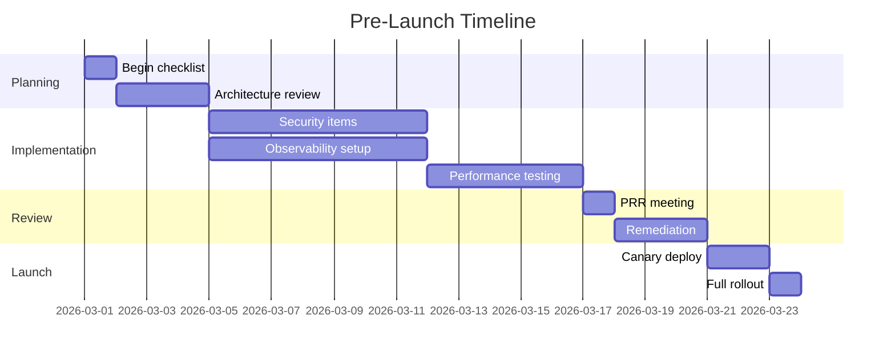
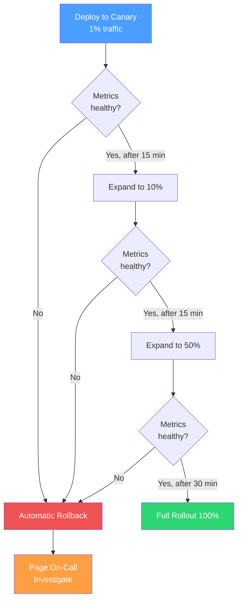

# Pre-Launch Checklist

This is the master checklist. Every service going to production should complete this checklist before serving user traffic. It covers the full surface area — from API design to rollback procedures. The specialized checklists ([Security Review](/devops/checklists/security-review), [Performance Review](/devops/checklists/performance-review), [Observability Readiness](/devops/checklists/observability-readiness)) go deeper on specific domains and should be completed alongside this one.

**Related**: [Production Readiness Overview](/devops/checklists/) | [Deployment Strategies](/devops/deployment-strategies/) | [Disaster Recovery](/devops/disaster-recovery/) | [Incident Response](/devops/incident-response/)

---

## How to Use This Checklist

1. Copy this checklist into your launch tracking document (Notion, Confluence, GitHub issue)
2. Assign an owner for the overall checklist and individual owners for each section
3. Work through items starting 2-4 weeks before your target launch date
4. Items marked **P0** block launch. Items marked **P1** require a documented exception to proceed. Items marked **P2** should be tracked in your backlog.
5. Schedule a Production Readiness Review meeting with your SRE/platform partner to walk through completed items



---

## 1. Architecture & Design

| # | Item | Priority | Owner | Status |
|---|------|----------|-------|--------|
| 1.1 | Architecture decision records (ADRs) documented | P1 | | |
| 1.2 | Service dependencies mapped and documented | P0 | | |
| 1.3 | Data flow diagram created | P1 | | |
| 1.4 | Failure modes identified (what happens when each dependency is down?) | P0 | | |
| 1.5 | Capacity estimates documented (expected RPS, storage growth, connection count) | P1 | | |

- [ ] **1.1** — Architecture decision records written for key design choices ([ADR guide](/devops/engineering-practices/architecture-decision-records))
- [ ] **1.2** — All upstream and downstream dependencies documented with SLAs, timeout values, and failure behavior
- [ ] **1.3** — Data flow diagram showing how data enters, moves through, and exits the service
- [ ] **1.4** — Failure mode analysis completed: for each dependency, document what happens when it is unavailable, slow, or returns errors
- [ ] **1.5** — Capacity estimates: expected requests per second, storage growth rate, database connection count, and memory usage

::: tip Dependency Mapping
Use a simple table for dependency documentation:

| Dependency | Type | Timeout | Retry Policy | Circuit Breaker | Fallback Behavior |
|---|---|---|---|---|---|
| PostgreSQL | Database | 5s | 2 retries, exponential backoff | Opens after 5 failures in 30s | Return 503, queue writes |
| Redis | Cache | 1s | No retry | Opens after 10 failures in 60s | Bypass cache, hit DB directly |
| Payment API | External | 10s | 3 retries, idempotency key | Opens after 3 failures in 60s | Return error, no fallback |
:::

---

## 2. API & Interface Design

- [ ] **2.1** (P0) — API versioning strategy defined (URL path, header, or query parameter)
- [ ] **2.2** (P0) — All endpoints require authentication (unless explicitly public with documented justification)
- [ ] **2.3** (P1) — Rate limiting configured for all public endpoints
- [ ] **2.4** (P0) — Input validation implemented for all endpoints (reject unexpected fields, enforce types, validate ranges)
- [ ] **2.5** (P1) — Error responses follow a consistent format with correlation IDs

```json
{
  "error": {
    "code": "VALIDATION_ERROR",
    "message": "Email address is not valid",
    "details": [
      {
        "field": "email",
        "constraint": "Must be a valid email address"
      }
    ],
    "request_id": "req_abc123",
    "timestamp": "2026-03-20T10:30:00Z"
  }
}
```

- [ ] **2.6** (P1) — API documentation generated and published (OpenAPI/Swagger)
- [ ] **2.7** (P1) — Pagination implemented for all list endpoints (cursor-based preferred over offset)
- [ ] **2.8** (P2) — Request/response size limits configured
- [ ] **2.9** (P1) — Idempotency keys supported for all mutating operations
- [ ] **2.10** (P2) — API contract tests in CI to catch breaking changes

---

## 3. Database & Data Layer

- [ ] **3.1** (P0) — Database schema migrations are forward-compatible (no destructive changes without a migration plan)
- [ ] **3.2** (P0) — Connection pooling configured with appropriate min/max values
- [ ] **3.3** (P0) — Automated backups configured and restore procedure tested
- [ ] **3.4** (P1) — Read replicas configured for read-heavy workloads
- [ ] **3.5** (P0) — Indexes created for all query patterns identified in development
- [ ] **3.6** (P1) — Slow query logging enabled (threshold: 100ms for OLTP, 1s for analytics)
- [ ] **3.7** (P0) — Connection string uses secrets management (not hardcoded)
- [ ] **3.8** (P1) — Data retention policy defined and automated
- [ ] **3.9** (P1) — Database user follows principle of least privilege (separate read/write users)
- [ ] **3.10** (P2) — Query performance baseline established

```sql
-- Example: Verify indexes exist for common queries
-- Run this against your database before launch

SELECT
    schemaname,
    tablename,
    indexname,
    indexdef
FROM pg_indexes
WHERE schemaname = 'public'
ORDER BY tablename, indexname;

-- Check for missing indexes on foreign keys
SELECT
    c.conrelid::regclass AS table_name,
    c.conname AS constraint_name,
    c.confrelid::regclass AS referenced_table
FROM pg_constraint c
LEFT JOIN pg_index i ON i.indrelid = c.conrelid
    AND c.conkey <@ i.indkey
WHERE c.contype = 'f'
    AND i.indexrelid IS NULL;
```

::: warning Database Connection Limits
A common launch-day failure: the application opens more connections than the database allows. Calculate your maximum connections:

`max_connections = (number_of_pods) x (pool_size_per_pod) + (admin_connections)`

If you have 10 pods with a pool size of 20, you need at least 200 connections plus overhead. PostgreSQL default is 100. **This will crash your launch.**
:::

---

## 4. Security

- [ ] **4.1** (P0) — Authentication implemented and tested (JWT validation, session management)
- [ ] **4.2** (P0) — Authorization implemented (RBAC/ABAC — users can only access their own data)
- [ ] **4.3** (P0) — All secrets stored in vault/secrets manager (not in code, config files, or environment variables in plain text)
- [ ] **4.4** (P0) — HTTPS enforced; HTTP redirects to HTTPS
- [ ] **4.5** (P0) — CORS configured to allow only expected origins
- [ ] **4.6** (P1) — Security headers set (CSP, X-Content-Type-Options, X-Frame-Options, Strict-Transport-Security)
- [ ] **4.7** (P0) — No sensitive data in logs (PII, credentials, tokens)
- [ ] **4.8** (P1) — Dependency vulnerability scan passing (no critical/high CVEs)
- [ ] **4.9** (P1) — SQL injection protection verified (parameterized queries, ORM usage)
- [ ] **4.10** (P1) — CSRF protection enabled for state-changing operations

See the full [Security Review Checklist](/devops/checklists/security-review) for a comprehensive security audit.

---

## 5. Monitoring & Observability

- [ ] **5.1** (P0) — Metrics instrumentation: RED metrics (Rate, Errors, Duration) for every endpoint
- [ ] **5.2** (P0) — Grafana dashboard created with key business and technical metrics
- [ ] **5.3** (P0) — Health check endpoint implemented (`/healthz` for liveness, `/readyz` for readiness)
- [ ] **5.4** (P0) — Structured logging with correlation IDs ([Structured Logging guide](/devops/logging/structured-logging))
- [ ] **5.5** (P0) — Log level set appropriately (INFO in production, not DEBUG)
- [ ] **5.6** (P1) — Distributed tracing configured (OpenTelemetry)
- [ ] **5.7** (P1) — Key business metrics tracked (signups, purchases, API calls by customer)
- [ ] **5.8** (P2) — Custom dashboard for on-call engineers showing the "first five things to check"

```yaml
# Example: Kubernetes health check configuration
apiVersion: apps/v1
kind: Deployment
metadata:
  name: my-service
spec:
  template:
    spec:
      containers:
        - name: my-service
          livenessProbe:
            httpGet:
              path: /healthz
              port: 8080
            initialDelaySeconds: 15
            periodSeconds: 10
            failureThreshold: 3
          readinessProbe:
            httpGet:
              path: /readyz
              port: 8080
            initialDelaySeconds: 5
            periodSeconds: 5
            failureThreshold: 3
          startupProbe:
            httpGet:
              path: /healthz
              port: 8080
            failureThreshold: 30
            periodSeconds: 10
```

See the full [Observability Readiness Checklist](/devops/checklists/observability-readiness) for comprehensive observability coverage.

---

## 6. Alerting & On-Call

- [ ] **6.1** (P0) — Critical alerts configured: service down, error rate > 5%, p99 latency > SLO
- [ ] **6.2** (P0) — Alert routing configured in PagerDuty/OpsGenie to the correct team
- [ ] **6.3** (P0) — Every alert has a runbook link in the annotation
- [ ] **6.4** (P1) — Alert thresholds validated against baseline metrics (no false positives from day one)
- [ ] **6.5** (P0) — On-call rotation established with at least two people
- [ ] **6.6** (P1) — Escalation policy defined (primary → secondary → engineering manager → VP)
- [ ] **6.7** (P2) — Alert fatigue assessment: no alert should fire more than once per week without action

```yaml
# Example: PrometheusRule with runbook link
apiVersion: monitoring.coreos.com/v1
kind: PrometheusRule
metadata:
  name: my-service-alerts
spec:
  groups:
    - name: my-service.rules
      rules:
        - alert: HighErrorRate
          expr: |
            sum(rate(http_requests_total{service="my-service",status=~"5.."}[5m]))
            /
            sum(rate(http_requests_total{service="my-service"}[5m]))
            > 0.05
          for: 5m
          labels:
            severity: critical
          annotations:
            summary: "High error rate on {​{ $labels.service }​}"
            description: "Error rate is {​{ $value | humanizePercentage }​} (threshold: 5%)"
            runbook_url: "https://wiki.example.com/runbooks/my-service/high-error-rate"
```

---

## 7. Logging

- [ ] **7.1** (P0) — All logs are structured (JSON format) with consistent field names
- [ ] **7.2** (P0) — Correlation IDs propagated across all service boundaries ([Correlation IDs guide](/devops/logging/correlation-ids))
- [ ] **7.3** (P0) — Sensitive data redacted from logs ([Sensitive Data Redaction](/devops/logging/sensitive-data-redaction))
- [ ] **7.4** (P1) — Log aggregation pipeline verified (logs appear in Kibana/Grafana Loki within 60 seconds)
- [ ] **7.5** (P1) — Log retention configured per compliance requirements
- [ ] **7.6** (P2) — Log-based alerts configured for critical error patterns

---

## 8. Load Testing & Performance

- [ ] **8.1** (P0) — Load test executed at 2x expected peak traffic
- [ ] **8.2** (P0) — P99 latency under load meets SLO
- [ ] **8.3** (P1) — Soak test executed (sustained load for 4+ hours) to detect memory leaks
- [ ] **8.4** (P1) — Spike test executed (sudden 10x traffic burst) to verify autoscaling
- [ ] **8.5** (P1) — Database query performance verified under load (no N+1 queries, no table scans)
- [ ] **8.6** (P2) — CDN configured for static assets
- [ ] **8.7** (P1) — Connection pool exhaustion tested and handled gracefully

```javascript
// Example: k6 load test configuration
import http from 'k6/http';
import { check, sleep } from 'k6';

export const options = {
  stages: [
    { duration: '2m', target: 100 },   // Ramp up
    { duration: '5m', target: 100 },   // Sustained load
    { duration: '2m', target: 300 },   // Peak load (2x)
    { duration: '5m', target: 300 },   // Sustained peak
    { duration: '1m', target: 1000 },  // Spike test (10x)
    { duration: '2m', target: 1000 },  // Sustained spike
    { duration: '2m', target: 0 },     // Ramp down
  ],
  thresholds: {
    http_req_duration: ['p(99)<500'],   // P99 < 500ms
    http_req_failed: ['rate<0.01'],     // Error rate < 1%
  },
};

export default function () {
  const res = http.get('https://api.example.com/v1/resource');
  check(res, {
    'status is 200': (r) => r.status === 200,
    'response time < 500ms': (r) => r.timings.duration < 500,
  });
  sleep(1);
}
```

See the full [Performance Review Checklist](/devops/checklists/performance-review) for comprehensive performance coverage.

---

## 9. Deployment & Rollback

- [ ] **9.1** (P0) — Deployment pipeline tested end-to-end (staging deploy succeeded)
- [ ] **9.2** (P0) — Rollback procedure documented and tested
- [ ] **9.3** (P0) — Database migrations are backward-compatible (the old version of the code works with the new schema)
- [ ] **9.4** (P0) — Feature flags configured for gradual rollout
- [ ] **9.5** (P1) — Canary deployment configured (1% → 10% → 50% → 100%)
- [ ] **9.6** (P1) — Automated rollback triggers defined (error rate > X%, latency > Y ms)
- [ ] **9.7** (P1) — Blue-green or rolling update strategy documented



::: danger Backward-Compatible Migrations
**Never** deploy a database migration that breaks the currently running version of your code. Use the expand-contract pattern:

1. **Expand**: Add new columns/tables (old code ignores them)
2. **Migrate**: Deploy new code that writes to both old and new locations
3. **Backfill**: Copy data from old to new locations
4. **Contract**: Deploy code that reads only from new locations
5. **Clean up**: Remove old columns/tables (in a future release)
:::

---

## 10. Disaster Recovery & Data

- [ ] **10.1** (P0) — RPO and RTO defined and documented ([Disaster Recovery](/devops/disaster-recovery/))
- [ ] **10.2** (P0) — Backup restore tested within the last 30 days
- [ ] **10.3** (P1) — Multi-region failover plan documented (if applicable)
- [ ] **10.4** (P1) — Data classification completed (PII, financial, public)
- [ ] **10.5** (P1) — GDPR/compliance data deletion procedure implemented (if applicable)
- [ ] **10.6** (P2) — Chaos engineering experiment planned for post-launch

---

## 11. Communication & Documentation

- [ ] **11.1** (P0) — Runbook created for common operational scenarios
- [ ] **11.2** (P0) — On-call team knows the service exists and has access to dashboards/logs
- [ ] **11.3** (P1) — Status page integration configured (service appears on internal/external status page)
- [ ] **11.4** (P1) — Launch communication sent to stakeholders (internal: Slack channel, email; external: changelog, blog post if applicable)
- [ ] **11.5** (P1) — Support team briefed on new functionality and common failure modes
- [ ] **11.6** (P2) — Architecture documentation published to internal wiki

### Launch Communication Template

```markdown
## Launch Announcement: [Service Name]

**Launch Date**: [Date]
**Owner**: [Team/Person]
**Slack Channel**: #[service-name]

### What's Launching
[2-3 sentences describing the service and its purpose]

### Impact
- **Users affected**: [All users / Enterprise tier / Internal only]
- **Traffic expectations**: [X RPS, Y% of total traffic]
- **Rollout plan**: [Canary 1% → 10% → 50% → 100% over 2 days]

### Monitoring
- **Dashboard**: [link]
- **Alerts**: Routed to [team] via [PagerDuty/OpsGenie]
- **Runbook**: [link]

### Rollback Plan
- **Trigger**: Error rate > 5% OR p99 > 2s for 5 minutes
- **Procedure**: [link to rollback runbook]
- **Decision maker**: [Name]

### Contacts
- **Technical lead**: @[name]
- **On-call**: @[name] (primary), @[name] (secondary)
```

---

## 12. Post-Launch Verification

These items should be completed within 24 hours of launch:

- [ ] **12.1** — Verify metrics are flowing to dashboards
- [ ] **12.2** — Trigger a test alert and verify it routes correctly
- [ ] **12.3** — Verify logs are appearing in the aggregation system with correct structure
- [ ] **12.4** — Confirm traces are showing end-to-end request flow
- [ ] **12.5** — Run a synthetic health check from an external monitoring service
- [ ] **12.6** — Review error rates and latency percentiles against pre-launch baselines
- [ ] **12.7** — Verify autoscaling triggers at expected thresholds
- [ ] **12.8** — Conduct a brief "day one" retrospective with the launch team

---

## Summary Scorecard

Use this scorecard in your PRR meeting:

| Section | Total Items | P0 Items | Completed | Gaps |
|---|---|---|---|---|
| Architecture & Design | 5 | 2 | _/5 | |
| API & Interface | 10 | 3 | _/10 | |
| Database & Data Layer | 10 | 4 | _/10 | |
| Security | 10 | 5 | _/10 | |
| Monitoring & Observability | 8 | 4 | _/8 | |
| Alerting & On-Call | 7 | 3 | _/7 | |
| Logging | 6 | 3 | _/6 | |
| Load Testing & Performance | 7 | 2 | _/7 | |
| Deployment & Rollback | 7 | 4 | _/7 | |
| Disaster Recovery | 6 | 2 | _/6 | |
| Communication | 6 | 2 | _/6 | |
| Post-Launch | 8 | 0 | _/8 | |
| **Total** | **90** | **34** | **_/90** | |

::: warning Launch Blockers
If any P0 item is not completed, the launch is blocked. No exceptions without VP-level approval and a documented remediation plan with a deadline.
:::
