# Security Review Checklist

Security is not a feature you add at the end. It is a property of the system that emerges from hundreds of small decisions made correctly throughout development. This checklist ensures those decisions are verified before production traffic touches your service.

The OWASP Top 10 accounts for approximately 80% of web application vulnerabilities. This checklist maps every item to the relevant OWASP category so you can demonstrate coverage to auditors, compliance teams, and security reviewers.

**Related**: [Pre-Launch Checklist](/devops/checklists/pre-launch) | [Incident Response](/devops/incident-response/) | [Certificate Rotation Runbook](/devops/runbooks/certificate-rotation) | [DDoS Response Runbook](/devops/runbooks/ddos-response)

---

## OWASP Top 10 Coverage Map

```mermaid
graph TD
    A[OWASP Top 10 2021] --> A1["A01: Broken Access Control"]
    A --> A2["A02: Cryptographic Failures"]
    A --> A3["A03: Injection"]
    A --> A4["A04: Insecure Design"]
    A --> A5["A05: Security Misconfiguration"]
    A --> A6["A06: Vulnerable Components"]
    A --> A7["A07: Auth Failures"]
    A --> A8["A08: Data Integrity Failures"]
    A --> A9["A09: Logging & Monitoring"]
    A --> A10["A10: SSRF"]

    style A fill:#ee5253,color:#fff
    style A1 fill:#ff6b6b,color:#fff
    style A2 fill:#ff6b6b,color:#fff
    style A3 fill:#ff6b6b,color:#fff
    style A4 fill:#ff9f43,color:#fff
    style A5 fill:#ff9f43,color:#fff
    style A6 fill:#ff9f43,color:#fff
    style A7 fill:#ff6b6b,color:#fff
    style A8 fill:#ff9f43,color:#fff
    style A9 fill:#feca57,color:#333
    style A10 fill:#ff9f43,color:#fff
```



| OWASP Category | Checklist Sections | Risk Level |
|---|---|---|
| A01: Broken Access Control | Authentication, Authorization | Critical |
| A02: Cryptographic Failures | TLS, Secrets, Data Protection | Critical |
| A03: Injection | Input Validation, Database Security | Critical |
| A04: Insecure Design | Architecture Review | High |
| A05: Security Misconfiguration | Headers, CORS, CSP | High |
| A06: Vulnerable Components | Dependency Scanning | High |
| A07: Auth Failures | Authentication, Session Management | Critical |
| A08: Data Integrity Failures | CI/CD Security, Dependency Verification | High |
| A09: Logging & Monitoring | Audit Logging, Security Monitoring | Medium |
| A10: SSRF | Input Validation, Network Security | High |

---

## 1. Authentication (OWASP A01, A07)

- [ ] **1.1** (P0) — All endpoints require authentication unless explicitly marked as public with documented justification
- [ ] **1.2** (P0) — Authentication tokens (JWT, session cookies) are validated on every request
- [ ] **1.3** (P0) — JWT tokens have appropriate expiration (access: 15-60 min, refresh: 7-30 days)
- [ ] **1.4** (P0) — JWT signature algorithm is explicitly set (RS256 or ES256, never `none` or HS256 with a weak secret)
- [ ] **1.5** (P1) — Brute force protection: account lockout or exponential backoff after 5 failed attempts
- [ ] **1.6** (P1) — Password requirements: minimum 12 characters, check against known-breach lists (HaveIBeenPwned API)
- [ ] **1.7** (P0) — Session invalidation works (logout destroys server-side session, token is blacklisted)
- [ ] **1.8** (P1) — Multi-factor authentication available for admin/privileged accounts
- [ ] **1.9** (P1) — OAuth2/OIDC flows use PKCE (Proof Key for Code Exchange) for public clients

```python
# Example: JWT validation with explicit algorithm
import jwt
from datetime import datetime, timezone

def validate_token(token: str, public_key: str) -> dict:
    """Validate JWT with strict settings."""
    try:
        payload = jwt.decode(
            token,
            public_key,
            algorithms=["RS256"],         # Explicit — never accept 'none'
            options={
                "require": ["exp", "iat", "sub", "iss"],
                "verify_exp": True,
                "verify_iat": True,
                "verify_iss": True,
            },
            issuer="https://auth.example.com",
        )
        return payload
    except jwt.ExpiredSignatureError:
        raise AuthError("Token expired")
    except jwt.InvalidTokenError as e:
        raise AuthError(f"Invalid token: {e}")
```

::: danger Algorithm Confusion Attack
If your JWT library accepts the `alg` header from the token without validation, an attacker can change the algorithm from RS256 (asymmetric) to HS256 (symmetric) and sign the token with your public key (which is, by definition, public). **Always set the algorithm explicitly in your verification code.**
:::

---

## 2. Authorization (OWASP A01)

- [ ] **2.1** (P0) — Authorization checks exist on every endpoint (not just authentication)
- [ ] **2.2** (P0) — Users cannot access other users' data by changing IDs in the URL (IDOR prevention)
- [ ] **2.3** (P0) — Admin endpoints require admin role verification (not just authentication)
- [ ] **2.4** (P1) — Authorization logic is centralized (middleware/decorator), not scattered in business logic
- [ ] **2.5** (P1) — Role hierarchy is documented and tested
- [ ] **2.6** (P1) — API keys have scoped permissions (read-only, specific resources)
- [ ] **2.7** (P2) — Authorization decisions are logged for audit

```python
# IDOR Prevention — always verify resource ownership
# BAD: Trusts the user-supplied ID
@app.get("/api/orders/{order_id}")
def get_order(order_id: int):
    return db.query(Order).filter(Order.id == order_id).first()

# GOOD: Verifies the requesting user owns the resource
@app.get("/api/orders/{order_id}")
def get_order(order_id: int, current_user: User = Depends(get_current_user)):
    order = db.query(Order).filter(
        Order.id == order_id,
        Order.user_id == current_user.id   # Ownership check
    ).first()
    if not order:
        raise HTTPException(status_code=404)  # 404, not 403 — don't leak existence
    return order
```

---

## 3. Input Validation (OWASP A03, A10)

- [ ] **3.1** (P0) — All user input is validated (type, length, format, range)
- [ ] **3.2** (P0) — SQL queries use parameterized statements or ORM — no string concatenation
- [ ] **3.3** (P0) — XSS prevention: output is escaped/encoded for the correct context (HTML, JavaScript, URL, CSS)
- [ ] **3.4** (P0) — File upload validation: check file type by magic bytes (not just extension), enforce size limits
- [ ] **3.5** (P1) — URL/redirect validation: only allow whitelisted domains for redirects (open redirect prevention)
- [ ] **3.6** (P1) — SSRF prevention: validate and restrict outbound requests from user-supplied URLs
- [ ] **3.7** (P1) — XML processing disabled or configured to prevent XXE (XML External Entity) attacks
- [ ] **3.8** (P2) — GraphQL: query depth limiting and complexity analysis configured

```typescript
// Example: Input validation with Zod (TypeScript)
import { z } from 'zod';

const CreateUserSchema = z.object({
  email: z.string()
    .email('Invalid email format')
    .max(255, 'Email too long')
    .transform(val => val.toLowerCase().trim()),
  name: z.string()
    .min(1, 'Name required')
    .max(100, 'Name too long')
    .regex(/^[\p{L}\p{N}\s'-]+$/u, 'Invalid characters'),
  age: z.number()
    .int('Must be integer')
    .min(13, 'Must be at least 13')
    .max(150, 'Invalid age'),
  role: z.enum(['user', 'editor']),  // Never accept 'admin' from input
});

// Usage
const result = CreateUserSchema.safeParse(req.body);
if (!result.success) {
  return res.status(400).json({
    error: 'VALIDATION_ERROR',
    details: result.error.issues,
  });
}
```

---

## 4. CORS & Security Headers (OWASP A05)

- [ ] **4.1** (P0) — CORS `Access-Control-Allow-Origin` set to specific origins (never `*` for authenticated APIs)
- [ ] **4.2** (P0) — `Access-Control-Allow-Credentials` only set when CORS origin is whitelisted
- [ ] **4.3** (P0) — `Content-Security-Policy` header configured
- [ ] **4.4** (P0) — `Strict-Transport-Security` header set with `max-age=31536000; includeSubDomains`
- [ ] **4.5** (P1) — `X-Content-Type-Options: nosniff` header set
- [ ] **4.6** (P1) — `X-Frame-Options: DENY` (or `SAMEORIGIN` if iframes are needed)
- [ ] **4.7** (P1) — `Referrer-Policy: strict-origin-when-cross-origin` header set
- [ ] **4.8** (P2) — `Permissions-Policy` header restricts unnecessary browser features

```nginx
# Example: Nginx security headers
server {
    # HSTS
    add_header Strict-Transport-Security "max-age=31536000; includeSubDomains; preload" always;

    # Prevent MIME-type sniffing
    add_header X-Content-Type-Options "nosniff" always;

    # Prevent clickjacking
    add_header X-Frame-Options "DENY" always;

    # CSP — customize per application
    add_header Content-Security-Policy "default-src 'self'; script-src 'self'; style-src 'self' 'unsafe-inline'; img-src 'self' data: https:; font-src 'self'; connect-src 'self' https://api.example.com; frame-ancestors 'none'; base-uri 'self'; form-action 'self';" always;

    # Referrer policy
    add_header Referrer-Policy "strict-origin-when-cross-origin" always;

    # Permissions policy
    add_header Permissions-Policy "camera=(), microphone=(), geolocation=(), payment=()" always;
}
```

::: warning CORS Misconfiguration
The most dangerous CORS misconfiguration is reflecting the `Origin` header back as `Access-Control-Allow-Origin`. This effectively makes CORS protection useless. Always use a whitelist:

```javascript
const allowedOrigins = ['https://app.example.com', 'https://admin.example.com'];
const origin = req.headers.origin;
if (allowedOrigins.includes(origin)) {
  res.setHeader('Access-Control-Allow-Origin', origin);
}
```
:::

---

## 5. Secrets Management (OWASP A02)

- [ ] **5.1** (P0) — No secrets in source code (API keys, passwords, tokens, certificates)
- [ ] **5.2** (P0) — No secrets in Docker images or container environment variables visible in orchestrator UI
- [ ] **5.3** (P0) — Secrets stored in a vault (HashiCorp Vault, AWS Secrets Manager, GCP Secret Manager)
- [ ] **5.4** (P0) — `.gitignore` includes `.env`, `*.pem`, `*.key`, `credentials.json`
- [ ] **5.5** (P1) — Git history scanned for previously committed secrets (using `gitleaks` or `trufflehog`)
- [ ] **5.6** (P1) — Secret rotation procedure documented and tested
- [ ] **5.7** (P1) — Secrets have expiration dates and alerting for upcoming expiry
- [ ] **5.8** (P2) — Pre-commit hook blocks commits containing secret patterns

```yaml
# Example: gitleaks configuration (.gitleaks.toml)
title = "Custom Gitleaks Config"

[[rules]]
id = "aws-access-key"
description = "AWS Access Key ID"
regex = '''AKIA[0-9A-Z]{16}'''
tags = ["aws", "credentials"]

[[rules]]
id = "generic-api-key"
description = "Generic API Key"
regex = '''(?i)api[_-]?key\s*[:=]\s*['"]?[a-zA-Z0-9_\-]{20,}['"]?'''
tags = ["api", "credentials"]

[[rules]]
id = "private-key"
description = "Private Key Header"
regex = '''-----BEGIN (RSA |EC |DSA )?PRIVATE KEY-----'''
tags = ["key", "credentials"]

[allowlist]
paths = [
  '''.*_test\.go$''',
  '''.*\.md$''',
  '''.*fixtures.*''',
]
```

---

## 6. TLS & Encryption (OWASP A02)

- [ ] **6.1** (P0) — TLS 1.2+ enforced (TLS 1.0 and 1.1 disabled)
- [ ] **6.2** (P0) — Certificate is valid and not self-signed in production
- [ ] **6.3** (P0) — Certificate chain is complete (intermediate certificates included)
- [ ] **6.4** (P1) — Certificate expiry monitored with alerts at 30 and 7 days ([Certificate Rotation Runbook](/devops/runbooks/certificate-rotation))
- [ ] **6.5** (P1) — Weak cipher suites disabled (RC4, DES, 3DES, NULL ciphers)
- [ ] **6.6** (P1) — Data encrypted at rest for sensitive data (database encryption, encrypted volumes)
- [ ] **6.7** (P2) — SSL Labs scan scores A or A+ (ssllabs.com/ssltest)

```bash
# Quick TLS verification commands
# Check certificate expiry
echo | openssl s_client -servername api.example.com -connect api.example.com:443 2>/dev/null \
  | openssl x509 -noout -dates

# Check TLS version support
nmap --script ssl-enum-ciphers -p 443 api.example.com

# Verify certificate chain
openssl s_client -showcerts -servername api.example.com -connect api.example.com:443
```

---

## 7. Rate Limiting & Abuse Prevention (OWASP A04)

- [ ] **7.1** (P0) — Rate limiting configured on authentication endpoints (login, register, password reset)
- [ ] **7.2** (P1) — Rate limiting configured on all public API endpoints
- [ ] **7.3** (P1) — Rate limit responses return `429 Too Many Requests` with `Retry-After` header
- [ ] **7.4** (P1) — Rate limiting is per-user or per-API-key (not just per-IP, which fails behind NATs/proxies)
- [ ] **7.5** (P2) — Captcha or proof-of-work on public forms (registration, contact)
- [ ] **7.6** (P2) — Geo-blocking capability available for emergency use ([DDoS Response Runbook](/devops/runbooks/ddos-response))

```nginx
# Example: Nginx rate limiting
http {
    # Define rate limit zones
    limit_req_zone $binary_remote_addr zone=login:10m rate=5r/m;    # 5 requests/minute for login
    limit_req_zone $binary_remote_addr zone=api:10m rate=100r/s;    # 100 requests/second for API
    limit_req_zone $binary_remote_addr zone=signup:10m rate=3r/m;   # 3 requests/minute for signup

    server {
        location /api/auth/login {
            limit_req zone=login burst=3 nodelay;
            limit_req_status 429;
            proxy_pass http://backend;
        }

        location /api/ {
            limit_req zone=api burst=50 nodelay;
            limit_req_status 429;
            proxy_pass http://backend;
        }
    }
}
```

---

## 8. Dependency Security (OWASP A06, A08)

- [ ] **8.1** (P0) — No known critical or high CVEs in production dependencies
- [ ] **8.2** (P0) — Dependency vulnerability scanning runs in CI (Snyk, Dependabot, Trivy, npm audit)
- [ ] **8.3** (P1) — Docker base images scanned for vulnerabilities
- [ ] **8.4** (P1) — Docker images use specific version tags (not `latest`)
- [ ] **8.5** (P1) — Lock files committed (`package-lock.json`, `poetry.lock`, `go.sum`)
- [ ] **8.6** (P2) — Software Bill of Materials (SBOM) generated
- [ ] **8.7** (P2) — Supply chain security: dependencies from trusted registries only

```yaml
# Example: GitHub Actions dependency scanning
name: Security Scan
on:
  pull_request:
  schedule:
    - cron: '0 8 * * 1'   # Weekly on Monday

jobs:
  dependency-scan:
    runs-on: ubuntu-latest
    steps:
      - uses: actions/checkout@v4

      - name: Run Trivy vulnerability scanner
        uses: aquasecurity/trivy-action@master
        with:
          scan-type: 'fs'
          scan-ref: '.'
          severity: 'CRITICAL,HIGH'
          exit-code: '1'    # Fail the build on critical/high findings

      - name: Scan Docker image
        uses: aquasecurity/trivy-action@master
        with:
          image-ref: 'my-service:${{ github.sha }}'
          severity: 'CRITICAL,HIGH'
          exit-code: '1'
```

---

## 9. Audit Logging & Security Monitoring (OWASP A09)

- [ ] **9.1** (P0) — Authentication events logged (login success, login failure, logout, token refresh)
- [ ] **9.2** (P0) — Authorization failures logged (403 responses, access denied events)
- [ ] **9.3** (P1) — Administrative actions logged (user creation, role changes, config changes)
- [ ] **9.4** (P1) — Data access logged for sensitive resources (PII access, financial data queries)
- [ ] **9.5** (P1) — Audit logs are tamper-resistant (append-only, separate storage, integrity hashing)
- [ ] **9.6** (P1) — Security alerts configured for suspicious patterns (brute force, privilege escalation, unusual access patterns)
- [ ] **9.7** (P2) — Audit log retention meets compliance requirements (SOC2: 1 year, HIPAA: 6 years, PCI-DSS: 1 year)

```json
{
  "timestamp": "2026-03-20T10:30:00.000Z",
  "event_type": "authentication.failure",
  "actor": {
    "ip": "203.0.113.42",
    "user_agent": "Mozilla/5.0...",
    "user_id": null,
    "email_attempted": "admin@example.com"
  },
  "action": "login",
  "outcome": "failure",
  "reason": "invalid_password",
  "metadata": {
    "attempt_count": 4,
    "lockout_threshold": 5,
    "geo_country": "US",
    "geo_city": "San Francisco"
  },
  "request_id": "req_abc123",
  "service": "auth-service",
  "environment": "production"
}
```

---

## 10. Network & Infrastructure Security (OWASP A05)

- [ ] **10.1** (P0) — Services are not directly exposed to the internet (behind load balancer/API gateway)
- [ ] **10.2** (P0) — Database is not accessible from the public internet
- [ ] **10.3** (P0) — Network segmentation: production, staging, and development environments are isolated
- [ ] **10.4** (P1) — Kubernetes NetworkPolicies restrict pod-to-pod communication
- [ ] **10.5** (P1) — Service-to-service communication uses mTLS or service mesh
- [ ] **10.6** (P1) — SSH access to production requires bastion host and MFA
- [ ] **10.7** (P2) — Egress filtering: services can only reach whitelisted external endpoints

```yaml
# Example: Kubernetes NetworkPolicy — deny all, allow specific
apiVersion: networking.k8s.io/v1
kind: NetworkPolicy
metadata:
  name: my-service-network-policy
  namespace: production
spec:
  podSelector:
    matchLabels:
      app: my-service
  policyTypes:
    - Ingress
    - Egress
  ingress:
    - from:
        - podSelector:
            matchLabels:
              app: api-gateway
      ports:
        - protocol: TCP
          port: 8080
  egress:
    - to:
        - podSelector:
            matchLabels:
              app: postgresql
      ports:
        - protocol: TCP
          port: 5432
    - to:   # Allow DNS
        - namespaceSelector: {}
      ports:
        - protocol: UDP
          port: 53
```

---

## Security Review Summary

| Section | OWASP Mapping | P0 Items | Total Items |
|---|---|---|---|
| Authentication | A01, A07 | 5 | 9 |
| Authorization | A01 | 3 | 7 |
| Input Validation | A03, A10 | 4 | 8 |
| CORS & Headers | A05 | 4 | 8 |
| Secrets Management | A02 | 4 | 8 |
| TLS & Encryption | A02 | 3 | 7 |
| Rate Limiting | A04 | 1 | 6 |
| Dependency Security | A06, A08 | 2 | 7 |
| Audit Logging | A09 | 2 | 7 |
| Network Security | A05 | 3 | 7 |
| **Total** | | **31** | **74** |

::: tip Continuous Security
This checklist is a point-in-time assessment. For ongoing security, implement:
- Weekly dependency scans in CI
- Monthly review of audit logs for anomalies
- Quarterly penetration testing
- Annual third-party security audit
:::
