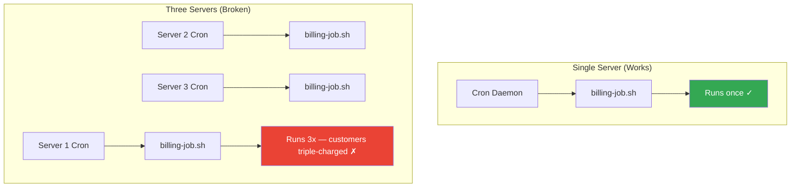
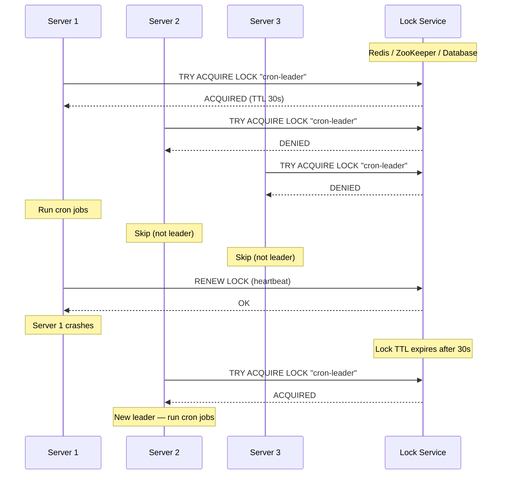
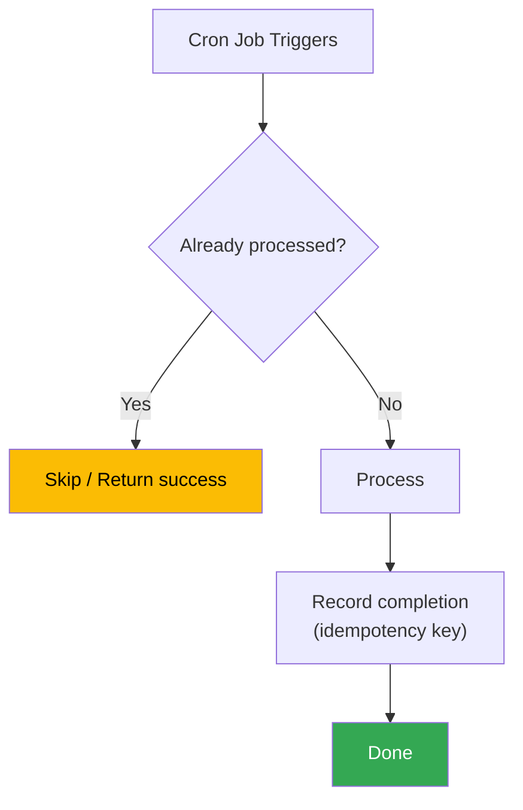
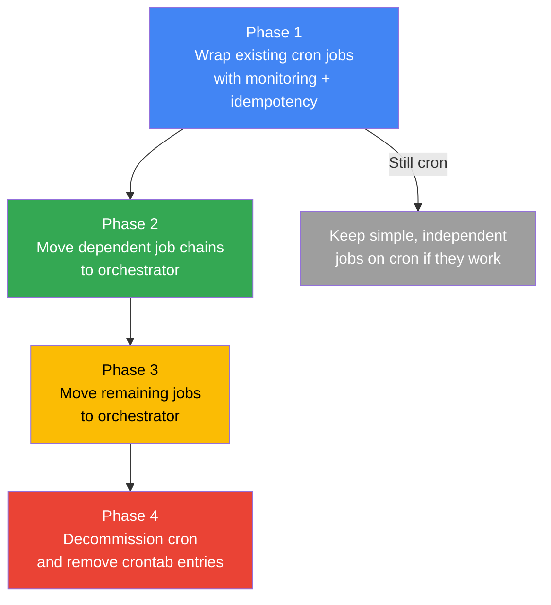

# Cron Patterns & Reliability

Running a cron job on a single server is easy. Running scheduled work reliably across a fleet of servers, in the face of failures, duplicates, and race conditions, is one of the hardest problems in distributed systems. This page covers the patterns that make scheduled jobs production-grade: leader election, idempotency, overlap prevention, failure handling, observability, and the decision framework for when cron is no longer enough.

**Related**: [Cron Jobs — Syntax & Setup](/infrastructure/cron-jobs) | [SRE](/devops/sre/) | [Monitoring](/devops/monitoring/) | [Incident Response](/devops/incident-response/)

---

::: tip Key Takeaway
- Every cron job in a multi-server environment MUST solve the "run exactly once" problem — leader election or distributed locking is not optional
- Idempotency is the single most important property of any scheduled job — if running it twice produces different results, your system will eventually break
- When your cron jobs need dependency chains, retries with backoff, or cross-service coordination, it is time to migrate to an orchestration platform like Temporal, Airflow, or Celery Beat
:::

::: warning Common Misconceptions
- **"We only have one server, so we don't need locking"** — What happens when you add a second server? When you deploy and both old and new versions run? When autoscaling kicks in? Build with locking from day one.
- **"My job runs fast, so overlap can't happen"** — A job that normally takes 2 seconds can take 20 minutes when the database is slow, the network is congested, or the disk is full. Murphy guarantees overlap.
- **"Retry logic means I don't need idempotency"** — Retries without idempotency can double-charge customers, send duplicate emails, or corrupt data. Idempotency makes retries safe.
- **"Kubernetes CronJobs solve the distributed cron problem"** — K8s CronJobs solve scheduling and overlap prevention within a single cluster, but not across clusters, regions, or hybrid environments. For multi-cluster, you still need coordination.
- **"Cron is legacy — just use Airflow for everything"** — Airflow is a DAG orchestrator, not a replacement for every cron job. A simple log rotation script does not need a 4-node Airflow cluster.
:::

---

## The Distributed Cron Problem

On a single server, cron works perfectly: one daemon, one schedule, one execution. The moment you scale to multiple servers (for availability, load balancing, or blue-green deployments), every server runs its own cron daemon, and every job executes N times instead of once.



### Naive "Solutions" That Do Not Work

| Approach | Why It Fails |
|----------|-------------|
| "Only install cron on server 1" | If server 1 goes down, no jobs run. You have a single point of failure. |
| "Use a load balancer to pick one" | Load balancers route HTTP requests, not cron triggers. Cron fires locally. |
| "Check hostname at job start" | Same SPOF problem. Also breaks during hostname changes and autoscaling. |
| "Use a shared flag file on NFS" | NFS locks are unreliable. Stale locks, split-brain, and performance issues. |

The only reliable solutions involve distributed coordination: leader election or distributed locks.

---

## Leader Election for Cron

Leader election ensures exactly one node in a cluster is the "leader" and responsible for running cron jobs. All other nodes are followers and skip execution.



### Redis-Based Leader Election

```python
import redis
import time
import socket
import os

class CronLeaderElection:
    def __init__(self, redis_url, lock_key="cron:leader", ttl=30):
        self.redis = redis.from_url(redis_url)
        self.lock_key = lock_key
        self.ttl = ttl
        self.identity = f"{socket.gethostname()}:{os.getpid()}"

    def try_become_leader(self):
        """Attempt to acquire leadership. Returns True if this node is leader."""
        # SET NX = only set if not exists, EX = expire after TTL
        acquired = self.redis.set(
            self.lock_key,
            self.identity,
            nx=True,
            ex=self.ttl
        )
        if acquired:
            return True

        # Check if WE are the current leader (renew)
        current = self.redis.get(self.lock_key)
        if current and current.decode() == self.identity:
            self.redis.expire(self.lock_key, self.ttl)
            return True

        return False

    def release(self):
        """Release leadership (only if we are the leader)."""
        # Lua script for atomic check-and-delete
        script = """
        if redis.call("get", KEYS[1]) == ARGV[1] then
            return redis.call("del", KEYS[1])
        else
            return 0
        end
        """
        self.redis.eval(script, 1, self.lock_key, self.identity)


# Usage in your cron wrapper
leader = CronLeaderElection("redis://redis:6379/0")

if leader.try_become_leader():
    print(f"I am the leader ({leader.identity}), running job...")
    run_the_actual_job()
    leader.release()
else:
    print("Not the leader, skipping")
```

### Database-Based Leader Election

When you do not have Redis, use your existing PostgreSQL or MySQL database:

```sql
-- Create the lock table
CREATE TABLE cron_leader (
    lock_name   VARCHAR(255) PRIMARY KEY,
    holder      VARCHAR(255) NOT NULL,
    acquired_at TIMESTAMPTZ NOT NULL DEFAULT NOW(),
    expires_at  TIMESTAMPTZ NOT NULL
);

-- Try to acquire leadership (PostgreSQL)
INSERT INTO cron_leader (lock_name, holder, expires_at)
VALUES ('billing-job', 'server-1:pid-1234', NOW() + INTERVAL '60 seconds')
ON CONFLICT (lock_name) DO UPDATE
SET holder = EXCLUDED.holder,
    acquired_at = NOW(),
    expires_at = EXCLUDED.expires_at
WHERE cron_leader.expires_at < NOW();
-- Returns 1 row affected = you are the leader
-- Returns 0 rows affected = someone else holds the lock
```

### ZooKeeper / etcd

For environments that already run ZooKeeper (Kafka clusters) or etcd (Kubernetes), use their built-in leader election primitives. These offer stronger guarantees than Redis (which requires careful handling of clock skew and network partitions).

```bash
# Using etcd's built-in election (via etcdctl)
etcdctl elect cron-leader "server-$(hostname)"
# Blocks until this node is elected leader
# When leader, run jobs; on loss, stop
```

---

## Idempotent Job Design

Idempotency means running the same job multiple times produces the same result as running it once. This is the most critical property of any scheduled job because duplicates WILL happen — from retries, failover, clock skew, or operator error.

### Idempotency Patterns



| Pattern | How It Works | Example |
|---------|-------------|---------|
| **Idempotency key** | Record a unique key for each processed item; skip if key exists | `INSERT ... ON CONFLICT DO NOTHING` |
| **Upsert instead of insert** | Use `ON CONFLICT UPDATE` so duplicates overwrite, not duplicate | Syncing external data into local DB |
| **Watermark / cursor** | Process only records newer than the last-processed timestamp | ETL jobs processing event streams |
| **State machine** | Transition items through states; only process items in the correct state | Order processing: `pending` -> `processing` -> `complete` |
| **Tombstone / soft delete** | Mark as processed rather than deleting, so re-runs see the marker | Cleanup jobs |

### Example: Idempotent Billing Job

```python
def run_billing(billing_date):
    """Idempotent billing run — safe to execute multiple times."""

    # 1. Check if this billing run already completed
    existing = db.query(
        "SELECT status FROM billing_runs WHERE run_date = %s",
        [billing_date]
    )
    if existing and existing.status == 'completed':
        logger.info(f"Billing for {billing_date} already completed, skipping")
        return

    # 2. Claim the run (atomic — only one process wins)
    rows_affected = db.execute("""
        INSERT INTO billing_runs (run_date, status, started_at, worker_id)
        VALUES (%s, 'running', NOW(), %s)
        ON CONFLICT (run_date) DO UPDATE
        SET status = 'running', started_at = NOW(), worker_id = EXCLUDED.worker_id
        WHERE billing_runs.status != 'completed'
    """, [billing_date, WORKER_ID])

    if rows_affected == 0:
        logger.info("Another worker already completed this run")
        return

    # 3. Process charges using idempotency keys
    charges = get_pending_charges(billing_date)
    for charge in charges:
        # Each charge has a unique idempotency key
        db.execute("""
            INSERT INTO processed_charges (idempotency_key, customer_id, amount, billed_at)
            VALUES (%s, %s, %s, NOW())
            ON CONFLICT (idempotency_key) DO NOTHING
        """, [charge.idempotency_key, charge.customer_id, charge.amount])

    # 4. Mark run complete
    db.execute(
        "UPDATE billing_runs SET status = 'completed', finished_at = NOW() WHERE run_date = %s",
        [billing_date]
    )
```

---

## Overlap Prevention

When a cron job takes longer than the interval between runs, the next invocation starts while the previous one is still running. This causes resource contention, data corruption, and cascading failures.

### flock (Linux File Locking)

The simplest and most reliable overlap prevention for single-server cron:

```bash
# flock -n = non-blocking (exit immediately if locked)
# flock -w 60 = wait up to 60 seconds for lock
# Exit code 1 if lock not acquired

# In crontab:
*/5 * * * *  flock -n /var/lock/sync.lock /opt/scripts/sync.sh

# With timeout and error logging:
*/5 * * * *  flock -n /var/lock/sync.lock /opt/scripts/sync.sh >> /var/log/sync.log 2>&1 || echo "$(date) Lock held, skipping" >> /var/log/sync-skip.log
```

### Database Advisory Locks

For distributed environments, use PostgreSQL advisory locks:

```python
import psycopg2

def run_with_lock(job_name, job_func):
    """Run job_func only if we can acquire an advisory lock."""
    # Convert job name to a consistent integer for pg_try_advisory_lock
    lock_id = hash(job_name) % (2**31)

    conn = psycopg2.connect(DATABASE_URL)
    conn.autocommit = True
    cursor = conn.cursor()

    try:
        # Try to acquire lock (non-blocking)
        cursor.execute("SELECT pg_try_advisory_lock(%s)", [lock_id])
        acquired = cursor.fetchone()[0]

        if not acquired:
            logger.info(f"Job '{job_name}' is already running on another node, skipping")
            return

        logger.info(f"Acquired lock for '{job_name}', executing...")
        job_func()

    finally:
        # Release lock
        cursor.execute("SELECT pg_advisory_unlock(%s)", [lock_id])
        conn.close()
```

### Redis-Based Distributed Lock (Redlock)

```python
from redis import Redis
import uuid
import time

def acquire_lock(redis_client, lock_name, ttl=300):
    """Acquire a distributed lock with automatic expiry."""
    token = str(uuid.uuid4())
    acquired = redis_client.set(
        f"lock:{lock_name}",
        token,
        nx=True,   # Only if not exists
        ex=ttl     # Auto-expire after TTL seconds
    )
    return token if acquired else None

def release_lock(redis_client, lock_name, token):
    """Release lock only if we hold it (atomic via Lua)."""
    script = """
    if redis.call("get", KEYS[1]) == ARGV[1] then
        return redis.call("del", KEYS[1])
    else
        return 0
    end
    """
    redis_client.eval(script, 1, f"lock:{lock_name}", token)
```

::: danger
Always set a TTL on distributed locks. If the holder crashes without releasing the lock, a missing TTL means the job never runs again until someone manually intervenes. A TTL that is too short (shorter than the job's max runtime) causes overlapping runs. Set TTL to at least 2x the expected job duration.
:::

---

## Failure Handling and Retry Strategies

Cron has zero built-in retry logic. If a job fails, the next run happens at the next scheduled time, not sooner. You must build retry logic into your jobs or wrappers.

### Retry Wrapper Script

```bash
#!/bin/bash
# /opt/scripts/retry-wrapper.sh
# Usage: retry-wrapper.sh <max_retries> <delay_seconds> <command...>

MAX_RETRIES=${1}
DELAY=${2}
shift 2

for attempt in $(seq 1 "$MAX_RETRIES"); do
    echo "$(date -Iseconds) Attempt ${attempt}/${MAX_RETRIES}: $*"

    if "$@"; then
        echo "$(date -Iseconds) Success on attempt ${attempt}"
        exit 0
    fi

    if [ "$attempt" -lt "$MAX_RETRIES" ]; then
        # Exponential backoff: delay * 2^(attempt-1)
        BACKOFF=$(( DELAY * (2 ** (attempt - 1)) ))
        echo "$(date -Iseconds) Failed, retrying in ${BACKOFF}s..."
        sleep "$BACKOFF"
    fi
done

echo "$(date -Iseconds) FAILED after ${MAX_RETRIES} attempts"
exit 1
```

```bash
# In crontab — retry up to 3 times with 10s initial backoff
0 */6 * * *  /opt/scripts/retry-wrapper.sh 3 10 /opt/scripts/db-backup.sh >> /var/log/backup.log 2>&1
```

### Categorizing Failures

Not all failures should be retried:

| Failure Type | Retry? | Example |
|-------------|--------|---------|
| **Transient** | Yes, with backoff | Network timeout, 503 from API, temporary disk full |
| **Configuration** | No — fix the config | Wrong credentials, missing file, permission denied |
| **Data** | No — fix the data | Invalid input, schema mismatch, constraint violation |
| **Resource exhaustion** | Maybe, with longer delay | OOM killed, CPU throttled, rate limited |

---

## Graceful Shutdown and Timeout Handling

Long-running cron jobs must handle signals properly. During deployments, autoscaling events, or manual kills, your job receives SIGTERM before SIGKILL.

```python
import signal
import sys

# Global flag for graceful shutdown
shutdown_requested = False

def handle_signal(signum, frame):
    global shutdown_requested
    print(f"Received signal {signum}, requesting graceful shutdown...")
    shutdown_requested = True

signal.signal(signal.SIGTERM, handle_signal)
signal.signal(signal.SIGINT, handle_signal)

def process_batch():
    items = get_pending_items(limit=1000)
    for i, item in enumerate(items):
        if shutdown_requested:
            print(f"Shutdown requested after processing {i}/{len(items)} items")
            # Save progress so next run continues from here
            save_checkpoint(item.id)
            sys.exit(0)

        process_item(item)

    print(f"Processed all {len(items)} items")
```

### Timeout Enforcement

```bash
# Linux timeout command — send SIGTERM after 1 hour, SIGKILL after 1h10m
*/30 * * * *  timeout --signal=TERM --kill-after=600 3600 /opt/scripts/etl.sh

# systemd service — built-in timeout
# TimeoutStartSec=3600 in the service file (see cron-jobs page)
```

---

## Job Dependency Chains

When Job B depends on Job A completing first, cron's "fire and forget" model breaks down. You need explicit coordination.


### File-Based Signaling (Simple)

```bash
# Job A (Extract) — runs at midnight
0 0 * * *  /opt/scripts/extract.sh && touch /var/run/flags/extract-$(date +\%Y\%m\%d).done

# Job B (Transform) — runs at 1 AM, checks for signal
0 1 * * *  test -f /var/run/flags/extract-$(date +\%Y\%m\%d).done && /opt/scripts/transform.sh && touch /var/run/flags/transform-$(date +\%Y\%m\%d).done

# Job C (Load) — runs at 2 AM, checks for signal
0 2 * * *  test -f /var/run/flags/transform-$(date +\%Y\%m\%d).done && /opt/scripts/load.sh
```

### Database-Based State Machine (Robust)

```python
def run_transform():
    """Only run if extract completed for today."""
    today = date.today().isoformat()

    # Check dependency
    extract_status = db.query(
        "SELECT status FROM job_runs WHERE job_name = 'extract' AND run_date = %s",
        [today]
    )

    if not extract_status or extract_status.status != 'completed':
        logger.warning(f"Extract not completed for {today}, skipping transform")
        return

    # Record start
    db.execute("""
        INSERT INTO job_runs (job_name, run_date, status, started_at)
        VALUES ('transform', %s, 'running', NOW())
        ON CONFLICT (job_name, run_date) DO UPDATE
        SET status = 'running', started_at = NOW()
        WHERE job_runs.status != 'completed'
    """, [today])

    try:
        do_transform_work()
        db.execute(
            "UPDATE job_runs SET status = 'completed', finished_at = NOW() WHERE job_name = 'transform' AND run_date = %s",
            [today]
        )
    except Exception as e:
        db.execute(
            "UPDATE job_runs SET status = 'failed', error = %s WHERE job_name = 'transform' AND run_date = %s",
            [str(e), today]
        )
        raise
```

::: warning
File-based signaling works on a single server but fails in distributed environments (no shared filesystem) and leaves stale flags if cleanup is missed. For anything beyond the simplest case, use a database, message queue, or proper orchestration.
:::

---

## Observability

Every cron job should emit three things: logs, metrics, and a heartbeat.

### Structured Logging

```python
import structlog
import time

logger = structlog.get_logger()

def run_job():
    start = time.monotonic()
    job_id = str(uuid.uuid4())

    logger.info("job.started",
        job_name="billing-sync",
        job_id=job_id,
        scheduled_time="2025-01-15T06:00:00Z"
    )

    try:
        records_processed = do_work()
        duration = time.monotonic() - start

        logger.info("job.completed",
            job_name="billing-sync",
            job_id=job_id,
            duration_seconds=round(duration, 2),
            records_processed=records_processed
        )

    except Exception as e:
        duration = time.monotonic() - start
        logger.error("job.failed",
            job_name="billing-sync",
            job_id=job_id,
            duration_seconds=round(duration, 2),
            error=str(e),
            error_type=type(e).__name__
        )
        raise
```

### Metrics to Track

| Metric | Type | Alert On |
|--------|------|----------|
| `cron_job_duration_seconds` | Histogram | Duration > 2x normal |
| `cron_job_last_success_timestamp` | Gauge | Age > 2x interval |
| `cron_job_records_processed` | Gauge | Sudden drop to 0 |
| `cron_job_errors_total` | Counter | Any increase |
| `cron_job_runs_total` | Counter | Missing expected increment |

### Prometheus + Grafana Dashboard

```promql
# Alert: Job has not succeeded in over 12 hours
# (for a job that should run every 6 hours)
time() - cron_job_last_success_timestamp{job_name="billing-sync"} > 43200

# Alert: Job duration is 3x the 95th percentile
histogram_quantile(0.95, rate(cron_job_duration_seconds_bucket{job_name="billing-sync"}[7d]))
  * 3 < cron_job_duration_seconds{job_name="billing-sync"}

# Alert: Zero records processed (usually means upstream is broken)
cron_job_records_processed{job_name="billing-sync"} == 0
```

---

## Migration Path: Cron to Orchestration

Cron is appropriate for simple, independent, single-step jobs. When complexity grows, migrate to a proper orchestrator.

### When to Graduate from Cron

| Signal | What It Means |
|--------|--------------|
| You have more than 3 cron jobs that depend on each other | You need a DAG scheduler |
| You need retry with exponential backoff | You need a task queue |
| You need to pass output from Job A as input to Job B | You need workflow orchestration |
| You need to pause/resume/cancel running workflows | You need state management |
| You need human-in-the-loop approval steps | You need a workflow engine |
| Your jobs run across multiple services/teams | You need centralized orchestration |
| You spend more time debugging cron than the actual job logic | You have outgrown cron |

### Migration Comparison

| Platform | Best For | Complexity | Infrastructure |
|----------|---------|-----------|----------------|
| **Celery Beat** | Python apps needing periodic tasks | Low | Redis/RabbitMQ + worker processes |
| **BullMQ** | Node.js apps needing job queues | Low | Redis |
| **Airflow** | Data pipelines with complex DAGs | Medium | Scheduler + webserver + workers + DB |
| **Temporal** | Long-running, multi-service workflows | Medium-High | Temporal server cluster |
| **Dagster** | Data engineering with asset-aware orchestration | Medium | Dagster daemon + webserver |
| **Prefect** | Modern Airflow alternative, easier setup | Medium | Prefect server (or cloud) |

### Migration Strategy



::: tip
You do not have to migrate everything. Simple, independent jobs (log rotation, certificate renewal, cache warming) are perfectly fine on cron or systemd timers forever. Migrate the complex, critical, and interdependent jobs first.
:::

---

## Real-World War Stories

### Zillow: The Duplicate Listing Email (2019)

Zillow's listing notification cron job ran on 4 application servers. When they scaled from 2 to 4 servers during a traffic spike, customers started receiving 4 copies of every listing email. The job had no distributed locking. The fix was a Redis-based leader election added in an emergency deploy. The root cause: the original engineer assumed the service would always run on one server.

### Knight Capital: 440 Million Dollar Cron Job (2012)

While not a traditional cron failure, Knight Capital's trading disaster involved old code that was supposed to be decommissioned being triggered by a deployment flag. A server that should have been updated still had the old code, and when the schedule fired, it executed trades at catastrophic prices. The lesson: deployment hygiene for scheduled jobs is as critical as for web services. Stale code on old servers will run at the worst possible time.

### GitLab: The Database Deletion (2017)

A scheduled maintenance cron job for database replication ran on the wrong server (production instead of staging) because the crontab was copied between environments without updating the target database hostname. The job deleted the production database. GitLab's postmortem found that 5 out of 5 backup mechanisms had silent failures. The lesson: cron jobs that interact with databases must validate their target environment at startup, not trust their crontab configuration.

### Salesforce: The Midnight Stampede

Salesforce observed that a disproportionate number of customer cron jobs were scheduled at midnight and on the hour. This caused thundering herd effects on their infrastructure — massive API spikes at :00 followed by near-zero traffic at :01. They added jitter to their scheduling API and published guidance asking customers to use random offsets (`17 */6 * * *` instead of `0 */6 * * *`).

---

## When NOT to Use Cron (Even with These Patterns)

| Scenario | Problem | Better Alternative |
|----------|---------|-------------------|
| **Event-driven processing** | Why poll on a schedule when the event can trigger the job? | Message queues (SQS, Kafka), webhooks, database triggers |
| **Sub-second scheduling** | Cron's minimum is 1 minute; hacks to go below are fragile | Event-driven architecture, streaming processors |
| **User-facing scheduled tasks** | Users expect to set custom schedules — crontab is not a UI | Database-driven scheduler, cloud scheduler with API |
| **Jobs spanning multiple services** | Cron on one service cannot coordinate with others | Temporal, Step Functions, Conductor |
| **Compliance-regulated workflows** | Cron provides no audit trail, approval gates, or execution history | Workflow engines with built-in compliance features |

---

::: tip In Production

**Shopify** runs thousands of cron-like jobs through their internal job system built on top of Redis and MySQL. Every job is idempotent by contract, uses database advisory locks for overlap prevention, and pushes metrics to their Prometheus-based monitoring stack. When a job misses three consecutive runs, their dead man's switch triggers a PagerDuty incident.

**Netflix** moved from cron to a custom distributed scheduler early in their cloud migration. Their scheduler uses leader election backed by ZooKeeper to ensure each job runs exactly once across their fleet. Jobs are defined as code, versioned in Git, and deployed through their CI/CD pipeline — no manual crontab editing allowed.

**Uber** processes billions of events per day and found that cron-based batch processing could not keep up. They migrated critical scheduled work to Cadence (later open-sourced as Temporal), which gives them exactly-once execution, automatic retries with backoff, and full workflow visibility. Simple cleanup tasks still run on Kubernetes CronJobs.
:::

---

::: details Quiz

**Question 1:** You have 3 application servers, each with the same crontab entry that sends a billing email at 9 AM. Customers are receiving 3 copies. What is the correct fix?

::: details Answer
Implement leader election (using Redis, database, or ZooKeeper) so that only one server executes the job. Alternatively, migrate the job to a Kubernetes CronJob or cloud scheduler that guarantees single execution. Simply removing the crontab from 2 servers is not correct because it creates a single point of failure.
:::

**Question 2:** Your ETL cron job inserts rows into a database. During a network hiccup, the job runs twice. How do you prevent duplicate data?

::: details Answer
Make the job idempotent by using an idempotency key. Instead of plain `INSERT`, use `INSERT ... ON CONFLICT (idempotency_key) DO NOTHING`. The idempotency key should be derived from the data itself (e.g., source record ID + batch date), not from the cron execution. This way, duplicate runs skip already-processed records.
:::

**Question 3:** Your cron job uses `flock -n /var/lock/sync.lock /opt/scripts/sync.sh`. The script crashes without releasing the lock. What happens on the next cron trigger?

::: details Answer
The next run succeeds normally. `flock` uses kernel-level file locks (POSIX advisory locks) that are automatically released when the process exits, even on crash. This is why `flock` is preferred over PID files — PID files can become stale, but `flock` locks cannot.
:::

**Question 4:** You set `startingDeadlineSeconds: 200` on a Kubernetes CronJob that runs every 5 minutes. The CronJob controller is down for 30 minutes. What happens when the controller comes back up?

::: details Answer
Kubernetes counts the missed schedules within the last 200 seconds. Since only the last missed schedule (the most recent 5-minute mark) falls within the 200-second window, Kubernetes creates exactly one Job. If more than 100 schedules were missed within the deadline window, Kubernetes would log an error and stop scheduling entirely.
:::

**Question 5:** Your team is debating whether to migrate 15 cron jobs to Airflow. 10 are simple independent scripts (log rotation, cache clearing). 5 form a data pipeline where each step depends on the previous. What do you recommend?

::: details Answer
Migrate only the 5 interdependent data pipeline jobs to Airflow and define them as a DAG with proper dependency ordering, retries, and alerting. Keep the 10 independent jobs on cron (or systemd timers) with monitoring — they do not benefit from Airflow's complexity. Adding 10 trivial jobs to Airflow increases operational overhead without providing value.
:::

:::

---

::: details Exercise: Design a Distributed Cron System

**Scenario:** Your company has 5 application servers behind a load balancer. You need to run a nightly report job at 2 AM that:
1. Queries the database for the day's transactions
2. Generates a PDF report
3. Emails it to finance@company.com
4. Must run exactly once (no duplicates, no misses)
5. Must alert the on-call engineer if it fails

**Design the complete system. Include: leader election mechanism, idempotency strategy, monitoring, and failure handling.**

::: details Solution

**Architecture:**

```
[5 App Servers] --> [Redis Leader Election]
                         |
                    [Elected Leader]
                         |
                    [Job Wrapper]
                    /    |    \
            [Lock]  [Execute]  [Monitor]
               |        |          |
          [Redis]  [DB Query →   [Healthchecks.io]
                    PDF → Email]
```

**1. Leader Election (Redis)**

Each server runs a cron job at 2 AM, but the wrapper script acquires a Redis lock first:

```bash
# /etc/cron.d/nightly-report (on ALL 5 servers)
SHELL=/bin/bash
0 2 * * * app /opt/scripts/nightly-report-wrapper.sh >> /var/log/nightly-report.log 2>&1
```

**2. Wrapper Script**

```bash
#!/bin/bash
set -euo pipefail

REPORT_DATE=$(date -d "yesterday" +%Y-%m-%d)
LOCK_KEY="nightly-report:${REPORT_DATE}"
HC_UUID="your-uuid-here"

# Try to acquire Redis lock (60 min TTL)
LOCK_TOKEN=$(python3 /opt/scripts/acquire_lock.py "$LOCK_KEY" 3600)
if [ -z "$LOCK_TOKEN" ]; then
    echo "$(date -Iseconds) Another server is handling the report, skipping"
    exit 0
fi

# Signal start
curl -fsS -m 10 "https://hc-ping.com/${HC_UUID}/start" > /dev/null 2>&1 || true

# Run with timeout (30 minutes max)
if timeout 1800 /opt/scripts/generate-report.py --date="$REPORT_DATE"; then
    curl -fsS -m 10 "https://hc-ping.com/${HC_UUID}" > /dev/null 2>&1 || true
    echo "$(date -Iseconds) Report completed successfully"
else
    curl -fsS -m 10 "https://hc-ping.com/${HC_UUID}/fail" > /dev/null 2>&1 || true
    echo "$(date -Iseconds) Report FAILED"
    exit 1
fi
```

**3. Idempotency (in generate-report.py)**

```python
# Check if report for this date already exists
existing = db.query(
    "SELECT id FROM reports WHERE report_date = %s AND status = 'sent'",
    [report_date]
)
if existing:
    logger.info(f"Report for {report_date} already sent, skipping")
    return

# Generate and send, then record completion
report = generate_pdf(report_date)
send_email("finance@company.com", report)
db.execute(
    "INSERT INTO reports (report_date, status, generated_at) VALUES (%s, 'sent', NOW())",
    [report_date]
)
```

**4. Monitoring (Healthchecks.io)**

- Period: 24 hours
- Grace period: 2 hours (job should complete by 4 AM at the latest)
- Alert channels: PagerDuty (on-call), Slack #ops-alerts
- The `/start` ping tracks duration; the `/fail` ping triggers immediate alert

**5. Failure Handling**

- Redis lock has 60-minute TTL so that if the leader crashes mid-job, another server can pick it up on the next attempt
- Idempotency ensures that a retry after crash does not send duplicate emails
- The Healthchecks.io alert fires if no server succeeds within the grace period
- On-call engineer can manually trigger the job: `sudo -u app /opt/scripts/nightly-report-wrapper.sh`
:::

:::

---

**One-Liner Summary:** Production cron requires solving the distributed execution problem (leader election), making every job idempotent, preventing overlaps (flock or distributed locks), monitoring for silent failures (dead man's switch), and knowing when to graduate to an orchestration platform like Temporal or Airflow.
