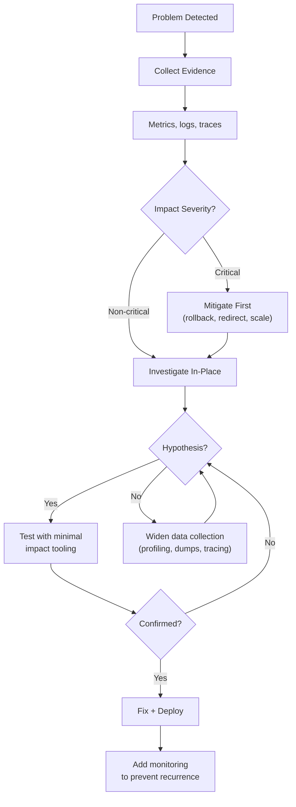
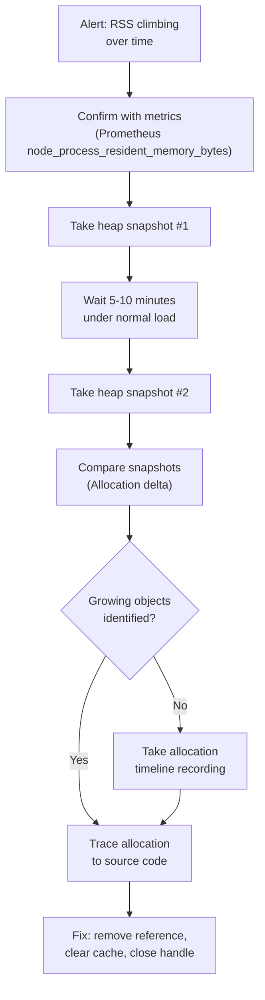
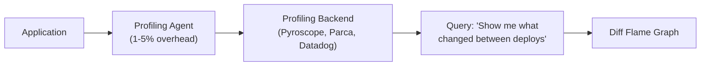
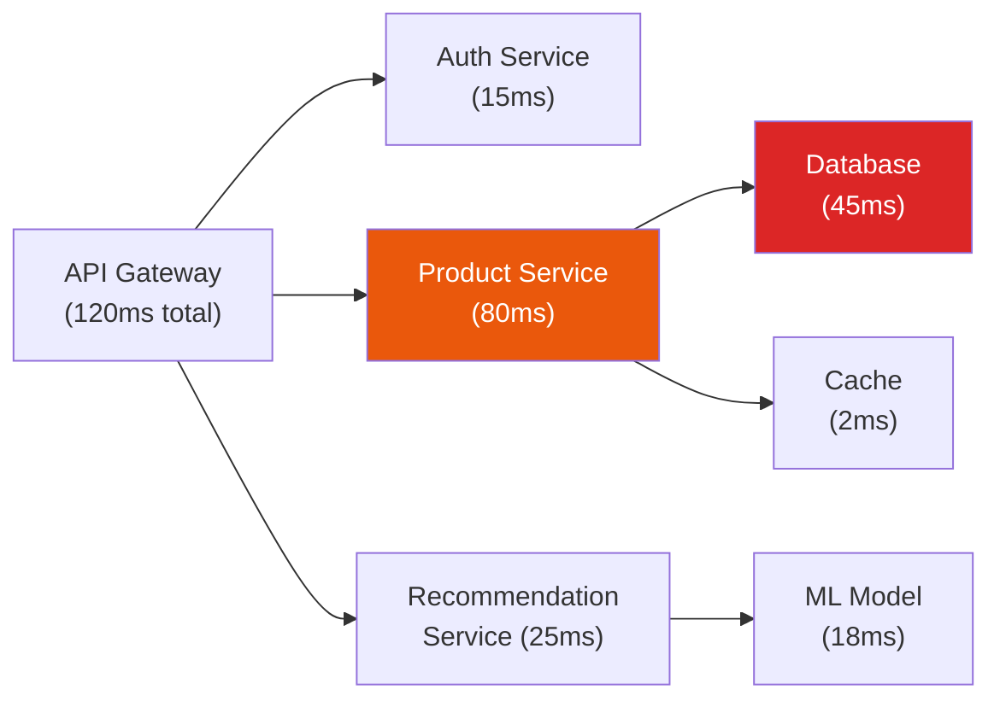

# Debugging in Production

Debugging in production is fundamentally different from debugging in development. You cannot set breakpoints freely, you cannot restart processes without consequence, and every diagnostic action carries the risk of making things worse. The instrumentation overhead that is acceptable in staging can cause cascading failures under real load.

This page covers the full toolkit: remote debugging, core dump analysis, memory leak detection, flame graphs, CPU profiling, network debugging, and distributed tracing. Every technique is accompanied by concrete commands and real-world interpretation guidance.

**Related**: [Monitoring](/devops/monitoring) | [Logging](/devops/logging) | [Incident Response](/devops/incident-response) | [Alerting](/devops/alerting)

---

## The Production Debugging Mindset

Before reaching for any tool, internalize these principles:

| Principle | Why |
|-----------|-----|
| **Observe, don't mutate** | Your first actions should collect data, not change state |
| **Minimize blast radius** | Debug on one replica, not the entire fleet |
| **Time-box your investigation** | If you cannot diagnose in 15 minutes, escalate or mitigate |
| **Preserve evidence** | Capture dumps, logs, and metrics BEFORE restarting |
| **Know your baseline** | You cannot identify anomalies without knowing what "normal" looks like |
| **Automate post-incident** | If you debugged it manually today, add telemetry so you do not have to next time |



## Remote Debugging

### Node.js: --inspect

Node.js has a built-in debugging protocol accessible via Chrome DevTools or VS Code.

```bash
# Start with debugging enabled (do NOT use --inspect in prod without auth)
node --inspect=0.0.0.0:9229 app.js

# Safer: only allow localhost connections
node --inspect=127.0.0.1:9229 app.js

# Signal a running process to enable the debugger
kill -USR1 <pid>  # Linux/macOS
```

::: danger
**Never expose the Node.js inspector on `0.0.0.0` in production without authentication.** The inspector protocol allows arbitrary code execution. Use SSH tunneling or a secure proxy to access the debugger remotely:

```bash
# SSH tunnel to a production node
ssh -L 9229:localhost:9229 user@production-server

# Then connect Chrome DevTools to localhost:9229
```
:::

### Go: Delve

```bash
# Attach to a running Go process
dlv attach <pid>

# Remote debugging (start on server, connect from local)
dlv attach <pid> --headless --listen=:2345 --api-version=2

# Connect from VS Code launch.json
{
  "type": "go",
  "request": "attach",
  "mode": "remote",
  "remotePath": "/app",
  "port": 2345,
  "host": "127.0.0.1"
}
```

### Java: JDWP

```bash
# JVM debug agent (use suspend=n so the app does not pause on start)
java -agentlib:jdwp=transport=dt_socket,server=y,suspend=n,address=*:5005 \
  -jar myapp.jar

# In Kubernetes, port-forward to the debug port
kubectl port-forward pod/myapp-abc123 5005:5005
```

### Python: debugpy

```python
# Attach debugpy to a running process
import debugpy
debugpy.listen(("0.0.0.0", 5678))
# debugpy.wait_for_client()  # Uncomment to pause until debugger connects
```

### Remote Debugging Comparison

| Runtime | Tool | Protocol | Overhead |
|---------|------|----------|----------|
| Node.js | `--inspect` | Chrome DevTools Protocol | Low when idle, moderate when profiling |
| Go | Delve | DAP | Moderate (pauses goroutines) |
| Java | JDWP | Java Debug Wire Protocol | Low when idle |
| Python | debugpy | Debug Adapter Protocol | Moderate |
| Rust | GDB/LLDB | GDB Remote Serial Protocol | Low |

## Core Dump Analysis

When a process crashes, a core dump captures the entire memory state at the moment of failure. It is the forensic evidence you need to diagnose crashes that are not reproducible.

### Enabling Core Dumps

```bash
# Check current limits
ulimit -c

# Enable core dumps (unlimited size)
ulimit -c unlimited

# Set core dump pattern (Linux)
echo '/tmp/core.%e.%p.%t' | sudo tee /proc/sys/kernel/core_pattern

# For containerized environments, set in the Pod spec:
# securityContext:
#   capabilities:
#     add: ["SYS_PTRACE"]
```

### Analyzing with GDB

```bash
# Load a core dump
gdb /usr/bin/myapp /tmp/core.myapp.12345.1679000000

# Inside GDB:
(gdb) bt              # Full backtrace
(gdb) bt full          # Backtrace with local variables
(gdb) info threads     # List all threads
(gdb) thread 3         # Switch to thread 3
(gdb) frame 5          # Switch to stack frame 5
(gdb) print my_var     # Inspect variable
(gdb) info registers   # CPU register state
```

### Node.js Core Dumps

```bash
# Generate a core dump from a running Node.js process
gcore <pid>

# Or use --abort-on-uncaught-exception
node --abort-on-uncaught-exception app.js

# Analyze with llnode (LLDB plugin for Node.js)
lldb -c core.12345 -- node
(lldb) plugin load /path/to/llnode.so
(lldb) v8 bt          # JavaScript backtrace
(lldb) v8 inspect <addr>  # Inspect a JS object
```

::: warning
Core dumps contain the entire process memory, which may include secrets, tokens, and PII. Handle them with the same security controls as production data. Never commit core dumps to source control or transfer them over unencrypted channels.
:::

## Memory Leak Detection

Memory leaks in production manifest as gradually increasing RSS (Resident Set Size) over hours or days, eventually causing OOM kills or degraded performance from excessive GC pressure.

### The Detection Workflow



### Node.js: Heap Snapshots

```bash
# Signal a running process to write a heap snapshot
kill -USR2 <pid>  # If your app handles USR2 for heapdumps

# Or from code:
# v8.writeHeapSnapshot()    — built-in (Node 12+)
# require('heapdump').writeSnapshot()  — heapdump package
```

```javascript
// Programmatic heap snapshot on memory threshold
import v8 from 'node:v8';
import { memoryUsage } from 'node:process';

setInterval(() => {
  const { heapUsed } = memoryUsage();
  if (heapUsed > 500 * 1024 * 1024) { // 500MB threshold
    const filename = v8.writeHeapSnapshot();
    console.error(`Heap snapshot written to ${filename}`);
  }
}, 60_000);
```

Load snapshots in Chrome DevTools (Memory tab) and use the "Comparison" view between two snapshots to find objects that are accumulating.

### Common Node.js Leak Patterns

| Pattern | Cause | Fix |
|---------|-------|-----|
| **Event listener accumulation** | Adding listeners without removing them | `removeListener` / `once` / `AbortSignal` |
| **Unbounded caches** | `Map` or `Object` used as cache without eviction | Use `lru-cache` with max size |
| **Closures holding references** | Callbacks retaining large scope chains | Minimize closure scope, nullify references |
| **Uncleared timers** | `setInterval` without `clearInterval` | Clean up in shutdown handlers |
| **Stream backpressure ignored** | Readable producing faster than writable consuming | Handle `drain` events properly |
| **Global variable accumulation** | Appending to arrays/maps on `global` | Avoid globals; scope data to request lifecycle |

### Go: pprof

```bash
# Enable pprof in your Go application
import _ "net/http/pprof"

# Collect a heap profile
curl -s http://localhost:6060/debug/pprof/heap > heap.prof

# Analyze
go tool pprof heap.prof
(pprof) top 20           # Top memory consumers
(pprof) list MyFunction  # Source-annotated allocation
(pprof) web              # Open interactive graph in browser

# Compare two profiles (find what grew)
go tool pprof -base heap1.prof heap2.prof
```

### Valgrind (C/C++)

```bash
# Full memory leak detection
valgrind --leak-check=full --show-leak-kinds=all \
  --track-origins=yes ./myapp

# Output interpretation:
# "definitely lost"  — memory with no pointer to it (real leak)
# "indirectly lost"  — reachable only through a definitely lost block
# "possibly lost"    — ambiguous (interior pointer exists)
# "still reachable"  — not freed at exit but still referenced
```

## Flame Graphs

Flame graphs are the single most effective visualization for understanding where CPU time is spent. Each box represents a function; width represents time (or samples). The x-axis is NOT time — it is sorted alphabetically. The y-axis is stack depth.

### Reading a Flame Graph

```
┌───────────────────────────────────────────────────────────────┐
│                        main()                                  │
├──────────────────────────────┬────────────────────────────────┤
│        handleRequest()       │         processQueue()         │
├──────────────┬───────────────┤────────────────────────────────┤
│  parseJSON() │ validateInput()│     serializeResponse()       │
├──────────────┤               ├────────────────────────────────┤
│ JSON.parse() │               │      JSON.stringify()          │
└──────────────┘               └────────────────────────────────┘

Width = proportion of CPU time
Wide boxes at the TOP = the bottleneck functions (where CPU is actually consumed)
Wide boxes at the BOTTOM = common ancestors (callers, not bottlenecks themselves)
```

::: tip
**Look for wide plateaus at the top of the flame graph** — those are the functions actually consuming CPU. Wide boxes at the bottom (like `main()`) are just callers. The actionable insight is always in the widest boxes closest to the top.
:::

### Generating Flame Graphs

#### Node.js (0x)

```bash
# Profile and generate flame graph in one command
npx 0x app.js

# Profile a running process (using --inspect)
node --inspect app.js &
# Then use Chrome DevTools CPU profiler → export → convert with speedscope
```

#### Linux (perf)

```bash
# Record CPU samples for 30 seconds
sudo perf record -F 99 -p <pid> -g -- sleep 30

# Generate flame graph
sudo perf script | ./stackcollapse-perf.pl | ./flamegraph.pl > flame.svg

# Or use the modern alternative:
sudo perf script | inferno-collapse-perf | inferno-flamegraph > flame.svg
```

#### Java (async-profiler)

```bash
# Attach to a running JVM
./asprof -d 30 -f flame.html <pid>

# CPU + allocation profiling combined
./asprof -e cpu,alloc -d 60 -f combined.html <pid>
```

#### Go (pprof)

```bash
# Collect 30-second CPU profile
curl -s 'http://localhost:6060/debug/pprof/profile?seconds=30' > cpu.prof

# View as flame graph in browser
go tool pprof -http=:8080 cpu.prof
```

### Flame Graph Tools Comparison

| Tool | Language/Runtime | Overhead | Output |
|------|-----------------|----------|--------|
| **0x** | Node.js | Low | Interactive HTML |
| **perf** | Any (Linux) | Very low | SVG (via scripts) |
| **async-profiler** | JVM | Very low | HTML/SVG/JFR |
| **pprof** | Go | Low | Interactive web UI |
| **py-spy** | Python | Low | SVG/speedscope |
| **rbspy** | Ruby | Low | SVG/speedscope |
| **Speedscope** | Any (viewer) | N/A | Interactive web viewer |

## CPU Profiling in Production

### Continuous Profiling

Rather than profiling reactively during incidents, continuous profiling collects low-overhead samples all the time:



| Tool | Type | Overhead | Languages |
|------|------|----------|-----------|
| **Pyroscope** | Open source | ~2-5% | Go, Java, Python, Ruby, Node.js, Rust |
| **Parca** | Open source | ~1-3% | Any (eBPF-based) |
| **Datadog Continuous Profiler** | Commercial | ~2% | Go, Java, Python, Ruby, Node.js |
| **Google Cloud Profiler** | Commercial | ~1% | Go, Java, Python, Node.js |

### Profiling Safely in Production

| Technique | Safety |
|-----------|--------|
| **Sampling profiler** (perf, async-profiler) | Safe — low overhead, no app modification |
| **Instrumentation profiler** (V8 --prof) | Risky — high overhead, can affect latency |
| **Heap snapshot** | Risky — pauses the process briefly, memory spike |
| **Core dump** | Safe for analysis, but large file + may contain secrets |
| **eBPF** | Safest — kernel-level, near-zero overhead |

::: warning
**Never enable instrumentation-based profiling in production under heavy load.** Sampling profilers (which interrupt the process at fixed intervals) add 1-5% overhead. Instrumentation profilers (which hook every function call) can add 10-100x overhead and turn a performance problem into an outage.
:::

## Network Debugging

When the problem is between services — timeouts, dropped connections, unexpected latency — you need network-level visibility.

### tcpdump

```bash
# Capture all traffic on port 443
sudo tcpdump -i eth0 port 443 -w capture.pcap

# Capture traffic to a specific host
sudo tcpdump -i any host api.example.com -nn

# Capture HTTP traffic (unencrypted) with content
sudo tcpdump -i eth0 port 80 -A -s 0

# Capture DNS queries
sudo tcpdump -i any port 53 -nn

# Capture traffic between two pods (Kubernetes)
kubectl debug node/my-node -it --image=nicolaka/netshoot -- \
  tcpdump -i any host 10.0.1.5 -w /tmp/capture.pcap
```

### mtr (My Traceroute)

```bash
# Continuous traceroute with packet loss statistics
mtr --report --report-cycles 100 api.example.com

# Output:
# HOST                  Loss%   Snt   Last   Avg  Best  Wrst StDev
# 1. gateway.local       0.0%   100    0.5   0.6   0.3   1.2   0.2
# 2. isp-router.net      0.0%   100    5.2   5.1   4.8   6.3   0.3
# 3. backbone.carrier    2.0%   100   15.3  14.8  14.1  20.3   1.5  # <-- packet loss
# 4. api.example.com     2.0%   100   18.2  17.9  17.1  22.5   1.2
```

### curl for HTTP Debugging

```bash
# Detailed timing breakdown
curl -o /dev/null -s -w "\
  DNS:        %{time_namelookup}s\n\
  Connect:    %{time_connect}s\n\
  TLS:        %{time_appconnect}s\n\
  TTFB:       %{time_starttransfer}s\n\
  Total:      %{time_total}s\n\
  HTTP Code:  %{http_code}\n\
  Size:       %{size_download} bytes\n" \
  https://api.example.com/health

# Example output:
#   DNS:        0.015s
#   Connect:    0.045s
#   TLS:        0.120s    <-- slow TLS handshake?
#   TTFB:       0.350s    <-- server processing time
#   Total:      0.380s
```

### Common Network Issues

| Symptom | Likely Cause | Investigation |
|---------|-------------|---------------|
| Timeouts to one service | DNS resolution, service down | `dig`, `curl -v`, service health check |
| Intermittent connection resets | Connection pool exhaustion, NAT table overflow | `ss -s`, `conntrack -S`, pool metrics |
| High latency variance | Network congestion, GC pauses on remote | `mtr`, remote service profiling |
| SSL handshake failures | Certificate expiry, TLS version mismatch | `openssl s_client`, `curl -v` |
| Partial responses | MTU issues, proxy buffering | `tcpdump`, check MTU with `ping -M do -s 1472` |

## Debugging Distributed Systems

In microservices architectures, a single user request touches multiple services. Debugging requires correlation across service boundaries.

### Correlation IDs

Every request entering your system should receive a unique correlation ID that propagates through all downstream calls:

```typescript
// Middleware to generate/propagate correlation IDs
import { randomUUID } from 'node:crypto';

function correlationMiddleware(req, res, next) {
  const correlationId = req.headers['x-correlation-id'] || randomUUID();
  req.correlationId = correlationId;
  res.setHeader('x-correlation-id', correlationId);

  // Attach to all outgoing HTTP calls
  // Attach to all log messages
  next();
}
```

```bash
# Search logs by correlation ID across all services
# (assumes structured logging to a centralized system)
kubectl logs -l app=api-gateway --all-containers | \
  jq 'select(.correlationId == "abc-123-def")'
```

### Distributed Tracing

Distributed tracing extends the correlation ID concept with timing, parent-child relationships, and span metadata.



### OpenTelemetry Setup

```typescript
// tracing.ts — initialize before importing any other module
import { NodeSDK } from '@opentelemetry/sdk-node';
import { OTLPTraceExporter } from '@opentelemetry/exporter-trace-otlp-http';
import { getNodeAutoInstrumentations } from '@opentelemetry/auto-instrumentations-node';

const sdk = new NodeSDK({
  traceExporter: new OTLPTraceExporter({
    url: 'http://otel-collector:4318/v1/traces',
  }),
  instrumentations: [getNodeAutoInstrumentations()],
  serviceName: 'product-service',
});

sdk.start();
```

```typescript
// Manual span creation for custom business logic
import { trace } from '@opentelemetry/api';

const tracer = trace.getTracer('product-service');

async function processOrder(orderId: string) {
  return tracer.startActiveSpan('processOrder', async (span) => {
    span.setAttribute('order.id', orderId);

    try {
      const validated = await validateOrder(orderId);
      span.addEvent('order_validated');

      const charged = await chargePayment(validated);
      span.addEvent('payment_charged');

      return charged;
    } catch (error) {
      span.recordException(error);
      span.setStatus({ code: 2, message: error.message }); // ERROR
      throw error;
    } finally {
      span.end();
    }
  });
}
```

### Tracing Backends

| Backend | Type | Key Feature |
|---------|------|-------------|
| **Jaeger** | Open source | Built-in dependency graph |
| **Zipkin** | Open source | Simple, battle-tested |
| **Tempo** (Grafana) | Open source | Pairs with Loki + Prometheus |
| **Honeycomb** | Commercial | High-cardinality queries, BubbleUp analysis |
| **Datadog APM** | Commercial | Unified metrics + traces + logs |
| **AWS X-Ray** | Commercial | Native AWS integration |

### The Three Questions

When debugging a distributed system issue, you need answers to three questions:

| Question | Tool |
|----------|------|
| **What is happening?** | Metrics (Prometheus, Grafana) |
| **Why is it happening?** | Logs (Loki, ELK, CloudWatch) |
| **Where is it happening?** | Traces (Jaeger, Tempo, Honeycomb) |

::: tip
The highest-leverage investment in distributed debugging is **connecting your metrics, logs, and traces**. When you can click from a Grafana alert to the relevant traces, and from a trace span to the corresponding log lines, your mean time to resolution (MTTR) drops dramatically. Grafana's Tempo + Loki + Prometheus stack provides this out of the box.
:::

## Production Debugging Checklist

Use this checklist during incidents to ensure you collect sufficient evidence before applying fixes:

| Step | Command/Action | Purpose |
|------|----------------|---------|
| 1. Check metrics | Grafana dashboard | Identify the anomaly |
| 2. Check recent deploys | `git log --oneline -10` | Correlate with changes |
| 3. Collect logs | `kubectl logs --since=10m` | Error messages, stack traces |
| 4. Check resource usage | `top`, `htop`, `kubectl top pods` | CPU, memory, disk |
| 5. Network connectivity | `curl -v`, `dig`, `mtr` | DNS, routing, TLS |
| 6. Take heap snapshot | `kill -USR2 <pid>` | If memory is climbing |
| 7. CPU profile | `perf record -p <pid> -g -- sleep 30` | If CPU is high |
| 8. Trace a request | Jaeger/Tempo UI | If latency is high |
| 9. Check dependencies | Health endpoints of downstream services | If errors are cascading |
| 10. Preserve evidence | Copy dumps, logs, metrics screenshots | Post-incident analysis |

## Further Reading

- [Brendan Gregg's Flame Graph page](https://www.brendangregg.com/flamegraphs.html) — The definitive resource on flame graphs
- [Brendan Gregg's Linux Performance Tools](https://www.brendangregg.com/linuxperf.html) — Comprehensive Linux performance observability tools
- [OpenTelemetry documentation](https://opentelemetry.io/docs/) — The vendor-neutral observability standard
- [Node.js Diagnostics Guide](https://nodejs.org/en/docs/guides/diagnostics) — Official Node.js debugging documentation
- [Pyroscope](https://pyroscope.io/) — Open-source continuous profiling
- [Monitoring](/devops/monitoring) — Setting up the metrics that alert you to problems
- [Logging](/devops/logging) — Structured logging for effective diagnosis
- [Incident Response](/devops/incident-response) — The process that wraps around debugging
