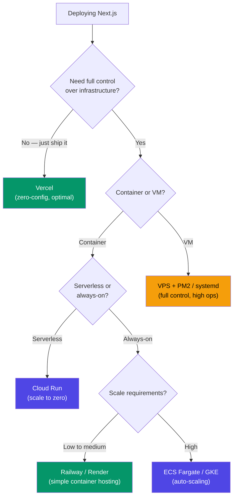
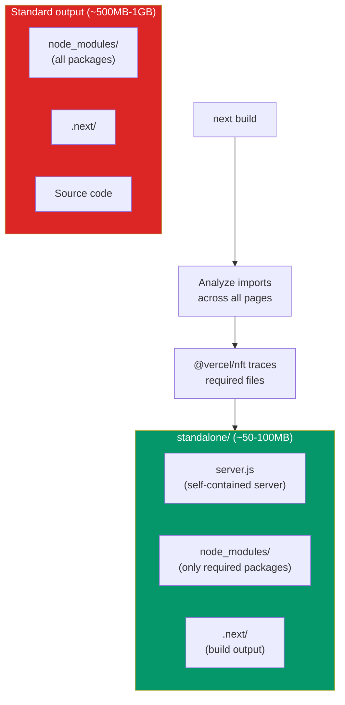
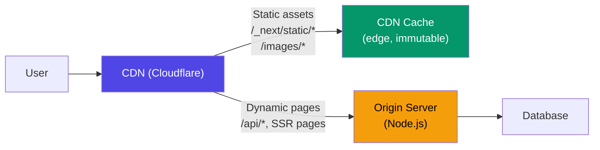

# Deploy Next.js

Next.js is not a typical frontend framework. It runs server-side code, has multiple rendering strategies (SSR, SSG, ISR, streaming), requires a Node.js runtime (or Edge runtime), and manages its own caching layer. This means deploying Next.js is fundamentally different from deploying a static React app. You cannot just upload files to a CDN and walk away.

This page covers every deployment strategy for Next.js: Vercel (the zero-config path), self-hosted with Docker (the full-control path), and everything in between. Each strategy includes production-tested configurations, performance optimization, and operational considerations.

## Deployment Decision Tree



## Vercel (Zero-Config)

Vercel is the company that builds Next.js. Deploying to Vercel is the path of least resistance — every Next.js feature works out of the box with zero configuration.

### Setup

```bash
# Install Vercel CLI
npm install -g vercel

# Initialize (links to Vercel project)
vercel link

# Deploy to preview
vercel

# Deploy to production
vercel --prod
```

That is the entire deployment process. No Dockerfile, no CI/CD pipeline to configure, no infrastructure to manage.

### What Vercel Handles Automatically

| Feature | How Vercel Handles It |
|---------|----------------------|
| **HTTPS / TLS** | Automatic certificate provisioning via Let's Encrypt |
| **CDN** | Global edge network for static assets and ISR pages |
| **ISR** | Built-in stale-while-revalidate at the edge |
| **Image Optimization** | `next/image` served from Vercel's image CDN |
| **Serverless Functions** | Each API route / server component = serverless function |
| **Edge Functions** | Middleware and edge routes run at 30+ edge locations |
| **Preview Deployments** | Every git branch / PR gets a unique URL |
| **Analytics** | Web Vitals tracking built-in |
| **Caching** | Automatic `Cache-Control` headers for static assets |
| **Logs** | Real-time function logs in dashboard |

### Vercel Configuration

```json
// vercel.json
{
  "framework": "nextjs",
  "regions": ["iad1", "sfo1", "cdg1"],
  "functions": {
    "app/api/**": {
      "memory": 1024,
      "maxDuration": 30
    }
  },
  "headers": [
    {
      "source": "/api/(.*)",
      "headers": [
        { "key": "Cache-Control", "value": "no-store" }
      ]
    },
    {
      "source": "/(.*)",
      "headers": [
        { "key": "X-Content-Type-Options", "value": "nosniff" },
        { "key": "X-Frame-Options", "value": "DENY" },
        { "key": "Referrer-Policy", "value": "strict-origin-when-cross-origin" }
      ]
    }
  ],
  "rewrites": [
    { "source": "/api/health", "destination": "/api/health" }
  ]
}
```

### Environment Variables on Vercel

```bash
# Set environment variables via CLI
vercel env add DATABASE_URL production
vercel env add NEXT_PUBLIC_API_URL production preview development

# Or via the dashboard: Project Settings → Environment Variables
```

| Variable Scope | Available In |
|---------------|-------------|
| Production | Only production deployments |
| Preview | All preview deployments (branches/PRs) |
| Development | `vercel dev` (local development) |

::: tip Vercel Cost Considerations
Vercel's free tier is generous for hobby projects (100GB bandwidth, 100 hours serverless). For production apps, the Pro plan ($20/team member/month) includes 1TB bandwidth and 1000 hours serverless. Beyond that, costs scale with traffic. Monitor your usage — image optimization and serverless function invocations are common sources of surprise bills.
:::

## Self-Hosted with Docker

Self-hosting gives you full control over infrastructure, costs, and data residency. Next.js provides a `standalone` output mode designed specifically for Docker deployments.

### Next.js Configuration

```javascript
// next.config.js
/** @type {import('next').NextConfig} */
const nextConfig = {
  output: 'standalone', // Critical for Docker deployments
  experimental: {
    // Instrument for monitoring (optional)
    instrumentationHook: true,
  },
  images: {
    // When self-hosting, configure allowed image domains
    remotePatterns: [
      {
        protocol: 'https',
        hostname: '**.amazonaws.com',
      },
    ],
    // Use sharp for image optimization (install as dependency)
    // sharp is included automatically in standalone mode
  },
};

module.exports = nextConfig;
```

### Docker Multi-Stage Build

```dockerfile
# syntax=docker/dockerfile:1

# ---- Dependencies ----
FROM node:20-alpine AS deps
RUN apk add --no-cache libc6-compat
WORKDIR /app

COPY package.json pnpm-lock.yaml ./
RUN corepack enable pnpm && pnpm install --frozen-lockfile

# ---- Build ----
FROM node:20-alpine AS builder
WORKDIR /app

COPY --from=deps /app/node_modules ./node_modules
COPY . .

# Build arguments for public env vars (baked into the client bundle)
ARG NEXT_PUBLIC_API_URL
ENV NEXT_PUBLIC_API_URL=$NEXT_PUBLIC_API_URL

# Disable Next.js telemetry during build
ENV NEXT_TELEMETRY_DISABLED=1

RUN npm run build

# ---- Production ----
FROM node:20-alpine AS runner
WORKDIR /app

ENV NODE_ENV=production
ENV NEXT_TELEMETRY_DISABLED=1

# Create non-root user
RUN addgroup --system --gid 1001 nodejs
RUN adduser --system --uid 1001 nextjs

# Copy public assets
COPY --from=builder /app/public ./public

# Set correct permissions for prerender cache
RUN mkdir .next
RUN chown nextjs:nodejs .next

# Copy standalone output (includes only necessary node_modules)
COPY --from=builder --chown=nextjs:nodejs /app/.next/standalone ./
COPY --from=builder --chown=nextjs:nodejs /app/.next/static ./.next/static

USER nextjs

EXPOSE 3000
ENV PORT=3000
ENV HOSTNAME="0.0.0.0"

# Health check
HEALTHCHECK --interval=30s --timeout=3s --start-period=15s --retries=3 \
  CMD wget --no-verbose --tries=1 --spider http://localhost:3000/api/health || exit 1

CMD ["node", "server.js"]
```

### What `output: 'standalone'` Does



The standalone output uses `@vercel/nft` (Node File Trace) to determine exactly which files from `node_modules` are needed at runtime. It copies only those files, reducing the production image from ~500MB to ~50-100MB.

::: warning Static Assets Need Separate Handling
The standalone output does not include the `public/` folder or `.next/static/` folder. You must copy them separately in your Dockerfile (as shown above). For best performance, serve these through a CDN or reverse proxy (Nginx, Cloudflare) instead of the Node.js server.
:::

## Edge vs Node Runtime

Next.js supports two runtimes for server-side code:

| Feature | Node.js Runtime | Edge Runtime |
|---------|----------------|--------------|
| Cold start | ~250ms | ~10ms |
| Max execution | 5 min (Vercel) / unlimited (self-hosted) | 30 seconds |
| APIs available | Full Node.js | Web APIs only (no `fs`, `path`, etc.) |
| Memory | Up to 3GB | Up to 128MB |
| Streaming | Yes | Yes |
| Data sources | Any (databases, file system) | HTTP only (fetch-based) |
| Best for | Complex logic, database queries | Simple transformations, auth, redirects |

### Choosing Runtime Per Route

```tsx
// app/api/complex-report/route.ts
export const runtime = 'nodejs'; // default — full Node.js APIs

// app/api/geo-redirect/route.ts
export const runtime = 'edge'; // fast cold start, limited APIs

// middleware.ts — always runs on Edge
export function middleware(request) {
  // This runs at the edge, before the request reaches the server
}
```

### Self-Hosted Edge Considerations

When self-hosting, the "Edge Runtime" runs on Node.js but with the Web API compatibility layer. You do not get the geographic distribution of Vercel's edge network. For true edge deployment when self-hosting, use Cloudflare Workers or Fly.io with multiple regions.

## CDN and Caching

### Static Asset Caching

Next.js automatically adds cache headers to static assets:

```
# Immutable assets (hashed filenames — /_next/static/*)
Cache-Control: public, max-age=31536000, immutable

# Pages — depends on rendering strategy
# Static pages (SSG)
Cache-Control: public, s-maxage=31536000, stale-while-revalidate

# ISR pages
Cache-Control: public, s-maxage=60, stale-while-revalidate=30

# Dynamic pages (SSR)
Cache-Control: private, no-cache, no-store, max-age=0, must-revalidate
```

### CDN Architecture for Self-Hosted



### Nginx Reverse Proxy Configuration

For self-hosted deployments, put Nginx in front of the Next.js server:

```nginx
# nginx.conf
upstream nextjs {
    server 127.0.0.1:3000;
    keepalive 64;
}

server {
    listen 80;
    server_name myapp.com;

    # Redirect to HTTPS
    return 301 https://$server_name$request_uri;
}

server {
    listen 443 ssl http2;
    server_name myapp.com;

    ssl_certificate /etc/letsencrypt/live/myapp.com/fullchain.pem;
    ssl_certificate_key /etc/letsencrypt/live/myapp.com/privkey.pem;

    # Static assets — serve directly, cache aggressively
    location /_next/static/ {
        proxy_pass http://nextjs;
        proxy_cache_valid 200 365d;
        add_header Cache-Control "public, max-age=31536000, immutable";
    }

    # Image optimization
    location /_next/image {
        proxy_pass http://nextjs;
        proxy_cache_valid 200 60m;
    }

    # Public assets
    location /public/ {
        alias /app/public/;
        expires 30d;
        add_header Cache-Control "public, no-transform";
    }

    # All other requests — proxy to Next.js
    location / {
        proxy_pass http://nextjs;
        proxy_http_version 1.1;
        proxy_set_header Upgrade $http_upgrade;
        proxy_set_header Connection 'upgrade';
        proxy_set_header Host $host;
        proxy_set_header X-Real-IP $remote_addr;
        proxy_set_header X-Forwarded-For $proxy_add_x_forwarded_for;
        proxy_set_header X-Forwarded-Proto $scheme;
        proxy_cache_bypass $http_upgrade;
    }
}
```

## Preview Deployments

Preview deployments create a unique URL for every branch or pull request, allowing code review with a live application.

### Vercel Preview Deployments

Vercel creates preview deployments automatically for every git push. No configuration needed.

### Self-Hosted Preview Deployments

For self-hosted setups, use GitHub Actions to deploy preview environments:

```yaml
# .github/workflows/preview.yml
name: Preview Deployment

on:
  pull_request:
    types: [opened, synchronize, reopened]

jobs:
  deploy-preview:
    runs-on: ubuntu-latest
    steps:
      - uses: actions/checkout@v4

      - name: Build Docker image
        run: |
          docker build \
            --build-arg NEXT_PUBLIC_API_URL=https://preview-${{ github.event.number }}.myapp.com \
            -t myapp:pr-${{ github.event.number }} .

      - name: Push to registry
        run: |
          docker tag myapp:pr-${{ github.event.number }} \
            ghcr.io/myorg/myapp:pr-${{ github.event.number }}
          docker push ghcr.io/myorg/myapp:pr-${{ github.event.number }}

      - name: Deploy preview
        run: |
          # Deploy to Cloud Run with a unique service name
          gcloud run deploy myapp-pr-${{ github.event.number }} \
            --image ghcr.io/myorg/myapp:pr-${{ github.event.number }} \
            --region us-central1 \
            --allow-unauthenticated \
            --tag pr-${{ github.event.number }}

      - name: Comment PR with preview URL
        uses: actions/github-script@v7
        with:
          script: |
            github.rest.issues.createComment({
              owner: context.repo.owner,
              repo: context.repo.repo,
              issue_number: context.issue.number,
              body: `Preview deployed: https://myapp-pr-${{ github.event.number }}-hash.a.run.app`
            });
```

## Performance Optimization

### Build-Time Optimization

```javascript
// next.config.js
const nextConfig = {
  output: 'standalone',

  // Analyze bundle size
  // npm install @next/bundle-analyzer
  ...(process.env.ANALYZE === 'true' && {
    webpack: (config, { isServer }) => {
      const { BundleAnalyzerPlugin } = require('webpack-bundle-analyzer');
      config.plugins.push(
        new BundleAnalyzerPlugin({
          analyzerMode: 'static',
          reportFilename: isServer ? 'server-report.html' : 'client-report.html',
        })
      );
      return config;
    },
  }),

  // Reduce image sizes
  images: {
    formats: ['image/avif', 'image/webp'],
    deviceSizes: [640, 750, 828, 1080, 1200, 1920, 2048],
    imageSizes: [16, 32, 48, 64, 96, 128, 256, 384],
  },

  // Compress output
  compress: true,

  // Strict mode for better React patterns
  reactStrictMode: true,

  // Production source maps (optional — useful for error tracking)
  productionBrowserSourceMaps: false,
};
```

### Runtime Performance Headers

```typescript
// middleware.ts
import { NextResponse } from 'next/server';

export function middleware(request) {
  const response = NextResponse.next();

  // Security headers
  response.headers.set('X-DNS-Prefetch-Control', 'on');
  response.headers.set('Strict-Transport-Security', 'max-age=63072000; includeSubDomains; preload');
  response.headers.set('X-Content-Type-Options', 'nosniff');
  response.headers.set('Referrer-Policy', 'strict-origin-when-cross-origin');
  response.headers.set('Permissions-Policy', 'camera=(), microphone=(), geolocation=()');

  return response;
}
```

### ISR Cache Configuration (Self-Hosted)

When self-hosting, ISR pages are cached on the local filesystem by default. For multi-instance deployments, use a shared cache:

```typescript
// next.config.js — custom cache handler for multi-instance ISR
const nextConfig = {
  cacheHandler: require.resolve('./cache-handler.js'),
  cacheMaxMemorySize: 0, // disable in-memory cache, use external only
};
```

```typescript
// cache-handler.js — Redis-based ISR cache
const Redis = require('ioredis');

const redis = new Redis(process.env.REDIS_URL);

module.exports = class CacheHandler {
  async get(key) {
    const data = await redis.get(`next-cache:${key}`);
    return data ? JSON.parse(data) : null;
  }

  async set(key, data, ctx) {
    const ttl = ctx.revalidate || 60;
    await redis.setex(
      `next-cache:${key}`,
      ttl,
      JSON.stringify(data)
    );
  }

  async revalidateTag(tag) {
    const keys = await redis.keys(`next-cache:*`);
    // In production, use Redis sets to track tag-to-key mappings
    // This is a simplified example
    for (const key of keys) {
      const data = await redis.get(key);
      if (data) {
        const parsed = JSON.parse(data);
        if (parsed.tags?.includes(tag)) {
          await redis.del(key);
        }
      }
    }
  }
};
```

::: warning ISR with Multiple Instances
If you run multiple Next.js instances behind a load balancer, each instance has its own ISR cache by default. This means different instances may serve different versions of the same page. Use a shared cache (Redis, Memcached) or a CDN with `stale-while-revalidate` to ensure consistency.
:::

## Production Checklist

- [ ] **`output: 'standalone'`** set in `next.config.js`
- [ ] **Docker image builds and runs locally** — `docker build && docker run`
- [ ] **Health check endpoint** at `/api/health` — returns 200 when ready
- [ ] **Environment variables** configured per environment (production, preview)
- [ ] **`NEXT_PUBLIC_*` variables** set at build time (they are baked into the client bundle)
- [ ] **Image optimization** working — `next/image` with `sharp` installed
- [ ] **Security headers** configured — CSP, HSTS, X-Frame-Options
- [ ] **Error tracking** configured — Sentry or equivalent
- [ ] **CDN or reverse proxy** in front of Node.js server for static assets
- [ ] **ISR cache strategy** — shared cache if running multiple instances
- [ ] **CI/CD pipeline** — automated build, test, deploy
- [ ] **Rollback procedure** documented and tested
- [ ] **Preview deployments** configured for pull requests

## Cross-References

- [Next.js Patterns & Best Practices](/infrastructure/languages/nextjs-patterns) — App Router, Server Components, data fetching
- [Deploy Node.js to Production](/devops/deployment-guides/deploy-nodejs) — general Node.js deployment
- [Deployment Guides Overview](/devops/deployment-guides/) — choosing a platform
- [Deployment Strategies](/devops/deployment-strategies/) — blue-green, canary, rolling
- [Monitoring](/devops/monitoring/) — observability for production apps

## Summary

| Strategy | Best For | Effort | Control |
|----------|---------|--------|---------|
| **Vercel** | Most projects | Minimal | Low (managed) |
| **Docker + Cloud Run** | Serverless self-hosting | Medium | Medium |
| **Docker + Railway/Render** | Simple self-hosting | Low | Medium |
| **Docker + ECS/GKE** | Enterprise scale | High | High |
| **Docker + VPS + Nginx** | Budget, full control | High | Maximum |

The default recommendation: deploy to Vercel unless you have a specific reason not to (data residency, cost at scale, existing infrastructure). When self-hosting, always use `output: 'standalone'` with a multi-stage Docker build. Put a CDN in front for static assets. Use a shared cache for ISR when running multiple instances. And always test your deployment locally before pushing to production.
