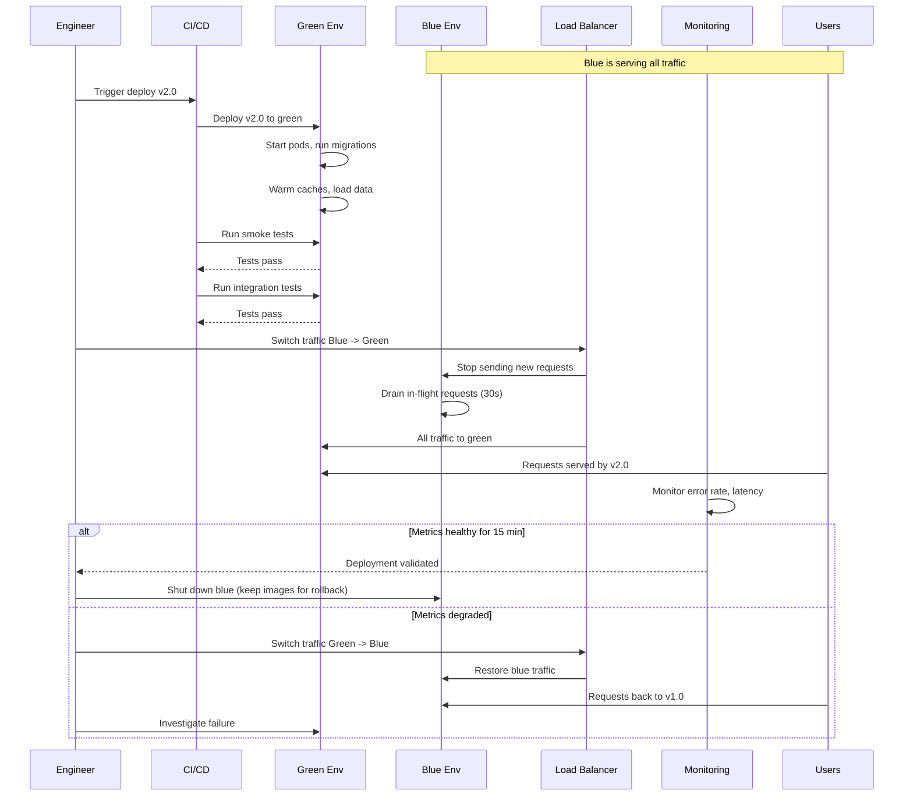
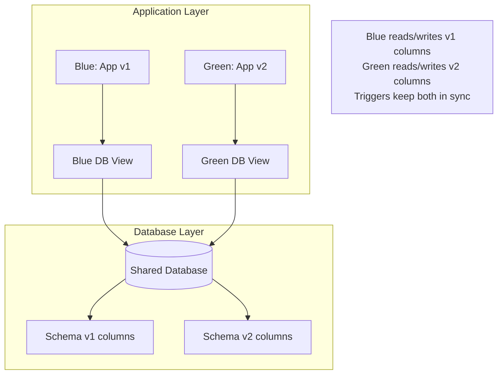

# Blue-Green Deployment

## Why It Exists

Blue-green deployment solves the rollback time problem. In a traditional deployment, rolling back means re-deploying the previous version - which takes as long as the original deployment. If deploying takes 15 minutes, rolling back takes another 15 minutes. During those 15 minutes, your service is serving broken traffic.

Blue-green eliminates this by maintaining two identical production environments: **Blue** (current) and **Green** (new). You deploy to the idle environment, verify it works, then switch traffic atomically. If something goes wrong, you switch back - in seconds, not minutes.

The concept originated in the early 2000s at ThoughtWorks, popularized by Jez Humble and David Farley in "Continuous Delivery" (2010). The name comes from the idea of having two identical environments distinguished only by color.

### The Cost-Benefit Trade-off

Blue-green requires 2x infrastructure during deployment (both environments running simultaneously). This is the primary cost:

$$
C_{blue\_green} = C_{infra} \times 2 \times T_{deploy}  + C_{idle} \times T_{idle}
$$

Where $T_{deploy}$ is the deployment duration and $T_{idle}$ is how long you keep the old environment running after switching (for rollback capability).

For most organizations, the cost of 2x infrastructure for 30-60 minutes is negligible compared to the cost of extended downtime from a failed deployment.

## First Principles

### Atomic Switching

The key property of blue-green is **atomic switching**: at any given moment, all traffic goes to one environment. There is no mixed-version state. This eliminates an entire class of bugs related to version incompatibility:

$$
\forall t: \text{traffic}(t) \in \{\text{Blue}, \text{Green}\}, \text{ never both}
$$

In practice, the switch takes 1-30 seconds depending on the mechanism (DNS propagation, load balancer update, service mesh reconfiguration). During this window, some requests may go to the old environment and others to the new. Properly designed systems handle this through connection draining.

### Environment Equivalence

For blue-green to work, both environments must be functionally identical in every way except the application version:

- Same infrastructure (compute, memory, disk)
- Same configuration (environment variables, secrets)
- Same networking (VPC, subnets, security groups)
- Same data access (database, cache, queues)

The database is typically shared between blue and green (not duplicated), which introduces the backward compatibility requirement for database schemas.

```mermaid
flowchart TD
    subgraph Blue Environment
        B1[App v1.0 Pod 1]
        B2[App v1.0 Pod 2]
        B3[App v1.0 Pod 3]
    end

    subgraph Green Environment
        G1[App v2.0 Pod 1]
        G2[App v2.0 Pod 2]
        G3[App v2.0 Pod 3]
    end

    LB[Load Balancer] -->|Active| Blue Environment
    LB -.->|Standby| Green Environment

    DB[(Shared Database)]
    Blue Environment --> DB
    Green Environment --> DB

    Cache[(Shared Cache)]
    Blue Environment --> Cache
    Green Environment --> Cache
```

## Core Mechanics

### Deployment Sequence



### Traffic Switching Mechanisms

There are several ways to implement the traffic switch:

**1. DNS-based switching**
Change the DNS record from the blue environment's IP to the green environment's IP.
- Pros: Simple, works with any infrastructure
- Cons: DNS TTL causes gradual migration (not truly atomic), client-side caching

**2. Load balancer target group switching**
Update the load balancer's target group from blue instances to green instances.
- Pros: Fast (seconds), no DNS propagation, works with AWS ALB/NLB
- Cons: Requires LB API access, single point of failure

**3. Kubernetes Service selector switching**
Change the label selector on a Kubernetes Service to point from blue pods to green pods.
- Pros: Native Kubernetes, very fast, no external dependencies
- Cons: Requires both deployments to run in the same cluster

**4. Service mesh traffic shifting**
Use Istio/Linkerd VirtualService to route 100% traffic to one version.
- Pros: Most flexible, can do gradual shift, supports header-based routing
- Cons: Requires service mesh infrastructure

## Implementation

### Kubernetes Blue-Green with Service Selector

```typescript
// blue-green-deployer.ts
import * as k8s from '@kubernetes/client-node';

interface BlueGreenConfig {
  namespace: string;
  serviceName: string;
  deploymentBaseName: string;
  containerImage: string;
  replicas: number;
  healthCheckPath: string;
  healthCheckPort: number;
  switchWaitSeconds: number;
  rollbackWindowMinutes: number;
}

interface DeploymentResult {
  success: boolean;
  activeColor: 'blue' | 'green';
  switchedAt?: Date;
  error?: string;
  rollbackAvailable: boolean;
}

class BlueGreenDeployer {
  private k8sApi: k8s.AppsV1Api;
  private coreApi: k8s.CoreV1Api;
  private config: BlueGreenConfig;

  constructor(config: BlueGreenConfig) {
    const kc = new k8s.KubeConfig();
    kc.loadFromDefault();
    this.k8sApi = kc.makeApiClient(k8s.AppsV1Api);
    this.coreApi = kc.makeApiClient(k8s.CoreV1Api);
    this.config = config;
  }

  async deploy(newImage: string): Promise<DeploymentResult> {
    try {
      // 1. Determine current active color
      const activeColor = await this.getActiveColor();
      const targetColor = activeColor === 'blue' ? 'green' : 'blue';

      console.log(`Current active: ${activeColor}, deploying to: ${targetColor}`);

      // 2. Deploy to inactive environment
      await this.deployToColor(targetColor, newImage);

      // 3. Wait for pods to be ready
      const ready = await this.waitForReady(targetColor, 300);
      if (!ready) {
        return {
          success: false,
          activeColor,
          error: 'New deployment did not become ready within timeout',
          rollbackAvailable: false,
        };
      }

      // 4. Run smoke tests against new environment
      const smokeTestPassed = await this.runSmokeTests(targetColor);
      if (!smokeTestPassed) {
        await this.cleanupFailedDeployment(targetColor);
        return {
          success: false,
          activeColor,
          error: 'Smoke tests failed on new deployment',
          rollbackAvailable: false,
        };
      }

      // 5. Switch traffic
      await this.switchTraffic(targetColor);

      // 6. Wait for connection draining
      console.log(`Waiting ${this.config.switchWaitSeconds}s for connection drain...`);
      await this.sleep(this.config.switchWaitSeconds * 1000);

      return {
        success: true,
        activeColor: targetColor,
        switchedAt: new Date(),
        rollbackAvailable: true,
      };
    } catch (error) {
      return {
        success: false,
        activeColor: await this.getActiveColor(),
        error: String(error),
        rollbackAvailable: true,
      };
    }
  }

  async rollback(): Promise<DeploymentResult> {
    const activeColor = await this.getActiveColor();
    const previousColor = activeColor === 'blue' ? 'green' : 'blue';

    // Verify previous environment is still running
    const previousReady = await this.isColorReady(previousColor);
    if (!previousReady) {
      return {
        success: false,
        activeColor,
        error: `Previous environment (${previousColor}) is not available for rollback`,
        rollbackAvailable: false,
      };
    }

    // Switch back
    await this.switchTraffic(previousColor);

    return {
      success: true,
      activeColor: previousColor,
      switchedAt: new Date(),
      rollbackAvailable: true,
    };
  }

  private async getActiveColor(): Promise<'blue' | 'green'> {
    const service = await this.coreApi.readNamespacedService(
      this.config.serviceName,
      this.config.namespace
    );

    const selector = service.body.spec?.selector;
    return selector?.color === 'green' ? 'green' : 'blue';
  }

  private async deployToColor(
    color: 'blue' | 'green',
    image: string
  ): Promise<void> {
    const deploymentName = `${this.config.deploymentBaseName}-${color}`;

    const deployment: k8s.V1Deployment = {
      metadata: {
        name: deploymentName,
        namespace: this.config.namespace,
        labels: {
          app: this.config.deploymentBaseName,
          color,
        },
      },
      spec: {
        replicas: this.config.replicas,
        selector: {
          matchLabels: {
            app: this.config.deploymentBaseName,
            color,
          },
        },
        template: {
          metadata: {
            labels: {
              app: this.config.deploymentBaseName,
              color,
            },
          },
          spec: {
            containers: [
              {
                name: 'app',
                image,
                ports: [{ containerPort: this.config.healthCheckPort }],
                readinessProbe: {
                  httpGet: {
                    path: this.config.healthCheckPath,
                    port: this.config.healthCheckPort,
                  },
                  initialDelaySeconds: 10,
                  periodSeconds: 5,
                  failureThreshold: 3,
                },
                livenessProbe: {
                  httpGet: {
                    path: this.config.healthCheckPath,
                    port: this.config.healthCheckPort,
                  },
                  initialDelaySeconds: 30,
                  periodSeconds: 10,
                  failureThreshold: 3,
                },
                lifecycle: {
                  preStop: {
                    exec: {
                      command: ['sh', '-c', 'sleep 15'],
                    },
                  },
                },
              },
            ],
            terminationGracePeriodSeconds: 60,
          },
        },
      },
    };

    try {
      await this.k8sApi.readNamespacedDeployment(
        deploymentName,
        this.config.namespace
      );
      // Update existing deployment
      await this.k8sApi.replaceNamespacedDeployment(
        deploymentName,
        this.config.namespace,
        deployment
      );
    } catch {
      // Create new deployment
      await this.k8sApi.createNamespacedDeployment(
        this.config.namespace,
        deployment
      );
    }
  }

  private async switchTraffic(targetColor: 'blue' | 'green'): Promise<void> {
    const service = await this.coreApi.readNamespacedService(
      this.config.serviceName,
      this.config.namespace
    );

    if (service.body.spec?.selector) {
      service.body.spec.selector.color = targetColor;
    }

    await this.coreApi.replaceNamespacedService(
      this.config.serviceName,
      this.config.namespace,
      service.body
    );

    console.log(`Traffic switched to ${targetColor}`);
  }

  private async waitForReady(
    color: 'blue' | 'green',
    timeoutSeconds: number
  ): Promise<boolean> {
    const deploymentName = `${this.config.deploymentBaseName}-${color}`;
    const deadline = Date.now() + timeoutSeconds * 1000;

    while (Date.now() < deadline) {
      const deployment = await this.k8sApi.readNamespacedDeployment(
        deploymentName,
        this.config.namespace
      );

      const status = deployment.body.status;
      const desired = deployment.body.spec?.replicas ?? 0;

      if (
        status?.readyReplicas === desired &&
        status?.updatedReplicas === desired
      ) {
        console.log(`All ${desired} replicas ready for ${color}`);
        return true;
      }

      console.log(
        `Waiting: ${status?.readyReplicas ?? 0}/${desired} ready`
      );
      await this.sleep(5000);
    }

    return false;
  }

  private async isColorReady(color: 'blue' | 'green'): Promise<boolean> {
    try {
      const deploymentName = `${this.config.deploymentBaseName}-${color}`;
      const deployment = await this.k8sApi.readNamespacedDeployment(
        deploymentName,
        this.config.namespace
      );
      const status = deployment.body.status;
      const desired = deployment.body.spec?.replicas ?? 0;
      return status?.readyReplicas === desired;
    } catch {
      return false;
    }
  }

  private async runSmokeTests(color: 'blue' | 'green'): Promise<boolean> {
    console.log(`Running smoke tests against ${color} environment...`);
    // In production, this would:
    // 1. Hit internal endpoints directly (not through the public LB)
    // 2. Verify health, key API endpoints, database connectivity
    // 3. Run critical path integration tests
    return true;
  }

  private async cleanupFailedDeployment(color: 'blue' | 'green'): Promise<void> {
    const deploymentName = `${this.config.deploymentBaseName}-${color}`;
    try {
      await this.k8sApi.deleteNamespacedDeployment(
        deploymentName,
        this.config.namespace
      );
    } catch {
      // Ignore errors during cleanup
    }
  }

  private sleep(ms: number): Promise<void> {
    return new Promise((resolve) => setTimeout(resolve, ms));
  }
}

// --- Usage ---
const deployer = new BlueGreenDeployer({
  namespace: 'production',
  serviceName: 'api-gateway',
  deploymentBaseName: 'api-gateway',
  containerImage: 'registry.example.com/api-gateway',
  replicas: 5,
  healthCheckPath: '/health',
  healthCheckPort: 8080,
  switchWaitSeconds: 30,
  rollbackWindowMinutes: 60,
});

// Deploy
const result = await deployer.deploy('registry.example.com/api-gateway:v2.0.0');
if (!result.success) {
  console.error('Deployment failed:', result.error);
}

// Rollback if needed
if (result.rollbackAvailable) {
  const rollbackResult = await deployer.rollback();
  console.log('Rollback:', rollbackResult.success ? 'success' : 'failed');
}
```

### AWS ECS Blue-Green with CodeDeploy

```typescript
interface ECSBlueGreenConfig {
  clusterName: string;
  serviceName: string;
  taskDefinitionArn: string;
  targetGroupBlueArn: string;
  targetGroupGreenArn: string;
  listenerArn: string;
  testListenerArn?: string;
  terminationWaitMinutes: number;
}

/**
 * Generate AWS CodeDeploy appspec for ECS blue-green deployment.
 * CodeDeploy handles the traffic shifting and rollback automatically.
 */
function generateCodeDeployAppSpec(config: ECSBlueGreenConfig): object {
  return {
    version: '0.0',
    Resources: [
      {
        TargetService: {
          Type: 'AWS::ECS::Service',
          Properties: {
            TaskDefinition: config.taskDefinitionArn,
            LoadBalancerInfo: {
              ContainerName: 'app',
              ContainerPort: 8080,
            },
            PlatformVersion: 'LATEST',
          },
        },
      },
    ],
    Hooks: [
      {
        BeforeInstall: 'LambdaFunctionToValidateBeforeInstall',
      },
      {
        AfterInstall: 'LambdaFunctionToValidateAfterInstall',
      },
      {
        AfterAllowTestTraffic: 'LambdaFunctionToValidateAfterTestTraffic',
      },
      {
        BeforeAllowTraffic: 'LambdaFunctionToValidateBeforeAllowTraffic',
      },
      {
        AfterAllowTraffic: 'LambdaFunctionToValidateAfterAllowTraffic',
      },
    ],
  };
}

/**
 * Generate Terraform for ECS blue-green deployment infrastructure
 */
function generateECSTerraform(config: ECSBlueGreenConfig): string {
  return `
resource "aws_codedeploy_app" "${config.serviceName}" {
  compute_platform = "ECS"
  name             = "${config.serviceName}"
}

resource "aws_codedeploy_deployment_group" "${config.serviceName}" {
  app_name               = aws_codedeploy_app.${config.serviceName}.name
  deployment_config_name = "CodeDeployDefault.ECSAllAtOnce"
  deployment_group_name  = "${config.serviceName}-deploy-group"
  service_role_arn        = aws_iam_role.codedeploy.arn

  auto_rollback_configuration {
    enabled = true
    events  = ["DEPLOYMENT_FAILURE"]
  }

  blue_green_deployment_config {
    deployment_ready_option {
      action_on_timeout = "CONTINUE_DEPLOYMENT"
      wait_time_in_minutes = 5
    }

    terminate_blue_instances_on_deployment_success {
      action                           = "TERMINATE"
      termination_wait_time_in_minutes = ${config.terminationWaitMinutes}
    }
  }

  deployment_style {
    deployment_option = "WITH_TRAFFIC_CONTROL"
    deployment_type   = "BLUE_GREEN"
  }

  ecs_service {
    cluster_name = "${config.clusterName}"
    service_name = "${config.serviceName}"
  }

  load_balancer_info {
    target_group_pair_info {
      prod_traffic_route {
        listener_arns = ["${config.listenerArn}"]
      }

      target_group {
        name = aws_lb_target_group.blue.name
      }

      target_group {
        name = aws_lb_target_group.green.name
      }
    }
  }
}
`;
}
```

## Edge Cases and Failure Modes

### 1. Database Schema Incompatibility

The most common blue-green failure. Green expects column `user_full_name` but Blue wrote data with column `user_name`. Both point to the same database.

**Solution**: Always use expand-contract migrations:
1. Add `user_full_name` (expand) - backward compatible
2. Deploy green, which writes to both columns
3. Migrate data from `user_name` to `user_full_name`
4. After blue is decommissioned, drop `user_name` (contract)

### 2. Session State Loss

If sessions are stored in-memory (not externalized), switching from blue to green invalidates all active sessions. Users are logged out.

**Solution**: Externalize session state (Redis, database). Never store sessions in application memory for blue-green services.

### 3. Long-Running Connections

WebSocket connections, gRPC streams, and long-poll requests won't automatically move from blue to green when you switch the load balancer.

```typescript
/**
 * Connection draining strategy for long-lived connections.
 * Sends a reconnect signal to clients before switching.
 */
async function drainLongLivedConnections(
  activeColor: 'blue' | 'green',
  drainTimeSeconds: number
): Promise<void> {
  // 1. Stop accepting new long-lived connections on the old environment
  console.log(`Stopping new connections on ${activeColor}`);

  // 2. Send GOAWAY/reconnect signal to existing connections
  // For WebSocket: send close frame with reason "server_going_away"
  // For gRPC: send GOAWAY frame
  // For HTTP long-poll: return response early with retry-after header

  // 3. Wait for connections to drain
  const deadline = Date.now() + drainTimeSeconds * 1000;
  while (Date.now() < deadline) {
    // Check remaining connections
    const remaining = 0; // Would query the actual connection count
    if (remaining === 0) break;
    await new Promise((r) => setTimeout(r, 1000));
  }

  // 4. Force-close any remaining connections
  console.log('Drain complete, force-closing remaining connections');
}
```

### 4. Cache Cold Start

The green environment has empty caches. Switching all traffic at once causes a cache stampede that can overwhelm the database.

**Solution**: Pre-warm caches before switching:

```typescript
async function prewarmCache(
  targetColor: 'blue' | 'green',
  topQueries: string[]
): Promise<void> {
  console.log(`Pre-warming cache for ${targetColor}...`);

  // Execute top queries to populate caches
  for (const query of topQueries) {
    try {
      // Hit the green environment directly (internal endpoint)
      await fetch(`http://${targetColor}-internal.svc/api/warmup`, {
        method: 'POST',
        body: JSON.stringify({ query }),
      });
    } catch (err) {
      console.warn(`Cache warmup failed for query: ${query}`);
    }
  }
}
```

::: warning Blue-Green Pitfalls
1. **Cost creep**: Forgetting to tear down the old environment after validation. Set auto-cleanup timers.
2. **Config drift**: Blue and green have different environment variables. Use a shared config source.
3. **Data divergence**: If green writes data in a new format and you rollback to blue, blue cannot read it.
4. **Insufficient smoke tests**: Switching traffic without validating the green environment first.
5. **Missing preStop hooks**: Kubernetes routes traffic to pods during SIGTERM handling window.
:::

## Performance Characteristics

### Switching Time by Mechanism

| Mechanism | Switch Time | Rollback Time | Consistency |
|-----------|-----------|---------------|------------|
| DNS | 30s-5 min (TTL) | 30s-5 min | Eventually consistent |
| AWS ALB | 1-5 seconds | 1-5 seconds | Strongly consistent |
| K8s Service | 1-3 seconds | 1-3 seconds | Eventually consistent |
| Istio VirtualService | < 1 second | < 1 second | Strongly consistent |
| Nginx upstream | 1-2 seconds (reload) | 1-2 seconds | Strongly consistent |

### Resource Cost Analysis

$$
C_{total} = C_{green\_provision} + C_{parallel\_running} + C_{blue\_teardown}
$$

For a service with 10 pods at $0.05/pod/hour:

| Phase | Duration | Cost |
|-------|----------|------|
| Provision green | 5 min | $0.04 |
| Both running | 30 min (validation) | $0.50 |
| Teardown blue | 5 min | $0.04 |
| **Total per deploy** | 40 min | **$0.58** |

## Mathematical Foundations

### Availability During Switch

If the switch takes time $\Delta t$ and $p_{success}$ is the probability of a successful request during the switch:

$$
A_{switch} = 1 - \frac{\Delta t \cdot (1 - p_{success})}{T_{total}}
$$

For a 3-second switch with 99% request success during the switch, over a monthly window:

$$
A_{switch} = 1 - \frac{3 \times 0.01}{2{,}592{,}000} = 1 - 1.16 \times 10^{-8} \approx 99.9999988\%
$$

The availability impact of blue-green switching is negligible.

## Real-World War Stories

::: info War Story
**The Database Migration That Broke Both Environments (2022)**

A team ran a blue-green deployment with a database migration. The migration added a NOT NULL column with a default value. Green deployed successfully and passed smoke tests. Traffic was switched to green.

10 minutes later, alerts fired: error rate at 15%. Investigation revealed that the database migration had locked the users table for 8 seconds while adding the NOT NULL column to a 50M row table. During those 8 seconds, both blue AND green were unable to process user-related requests. Neither environment was "green" during the migration.

**Lesson**: Database migrations should NEVER run as part of the blue-green switch. They must be run separately, in advance, using online DDL (pt-online-schema-change, gh-ost) to avoid table locks.
:::

::: info War Story
**The $47,000 Cloud Bill (2021)**

A team implemented blue-green for their ML inference service running on GPU instances (p3.8xlarge at $12.24/hour). Their automation created the green environment but failed to tear down the old blue environment after switching. The auto-cleanup job was broken by a permissions change nobody noticed.

Over 4 weeks, they ran 2x GPU capacity at 100% cost. The next monthly AWS bill was $47,000 higher than expected. The fix was a 2-line IAM policy change and a cron job that checked for orphaned deployments.

**Lesson**: Always have a cleanup mechanism with its own monitoring. Set billing alerts.
:::

## Decision Framework

### When to Use Blue-Green

| Factor | Blue-Green is Good | Blue-Green is Bad |
|--------|-------------------|------------------|
| Rollback speed | Need instant rollback | Can tolerate minutes |
| Infrastructure cost | Can afford 2x briefly | Cannot double capacity |
| State management | Stateless or externalized state | Complex stateful workloads |
| Database changes | No migration or backward-compatible | Complex schema changes |
| Deploy frequency | Multiple times per day | Rare deployments |
| Team size | Any | Any |

### Blue-Green vs. Canary

| Criterion | Blue-Green | Canary |
|-----------|-----------|--------|
| Traffic exposure | All-or-nothing | Gradual |
| Validation time | Minutes | Hours |
| Risk profile | High risk during switch moment | Low risk throughout |
| Resource cost | 2x during deploy | +5-10% during deploy |
| Complexity | Medium | High |
| Best for | Fast, confident deploys | Risk-averse, large-scale |

## Advanced Topics

### Blue-Green with Database Versioning

For services that need different database versions for blue and green:



### Multi-Cluster Blue-Green

For organizations running multiple Kubernetes clusters, blue-green can operate at the cluster level:

```typescript
interface MultiClusterBlueGreen {
  clusters: {
    blue: string;  // cluster context name
    green: string;
  };
  globalLoadBalancer: string; // e.g., AWS Global Accelerator, Cloudflare LB
  healthCheckEndpoint: string;
  switchMechanism: 'dns' | 'global_lb' | 'service_mesh';
}

async function switchCluster(
  config: MultiClusterBlueGreen,
  targetCluster: 'blue' | 'green'
): Promise<void> {
  // 1. Verify target cluster health
  // 2. Update global load balancer to point to target
  // 3. Wait for propagation
  // 4. Verify traffic is flowing to target
  // 5. Drain old cluster
  console.log(`Switching global traffic to ${targetCluster} cluster`);
}
```

## Cross-References

- [Deployment Strategies Overview](./index.md) - Comparison of all strategies
- [Canary Deployment](./canary.md) - Progressive alternative to all-at-once switching
- [Rolling Updates](./rolling-updates.md) - Kubernetes-native gradual deployment
- [Database Migrations](./database-migrations.md) - Schema changes for blue-green compatibility
- [Rollback Procedures](./rollback-procedures.md) - Blue-green provides the fastest rollback path
