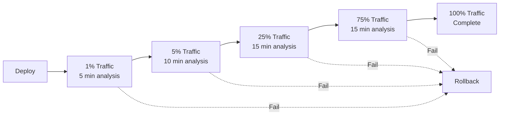
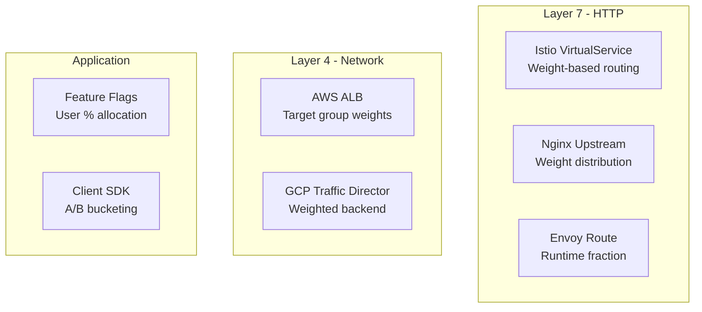
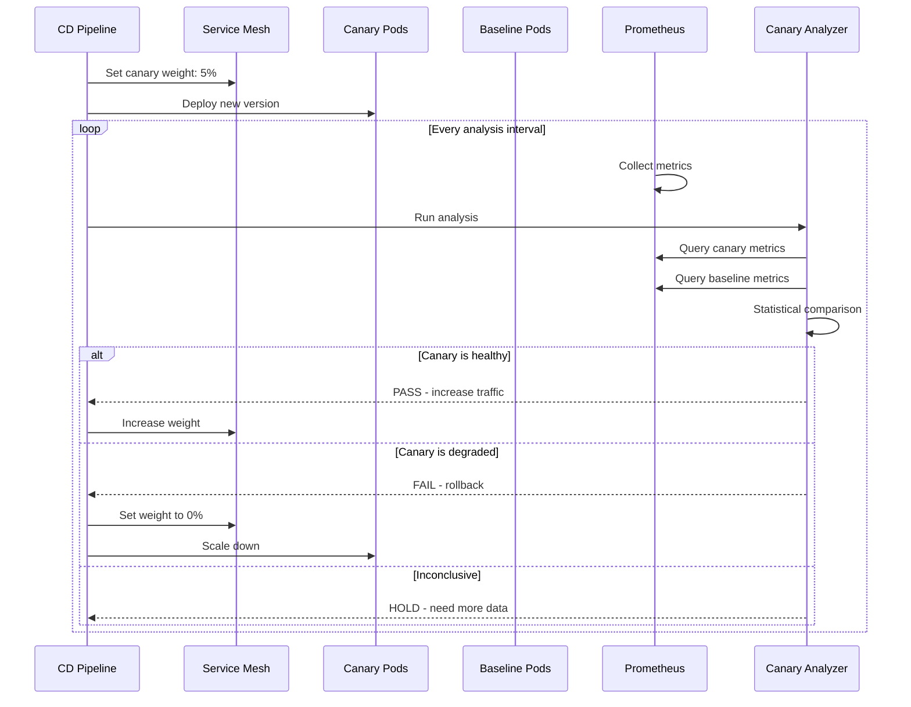
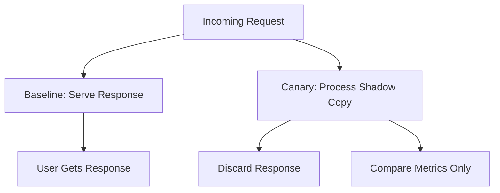

# Canary Deployment

## Why It Exists

Blue-green deployment gives you instant rollback, but it exposes 100% of traffic to the new version the moment you switch. If the new version has a subtle bug that only manifests under specific conditions or at scale, you discover it with all users simultaneously affected.

Canary deployment solves this by shifting traffic gradually: 1%, then 5%, then 10%, then 50%, then 100%. At each step, you compare the new version's metrics against the old version. If the canary is healthy, you increase traffic. If it's unhealthy, you roll back - having affected only a small percentage of users.

The name comes from coal mining: canaries were sent into mines to detect toxic gases. If the canary died, miners knew not to enter. In deployment, the canary instances detect production issues before they affect everyone.

### The Key Insight

Canary deployments trade deployment speed for deployment safety. A rolling update takes 5 minutes. A canary takes 30-120 minutes. But the expected cost of a failure is dramatically lower:

$$
E[\text{cost}_{canary}] = P(\text{failure}) \times \text{traffic\%} \times \text{impact} \times T_{detect}
$$

$$
E[\text{cost}_{rolling}] = P(\text{failure}) \times 100\% \times \text{impact} \times T_{detect}
$$

With canary at 5% traffic and 5-minute detection:

$$
\frac{E[\text{cost}_{canary}]}{E[\text{cost}_{rolling}]} = \frac{5\%}{100\%} = 0.05
$$

Canary reduces the expected cost of a bad deployment by 95%.

## First Principles

### Progressive Delivery

Canary deployment is a specific implementation of **progressive delivery**: the practice of gradually exposing new code to increasing audiences with automated analysis at each step.



### Canary Analysis: The Statistical Foundation

Canary analysis is fundamentally a statistical hypothesis test:

- **Null hypothesis ($H_0$)**: The canary version performs the same as the baseline
- **Alternative hypothesis ($H_1$)**: The canary version performs worse

For each metric (error rate, latency, etc.), we test:

$$
H_0: \mu_{canary} = \mu_{baseline} \quad \text{vs.} \quad H_1: \mu_{canary} > \mu_{baseline}
$$

The challenge is determining the minimum sample size needed for statistical significance:

$$
n = \left(\frac{z_{\alpha/2} + z_\beta}{\delta / \sigma}\right)^2
$$

Where:
- $\alpha$ = significance level (typically 0.05)
- $\beta$ = type II error rate (typically 0.2, giving 80% power)
- $\delta$ = minimum detectable effect size
- $\sigma$ = standard deviation of the metric

For detecting a 0.5% increase in error rate (from 0.1% to 0.6%) with 95% confidence:

$$
n \approx \left(\frac{1.96 + 0.84}{0.005 / 0.03}\right)^2 \approx 282 \text{ requests per group}
$$

At 100 requests/second to the canary (5% of 2000 rps), this takes about 3 seconds. In practice, you want much larger samples (thousands) for stability.

## Core Mechanics

### Traffic Splitting Mechanisms



### Canary Analysis Pipeline



## Implementation

### Canary Analysis Engine

```typescript
interface MetricQuery {
  name: string;
  query: string; // PromQL
  threshold: {
    type: 'absolute' | 'relative' | 'deviation';
    value: number;
    direction: 'increase' | 'decrease';
  };
  weight: number; // Importance in composite score (0-1)
}

interface CanaryConfig {
  service: string;
  namespace: string;
  metrics: MetricQuery[];
  analysisIntervalSeconds: number;
  steps: Array<{
    weight: number; // Traffic percentage to canary
    durationSeconds: number; // How long to hold this weight
  }>;
  maxFailedChecks: number;
  successThreshold: number; // 0-100 composite score
}

interface AnalysisResult {
  timestamp: Date;
  step: number;
  canaryWeight: number;
  metrics: Array<{
    name: string;
    canaryValue: number;
    baselineValue: number;
    score: number; // 0-100
    passed: boolean;
    details: string;
  }>;
  compositeScore: number;
  verdict: 'pass' | 'fail' | 'inconclusive';
}

class CanaryAnalyzer {
  private prometheusUrl: string;
  private config: CanaryConfig;
  private analysisHistory: AnalysisResult[] = [];
  private failedChecks = 0;

  constructor(prometheusUrl: string, config: CanaryConfig) {
    this.prometheusUrl = prometheusUrl;
    this.config = config;
  }

  async analyzeStep(step: number): Promise<AnalysisResult> {
    const metricResults = await Promise.all(
      this.config.metrics.map((metric) => this.analyzeMetric(metric))
    );

    // Calculate weighted composite score
    const totalWeight = metricResults.reduce(
      (sum, _, i) => sum + this.config.metrics[i].weight,
      0
    );
    const compositeScore = metricResults.reduce(
      (sum, result, i) =>
        sum + result.score * (this.config.metrics[i].weight / totalWeight),
      0
    );

    let verdict: 'pass' | 'fail' | 'inconclusive';
    if (compositeScore >= this.config.successThreshold) {
      verdict = 'pass';
      this.failedChecks = 0;
    } else if (this.failedChecks >= this.config.maxFailedChecks) {
      verdict = 'fail';
    } else {
      verdict = 'inconclusive';
      this.failedChecks++;
    }

    const result: AnalysisResult = {
      timestamp: new Date(),
      step,
      canaryWeight: this.config.steps[step]?.weight ?? 0,
      metrics: metricResults,
      compositeScore,
      verdict,
    };

    this.analysisHistory.push(result);
    return result;
  }

  private async analyzeMetric(
    metric: MetricQuery
  ): Promise<{
    name: string;
    canaryValue: number;
    baselineValue: number;
    score: number;
    passed: boolean;
    details: string;
  }> {
    // Query Prometheus for canary and baseline values
    const canaryQuery = metric.query.replace(
      /\{/,
      '{canary="true",'
    );
    const baselineQuery = metric.query.replace(
      /\{/,
      '{canary="false",'
    );

    const [canaryValue, baselineValue] = await Promise.all([
      this.queryPrometheus(canaryQuery),
      this.queryPrometheus(baselineQuery),
    ]);

    let score = 100;
    let passed = true;
    let details = '';

    switch (metric.threshold.type) {
      case 'absolute': {
        // Canary value must not exceed absolute threshold
        if (metric.threshold.direction === 'increase') {
          if (canaryValue > metric.threshold.value) {
            score = Math.max(
              0,
              100 * (1 - (canaryValue - metric.threshold.value) / metric.threshold.value)
            );
            passed = false;
            details = `Canary ${metric.name} (${canaryValue.toFixed(4)}) exceeds threshold (${metric.threshold.value})`;
          }
        }
        break;
      }

      case 'relative': {
        // Canary must not be worse than baseline by more than threshold%
        const ratio = baselineValue > 0
          ? (canaryValue - baselineValue) / baselineValue
          : 0;

        if (metric.threshold.direction === 'increase' && ratio > metric.threshold.value) {
          score = Math.max(0, 100 * (1 - ratio / metric.threshold.value));
          passed = false;
          details = `Canary ${metric.name} is ${(ratio * 100).toFixed(1)}% higher than baseline (threshold: ${(metric.threshold.value * 100).toFixed(1)}%)`;
        }
        break;
      }

      case 'deviation': {
        // Canary must be within N standard deviations of baseline
        // Simplified - in production, use historical data for stddev
        const stddev = baselineValue * 0.1; // Estimate
        const zScore = stddev > 0
          ? Math.abs(canaryValue - baselineValue) / stddev
          : 0;

        if (zScore > metric.threshold.value) {
          score = Math.max(
            0,
            100 * (1 - zScore / (metric.threshold.value * 2))
          );
          passed = false;
          details = `Canary ${metric.name} deviates ${zScore.toFixed(2)} stddevs (threshold: ${metric.threshold.value})`;
        }
        break;
      }
    }

    if (passed) {
      details = `Canary ${metric.name} within acceptable range (canary: ${canaryValue.toFixed(4)}, baseline: ${baselineValue.toFixed(4)})`;
    }

    return { name: metric.name, canaryValue, baselineValue, score, passed, details };
  }

  private async queryPrometheus(query: string): Promise<number> {
    const url = `${this.prometheusUrl}/api/v1/query?query=${encodeURIComponent(query)}`;
    const response = await fetch(url);
    const data = await response.json();

    if (data.data?.result?.[0]?.value?.[1]) {
      return parseFloat(data.data.result[0].value[1]);
    }
    return 0;
  }

  getHistory(): AnalysisResult[] {
    return this.analysisHistory;
  }
}

// --- Canary Orchestrator ---

class CanaryOrchestrator {
  private analyzer: CanaryAnalyzer;
  private config: CanaryConfig;

  constructor(prometheusUrl: string, config: CanaryConfig) {
    this.config = config;
    this.analyzer = new CanaryAnalyzer(prometheusUrl, config);
  }

  async run(): Promise<{ success: boolean; history: AnalysisResult[] }> {
    console.log(`Starting canary deployment for ${this.config.service}`);

    for (let step = 0; step < this.config.steps.length; step++) {
      const stepConfig = this.config.steps[step];
      console.log(
        `Step ${step + 1}/${this.config.steps.length}: ${stepConfig.weight}% traffic to canary`
      );

      // Set traffic weight
      await this.setCanaryWeight(stepConfig.weight);

      // Wait for step duration, running analysis at intervals
      const analysisCount = Math.ceil(
        stepConfig.durationSeconds / this.config.analysisIntervalSeconds
      );

      for (let i = 0; i < analysisCount; i++) {
        await this.sleep(this.config.analysisIntervalSeconds * 1000);

        const result = await this.analyzer.analyzeStep(step);
        console.log(
          `Analysis ${i + 1}/${analysisCount}: score=${result.compositeScore.toFixed(1)}, verdict=${result.verdict}`
        );

        if (result.verdict === 'fail') {
          console.log('Canary FAILED. Rolling back...');
          await this.rollback();
          return {
            success: false,
            history: this.analyzer.getHistory(),
          };
        }
      }
    }

    // All steps passed - promote canary to 100%
    console.log('Canary PASSED. Promoting to 100%...');
    await this.promote();

    return {
      success: true,
      history: this.analyzer.getHistory(),
    };
  }

  private async setCanaryWeight(weight: number): Promise<void> {
    // In production: update Istio VirtualService, Flagger, or LB weights
    console.log(`Setting canary weight to ${weight}%`);
  }

  private async rollback(): Promise<void> {
    await this.setCanaryWeight(0);
    // Scale down canary pods
    console.log('Canary rolled back');
  }

  private async promote(): Promise<void> {
    await this.setCanaryWeight(100);
    // Scale down baseline pods
    console.log('Canary promoted');
  }

  private sleep(ms: number): Promise<void> {
    return new Promise((resolve) => setTimeout(resolve, ms));
  }
}

// --- Configuration Example ---

const canaryConfig: CanaryConfig = {
  service: 'api-gateway',
  namespace: 'production',
  metrics: [
    {
      name: 'error_rate',
      query: 'sum(rate(http_requests_total{status=~"5.."}[2m])) / sum(rate(http_requests_total[2m]))',
      threshold: { type: 'relative', value: 0.1, direction: 'increase' },
      weight: 0.4,
    },
    {
      name: 'p99_latency',
      query: 'histogram_quantile(0.99, sum(rate(http_request_duration_seconds_bucket[2m])) by (le))',
      threshold: { type: 'relative', value: 0.2, direction: 'increase' },
      weight: 0.3,
    },
    {
      name: 'p50_latency',
      query: 'histogram_quantile(0.50, sum(rate(http_request_duration_seconds_bucket[2m])) by (le))',
      threshold: { type: 'relative', value: 0.15, direction: 'increase' },
      weight: 0.2,
    },
    {
      name: 'success_rate',
      query: 'sum(rate(http_requests_total{status=~"2.."}[2m])) / sum(rate(http_requests_total[2m]))',
      threshold: { type: 'absolute', value: 0.99, direction: 'decrease' },
      weight: 0.1,
    },
  ],
  analysisIntervalSeconds: 60,
  steps: [
    { weight: 1, durationSeconds: 300 },
    { weight: 5, durationSeconds: 300 },
    { weight: 25, durationSeconds: 600 },
    { weight: 50, durationSeconds: 600 },
    { weight: 75, durationSeconds: 300 },
    { weight: 100, durationSeconds: 300 },
  ],
  maxFailedChecks: 3,
  successThreshold: 80,
};
```

### Flagger Configuration

```yaml
# Flagger Canary resource for Kubernetes
# This is the declarative way to set up canary deployments
apiVersion: flagger.app/v1beta1
kind: Canary
metadata:
  name: api-gateway
  namespace: production
spec:
  targetRef:
    apiVersion: apps/v1
    kind: Deployment
    name: api-gateway

  progressDeadlineSeconds: 3600

  service:
    port: 8080
    targetPort: 8080
    gateways:
      - public-gateway.istio-system.svc.cluster.local
    hosts:
      - api.example.com

  analysis:
    interval: 1m
    threshold: 5         # Max failed checks before rollback
    maxWeight: 50        # Max canary traffic weight
    stepWeight: 10       # Traffic increment per step

    metrics:
      - name: request-success-rate
        thresholdRange:
          min: 99
        interval: 1m
      - name: request-duration
        thresholdRange:
          max: 500   # milliseconds
        interval: 1m

    webhooks:
      - name: smoke-test
        type: pre-rollout
        url: http://flagger-loadtester.test/
        timeout: 5m
        metadata:
          type: bash
          cmd: "curl -sd 'test' http://api-gateway-canary.production:8080/healthz"
      - name: load-test
        type: rollout
        url: http://flagger-loadtester.test/
        metadata:
          type: cmd
          cmd: "hey -z 1m -q 10 -c 2 http://api-gateway-canary.production:8080/"
```

## Edge Cases and Failure Modes

### 1. Sticky Sessions Break Canary Analysis

If users are assigned to canary or baseline via sticky sessions (cookies), the same users always hit the canary. This biases the analysis: if the canary users happen to have different behavior patterns, the comparison is invalid.

**Solution**: Use stateless traffic splitting at the load balancer level, not user-based assignment. For meaningful A/B comparison, ensure random assignment.

### 2. Low Traffic Makes Analysis Impossible

At 100 requests/minute with 1% canary traffic, the canary receives 1 request/minute. You need thousands of requests for statistical significance. The analysis will be inconclusive forever.

**Solution**: Set a minimum traffic threshold. If the service doesn't generate enough traffic for the canary percentage, increase the canary weight or extend the analysis window.

### 3. The Slow Leak

A memory leak in the canary manifests only after hours of running. The canary analysis checks latency and error rate every minute, which look fine for the first hour. By hour 3, the canary pods start OOMing.

**Solution**: Include resource utilization metrics in canary analysis (memory growth rate, CPU trend), not just request-level metrics.

### 4. Canary Pollution

The canary writes data to a shared database in a slightly different format. When the canary is rolled back, the data it wrote remains and causes errors for the baseline version reading it.

::: warning Canary Deployment Pitfalls
1. **Analysis paralysis**: Setting thresholds too tight causes every canary to fail. Start loose, tighten over time.
2. **Missing baseline**: Comparing canary to production average instead of a dedicated baseline. Production average includes the canary.
3. **Clock skew between analysis intervals**: Canary gets recent traffic, baseline gets averaged historical traffic. Time-align your queries.
4. **Ignoring tail latencies**: P50 looks fine, P99 is 10x worse. Always include multiple percentiles.
5. **Not testing rollback**: The rollback path is as important as the rollout path. Test it regularly.
:::

## Performance Characteristics

### Canary Analysis Overhead

| Component | CPU Impact | Memory Impact | Network Impact |
|-----------|-----------|--------------|---------------|
| Prometheus scraping canary metrics | +0.1% | +50 MB | +100 KB/s |
| Canary analyzer (per check) | Negligible | +20 MB | +10 KB |
| Istio sidecar (traffic splitting) | +5-15% per pod | +50 MB per pod | +200 us latency |
| Flagger controller | 0.1 core | 128 MB | Negligible |

### Minimum Viable Canary Duration

$$
T_{min} = \frac{n_{required}}{r_{canary}}
$$

Where $n_{required}$ is the minimum sample size and $r_{canary}$ is the request rate to the canary.

| Total RPS | Canary % | Canary RPS | Min Sample | Min Duration |
|-----------|----------|------------|-----------|-------------|
| 100 | 5% | 5 | 1000 | 3.3 min |
| 1000 | 1% | 10 | 1000 | 1.7 min |
| 10000 | 1% | 100 | 5000 | 50 sec |
| 100 | 1% | 1 | 1000 | 16.7 min |

## Mathematical Foundations

### Mann-Whitney U Test for Canary Comparison

For comparing two distributions (canary vs. baseline latency) without assuming normality:

$$
U = n_1 n_2 + \frac{n_1(n_1+1)}{2} - R_1
$$

Where $n_1, n_2$ are sample sizes and $R_1$ is the rank sum of the canary group.

Under $H_0$:

$$
Z = \frac{U - \frac{n_1 n_2}{2}}{\sqrt{\frac{n_1 n_2 (n_1 + n_2 + 1)}{12}}}
$$

Reject $H_0$ if $|Z| > z_{\alpha/2}$.

### Bayesian Canary Analysis

Instead of frequentist hypothesis testing, use Bayesian analysis:

$$
P(\text{canary worse} | \text{data}) = \frac{P(\text{data} | \text{canary worse}) \cdot P(\text{canary worse})}{P(\text{data})}
$$

With a prior belief that deployments are usually fine ($P(\text{canary worse}) = 0.1$), the posterior updates as more data arrives. This is more natural for progressive delivery because it gives a probability, not a binary decision.

## Real-World War Stories

::: info War Story
**The Canary That Passed But Shouldn't Have (2023)**

A team deployed a new version of their recommendation engine via canary. The canary analysis checked error rate (fine), latency (fine), and throughput (fine). After promoting to 100%, revenue dropped 12% within 2 hours.

The bug: the new version had a subtle ranking algorithm change that showed less relevant products. Users didn't get errors - they just didn't buy anything. None of the technical metrics captured this business impact.

**Lesson**: Include business metrics in canary analysis. For an e-commerce service: conversion rate, cart abandonment, revenue per session. For a search service: click-through rate, zero-result rate.
:::

::: info War Story
**The 14-Hour Canary (2022)**

A team's canary got stuck at 5% weight for 14 hours. The analysis returned "inconclusive" every check because the service had very low traffic overnight. The team woke up to find the canary still running, with 5% of users on the new version experiencing a subtle data inconsistency.

**Fix**: Added a maximum deployment duration (`progressDeadlineSeconds: 3600`). If the canary hasn't completed within 1 hour, auto-rollback and alert the team.
:::

## Decision Framework

### Choosing Canary Parameters

| Traffic Volume | Recommended Steps | Total Duration | Min Canary % |
|---------------|-------------------|----------------|-------------|
| < 100 rps | 3 (5%, 50%, 100%) | 30 min | 5% |
| 100-1000 rps | 5 (1%, 5%, 25%, 50%, 100%) | 45-60 min | 1% |
| 1000-10000 rps | 6 (1%, 5%, 10%, 25%, 50%, 100%) | 60-90 min | 1% |
| > 10000 rps | 7 (0.1%, 1%, 5%, 10%, 25%, 50%, 100%) | 90-120 min | 0.1% |

## Advanced Topics

### Multi-Metric Composite Scoring

```typescript
function computeCompositeCanaryScore(
  metrics: Array<{
    name: string;
    weight: number;
    canaryValue: number;
    baselineValue: number;
    lowerIsBetter: boolean;
    criticality: 'must_pass' | 'weighted';
  }>
): { score: number; passed: boolean; criticalFailures: string[] } {
  let weightedSum = 0;
  let totalWeight = 0;
  const criticalFailures: string[] = [];

  for (const metric of metrics) {
    const ratio = metric.baselineValue !== 0
      ? metric.canaryValue / metric.baselineValue
      : 1;

    let metricScore: number;
    if (metric.lowerIsBetter) {
      // For error rate, latency: lower is better
      // Score 100 if canary <= baseline, decreasing as canary gets worse
      metricScore = ratio <= 1 ? 100 : Math.max(0, 100 * (2 - ratio));
    } else {
      // For success rate, throughput: higher is better
      metricScore = ratio >= 1 ? 100 : Math.max(0, 100 * ratio);
    }

    if (metric.criticality === 'must_pass' && metricScore < 50) {
      criticalFailures.push(
        `${metric.name}: score ${metricScore.toFixed(1)} (canary: ${metric.canaryValue.toFixed(4)}, baseline: ${metric.baselineValue.toFixed(4)})`
      );
    }

    weightedSum += metricScore * metric.weight;
    totalWeight += metric.weight;
  }

  const score = totalWeight > 0 ? weightedSum / totalWeight : 0;

  return {
    score,
    passed: score >= 80 && criticalFailures.length === 0,
    criticalFailures,
  };
}
```

### Canary with Shadow Traffic

For high-risk changes, run the canary with shadow (mirrored) traffic instead of live traffic:



The canary receives copies of real requests but its responses are discarded. This provides zero user impact while still validating behavior.

## Cross-References

- [Deployment Strategies Overview](./index.md) - Comparison with other strategies
- [Blue-Green Deployment](./blue-green.md) - Simpler alternative with instant switching
- [Rolling Updates](./rolling-updates.md) - Kubernetes-native gradual deployment
- [Alert Design](../alerting/alert-design.md) - Burn-rate alerts that complement canary analysis
- [Metrics Design](../monitoring/metrics-design.md) - Designing metrics for canary comparison
