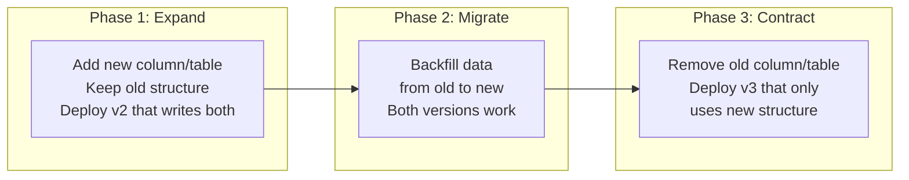
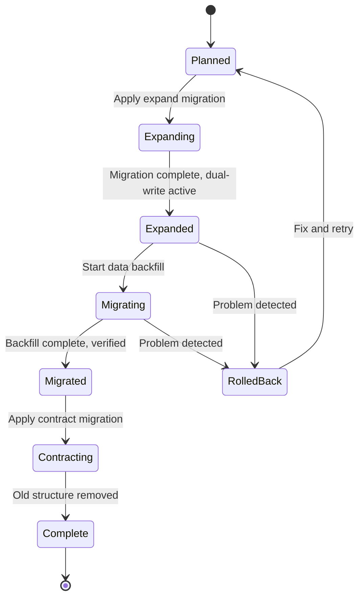

# Database Migrations

## Why It Exists

Database migrations are the most dangerous part of any deployment. Application code is stateless and can be rolled back in seconds. Database schema changes alter persistent state that may be shared across multiple application versions running simultaneously (during rolling updates, blue-green transitions, or canary deployments). A bad migration can corrupt data, lock tables for minutes, or create incompatibilities between old and new application code.

The fundamental challenge: how do you change a database schema while the database is serving production traffic, while both old and new application versions need to work with the schema, and while maintaining the ability to rollback?

### Historical Context

In the early days of web applications, database migrations were "maintenance windows": take the application offline, run the migration, deploy new code, bring the application back. This was acceptable when uptime expectations were low (99% = 7 hours downtime per month). At 99.99% (52 minutes per year), maintenance windows are unacceptable.

The evolution of migration approaches:

| Era | Approach | Downtime | Risk |
|-----|---------|----------|------|
| **Manual SQL (pre-2005)** | DBA runs ALTER TABLE | Minutes-hours | Very high |
| **Migration frameworks (2005-2015)** | Rails/Django migrations | Seconds-minutes | High |
| **Online DDL (2015-2020)** | pt-online-schema-change, gh-ost | None (for some operations) | Medium |
| **Expand-contract (2018+)** | Multi-phase schema evolution | None | Low |
| **Schema-as-code (2020+)** | Atlas, Skeema, declarative | None | Very low |

## First Principles

### The Expand-Contract Pattern

The expand-contract pattern is the fundamental approach to zero-downtime schema changes. It breaks every migration into phases where both old and new schemas coexist:



Each phase is a separate deployment. At any point, you can stop the process and both old and new code continue to work.

### Backward Compatibility Rules

For any schema change, both the pre-migration and post-migration application versions must work with the current schema:

$$
\forall t \in [t_{start}, t_{end}]: \text{Schema}(t) \text{ is compatible with } V_{old} \text{ AND } V_{new}
$$

This means:

| Operation | Backward Compatible? | Approach |
|-----------|---------------------|----------|
| Add nullable column | Yes | Direct ALTER |
| Add NOT NULL column | **No** | Add nullable, backfill, add constraint |
| Drop column | **No** | Stop reading, deploy, then drop |
| Rename column | **No** | Add new, copy, drop old (3 deploys) |
| Change column type | **No** | Add new column, migrate, drop old |
| Add table | Yes | Direct CREATE |
| Drop table | **No** | Stop using, deploy, then drop |
| Add index | Yes (but may lock) | Use CONCURRENTLY |
| Drop index | Yes (but may affect performance) | Monitor first |

### The Three-Deploy Rule

Any breaking schema change requires at least three deployments:

1. **Deploy 1 (Expand)**: Add new structure, modify code to write to both old and new
2. **Deploy 2 (Migrate)**: Backfill data, verify consistency, modify code to read from new
3. **Deploy 3 (Contract)**: Remove old structure, remove dual-write code

This is slower than a single migration but guarantees zero downtime and rollback capability at every step.

## Core Mechanics

### Migration State Machine



### Online DDL Comparison

| Tool | Database | Mechanism | Overhead | Locks |
|------|----------|-----------|----------|-------|
| **pt-online-schema-change** | MySQL | Copy table + triggers | 2-3x I/O | Brief metadata lock |
| **gh-ost** | MySQL | Binlog streaming | 1.5-2x I/O | No triggers, brief lock |
| **pg_repack** | PostgreSQL | Table rewrite | 2x space | Brief exclusive lock |
| **ALTER TABLE ... CONCURRENTLY** | PostgreSQL | Background build | Moderate I/O | No lock (for indexes) |
| **Online DDL** | MySQL 8.0+ | In-place algorithm | Variable | Depends on operation |

## Implementation

### Migration Framework with Expand-Contract Support

```typescript
interface MigrationStep {
  id: string;
  description: string;
  phase: 'expand' | 'migrate' | 'contract';
  sql: string;
  rollbackSql: string;
  preChecks: Array<{
    description: string;
    query: string;
    expected: string;
  }>;
  postChecks: Array<{
    description: string;
    query: string;
    expected: string;
  }>;
  estimatedDuration: string;
  requiresMaintenanceWindow: boolean;
  lockLevel: 'none' | 'row' | 'table' | 'exclusive';
  onlineToolRequired: boolean;
}

interface Migration {
  name: string;
  description: string;
  createdAt: string;
  steps: MigrationStep[];
  applicationChanges: Array<{
    phase: 'expand' | 'migrate' | 'contract';
    description: string;
    codeChanges: string;
  }>;
}

class MigrationExecutor {
  private db: {
    query(sql: string): Promise<{ rows: unknown[] }>;
  };

  constructor(db: { query(sql: string): Promise<{ rows: unknown[] }> }) {
    this.db = db;
  }

  async executeMigration(migration: Migration, phase: 'expand' | 'migrate' | 'contract'): Promise<{
    success: boolean;
    steps: Array<{ id: string; status: 'success' | 'failed' | 'skipped'; error?: string; duration: number }>;
  }> {
    const phaseSteps = migration.steps.filter((s) => s.phase === phase);
    const results: Array<{
      id: string;
      status: 'success' | 'failed' | 'skipped';
      error?: string;
      duration: number;
    }> = [];

    for (const step of phaseSteps) {
      const startTime = Date.now();

      try {
        // Run pre-checks
        for (const check of step.preChecks) {
          const result = await this.db.query(check.query);
          const actual = JSON.stringify(result.rows);
          if (!actual.includes(check.expected)) {
            throw new Error(
              `Pre-check failed: ${check.description}. Expected: ${check.expected}, Got: ${actual}`
            );
          }
        }

        // Execute migration
        console.log(`Executing: ${step.description}`);
        await this.db.query(step.sql);

        // Run post-checks
        for (const check of step.postChecks) {
          const result = await this.db.query(check.query);
          const actual = JSON.stringify(result.rows);
          if (!actual.includes(check.expected)) {
            throw new Error(
              `Post-check failed: ${check.description}. Expected: ${check.expected}, Got: ${actual}`
            );
          }
        }

        results.push({
          id: step.id,
          status: 'success',
          duration: Date.now() - startTime,
        });
      } catch (error) {
        results.push({
          id: step.id,
          status: 'failed',
          error: String(error),
          duration: Date.now() - startTime,
        });

        // Attempt rollback
        console.error(`Step ${step.id} failed, rolling back: ${error}`);
        try {
          await this.db.query(step.rollbackSql);
        } catch (rollbackError) {
          console.error(`Rollback also failed: ${rollbackError}`);
        }

        return { success: false, steps: results };
      }
    }

    return { success: true, steps: results };
  }
}
```

### Example: Renaming a Column (Full Expand-Contract)

```typescript
const renameColumnMigration: Migration = {
  name: '2026_03_rename_user_name_to_full_name',
  description: 'Rename users.user_name to users.full_name',
  createdAt: '2026-03-18',
  steps: [
    // Phase 1: Expand - Add new column
    {
      id: 'add-full-name-column',
      description: 'Add full_name column (nullable)',
      phase: 'expand',
      sql: `ALTER TABLE users ADD COLUMN full_name VARCHAR(255);`,
      rollbackSql: `ALTER TABLE users DROP COLUMN IF EXISTS full_name;`,
      preChecks: [
        {
          description: 'Column does not exist yet',
          query: `SELECT count(*) as cnt FROM information_schema.columns
                  WHERE table_name = 'users' AND column_name = 'full_name';`,
          expected: '"cnt":0',
        },
      ],
      postChecks: [
        {
          description: 'Column was created',
          query: `SELECT count(*) as cnt FROM information_schema.columns
                  WHERE table_name = 'users' AND column_name = 'full_name';`,
          expected: '"cnt":1',
        },
      ],
      estimatedDuration: '< 1 second (nullable column add)',
      requiresMaintenanceWindow: false,
      lockLevel: 'none',
      onlineToolRequired: false,
    },
    {
      id: 'add-trigger-sync',
      description: 'Add trigger to sync user_name to full_name',
      phase: 'expand',
      sql: `
        CREATE OR REPLACE FUNCTION sync_user_name_to_full_name()
        RETURNS TRIGGER AS $$
        BEGIN
          NEW.full_name := COALESCE(NEW.full_name, NEW.user_name);
          RETURN NEW;
        END;
        $$ LANGUAGE plpgsql;

        CREATE TRIGGER trg_sync_full_name
        BEFORE INSERT OR UPDATE ON users
        FOR EACH ROW EXECUTE FUNCTION sync_user_name_to_full_name();
      `,
      rollbackSql: `
        DROP TRIGGER IF EXISTS trg_sync_full_name ON users;
        DROP FUNCTION IF EXISTS sync_user_name_to_full_name();
      `,
      preChecks: [],
      postChecks: [
        {
          description: 'Trigger exists',
          query: `SELECT count(*) as cnt FROM information_schema.triggers
                  WHERE trigger_name = 'trg_sync_full_name';`,
          expected: '"cnt":1',
        },
      ],
      estimatedDuration: '< 1 second',
      requiresMaintenanceWindow: false,
      lockLevel: 'none',
      onlineToolRequired: false,
    },

    // Phase 2: Migrate - Backfill data
    {
      id: 'backfill-full-name',
      description: 'Backfill full_name from user_name in batches',
      phase: 'migrate',
      sql: `
        DO $$
        DECLARE
          batch_size INT := 10000;
          rows_updated INT;
        BEGIN
          LOOP
            UPDATE users
            SET full_name = user_name
            WHERE full_name IS NULL
              AND id IN (
                SELECT id FROM users
                WHERE full_name IS NULL
                LIMIT batch_size
                FOR UPDATE SKIP LOCKED
              );

            GET DIAGNOSTICS rows_updated = ROW_COUNT;
            EXIT WHEN rows_updated = 0;

            RAISE NOTICE 'Updated % rows', rows_updated;
            PERFORM pg_sleep(0.1); -- Throttle to avoid overloading
          END LOOP;
        END $$;
      `,
      rollbackSql: `UPDATE users SET full_name = NULL WHERE full_name IS NOT NULL;`,
      preChecks: [
        {
          description: 'full_name column exists',
          query: `SELECT count(*) as cnt FROM information_schema.columns
                  WHERE table_name = 'users' AND column_name = 'full_name';`,
          expected: '"cnt":1',
        },
      ],
      postChecks: [
        {
          description: 'No null full_name values remain',
          query: `SELECT count(*) as cnt FROM users WHERE full_name IS NULL AND user_name IS NOT NULL;`,
          expected: '"cnt":0',
        },
      ],
      estimatedDuration: '5-30 minutes depending on table size',
      requiresMaintenanceWindow: false,
      lockLevel: 'row',
      onlineToolRequired: false,
    },
    {
      id: 'add-not-null-constraint',
      description: 'Add NOT NULL constraint on full_name',
      phase: 'migrate',
      sql: `
        -- Use NOT VALID to avoid full table scan, then validate separately
        ALTER TABLE users ADD CONSTRAINT full_name_not_null
          CHECK (full_name IS NOT NULL) NOT VALID;
        ALTER TABLE users VALIDATE CONSTRAINT full_name_not_null;
      `,
      rollbackSql: `ALTER TABLE users DROP CONSTRAINT IF EXISTS full_name_not_null;`,
      preChecks: [
        {
          description: 'No null full_name values',
          query: `SELECT count(*) as cnt FROM users WHERE full_name IS NULL;`,
          expected: '"cnt":0',
        },
      ],
      postChecks: [],
      estimatedDuration: '1-5 minutes (validate scans table)',
      requiresMaintenanceWindow: false,
      lockLevel: 'none',
      onlineToolRequired: false,
    },

    // Phase 3: Contract - Remove old column
    {
      id: 'drop-trigger',
      description: 'Remove sync trigger (no longer needed)',
      phase: 'contract',
      sql: `
        DROP TRIGGER IF EXISTS trg_sync_full_name ON users;
        DROP FUNCTION IF EXISTS sync_user_name_to_full_name();
      `,
      rollbackSql: `-- Would need to recreate trigger`,
      preChecks: [],
      postChecks: [],
      estimatedDuration: '< 1 second',
      requiresMaintenanceWindow: false,
      lockLevel: 'none',
      onlineToolRequired: false,
    },
    {
      id: 'drop-old-column',
      description: 'Drop the old user_name column',
      phase: 'contract',
      sql: `ALTER TABLE users DROP COLUMN user_name;`,
      rollbackSql: `-- Cannot easily rollback a column drop. Ensure backup exists.`,
      preChecks: [
        {
          description: 'No application code references user_name',
          query: `-- This should be verified through code review, not SQL`,
          expected: 'manual-check',
        },
      ],
      postChecks: [
        {
          description: 'Column removed',
          query: `SELECT count(*) as cnt FROM information_schema.columns
                  WHERE table_name = 'users' AND column_name = 'user_name';`,
          expected: '"cnt":0',
        },
      ],
      estimatedDuration: '< 1 second (metadata only in PostgreSQL)',
      requiresMaintenanceWindow: false,
      lockLevel: 'table',
      onlineToolRequired: false,
    },
  ],
  applicationChanges: [
    {
      phase: 'expand',
      description: 'Update application to write to both user_name AND full_name',
      codeChanges: 'Modify UserRepository to set both columns on INSERT/UPDATE',
    },
    {
      phase: 'migrate',
      description: 'Update application to read from full_name, write to both',
      codeChanges: 'Modify UserRepository to read full_name, keep writing both',
    },
    {
      phase: 'contract',
      description: 'Remove all references to user_name',
      codeChanges: 'Remove dual-write, clean up UserRepository',
    },
  ],
};
```

### Batched Backfill with Monitoring

```typescript
interface BackfillConfig {
  tableName: string;
  sourceColumn: string;
  targetColumn: string;
  batchSize: number;
  sleepBetweenBatchesMs: number;
  maxDurationMinutes: number;
  dryRun: boolean;
}

interface BackfillProgress {
  totalRows: number;
  processedRows: number;
  batchesCompleted: number;
  startedAt: Date;
  estimatedCompletion: Date;
  currentRate: number; // rows/second
}

class BatchedBackfill {
  private db: { query(sql: string, params?: unknown[]): Promise<{ rows: unknown[]; rowCount: number }> };
  private config: BackfillConfig;
  private progress: BackfillProgress;
  private shouldStop = false;

  constructor(
    db: { query(sql: string, params?: unknown[]): Promise<{ rows: unknown[]; rowCount: number }> },
    config: BackfillConfig
  ) {
    this.db = db;
    this.config = config;
    this.progress = {
      totalRows: 0,
      processedRows: 0,
      batchesCompleted: 0,
      startedAt: new Date(),
      estimatedCompletion: new Date(),
      currentRate: 0,
    };
  }

  async execute(): Promise<BackfillProgress> {
    // Get total count
    const countResult = await this.db.query(
      `SELECT count(*) as total FROM ${this.config.tableName} WHERE ${this.config.targetColumn} IS NULL AND ${this.config.sourceColumn} IS NOT NULL`
    );
    this.progress.totalRows = Number((countResult.rows[0] as Record<string, unknown>).total);

    console.log(`Starting backfill: ${this.progress.totalRows} rows to process`);

    const deadline = Date.now() + this.config.maxDurationMinutes * 60 * 1000;

    while (!this.shouldStop && Date.now() < deadline) {
      const batchStart = Date.now();

      const sql = this.config.dryRun
        ? `SELECT count(*) as cnt FROM ${this.config.tableName} WHERE ${this.config.targetColumn} IS NULL LIMIT ${this.config.batchSize}`
        : `UPDATE ${this.config.tableName} SET ${this.config.targetColumn} = ${this.config.sourceColumn} WHERE id IN (SELECT id FROM ${this.config.tableName} WHERE ${this.config.targetColumn} IS NULL LIMIT ${this.config.batchSize} FOR UPDATE SKIP LOCKED)`;

      const result = await this.db.query(sql);

      if (result.rowCount === 0) {
        console.log('Backfill complete - no more rows to process');
        break;
      }

      this.progress.processedRows += result.rowCount;
      this.progress.batchesCompleted++;

      const batchDuration = (Date.now() - batchStart) / 1000;
      this.progress.currentRate = result.rowCount / batchDuration;

      const remainingRows = this.progress.totalRows - this.progress.processedRows;
      const estimatedSeconds = remainingRows / this.progress.currentRate;
      this.progress.estimatedCompletion = new Date(Date.now() + estimatedSeconds * 1000);

      if (this.progress.batchesCompleted % 10 === 0) {
        console.log(
          `Progress: ${this.progress.processedRows}/${this.progress.totalRows} ` +
          `(${((this.progress.processedRows / this.progress.totalRows) * 100).toFixed(1)}%) ` +
          `Rate: ${this.progress.currentRate.toFixed(0)} rows/s ` +
          `ETA: ${this.progress.estimatedCompletion.toISOString()}`
        );
      }

      // Throttle to avoid overwhelming the database
      await new Promise((r) => setTimeout(r, this.config.sleepBetweenBatchesMs));
    }

    return this.progress;
  }

  stop(): void {
    this.shouldStop = true;
  }

  getProgress(): BackfillProgress {
    return { ...this.progress };
  }
}
```

## Edge Cases and Failure Modes

### 1. The Lock That Froze Production

```sql
-- This looks innocent but can lock the entire table for minutes:
ALTER TABLE orders ADD COLUMN total_with_tax DECIMAL(10,2) NOT NULL DEFAULT 0;
```

On MySQL < 8.0, this rewrites the entire table. On PostgreSQL, `NOT NULL DEFAULT` with a value adds a table-level lock to validate existing rows. On a 100M row table, this can lock the table for 5-20 minutes.

**Solution**: Split into safe operations:
```sql
-- Step 1: Add nullable column (instant, no lock)
ALTER TABLE orders ADD COLUMN total_with_tax DECIMAL(10,2);

-- Step 2: Set default for new rows (instant)
ALTER TABLE orders ALTER COLUMN total_with_tax SET DEFAULT 0;

-- Step 3: Backfill in batches (no lock, throttled)
-- (use the batched backfill approach above)

-- Step 4: Add NOT NULL constraint with validation
ALTER TABLE orders ADD CONSTRAINT orders_total_with_tax_nn
  CHECK (total_with_tax IS NOT NULL) NOT VALID;
ALTER TABLE orders VALIDATE CONSTRAINT orders_total_with_tax_nn;
```

### 2. The Foreign Key Nightmare

Adding a foreign key requires validating every row in the child table against the parent. On large tables, this takes minutes with a lock.

```sql
-- BAD: Locks both tables
ALTER TABLE orders ADD FOREIGN KEY (user_id) REFERENCES users(id);

-- GOOD: Validate separately
ALTER TABLE orders ADD CONSTRAINT fk_orders_user_id
  FOREIGN KEY (user_id) REFERENCES users(id) NOT VALID;
-- This is instant, no validation

ALTER TABLE orders VALIDATE CONSTRAINT fk_orders_user_id;
-- This validates without blocking writes (PostgreSQL 9.4+)
```

### 3. Index Creation on Large Tables

```sql
-- BAD: Locks table for writes
CREATE INDEX idx_orders_created_at ON orders(created_at);

-- GOOD: No write lock (PostgreSQL)
CREATE INDEX CONCURRENTLY idx_orders_created_at ON orders(created_at);
-- Takes longer but doesn't block
```

::: danger Migration Anti-Patterns
1. **Running migrations in the deployment pipeline**: If the migration fails halfway, the deployment is stuck. Run migrations separately.
2. **Mixing expand and contract in one migration**: If the expand fails, you can't rollback without data loss from the contract.
3. **No migration timeout**: A migration that hangs locks the table indefinitely. Set `statement_timeout`.
4. **Testing migrations on empty tables**: A migration that takes 0.1 seconds on an empty table may take 30 minutes on a production table with 500M rows.
5. **Ignoring replication lag**: A DDL change on the primary may not replicate immediately. Read replicas may serve stale schema.
:::

## Performance Characteristics

### Migration Operation Times

| Operation | PostgreSQL (100M rows) | MySQL 8.0 (100M rows) |
|-----------|----------------------|----------------------|
| Add nullable column | < 1 ms | < 1 ms (instant DDL) |
| Add NOT NULL column with default | 2-5 min (pre-11), < 1ms (11+) | 30-90 min (copy), < 1 ms (instant) |
| Drop column | < 1 ms (marks invisible) | 30-90 min (copy) |
| Add index | 5-30 min (CONCURRENTLY) | 10-60 min |
| Rename column | < 1 ms | < 1 ms (instant DDL) |
| Change column type | 30-120 min (table rewrite) | 30-120 min (copy) |

### Backfill Performance

$$
T_{backfill} = \frac{N_{rows}}{B_{batch\_size}} \times (T_{batch} + T_{sleep})
$$

For 100M rows, batch size 10,000, 50ms per batch, 100ms sleep:

$$
T_{backfill} = \frac{100{,}000{,}000}{10{,}000} \times (0.05 + 0.1) = 10{,}000 \times 0.15 = 1{,}500 \text{ seconds} \approx 25 \text{ minutes}
$$

## Mathematical Foundations

### Lock Contention Model

If a DDL operation holds a table lock for duration $T_{lock}$ and the request rate is $\lambda$:

$$
N_{blocked} = \lambda \times T_{lock}
$$

$$
\text{Total user impact} = N_{blocked} \times T_{avg\_wait}
$$

For a table serving 1000 queries/second with a 30-second lock:

$$
N_{blocked} = 1000 \times 30 = 30{,}000 \text{ queries blocked}
$$

Each blocked query adds latency visible to users. This is why online DDL tools are essential for hot tables.

## Real-World War Stories

::: info War Story
**The Migration That Doubled Database Storage (2022)**

A team needed to add a column to a 2TB table in MySQL 5.7. They used `pt-online-schema-change`, which creates a copy of the table. During the copy, disk usage went from 2TB to 4TB, triggering a disk full alert. The migration failed halfway, leaving a 2TB temporary table that needed manual cleanup. The cleanup took 6 hours during which the database was degraded.

**Lesson**: Before running online DDL tools, verify you have 2x the table size in free disk space. On RDS, you may need to temporarily increase storage (which cannot be decreased afterward).
:::

::: info War Story
**The NOT NULL That Broke the Deploy (2021)**

A developer added a migration: `ALTER TABLE users ADD COLUMN phone VARCHAR(20) NOT NULL DEFAULT '';`. In PostgreSQL 10, this was instant. In production, they ran PostgreSQL 9.6 (which the developer didn't know). PostgreSQL 9.6 required rewriting the entire table for NOT NULL with default, locking it for 8 minutes. During those 8 minutes, every API request that touched the users table timed out. The health checks failed, Kubernetes killed all pods, and the service was down for 15 minutes.

**Lesson**: Always test migrations against the exact database version and approximate table size as production. Never assume DDL behavior is version-agnostic.
:::

## Decision Framework

### Safe vs. Unsafe Operations Quick Reference

| Operation | PostgreSQL 15+ | MySQL 8.0+ | Requires Expand-Contract? |
|-----------|---------------|------------|--------------------------|
| Add nullable column | Safe (instant) | Safe (instant) | No |
| Add column with default | Safe (instant) | Safe (instant) | No |
| Drop column | Safe (instant) | Unsafe (copy) | Yes |
| Rename column | Safe (instant) | Safe (instant) | Yes (for app compatibility) |
| Change NOT NULL | Safe with NOT VALID | Unsafe (copy) | No (with NOT VALID) |
| Add index | Safe (CONCURRENTLY) | Safe (online) | No |
| Add foreign key | Safe (NOT VALID) | Unsafe | Use NOT VALID |
| Change column type | Unsafe (rewrite) | Unsafe (copy) | Yes |

## Advanced Topics

### Schema Versioning with Database Feature Flags

```typescript
interface SchemaVersion {
  version: number;
  features: string[];
  compatibleAppVersions: string[];
}

class SchemaVersionManager {
  async getCurrentVersion(
    db: { query(sql: string): Promise<{ rows: Array<{ version: number }> }> }
  ): Promise<number> {
    const result = await db.query(
      'SELECT max(version) as version FROM schema_migrations WHERE applied = true'
    );
    return result.rows[0]?.version ?? 0;
  }

  /**
   * Check if a schema feature is available.
   * Used by application code to determine which queries to use.
   */
  hasFeature(currentVersion: number, feature: string): boolean {
    const featureVersions: Record<string, number> = {
      'users.full_name': 42,
      'orders.total_with_tax': 45,
      'products.search_vector': 48,
    };

    return currentVersion >= (featureVersions[feature] ?? Infinity);
  }
}
```

## Cross-References

- [Deployment Strategies Overview](./index.md) - How migrations fit into deployment strategies
- [Blue-Green Deployment](./blue-green.md) - Schema compatibility for blue-green
- [Rolling Updates](./rolling-updates.md) - Mixed-version compatibility during rollouts
- [Feature Flags Deployment](./feature-flags-deployment.md) - Flags for controlling migration phases
- [Rollback Procedures](./rollback-procedures.md) - Rolling back database changes
