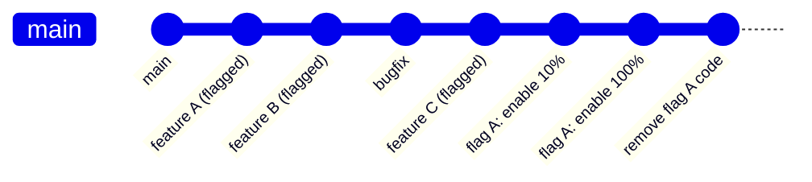
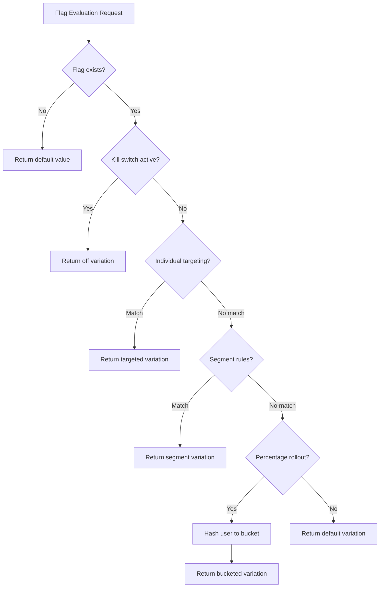
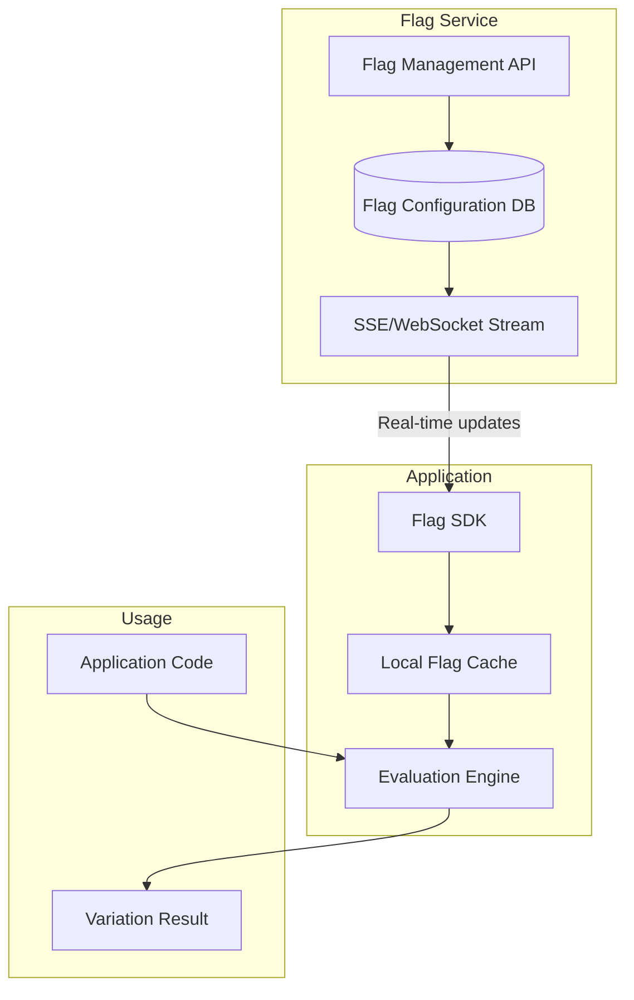

# Feature Flags as Deployment

## Why It Exists

Traditional deployment couples two operations that should be independent: **deploying code** (a technical operation) and **releasing features** (a business decision). When you deploy v2.0 of your service, every new feature in v2.0 goes live simultaneously. If one feature has a bug, you must roll back all features.

Feature flags decouple these. You deploy code continuously (every commit to main goes to production), but new features are hidden behind flags. You release features independently by toggling flags. If a feature causes problems, you disable the flag in seconds - without a deployment, without affecting other features, without a rollback.

This is the most powerful deployment strategy because it eliminates the concept of a "release" as a risky event. Deploying becomes boring and frequent (10-50 times per day at mature organizations), and releasing becomes a controlled, reversible, gradual process.

### The Feature Flag Spectrum

Feature flags serve multiple purposes beyond deployment:

| Type | Purpose | Lifetime | Example |
|------|---------|----------|---------|
| **Release flag** | Control feature rollout | Days-weeks | New checkout flow |
| **Ops flag** | Runtime configuration | Permanent | Rate limit thresholds |
| **Experiment flag** | A/B testing | Weeks-months | Button color test |
| **Permission flag** | Entitlement control | Permanent | Premium features |
| **Kill switch** | Emergency disable | Permanent | Disable expensive feature under load |

## First Principles

### Trunk-Based Development

Feature flags enable trunk-based development: every developer commits directly to the main branch (or via short-lived feature branches merged within 1-2 days). There are no long-lived feature branches, no merge hell, no "integration sprints."



The key principle: **code is always deployable**. Incomplete features are committed behind flags. The main branch is always in a releasable state.

### Flag Evaluation Model

A feature flag evaluation is a function:

$$
f(\text{flag\_key}, \text{context}) \rightarrow \text{variation}
$$

Where:
- `flag_key` identifies the flag
- `context` includes user ID, attributes, environment, etc.
- `variation` is the result (boolean, string, number, JSON)

The evaluation follows a priority chain:



### Consistent Hashing for Percentage Rollouts

When rolling out to X% of users, the assignment must be:
1. **Deterministic**: Same user always gets the same variation
2. **Uniform**: X% of users are in the treatment, not X% of requests
3. **Independent**: Changing one flag's percentage doesn't change another flag's assignment

The standard approach uses consistent hashing:

$$
\text{bucket} = \text{hash}(\text{flag\_key} + \text{user\_id}) \mod 100
$$

$$
\text{in\_treatment} = \text{bucket} < \text{rollout\_percentage}
$$

Using the flag key in the hash ensures that different flags get independent bucketing. Using a stable hash (MurmurHash3, FNV-1a) ensures determinism.

## Core Mechanics

### Flag Architecture



## Implementation

### Production Feature Flag SDK

```typescript
import { createHash } from 'crypto';

// --- Types ---

type FlagVariation = boolean | string | number | Record<string, unknown>;

interface FlagRule {
  id: string;
  description: string;
  conditions: Array<{
    attribute: string;
    operator: 'equals' | 'contains' | 'greaterThan' | 'lessThan' | 'in' | 'regex';
    value: unknown;
  }>;
  variation: FlagVariation;
  percentage?: number; // Optional: only apply to X% of matching users
}

interface FlagDefinition {
  key: string;
  name: string;
  description: string;
  enabled: boolean;
  variations: FlagVariation[];
  defaultVariation: number; // index into variations
  offVariation: number; // index when flag is off
  rules: FlagRule[];
  rollout?: {
    percentage: number;
    variationIndex: number;
  };
  killSwitch: boolean;
  tags: string[];
  createdAt: string;
  updatedAt: string;
  owner: string;
  staleAfterDays: number;
}

interface EvaluationContext {
  userId: string;
  attributes: Record<string, unknown>;
  environment: string;
}

interface EvaluationResult {
  value: FlagVariation;
  variationIndex: number;
  reason: 'off' | 'kill_switch' | 'target' | 'rule' | 'rollout' | 'default' | 'error';
  ruleId?: string;
}

// --- Flag Evaluation Engine ---

class FeatureFlagClient {
  private flags: Map<string, FlagDefinition> = new Map();
  private eventBuffer: Array<{
    flagKey: string;
    userId: string;
    variation: FlagVariation;
    reason: string;
    timestamp: number;
  }> = [];
  private flushInterval: ReturnType<typeof setInterval>;

  constructor(
    private apiUrl: string,
    private sdkKey: string,
    flushIntervalMs = 10_000
  ) {
    this.flushInterval = setInterval(() => this.flushEvents(), flushIntervalMs);
  }

  async initialize(): Promise<void> {
    // Load all flags from the server
    const response = await fetch(`${this.apiUrl}/sdk/flags`, {
      headers: { Authorization: `Bearer ${this.sdkKey}` },
    });
    const flagList: FlagDefinition[] = await response.json();

    for (const flag of flagList) {
      this.flags.set(flag.key, flag);
    }

    console.log(`Loaded ${this.flags.size} feature flags`);

    // Start SSE stream for real-time updates
    this.startUpdateStream();
  }

  evaluate(flagKey: string, context: EvaluationContext, defaultValue: FlagVariation): EvaluationResult {
    const flag = this.flags.get(flagKey);

    if (!flag) {
      return { value: defaultValue, variationIndex: -1, reason: 'error' };
    }

    const result = this.evaluateFlag(flag, context);

    // Track evaluation for analytics
    this.eventBuffer.push({
      flagKey,
      userId: context.userId,
      variation: result.value,
      reason: result.reason,
      timestamp: Date.now(),
    });

    return result;
  }

  boolVariation(flagKey: string, context: EvaluationContext, defaultValue: boolean): boolean {
    const result = this.evaluate(flagKey, context, defaultValue);
    return typeof result.value === 'boolean' ? result.value : defaultValue;
  }

  stringVariation(flagKey: string, context: EvaluationContext, defaultValue: string): string {
    const result = this.evaluate(flagKey, context, defaultValue);
    return typeof result.value === 'string' ? result.value : defaultValue;
  }

  private evaluateFlag(flag: FlagDefinition, context: EvaluationContext): EvaluationResult {
    // 1. Check if flag is enabled
    if (!flag.enabled) {
      return {
        value: flag.variations[flag.offVariation],
        variationIndex: flag.offVariation,
        reason: 'off',
      };
    }

    // 2. Check kill switch
    if (flag.killSwitch) {
      return {
        value: flag.variations[flag.offVariation],
        variationIndex: flag.offVariation,
        reason: 'kill_switch',
      };
    }

    // 3. Evaluate rules in order
    for (const rule of flag.rules) {
      if (this.evaluateRule(rule, context)) {
        // Check percentage within rule
        if (rule.percentage !== undefined) {
          const bucket = this.hashToBucket(flag.key, context.userId, rule.id);
          if (bucket >= rule.percentage) continue; // Not in this rule's percentage
        }

        const variationIndex = flag.variations.indexOf(rule.variation);
        return {
          value: rule.variation,
          variationIndex,
          reason: 'rule',
          ruleId: rule.id,
        };
      }
    }

    // 4. Check rollout percentage
    if (flag.rollout) {
      const bucket = this.hashToBucket(flag.key, context.userId);
      if (bucket < flag.rollout.percentage) {
        return {
          value: flag.variations[flag.rollout.variationIndex],
          variationIndex: flag.rollout.variationIndex,
          reason: 'rollout',
        };
      }
    }

    // 5. Return default
    return {
      value: flag.variations[flag.defaultVariation],
      variationIndex: flag.defaultVariation,
      reason: 'default',
    };
  }

  private evaluateRule(rule: FlagRule, context: EvaluationContext): boolean {
    return rule.conditions.every((condition) => {
      const value = condition.attribute === 'userId'
        ? context.userId
        : context.attributes[condition.attribute];

      switch (condition.operator) {
        case 'equals':
          return value === condition.value;
        case 'contains':
          return String(value).includes(String(condition.value));
        case 'greaterThan':
          return Number(value) > Number(condition.value);
        case 'lessThan':
          return Number(value) < Number(condition.value);
        case 'in':
          return Array.isArray(condition.value) && condition.value.includes(value);
        case 'regex':
          return new RegExp(String(condition.value)).test(String(value));
        default:
          return false;
      }
    });
  }

  /**
   * Consistent hash for percentage bucketing.
   * Same user + flag always gets the same bucket.
   */
  private hashToBucket(flagKey: string, userId: string, salt = ''): number {
    const input = `${flagKey}:${userId}:${salt}`;
    const hash = createHash('md5').update(input).digest('hex');
    // Use first 8 hex chars (32 bits) and mod 100
    const value = parseInt(hash.substring(0, 8), 16);
    return value % 100;
  }

  private startUpdateStream(): void {
    // In production: connect to SSE endpoint for real-time flag updates
    // When a flag changes, update the local cache immediately
    console.log('Started flag update stream');
  }

  private async flushEvents(): Promise<void> {
    if (this.eventBuffer.length === 0) return;

    const events = [...this.eventBuffer];
    this.eventBuffer = [];

    try {
      await fetch(`${this.apiUrl}/sdk/events`, {
        method: 'POST',
        headers: {
          Authorization: `Bearer ${this.sdkKey}`,
          'Content-Type': 'application/json',
        },
        body: JSON.stringify(events),
      });
    } catch {
      // Re-queue on failure
      this.eventBuffer.unshift(...events);
    }
  }

  destroy(): void {
    clearInterval(this.flushInterval);
    this.flushEvents();
  }
}

// --- Usage in Application Code ---

const flagClient = new FeatureFlagClient(
  'https://flags.example.com',
  'sdk-key-production-xxx'
);

await flagClient.initialize();

// In request handler:
function handleCheckout(userId: string, attributes: Record<string, unknown>) {
  const context: EvaluationContext = {
    userId,
    attributes,
    environment: 'production',
  };

  if (flagClient.boolVariation('new-checkout-flow', context, false)) {
    return renderNewCheckout();
  }
  return renderOldCheckout();
}

function renderNewCheckout(): string { return 'new'; }
function renderOldCheckout(): string { return 'old'; }
```

### Flag Lifecycle Management

```typescript
interface FlagLifecycle {
  flagKey: string;
  createdAt: Date;
  lastEvaluatedAt?: Date;
  staleThresholdDays: number;
  currentState: 'active' | 'stale' | 'permanent' | 'deprecated';
  rolloutPercentage: number;
  fullRolloutDate?: Date;
  cleanupDeadline?: Date;
}

class FlagLifecycleManager {
  private flags: Map<string, FlagLifecycle> = new Map();

  /**
   * Detect stale flags that should be cleaned up
   */
  findStaleFlags(): FlagLifecycle[] {
    const now = Date.now();
    return Array.from(this.flags.values()).filter((flag) => {
      if (flag.currentState === 'permanent') return false;

      // Flag at 100% rollout for more than 7 days = should be cleaned up
      if (
        flag.rolloutPercentage === 100 &&
        flag.fullRolloutDate &&
        now - flag.fullRolloutDate.getTime() > 7 * 24 * 60 * 60 * 1000
      ) {
        return true;
      }

      // Flag not evaluated in staleThresholdDays
      if (
        flag.lastEvaluatedAt &&
        now - flag.lastEvaluatedAt.getTime() >
          flag.staleThresholdDays * 24 * 60 * 60 * 1000
      ) {
        return true;
      }

      return false;
    });
  }

  /**
   * Generate cleanup report
   */
  generateCleanupReport(): string {
    const stale = this.findStaleFlags();
    let report = `# Flag Cleanup Report\n\n`;
    report += `Total flags: ${this.flags.size}\n`;
    report += `Stale flags: ${stale.length}\n\n`;

    for (const flag of stale) {
      report += `## ${flag.flagKey}\n`;
      report += `- Created: ${flag.createdAt.toISOString()}\n`;
      report += `- Last evaluated: ${flag.lastEvaluatedAt?.toISOString() ?? 'never'}\n`;
      report += `- Rollout: ${flag.rolloutPercentage}%\n`;
      if (flag.fullRolloutDate) {
        const daysAtFull = Math.floor(
          (Date.now() - flag.fullRolloutDate.getTime()) / (24 * 60 * 60 * 1000)
        );
        report += `- At 100% for: ${daysAtFull} days\n`;
      }
      report += `- **Action**: Remove flag and dead code\n\n`;
    }

    return report;
  }
}
```

## Edge Cases and Failure Modes

### 1. Flag Service Outage

If the flag service is down, the SDK must continue operating with cached flag values. This is why server-side SDKs maintain a local cache and use streaming for updates rather than polling.

**Failure mode**: SDK initialized without any cached flags (first deploy + service down). All flags evaluate to defaults, which may enable or disable features unpredictably.

**Solution**: Ship a static flag configuration as part of the deployment. The SDK falls back to this file if it cannot reach the flag service.

### 2. Flag Debt (Technical Debt)

Every flag adds a conditional branch to the code. Over time, accumulated flags create combinatorial complexity. With 20 flags, there are potentially $2^{20} = 1{,}048{,}576$ code paths to test.

**Solution**: Enforce flag cleanup SLAs:
- Release flags: Remove within 14 days of 100% rollout
- Experiment flags: Remove within 7 days of experiment completion
- Run weekly stale flag reports

### 3. The Flag That Leaked Memory

```typescript
// BAD: Creating a new evaluation context object per request without cleanup
function handleRequest(req: Request) {
  // This creates a closure that captures the entire request,
  // preventing garbage collection if the flag client stores references
  const showBanner = flagClient.boolVariation('show-banner', {
    userId: req.userId,
    attributes: { ...req.headers, ...req.query, body: req.body },
    environment: 'production',
  }, false);
}
```

**Solution**: Only pass necessary attributes to the evaluation context. Never pass the entire request object.

::: warning Feature Flag Anti-Patterns
1. **Flag-driven architecture**: Using flags to control which microservice handles a request. This should be infrastructure routing.
2. **Nested flags**: `if (flagA) { if (flagB) { if (flagC) { ... } } }` - combinatorial explosion.
3. **Flag as config**: Using feature flags for database connection strings or API URLs. Use proper configuration management.
4. **No flag ownership**: Nobody knows who created a flag or when it should be removed.
5. **Testing only with flags on**: Not testing the flag-off path, which is the fallback during incidents.
:::

## Performance Characteristics

### Flag Evaluation Latency

| Evaluation Type | Latency | Throughput |
|----------------|---------|-----------|
| Local cache hit | 0.1-1 us | 10M evals/sec |
| Local cache miss, SDK eval | 5-20 us | 500K evals/sec |
| Remote API call (fallback) | 5-50 ms | 1K evals/sec |
| With targeting rules (5 rules) | 2-10 us | 2M evals/sec |
| With segment lookup | 10-50 us | 200K evals/sec |

### Memory Overhead

$$
M_{flags} = N_{flags} \times (S_{definition} + S_{rules})
$$

Typical sizes:
- Flag definition: ~500 bytes
- Per rule: ~200 bytes
- 100 flags with 5 rules each: ~150 KB

Negligible for server-side applications. Can be significant for mobile/embedded.

## Mathematical Foundations

### Consistent Hashing for Rollout Stability

When increasing rollout from $p_1\%$ to $p_2\%$, all users in the $p_1\%$ cohort must remain in the $p_2\%$ cohort. This requires a monotonic bucketing function:

$$
\forall u: B(u) < p_1 \implies B(u) < p_2 \quad \text{when } p_2 > p_1
$$

This is satisfied by the modular hashing approach because the bucket assignment $B(u) = H(u) \mod 100$ is deterministic and the threshold comparison is monotonic.

### A/B Test Statistical Power with Flags

For a two-variant experiment with conversion rate $p$ and minimum detectable effect $\delta$:

$$
n = \frac{2p(1-p)(z_{\alpha/2} + z_\beta)^2}{\delta^2}
$$

At $p = 0.05$ (5% conversion), $\delta = 0.005$ (0.5% absolute lift), $\alpha = 0.05$, $\beta = 0.2$:

$$
n = \frac{2 \times 0.05 \times 0.95 \times (1.96 + 0.84)^2}{0.005^2} = \frac{0.095 \times 7.84}{0.000025} \approx 29{,}792 \text{ per variant}
$$

## Real-World War Stories

::: info War Story
**The Flag That Brought Down Production (2022)**

A team used a feature flag to gate a new database query path. The flag was set to 10% rollout. At 10%, the new query caused a table lock on a hot table. The lock duration was proportional to the number of concurrent queries hitting the new path - and at 10% of 50,000 rps, that was 5,000 qps hitting the locked table.

The database ground to a halt, and because the flag evaluation itself required a database call (flag config stored in the same database), the flag service also went down. They couldn't disable the flag because the flag service was unavailable.

**Fix**: Three changes:
1. Move flag config to a separate datastore (Redis/DynamoDB)
2. SDK caches flags locally, survives backend outage
3. Add a hardcoded kill switch that can be deployed as a config change without depending on the flag service
:::

::: info War Story
**4,000 Flags and Nobody Knows What They Do (2023)**

A company that had been using feature flags for 5 years accumulated 4,000+ flags. 60% were at 100% rollout and should have been removed. 15% were at 0% and nobody remembered why. The remaining 25% were actively used.

The combinatorial complexity meant that integration tests were unreliable (different flag states produced different behavior), debugging was nightmare (every issue started with "what flags is this user seeing?"), and performance suffered (4,000 flag evaluations per request at 2us each = 8ms overhead).

**Fix**: A 3-month "flag debt sprint" that:
1. Removed 2,400 stale flags
2. Documented all remaining flags with owners and expiry dates
3. Added automated stale flag detection (alert if flag at 100% > 14 days)
4. Added a CI check that rejects PRs adding flags without an expiry date
:::

## Decision Framework

### When to Use Feature Flags vs. Other Strategies

| Scenario | Feature Flags | Blue-Green | Canary |
|----------|--------------|-----------|--------|
| New UI component | Best choice | Overkill | Possible |
| Backend algorithm change | Good (with monitoring) | Good | Best choice |
| Infrastructure change | Not applicable | Good | Good |
| Database migration | Useful for dual-write | Useful | Not ideal |
| Emergency disable | Best choice (instant) | Possible | Too slow |
| A/B testing | Best choice | Not applicable | Possible |
| Gradual rollout to users | Best choice | All-or-nothing | By traffic %, not users |

## Advanced Topics

### Server-Side Rendering with Flags

```typescript
// Ensure consistent flag evaluation between server and client
// to avoid hydration mismatches in SSR frameworks

interface SSRFlagContext {
  flags: Record<string, FlagVariation>;
  userId: string;
}

function createSSRFlagContext(
  flagClient: FeatureFlagClient,
  userId: string,
  attributes: Record<string, unknown>
): SSRFlagContext {
  const context: EvaluationContext = {
    userId,
    attributes,
    environment: 'production',
  };

  // Pre-evaluate all flags that might be needed during SSR
  const flagKeys = ['new-checkout', 'show-banner', 'dark-mode'];
  const flags: Record<string, FlagVariation> = {};

  for (const key of flagKeys) {
    const result = flagClient.evaluate(key, context, false);
    flags[key] = result.value;
  }

  return { flags, userId };
}

// Serialize into the HTML for client-side hydration
function serializeFlagContext(ctx: SSRFlagContext): string {
  return `<script>window.__FLAG_CONTEXT__ = ${JSON.stringify(ctx)};</script>`;
}
```

## Cross-References

- [Deployment Strategies Overview](./index.md) - Comparison of all deployment strategies
- [Canary Deployment](./canary.md) - Progressive delivery at the infrastructure level
- [Database Migrations](./database-migrations.md) - Using flags for expand-contract migrations
- [Rollback Procedures](./rollback-procedures.md) - Flags as the fastest rollback mechanism
- [Alert Design](../alerting/alert-design.md) - Monitoring flag rollouts with burn-rate alerts
