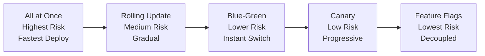
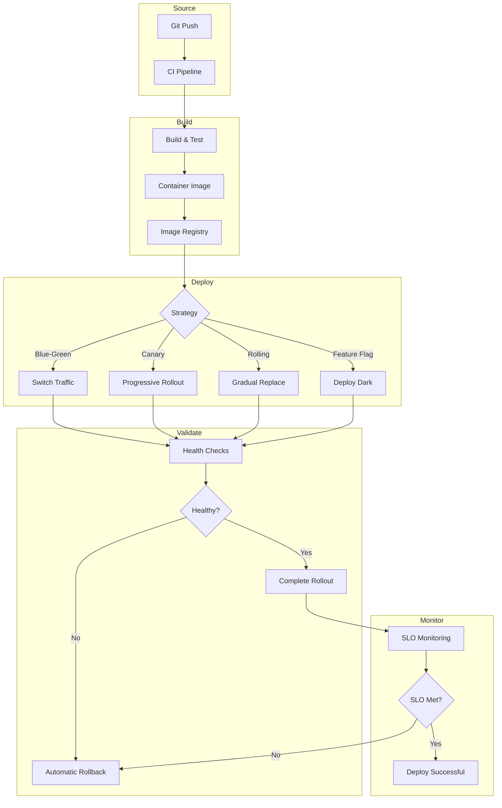
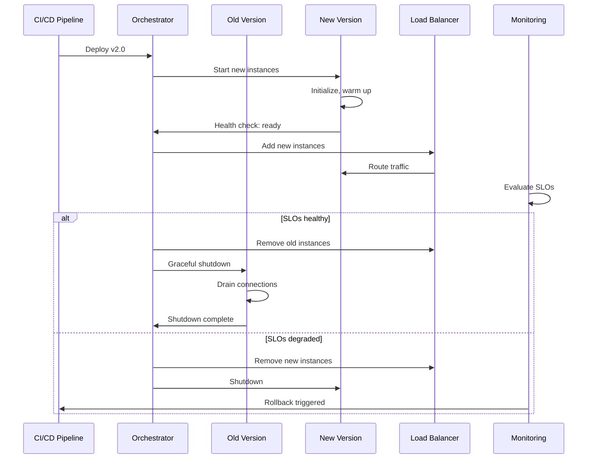
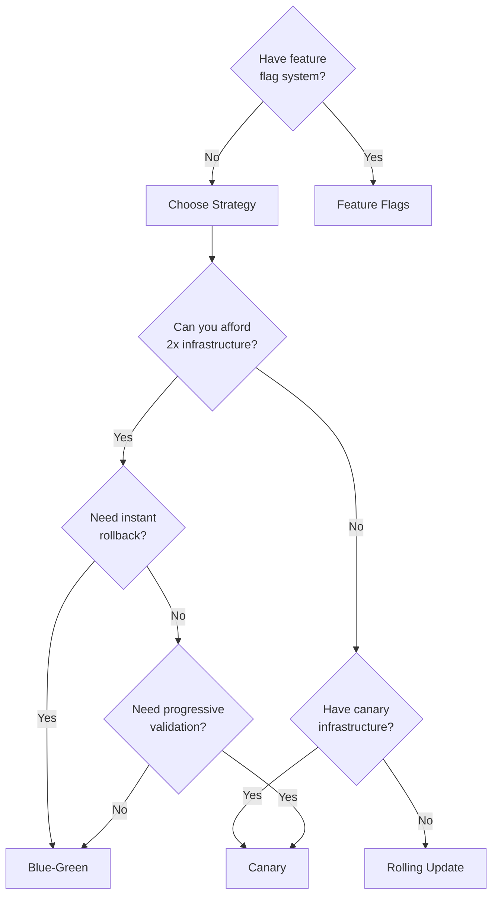
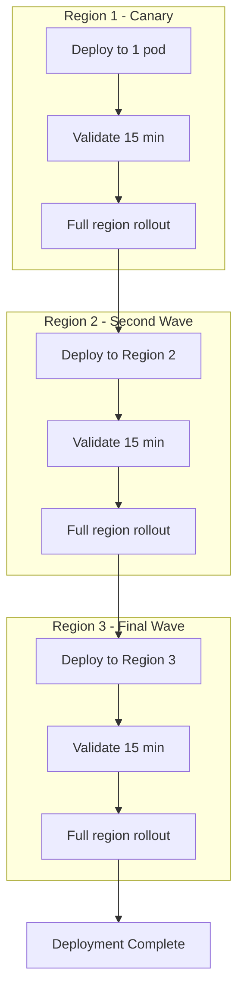

# Deployment Strategies

## Why It Exists

Deploying software to production is the most dangerous thing most engineering teams do regularly. Every deployment is a controlled change to a running system, and controlled changes have a habit of becoming uncontrolled failures. Studies consistently show that 60-80% of production incidents are caused by changes - deployments, configuration updates, infrastructure modifications.

The goal of a deployment strategy is to minimize the blast radius and recovery time when a deployment goes wrong, while maximizing deployment velocity. These are not contradictory goals: the safer your deployments are, the more frequently you can deploy, and the more frequently you deploy, the smaller each deployment is, making each one safer.

### Historical Context

The evolution of deployment approaches tracks the evolution of infrastructure:

| Era | Method | Deploy Time | Rollback Time | Risk |
|-----|--------|------------|---------------|------|
| **Physical servers (pre-2006)** | Manual install, restart | Hours | Hours-Days | Extreme |
| **VMs + config mgmt (2006-2013)** | Puppet/Chef + restart | 30-60 min | 30-60 min | High |
| **Containers (2013-2018)** | Docker + orchestrator | 5-15 min | 5-15 min | Moderate |
| **Kubernetes (2018+)** | Declarative, rolling | 2-5 min | Seconds | Low |
| **GitOps + Progressive (2020+)** | Automated, canary | 30-120 min | Seconds | Very Low |

### The Deployment Risk Equation

$$
\text{Risk} = P(\text{failure}) \times \text{Impact} \times \text{Recovery Time}
$$

Every deployment strategy aims to reduce one or more of these factors:

- **Blue-green**: Reduces recovery time (instant rollback)
- **Canary**: Reduces impact (small blast radius during validation)
- **Rolling**: Reduces both impact and recovery time (gradual + rollback)
- **Feature flags**: Reduces all three (decouple deployment from release)

## First Principles

### The Deployment Spectrum



### Zero-Downtime Deployment Requirements

For any deployment strategy to be zero-downtime, the application must satisfy these properties:

1. **Backward-compatible**: New version can coexist with old version (database schema, API contracts)
2. **Health-checkable**: The system can report whether it is ready to serve traffic
3. **Gracefully drainable**: In-flight requests complete before the old version shuts down
4. **Idempotent startup**: Starting a new instance does not corrupt shared state

$$
\text{Zero Downtime} \iff \text{BackwardCompat} \land \text{HealthCheck} \land \text{GracefulDrain} \land \text{IdempotentStart}
$$

### Deployment vs. Release

A critical distinction:

| | Deployment | Release |
|---|---|---|
| **Definition** | Installing new code on infrastructure | Making new functionality available to users |
| **Scope** | Technical operation | Business decision |
| **Timing** | Can happen anytime | Coordinated with stakeholders |
| **Rollback** | Revert the code | Disable the feature |
| **Example** | Push container v2.3.1 to production | Enable new checkout flow for 10% of users |

Feature flags enable you to separate these concerns completely: deploy code continuously, release features independently.

## Core Mechanics

### Deployment Pipeline Architecture



### The Anatomy of a Deployment

Every deployment, regardless of strategy, follows these phases:



## Implementation

### Deployment Strategy Selector

```typescript
interface DeploymentContext {
  serviceType: 'stateless' | 'stateful' | 'batch';
  trafficVolume: 'low' | 'medium' | 'high';
  changeType: 'feature' | 'bugfix' | 'infrastructure' | 'database';
  riskLevel: 'low' | 'medium' | 'high' | 'critical';
  rollbackCapability: 'instant' | 'minutes' | 'complex';
  teamMaturity: 'beginner' | 'intermediate' | 'advanced';
  hasCanaryInfrastructure: boolean;
  hasBluegreenInfrastructure: boolean;
  hasFeatureFlags: boolean;
  databaseMigrationIncluded: boolean;
}

type Strategy = 'rolling' | 'blue-green' | 'canary' | 'feature-flag' | 'recreate';

interface StrategyRecommendation {
  primary: Strategy;
  alternatives: Strategy[];
  reasoning: string[];
  warnings: string[];
  estimatedDeployTime: string;
  estimatedRollbackTime: string;
}

function selectDeploymentStrategy(
  context: DeploymentContext
): StrategyRecommendation {
  const reasoning: string[] = [];
  const warnings: string[] = [];
  let primary: Strategy = 'rolling';
  const alternatives: Strategy[] = [];

  // Critical changes should use canary or blue-green
  if (context.riskLevel === 'critical') {
    if (context.hasCanaryInfrastructure) {
      primary = 'canary';
      alternatives.push('blue-green');
      reasoning.push('Critical risk: canary deployment for progressive validation');
    } else if (context.hasBluegreenInfrastructure) {
      primary = 'blue-green';
      reasoning.push('Critical risk: blue-green for instant rollback');
    } else {
      primary = 'rolling';
      warnings.push('Critical change without canary/blue-green infrastructure. Consider delaying until infrastructure is ready.');
      reasoning.push('Falling back to rolling with aggressive health checks');
    }
  }

  // Database migrations need special handling
  if (context.databaseMigrationIncluded) {
    if (context.hasFeatureFlags) {
      primary = 'feature-flag';
      reasoning.push('Database migration: using feature flags for expand-contract pattern');
    } else {
      warnings.push('Database migration without feature flags. Ensure backward compatibility.');
      reasoning.push('Database migration: using rolling with expand-contract');
    }
  }

  // Feature changes benefit from feature flags
  if (context.changeType === 'feature' && context.hasFeatureFlags) {
    primary = 'feature-flag';
    reasoning.push('Feature change: deploy dark, release via flag');
  }

  // Stateful services need careful handling
  if (context.serviceType === 'stateful') {
    if (primary === 'canary') {
      warnings.push('Canary with stateful service: ensure session affinity during rollout');
    }
    if (primary !== 'blue-green' && context.hasBluegreenInfrastructure) {
      alternatives.unshift('blue-green');
      reasoning.push('Stateful service: blue-green avoids mixed-version state issues');
    }
  }

  // High traffic amplifies risk
  if (context.trafficVolume === 'high' && primary === 'rolling') {
    if (context.hasCanaryInfrastructure) {
      primary = 'canary';
      reasoning.push('High traffic: canary limits blast radius');
    }
  }

  return {
    primary,
    alternatives: alternatives.filter((a) => a !== primary),
    reasoning,
    warnings,
    estimatedDeployTime: getDeployTime(primary),
    estimatedRollbackTime: getRollbackTime(primary),
  };
}

function getDeployTime(strategy: Strategy): string {
  const times: Record<Strategy, string> = {
    'recreate': '2-5 minutes (with downtime)',
    'rolling': '5-15 minutes',
    'blue-green': '1-5 minutes (switch)',
    'canary': '30-120 minutes (progressive)',
    'feature-flag': '2-5 minutes (deploy) + instant (release)',
  };
  return times[strategy];
}

function getRollbackTime(strategy: Strategy): string {
  const times: Record<Strategy, string> = {
    'recreate': '2-5 minutes',
    'rolling': '5-15 minutes',
    'blue-green': 'Seconds (switch back)',
    'canary': 'Seconds (abort canary)',
    'feature-flag': 'Instant (disable flag)',
  };
  return times[strategy];
}
```

### Graceful Shutdown Handler

Every deployment strategy requires graceful shutdown. This is the universal implementation:

```typescript
import { Server } from 'http';

class GracefulShutdown {
  private server: Server;
  private connections: Set<import('net').Socket> = new Set();
  private isShuttingDown = false;
  private shutdownTimeout: number;
  private activeRequests = 0;

  constructor(server: Server, shutdownTimeoutMs = 30_000) {
    this.server = server;
    this.shutdownTimeout = shutdownTimeoutMs;

    // Track connections for forced shutdown
    server.on('connection', (socket) => {
      this.connections.add(socket);
      socket.on('close', () => this.connections.delete(socket));
    });

    // Track active requests
    server.on('request', (_req, res) => {
      this.activeRequests++;
      res.on('finish', () => {
        this.activeRequests--;
        if (this.isShuttingDown && this.activeRequests === 0) {
          this.forceClose();
        }
      });
    });

    // Listen for shutdown signals
    process.on('SIGTERM', () => this.shutdown('SIGTERM'));
    process.on('SIGINT', () => this.shutdown('SIGINT'));
  }

  private async shutdown(signal: string): Promise<void> {
    if (this.isShuttingDown) return;
    this.isShuttingDown = true;

    console.log(`[Shutdown] Received ${signal}. Starting graceful shutdown...`);
    console.log(`[Shutdown] Active requests: ${this.activeRequests}`);

    // 1. Stop accepting new connections
    this.server.close(() => {
      console.log('[Shutdown] Server closed. No new connections.');
    });

    // 2. Mark health check as unhealthy
    // (The load balancer should stop sending traffic)

    // 3. Wait for in-flight requests to complete
    const deadline = Date.now() + this.shutdownTimeout;

    while (this.activeRequests > 0 && Date.now() < deadline) {
      console.log(`[Shutdown] Waiting for ${this.activeRequests} requests...`);
      await new Promise((resolve) => setTimeout(resolve, 1000));
    }

    if (this.activeRequests > 0) {
      console.log(
        `[Shutdown] Timeout reached. Forcing shutdown with ${this.activeRequests} active requests.`
      );
    }

    // 4. Force close remaining connections
    this.forceClose();
  }

  private forceClose(): void {
    for (const socket of this.connections) {
      socket.destroy();
    }
    console.log('[Shutdown] All connections closed. Exiting.');
    process.exit(0);
  }

  /**
   * Health check endpoint handler.
   * Returns 503 during shutdown so load balancer drains traffic.
   */
  healthCheck(): { status: number; body: object } {
    if (this.isShuttingDown) {
      return {
        status: 503,
        body: { status: 'shutting_down', activeRequests: this.activeRequests },
      };
    }
    return {
      status: 200,
      body: { status: 'healthy', activeRequests: this.activeRequests },
    };
  }
}
```

## Edge Cases and Failure Modes

### 1. The Half-Deployed State

During a rolling update, both old and new versions serve traffic simultaneously. If they have incompatible API contracts or database schemas, requests can fail depending on which version handles them.

**Solution**: All changes must be backward-compatible. Use the expand-contract pattern for breaking changes:
1. **Expand**: Deploy new version that handles both old and new formats
2. **Migrate**: Move all clients/data to new format
3. **Contract**: Remove old format support

### 2. Deployment During High Traffic

Starting a deployment during peak traffic increases risk. New pods competing for resources with existing pods can cause OOM kills, connection pool exhaustion, or cache stampedes.

### 3. The Infinite Rollout

A canary deployment that never completes because the analysis is inconclusive. Traffic is stuck at 10% for hours, creating an inconsistent user experience.

**Solution**: Set maximum deployment duration. If the canary analysis hasn't reached a decision within the timeout, auto-rollback.

::: danger Critical Deployment Failures
1. **Missing health checks**: Pod reports ready before it can serve traffic. LB sends requests to unready pod. 500 errors.
2. **Missing preStop hook**: Kubernetes sends SIGTERM, pod starts shutdown, but LB still routes traffic for up to 30 seconds. Requests fail.
3. **Database migration timeout**: Migration takes longer than the deployment timeout. Old pods are killed before migration completes. Data corruption.
4. **Config drift**: Deployment succeeds in staging but fails in production because an environment variable or secret is missing.
5. **Image pull backoff**: New image is too large, image pull times out. Pod stuck in ImagePullBackOff indefinitely.
:::

## Performance Characteristics

### Deployment Strategy Comparison

| Strategy | Deploy Time | Rollback Time | Resource Overhead | Complexity | Zero Downtime |
|----------|-----------|---------------|------------------|-----------|--------------|
| **Recreate** | 2-5 min | 2-5 min | 0% (serial) | Low | No |
| **Rolling** | 5-15 min | 5-15 min | 25-50% | Medium | Yes |
| **Blue-Green** | 1-5 min | Seconds | 100% | Medium | Yes |
| **Canary** | 30-120 min | Seconds | 1-10% | High | Yes |
| **Feature Flag** | 2-5 min | Instant | 0% | High | Yes |

### Resource Cost Model

$$
C_{deployment} = C_{infra} \times O_{strategy} \times T_{deployment}
$$

Where:
- $C_{infra}$ = hourly infrastructure cost
- $O_{strategy}$ = overhead multiplier (1.0 for recreate, 2.0 for blue-green)
- $T_{deployment}$ = deployment duration in hours

For a service costing $500/hour:

| Strategy | Overhead | Duration | Cost per Deploy |
|----------|----------|----------|----------------|
| Rolling | 1.25x | 0.17h | $106 |
| Blue-Green | 2.0x | 0.08h | $80 |
| Canary | 1.05x | 1.0h | $525 |

## Mathematical Foundations

### Canary Analysis Statistics

The canary analysis problem is a hypothesis test:

- $H_0$: New version performs the same as the old version
- $H_1$: New version performs differently (worse)

For error rate comparison with baseline $p_0$ and canary $p_1$:

$$
Z = \frac{p_1 - p_0}{\sqrt{p_0(1-p_0)\left(\frac{1}{n_0} + \frac{1}{n_1}\right)}}
$$

Where $n_0$ and $n_1$ are the sample sizes (number of requests) for baseline and canary.

The minimum sample size for detecting a $\delta$ difference with power $1-\beta$ and significance $\alpha$:

$$
n = \frac{(z_{\alpha/2} + z_\beta)^2 \cdot 2p(1-p)}{\delta^2}
$$

For detecting a 0.1% increase in error rate (from 0.1% to 0.2%) with 95% confidence and 80% power:

$$
n = \frac{(1.96 + 0.84)^2 \times 2 \times 0.001 \times 0.999}{0.001^2} \approx 15{,}682 \text{ requests per group}
$$

## Real-World War Stories

::: info War Story
**The Blue-Green That Wasn't (2021)**

A team implemented "blue-green deployment" by running two Kubernetes deployments and switching a Service selector between them. During a deployment, they switched the selector to the green environment. Immediately, all requests started failing with 503 errors.

The problem: they had created the green pods, but hadn't run the database migration. The new code expected a column that didn't exist yet. And because they used a Service selector switch (instant, all-or-nothing), there was no gradual traffic shift to detect the problem early.

The "rollback" (switching the selector back to blue) took 45 seconds - during which they served zero requests.

**Lesson**: Blue-green is not just about having two environments. You need health checks that verify the new environment is fully functional (including database schema compatibility) before switching traffic.
:::

## Decision Framework

### Choosing a Deployment Strategy



## Section Overview

This section covers each deployment strategy in depth:

- [Blue-Green Deployment](./blue-green.md) - Infrastructure duplication, traffic switching, and instant rollback
- [Canary Deployment](./canary.md) - Progressive traffic shifting with automated canary analysis
- [Rolling Updates](./rolling-updates.md) - Gradual pod replacement with Kubernetes mechanics
- [Feature Flags as Deployment](./feature-flags-deployment.md) - Decoupling deployment from release
- [Database Migrations](./database-migrations.md) - Zero-downtime schema changes with expand-contract
- [Rollback Procedures](./rollback-procedures.md) - When and how to roll back safely

## Advanced Topics

### Multi-Region Deployment

For globally distributed services, deployment adds a geographic dimension:



The total deployment time increases but risk is dramatically reduced: a problem in Region 1 never reaches Regions 2 and 3.

### GitOps Deployment Model

```typescript
interface GitOpsDeployment {
  repository: string;
  branch: string;
  path: string;
  syncPolicy: {
    automated: boolean;
    selfHeal: boolean;
    prune: boolean;
  };
  health: {
    degradedConditions: string[];
    progressDeadline: number; // seconds
  };
  rollback: {
    autoRollbackOnDegraded: boolean;
    revisionHistoryLimit: number;
  };
}

const argocdApplication: GitOpsDeployment = {
  repository: 'git@github.com:company/k8s-manifests.git',
  branch: 'main',
  path: 'production/api-gateway',
  syncPolicy: {
    automated: true,
    selfHeal: true,
    prune: true,
  },
  health: {
    degradedConditions: [
      'Deployment has minimum availability',
      'All pods are ready',
    ],
    progressDeadline: 600,
  },
  rollback: {
    autoRollbackOnDegraded: true,
    revisionHistoryLimit: 10,
  },
};
```

## Cross-References

- [Blue-Green Deployment](./blue-green.md) - Deep dive into blue-green infrastructure and switchover
- [Canary Deployment](./canary.md) - Progressive traffic shifting and analysis
- [Rolling Updates](./rolling-updates.md) - Kubernetes rolling update mechanics
- [Feature Flags Deployment](./feature-flags-deployment.md) - Feature flags as a deployment mechanism
- [Database Migrations](./database-migrations.md) - Zero-downtime database changes
- [Rollback Procedures](./rollback-procedures.md) - Safe rollback strategies
