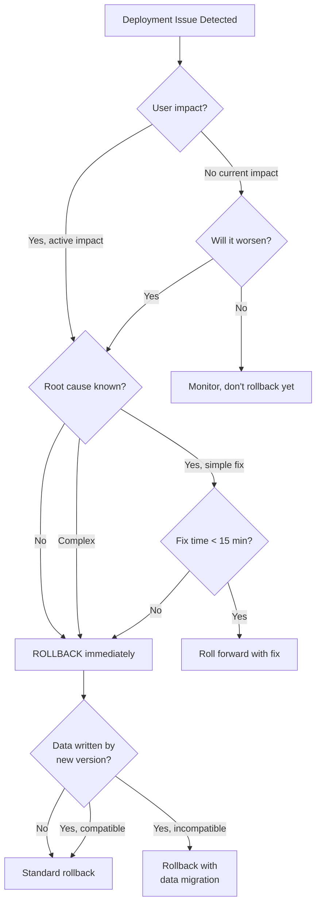
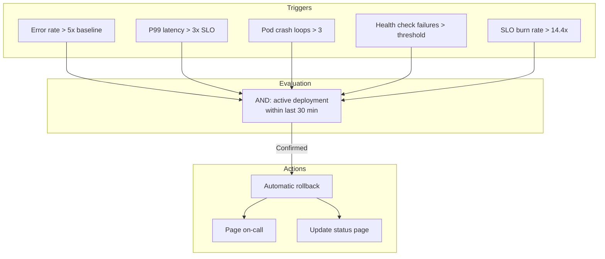
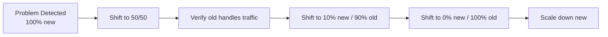

# Rollback Procedures

## Why It Exists

Every deployment has a non-zero probability of failure. The question is not if a deployment will fail, but when. When it does, the speed and correctness of your rollback determines whether the incident lasts 2 minutes or 2 hours.

Rollback is the most underinvested aspect of deployment. Teams spend weeks designing deployment pipelines and minutes thinking about rollback. The result: when a rollback is needed (always under pressure, often at 3 AM), the process is ad-hoc, undocumented, and error-prone. Engineers make it up as they go, sometimes making things worse.

### The Rollback Paradox

The time when you most need a rollback is the time when you are least prepared for one:
- High stress reduces cognitive function
- The system is in an unknown state (the failure may have corrupted data)
- Clock is ticking (customers are affected)
- Pressure to act fast conflicts with need to act carefully

This is why rollback must be automated, tested, and practiced regularly. It should be as routine as deploying.

### Rollback vs. Roll Forward

Not every failure should be rolled back. Sometimes it is faster and safer to fix the issue and push a new deployment (roll forward):

$$
\text{Best action} = \begin{cases}
\text{Rollback} & \text{if } T_{rollback} + R_{rollback} < T_{fix} + T_{deploy} \\
\text{Roll forward} & \text{if } T_{fix} + T_{deploy} < T_{rollback} + R_{rollback}
\end{cases}
$$

Where:
- $T_{rollback}$ = time to execute rollback
- $R_{rollback}$ = risk of rollback side effects
- $T_{fix}$ = time to write and test the fix
- $T_{deploy}$ = time to deploy the fix

## First Principles

### The Rollback Decision Framework



### Rollback Safety Properties

A safe rollback must satisfy:

1. **Atomicity**: The rollback completes fully or not at all. No partial rollbacks.
2. **Consistency**: After rollback, the system is in the same state as before the deployment.
3. **Data preservation**: No data created during the deployment is lost (unless explicitly chosen).
4. **Backward compatibility**: The old version can handle any data created by the new version.
5. **Idempotency**: Running the rollback multiple times produces the same result.

## Core Mechanics

### Rollback Methods by Deployment Strategy

| Strategy | Rollback Method | Time | Risk |
|----------|----------------|------|------|
| **Rolling Update** | `kubectl rollout undo` | 5-15 min | Medium (gradual) |
| **Blue-Green** | Switch LB back | Seconds | Low (instant) |
| **Canary** | Set canary weight to 0 | Seconds | Very low |
| **Feature Flag** | Disable flag | Instant | Very low |
| **Database Migration** | Run reverse migration | Minutes-hours | High |
| **Infrastructure** | Revert Terraform/CloudFormation | 5-30 min | Medium |

### Automated Rollback Triggers



## Implementation

### Automated Rollback Controller

```typescript
interface RollbackTrigger {
  name: string;
  query: string; // PromQL
  threshold: number;
  comparison: 'greater_than' | 'less_than';
  forDuration: number; // seconds
  severity: 'auto_rollback' | 'page_and_suggest' | 'log_only';
}

interface DeploymentState {
  deploymentId: string;
  serviceName: string;
  namespace: string;
  startedAt: Date;
  previousRevision: string;
  currentRevision: string;
  strategy: 'rolling' | 'blue-green' | 'canary';
  status: 'in_progress' | 'completed' | 'rolled_back' | 'failed';
  rolledBackAt?: Date;
  rollbackReason?: string;
}

class AutomatedRollbackController {
  private triggers: RollbackTrigger[];
  private deployments: Map<string, DeploymentState> = new Map();
  private prometheusUrl: string;
  private checkIntervalMs: number;
  private rollbackCooldownMs: number;
  private lastRollbackAt: Map<string, number> = new Map();

  constructor(config: {
    triggers: RollbackTrigger[];
    prometheusUrl: string;
    checkIntervalMs?: number;
    rollbackCooldownMs?: number;
  }) {
    this.triggers = config.triggers;
    this.prometheusUrl = config.prometheusUrl;
    this.checkIntervalMs = config.checkIntervalMs ?? 15_000;
    this.rollbackCooldownMs = config.rollbackCooldownMs ?? 300_000;
  }

  registerDeployment(state: DeploymentState): void {
    this.deployments.set(state.deploymentId, state);
    console.log(
      `Registered deployment ${state.deploymentId} for ${state.serviceName}`
    );
  }

  async startMonitoring(): Promise<void> {
    console.log('Starting rollback monitoring...');

    setInterval(async () => {
      for (const [id, deployment] of this.deployments) {
        if (deployment.status !== 'completed') continue;

        // Only monitor recent deployments (last 30 minutes)
        const age = Date.now() - deployment.startedAt.getTime();
        if (age > 30 * 60 * 1000) {
          this.deployments.delete(id);
          continue;
        }

        // Check cooldown
        const lastRollback = this.lastRollbackAt.get(deployment.serviceName) ?? 0;
        if (Date.now() - lastRollback < this.rollbackCooldownMs) continue;

        // Evaluate triggers
        for (const trigger of this.triggers) {
          const shouldRollback = await this.evaluateTrigger(
            trigger,
            deployment
          );

          if (shouldRollback) {
            if (trigger.severity === 'auto_rollback') {
              await this.executeRollback(deployment, trigger.name);
            } else if (trigger.severity === 'page_and_suggest') {
              await this.suggestRollback(deployment, trigger.name);
            }
            break;
          }
        }
      }
    }, this.checkIntervalMs);
  }

  private async evaluateTrigger(
    trigger: RollbackTrigger,
    deployment: DeploymentState
  ): Promise<boolean> {
    const query = trigger.query
      .replace('$SERVICE', deployment.serviceName)
      .replace('$NAMESPACE', deployment.namespace);

    try {
      const response = await fetch(
        `${this.prometheusUrl}/api/v1/query?query=${encodeURIComponent(query)}`
      );
      const data = await response.json();
      const value = parseFloat(data.data?.result?.[0]?.value?.[1] ?? '0');

      const triggered = trigger.comparison === 'greater_than'
        ? value > trigger.threshold
        : value < trigger.threshold;

      if (triggered) {
        console.log(
          `Trigger "${trigger.name}" fired for ${deployment.serviceName}: ${value} ${trigger.comparison} ${trigger.threshold}`
        );
      }

      return triggered;
    } catch (error) {
      console.error(`Failed to evaluate trigger ${trigger.name}:`, error);
      return false;
    }
  }

  private async executeRollback(
    deployment: DeploymentState,
    triggerName: string
  ): Promise<void> {
    console.log(
      `AUTO-ROLLBACK: ${deployment.serviceName} triggered by ${triggerName}`
    );

    try {
      switch (deployment.strategy) {
        case 'rolling':
          await this.rollbackRolling(deployment);
          break;
        case 'blue-green':
          await this.rollbackBlueGreen(deployment);
          break;
        case 'canary':
          await this.rollbackCanary(deployment);
          break;
      }

      deployment.status = 'rolled_back';
      deployment.rolledBackAt = new Date();
      deployment.rollbackReason = `Auto-rollback triggered by: ${triggerName}`;
      this.lastRollbackAt.set(deployment.serviceName, Date.now());

      // Notify team
      await this.notify(deployment);
    } catch (error) {
      console.error(`Rollback failed for ${deployment.serviceName}:`, error);
      // Page on-call for manual intervention
      await this.pageOnCall(deployment, String(error));
    }
  }

  private async rollbackRolling(deployment: DeploymentState): Promise<void> {
    console.log(`kubectl rollout undo deployment/${deployment.serviceName} -n ${deployment.namespace}`);
    // In production: use kubernetes client-go or client-node
  }

  private async rollbackBlueGreen(deployment: DeploymentState): Promise<void> {
    console.log(`Switching traffic back to previous environment`);
    // Switch LB target group or service selector
  }

  private async rollbackCanary(deployment: DeploymentState): Promise<void> {
    console.log(`Setting canary weight to 0%`);
    // Update Istio VirtualService or Flagger
  }

  private async suggestRollback(
    deployment: DeploymentState,
    triggerName: string
  ): Promise<void> {
    console.log(
      `ROLLBACK SUGGESTED: ${deployment.serviceName} (trigger: ${triggerName})`
    );
    // Send Slack message with rollback command
  }

  private async notify(deployment: DeploymentState): Promise<void> {
    console.log(`Notification: ${deployment.serviceName} was auto-rolled back`);
    // Send to Slack, PagerDuty, etc.
  }

  private async pageOnCall(
    deployment: DeploymentState,
    error: string
  ): Promise<void> {
    console.log(`PAGING ON-CALL: Rollback failed for ${deployment.serviceName}: ${error}`);
  }
}

// --- Configuration ---

const rollbackController = new AutomatedRollbackController({
  prometheusUrl: 'http://prometheus:9090',
  triggers: [
    {
      name: 'high_error_rate',
      query: 'sum(rate(http_requests_total{status=~"5..",service="$SERVICE"}[2m])) / sum(rate(http_requests_total{service="$SERVICE"}[2m]))',
      threshold: 0.05,
      comparison: 'greater_than',
      forDuration: 120,
      severity: 'auto_rollback',
    },
    {
      name: 'crash_loop',
      query: 'sum(kube_pod_container_status_restarts_total{namespace="$NAMESPACE",pod=~"$SERVICE.*"}) - sum(kube_pod_container_status_restarts_total{namespace="$NAMESPACE",pod=~"$SERVICE.*"} offset 5m)',
      threshold: 3,
      comparison: 'greater_than',
      forDuration: 60,
      severity: 'auto_rollback',
    },
    {
      name: 'high_latency',
      query: 'histogram_quantile(0.99, sum(rate(http_request_duration_seconds_bucket{service="$SERVICE"}[2m])) by (le))',
      threshold: 5.0,
      comparison: 'greater_than',
      forDuration: 180,
      severity: 'page_and_suggest',
    },
    {
      name: 'slo_burn_rate',
      query: 'sum(rate(http_requests_total{status=~"5..",service="$SERVICE"}[5m])) / sum(rate(http_requests_total{service="$SERVICE"}[5m])) / 0.001',
      threshold: 14.4,
      comparison: 'greater_than',
      forDuration: 120,
      severity: 'auto_rollback',
    },
  ],
});
```

### Post-Rollback Verification

```typescript
interface VerificationCheck {
  name: string;
  type: 'prometheus' | 'http' | 'kubernetes';
  config: {
    query?: string;
    url?: string;
    expectedStatus?: number;
    deployment?: string;
    namespace?: string;
  };
  expectedResult: string | number | boolean;
  timeout: number; // seconds
}

class PostRollbackVerifier {
  private checks: VerificationCheck[];

  constructor(checks: VerificationCheck[]) {
    this.checks = checks;
  }

  async verify(): Promise<{
    allPassed: boolean;
    results: Array<{
      name: string;
      passed: boolean;
      actual: unknown;
      expected: unknown;
      error?: string;
    }>;
  }> {
    const results = await Promise.all(
      this.checks.map(async (check) => {
        try {
          const actual = await this.executeCheck(check);
          const passed = this.compareResult(actual, check.expectedResult);

          return {
            name: check.name,
            passed,
            actual,
            expected: check.expectedResult,
          };
        } catch (error) {
          return {
            name: check.name,
            passed: false,
            actual: null,
            expected: check.expectedResult,
            error: String(error),
          };
        }
      })
    );

    return {
      allPassed: results.every((r) => r.passed),
      results,
    };
  }

  private async executeCheck(check: VerificationCheck): Promise<unknown> {
    switch (check.type) {
      case 'http': {
        const response = await fetch(check.config.url!);
        return response.status;
      }
      case 'prometheus': {
        const response = await fetch(
          `http://prometheus:9090/api/v1/query?query=${encodeURIComponent(check.config.query!)}`
        );
        const data = await response.json();
        return parseFloat(data.data?.result?.[0]?.value?.[1] ?? '0');
      }
      case 'kubernetes': {
        // Check deployment rollout status
        return 'complete';
      }
      default:
        throw new Error(`Unknown check type: ${check.type}`);
    }
  }

  private compareResult(actual: unknown, expected: string | number | boolean): boolean {
    if (typeof expected === 'number') {
      return Math.abs(Number(actual) - expected) / expected < 0.1; // Within 10%
    }
    return actual === expected;
  }
}

// Example verification checks
const postRollbackChecks: VerificationCheck[] = [
  {
    name: 'Health endpoint responding',
    type: 'http',
    config: { url: 'https://api.example.com/health', expectedStatus: 200 },
    expectedResult: 200,
    timeout: 30,
  },
  {
    name: 'Error rate below threshold',
    type: 'prometheus',
    config: {
      query: 'sum(rate(http_requests_total{status=~"5.."}[5m])) / sum(rate(http_requests_total[5m]))',
    },
    expectedResult: 0.001,
    timeout: 300,
  },
  {
    name: 'All pods running',
    type: 'kubernetes',
    config: { deployment: 'api-gateway', namespace: 'production' },
    expectedResult: 'complete',
    timeout: 300,
  },
];
```

## Edge Cases and Failure Modes

### 1. Rollback Cascade

Rolling back Service A causes Service B to fail because Service B depends on a new API endpoint that Service A introduced. Now you need to rollback Service B too, which may affect Service C.

**Solution**: Track deployment dependencies. Rollback in reverse dependency order. Better yet, design APIs to be backward compatible.

### 2. Data Created During Failed Deployment

The new version ran for 10 minutes and wrote 50,000 records with a new schema format. Rolling back the code leaves this data in the database, which the old version cannot read.

**Solution**: If possible, make the old version ignore unknown fields. If not, include a data fixup script in the rollback procedure.

### 3. Rollback During Rollback

You start rolling back, and the rollback itself fails (old image deleted from registry, infrastructure changed). Now you're stuck between versions.

**Solution**: Always verify rollback capability before deploying:
- Confirm previous image exists in registry
- Keep `revisionHistoryLimit` > 0 in Kubernetes
- Test rollback in staging before production deploy

::: danger Rollback Anti-Patterns
1. **No practiced rollbacks**: If you've never rolled back, your first rollback will be during an incident. Practice regularly.
2. **Manual rollback procedures**: "SSH to server, run script X, then Y, then Z" - too slow and error-prone under pressure.
3. **Rollback requires the same approvals as deploy**: If rollback needs 3 approvals during an outage, you will lose precious minutes.
4. **No rollback for infrastructure changes**: Terraform changes that can't be reverted leave you stuck.
5. **Assuming rollback is always safe**: Rolling back after a database migration without reversing the migration can cause data corruption.
:::

## Performance Characteristics

### Rollback Time by Strategy

| Strategy | Rollback Initiation | Traffic Restoration | Full Completion |
|----------|--------------------|--------------------|-----------------|
| Feature flag | Instant | Instant | Instant |
| Canary abort | 1-2 sec | 5-10 sec | 30 sec |
| Blue-green switch | 1-2 sec | 3-10 sec | 30 sec |
| Kubernetes rollout undo | 5-10 sec | 2-5 min | 5-15 min |
| Terraform revert | 30-60 sec | 5-30 min | 5-30 min |
| Database migration reverse | 1-5 min | Varies | Minutes-hours |

## Mathematical Foundations

### Rollback Decision Under Uncertainty

The decision to rollback can be modeled as an optimal stopping problem. Let $C(t)$ be the cumulative cost of the incident at time $t$, and $R$ be the cost of rollback:

$$
\text{Optimal rollback time} = \arg\min_t \left[ C(t) + R + \int_t^{t+T_R} \dot{C}(\tau) d\tau \right]
$$

Where $T_R$ is the rollback duration and $\dot{C}$ is the rate of cost accumulation.

If the cost rate is constant $c$ and rollback takes $T_R$ time:

$$
\text{Total cost} = c \cdot t_{detect} + R + c \cdot T_R
$$

Minimizing total cost means minimizing $t_{detect}$ (detect fast) and $T_R$ (rollback fast). The rollback cost $R$ is fixed, so the decision is: rollback as soon as you detect the problem.

## Real-World War Stories

::: info War Story
**The Rollback That Deleted Production Data (2021)**

A team deployed a database migration that renamed a table from `user_events` to `activity_log`. The migration worked. The application failed (hardcoded table name in one place). They rolled back the application, but the rollback didn't include reversing the migration. The old application code tried to read from `user_events`, which no longer existed.

In a panic, someone ran the reverse migration while the application was running. This renamed `activity_log` back to `user_events`, but the 5 minutes of data written to `activity_log` by the new version was now in a table the old version didn't expect. When the reverse migration dropped the `activity_log` table (which was supposed to be empty), it deleted 5 minutes of production data.

**Lesson**: Database rollback and application rollback must be coordinated. Never reverse a migration while traffic is flowing. The sequence should be: stop traffic -> reverse migration -> deploy old code -> start traffic.
:::

::: info War Story
**The Registry That Forgot (2023)**

A team's CI pipeline was configured to keep only the last 5 images per service in the container registry (to save storage costs). A deployment went bad, and the on-call ran `kubectl rollout undo`. Kubernetes tried to pull the previous image version - which had been garbage collected from the registry 3 days ago. The rollback failed with `ImagePullBackOff`.

The fix required finding the image digest in the Kubernetes event history, locating it in a backup registry, pushing it to the primary registry, and then retrying the rollback. Total time: 45 minutes.

**Fix**: Changed image retention to 30 days minimum. Added a pre-deployment check that verifies the rollback target image exists in the registry.
:::

## Decision Framework

### When to Rollback vs. Roll Forward

| Factor | Rollback | Roll Forward |
|--------|----------|-------------|
| Root cause known and simple fix | | Preferred |
| Root cause unknown | Preferred | |
| User impact is active | Preferred | |
| Data migration involved | Carefully | If fix is simple |
| Multiple services affected | Preferred | |
| Fix time > 15 minutes | Preferred | |
| Fix time < 5 minutes | | Preferred |
| Rollback has known risks | | Preferred |

## Advanced Topics

### GitOps Rollback

With GitOps (ArgoCD, Flux), rollback is a git revert:

```typescript
interface GitOpsRollback {
  repository: string;
  branch: string;
  commitToRevert: string;
  service: string;
}

async function gitOpsRollback(config: GitOpsRollback): Promise<void> {
  // 1. Revert the commit in the GitOps repo
  // git revert <commit> --no-edit
  // git push

  // 2. ArgoCD/Flux detects the change and syncs
  // The previous version is re-applied automatically

  // 3. Verify the sync completed
  // argocd app get <app-name> --output json | jq '.status.sync.status'

  console.log(
    `GitOps rollback: reverted ${config.commitToRevert} in ${config.repository}`
  );
}
```

### Progressive Rollback

Instead of an all-at-once rollback, gradually shift traffic back to the old version:



This is useful when the old version might also have issues (cache cold start, connection pool ramp-up).

## Cross-References

- [Deployment Strategies Overview](./index.md) - Rollback capabilities of each strategy
- [Blue-Green Deployment](./blue-green.md) - Fastest rollback via traffic switching
- [Canary Deployment](./canary.md) - Automated canary abort as rollback
- [Feature Flags Deployment](./feature-flags-deployment.md) - Instant rollback via flag disable
- [Database Migrations](./database-migrations.md) - Rolling back schema changes safely
- [Runbook Templates](../alerting/runbook-templates.md) - Rollback runbooks
