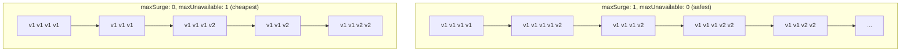
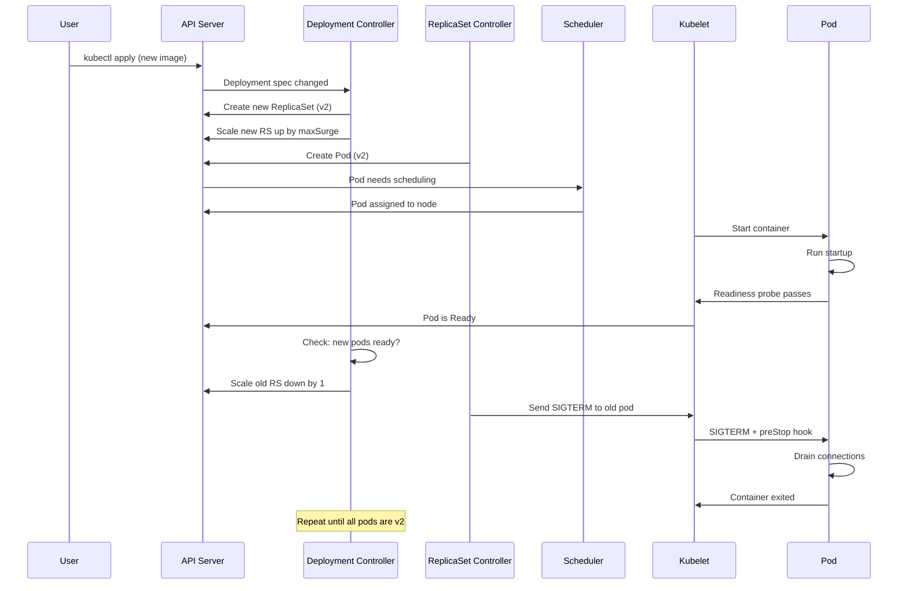
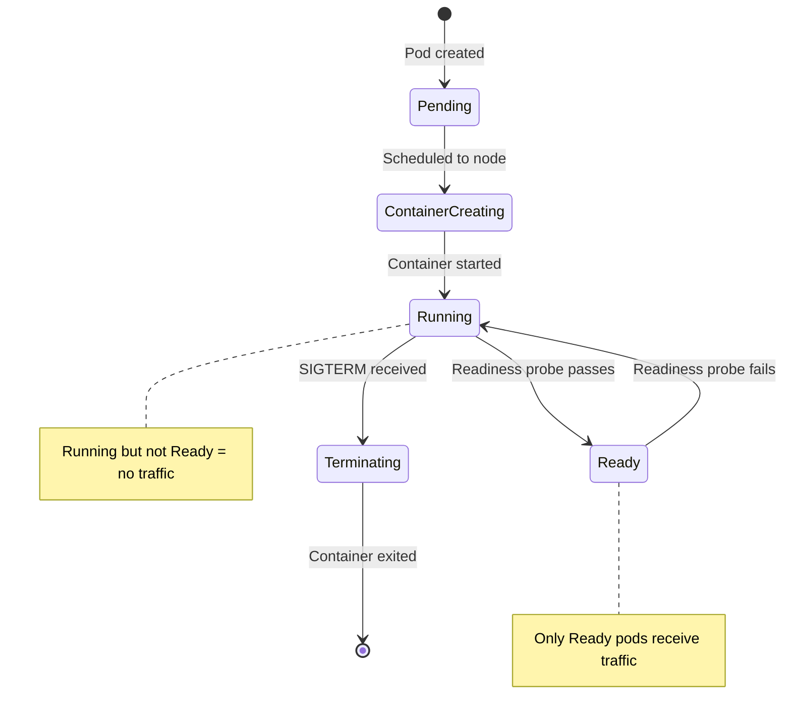
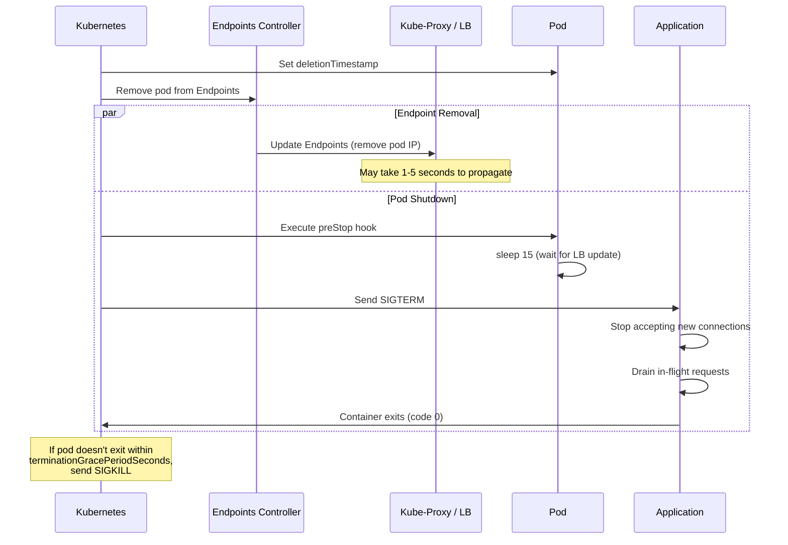

# Rolling Updates

## Why It Exists

Rolling updates are the default deployment strategy in Kubernetes and the most commonly used approach for zero-downtime deployments. The concept is simple: replace old pods with new pods one (or a few) at a time, verifying health at each step. No additional infrastructure is needed (unlike blue-green), no complex analysis pipeline (unlike canary), and the Kubernetes scheduler handles all the orchestration.

Rolling updates represent the pragmatic middle ground: safer than deploying all-at-once, simpler than canary, and cheaper than blue-green. For 80% of deployments at 80% of companies, rolling updates are the right choice.

### Historical Context

Before container orchestrators, rolling updates were manual. A deployment engineer would SSH into server 1, stop the service, deploy the new code, start the service, verify it was healthy, then move to server 2. This was slow (hours), error-prone (typos, missed servers), and inconsistent (server 3 might get a slightly different config than server 1).

Kubernetes (2014+) automated this entirely. The Deployment controller watches for changes to the pod template and orchestrates the rollout according to the configured strategy. The engineer updates the desired state; Kubernetes handles the transition.

## First Principles

### The Rolling Update Contract

A rolling update guarantees:

1. **Minimum availability**: At least `replicas - maxUnavailable` pods are running at all times
2. **Maximum parallelism**: At most `replicas + maxSurge` pods exist simultaneously
3. **Health gating**: New pods must pass readiness probes before old pods are terminated
4. **Ordering**: Old pods are only terminated after new pods are confirmed ready

$$
\text{Available Pods} \geq \text{replicas} - \text{maxUnavailable}
$$

$$
\text{Total Pods} \leq \text{replicas} + \text{maxSurge}
$$

### MaxSurge and MaxUnavailable

These two parameters control the rollout speed vs. resource usage trade-off:

| Parameter | Meaning | Effect |
|-----------|---------|--------|
| **maxSurge** | Max extra pods above desired count | Higher = faster rollout, more resources |
| **maxUnavailable** | Max pods below desired count | Higher = faster rollout, reduced capacity |

Both can be absolute numbers or percentages:
- `maxSurge: 25%` with 10 replicas = up to 13 pods during rollout (ceiling of 10 * 1.25)
- `maxUnavailable: 25%` with 10 replicas = at least 8 pods available (floor of 10 * 0.75)



## Core Mechanics

### Kubernetes Deployment Controller Internals



### The Readiness Gate

The readiness probe is the critical safety mechanism. Without it, Kubernetes considers a pod "ready" as soon as the container starts - even if the application hasn't finished initializing.



### The Graceful Shutdown Sequence

When Kubernetes terminates a pod during a rolling update:



::: danger The preStop Hook Gap
There is a race condition between endpoint removal and SIGTERM delivery. Kubernetes sends SIGTERM and removes the pod from endpoints simultaneously. If the load balancer hasn't propagated the endpoint removal before the application stops accepting connections, requests will be routed to a pod that is shutting down.

The solution is a `preStop` hook with a sleep:
```yaml
lifecycle:
  preStop:
    exec:
      command: ["sh", "-c", "sleep 15"]
```
This gives the endpoint removal 15 seconds to propagate before the application begins shutting down.
:::

## Implementation

### Production Kubernetes Deployment Configuration

```typescript
interface RollingUpdateConfig {
  name: string;
  namespace: string;
  image: string;
  replicas: number;
  maxSurge: string;
  maxUnavailable: string;
  port: number;
  healthCheckPath: string;
  resources: {
    requests: { cpu: string; memory: string };
    limits: { cpu: string; memory: string };
  };
  envVars: Record<string, string>;
  preStopSleepSeconds: number;
  terminationGracePeriodSeconds: number;
  readinessProbe: {
    initialDelaySeconds: number;
    periodSeconds: number;
    failureThreshold: number;
    successThreshold: number;
    timeoutSeconds: number;
  };
  livenessProbe: {
    initialDelaySeconds: number;
    periodSeconds: number;
    failureThreshold: number;
    timeoutSeconds: number;
  };
  minReadySeconds: number;
  progressDeadlineSeconds: number;
  revisionHistoryLimit: number;
}

function generateDeploymentYaml(config: RollingUpdateConfig): string {
  return `apiVersion: apps/v1
kind: Deployment
metadata:
  name: ${config.name}
  namespace: ${config.namespace}
  labels:
    app: ${config.name}
spec:
  replicas: ${config.replicas}
  revisionHistoryLimit: ${config.revisionHistoryLimit}
  progressDeadlineSeconds: ${config.progressDeadlineSeconds}
  minReadySeconds: ${config.minReadySeconds}
  strategy:
    type: RollingUpdate
    rollingUpdate:
      maxSurge: ${config.maxSurge}
      maxUnavailable: ${config.maxUnavailable}
  selector:
    matchLabels:
      app: ${config.name}
  template:
    metadata:
      labels:
        app: ${config.name}
    spec:
      terminationGracePeriodSeconds: ${config.terminationGracePeriodSeconds}
      containers:
        - name: app
          image: ${config.image}
          ports:
            - containerPort: ${config.port}
          resources:
            requests:
              cpu: "${config.resources.requests.cpu}"
              memory: "${config.resources.requests.memory}"
            limits:
              cpu: "${config.resources.limits.cpu}"
              memory: "${config.resources.limits.memory}"
          readinessProbe:
            httpGet:
              path: ${config.healthCheckPath}
              port: ${config.port}
            initialDelaySeconds: ${config.readinessProbe.initialDelaySeconds}
            periodSeconds: ${config.readinessProbe.periodSeconds}
            failureThreshold: ${config.readinessProbe.failureThreshold}
            successThreshold: ${config.readinessProbe.successThreshold}
            timeoutSeconds: ${config.readinessProbe.timeoutSeconds}
          livenessProbe:
            httpGet:
              path: ${config.healthCheckPath}
              port: ${config.port}
            initialDelaySeconds: ${config.livenessProbe.initialDelaySeconds}
            periodSeconds: ${config.livenessProbe.periodSeconds}
            failureThreshold: ${config.livenessProbe.failureThreshold}
            timeoutSeconds: ${config.livenessProbe.timeoutSeconds}
          lifecycle:
            preStop:
              exec:
                command: ["sh", "-c", "sleep ${config.preStopSleepSeconds}"]
          env:
${Object.entries(config.envVars)
  .map(([k, v]) => `            - name: ${k}\n              value: "${v}"`)
  .join('\n')}
`;
}

// Production-grade configuration
const productionConfig: RollingUpdateConfig = {
  name: 'api-gateway',
  namespace: 'production',
  image: 'registry.example.com/api-gateway:v2.1.0',
  replicas: 10,
  maxSurge: '25%',        // Up to 13 pods during rollout
  maxUnavailable: '0',     // Never reduce below 10 available pods
  port: 8080,
  healthCheckPath: '/health/ready',
  resources: {
    requests: { cpu: '500m', memory: '512Mi' },
    limits: { cpu: '1000m', memory: '1Gi' },
  },
  envVars: {
    NODE_ENV: 'production',
    LOG_LEVEL: 'info',
  },
  preStopSleepSeconds: 15,
  terminationGracePeriodSeconds: 60,
  readinessProbe: {
    initialDelaySeconds: 10,
    periodSeconds: 5,
    failureThreshold: 3,
    successThreshold: 1,
    timeoutSeconds: 3,
  },
  livenessProbe: {
    initialDelaySeconds: 30,
    periodSeconds: 10,
    failureThreshold: 5,
    timeoutSeconds: 5,
  },
  minReadySeconds: 30,           // Pod must be Ready for 30s before considered Available
  progressDeadlineSeconds: 600,  // Rollout must complete in 10 minutes
  revisionHistoryLimit: 10,      // Keep last 10 ReplicaSets for rollback
};

console.log(generateDeploymentYaml(productionConfig));
```

### Graceful Shutdown in Node.js

```typescript
import { createServer, Server, IncomingMessage, ServerResponse } from 'http';

class GracefulServer {
  private server: Server;
  private isShuttingDown = false;
  private activeConnections = new Set<import('net').Socket>();
  private activeRequests = 0;

  constructor(handler: (req: IncomingMessage, res: ServerResponse) => void) {
    this.server = createServer((req, res) => {
      if (this.isShuttingDown) {
        res.writeHead(503, { 'Connection': 'close' });
        res.end('Service shutting down');
        return;
      }

      this.activeRequests++;
      res.on('finish', () => {
        this.activeRequests--;
      });

      handler(req, res);
    });

    this.server.on('connection', (socket) => {
      this.activeConnections.add(socket);
      socket.on('close', () => this.activeConnections.delete(socket));
    });

    this.setupShutdownHandlers();
  }

  listen(port: number): void {
    this.server.listen(port, () => {
      console.log(`Server listening on port ${port}`);
    });
  }

  private setupShutdownHandlers(): void {
    const shutdown = async (signal: string) => {
      if (this.isShuttingDown) return;
      this.isShuttingDown = true;

      console.log(`[${signal}] Graceful shutdown initiated`);
      console.log(`Active requests: ${this.activeRequests}`);
      console.log(`Active connections: ${this.activeConnections.size}`);

      // Stop accepting new connections
      this.server.close(() => {
        console.log('Server closed to new connections');
      });

      // Wait for in-flight requests (max 25 seconds)
      // preStop hook sleeps 15s, so we have ~45s of the 60s grace period
      const deadline = Date.now() + 25_000;
      while (this.activeRequests > 0 && Date.now() < deadline) {
        await new Promise((r) => setTimeout(r, 500));
        console.log(`Draining: ${this.activeRequests} requests remaining`);
      }

      // Force close remaining connections
      for (const socket of this.activeConnections) {
        socket.destroy();
      }

      console.log('Shutdown complete');
      process.exit(0);
    };

    process.on('SIGTERM', () => shutdown('SIGTERM'));
    process.on('SIGINT', () => shutdown('SIGINT'));
  }
}

// Usage
const server = new GracefulServer((req, res) => {
  // Health check endpoint for Kubernetes probes
  if (req.url === '/health/ready') {
    res.writeHead(200);
    res.end('OK');
    return;
  }

  // Application logic
  res.writeHead(200, { 'Content-Type': 'application/json' });
  res.end(JSON.stringify({ status: 'ok' }));
});

server.listen(8080);
```

## Edge Cases and Failure Modes

### 1. The Stuck Rollout

A new version fails readiness probes. Kubernetes creates new pods, they never become ready, old pods are not terminated. The rollout stalls.

```bash
# Detect stuck rollout
kubectl rollout status deployment/api-gateway --timeout=300s
# If it times out, the rollout is stuck

# Diagnose
kubectl get pods -l app=api-gateway
# Look for pods in CrashLoopBackOff or not Ready

# Fix: rollback
kubectl rollout undo deployment/api-gateway
```

The `progressDeadlineSeconds` setting controls how long Kubernetes waits before marking the rollout as failed. Default is 600 seconds (10 minutes).

### 2. Thundering Herd on Rolling Restart

When `maxSurge` is high (e.g., 50%), many new pods start simultaneously. If each pod warms its cache on startup by hitting the database, the database gets overwhelmed.

**Solution**: Use `minReadySeconds` to space out rollout and implement startup backoff:

```typescript
async function startupWithBackoff(): Promise<void> {
  // Add random jitter to avoid thundering herd
  const jitterMs = Math.random() * 10_000; // 0-10 seconds
  await new Promise((r) => setTimeout(r, jitterMs));

  // Warm caches gradually
  await warmCaches();
}
```

### 3. Mixed Version Compatibility

During a rolling update, both v1 and v2 pods serve traffic. If they have incompatible behavior (different API response format, different session handling), users experience inconsistent behavior.

**Solution**: All changes must be backward compatible. Use the expand-contract pattern:
1. v2 supports both old and new behavior
2. Complete rollout to v2
3. v3 removes old behavior

### 4. Resource Exhaustion During Rollout

With `maxSurge: 25%` and 10 replicas, 13 pods run during rollout. If the cluster doesn't have capacity for 3 extra pods, the new pods stay Pending and the rollout stalls.

**Solution**: Ensure cluster has headroom for surge pods. Use Cluster Autoscaler or pre-provision capacity.

::: warning Rolling Update Anti-Patterns
1. **maxUnavailable: 100%**: This is a recreate strategy, not a rolling update. All pods die simultaneously.
2. **No readiness probe**: Kubernetes sends traffic to pods before they're ready. Users get 502/503 errors.
3. **Readiness probe = liveness probe**: If the app is temporarily overloaded, the liveness probe kills it, causing cascading failures. Readiness removes from LB; liveness restarts the pod.
4. **terminationGracePeriodSeconds too short**: Default 30 seconds may not be enough for long-running requests. Set to at least 60 seconds.
5. **No preStop hook**: The endpoint removal / SIGTERM race condition causes 5xx errors during rollout.
:::

## Performance Characteristics

### Rollout Time Formula

$$
T_{rollout} = \frac{N_{replicas}}{N_{batch}} \times (T_{startup} + T_{readiness} + T_{minReady})
$$

Where:
- $N_{batch}$ = number of pods replaced per batch ($\approx$ maxSurge or maxUnavailable)
- $T_{startup}$ = time for container to start
- $T_{readiness}$ = time from start to first successful readiness probe
- $T_{minReady}$ = minReadySeconds

For 10 replicas, maxSurge 25% (batch of 3), 15s startup, 10s readiness, 30s minReady:

$$
T_{rollout} = \frac{10}{3} \times (15 + 10 + 30) = 3.33 \times 55 \approx 183 \text{ seconds} \approx 3 \text{ minutes}
$$

### Configuration Impact on Rollout Speed

| Configuration | Batch Size | Rollout Time (10 replicas) | Resource Overhead |
|--------------|-----------|---------------------------|------------------|
| maxSurge:1, maxUnavailable:0 | 1 | 550s (~9 min) | +10% |
| maxSurge:25%, maxUnavailable:0 | 3 | 183s (~3 min) | +25% |
| maxSurge:50%, maxUnavailable:0 | 5 | 110s (~2 min) | +50% |
| maxSurge:0, maxUnavailable:25% | 3 | 165s (~3 min) | 0% |
| maxSurge:25%, maxUnavailable:25% | 5 | 110s (~2 min) | 0-25% |

## Mathematical Foundations

### Availability During Rolling Update

With $N$ replicas, $u$ maxUnavailable, and $s$ maxSurge, the minimum available capacity during rollout:

$$
C_{min} = \frac{N - u}{N} \times 100\%
$$

The maximum capacity:

$$
C_{max} = \frac{N + s}{N} \times 100\%
$$

For 10 replicas, maxUnavailable=0, maxSurge=25%:

$$
C_{min} = \frac{10 - 0}{10} = 100\%, \quad C_{max} = \frac{10 + 3}{10} = 130\%
$$

### Request Error Probability During Rollout

If the endpoint propagation delay is $\Delta t$ and the request rate is $r$:

$$
E[\text{failed requests per pod rotation}] = r \times \Delta t \times P(\text{request hits draining pod})
$$

With preStop sleep of $s$ seconds:

$$
P(\text{hit draining pod}) \approx \max(0, 1 - \frac{s}{\Delta t})
$$

If $s > \Delta t$ (preStop sleep exceeds propagation delay), the probability approaches zero.

## Real-World War Stories

::: info War Story
**The 502 Errors Nobody Could Explain (2021)**

A team experienced intermittent 502 errors during every deployment. The errors lasted 5-10 seconds per pod rotation, totaling 50-100 errors per deployment across 10 replicas.

Investigation revealed the root cause: no `preStop` hook. When Kubernetes sent SIGTERM, the application immediately began rejecting new connections. But the Endpoints controller hadn't finished propagating the removal to all kube-proxy instances. For 2-3 seconds, requests were still being routed to the shutting-down pod.

Adding `preStop: exec: command: ["sleep", "15"]` eliminated 100% of deployment-related 502 errors.
:::

::: info War Story
**The Rollout That Ate the Database (2023)**

A service with 30 replicas deployed a new version with `maxSurge: 50%`. 15 new pods started simultaneously. Each pod's initialization routine loaded 500MB of reference data from PostgreSQL. 15 concurrent connections each running a full table scan caused the database CPU to hit 100%.

The existing 30 pods slowed down because their queries were competing for database CPU. Health checks started failing on old pods. Kubernetes started killing old pods (liveness failure), making the situation worse. Within 3 minutes, the service had 15 crashed new pods and 20 failing old pods.

**Fix**: Reduced `maxSurge` to `10%` (3 pods at a time), added connection pool limits to the initialization routine, and implemented a startup probe with a longer threshold to avoid liveness kills during initialization.
:::

## Decision Framework

### Choosing MaxSurge and MaxUnavailable

| Scenario | maxSurge | maxUnavailable | Rationale |
|----------|----------|---------------|-----------|
| Zero downtime, has headroom | 25% | 0 | Safest: never below desired replicas |
| Zero downtime, tight resources | 0 | 25% | No extra resources needed, capacity dips briefly |
| Fast rollout, non-critical | 50% | 25% | Parallel replacement, faster completion |
| Database-heavy startup | 10% | 0 | Limit concurrent startup load |
| Single replica (dev) | 1 | 0 | Must create new before killing old |

## Advanced Topics

### Pod Disruption Budgets (PDB)

PDBs work alongside rolling updates to prevent voluntary disruptions from killing too many pods:

```yaml
apiVersion: policy/v1
kind: PodDisruptionBudget
metadata:
  name: api-gateway-pdb
spec:
  maxUnavailable: 1
  selector:
    matchLabels:
      app: api-gateway
```

PDBs protect against node drains, cluster autoscaler, and other voluntary disruptions - not just deployments. They ensure that even when multiple disruption sources are active simultaneously, the service maintains minimum availability.

### Topology-Aware Rolling Updates

Ensure pods are replaced across availability zones, not all from one zone:

```yaml
spec:
  template:
    spec:
      topologySpreadConstraints:
        - maxSkew: 1
          topologyKey: topology.kubernetes.io/zone
          whenUnsatisfiable: DoNotSchedule
          labelSelector:
            matchLabels:
              app: api-gateway
```

This prevents a rollout from temporarily concentrating all pods in a single AZ, which would be a single point of failure.

## Cross-References

- [Deployment Strategies Overview](./index.md) - Comparison with other strategies
- [Blue-Green Deployment](./blue-green.md) - Alternative with instant rollback
- [Canary Deployment](./canary.md) - Progressive validation approach
- [Rollback Procedures](./rollback-procedures.md) - Rolling back a rolling update
- [Database Migrations](./database-migrations.md) - Schema changes during rolling updates
