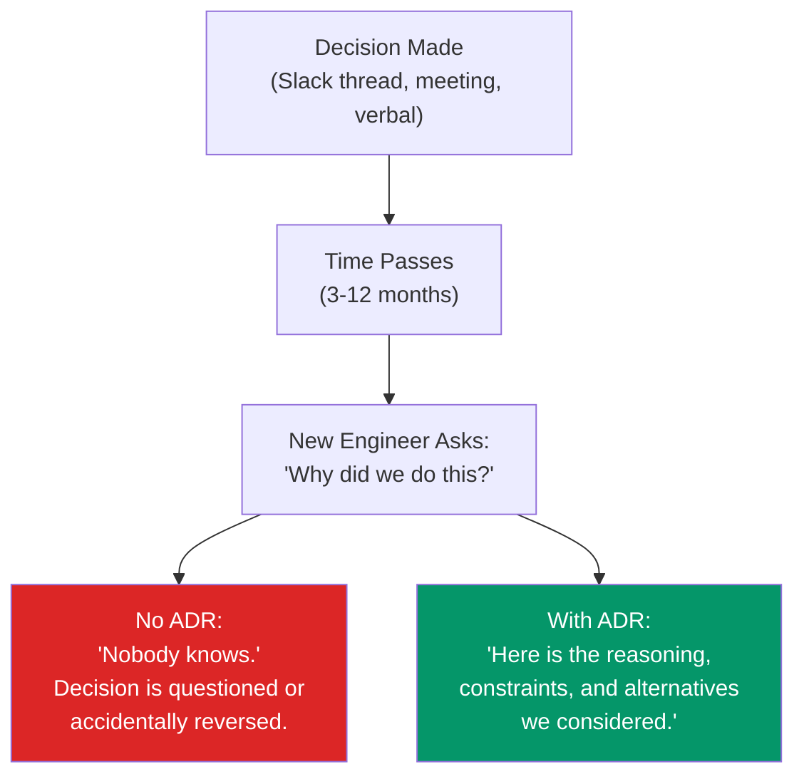
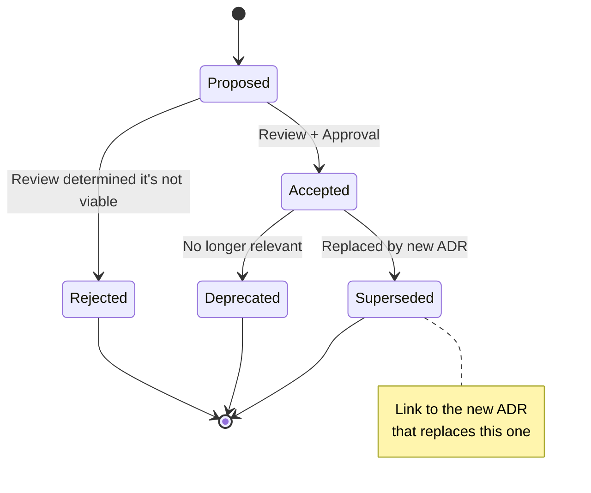
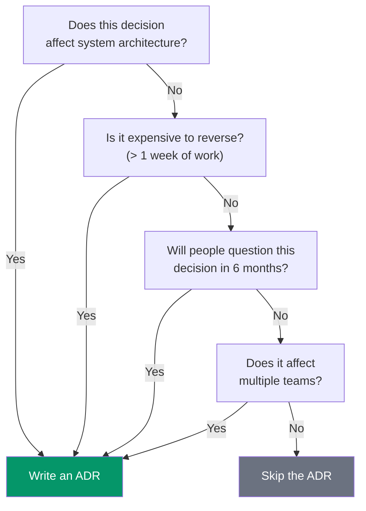

# Architecture Decision Records (ADRs)

Every codebase is a graveyard of architectural decisions. Why did we choose Postgres over DynamoDB? Why is this service in Go when everything else is in TypeScript? Why does the authentication flow work this way? Six months later, the engineer who made the decision has left, and the new team is left guessing. Architecture Decision Records (ADRs) solve this by capturing the **why** behind every significant technical decision — not just what was decided, but what alternatives were considered, what trade-offs were accepted, and what context existed at the time. An ADR is a short document (1-2 pages) that preserves the reasoning behind a decision so that future engineers can understand, evaluate, and when necessary, reverse it.

## Why ADRs Matter

### The Problem They Solve



### The Value Proposition

| Without ADRs | With ADRs |
|-------------|-----------|
| Decisions live in Slack threads that nobody can find | Decisions are searchable and discoverable |
| New engineers question existing decisions without context | New engineers understand the "why" and build on it |
| The same debates repeat every 6 months | Previous analysis is available — no re-litigation |
| Architectural consistency degrades over time | Decisions form a coherent narrative |
| Senior engineers are the only source of institutional knowledge | Knowledge is democratized in written form |
| Reversing a decision is risky because the original constraints are unknown | Trade-offs are documented, making it clear when reversal is warranted |

::: tip The Two-Way Door Test
ADRs are most valuable for **one-way door decisions** — decisions that are expensive to reverse (database choice, programming language, service boundaries, authentication architecture). Two-way door decisions (library choice, naming conventions) usually do not need ADRs. Use judgment: if the decision will affect the team for more than 6 months, write an ADR.
:::

## ADR Template

The most widely used template is based on Michael Nygard's original format. Here is an enhanced version suitable for production engineering teams:

```markdown
# ADR-NNN: [Title — Short Imperative Phrase]

**Status:** Proposed | Accepted | Deprecated | Superseded by ADR-XXX
**Date:** YYYY-MM-DD
**Author(s):** [Names]
**Reviewers:** [Names]
**Deciders:** [Names — who has final authority]

## Context

What is the situation that requires a decision? Describe the forces at play:
technical, business, organizational, and time constraints. Be specific.
Include numbers: traffic volume, team size, budget, deadlines.

This section should be factual and neutral — do not argue for a position here.

## Decision

State the decision clearly in one or two sentences:

"We will use PostgreSQL as the primary database for the order service."

Then explain the rationale:
- Why this option was chosen over alternatives
- What trade-offs were accepted
- What constraints drove the decision

## Alternatives Considered

### Alternative 1: [Name]

Description of the alternative. Why was it considered? Why was it rejected?
Be specific about the trade-offs.

### Alternative 2: [Name]

Same structure. Show that you explored the solution space.

### Alternative 3: [Name]

Including the "do nothing" alternative is often valuable — it makes the
cost of inaction explicit.

## Consequences

What becomes easier? What becomes harder? Be honest about both:

### Positive
- [Benefit 1]
- [Benefit 2]

### Negative
- [Trade-off 1 — and how we'll mitigate it]
- [Trade-off 2]

### Neutral
- [Side effect that is neither good nor bad]

## Follow-Up Actions

- [ ] Action item 1 (owner, deadline)
- [ ] Action item 2 (owner, deadline)
```

## ADR Lifecycle

ADRs are not static documents. They have a lifecycle:



### Status Definitions

| Status | Meaning | Action |
|--------|---------|--------|
| **Proposed** | Under discussion, not yet decided | Active review and debate |
| **Accepted** | Decision has been made and is in effect | Implement the decision |
| **Rejected** | Proposal was reviewed and rejected | Document why it was rejected — this is valuable context |
| **Deprecated** | Decision is no longer relevant (system retired, context changed) | Mark as deprecated with explanation |
| **Superseded** | Replaced by a newer ADR | Link to the new ADR: "Superseded by ADR-042" |

### Immutability Principle

Once an ADR is accepted, **do not modify it**. If circumstances change, write a new ADR that supersedes the old one. This preserves the historical record and makes it clear that the decision changed, why it changed, and when it changed.

The only acceptable edits to an accepted ADR are:
- Updating the status to "Deprecated" or "Superseded"
- Adding a link to the superseding ADR
- Fixing typos (no substantive changes)

## Numbering and Organization

### File Structure

```
docs/
└── adr/
    ├── 0001-record-architecture-decisions.md    # The meta-ADR
    ├── 0002-use-postgresql-for-order-service.md
    ├── 0003-adopt-event-driven-architecture.md
    ├── 0004-choose-go-for-api-gateway.md
    ├── 0005-use-s3-for-blob-storage.md
    ├── 0006-adopt-graphql-for-bff-layer.md
    └── index.md                                  # Summary table of all ADRs
```

### The Index Page

Maintain a summary table so engineers can scan all decisions:

```markdown
# Architecture Decision Records

| # | Title | Status | Date | Summary |
|---|-------|--------|------|---------|
| 1 | Record architecture decisions | Accepted | 2025-01-15 | Use ADRs to document decisions |
| 2 | Use PostgreSQL for order service | Accepted | 2025-02-01 | Chose Postgres over DynamoDB for ACID transactions |
| 3 | Adopt event-driven architecture | Accepted | 2025-03-10 | Use Kafka for inter-service communication |
| 4 | Choose Go for API gateway | Superseded by 12 | 2025-04-01 | Migrated to Rust for lower latency |
| 5 | Use S3 for blob storage | Accepted | 2025-04-15 | S3 for all file uploads and media |
| 6 | Adopt GraphQL for BFF layer | Deprecated | 2025-05-01 | Simplified to REST after team feedback |
```

## Tooling

### adr-tools (CLI)

The original ADR tooling, a set of bash scripts:

```bash
# Install
brew install adr-tools

# Initialize ADR directory
adr init docs/adr

# Create a new ADR
adr new "Use PostgreSQL for order service"
# Creates: docs/adr/0002-use-postgresql-for-order-service.md

# Mark an ADR as superseded
adr new -s 4 "Use Rust for API gateway"
# Creates ADR 12, marks ADR 4 as superseded

# Generate a table of contents
adr list

# Generate a graph of ADR relationships
adr generate graph | dot -Tpng > adr-graph.png
```

### log4brains

A more modern tool that provides a web UI for browsing ADRs:

```bash
# Install
npm install -g log4brains

# Initialize
log4brains init

# Create a new ADR interactively
log4brains adr new

# Preview ADRs in a web UI
log4brains preview

# Build static site
log4brains build
```

### Tool Comparison

| Feature | adr-tools | log4brains | Manual (just files) |
|---------|-----------|------------|-------------------|
| CLI creation | Yes | Yes | No (copy template) |
| Web UI | No | Yes (preview + build) | No |
| Supersession tracking | Yes | Yes | Manual |
| Search | grep | Full-text in UI | grep |
| CI integration | Basic | GitHub Actions support | Custom |
| Learning curve | Low | Medium | None |
| Dependencies | bash | Node.js | None |

::: tip Start Simple
If your team is new to ADRs, do not install tooling. Create a `docs/adr/` directory, copy the template, and start writing. Adopt tooling only when the number of ADRs makes manual management painful (usually around 20-30 ADRs).
:::

## Real-World Examples

### Example 1: Database Selection

```markdown
# ADR-002: Use PostgreSQL for the Order Service

**Status:** Accepted
**Date:** 2025-02-01
**Author:** Sarah Chen
**Deciders:** Sarah Chen, Alex Rivera (Tech Lead), Jordan Park (Staff Eng)

## Context

The order service is being rebuilt to replace the legacy monolith's order
module. The service needs to handle:
- ~5,000 orders/day (projected to grow to 50,000/day in 18 months)
- Complex queries: joins across orders, line items, customers, inventory
- Strong consistency: partial order creation is not acceptable
- Financial audit trail: all changes must be tracked

The team has experience with PostgreSQL, MongoDB, and DynamoDB.

## Decision

We will use **PostgreSQL** as the primary database for the order service.

Rationale:
- ACID transactions are essential for order integrity (creating an order
  involves inserting into 3-4 tables atomically)
- Complex queries across orders, customers, and inventory are a core
  requirement — relational joins are natural and performant
- The team has 4 engineers with deep PostgreSQL experience
- PostgreSQL handles 50K orders/day easily on a single primary with read
  replicas

## Alternatives Considered

### DynamoDB
- Pros: Managed, auto-scaling, predictable latency at any scale
- Cons: No cross-table transactions (would require implementing saga pattern),
  complex queries require GSIs or denormalization, team has limited experience
- Rejected because: The complexity of implementing distributed transactions
  for order creation outweighs DynamoDB's operational simplicity at our scale

### MongoDB
- Pros: Flexible schema, good developer experience, multi-document transactions
  (since 4.0)
- Cons: Transaction performance is worse than PostgreSQL, less mature tooling
  for financial data, team has more PostgreSQL experience
- Rejected because: No compelling advantage over PostgreSQL for this use case

### Do Nothing (Keep in Monolith)
- Rejected because: The monolith's order module is the primary bottleneck for
  deployment speed (shared database, coupled releases)

## Consequences

### Positive
- Familiar technology reduces ramp-up time
- ACID transactions simplify application logic
- Rich ecosystem of tools (pgAdmin, pgBouncer, pg_stat_statements)
- Easy to add read replicas for reporting

### Negative
- Single-node write scalability limit (~100K writes/sec) — acceptable for
  our scale, but would need sharding if we grow 100x
- Operational burden of managing PostgreSQL (mitigated by using RDS)
- Schema migrations require coordination (mitigated by using online DDL tools)
```

### Example 2: Superseding a Decision

```markdown
# ADR-012: Migrate API Gateway from Go to Rust

**Status:** Accepted
**Date:** 2026-01-15
**Author:** Alex Rivera
**Supersedes:** ADR-004 (Choose Go for API gateway)

## Context

ADR-004 chose Go for the API gateway in April 2025. Since then:
- Traffic has grown 20x (from 1K rps to 20K rps)
- p99 latency increased from 5ms to 45ms due to GC pauses
- Memory usage grows to 2GB before GC cycles cause latency spikes
- The gateway is now the critical path for all customer-facing requests

Go's garbage collector, while excellent for most workloads, introduces
unpredictable latency spikes that violate our SLA (p99 < 20ms) at
current traffic levels.

## Decision

We will rewrite the API gateway in **Rust** using Axum.

The gateway is a thin layer (routing, auth token validation, rate limiting,
request transformation). The codebase is ~3,000 lines of Go. The rewrite
is estimated at 2 sprints (4 weeks) for 2 engineers.

## Alternatives Considered

### Tune Go GC
- Tried: GOGC=50, ballast, sync.Pool for allocations
- Result: Reduced p99 from 45ms to 30ms — still above SLA
- Rejected: Diminishing returns; fundamental GC limitation at this scale

### C++ (Envoy filter)
- Would avoid the rewrite by extending Envoy
- Rejected: Team has no C++ experience; Envoy filters are complex to develop
  and debug

### Keep Go, add more instances
- Horizontal scaling would reduce per-instance load
- Rejected: Does not solve the GC pause problem — each instance still spikes.
  Also increases infrastructure cost 3x.

## Consequences

### Positive
- Predictable latency (no GC pauses): expected p99 < 5ms
- 3-5x lower memory usage
- Higher throughput per instance (fewer instances needed)

### Negative
- 4-week development investment
- Team must learn Rust (2 engineers have Rust experience, 3 do not)
- Rust compile times are slower than Go
- Smaller hiring pool for future maintenance
```

## When NOT to Write an ADR

Not every decision needs an ADR. Skip them for:

- **Obvious decisions** with no real alternatives (e.g., "use HTTPS")
- **Easily reversible decisions** (choosing a logging library, CI tool)
- **Implementation details** that do not affect architecture (algorithm choice within a function)
- **Team conventions** that are better captured in a style guide
- **Temporary decisions** with a known expiration date (use a comment or ticket instead)

### The Decision Threshold



## Integrating ADRs into Your Workflow

### In Pull Requests

When a PR implements a significant architectural decision, require an ADR:

```markdown
## PR Checklist
- [ ] Tests added/updated
- [ ] Documentation updated
- [ ] **ADR written** (if architectural decision was made)
- [ ] Changelog entry added
```

### In Design Reviews

When reviewing a design document, ask: "Which decisions in this design doc should be captured as ADRs?" Typically, a design doc generates 1-3 ADRs for its most significant decisions.

### In Incident Postmortems

When a postmortem recommends an architectural change, the follow-up action should include writing an ADR for that change:

```markdown
## Postmortem Action Items
1. ~~Increase connection pool size from 10 to 50~~ ✅
2. **Write ADR for migrating from polling to event-driven updates** (owner: @alex)
3. Add circuit breaker to payment service calls
```

## The Meta-ADR

The first ADR in every project should be the meta-ADR: the decision to use ADRs:

```markdown
# ADR-001: Record Architecture Decisions

**Status:** Accepted
**Date:** 2025-01-15

## Context

Our team makes architectural decisions that are hard to reverse and easy
to forget. New team members frequently ask "why did we choose X?" and
the answer is either "ask Sarah" or "nobody remembers."

## Decision

We will record significant architecture decisions using Architecture
Decision Records (ADRs) stored in `docs/adr/` in the main repository.

ADRs will follow the template in this repository and be reviewed in PRs
like any other code change.

## Consequences

### Positive
- Decisions are documented and searchable
- New team members can understand historical context
- Debates are not repeated

### Negative
- Writing ADRs takes time (estimated: 30-60 minutes per ADR)
- ADRs must be maintained (status updates, supersession tracking)
```

## Further Reading

- [Technical Writing for Engineers](/devops/engineering-practices/technical-writing) — writing skills that make ADRs clear and persuasive
- [Code Review Best Practices](/devops/engineering-practices/code-review) — ADRs should be reviewed with the same rigor as code
- [On-Call Handbook](/devops/engineering-practices/on-call-handbook) — incident response often generates ADRs
- [Postmortem Framework](/devops/incident-response/postmortem-framework) — postmortems and ADRs complement each other
- [GraphQL vs REST](/system-design/networking/graphql-vs-rest) — a common architectural decision that benefits from an ADR
