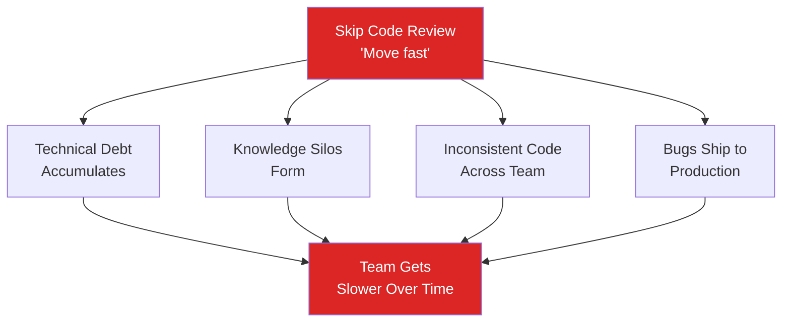
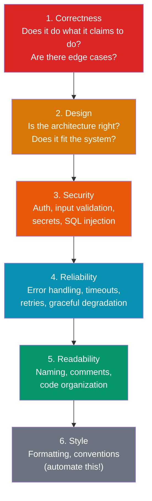
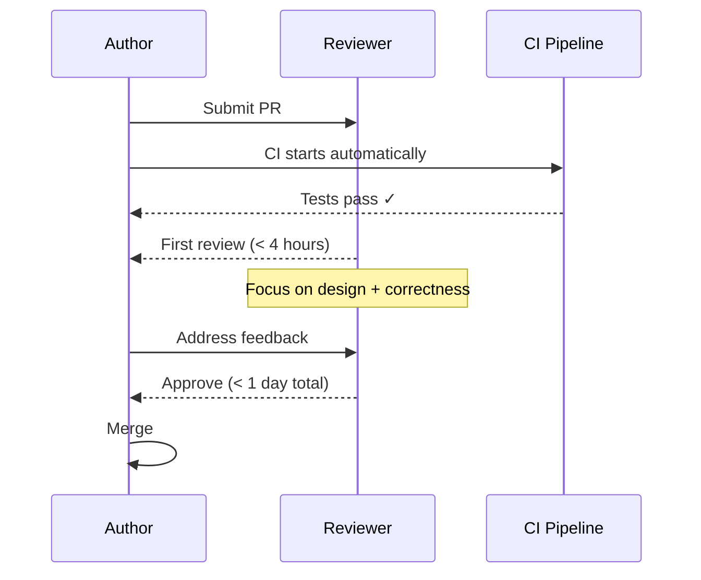

# Code Review Best Practices

Code review is the single most effective quality practice in software engineering. It is not primarily about catching bugs — automated tests do that better. Code review is about **knowledge sharing**, **design alignment**, and **maintaining a shared standard of quality** across a team. Google's research found that code review catches 15% of bugs but is responsible for 50% of knowledge transfer. At companies like Google, every change to the codebase is reviewed — no exceptions, no matter how senior the author. This page covers what to review, how to give feedback that lands, how to receive feedback without ego, and how to build a review culture that makes your team better.

## Why Code Review Matters

### The Benefits Stack

| Benefit | Impact | Mechanism |
|---------|--------|-----------|
| Knowledge sharing | Reduces bus factor | Reviewers learn the code and the domain |
| Design quality | Prevents architectural drift | Senior engineers catch design issues early |
| Code consistency | Maintainable codebase | Shared style and patterns enforced organically |
| Bug prevention | Catches logic errors | Fresh eyes see what the author cannot |
| Mentorship | Grows junior engineers | Reviews are a teaching opportunity |
| Security | Catches vulnerabilities | Second pair of eyes on auth, input validation, secrets |
| Documentation | Explains intent | Review comments and PR descriptions become documentation |

### The Cost of Skipping Reviews



## What to Look For

### The Review Hierarchy

Not all review feedback is equal. Prioritize your review effort:



### 1. Correctness

The most critical dimension. Ask yourself:

- Does this code actually solve the problem described in the PR?
- What happens with empty inputs, null values, zero-length arrays?
- What happens under concurrent access?
- Are boundary conditions handled (integer overflow, empty strings, max/min values)?
- Does the error handling cover all failure modes?

```python
# Example: a subtle correctness issue
def get_average(numbers: list[float]) -> float:
    return sum(numbers) / len(numbers)  # ZeroDivisionError when list is empty!

# Better
def get_average(numbers: list[float]) -> float | None:
    if not numbers:
        return None
    return sum(numbers) / len(numbers)
```

### 2. Design

Design review is the highest-value feedback a senior engineer can provide:

- Does this change belong in this service, or does it belong elsewhere?
- Is the abstraction at the right level? Too abstract? Not abstract enough?
- Does this introduce coupling between modules that should be independent?
- Will this design scale to 10x the current load?
- Is there an existing pattern in the codebase that should be used instead?

::: tip The Test of Design Quality
Ask: "If I needed to modify this code in 6 months, would I understand it? Would I know where to make the change? Would I be confident I did not break something else?"
:::

### 3. Security

Every code review is a security review. Check for:

| Vulnerability | What to Look For |
|--------------|-----------------|
| SQL injection | Raw string concatenation in queries instead of parameterized queries |
| XSS | User input rendered without escaping |
| Auth bypass | Missing authentication or authorization checks on new endpoints |
| Secret exposure | API keys, passwords, tokens in code or config files |
| IDOR | Direct object reference without ownership check (`/users/{id}` without verifying the caller owns that ID) |
| Mass assignment | Accepting all fields from request body without allowlisting |
| Path traversal | User input in file paths without sanitization |
| SSRF | User-controlled URLs in server-side HTTP requests |

```go
// BAD: SQL injection vulnerability
query := fmt.Sprintf("SELECT * FROM users WHERE id = '%s'", userID)
db.Query(query)

// GOOD: Parameterized query
db.Query("SELECT * FROM users WHERE id = $1", userID)
```

### 4. Reliability

Production systems fail. Review for resilience:

- Are network calls wrapped with timeouts?
- Is there retry logic with exponential backoff for transient failures?
- Are database connections returned to the pool on error?
- What happens when a downstream service is unavailable?
- Are file handles and resources properly closed in error paths?

### 5. Readability

Code is read 10x more often than it is written. Readability directly affects maintainability:

- Are variable and function names self-explanatory?
- Are complex algorithms explained with comments?
- Is the code organized in a logical flow?
- Can you understand the function without reading its implementation?
- Are there magic numbers that should be named constants?

```typescript
// BAD: What does 86400000 mean?
if (Date.now() - user.lastLogin > 86400000) {
  forceReauth();
}

// GOOD: Self-documenting
const ONE_DAY_MS = 24 * 60 * 60 * 1000;
if (Date.now() - user.lastLogin > ONE_DAY_MS) {
  forceReauth();
}
```

### 6. Style

Style issues (formatting, import order, bracket placement) should be **automated**, not reviewed by humans. Configure your CI to enforce style:

| Language | Formatter | Linter |
|----------|-----------|--------|
| Go | `gofmt` / `goimports` | `golangci-lint` |
| Python | `black` / `ruff format` | `ruff` |
| TypeScript | `prettier` | `eslint` |
| Rust | `rustfmt` | `clippy` |
| Java | `google-java-format` | `errorprone` |

::: warning Do Not Review What Machines Can Check
If you are writing comments about formatting, indentation, or import order, your CI pipeline is missing a step. Automate style enforcement and spend your human review time on design, correctness, and security.
:::

## Review Size and Speed

### Keep PRs Small

Google's research shows that review quality degrades sharply with PR size:

| Lines Changed | Defect Detection Rate | Review Time |
|--------------|----------------------|-------------|
| < 100 lines | ~70% | 15-30 minutes |
| 100-300 lines | ~50% | 30-60 minutes |
| 300-500 lines | ~30% | 1-2 hours |
| 500+ lines | ~15% | "LGTM" (rubber stamp) |

The ideal PR is **100-300 lines of meaningful changes** (excluding generated code, tests, and config files).

### Strategies for Small PRs

1. **Stacked PRs:** Break a feature into layers (data model, business logic, API endpoint, UI) and submit each as a separate PR
2. **Feature flags:** Ship incomplete features behind flags, so each PR is independently deployable
3. **Refactor first:** If your change requires refactoring existing code, submit the refactoring as a separate PR first
4. **Tests separately:** If the test suite is large, submit tests in their own PR (or alongside the code they test, but separate from unrelated changes)

### Review Speed

Slow reviews are a productivity killer. If a PR waits 2 days for review, the author has context-switched to another task and must re-load context when review comments arrive.

**Target review turnaround times:**

| Team Size | Target First Response | Target Approval |
|-----------|----------------------|----------------|
| Small (2-5) | < 4 hours | < 1 business day |
| Medium (5-15) | < 8 hours | < 1 business day |
| Large (15+) | < 1 business day | < 2 business days |



## Giving Feedback

### The Comment Spectrum

Not all review comments carry the same weight. Make your intent clear:

| Prefix | Meaning | Action Required |
|--------|---------|-----------------|
| **blocker:** | This must be fixed before merging | Yes — cannot merge without addressing |
| **suggestion:** | This would be better, but current code is acceptable | Author's discretion |
| **nit:** | Minor stylistic preference, completely optional | No — do not block on nits |
| **question:** | I do not understand this — can you explain? | Clarification needed, not necessarily a change |
| **praise:** | This is really well done | None — positive reinforcement |

### Writing Good Comments

**Be specific.** Do not say "this could be better." Say what is wrong and suggest a fix:

```markdown
<!-- BAD -->
This function is confusing.

<!-- GOOD -->
suggestion: This function does three things: validates input, fetches from the
database, and transforms the response. Consider splitting it into three functions
so each can be tested independently. Something like:

```python
def validate_order(request: OrderRequest) -> ValidatedOrder: ...
def fetch_inventory(product_ids: list[str]) -> dict[str, int]: ...
def build_response(order: ValidatedOrder, inventory: dict) -> OrderResponse: ...
```​
```

**Explain why.** The author knows what their code does. Tell them what they might not see:

```markdown
<!-- BAD -->
Add a timeout here.

<!-- GOOD -->
blocker: This HTTP call has no timeout. If the payment service hangs, this
handler will hold a connection indefinitely. Under load, we'll exhaust the
connection pool and the entire service becomes unresponsive. See last month's
incident: [link to postmortem]. Suggest adding a 5-second timeout.
```

**Ask questions instead of making demands.** Questions are less confrontational and often reveal context you are missing:

```markdown
<!-- CONFRONTATIONAL -->
This should use a transaction.

<!-- COLLABORATIVE -->
question: What happens if the INSERT succeeds but the UPDATE fails? Should
these be in a transaction to maintain consistency?
```

### Praise Good Work

Review is not just about finding problems. Call out good code:

```markdown
praise: Really clean use of the strategy pattern here. The way you've separated
the pricing logic by customer tier makes it trivial to add new tiers later. 👍
```

Praise reinforces good patterns and makes the review process feel collaborative rather than adversarial.

## Receiving Feedback

### The Mindset

The code is not you. A critique of your code is not a critique of your intelligence. The goal is to ship the best possible code, and the reviewer is helping you do that.

### Responding to Feedback

| Situation | Good Response | Bad Response |
|-----------|--------------|-------------|
| Reviewer is right | "Good catch, fixed." | Silently fixing without acknowledging |
| You disagree | "I considered that, but chose X because [reason]. What do you think?" | "No." / Ignoring the comment |
| Comment is unclear | "Can you clarify what you mean? I'm not sure I follow." | Guessing and making the wrong change |
| Reviewer is wrong | "Actually, this is handled by [mechanism] on line 42. Let me add a comment to make this clearer." | "You clearly didn't read the code." |
| You do not understand | "I don't have experience with this pattern. Could you point me to an example?" | Pretending to understand and making a random change |

### When to Push Back

You should push back on review feedback when:

- The suggestion would make the code objectively worse (over-engineering, premature optimization)
- The reviewer is imposing personal style preferences that are not team conventions
- The suggestion is out of scope for this PR (can be filed as a follow-up)
- You have context the reviewer does not (explain the context)

Push back with data and reasoning, not emotion. If you and the reviewer cannot agree, escalate to a third reviewer or tech lead.

## Automated Checks

Automate everything that does not require human judgment:

```yaml
# GitHub Actions CI pipeline for automated review checks
name: PR Checks
on: [pull_request]

jobs:
  lint:
    runs-on: ubuntu-latest
    steps:
      - uses: actions/checkout@v4
      - run: npm run lint          # Style and linting
      - run: npm run type-check    # TypeScript type checking

  test:
    runs-on: ubuntu-latest
    steps:
      - uses: actions/checkout@v4
      - run: npm test -- --coverage
      - uses: codecov/codecov-action@v4  # Coverage report on PR

  security:
    runs-on: ubuntu-latest
    steps:
      - uses: actions/checkout@v4
      - run: npm audit              # Dependency vulnerabilities
      - uses: github/codeql-action/analyze@v3  # Static analysis

  size:
    runs-on: ubuntu-latest
    steps:
      - uses: actions/checkout@v4
      - uses: matchai/pr-size-labeler@v1  # Label PRs by size (XS, S, M, L, XL)
```

### What to Automate

| Check | Tool | Blocks Merge? |
|-------|------|---------------|
| Formatting | prettier, black, gofmt | Yes |
| Linting | eslint, ruff, golangci-lint | Yes |
| Type checking | tsc, mypy, go vet | Yes |
| Tests | jest, pytest, go test | Yes |
| Coverage threshold | codecov, coveralls | Yes (e.g., must be > 80%) |
| Security scanning | CodeQL, Snyk, trivy | Yes for critical/high |
| PR size labeling | pr-size-labeler | No (informational) |
| Dependency updates | Dependabot, Renovate | No (auto-PR) |
| Dead code detection | ts-prune, vulture | No (warning) |

## Google's Code Review Guidelines

Google's code review practices are documented publicly and represent decades of refinement at massive scale. Key principles:

### The Standard of Code Review

> "The primary purpose of code review is to make sure that the overall code health of Google's code base is improving over time."

A reviewer should approve a change if it **definitely improves** the overall code health of the system, even if the change is not perfect. There is no such thing as "perfect" code — there is only better code.

### The CL Author's Guide (CL = "changelist", Google's term for PR)

1. **Write a good PR description.** The first line is the "what" (short summary). The body is the "why" (motivation, context, trade-offs).
2. **Small CLs.** Google's strongest advice: keep changes small. Reviewers are more thorough, reviews are faster, and merges cause fewer conflicts.
3. **Separate refactoring from behavior changes.** A refactoring PR should not change behavior. A behavior change should not include refactoring. This makes both easier to review and safer to merge.

### The Reviewer's Guide

1. **Be kind.** The most important rule. Comments about code, not about people.
2. **Explain your reasoning.** Do not just say "no." Explain why, and ideally suggest an alternative.
3. **Balance speed with thoroughness.** A slow review that is thorough is worse than a fast review that catches the important issues. You do not need to find every problem — the most important issues are design and correctness.
4. **Approve with comments.** If you have minor nits but the overall change is good, approve and leave the nits as optional suggestions. Do not block on trivia.

## Building a Review Culture

### Team Agreements

Establish explicit agreements about code review practices:

```markdown
## Our Code Review Agreement

1. **Turnaround:** First review within 4 business hours
2. **Size:** PRs should be < 300 lines of logic changes
3. **Automated:** Formatting, linting, and tests run in CI — do not review these manually
4. **Prefixes:** Use blocker/suggestion/nit/question/praise prefixes
5. **Approval:** One approval required for most changes; two for security-sensitive changes
6. **Self-review:** Authors self-review their PR before requesting review
7. **Draft PRs:** Use draft PRs for early feedback on design direction
8. **Follow-ups:** File follow-up issues for out-of-scope improvements, do not block the PR
```

### Metrics to Track

| Metric | Target | Why |
|--------|--------|-----|
| Time to first review | < 4 hours | Fast feedback prevents context-switching |
| Time to merge | < 1 business day | Keeps PRs from going stale |
| Review rounds | < 3 | More rounds = unclear expectations or too-large PRs |
| PR size (median) | < 200 lines | Smaller PRs get better reviews |
| Review participation | All team members review | Prevents knowledge silos |

## Further Reading

- [Technical Writing for Engineers](/devops/engineering-practices/technical-writing) — writing effective PR descriptions and review comments
- [Architecture Decision Records](/devops/engineering-practices/architecture-decision-records) — documenting the design decisions that emerge from code review discussions
- [CI/CD Pipeline Patterns](/infrastructure/ci-cd/pipeline-patterns) — automating the checks that should not be done manually in review
- [Security Scanning](/infrastructure/ci-cd/security-scanning) — automated security checks that complement human review
- [On-Call Handbook](/devops/engineering-practices/on-call-handbook) — code review as a prevention mechanism for incidents
