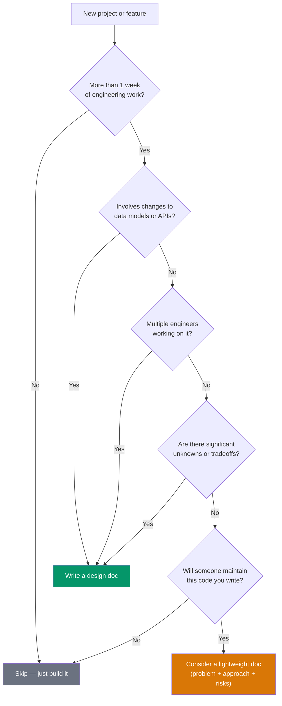
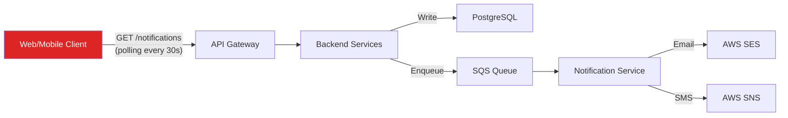
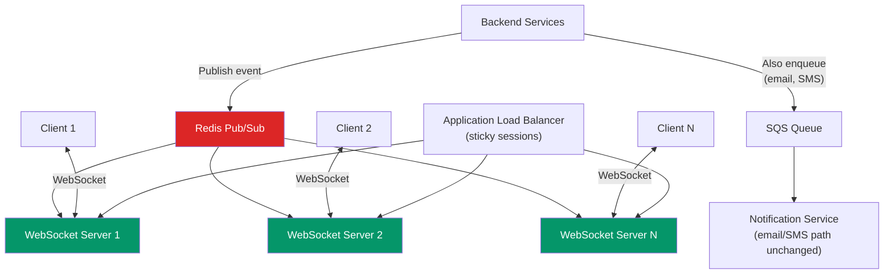

# Design Document Template

A design document is your team's plan for building something non-trivial. Unlike an RFC (which proposes a change for organizational approval), a design doc is an implementation plan written for your team. It ensures everyone understands the approach, surfaces problems before they become code, and serves as a reference throughout development.

## When to Write a Design Doc



### Design Doc vs RFC

| Aspect | Design Doc | RFC |
|--------|-----------|-----|
| **Scope** | Single team | Cross-team |
| **Audience** | Your team + adjacent teams | Engineering org |
| **Purpose** | Plan the implementation | Propose and get approval |
| **Approval needed** | Tech lead / manager | Architecture review or VP |
| **Typical length** | 2-5 pages | 2-4 pages |
| **When to write** | After the approach is approved | Before any approach is chosen |

::: tip The Design Doc Is a Thinking Tool
The primary value of a design doc is not the document itself — it is the process of writing it. Writing forces you to confront gaps in your understanding, resolve ambiguities, and surface risks you would otherwise discover in production.
:::

---

## Design Document Template

````markdown
# Design Doc: [Feature/Project Name]

**Author(s):** [Names]
**Reviewers:** [Names]
**Created:** [Date]
**Last Updated:** [Date]
**Status:** Draft | In Review | Approved | Implemented | Deprecated

---

## 1. Problem Statement

What problem are we solving? Write this from the user's or system's
perspective, not from a technical perspective.

- Who is affected?
- How often does this problem occur?
- What is the impact? (quantify if possible)

## 2. Goals

What must this project accomplish to be considered successful?

- [ ] Goal 1 (measurable)
- [ ] Goal 2 (measurable)
- [ ] Goal 3 (measurable)

## 3. Non-Goals

What are we explicitly NOT solving? This prevents scope creep.

- Non-goal 1: Why it is out of scope
- Non-goal 2: Why it is out of scope

## 4. Background & Context

Relevant information the reader needs to understand the proposal:
- Current system architecture (diagram)
- Prior work or related systems
- Constraints (time, budget, team size, existing contracts)

## 5. Proposed Design

### 5.1 Architecture Overview

High-level architecture diagram showing major components and their
interactions.

### 5.2 API Design

Request/response formats for new or changed APIs.

### 5.3 Data Model

Schema changes, new tables, data flow.

### 5.4 Key Algorithms or Logic

Non-obvious logic that needs documentation.

### 5.5 Error Handling

How will errors propagate? What are the failure modes?

### 5.6 Security Considerations

Authentication, authorization, input validation, data privacy.

### 5.7 Observability

Logging, metrics, alerts, dashboards.

## 6. Alternatives Considered

### Alternative A: [Name]
- What it is
- Why we did not choose it

### Alternative B: [Name]
- What it is
- Why we did not choose it

## 7. Risks

| Risk | Likelihood | Impact | Mitigation |
|------|-----------|--------|------------|
| Risk 1 | Low/Med/High | Low/Med/High | Plan |

## 8. Milestones & Timeline

| Milestone | Deliverable | Target Date | Owner |
|-----------|-------------|-------------|-------|
| M1 | What is delivered | Date | Who |
| M2 | What is delivered | Date | Who |

## 9. Testing Strategy

- Unit tests: What is covered
- Integration tests: What interfaces are tested
- Load/performance tests: Expected load, target latency
- Rollout: Feature flag, canary, blue-green

## 10. Open Questions

- [ ] Question 1 (blocking)
- [ ] Question 2 (non-blocking)
````

---

## Real Example: Add Real-Time Notifications to the Platform

### Design Doc: Real-Time Notifications

**Author:** Marcus Rivera (Senior Engineer, Product Platform)
**Reviewers:** Platform team, Mobile team, Frontend team
**Created:** 2026-02-10
**Status:** Approved

---

#### 1. Problem Statement

Users currently have no way to know about important events (new messages, order updates, payment confirmations) without refreshing the page or reopening the app. Our user research shows that 67% of users check the app multiple times waiting for updates, and 23% reported missing time-sensitive notifications because they were not in the app.

#### 2. Goals

- Deliver notifications to connected web and mobile clients within 2 seconds of the triggering event
- Support 100K concurrent WebSocket connections per region
- Achieve 99.9% delivery rate for connected clients
- Integrate with existing notification preferences (users can mute specific notification types)

#### 3. Non-Goals

- Push notifications for native mobile apps (separate project, uses Firebase/APNs)
- Email or SMS notifications (already handled by the notification service)
- Real-time chat between users (future project, different requirements)
- Offline notification queuing (if user is not connected, they see notifications on next page load via REST)

#### 4. Background & Context

**Current architecture:**



The current polling approach generates 3.2M requests per minute to the notifications endpoint. 98% of these return empty results. This wastes compute, adds latency to other endpoints, and provides a poor user experience (up to 30 second delay).

#### 5. Proposed Design

##### 5.1 Architecture Overview



**Why Redis Pub/Sub?**
- WebSocket servers are horizontally scaled — a user connected to Server 1 needs to receive events published by a service that talks to Server 2.
- Redis Pub/Sub fans out events to all WebSocket servers. Each server checks if the target user is connected and delivers the message.
- For our scale (100K connections), Redis Pub/Sub is sufficient. At larger scale (1M+), we would consider Kafka or NATS.

##### 5.2 API Design

**WebSocket Connection:**

```
wss://api.example.com/ws/notifications
Authorization: Bearer <jwt_token>
```

**Server → Client messages:**

```json
{
  "type": "notification",
  "data": {
    "id": "notif_abc123",
    "category": "order_update",
    "title": "Your order has shipped",
    "body": "Order #1234 is on its way",
    "action_url": "/orders/1234",
    "created_at": "2026-02-10T14:30:00Z",
    "read": false
  }
}
```

**Client → Server messages:**

```json
{
  "type": "mark_read",
  "notification_id": "notif_abc123"
}
```

```json
{
  "type": "ping"
}
```

##### 5.3 Data Model

```sql
CREATE TABLE notifications (
    id          UUID PRIMARY KEY DEFAULT gen_random_uuid(),
    user_id     UUID NOT NULL REFERENCES users(id),
    category    VARCHAR(50) NOT NULL,
    title       VARCHAR(255) NOT NULL,
    body        TEXT,
    action_url  VARCHAR(500),
    read_at     TIMESTAMPTZ,
    created_at  TIMESTAMPTZ NOT NULL DEFAULT NOW(),
    expires_at  TIMESTAMPTZ
);

CREATE INDEX idx_notifications_user_unread
    ON notifications (user_id, created_at DESC)
    WHERE read_at IS NULL;

-- Notification preferences (existing table, new column)
ALTER TABLE notification_preferences
    ADD COLUMN realtime_enabled BOOLEAN NOT NULL DEFAULT TRUE;
```

##### 5.4 Key Logic: Connection Management

```typescript
class WebSocketManager {
  // Map of userId -> Set of WebSocket connections
  // (user may have multiple tabs/devices)
  private connections = new Map<string, Set<WebSocket>>();

  addConnection(userId: string, ws: WebSocket): void {
    if (!this.connections.has(userId)) {
      this.connections.set(userId, new Set());
    }
    this.connections.get(userId)!.add(ws);
  }

  removeConnection(userId: string, ws: WebSocket): void {
    const userConnections = this.connections.get(userId);
    if (userConnections) {
      userConnections.delete(ws);
      if (userConnections.size === 0) {
        this.connections.delete(userId);
      }
    }
  }

  async deliverToUser(userId: string, message: object): Promise<void> {
    const userConnections = this.connections.get(userId);
    if (!userConnections) return; // User not connected to this server

    const payload = JSON.stringify(message);
    const deadConnections: WebSocket[] = [];

    for (const ws of userConnections) {
      if (ws.readyState === WebSocket.OPEN) {
        ws.send(payload);
      } else {
        deadConnections.push(ws);
      }
    }

    // Clean up dead connections
    for (const ws of deadConnections) {
      this.removeConnection(userId, ws);
    }
  }
}
```

##### 5.5 Error Handling

| Failure Mode | Detection | Response |
|-------------|-----------|----------|
| WebSocket disconnect | `close` event | Client auto-reconnects with exponential backoff (1s, 2s, 4s, max 30s) |
| Redis Pub/Sub failure | Health check, connection error | WebSocket servers fall back to polling Redis every 1s. Alert on-call. |
| WebSocket server crash | ALB health check | ALB removes server. Clients reconnect to healthy server. |
| Message delivery failure | Delivery confirmation timeout | Message persisted in DB. Client fetches missed messages on reconnect via REST. |

##### 5.6 Security Considerations

- WebSocket connections authenticated via JWT in the initial HTTP upgrade request
- Tokens validated on connection and periodically (every 15 minutes) — expired tokens force disconnect
- Rate limiting: max 10 client messages per second per connection
- Input validation: all client messages validated against schema before processing
- No sensitive data in notification payloads — use action URLs that require authentication

##### 5.7 Observability

| Metric | Type | Alert Threshold |
|--------|------|----------------|
| `ws.connections.active` | Gauge | >80% capacity per server |
| `ws.messages.delivered` | Counter | <95% delivery rate |
| `ws.latency.delivery_ms` | Histogram | P99 >5s |
| `ws.connections.errors` | Counter | >100/min |
| `redis.pubsub.lag_ms` | Gauge | >1000ms |

#### 6. Alternatives Considered

| Alternative | Pros | Cons | Why Not |
|-------------|------|------|---------|
| **Server-Sent Events (SSE)** | Simpler than WebSocket, built-in reconnection | Unidirectional (server → client only), no `mark_read` from client | Need bidirectional communication for read receipts |
| **Long polling** | Works everywhere, simpler infrastructure | Higher latency (seconds), more server resources per connection | Defeats the purpose of real-time |
| **Firebase Realtime Database** | Zero infrastructure to manage | Vendor lock-in, per-connection pricing at scale, data residency concerns | Cost at 100K connections, data must stay in our infrastructure |
| **Kafka for fan-out** | Higher throughput, persistence | Overkill for our scale, more complex to operate | Redis Pub/Sub is sufficient for 100K connections. Migrate to Kafka if we reach 1M+. |

#### 7. Risks

| Risk | Likelihood | Impact | Mitigation |
|------|-----------|--------|------------|
| Memory pressure from 100K connections | Medium | High | Load test at 2x expected connections. Set per-server connection limit. Auto-scale WebSocket fleet. |
| Redis becomes single point of failure | Low | High | Redis Sentinel for automatic failover. Alert on replication lag. |
| Client reconnection storms after deploy | Medium | Medium | Stagger server restarts. Add jitter to client reconnection backoff. |
| WebSocket blocked by corporate proxies | Low | Low | Fall back to long polling if WebSocket upgrade fails. |

#### 8. Milestones & Timeline

| Milestone | Deliverable | Target | Owner |
|-----------|-------------|--------|-------|
| M1: Foundation | WebSocket server, Redis Pub/Sub integration, connection management | Week 1-2 | Marcus |
| M2: Backend integration | Event publishing from order, payment, message services | Week 2-3 | Marcus + Service owners |
| M3: Frontend integration | WebSocket client, notification UI, reconnection logic | Week 2-4 | Sarah (Frontend) |
| M4: Load testing | Verify 100K connections, measure latency under load | Week 4 | Marcus + Platform |
| M5: Rollout | Feature flag rollout: 5% → 25% → 100% | Week 5-6 | Marcus |

#### 9. Testing Strategy

- **Unit tests**: WebSocket manager, message serialization, auth validation
- **Integration tests**: End-to-end flow: service publishes event → user receives WebSocket message
- **Load test**: Simulate 100K concurrent connections using Artillery or k6. Measure delivery latency at P50, P95, P99.
- **Chaos test**: Kill a WebSocket server mid-session. Verify clients reconnect and receive missed messages.
- **Rollout**: Feature flag. Start at 5% of users. Monitor error rates and latency for 48 hours before increasing.

#### 10. Open Questions

- [x] ~~Should we support notification grouping (collapsing 10 "new message" notifications)?~~ **Decision: Not in v1. Add as a follow-up if users request it.**
- [x] ~~What is the maximum notification retention period?~~ **Decision: 90 days, then auto-delete.**
- [ ] Should we add read receipts for cross-device sync? (Non-blocking — can add later)

---

## Design Doc Review Checklist

Before submitting your design doc for review, verify:

| Check | Question |
|-------|----------|
| **Problem** | Is the problem clearly stated with data? |
| **Goals** | Are goals measurable? Can someone verify "done"? |
| **Non-goals** | Are boundaries clear? Will reviewers ask "but what about X?" |
| **Diagram** | Is there at least one architecture diagram? |
| **API** | Are request/response examples included for new APIs? |
| **Data model** | Are schema changes documented? |
| **Error handling** | What happens when things fail? |
| **Security** | Are auth, authz, and input validation addressed? |
| **Observability** | What metrics and alerts will exist? |
| **Alternatives** | Did you consider at least 2 alternatives? |
| **Risks** | Are risks identified with mitigations? |
| **Timeline** | Is there a phased rollout plan? |

---

## Related Pages

- [RFC Template & Guide](/devops/engineering-practices/rfc-template) — For cross-team proposals
- [Architecture Decision Records](/devops/engineering-practices/architecture-decision-records) — Recording decisions
- [Technical Leadership](/devops/engineering-practices/technical-leadership) — Leading through design
- [Code Review Best Practices](/devops/engineering-practices/code-review) — Reviewing implementations
