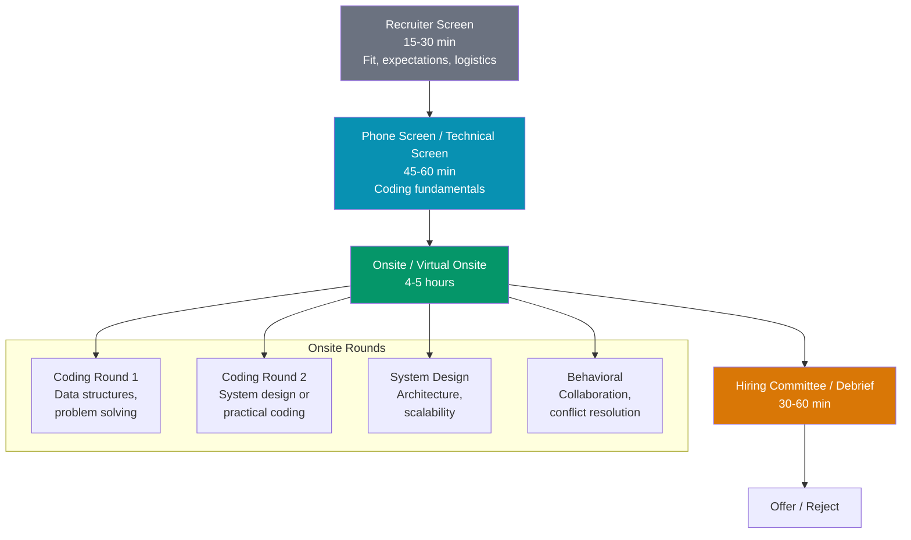
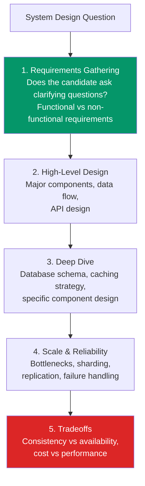
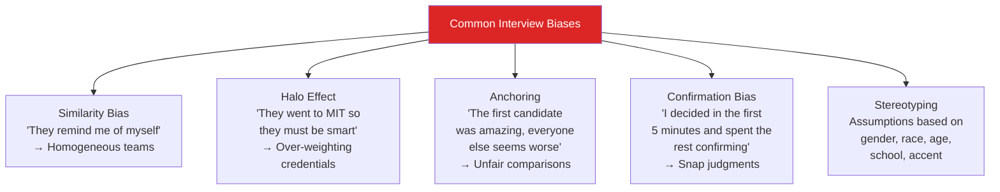
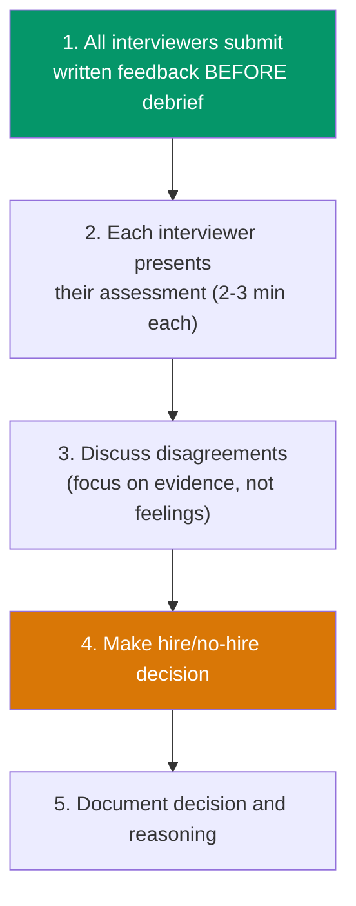
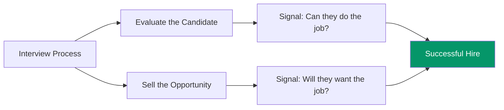

# Hiring: How to Interview Others

Most engineers are never taught how to interview. They get pulled into a panel, ask whatever comes to mind, and make a gut-feel decision. This leads to inconsistent evaluations, biased outcomes, and missed talent. This page covers how to design interview loops, write questions that actually predict job performance, evaluate candidates consistently, and make the hire when you find the right person.

## Designing an Interview Loop

### The Full Loop Structure

A well-designed interview loop has distinct stages, each testing different competencies. No single stage should try to evaluate everything.



### What Each Stage Tests

| Stage | Duration | Evaluates | Signal For |
|-------|----------|-----------|------------|
| **Recruiter Screen** | 15-30 min | Communication, motivation, salary/timeline alignment | Culture fit, logistics |
| **Phone Screen** | 45-60 min | Can they write working code? Basic problem solving | Minimum technical bar |
| **Coding (Onsite)** | 45-60 min each | Algorithms, data structures, code quality, testing | Engineering fundamentals |
| **System Design** | 45-60 min | Architecture, scalability, tradeoff reasoning | Senior-level thinking |
| **Behavioral** | 45-60 min | Collaboration, conflict, growth mindset, ownership | Team fit, leadership |

::: tip Tailor the Loop to the Level
- **Junior**: 2 coding rounds + 1 behavioral. Skip system design.
- **Mid-level**: 2 coding rounds + 1 system design + 1 behavioral.
- **Senior**: 1 coding round + 1 system design + 1 architecture deep dive + 1 behavioral.
- **Staff+**: 1 coding round + 1 system design + 1 technical vision/strategy + 1 behavioral/leadership.
:::

---

## Writing Good Interview Questions

### Criteria for Good Questions

| Criterion | Description | Bad Example | Good Example |
|-----------|-------------|-------------|--------------|
| **Relevant** | Tests skills used on the job | "Implement a red-black tree" | "Design a rate limiter" |
| **Calibrated** | Known difficulty, known time to solve | Random LeetCode hard | Question you have tested with 10+ candidates |
| **Layered** | Can be made easier or harder via follow-ups | Single right answer | Base case + optimizations + edge cases |
| **Observable** | Reveals the candidate's thinking process | "What is the output of this code?" | "Walk me through how you would approach this" |
| **Equitable** | Does not favor specific backgrounds | "Implement the Sieve of Eratosthenes" | "Find all pairs that sum to a target" |

### Coding Question Design Template

```markdown
## Question: [Title]

### Setup (read to candidate)
- Problem description (2-3 sentences)
- Input/output format
- 1-2 examples

### Hints (if stuck)
- Hint 1: [After 5 min with no progress]
- Hint 2: [After 10 min, still stuck on approach]
- Hint 3: [Almost there, minor issue]

### Expected solutions
- Brute force: O(n^2) — acceptable for junior
- Optimal: O(n) — expected for mid/senior

### Follow-ups
1. What if the input doesn't fit in memory?
2. What if we need to handle concurrent requests?
3. How would you test this?

### Scoring Guide
- Strong No: Cannot solve even with significant hints
- No: Solves brute force only, poor code quality
- Yes: Solves optimally, clean code, handles edge cases
- Strong Yes: Solves quickly, discusses tradeoffs, adds tests
```

### System Design Question Design



**Good system design questions for different levels:**

| Level | Question | Tests |
|-------|----------|-------|
| Mid | Design a URL shortener | Basic distributed systems, database design |
| Senior | Design a notification system | Event-driven architecture, queuing, at-least-once delivery |
| Staff | Design the backend for a collaborative document editor | Real-time sync (CRDTs/OT), conflict resolution, operational complexity |

---

## Rubrics and Scorecards

### Why Rubrics Matter

Without rubrics, two interviewers evaluating the same candidate can reach opposite conclusions. Rubrics define what "good" looks like, making evaluations consistent and defensible.

### Coding Interview Rubric

| Dimension | Strong No (1) | No (2) | Yes (3) | Strong Yes (4) |
|-----------|---------------|--------|---------|----------------|
| **Problem Solving** | Cannot break down the problem. No progress after hints. | Needs significant hints. Gets to brute force. | Identifies approach independently. Reaches optimal solution. | Identifies approach quickly. Discusses multiple approaches and tradeoffs. |
| **Code Quality** | Code does not compile. Major logical errors. | Works for happy path. Messy structure. | Clean, readable code. Handles edge cases. | Production-quality code. Good naming, modular functions, defensive checks. |
| **Communication** | Silent or incoherent. Cannot explain thinking. | Explains only when asked. Vague reasoning. | Thinks aloud naturally. Clear explanations. | Excellent communication. Checks in with interviewer. Collaborative. |
| **Testing** | Does not mention testing. | Tests happy path only when prompted. | Identifies edge cases. Writes test cases. | Proactively writes tests. Discusses testing strategy. |
| **Technical Depth** | Does not know language fundamentals. | Knows syntax but not idioms. | Fluent in language. Knows standard library. | Deep knowledge. Discusses runtime, memory, and tradeoffs. |

### System Design Rubric

| Dimension | Strong No (1) | No (2) | Yes (3) | Strong Yes (4) |
|-----------|---------------|--------|---------|----------------|
| **Requirements** | Dives into solution without asking questions. | Asks some questions but misses key requirements. | Asks good clarifying questions. Distinguishes functional/non-functional. | Identifies edge cases in requirements. Prioritizes effectively. |
| **Architecture** | No coherent design. Missing major components. | Basic design but missing critical components (caching, queuing). | Complete design with appropriate components. | Elegant design. Components are well-justified. |
| **Scalability** | Does not mention scale. | Mentions scale but no concrete approach. | Identifies bottlenecks and proposes solutions (sharding, caching, CDN). | Quantitative analysis. Back-of-envelope calculations. |
| **Tradeoffs** | Makes choices without justification. | Acknowledges tradeoffs when prompted. | Proactively discusses tradeoffs. Considers alternatives. | Deep tradeoff analysis. Understands second-order effects. |

### Behavioral Interview Rubric

| Dimension | Strong No (1) | No (2) | Yes (3) | Strong Yes (4) |
|-----------|---------------|--------|---------|----------------|
| **Ownership** | Blames others. No accountability. | Takes some ownership. Mostly describes others' actions. | Owns outcomes. Describes their specific contributions. | Takes ownership even when things go wrong. Learns and improves. |
| **Collaboration** | Describes solo work only. | Works with team but does not actively improve dynamics. | Actively helps others. Seeks feedback. | Elevates the entire team. Mentors others. Resolves conflicts constructively. |
| **Growth Mindset** | Defensive about mistakes. | Acknowledges mistakes but vague about learning. | Gives specific examples of learning from failure. | Systematic improvement. Shares learnings with the team. |

---

## Reducing Bias in Interviews

### Known Biases in Technical Hiring



### Mitigation Strategies

| Bias | Mitigation |
|------|------------|
| **Similarity bias** | Use structured interviews with the same questions for all candidates. Focus on skills, not "culture fit." |
| **Halo effect** | Evaluate each interview dimension independently. Do not let one strong signal override weak ones. |
| **Anchoring** | Score candidates against the rubric, not against each other. |
| **Confirmation bias** | Write your evaluation immediately after the interview, before talking to other interviewers. |
| **Stereotyping** | Blind resume review. Structured evaluation criteria. Diverse interview panels. |

### Structured Interview Protocol

1. **Same questions for every candidate** at the same level and role
2. **Score against the rubric** (not against each other) before the debrief
3. **Write feedback independently** — do not discuss with other panelists first
4. **Evaluate dimensions separately** — do not let one dimension bleed into another
5. **Diverse interview panels** — at least 2 interviewers from different teams/backgrounds

::: danger "Culture Fit" Is Often Bias in Disguise
"Culture fit" is one of the most abused criteria in hiring. It often translates to "this person is similar to us." Replace "culture fit" with "culture add" — what perspectives, experiences, or skills does this person bring that we currently lack?
:::

---

## Calibration Sessions

### What Is Calibration?

Calibration aligns interviewers on what "good" looks like. Without calibration, one interviewer's "Strong Yes" is another's "Yes."

### Running a Calibration Session

| Step | Activity | Duration |
|------|----------|----------|
| 1 | Review the rubric together | 10 min |
| 2 | Watch a recorded mock interview (or review a detailed write-up) | 20 min |
| 3 | Each interviewer scores independently | 5 min |
| 4 | Compare scores and discuss disagreements | 20 min |
| 5 | Agree on the "correct" score and update rubric if needed | 5 min |

### Common Calibration Issues

| Issue | Resolution |
|-------|------------|
| "I gave a Strong Yes because they solved it fast" | Speed alone is not sufficient. Did they communicate? Handle edge cases? |
| "I gave a No because they needed one hint" | One hint is normal and expected. Multiple hints or fundamental misunderstanding is a No. |
| "Their code style was different from ours" | Do not penalize style differences. Evaluate correctness, readability, and maintainability. |
| "They did not use the optimal algorithm" | For junior/mid, brute force with clean code can be a Yes. For senior, optimal is expected. |

---

## The Hiring Committee / Debrief

### Debrief Structure



### Decision Framework

| Signal | Typical Outcome |
|--------|----------------|
| All Strong Yes / Yes | Strong hire |
| Mostly Yes, one No | Discuss the No — is the concern valid? Would the team compensate? |
| Mixed (Yes and No) | Default to No — ambivalence usually means no |
| Mostly No | Clear reject |
| All No | Immediate reject — do not waste candidate's time |

::: tip The Bar Raiser Model (Amazon)
Amazon includes a "Bar Raiser" — an experienced interviewer from a different team who has veto power. This prevents hiring managers from lowering the bar under pressure to fill a role. Consider appointing a similar role in your process.
:::

---

## Making the Pitch: Selling to Candidates

### The Best Candidates Have Options

If your interview process is one-directional (you evaluating them), you will lose top candidates to companies that also sold them. Every interview is a two-way evaluation.

### What Candidates Care About

| Factor | What to Communicate | How |
|--------|-------------------|-----|
| **Impact** | What they will build and why it matters | Describe the product, user base, scale |
| **Team** | Who they will work with | Introduce the team. Have 1-2 potential teammates in the loop. |
| **Growth** | How they will grow technically and career-wise | Discuss mentorship, learning budget, promotion process |
| **Culture** | How the team works day-to-day | Be honest about on-call, meeting culture, remote policy |
| **Compensation** | Total compensation (salary, equity, bonus) | Be transparent. Do not lowball. |
| **Technology** | Stack, tooling, engineering practices | Share your tech blog, open-source projects, tech talks |

### Selling Tactics by Interview Stage

| Stage | Tactic |
|-------|--------|
| **Recruiter screen** | Share exciting company mission and team impact |
| **Phone screen** | Interviewer shares what they personally enjoy about working there |
| **Onsite** | Lunch/coffee with a potential teammate (casual, no evaluation) |
| **Offer** | Hiring manager call explaining the role vision and first-quarter goals |
| **Close** | Connect them with an engineer who joined recently to share their experience |



---

## Interview Anti-Patterns

| Anti-Pattern | Problem | Fix |
|-------------|---------|-----|
| **Trivia questions** | Tests memorization, not ability | Ask them to solve a problem, not recall a fact |
| **Gotcha questions** | Designed to make candidates fail | Questions should have a discoverable path to the answer |
| **Whiteboard hazing** | Stressful environment, poor signal | Use a real IDE. Let them Google syntax. |
| **No rubric** | Every interviewer has different standards | Create and calibrate rubrics |
| **Marathon interviews** | 8+ hours exhausts candidates | Cap at 4-5 hours. Include breaks. |
| **Ghost candidates** | No feedback, no closure | Respond within 1 week. Provide brief, actionable feedback. |
| **Lowball offers** | Lose candidates to competitors | Research market rates. Offer fairly. |

---

## Related Pages

- [Technical Leadership](/devops/engineering-practices/technical-leadership) — Building influence as a senior IC
- [Code Review Best Practices](/devops/engineering-practices/code-review) — Evaluating code quality
- [Technical Writing](/devops/engineering-practices/technical-writing) — Writing clear evaluations and feedback
- [RFC Template](/devops/engineering-practices/rfc-template) — Structured decision-making
