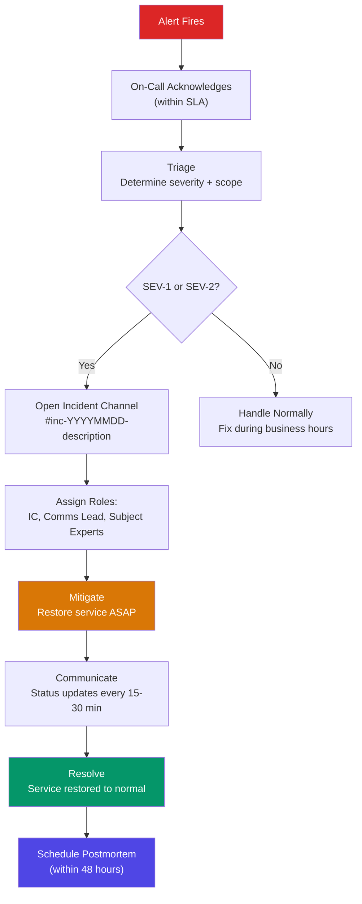
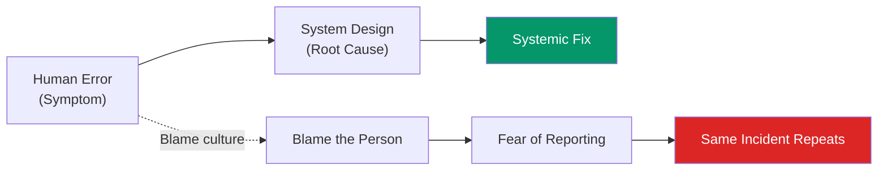
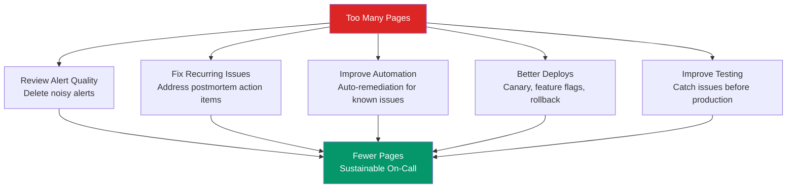

# On-Call Handbook

Being on-call is one of the most consequential responsibilities in engineering. When a production system breaks at 3 AM, the on-call engineer is the first line of defense between a minor blip and a catastrophic outage. Yet most teams throw engineers into on-call rotations with minimal preparation — no clear escalation paths, no severity definitions, no runbooks, and no support structure. The result is burned-out engineers, slow incident response, and recurring outages. This handbook defines what good on-call looks like: clear responsibilities, structured incident response, blameless postmortems, and sustainable rotation strategies that protect both the system and the people who run it.

## On-Call Responsibilities

### What On-Call Means

Being on-call means you are the **first responder** for production issues affecting your service or domain. Specifically:

| Responsibility | Details |
|---------------|---------|
| **Acknowledge alerts** | Respond to pages within the SLA (typically 5-15 minutes) |
| **Triage incidents** | Determine severity, scope, and initial impact |
| **Mitigate** | Take immediate action to reduce customer impact (rollback, scale up, disable feature) |
| **Escalate** | Pull in additional help when needed — do not be a hero |
| **Communicate** | Keep stakeholders informed via the incident channel |
| **Document** | Record actions taken during the incident for the postmortem |
| **Hand off** | Brief the next on-call engineer at rotation boundaries |

### What On-Call Does NOT Mean

- You are NOT expected to fix every issue yourself
- You are NOT expected to write code during an incident (mitigation first, fix later)
- You are NOT expected to be chained to your laptop — you need to be reachable and able to respond within the SLA
- You are NOT responsible for problems caused by other teams — but you ARE responsible for escalating to them

::: tip The First Rule of On-Call
**Mitigate first, investigate second.** The goal during an incident is to restore service, not to find the root cause. Roll back the deploy, scale up the cluster, toggle the feature flag. Root cause analysis happens in the postmortem, not at 3 AM.
:::

## Incident Response Process

### Severity Levels

Every incident must be classified by severity. The severity determines the response urgency, communication requirements, and escalation path:

| Severity | Name | Definition | Response SLA | Example |
|----------|------|-----------|-------------|---------|
| **SEV-1** | Critical | Complete service outage; data loss or corruption; security breach | 5 minutes acknowledge, 15 minutes response | Production database down, payment system broken, data breach |
| **SEV-2** | Major | Significant degradation; major feature unavailable; large subset of users affected | 15 minutes acknowledge, 30 minutes response | Search is down, checkout is intermittently failing, API latency > 10x normal |
| **SEV-3** | Minor | Minor degradation; workaround available; small subset of users affected | 30 minutes acknowledge, 2 hours response | Email notifications delayed, non-critical admin feature broken |
| **SEV-4** | Low | Cosmetic issue; no user impact; monitoring alert that needs attention | Next business day | Warning alert on disk usage trending up, non-production environment issue |

### Incident Response Flow



### Incident Roles

For SEV-1 and SEV-2 incidents, assign explicit roles:

| Role | Responsibility | Who |
|------|---------------|-----|
| **Incident Commander (IC)** | Owns the incident. Coordinates responders, makes decisions, controls the pace. Does NOT debug — they orchestrate. | Senior on-call or engineering manager |
| **Communications Lead** | Posts status updates to stakeholders, customers, status page. Shields responders from questions. | Product manager, engineering manager, or designated engineer |
| **Subject Matter Expert (SME)** | Debugs and mitigates the specific technical issue. The person with the deepest knowledge of the affected system. | Domain expert for the affected service |
| **Scribe** | Records timeline, actions taken, decisions made. This becomes the foundation for the postmortem. | Any available engineer |

::: warning The IC Does Not Debug
The most common incident anti-pattern is having the IC also be the primary debugger. The IC's job is to maintain situational awareness, coordinate multiple responders, and make escalation decisions. If the IC is deep in logs, nobody is coordinating.
:::

## Escalation Paths

### When to Escalate

Escalate when:
- You have been working on the issue for 15 minutes without progress
- The issue is outside your area of expertise
- The impact is growing (more users affected, more services failing)
- You need to make a decision with business impact (e.g., taking down a feature to protect the database)
- You are unsure of the severity

### Escalation Matrix

```markdown
## Escalation Contacts (Keep Updated!)

### Infrastructure
- Primary: @alice (Slack) / +1-555-0101
- Secondary: @bob (Slack) / +1-555-0102
- Manager: @charlie (Slack) / +1-555-0103

### Database
- Primary: @dave (Slack) / +1-555-0201
- Secondary: @eve (Slack) / +1-555-0202
- DBA on-call: PagerDuty "Database" service

### Security (always escalate immediately for security incidents)
- Security on-call: PagerDuty "Security" service
- CISO: @frank (Slack) / +1-555-0301

### Executive (SEV-1 only)
- VP Engineering: @grace (Slack) / +1-555-0401
- CTO: @heidi (Slack) / +1-555-0501
```

### Escalation is NOT Failure

One of the most damaging on-call cultural norms is treating escalation as weakness. Escalation is the correct response when you need help. An engineer who spends 2 hours struggling alone when a 5-minute escalation would have resolved the issue has cost the company 2 hours of downtime.

## Communication Templates

### Incident Channel Opening

```markdown
:rotating_light: **INCIDENT — SEV-2: Checkout API returning 500 errors**

**Impact:** ~30% of checkout attempts are failing. Revenue impact estimated.
**Start time:** 2026-03-20 14:32 UTC
**IC:** @alice
**Comms:** @bob
**Channel:** #inc-20260320-checkout-500s

**Current status:** Investigating. Initial evidence suggests recent deploy
(v2.14.3, deployed at 14:15 UTC) may be the cause. Evaluating rollback.

Next update in 15 minutes.
```

### Status Update

```markdown
:hourglass: **UPDATE — SEV-2: Checkout API returning 500 errors**
**Time:** 2026-03-20 14:47 UTC

**What we know:**
- Root cause identified: v2.14.3 introduced a query that deadlocks under
  concurrent checkout requests
- Rollback to v2.14.2 initiated at 14:42 UTC
- Rollback deployment is in progress (ETA: 5 minutes)

**What we're doing:**
- Monitoring error rates during rollback
- Scaling up checkout service replicas to handle queued requests

**Customer impact:** Error rate has decreased from 30% to 15% as old pods
are replaced. Full recovery expected within 10 minutes.

Next update in 15 minutes or when resolved.
```

### Resolution Message

```markdown
:white_check_mark: **RESOLVED — SEV-2: Checkout API returning 500 errors**
**Time:** 2026-03-20 15:02 UTC
**Duration:** 30 minutes
**Resolution:** Rolled back to v2.14.2

**Impact summary:**
- Duration: 14:32 - 15:02 UTC (30 minutes)
- ~450 checkout attempts failed (estimated $12,000 in delayed revenue)
- No data loss or corruption

**Next steps:**
- Postmortem scheduled for 2026-03-22 10:00 UTC
- Fix for the deadlock query is in review: PR #1234
- Affected customers will receive email notification

CC: @vp-engineering @product-lead
```

## Post-Incident Review (Blameless Postmortem)

### The Blameless Principle

The most important principle: **blame the system, not the person.** If a human made an error, the question is not "why did they do that?" but "why did the system make it easy to make that error?" Human error is a symptom. The root cause is always a system that allowed the error to have impact.



### Postmortem Template

```markdown
# Postmortem: [Incident Title]

**Date of incident:** YYYY-MM-DD
**Duration:** X hours Y minutes
**Severity:** SEV-N
**Author:** [Name]
**Postmortem date:** YYYY-MM-DD (within 48 hours of resolution)
**Attendees:** [Names]

## Summary

2-3 sentences: what happened, how long it lasted, what the impact was.

## Timeline (all times UTC)

| Time | Event |
|------|-------|
| 14:15 | Deploy v2.14.3 rolls out to production |
| 14:32 | Alert fires: checkout API error rate > 5% |
| 14:34 | On-call acknowledges alert |
| 14:38 | Incident declared SEV-2, channel opened |
| 14:42 | Root cause identified: deadlocking query in new code |
| 14:42 | Rollback to v2.14.2 initiated |
| 14:52 | Rollback complete, old pods serving traffic |
| 15:02 | Error rate returns to baseline, incident resolved |

## Root Cause

The new endpoint introduced in v2.14.3 executed a SELECT ... FOR UPDATE
query on the orders table without a consistent ordering clause. Under
concurrent access (which never occurred in staging due to low traffic),
two transactions would lock rows in opposite order, causing a deadlock.
PostgreSQL detected the deadlock and killed one transaction, returning a
500 error to the client.

## Impact

- ~450 checkout requests failed over 30 minutes
- Estimated $12,000 in delayed revenue (customers retried after resolution)
- No data loss or corruption
- No SLA breach (SLA allows 30 minutes of degradation per month)

## What Went Well

- Alert fired within 2 minutes of error rate increase
- On-call acknowledged within 2 minutes
- Root cause identified within 10 minutes
- Rollback was clean and fast (10 minutes)
- Communication was clear and timely

## What Went Wrong

- The deadlock scenario was not caught in code review
- Staging environment does not simulate concurrent traffic
- No automated canary deployment — the deploy went to 100% of pods
  simultaneously

## Action Items

| Action | Owner | Priority | Deadline | Status |
|--------|-------|----------|----------|--------|
| Fix deadlocking query with consistent ORDER BY | @dave | P1 | 2026-03-23 | In review |
| Add concurrent checkout load test to CI | @eve | P1 | 2026-03-27 | Not started |
| Implement canary deployments (10% → 50% → 100%) | @alice | P2 | 2026-04-15 | Not started |
| Add deadlock detection alert to database monitoring | @bob | P2 | 2026-03-30 | Not started |

## Lessons Learned

1. Code review cannot reliably catch concurrency bugs — automated
   concurrent testing is required
2. Staging environments must simulate production traffic patterns
3. Canary deployments limit blast radius — if only 10% of pods had
   the new code, only ~45 requests would have failed
```

### Postmortem Meeting Ground Rules

1. **No blame.** Statements like "if X had just..." are not allowed
2. **Focus on systems.** "How can we prevent this?" not "Who caused this?"
3. **Be specific about action items.** Every action item has an owner, priority, and deadline
4. **Follow up.** Track action items to completion. An unfinished postmortem action item is a future incident

## Managing On-Call Health

### Rotation Strategies

| Strategy | Structure | Best For |
|----------|-----------|----------|
| **Weekly rotation** | One engineer per week, 24/7 | Teams of 5+ engineers |
| **Split rotation** | Business hours primary + after-hours secondary | Geographically distributed teams |
| **Follow-the-sun** | Hand off to the next timezone at end of business day | Global teams (US → EU → APAC) |
| **Primary + Secondary** | Primary handles all alerts; secondary is backup if primary is unreachable | All team sizes |

### Minimum Rotation Size

The minimum sustainable on-call rotation is **5 engineers.** With fewer than 5:

$$\text{On-call frequency} = \frac{1}{\text{team size}} \times 52 \text{ weeks/year}$$

| Team Size | Weeks On-Call per Year | Sustainable? |
|-----------|----------------------|--------------|
| 3 | 17.3 weeks | No — burnout guaranteed |
| 4 | 13 weeks | Barely — no room for vacation |
| 5 | 10.4 weeks | Minimum viable |
| 6 | 8.7 weeks | Good |
| 8 | 6.5 weeks | Ideal |

### On-Call Compensation

On-call work must be compensated. Common models:

| Model | Description | Typical Amount |
|-------|-------------|---------------|
| Flat stipend | Fixed amount per on-call shift | $200-500/week |
| Per-page payment | Additional payment per incident responded to | $50-200/page |
| Comp time | Time off equal to time spent on incidents | 1:1 or 1.5:1 ratio |
| Hybrid | Flat stipend + per-page for incidents outside business hours | Varies |

::: warning On-Call Without Compensation Is a Retention Problem
Engineers who are paged at 3 AM without compensation will leave. Even if the company culture normalizes uncompensated on-call, the best engineers will move to companies that value their time. Budget for on-call compensation or accept the turnover cost.
:::

### Reducing On-Call Burden

The goal is not to make on-call more bearable — it is to reduce the number of pages:



**Target: fewer than 2 pages per on-call shift.** If your team is getting more than 2 actionable pages per week, the on-call rotation is not sustainable. Invest in reliability improvements before adding more engineers to the rotation.

### On-Call Handoff

At the end of every rotation, the outgoing engineer briefs the incoming engineer:

```markdown
## On-Call Handoff: 2026-03-13 → 2026-03-20

### Active Issues
- **Checkout latency elevated** (P2): p99 is 800ms (target: 200ms).
  Root cause is slow inventory queries. @dave is working on an index fix.
  Expected resolution: March 21. No action needed unless it crosses 2000ms.

### Recent Incidents
- **SEV-3 on March 15**: Redis primary failover caused 2 minutes of
  elevated errors. Sentinel handled it. No action needed.

### Upcoming Risks
- **v2.15.0 deploy** scheduled for March 21. Contains migration #1234.
  Rollback plan is in the deploy ticket. Watch for elevated error rates
  for 30 minutes post-deploy.

### Environment Notes
- Staging is currently broken (disk full). Ticket #5678 filed.
- New Grafana dashboard for checkout: [link]
```

## PagerDuty / OpsGenie Integration

### PagerDuty Configuration

```yaml
# Terraform configuration for PagerDuty
resource "pagerduty_service" "checkout" {
  name                    = "Checkout Service"
  escalation_policy       = pagerduty_escalation_policy.checkout.id
  alert_creation          = "create_alerts_and_incidents"
  auto_resolve_timeout    = 14400  # 4 hours
  acknowledgement_timeout = 900    # 15 minutes — re-page if not ack'd

  incident_urgency_rule {
    type    = "use_support_hours"

    during_support_hours {
      type    = "constant"
      urgency = "high"
    }

    outside_support_hours {
      type    = "constant"
      urgency = "high"  # Always high for critical services
    }
  }
}

resource "pagerduty_escalation_policy" "checkout" {
  name      = "Checkout Escalation"
  num_loops = 2  # Repeat escalation twice before giving up

  rule {
    escalation_delay_in_minutes = 15
    target {
      type = "schedule_reference"
      id   = pagerduty_schedule.checkout_primary.id
    }
  }

  rule {
    escalation_delay_in_minutes = 15
    target {
      type = "schedule_reference"
      id   = pagerduty_schedule.checkout_secondary.id
    }
  }

  rule {
    escalation_delay_in_minutes = 15
    target {
      type = "user_reference"
      id   = pagerduty_user.engineering_manager.id
    }
  }
}
```

### Alert Routing from Prometheus

```yaml
# Alertmanager configuration routing to PagerDuty
route:
  receiver: 'default'
  group_by: ['alertname', 'service']
  group_wait: 30s
  group_interval: 5m
  repeat_interval: 4h

  routes:
    - match:
        severity: critical
      receiver: 'pagerduty-critical'
      continue: true

    - match:
        severity: warning
      receiver: 'pagerduty-warning'
      group_wait: 5m

receivers:
  - name: 'pagerduty-critical'
    pagerduty_configs:
      - routing_key: '<pagerduty-integration-key>'
        severity: critical
        description: '&#123;&#123; .GroupLabels.alertname &#125;&#125;: &#123;&#123; .Annotations.summary &#125;&#125;'
        details:
          service: '{​{ .GroupLabels.service }}'
          dashboard: '{​{ .Annotations.dashboard }}'
          runbook: '{​{ .Annotations.runbook_url }}'

  - name: 'pagerduty-warning'
    pagerduty_configs:
      - routing_key: '<pagerduty-integration-key>'
        severity: warning
```

### Alert Quality

Not all alerts should page. Apply this framework:

| Alert Type | Action | Pages On-Call? |
|-----------|--------|---------------|
| Service is down (0% success rate) | Immediate response | Yes — SEV-1/SEV-2 |
| Error rate > 5% for 5+ minutes | Investigate and mitigate | Yes — SEV-2/SEV-3 |
| Latency p99 > SLA for 10+ minutes | Investigate | Yes — SEV-3 |
| Disk usage > 80% | Plan capacity increase | No — ticket |
| Certificate expiring in 30 days | Renew certificate | No — ticket |
| Non-production environment issue | Fix during business hours | No — Slack notification |

::: danger Every Alert That Pages Must Be Actionable
If an alert pages the on-call engineer and the correct response is "ignore it" or "it will resolve itself," that alert should be deleted or converted to a non-paging notification. Alert fatigue — the desensitization caused by too many false or non-actionable alerts — is the number one killer of on-call effectiveness.
:::

## On-Call Maturity Model

| Level | Characteristics | Target |
|-------|----------------|--------|
| **Level 1: Firefighting** | No runbooks, no severity levels, everyone pages everyone, no postmortems | Get to Level 2 within 3 months |
| **Level 2: Reactive** | Severity levels defined, basic escalation, postmortems happen but action items are not tracked | Get to Level 3 within 6 months |
| **Level 3: Structured** | Runbooks for common issues, postmortem action items tracked, on-call compensation, < 5 pages/week | Get to Level 4 within 12 months |
| **Level 4: Proactive** | Auto-remediation for known issues, canary deployments, < 2 pages/week, on-call handoffs are thorough | Maintain |
| **Level 5: Preventive** | Chaos engineering, game days, error budgets, on-call is boring (rare pages, fast resolution) | Aspire |

## Further Reading

- [Alert Design](/devops/alerting/alert-design) — designing alerts that are actionable and not noisy
- [Severity Levels](/devops/alerting/severity-levels) — detailed framework for incident classification
- [Escalation Policies](/devops/alerting/escalation-policies) — building escalation paths that work
- [Postmortem Framework](/devops/incident-response/postmortem-framework) — detailed postmortem process
- [Communication Templates](/devops/incident-response/communication-templates) — ready-to-use templates for incident communication
- [Architecture Decision Records](/devops/engineering-practices/architecture-decision-records) — documenting architectural changes that come from incident learnings
- [Chaos Engineering](/devops/incident-response/chaos-engineering) — proactively finding failures before they page you
