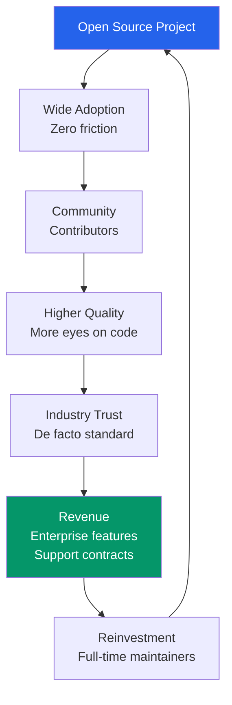
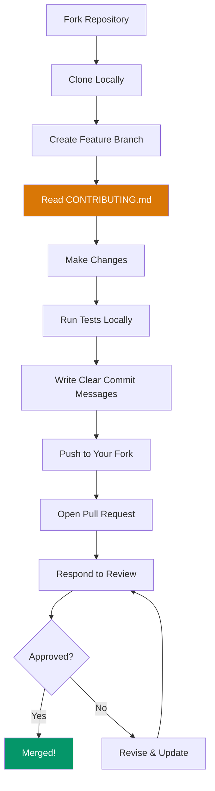
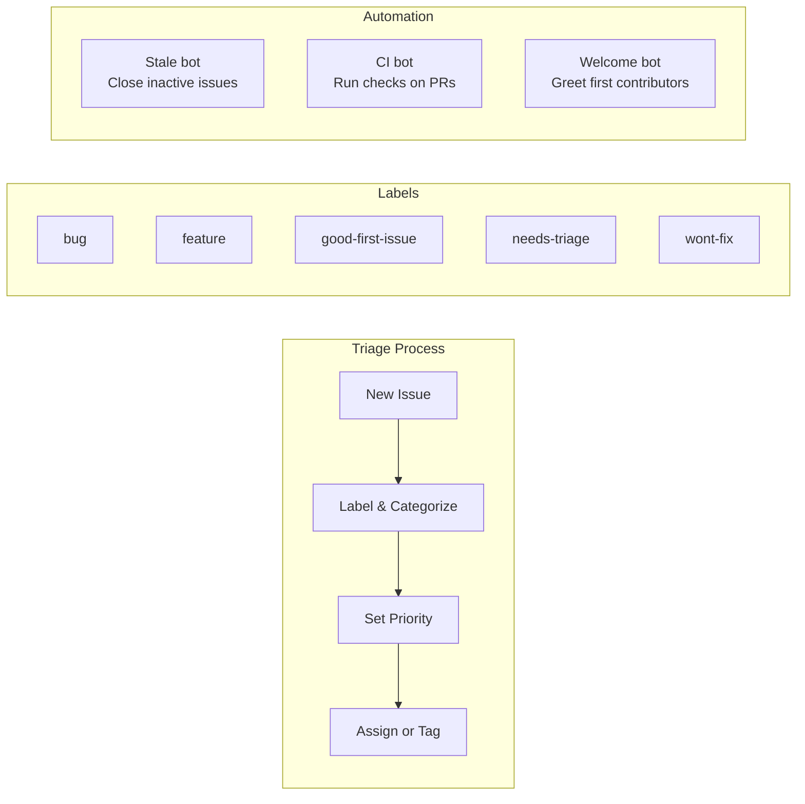
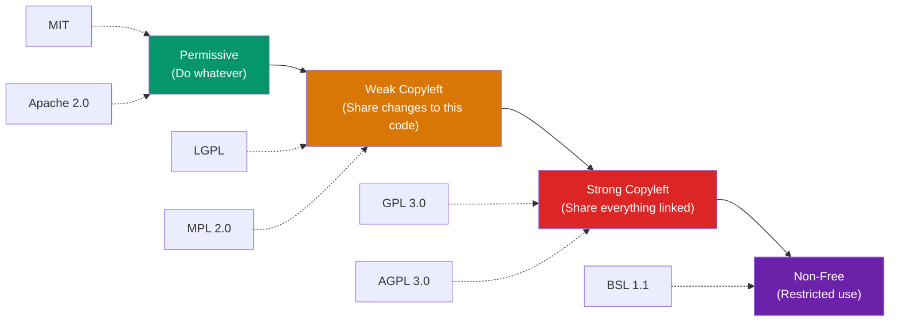
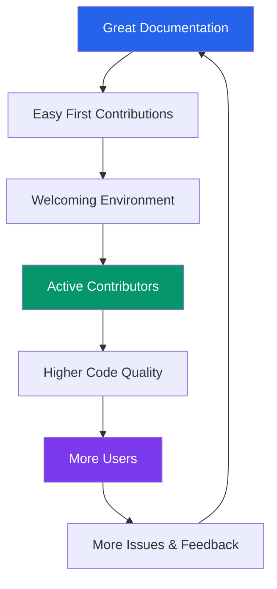
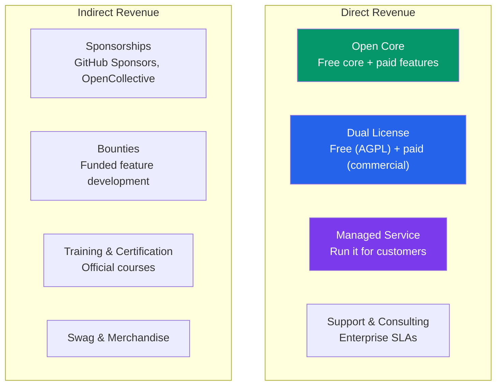

# Open Source Engineering

Open source is not charity. It is a **strategic engineering practice** that has reshaped how software is built, distributed, and monetized. Linux runs 96% of the world's top million servers. Kubernetes orchestrates infrastructure at every major company. React powers billions of page views daily. None of these were built by a single company — they were built by communities of engineers contributing to shared codebases under open licenses. Understanding how to contribute to, maintain, and monetize open source is a core engineering skill.

## Why Open Source Matters for Engineers

### Career Impact

| Benefit | How It Helps |
|---------|-------------|
| **Portfolio** | Your GitHub profile is a living resume that hiring managers actually read |
| **Skill growth** | Reviewing code from Netflix, Google, and Meta engineers teaches patterns you won't learn at work |
| **Networking** | Maintainers of popular projects know every major hiring manager in their ecosystem |
| **Influence** | Your RFC or design doc shapes how thousands of engineers solve a problem |
| **Visibility** | Conference talks about your OSS work establish you as a domain expert |

### Business Impact



## How to Contribute

### Finding Your First Contribution

Do not start by trying to contribute to Kubernetes. Start small:

1. **Fix documentation** — every project has docs with typos, outdated examples, or missing guides
2. **Good first issues** — look for labels like `good-first-issue`, `help-wanted`, `beginner-friendly`
3. **Bug reports** — filing a well-written bug report with a reproduction is a valuable contribution
4. **Test coverage** — adding tests for untested code paths is always welcome
5. **Dependencies** — updating outdated dependencies with proper testing

::: tip
Use [goodfirstissue.dev](https://goodfirstissue.dev) or GitHub's Explore page filtered by language and topic. Start with projects you actually use — you already understand the domain.
:::

### The Contribution Workflow



### Writing a Great Pull Request

```markdown
## Summary
Brief description of what this PR does and why.

## Motivation
Link to the issue this addresses. Explain the problem.

## Changes
- Bullet list of what changed
- Why each change was made

## Testing
- How you tested this
- Steps to reproduce / verify

## Screenshots (if UI change)
Before / after screenshots
```

::: warning
Always read the project's `CONTRIBUTING.md` before submitting a PR. Many projects have specific commit message formats, testing requirements, or CLA (Contributor License Agreement) requirements. Ignoring these wastes both your time and the maintainer's.
:::

### Contribution Quality Checklist

| Aspect | What Maintainers Expect |
|--------|------------------------|
| **Scope** | One PR does one thing. Do not bundle unrelated changes. |
| **Tests** | New code has tests. Modified code updates existing tests. |
| **Docs** | Public API changes include documentation updates. |
| **Style** | Follow the project's existing code style exactly. Do not "improve" formatting in unrelated files. |
| **Commits** | Clean, atomic commits with descriptive messages. |
| **CI** | All CI checks pass before requesting review. |
| **Communication** | Respond to review feedback within 48 hours or the PR goes stale. |

## Maintaining Open Source Projects

### Setting Up a Project for Success

The difference between a project that gets 1,000 stars and dies versus one that builds a real community is **governance and documentation from day one**.

#### Essential Files

```
my-project/
  README.md                # What it does, quick start, badges
  LICENSE                  # Legal terms (choose carefully)
  CONTRIBUTING.md          # How to contribute
  CODE_OF_CONDUCT.md       # Community standards
  SECURITY.md              # How to report vulnerabilities
  CHANGELOG.md             # Version history
  .github/
    ISSUE_TEMPLATE/
      bug_report.md        # Structured bug reports
      feature_request.md   # Structured feature requests
    PULL_REQUEST_TEMPLATE.md
    FUNDING.yml            # GitHub Sponsors config
    workflows/
      ci.yml               # Automated testing
      release.yml          # Automated releases
```

### Managing Issues and PRs at Scale



### Maintainer Burnout Prevention

::: danger
Maintainer burnout is the number one killer of open source projects. Nadia Eghbal's research in "Working in Public" documented how maintainers of popular projects receive hundreds of issues and PRs weekly, most from strangers demanding free labor. Protect yourself.
:::

**Strategies to prevent burnout:**

1. **Set boundaries** — your `CONTRIBUTING.md` should state response time expectations and what is out of scope
2. **Share the load** — promote active contributors to maintainer status
3. **Automate everything** — use bots for triage, CI for testing, auto-release for publishing
4. **Say no** — not every feature request deserves implementation; close issues with clear reasoning
5. **Take breaks** — announce maintenance windows; the project will survive

## License Comparison

Choosing a license is a **permanent architectural decision**. Changing it later requires consent from every contributor, which is practically impossible for large projects.

### License Spectrum



### Detailed License Comparison

| License | Type | Patent Grant | Copyleft Scope | Commercial Use | SaaS Loophole | Notable Users |
|---------|------|-------------|----------------|----------------|---------------|---------------|
| **MIT** | Permissive | No | None | Unrestricted | Yes | React, jQuery, Rails |
| **Apache 2.0** | Permissive | Yes | None | Unrestricted | Yes | Kubernetes, Android, TensorFlow |
| **GPL 3.0** | Strong copyleft | Yes | Derivative works | Must share source | Yes (SaaS not distribution) | Linux kernel (v2), GCC, WordPress |
| **AGPL 3.0** | Strong copyleft | Yes | Network use = distribution | Must share source | **No** — closes loophole | MongoDB (pre-SSPL), Grafana, Mastodon |
| **BSL 1.1** | Source available | Varies | Time-delayed open source | Restricted (usually production use) | No | HashiCorp (Terraform, Vault), Sentry, MariaDB |

### When to Use Each License

**MIT** — Choose when you want maximum adoption. You don't care if companies use your code without contributing back. Best for libraries and developer tools where network effects matter more than revenue.

**Apache 2.0** — Choose MIT plus patent protection. The patent grant means a contributor cannot later sue users for patent infringement. Preferred by most corporate-backed projects.

**GPL 3.0** — Choose when you want modifications to be shared back, but only for distributed software. The "SaaS loophole" means companies can run GPL code as a service without releasing source.

**AGPL 3.0** — Choose when you want to close the SaaS loophole. If anyone provides your software as a network service, they must release their full source. This is the strongest protection for community contributions.

**BSL 1.1** — Choose when you want source-available code that converts to open source after a delay (usually 3-4 years). Prevents competitors from offering your product as a managed service.

::: tip
For most developer tools and libraries, **Apache 2.0** is the safe default. It provides patent protection, maximum adoption, and corporate-friendly terms. Use AGPL only if you have a specific dual-licensing business model in mind.
:::

### The CLA Question

A Contributor License Agreement (CLA) grants the project owner additional rights over contributions — typically the right to relicense the code. This is controversial:

| Factor | Pro-CLA | Anti-CLA |
|--------|---------|----------|
| **Relicensing** | Enables dual-licensing business models | Contributors may not want their code relicensed |
| **Patent** | Explicit patent grant from contributors | DCO (Developer Certificate of Origin) may suffice |
| **Friction** | Establishes legal clarity | Discourages casual contributions |
| **Trust** | Corporate lawyers require it | Community sees it as a power grab |

## Building Community

### The Community Flywheel



### Communication Channels

| Channel | Best For | Examples |
|---------|----------|---------|
| **GitHub Issues** | Bug reports, feature requests | Structured, searchable, linked to code |
| **GitHub Discussions** | Q&A, ideas, show-and-tell | Forum-style, less formal than issues |
| **Discord** | Real-time chat, community building | Fast answers, community bonds, can be noisy |
| **Blog / Newsletter** | Release announcements, roadmap | Long-form, async, professional |
| **Twitter/X** | Announcements, engagement | Broad reach, short form |

### Governance Models

1. **BDFL (Benevolent Dictator for Life)** — one person has final say (Python with Guido, Linux with Linus)
2. **Core team** — a small group of trusted maintainers makes decisions by consensus (React, Vue)
3. **Foundation** — a legal entity governs the project (Apache Foundation, Linux Foundation, CNCF)
4. **Open governance** — formal RFC process, elected leadership, transparent decision-making (Rust, Node.js)

## Monetizing Open Source

### Revenue Models



### Revenue Model Comparison

| Model | Annual Revenue Potential | Effort to Implement | Sustainability |
|-------|------------------------|---------------------|----------------|
| **GitHub Sponsors** | $1K-$50K | Low | Low (depends on goodwill) |
| **Open Core** | $1M-$100M+ | High (build enterprise features) | High |
| **Dual License** | $500K-$50M | Medium (legal setup) | Medium |
| **Managed Service** | $10M-$1B+ | Very high (build infrastructure) | Very high |
| **Support Contracts** | $100K-$10M | Medium | Medium |
| **Training** | $50K-$5M | Medium | Medium |

### Open Core in Practice

The open-core model is the most common path to building a business on open source:

```
Project Feature Set
===================

Free (Open Source)               Paid (Proprietary)
-------------------              -------------------
Core functionality               SSO / SAML / LDAP
Community support                Role-based access control
Self-hosted                      Audit logging
Basic API                        Priority support (SLA)
Plugin system                    Managed cloud hosting
Community plugins                Advanced analytics
                                 Enterprise integrations
                                 Compliance certifications
```

::: warning
The hardest decision in open core is **where to draw the line** between free and paid. If the free tier is too limited, adoption suffers and the community resents you. If the free tier is too generous, nobody pays. The general rule: features that individuals need should be free; features that enterprises need (SSO, audit logs, compliance) should be paid.
:::

### Dual Licensing in Practice

Dual licensing works like this:

1. Release the project under AGPL (or similar copyleft license)
2. Companies that cannot comply with AGPL (because they don't want to open-source their code) purchase a commercial license
3. You can do this because you own all the code (via CLA from contributors)

**Successful examples:** MySQL (GPL + commercial), Qt (LGPL + commercial), MongoDB (SSPL + commercial before Atlas took over)

## Measuring Open Source Health

### Key Metrics

| Metric | Healthy Signal | Warning Signal |
|--------|---------------|----------------|
| **Contributors/month** | Growing or stable | Declining for 3+ months |
| **Issue response time** | < 48 hours | > 2 weeks |
| **PR merge time** | < 1 week | > 1 month |
| **Bus factor** | 3+ core maintainers | 1 person does 80%+ of merges |
| **Stars growth** | Steady organic growth | Sudden spikes (probably HN/Reddit, not sustainable) |
| **Dependency count** | Used by many projects | Used only by the maintainer |
| **Release cadence** | Regular, predictable | Irregular, months between releases |

### CHAOSS Metrics

The [CHAOSS](https://chaoss.community/) project defines standardized metrics for open source health:

- **Activity** — commits, PRs, issues over time
- **Community** — contributor diversity, organizational diversity
- **Risk** — bus factor, license compliance, dependency risk
- **Value** — downstream usage, economic value, social value

## Common Mistakes

| Mistake | Why It Happens | What to Do Instead |
|---------|---------------|-------------------|
| No license file | "I'll add it later" | Choose a license on day one; no license means all rights reserved |
| Ignoring issues | Burnout or overcommitment | Set expectations in CONTRIBUTING.md; use stale bot |
| Breaking changes without semver | Moving fast | Follow [semantic versioning](https://semver.org) strictly after 1.0 |
| No CHANGELOG | "Git log is the changelog" | Maintain a human-readable CHANGELOG.md |
| Accepting every PR | Wanting to be nice | Quality over quantity; say no to scope creep |
| No CI/CD | "Works on my machine" | Set up GitHub Actions on day one |

## Related Pages

- [Code Review Best Practices](/devops/engineering-practices/code-review) — reviewing open source contributions effectively
- [Architecture Decision Records](/devops/engineering-practices/architecture-decision-records) — documenting design decisions in open source projects
- [Technical Writing](/devops/engineering-practices/technical-writing) — writing documentation that builds community
- [Tech Debt Management](/devops/engineering-practices/tech-debt) — managing technical debt in open source projects
- [API Versioning](/system-design/api-design/api-versioning) — versioning strategies critical for public open source APIs
