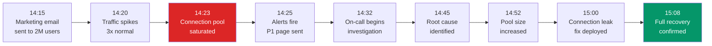
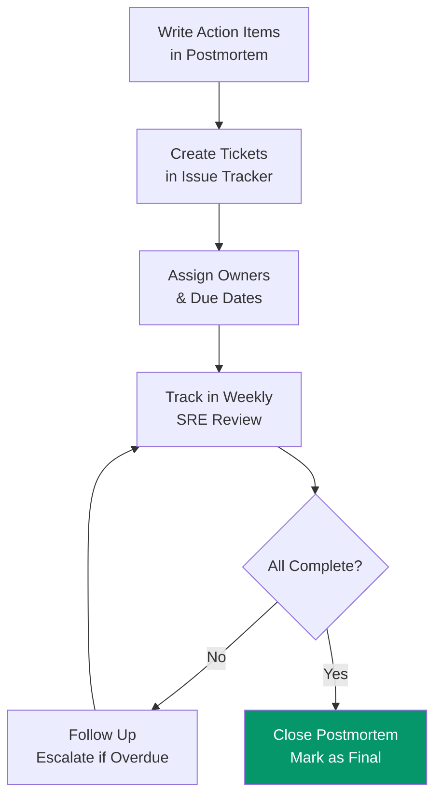

# Postmortem Template & Guide

A postmortem is a structured analysis of an incident after it has been resolved. Its purpose is not to assign blame — it is to understand what happened, why it happened, and how to prevent it from happening again. Google's SRE book calls postmortems "the single most important cultural practice in reliability engineering." Without them, you fix the symptom but not the cause, and the same incident (or a worse one) happens again in three months.

## Blameless Postmortem Culture

### Why Blameless Matters

```mermaid
graph TD
    subgraph "Blame Culture"
        Inc1["Incident Occurs"] --> Blame["'Who did this?'"]
        Blame --> Hide["Engineers Hide Mistakes"]
        Hide --> Less["Less Information Shared"]
        Less --> Worse["Worse Incident Response"]
        Worse --> Inc1
    end

    subgraph "Blameless Culture"
        Inc2["Incident Occurs"] --> System["'What allowed this?'"]
        System --> Share["Engineers Share Openly"]
        Share --> More["Full Picture Emerges"]
        More --> Fix["Systemic Fixes Applied"]
        Fix --> Better["Fewer & Smaller Incidents"]
    end

    style Blame fill:#dc2626,color:#fff
    style System fill:#059669,color:#fff
    style Inc1 fill:#dc2626,color:#fff
    style Better fill:#059669,color:#fff
```



### The Core Principles

1. **People are not the root cause.** Systems allow failures. If a human can make a mistake that causes an outage, the system is the problem, not the human.
2. **Assume good intent.** Everyone involved was trying to do the right thing with the information they had at the time.
3. **Focus on systems, not individuals.** Instead of "Alice deployed broken code," write "The deployment pipeline lacked a canary stage that would have caught the regression."
4. **Reward reporting.** Engineers who surface incidents and near-misses should be praised, not punished.
5. **Share widely.** Postmortems are published internally for the entire engineering org to learn from.

::: danger
Blameless does not mean **accountable-less**. Action items have owners and deadlines. Follow-up work gets done. "Blameless" means we focus on systemic improvements rather than punishing individuals, but the team is still accountable for preventing recurrence.
:::

### Language Guide

| Blaming Language | Blameless Alternative |
|-----------------|----------------------|
| "Alice caused the outage by deploying bad code" | "A configuration change was deployed that contained a regression" |
| "The on-call engineer failed to notice the alerts" | "The alerting system did not surface the issue prominently enough" |
| "Bob should have known better" | "The runbook did not cover this failure mode" |
| "The team was careless" | "The process lacked safeguards that would have caught this class of error" |
| "Human error" | "The system allowed a single action to have an outsized impact without confirmation" |

## The Postmortem Template

### Full Template

```markdown
# Postmortem: [Incident Title]

**Date:** YYYY-MM-DD
**Author(s):** [Names of postmortem authors]
**Status:** Draft | In Review | Final
**Severity:** SEV-1 | SEV-2 | SEV-3 | SEV-4

## Summary

[2-3 sentences describing what happened, the impact, and the duration.
This should be understandable by someone with no context.]

## Impact

- **Duration:** [Start time] to [End time] ([X] minutes/hours)
- **Users affected:** [Number or percentage]
- **Revenue impact:** [Estimated dollar amount or "N/A"]
- **SLA impact:** [Did this burn error budget? How much?]
- **Data loss:** [Yes/No — if yes, describe scope]
- **Downstream impact:** [Other teams/services affected]

## Timeline

All times in UTC.

| Time | Event |
|------|-------|
| HH:MM | [First anomalous signal detected by monitoring] |
| HH:MM | [Alert fires / page triggers] |
| HH:MM | [On-call acknowledges] |
| HH:MM | [Investigation begins] |
| HH:MM | [Root cause identified] |
| HH:MM | [Mitigation applied] |
| HH:MM | [Service fully recovered] |
| HH:MM | [All-clear communicated] |

## Root Cause

[Detailed technical explanation of what caused the incident.
Go deep — this section should explain the failure mechanism
such that another engineer could reproduce the issue.]

## Trigger

[What specific event triggered the incident? A deployment?
A traffic spike? A configuration change? A dependency failure?]

## Detection

[How was the incident detected? Alert? Customer report?
Automated monitoring? Manual observation?]

**Time to detect:** [X] minutes from first signal to first alert

## Response

[How did the team respond? What investigation steps were taken?
What blind alleys were explored? What worked, what didn't?]

## Mitigation

[What was done to stop the bleeding? Rollback? Config change?
Failover? Manual intervention?]

## Contributing Factors

[What other factors made this incident possible or made it worse?]

- [Factor 1: e.g., "Missing canary deployment stage"]
- [Factor 2: e.g., "Alert was configured with too high a threshold"]
- [Factor 3: e.g., "Runbook was outdated and didn't cover this scenario"]

## What Went Well

- [Thing 1: e.g., "Monitoring detected the anomaly within 2 minutes"]
- [Thing 2: e.g., "Incident commander established clear communication"]
- [Thing 3: e.g., "Rollback was executed cleanly in under 5 minutes"]

## What Went Poorly

- [Thing 1: e.g., "Took 20 minutes to identify which service was affected"]
- [Thing 2: e.g., "No runbook existed for this failure mode"]
- [Thing 3: e.g., "Customer-facing status page was not updated for 15 minutes"]

## Action Items

| ID | Action | Priority | Owner | Due Date | Status |
|----|--------|----------|-------|----------|--------|
| 1 | [Action description] | P0/P1/P2 | [Name] | YYYY-MM-DD | Open |
| 2 | [Action description] | P0/P1/P2 | [Name] | YYYY-MM-DD | Open |
| 3 | [Action description] | P0/P1/P2 | [Name] | YYYY-MM-DD | Open |

## Lessons Learned

[What did we learn from this incident that applies broadly
to how we build and operate systems?]

## Supporting Information

- [Link to incident channel/thread]
- [Link to relevant dashboards]
- [Link to relevant code changes]
- [Link to related past incidents]
```

## Real Example: Database Connection Pool Exhaustion

### Postmortem: Database Connection Pool Exhaustion Caused 45-Minute Outage

**Date:** 2026-02-15
**Author(s):** Platform Engineering Team
**Status:** Final
**Severity:** SEV-1

### Summary

On February 15, 2026, the order processing service experienced a 45-minute outage due to database connection pool exhaustion. 100% of order creation and order status queries failed during the incident window. Approximately 12,000 orders failed to process, and an estimated $340,000 in revenue was delayed (all orders were eventually recovered through replay).

### Impact

- **Duration:** 14:23 UTC to 15:08 UTC (45 minutes)
- **Users affected:** ~28,000 users attempting to place or check orders
- **Revenue impact:** $340,000 delayed (recovered via replay); $15,000 estimated lost (abandoned carts)
- **SLA impact:** Consumed 62% of monthly error budget in 45 minutes
- **Data loss:** None — all failed orders were captured in the dead letter queue
- **Downstream impact:** Payment service backed up; notification service delayed by 2 hours

### Timeline



All times in UTC.

| Time | Event |
|------|-------|
| 14:15 | Marketing team sends promotional email to 2M subscribers |
| 14:20 | Traffic to order service begins climbing, reaching 3x normal by 14:22 |
| 14:23 | PostgreSQL connection pool (max: 20) fully consumed; new requests start queuing |
| 14:24 | Request queue grows; p99 latency jumps from 200ms to 15s |
| 14:25 | Datadog alert fires: "Order service error rate > 10%". PagerDuty pages on-call |
| 14:28 | On-call engineer acknowledges page, opens incident channel |
| 14:32 | On-call checks service metrics, sees 20/20 connections in use, 200+ requests queued |
| 14:35 | On-call examines slow query log — no unusual queries detected |
| 14:38 | On-call checks application logs, discovers `ConnectionPoolTimeoutException` |
| 14:42 | On-call examines connection pool metrics; discovers connections are acquired but never returned in the `/orders/export` endpoint |
| 14:45 | Root cause identified: `/orders/export` endpoint opens a connection for CSV streaming but does not release it if the client disconnects mid-stream |
| 14:48 | Incident commander decides on two-part fix: increase pool size immediately, deploy connection leak fix |
| 14:52 | Pool size increased from 20 to 100 via environment variable change; service restarted |
| 14:55 | Error rate drops to 5% — some leaked connections still held |
| 15:00 | Hotfix deployed: connection properly released in `finally` block for export endpoint |
| 15:05 | Error rate returns to baseline (0.1%) |
| 15:08 | All-clear declared; dead letter queue replay initiated for failed orders |
| 16:30 | All 12,000 failed orders successfully reprocessed |

### Root Cause

The `/orders/export` endpoint streamed CSV data directly from a database cursor. The code acquired a connection from the pool at the start of the stream but only released it when the stream completed successfully:

```java
// BEFORE (buggy code)
public void exportOrders(OutputStream out) {
    Connection conn = connectionPool.acquire();  // Acquires connection
    try {
        ResultSet rs = conn.createStatement()
            .executeQuery("SELECT * FROM orders WHERE ...");

        while (rs.next()) {
            out.write(formatCsv(rs));  // If client disconnects here,
        }                               // connection is NEVER released

        conn.close();  // Only reached if stream completes
    } catch (SQLException e) {
        conn.close();  // Catches SQL errors but NOT client disconnect
        throw e;
    }
    // Missing: no finally block to guarantee connection release
}
```

When users disconnected mid-download (common on mobile), the connection was leaked. Under normal traffic, leaked connections were eventually reaped by a 30-minute idle timeout. But the marketing email caused a traffic spike where hundreds of users hit the export endpoint simultaneously, exhausting the pool in minutes.

```java
// AFTER (fixed code)
public void exportOrders(OutputStream out) {
    try (Connection conn = connectionPool.acquire()) {  // try-with-resources
        ResultSet rs = conn.createStatement()
            .executeQuery("SELECT * FROM orders WHERE ...");

        while (rs.next()) {
            out.write(formatCsv(rs));
        }
    }  // Connection ALWAYS released, even on client disconnect
}
```

### Contributing Factors

- **Connection pool size too small:** 20 connections for a service handling 500+ requests/second. Industry guidance suggests 10-20 connections per CPU core.
- **No connection leak detection:** The pool had no monitoring for connections held longer than a threshold (e.g., 60 seconds).
- **No coordination between marketing and engineering:** The email blast was not flagged as a traffic-generating event.
- **Export endpoint not rate-limited:** No limit on concurrent CSV exports.

### What Went Well

- Dead letter queue captured all failed orders — zero data loss
- Monitoring detected the issue within 2 minutes of pool exhaustion
- Incident commander established clear communication channel quickly
- Hotfix was deployed within 15 minutes of root cause identification
- Order replay completed successfully within 90 minutes

### What Went Poorly

- On-call spent 10 minutes checking slow queries (wrong hypothesis) before examining pool metrics
- Connection pool metrics were not on the primary service dashboard — required manual query
- Runbook for "Order Service Degradation" did not mention connection pool as a possible cause
- Status page was not updated until 14:40 (15 minutes after users were affected)
- Marketing email was sent without engineering awareness

### Action Items

| ID | Action | Priority | Owner | Due Date | Status |
|----|--------|----------|-------|----------|--------|
| 1 | Add connection pool utilization to primary service dashboard | P0 | Platform | 2026-02-22 | Done |
| 2 | Add alert for connection pool > 80% utilized | P0 | Platform | 2026-02-22 | Done |
| 3 | Implement connection leak detection (log connections held > 60s) | P1 | Platform | 2026-03-01 | Done |
| 4 | Audit all endpoints for connection/resource leak patterns | P1 | Backend | 2026-03-15 | In Progress |
| 5 | Add rate limiting to export endpoints (max 10 concurrent) | P1 | Backend | 2026-03-01 | Done |
| 6 | Create process for marketing to notify engineering of traffic-generating events | P2 | Engineering Manager | 2026-03-01 | Done |
| 7 | Update runbook: add connection pool troubleshooting section | P1 | SRE | 2026-02-28 | Done |
| 8 | Increase default pool size to 50 and add auto-scaling | P2 | Platform | 2026-03-15 | In Progress |

## Action Item Best Practices

### Writing Effective Action Items

::: tip
Every action item should be **specific, measurable, and assigned**. "Improve monitoring" is not an action item. "Add PagerDuty alert when connection pool utilization exceeds 80% for 2 minutes, assigned to Sarah, due March 1" is an action item.
:::

| Good Action Item | Bad Action Item |
|-----------------|-----------------|
| "Add circuit breaker to payment service calls with 5-failure threshold" | "Add resilience" |
| "Set up Datadog monitor for p99 latency > 2s on /checkout endpoint" | "Improve monitoring" |
| "Write runbook section for database failover procedure" | "Update docs" |
| "Implement canary deployments for order service with 5% traffic for 10 min" | "Better deploys" |

### Priority Definitions

| Priority | Definition | SLA |
|----------|-----------|-----|
| **P0** | Prevents recurrence of this exact incident | Complete within 1 week |
| **P1** | Reduces likelihood or impact of similar incidents | Complete within 2 weeks |
| **P2** | General improvement surfaced by this incident | Complete within 1 month |
| **P3** | Nice to have; low impact | Complete within 1 quarter |

### Tracking Action Items



::: warning
The number one failure mode of postmortems is **action items that never get done**. If you write a postmortem, identify root causes, and then never complete the action items, you have wasted everyone's time and the incident WILL recur. Track action item completion as an SRE team KPI.
:::

## The Postmortem Review Meeting

### Meeting Format (60 Minutes)

| Time | Activity | Who |
|------|----------|-----|
| 0-5 min | **Read the postmortem** silently (yes, in the meeting) | Everyone |
| 5-15 min | **Author presents** the timeline and root cause | Postmortem author |
| 15-35 min | **Discussion** — what surprised you? What did we miss? | Everyone |
| 35-50 min | **Review action items** — are they sufficient? Correct priority? | Everyone |
| 50-55 min | **Broader lessons** — does this apply to other services? | Everyone |
| 55-60 min | **Next steps** — assign action items, set follow-up date | Facilitator |

### Meeting Ground Rules

1. **No blame.** If someone starts pointing fingers, the facilitator redirects to systemic factors.
2. **Assume good intent.** Everyone involved made reasonable decisions with the information they had.
3. **Focus on the future.** The goal is prevention, not punishment.
4. **Welcome dissent.** If someone disagrees with the root cause analysis, hear them out — they may be right.
5. **Record everything.** Update the postmortem document with insights from the meeting.

### Who Should Attend

| Role | Why They Attend |
|------|----------------|
| **Incident responders** | They have first-hand knowledge of what happened |
| **Service owners** | They can commit to action items |
| **SRE/Platform team** | They see patterns across incidents |
| **Engineering manager** | They can prioritize action items against feature work |
| **Product manager** (optional) | They understand the customer impact |
| **VP/Director** (for SEV-1 only) | They need visibility into critical failures |

## Building a Postmortem Culture

### When to Write a Postmortem

| Trigger | Required? |
|---------|-----------|
| SEV-1 (complete service outage) | Always |
| SEV-2 (significant degradation, SLA impact) | Always |
| SEV-3 (minor impact, workaround available) | If interesting lessons |
| Near-miss (almost caused an incident) | Encouraged — near-misses are gold |
| Customer data exposure | Always |
| Data loss | Always |
| Revenue impact > $10K | Always |

### Postmortem Repository

Maintain a searchable archive of all postmortems:

```
postmortems/
  2026/
    2026-02-15-order-service-connection-pool.md
    2026-01-28-auth-service-certificate-expiry.md
    2026-01-10-cdn-cache-poisoning.md
  2025/
    2025-12-20-payment-gateway-timeout.md
    ...
  index.md          # Searchable index with tags and severity
  statistics.md     # Trends: incidents/month, MTTR, repeat incidents
```

### Key Metrics to Track

| Metric | What It Tells You |
|--------|-------------------|
| **MTTR (Mean Time to Recover)** | How fast do you fix things? |
| **MTTD (Mean Time to Detect)** | How fast do you notice problems? |
| **Postmortem completion rate** | Are all qualifying incidents getting postmortems? |
| **Action item completion rate** | Are follow-ups actually getting done? |
| **Repeat incident rate** | Are the same types of incidents recurring? |
| **Time to postmortem** | How quickly after the incident is the postmortem written? (Target: < 5 business days) |

## Related Pages

- [On-Call Handbook](/devops/engineering-practices/on-call-handbook) — the incident response process that precedes a postmortem
- [Tech Debt Management](/devops/engineering-practices/tech-debt) — when postmortems reveal systemic tech debt
- [Code Review Best Practices](/devops/engineering-practices/code-review) — catching issues like the connection leak before they ship
- [Architecture Decision Records](/devops/engineering-practices/architecture-decision-records) — documenting architectural changes that result from postmortem action items
- [Performance Benchmarks](/performance/benchmarks) — understanding the latency numbers referenced in incident timelines
