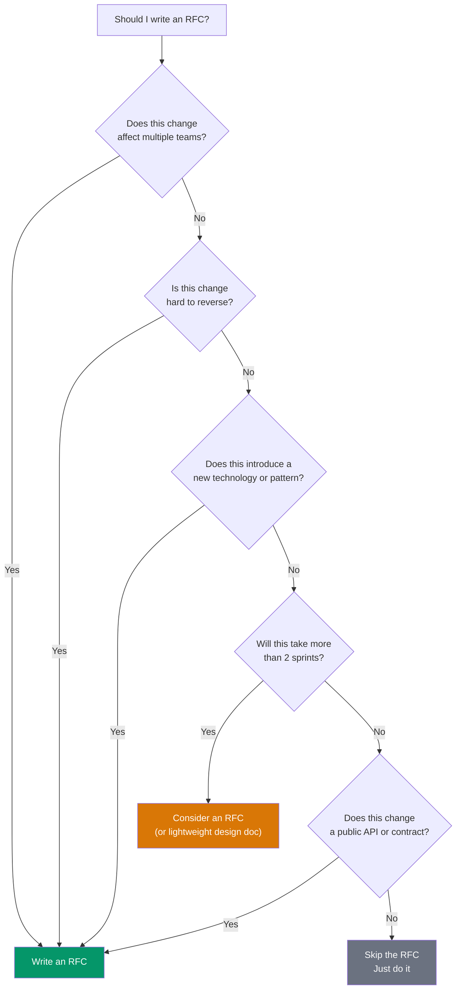
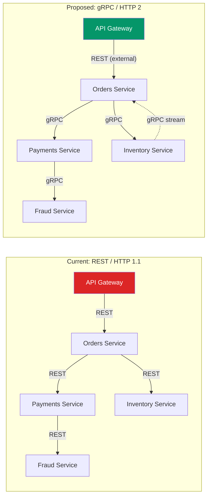
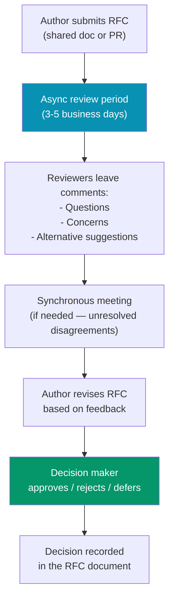

# RFC Template & Guide

An RFC (Request for Comments) is a structured proposal for a significant technical change. It forces you to think through the problem, consider alternatives, and get feedback before investing engineering time. This page covers when to write an RFC, provides a complete template, walks through a real example, and describes the review and decision process.

## What Deserves an RFC

Not every change needs an RFC. Writing one for a minor refactor wastes everyone's time. Writing none for a major migration wastes everyone's money.



### RFC vs Design Doc vs ADR

| Document | Scope | Purpose | Audience |
|----------|-------|---------|----------|
| **RFC** | Cross-team | Propose a significant change and get feedback | Engineering org |
| **Design Doc** | Single team | Plan the implementation of a known approach | Team members |
| **ADR** | Single decision | Record a decision that was made and why | Future engineers |

::: tip Write the RFC Before Writing the Code
The most common mistake is building first and writing the RFC to justify a decision already made. This defeats the purpose. If you already have a prototype, mention it, but present the alternatives honestly.
:::

---

## RFC Template

Copy this template and fill in the sections. Remove any section that does not apply, but think twice before removing "Alternatives Considered" — it is the most important section for reviewers.

````markdown
# RFC: [Title]

**Author(s):** [Your Name]
**Status:** Draft | In Review | Accepted | Rejected | Superseded
**Created:** [Date]
**Last Updated:** [Date]
**Reviewers:** [Names / Teams]
**Decision Deadline:** [Date — typically 1-2 weeks after review starts]

---

## 1. Summary

One paragraph describing the proposal. A reader should understand the gist
without reading the rest of the document.

## 2. Context & Problem Statement

- What is the current state?
- What problem are we experiencing?
- Why is this problem worth solving now?
- What data supports the problem statement? (metrics, incidents, user complaints)

## 3. Goals & Non-Goals

### Goals
- [ ] Goal 1: What must this proposal accomplish
- [ ] Goal 2: ...

### Non-Goals
- What this proposal explicitly does NOT try to solve
- Scope boundaries to prevent scope creep

## 4. Proposed Solution

Describe the solution in detail. Include:
- Architecture diagrams (Mermaid, draw.io)
- API changes (request/response examples)
- Data model changes (schema diffs)
- Migration plan (how we get from current state to proposed state)
- Rollback plan (how we revert if things go wrong)

## 5. Alternatives Considered

### Alternative A: [Name]
- Description
- Pros
- Cons
- Why we did not choose this

### Alternative B: [Name]
- Description
- Pros
- Cons
- Why we did not choose this

### Alternative C: Do Nothing
- What happens if we do not act?
- What is the cost of inaction?

## 6. Risks & Mitigations

| Risk | Probability | Impact | Mitigation |
|------|------------|--------|------------|
| Risk 1 | Low/Med/High | Low/Med/High | How we handle it |
| Risk 2 | ... | ... | ... |

## 7. Rollout Plan

- [ ] Phase 1: [Description, timeline]
- [ ] Phase 2: [Description, timeline]
- [ ] Phase 3: [Description, timeline]
- Rollback triggers: What conditions cause us to revert?

## 8. Success Metrics

How will we know this was successful? Define measurable outcomes.

| Metric | Current Value | Target Value | Measurement Method |
|--------|--------------|--------------|-------------------|
| Metric 1 | X | Y | How we measure |

## 9. Open Questions

- [ ] Question 1: [Needs answer before implementation]
- [ ] Question 2: [Needs answer, but can proceed without it]

## 10. Decision

**Status:** [Accepted / Rejected / Deferred]
**Decision Date:** [Date]
**Decision Maker(s):** [Name(s)]
**Rationale:** [Brief summary of why the decision was made]
````

---

## Real Example: Migrate from REST to gRPC for Internal Services

Below is a condensed but realistic RFC to illustrate the template in action.

### RFC: Migrate Internal Service Communication from REST to gRPC

**Author:** Jane Chen (Staff Engineer, Platform)
**Status:** Accepted
**Created:** 2026-01-15
**Reviewers:** Platform team, Payments team, Orders team, Infra team
**Decision Deadline:** 2026-01-29

---

#### 1. Summary

Migrate internal service-to-service communication from REST/JSON over HTTP/1.1 to gRPC with Protocol Buffers over HTTP/2. External APIs remain REST. This reduces inter-service latency by 40-60%, provides type-safe contracts, and enables bidirectional streaming.

#### 2. Context & Problem Statement

Our backend consists of 14 internal services communicating via REST. Three problems have emerged:

- **Latency**: REST/JSON serialization adds 5-15ms per hop. Services with 4-hop call chains accumulate 40-60ms of serialization overhead alone.
- **Contract drift**: We have no enforced schema. Three incidents in the last quarter were caused by one service changing a response field without updating consumers.
- **No streaming**: The notification service polls the event service every 500ms because REST has no server push. This generates 170K unnecessary requests per minute.



**Data:**
- P95 latency for the order creation flow: 320ms (target: 200ms)
- Contract-related incidents: 3 in Q4 2025
- Unnecessary polling requests: 170K/min

#### 3. Goals & Non-Goals

**Goals:**
- Reduce inter-service serialization overhead by 40%+
- Enforce type-safe contracts between all internal services
- Enable server streaming for the notification pipeline

**Non-Goals:**
- Migrating external-facing APIs to gRPC (they stay REST)
- Changing the service architecture or ownership boundaries
- Adopting gRPC-web for frontend communication

#### 4. Proposed Solution

**Protocol Buffers schema:**

```protobuf
syntax = "proto3";

package orders.v1;

service OrderService {
  rpc CreateOrder(CreateOrderRequest) returns (CreateOrderResponse);
  rpc GetOrder(GetOrderRequest) returns (Order);
  rpc StreamOrderUpdates(StreamOrderUpdatesRequest)
      returns (stream OrderUpdate);
}

message CreateOrderRequest {
  string customer_id = 1;
  repeated OrderItem items = 2;
  PaymentMethod payment_method = 3;
}

message Order {
  string order_id = 1;
  string customer_id = 2;
  OrderStatus status = 3;
  repeated OrderItem items = 4;
  google.protobuf.Timestamp created_at = 5;
}
```

**Migration approach:**
1. Add gRPC server alongside existing REST server in each service (dual-stack)
2. Migrate consumers one at a time, verifying latency and correctness
3. Remove REST endpoints once all consumers have migrated

**Rollback:** Each service maintains both REST and gRPC endpoints during migration. Rollback is switching the client back to the REST endpoint via feature flag.

#### 5. Alternatives Considered

| Alternative | Pros | Cons | Why Not |
|-------------|------|------|---------|
| **GraphQL (internal)** | Flexible queries, type-safe | Overhead for internal use, no streaming, N+1 problem | Designed for client-facing, overkill for service-to-service |
| **Apache Thrift** | Similar to gRPC, proven at Facebook | Smaller community, worse tooling, no HTTP/2 multiplexing | gRPC has better ecosystem and Kubernetes integration |
| **REST with OpenAPI validation** | Low migration cost | Does not solve latency or streaming problems | Addresses only contract drift, not the primary issues |
| **Do nothing** | Zero cost | Contract incidents continue, latency ceiling remains | Cost of inaction exceeds migration cost within 6 months |

#### 6. Risks & Mitigations

| Risk | Probability | Impact | Mitigation |
|------|------------|--------|------------|
| gRPC debugging is harder (binary protocol) | Medium | Medium | Deploy gRPC reflection + grpcurl. Add structured logging at service boundaries. |
| Load balancer compatibility | Low | High | Verify Envoy/Istio gRPC support. Use L7 load balancing, not L4. |
| Team unfamiliarity with protobuf | Medium | Low | Run a 2-hour workshop. Create starter template with CI validation. |
| Proto schema versioning mistakes | Medium | Medium | Enforce backward-compatible changes via buf lint in CI. |

#### 7. Rollout Plan

| Phase | Services | Timeline | Success Criteria |
|-------|----------|----------|-----------------|
| Phase 1 | Orders → Inventory (lowest risk) | 2 weeks | P95 latency reduced by 30%+, zero errors |
| Phase 2 | Orders → Payments, Payments → Fraud | 3 weeks | All payment flows on gRPC, no incidents |
| Phase 3 | Remaining services + streaming | 4 weeks | Full migration, polling eliminated |
| Phase 4 | Remove REST endpoints | 2 weeks | REST servers decommissioned |

#### 8. Success Metrics

| Metric | Current | Target | Measurement |
|--------|---------|--------|-------------|
| Order creation P95 latency | 320ms | <200ms | Datadog APM |
| Contract-related incidents | 3/quarter | 0/quarter | Incident tracker |
| Polling requests (notifications) | 170K/min | 0 | Prometheus counter |
| Serialization overhead per hop | 5-15ms | <2ms | Trace spans |

#### 9. Decision

**Status:** Accepted
**Date:** 2026-01-28
**Decision Maker:** VP Engineering (Sarah Park)
**Rationale:** The latency improvement and contract enforcement justify the migration cost. The dual-stack rollout plan minimizes risk. Phase 1 will validate the approach before committing to full migration.

---

## The Review Process

### How to Review an RFC



### Reviewer Guidelines

| Do | Do Not |
|----|--------|
| Focus on the problem and approach, not style | Bikeshed variable names or formatting |
| Ask clarifying questions | Demand justification for every line |
| Suggest concrete alternatives | Say "I don't like this" without a reason |
| Consider the author's constraints | Propose a perfect solution that takes 2 years |
| Respond within the review period | Block progress by not reviewing |

### Types of Review Comments

| Prefix | Meaning | Example |
|--------|---------|---------|
| **Blocking** | Must be addressed before approval | "This migration plan has no rollback mechanism" |
| **Non-blocking** | Suggestion, take it or leave it | "Consider using buf instead of protoc for better lint rules" |
| **Question** | Need clarification | "How does this interact with the existing rate limiter?" |
| **Nit** | Minor, will not block approval | "Typo in section 4" |

::: tip Prefix Your Comments
Explicitly marking comments as "Blocking," "Non-blocking," or "Nit" saves the author from guessing which feedback they must address. Many teams adopt this as a standard convention.
:::

---

## Decision Recording

### When the RFC Is Decided

Once a decision is made, update the RFC document:

1. Set the **Status** to Accepted, Rejected, or Deferred
2. Record the **decision date** and **decision maker**
3. Write a brief **rationale** — this is what future engineers will read
4. If rejected, explain why and what should be done instead
5. If deferred, state the conditions under which it should be revisited

### Rejected RFC Example

```markdown
## Decision

**Status:** Rejected
**Date:** 2026-02-05
**Decision Maker:** CTO (Michael Torres)
**Rationale:** While the technical approach is sound, the engineering
team is at capacity with the Q1 product roadmap. The latency issue is
real but not urgent enough to displace current priorities. We will
revisit this RFC in Q2 planning if the contract-drift incidents
continue.
```

### Linking RFCs to Implementation

Once accepted, the RFC becomes a reference document:

| Artifact | Links to RFC |
|----------|-------------|
| Jira epic / Linear project | References RFC for context |
| Pull requests | Link to RFC section being implemented |
| Architecture Decision Records | Reference RFC as the decision source |
| Post-mortem (if things go wrong) | Reference RFC for original assumptions |

---

## RFC Anti-Patterns

| Anti-Pattern | Problem | Fix |
|-------------|---------|-----|
| **RFC after the fact** | Decision already made, RFC is theater | Write the RFC before starting work |
| **Novel-length RFC** | Nobody reads it, reviews are superficial | Keep it to 2-4 pages. Use appendices for details. |
| **No alternatives section** | Looks like the author did not consider options | Always include at least 2 alternatives + "do nothing" |
| **Infinite review cycle** | RFC stays "in review" for months | Set a decision deadline (1-2 weeks). The decision maker decides even without full consensus. |
| **No decision recorded** | Future engineers do not know what was decided | Always record the decision, rationale, and date in the RFC |
| **RFC for everything** | Team drowns in process | Reserve RFCs for irreversible, cross-team, or high-risk changes |

---

## Related Pages

- [Design Document Template](/devops/engineering-practices/design-doc-template) — For single-team implementation plans
- [Architecture Decision Records](/devops/engineering-practices/architecture-decision-records) — Recording individual decisions
- [Technical Leadership](/devops/engineering-practices/technical-leadership) — Leading through written proposals
- [Code Review Best Practices](/devops/engineering-practices/code-review) — Reviewing code, not just documents
