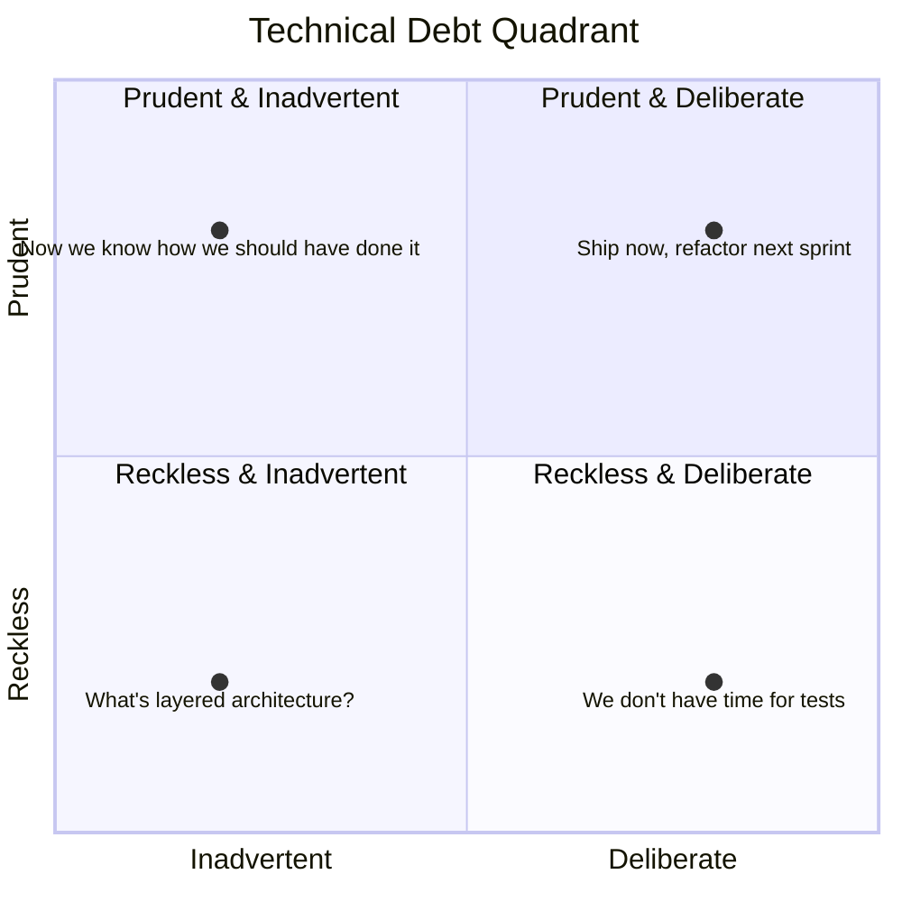
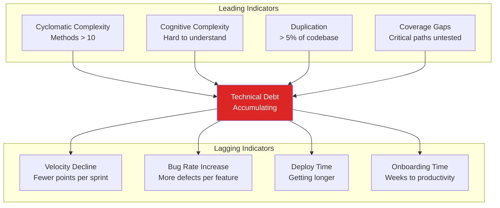
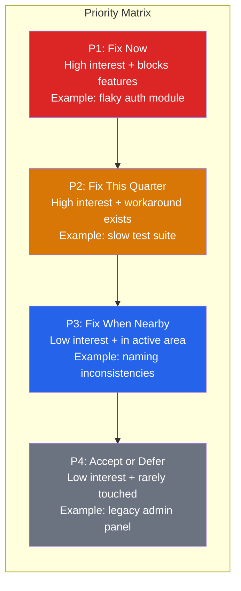
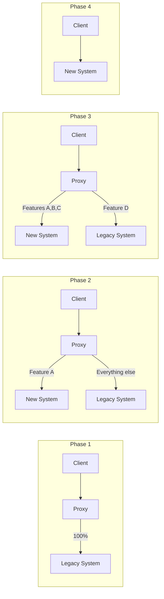

# Tech Debt Management

Technical debt is the implied cost of future rework caused by choosing an expedient solution today instead of a better approach that would take longer. Ward Cunningham coined the metaphor in 1992, comparing it to financial debt: borrowing against the future is fine if you pay it back with interest, but catastrophic if you let it compound. The problem is that most teams never pay it back. They accrue debt sprint after sprint until the codebase becomes so brittle that every feature takes 3x longer to ship, every deploy is a coin flip, and every engineer dreads opening the monolith.

## Understanding Tech Debt

### Fowler's Technical Debt Quadrant

Martin Fowler expanded Cunningham's metaphor into a 2x2 matrix that distinguishes between deliberate and inadvertent debt, and between reckless and prudent debt. This distinction matters because **not all debt is bad**, and not all debt needs the same response.



**Quadrant 1 — Prudent & Deliberate:** "We know this is not ideal, but shipping now and refactoring next sprint is the right trade-off." This is legitimate engineering — you took on debt knowingly with a plan to pay it back.

**Quadrant 2 — Prudent & Inadvertent:** "Now that we've built it, we understand how we should have built it." This is unavoidable — you learn through building. The debt comes from better understanding, not from negligence.

**Quadrant 3 — Reckless & Inadvertent:** "What's layered architecture?" The team doesn't know enough to recognize they are creating debt. This requires education, not just refactoring.

**Quadrant 4 — Reckless & Deliberate:** "We don't have time for tests." The team knows better but chooses to cut corners without a repayment plan. This is the most dangerous form.

::: warning
Quadrant 4 debt is what kills codebases. It compounds fastest because the team is consciously lowering quality standards. Once "skip the tests" becomes normalized, every subsequent feature ships with more risk and less confidence.
:::

### Types of Technical Debt

| Type | Examples | Impact | Detection |
|------|----------|--------|-----------|
| **Code debt** | Duplicated logic, God classes, long methods, poor naming | Slows feature development | Static analysis, code review |
| **Architecture debt** | Monolith that should be services, wrong database choice, tight coupling | Prevents scaling | Architecture reviews, performance testing |
| **Test debt** | Missing tests, flaky tests, slow test suites | Bugs ship to production | Coverage reports, CI metrics |
| **Infrastructure debt** | Manual deployments, no IaC, outdated OS versions | Outages, security vulnerabilities | Infrastructure audits |
| **Documentation debt** | Outdated README, missing API docs, tribal knowledge | Slow onboarding, knowledge silos | Onboarding surveys |
| **Dependency debt** | Outdated libraries, EOL runtimes, unpatched CVEs | Security vulnerabilities | `npm audit`, Dependabot, Renovate |
| **Design debt** | Inconsistent UI patterns, accessibility failures | User confusion, legal risk | Design audits, accessibility testing |

## Identifying Tech Debt

### Code Metrics That Signal Debt



### Static Analysis Tools

| Tool | Language | What It Measures | Free Tier |
|------|----------|-----------------|-----------|
| **SonarQube** | 30+ languages | Bugs, vulnerabilities, code smells, coverage | Community Edition |
| **ESLint** | JavaScript/TypeScript | Code patterns, complexity, style | Fully free |
| **Pylint / Ruff** | Python | Code quality, complexity, conventions | Fully free |
| **CodeClimate** | Multi-language | Maintainability, test coverage, duplication | Open source projects |
| **NDepend** | .NET | Dependency analysis, complexity, code rules | Trial |

### The Code Quality Dashboard

Track these metrics over time to detect debt accumulation:

```typescript
// Example: Custom tech debt metric collector
interface TechDebtMetrics {
  // Code quality
  cyclomaticComplexity: {
    average: number;      // Target: < 5
    p95: number;          // Target: < 15
    filesAboveThreshold: string[];
  };

  // Test health
  testCoverage: {
    lineCoverage: number;      // Target: > 80%
    branchCoverage: number;    // Target: > 70%
    criticalPathCoverage: number; // Target: 100%
  };

  // Dependency health
  dependencies: {
    outdatedCount: number;     // Target: 0 critical
    vulnerabilities: {
      critical: number;        // Target: 0
      high: number;            // Target: 0
      medium: number;
    };
    daysOutOfDate: number;     // Average days behind latest
  };

  // Velocity indicators
  velocity: {
    avgPrMergeTime: number;    // Hours — track trend
    avgBuildTime: number;      // Minutes — should not grow
    deployFrequency: number;   // Per week — should not decline
    changeFailureRate: number; // Percentage — DORA metric
  };
}
```

### The Hotspot Analysis

Not all files deserve equal attention. Use **churn + complexity** analysis to find hotspots — files that change frequently AND are complex. These are where debt causes the most pain.

```bash
# Git churn analysis — find most-changed files in last 6 months
git log --since="6 months ago" --name-only --pretty=format: \
  | sort | uniq -c | sort -rn | head -20

# Combine with complexity (using wc -l as a rough proxy)
# Real analysis would use cyclomatic complexity tools
git log --since="6 months ago" --name-only --pretty=format: \
  | sort | uniq -c | sort -rn | head -50 \
  | while read count file; do
      if [ -f "$file" ]; then
        lines=$(wc -l < "$file")
        echo "$count $lines $file"
      fi
    done | sort -k1 -rn
```

::: tip
Adam Tornhill's book "Your Code as a Crime Scene" formalizes this approach. The tool [CodeScene](https://codescene.com/) automates hotspot analysis, coupling analysis, and developer knowledge mapping. For a free alternative, use `git-of-theseus` or `code-maat`.
:::

## Measuring and Quantifying Debt

### The Tech Debt Ratio

The Tech Debt Ratio (TDR) expresses debt as a percentage of total development cost:

```
TDR = (Remediation Cost / Development Cost) x 100

Example:
- Estimated cost to fix all identified issues: 120 developer-days
- Estimated cost to rewrite from scratch: 800 developer-days
- TDR = (120 / 800) x 100 = 15%
```

| TDR Range | Health | Action |
|-----------|--------|--------|
| **< 5%** | Excellent | Maintain current practices |
| **5-10%** | Manageable | Allocate 15-20% of sprint capacity |
| **10-20%** | Concerning | Dedicated debt reduction initiative |
| **> 20%** | Critical | Major intervention required |

### Tagging Debt in Code

Make debt visible by tagging it consistently:

```typescript
// BAD: Invisible debt
function processOrder(order: any) {
  // ... messy code nobody understands
}

// GOOD: Tagged, tracked, measurable debt
/**
 * @techdebt TDR-142 - Order processing uses untyped any
 * @impact High - causes ~2 bugs/month in payment flow
 * @effort Medium - 3-5 days to add proper types
 * @owner payments-team
 */
function processOrder(order: any) {
  // ... same messy code, but now tracked
}
```

```typescript
// Track debt items in a structured way
interface TechDebtItem {
  id: string;              // TDR-142
  title: string;           // "Untyped order processing"
  type: 'code' | 'architecture' | 'test' | 'infrastructure' | 'dependency';
  quadrant: 'prudent-deliberate' | 'prudent-inadvertent' | 'reckless-inadvertent' | 'reckless-deliberate';
  impact: 'critical' | 'high' | 'medium' | 'low';
  effort: 'xs' | 'small' | 'medium' | 'large' | 'xl';
  interestRate: string;    // "~2 bugs/month, 4h firefighting/week"
  owner: string;           // Team responsible
  createdDate: string;
  targetDate?: string;
}
```

## Prioritization Frameworks

### The Cost of Delay Model

Not all debt is equally urgent. Prioritize based on the **cost of NOT fixing it**:



### RICE Scoring for Tech Debt

Adapt the RICE framework (Reach, Impact, Confidence, Effort) for debt prioritization:

| Factor | Question | Scale |
|--------|----------|-------|
| **Reach** | How many engineers/features does this debt affect per quarter? | Number |
| **Impact** | How much does it slow down work? | 3=massive, 2=high, 1=medium, 0.5=low, 0.25=minimal |
| **Confidence** | How confident are we in the estimates? | 100%, 80%, 50% |
| **Effort** | How many person-months to fix? | Number |

```
RICE Score = (Reach x Impact x Confidence) / Effort

Example: Slow CI pipeline
- Reach: 40 engineers affected per quarter
- Impact: 2 (high — 30 min wasted per day per engineer)
- Confidence: 80%
- Effort: 1 person-month
- Score: (40 x 2 x 0.8) / 1 = 64

Example: Inconsistent error handling
- Reach: 10 engineers affected per quarter
- Impact: 1 (medium — occasional confusion)
- Confidence: 50%
- Effort: 2 person-months
- Score: (10 x 1 x 0.5) / 2 = 2.5

Winner: Fix the CI pipeline first (score 64 vs 2.5)
```

## Getting Leadership Buy-In

### Speaking the Business Language

Engineers talk about "code quality" and "refactoring." Leadership hears "slowing down feature delivery for invisible improvements." Translate debt into business terms:

| Engineering Language | Business Language |
|---------------------|-------------------|
| "We need to refactor the payment module" | "Payment bugs cost us $50K/month in failed transactions" |
| "Our test suite is inadequate" | "We ship 3x more bugs than last year, increasing support costs" |
| "The monolith needs to be broken up" | "Each new feature takes 40% longer to deliver than 12 months ago" |
| "We have dependency vulnerabilities" | "We are non-compliant with SOC 2 and risk losing enterprise clients" |

### The Business Case Template

```markdown
## Tech Debt Reduction: [Name]

### Problem
[What is the debt? When was it created? Why?]

### Business Impact (Current)
- Feature velocity: decreased 30% over last 2 quarters
- Bug rate: 2.3 critical bugs/month (up from 0.5)
- Developer satisfaction: eNPS dropped from 45 to 22
- On-call burden: 15 hours/week firefighting (up from 3)

### Proposed Investment
- 2 engineers for 6 weeks (60 person-days)
- Cost: ~$120,000 in engineering time

### Expected Return
- Feature velocity increase: 25-35%
- Bug reduction: 60-70%
- On-call burden reduction: 80%
- Annual savings: ~$400,000 in engineering productivity
- ROI: 233% in first year

### Risk of Inaction
- Continued velocity decline (projected 50% in 6 months)
- Attrition risk: 2 senior engineers have cited codebase quality in exit interviews
- Cost of replacing 2 senior engineers: ~$300,000
```

::: tip
Always present debt reduction as an investment with ROI, not as a cost. Track and report the improvements after the work is done — this builds credibility for future requests.
:::

### The 20% Rule

Many successful engineering organizations allocate a fixed percentage of capacity to debt reduction:

| Company | Allocation | How They Do It |
|---------|-----------|----------------|
| Google | 20% "20% time" (historically) | Engineers choose improvement projects |
| Spotify | ~15% of squad capacity | "Improvement work" tracked alongside features |
| Netflix | No fixed allocation | Engineers trusted to make the right call |
| Shopify | "Craftsmanship" sprints | Periodic dedicated improvement sprints |

## Paying Down Debt Incrementally

### The Boy Scout Rule

"Leave the code better than you found it." Every PR should improve the code it touches, even if the improvement is small:

```typescript
// Before: You're adding a new order status
function getOrderStatus(order) {
  if (order.status == 'pending') return 'Pending';
  if (order.status == 'processing') return 'Processing';
  if (order.status == 'shipped') return 'Shipped';
  // ... 15 more if statements
}

// After: You added the new status AND improved the structure
enum OrderStatus {
  Pending = 'pending',
  Processing = 'processing',
  Shipped = 'shipped',
  Delivered = 'delivered',
  Cancelled = 'cancelled',
  Refunded = 'refunded',
  OnHold = 'on_hold',  // <-- your new status
}

const ORDER_STATUS_LABELS: Record<OrderStatus, string> = {
  [OrderStatus.Pending]: 'Pending',
  [OrderStatus.Processing]: 'Processing',
  [OrderStatus.Shipped]: 'Shipped',
  [OrderStatus.Delivered]: 'Delivered',
  [OrderStatus.Cancelled]: 'Cancelled',
  [OrderStatus.Refunded]: 'Refunded',
  [OrderStatus.OnHold]: 'On Hold',
};

function getOrderStatusLabel(status: OrderStatus): string {
  return ORDER_STATUS_LABELS[status] ?? 'Unknown';
}
```

### Refactoring Strategies

#### 1. Strangler Fig Pattern

Replace a legacy system piece by piece, routing traffic to the new system incrementally:



#### 2. Branch by Abstraction

Introduce an abstraction layer, implement the new version behind it, then switch:

```typescript
// Step 1: Extract interface from existing code
interface NotificationService {
  send(userId: string, message: string): Promise<void>;
}

// Step 2: Wrap legacy code behind interface
class LegacyEmailNotifier implements NotificationService {
  async send(userId: string, message: string): Promise<void> {
    // existing messy code, untouched
    legacySendEmail(userId, message);
  }
}

// Step 3: Build new implementation behind same interface
class ModernNotifier implements NotificationService {
  async send(userId: string, message: string): Promise<void> {
    // clean, tested, new implementation
    await this.queue.publish({ userId, message, channel: 'multi' });
  }
}

// Step 4: Feature flag to switch
class NotificationFactory {
  static create(userId: string): NotificationService {
    if (featureFlags.isEnabled('modern-notifications', userId)) {
      return new ModernNotifier();
    }
    return new LegacyEmailNotifier();
  }
}
```

#### 3. Parallel Run

Run old and new code simultaneously, compare outputs, switch when confidence is high:

```typescript
async function processPayment(order: Order): Promise<PaymentResult> {
  // Always run legacy (source of truth)
  const legacyResult = await legacyPaymentProcessor.process(order);

  // Run new processor in parallel (shadow mode)
  try {
    const newResult = await newPaymentProcessor.process(order);

    // Compare results — log discrepancies, don't act on them
    if (!deepEqual(legacyResult, newResult)) {
      metrics.increment('payment.parallel_run.mismatch');
      logger.warn('Payment parallel run mismatch', {
        orderId: order.id,
        legacy: legacyResult,
        new: newResult,
      });
    } else {
      metrics.increment('payment.parallel_run.match');
    }
  } catch (error) {
    metrics.increment('payment.parallel_run.error');
    logger.error('New payment processor failed', { error, orderId: order.id });
  }

  // Return legacy result until we trust the new processor
  return legacyResult;
}
```

### Debt Sprints vs Continuous Improvement

| Approach | Pros | Cons |
|----------|------|------|
| **Debt sprints** (dedicated 2-week sprint every quarter) | Visible progress, team focus | Feels like "stopping" to leadership; debt accumulates between sprints |
| **Continuous improvement** (20% of every sprint) | Steady progress, never falls behind | Harder to track; smaller improvements may not feel impactful |
| **Hybrid** (15% continuous + 1 debt sprint/year) | Best of both worlds | Requires discipline to maintain the 15% |

::: tip
The hybrid approach works best for most teams. Use continuous improvement for small debt (Boy Scout Rule) and scheduled debt sprints for large architectural changes that need focused attention.
:::

## Preventing Future Debt

### Architectural Fitness Functions

Automated checks that enforce architectural rules in CI:

```typescript
// Example: ArchUnit-style fitness function in TypeScript
// Prevent circular dependencies between modules

import { Project } from 'ts-morph';

function checkNoCyclicDependencies() {
  const project = new Project({ tsConfigFilePath: 'tsconfig.json' });
  const sourceFiles = project.getSourceFiles();

  for (const file of sourceFiles) {
    const imports = file.getImportDeclarations();
    for (const imp of imports) {
      const moduleSpecifier = imp.getModuleSpecifierValue();

      // Domain layer must not import from infrastructure
      if (file.getFilePath().includes('/domain/') &&
          moduleSpecifier.includes('/infrastructure/')) {
        throw new Error(
          `Architecture violation: ${file.getFilePath()} imports from infrastructure layer`
        );
      }
    }
  }
}
```

### Definition of Done for Debt Prevention

Add these to your team's Definition of Done:

- [ ] No new SonarQube code smells introduced
- [ ] Test coverage for new code >= 80%
- [ ] No new `@ts-ignore` or `any` types without justification comment
- [ ] No new TODOs without linked ticket
- [ ] Dependencies updated if touched file uses outdated packages
- [ ] API changes documented
- [ ] No new circular dependencies

## Related Pages

- [Code Review Best Practices](/devops/engineering-practices/code-review) — catching debt during code review before it merges
- [Open Source Engineering](/devops/engineering-practices/open-source) — managing tech debt in open source projects
- [Architecture Decision Records](/devops/engineering-practices/architecture-decision-records) — documenting why debt was taken on or paid down
- [Postmortem Template & Guide](/devops/engineering-practices/postmortem-template) — when tech debt causes incidents
- [On-Call Handbook](/devops/engineering-practices/on-call-handbook) — operational impact of accumulated debt
