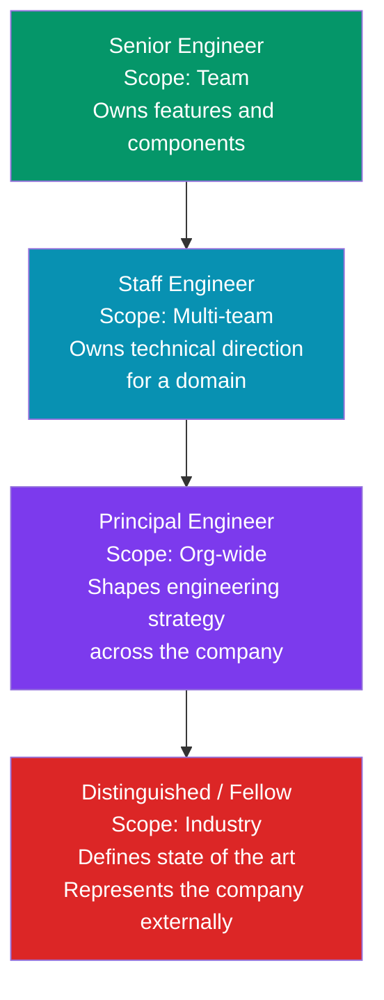
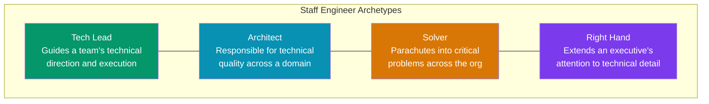
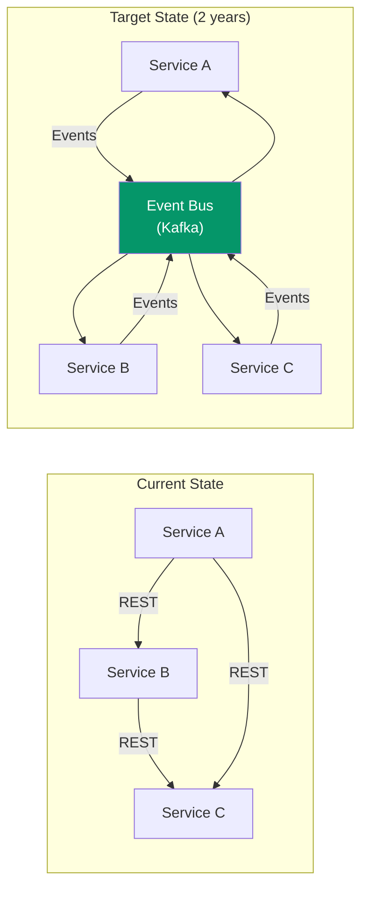
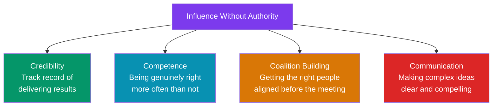
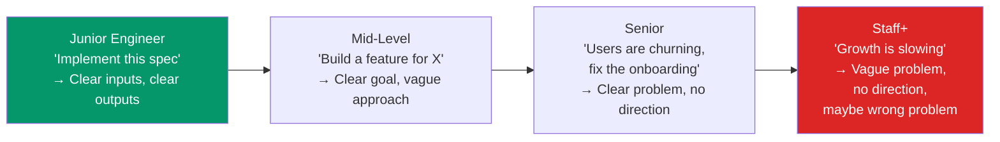

# Technical Leadership Without Management

There is a persistent myth in software engineering that career growth means becoming a manager. It does not. The Staff, Principal, and Distinguished engineer track is a parallel path where you lead through technical excellence, influence, and strategic thinking — not through org chart authority. This page covers what those roles look like, how to build influence, and how to operate effectively when nobody reports to you.

## The Individual Contributor Leadership Ladder



### What Changes at Each Level

| Dimension | Senior Engineer | Staff Engineer | Principal Engineer |
|-----------|----------------|----------------|-------------------|
| **Scope** | One team, one codebase | Multiple teams, multiple codebases | Entire engineering org |
| **Time horizon** | Weeks to months | Months to quarters | Quarters to years |
| **Ambiguity** | Well-defined problems | Vaguely defined problems | Undefined problems — you define them |
| **Impact** | Direct contribution | Multiplied through others | Organizational transformation |
| **Communication** | Team standups, PRs | Design docs, cross-team meetings | Strategy docs, exec presentations |
| **Primary output** | Code, reviews, mentoring | Architecture, design docs, technical strategy | Vision, standards, org-wide systems |

::: tip The Key Shift: From Doing to Enabling
At senior level, you are valued for what you build. At staff level, you are valued for what you enable others to build. The hardest part of the transition is accepting that writing code all day is no longer the highest-leverage use of your time — even though it feels productive.
:::

---

## The Four Archetypes of Staff Engineers

Will Larson identified four common archetypes. Most Staff engineers blend two or more.



| Archetype | Best For | Risk |
|-----------|----------|------|
| **Tech Lead** | Teams that need sustained technical direction | Becoming a bottleneck, or a manager in disguise |
| **Architect** | Organizations that need cross-team technical coherence | Ivory tower — disconnected from reality |
| **Solver** | Organizations with many concurrent crises | No sustained impact — always firefighting |
| **Right Hand** | Large orgs where VPs cannot be everywhere | Becoming a proxy instead of a leader |

---

## Building Influence Through Technical Vision

### Writing a Technical Vision Document

A technical vision describes where your system (or domain) should be in 2-3 years and why. It aligns teams without requiring you to manage them.

**Structure of a technical vision:**

```markdown
## Technical Vision: [Domain Name]

### 1. Current State
- What does the system look like today?
- What are the pain points?
- What are the known risks?

### 2. Guiding Principles
- 3-5 principles that will govern decisions
- Example: "Prefer composition over monolith"
- Example: "Optimize for developer velocity over runtime performance"

### 3. Target State (2-3 years)
- Architecture diagram of the desired end state
- Key capabilities that do not exist today
- What we will have stopped doing

### 4. Migration Strategy
- How do we get from here to there?
- What can be done incrementally?
- What requires a coordinated migration?

### 5. Key Decisions
- Decisions that have been made and their rationale
- Decisions that remain open

### 6. Success Metrics
- How will we know we are making progress?
- Leading and lagging indicators
```

### Example: Vision for Moving to Event-Driven Architecture



**Guiding principles:**
1. Services own their data and publish domain events
2. Consumers handle events idempotently
3. REST remains for synchronous queries; events handle state changes
4. We migrate domain by domain, not big-bang

::: tip The Vision Should Be Opinionated
A useful technical vision takes a clear position. "We should evaluate whether microservices make sense" is not a vision. "We will decompose the monolith into 8 bounded-context services over the next 18 months, starting with Payments and Notifications" is a vision.
:::

---

## Writing Tech Strategy Documents

A tech strategy is more concrete than a vision — it defines the plan, the tradeoffs, and the sequence.

### Strategy Document Structure

| Section | Purpose | Length |
|---------|---------|--------|
| **Context** | Why are we doing this now? What changed? | 1-2 paragraphs |
| **Diagnosis** | What is the actual problem? (Not the symptom) | 1-2 paragraphs |
| **Guiding Policy** | The approach we will take and the tradeoffs we accept | 1 page |
| **Coherent Actions** | Specific, sequenced initiatives | 1-2 pages |
| **What We Will NOT Do** | Equally important — where we will not invest | Half page |
| **Risks and Mitigations** | What could go wrong, and how we handle it | Half page |
| **Success Criteria** | How we measure progress | Quarter page |

### Good vs Bad Strategy

| Bad Strategy | Good Strategy |
|-------------|---------------|
| "Improve developer productivity" | "Reduce CI pipeline time from 45 min to 10 min by Q3, and reduce flaky test rate from 8% to <1% by Q4" |
| "Adopt microservices" | "Extract the payments domain into a separate service with its own database by Q2. Defer all other decomposition until payments is stable." |
| "We need better observability" | "Instrument all services with OpenTelemetry, deploy Grafana + Tempo, and achieve <10 min MTTD for P1 incidents by end of year" |

---

## Leading Without Authority

### The Influence Model

When nobody reports to you, you cannot mandate. You must persuade, and persuasion requires credibility, competence, and coalition.



### Practical Tactics

**1. Write it down first**

Written proposals are more influential than verbal ones. A well-structured RFC or design doc gives people time to think and creates a reference point for discussion.

**2. Pre-align stakeholders**

Never present a major proposal cold in a meeting. Talk to key stakeholders 1:1 before the meeting. Understand their concerns, incorporate their feedback, and make them co-authors of the solution.

**3. Show, don't tell**

Build a prototype. A working demo eliminates theoretical debates and demonstrates feasibility. "I built a proof of concept over the weekend and it handles 10x our current load" is more compelling than a 20-page document.

**4. Make the default path the right path**

Instead of asking teams to adopt your recommended library, make it the default in the project template. Instead of writing guidelines, write automation.

| Approach | Compliance Rate |
|----------|----------------|
| Write a doc saying "use library X" | ~20% |
| Send an email about it | ~30% |
| Present at team meeting | ~40% |
| Make it the default in the scaffold/template | ~90% |
| Make the linter/CI enforce it | ~100% |

**5. Choose your battles**

You cannot fight every technical battle. Spend your influence capital on decisions that have high impact and are difficult to reverse. Let go of low-stakes decisions even when you disagree.

::: warning The Credibility Bank
Every time you are right about a technical decision, you deposit into your credibility bank. Every time you are wrong, you withdraw. The balance determines how much influence you have. This means: do not make strong recommendations unless you have thought deeply. Being loudly wrong is more expensive than being quietly uncertain.
:::

---

## Navigating Ambiguity at Senior Levels

### The Ambiguity Gradient



### Techniques for Working in Ambiguity

**1. Define the problem before solving it**

At Staff+ level, the most common mistake is jumping to solutions. Spend the first 30% of your time understanding the problem space. Talk to users, look at data, read incident reports.

**2. Create structure where there is none**

When faced with a vague mandate like "improve reliability," break it into concrete, measurable sub-problems:

```
"Improve reliability" →
  1. Reduce P1 incidents from 3/month to <1/month
  2. Improve MTTR from 45 min to <15 min
  3. Achieve 99.95% availability (currently 99.8%)
  4. Eliminate the top 3 recurring failure modes
```

**3. Make reversible decisions fast, irreversible decisions slow**

| Decision Type | Approach | Example |
|--------------|----------|---------|
| **Reversible** (Two-way door) | Decide quickly, iterate | Which logging library to use, API field naming |
| **Irreversible** (One-way door) | Research, prototype, seek input | Database choice, public API contract, data model |

**4. Communicate uncertainty honestly**

"I don't know, but here's how I'll find out" is more respected at senior levels than false confidence. State your confidence level: "I'm 80% sure this architecture will scale to 10x. To get to 95%, I'd want to run a load test against the prototype."

---

## Building a Technical Roadmap

### How to Prioritize Technical Work

Technical debt, infrastructure improvements, and platform work compete with feature work. You need a framework to prioritize.

| Priority Framework | Description |
|-------------------|-------------|
| **Risk-based** | What will cause the most damage if we do not address it? |
| **Leverage-based** | What will create the most capacity for future work? |
| **Cost-of-delay** | What gets more expensive the longer we wait? |
| **Pain-based** | What causes the most developer frustration? |

### Selling Technical Work to Leadership

Executives do not care about technical elegance. They care about business outcomes. Frame technical investments in business terms:

| Technical Need | Bad Pitch | Good Pitch |
|---------------|-----------|------------|
| Rewrite auth service | "The code is spaghetti" | "Auth incidents cost us $200K/quarter in customer churn. A rewrite reduces incident rate by 80%." |
| Migrate to Kubernetes | "K8s is industry standard" | "Our deploy frequency is 2x/week. K8s enables 10x/day deploys, reducing time-to-market for features." |
| Adopt TypeScript | "TypeScript is better" | "30% of our production bugs are type-related. TypeScript eliminates them at build time, saving 40 engineer-hours/month in debugging." |

---

## Managing Your Time

### The Staff+ Calendar

A Staff engineer's calendar looks very different from a senior engineer's calendar.

| Activity | Time Allocation | Purpose |
|----------|----------------|---------|
| **Deep work** (code, design, writing) | 30-40% | Stay technically sharp, produce artifacts |
| **1:1s and mentoring** | 15-20% | Build relationships, grow others |
| **Cross-team meetings** | 15-20% | Alignment, coordination, decision-making |
| **Review** (code, design docs, RFCs) | 10-15% | Quality gate, knowledge sharing |
| **Strategic thinking** | 10-15% | Vision, roadmap, long-term planning |

::: tip Protect Your Deep Work Blocks
The biggest risk at Staff+ level is becoming a full-time meeting attendee. Block 2-3 mornings per week for deep work (design docs, prototyping, code review). Decline meetings that do not need your input. Ask for async alternatives.
:::

---

## Common Failure Modes

| Failure Mode | Symptom | Fix |
|-------------|---------|-----|
| **Ivory tower architect** | Designs systems you never build | Stay hands-on. Write code weekly. Review PRs daily. |
| **Bottleneck** | Every decision needs your approval | Document your decision framework. Delegate decisions that fit the framework. |
| **Lone wolf** | Works alone on big projects | Involve others from day one. Your job is to multiply, not to solo. |
| **Conflict avoidance** | Lets bad decisions happen to avoid confrontation | Disagree respectfully but clearly. Silence is consent. |
| **Over-rotation on consensus** | Nothing gets decided because you need everyone to agree | Set deadlines. "If we don't decide by Friday, I'll go with option A." |
| **Technical hobby horse** | Pushes a technology because you like it, not because it solves a problem | Start with the problem, not the technology. |

---

## Related Pages

- [Code Review Best Practices](/devops/engineering-practices/code-review) — A key Staff engineer activity
- [RFC Template & Guide](/devops/engineering-practices/rfc-template) — How to propose changes
- [Design Document Template](/devops/engineering-practices/design-doc-template) — Structuring technical proposals
- [Architecture Decision Records](/devops/engineering-practices/architecture-decision-records) — Recording decisions
- [Hiring: How to Interview Others](/devops/engineering-practices/hiring-interviewing) — Building your team
