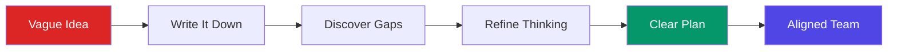
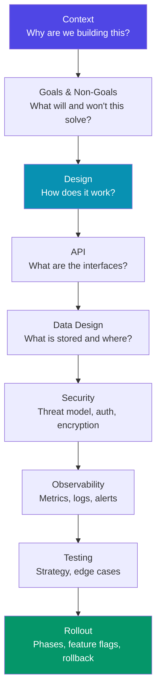
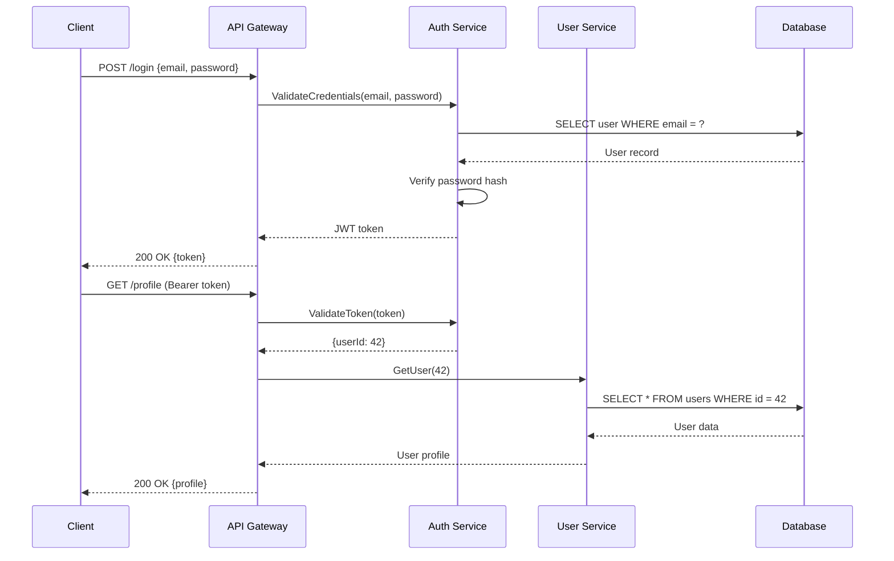

# Technical Writing for Engineers

The most impactful engineers are not always the best coders. They are the best communicators. A well-written design document prevents months of wasted work. A clear RFC aligns 50 engineers on a technical direction. A concise incident postmortem prevents the same outage from happening again. Writing is the highest-leverage skill an engineer can develop, yet it is the least practiced. This page covers the forms of technical writing that matter most in software engineering — and gives you templates, principles, and examples to write each one effectively.

## Why Writing Matters

### The Multiplier Effect

Code affects the systems you build. Writing affects the people who build systems. The math is simple:

- A function you write is used by 5 engineers
- A design document you write is read by 50 engineers
- An RFC you write aligns 200 engineers

Writing scales your impact beyond what you can personally code. At staff+ engineering levels, writing becomes the primary output.

### Writing as Thinking

Writing is not the act of recording decisions. Writing is the act of **making** decisions. When you force yourself to write down "why are we building this?" and "what are the alternatives?", you discover gaps in your reasoning that never surface in a Slack discussion or whiteboard session.



::: tip The Writing Test
If you cannot explain your design in writing, you do not understand it well enough to build it. The writing process itself is the design process.
:::

## The Forms of Engineering Writing

| Document Type | Audience | Lifespan | Purpose |
|--------------|----------|----------|---------|
| RFC (Request for Comments) | Engineering org | Months to years | Propose and debate major technical decisions |
| Design Doc | Team + stakeholders | Weeks to months | Detail the technical plan for a specific project |
| ADR (Architecture Decision Record) | Future engineers | Years | Record why a decision was made |
| Incident Postmortem | Whole org | Permanent | Prevent recurrence of outages |
| README | Developers using a service/library | Ongoing | Enable self-service onboarding |
| API Documentation | Consumers of your API | Ongoing | Define the contract |
| Runbook | On-call engineers | Ongoing | Guide operational procedures |
| Changelog | Users and developers | Ongoing | Communicate what changed |

## RFCs (Request for Comments)

An RFC is a proposal for a significant technical change that requires cross-team alignment. Not every change needs an RFC — use them when the decision is hard to reverse, affects multiple teams, or has significant cost.

### When to Write an RFC

- Introducing a new service, library, or major component
- Changing a shared protocol or data format
- Migrating infrastructure (new database, new cloud provider)
- Changing team processes that affect other teams
- Any decision where disagreement is likely

### RFC Template

```markdown
# RFC: [Short Title]

**Author:** [Name]
**Status:** Draft | In Review | Accepted | Rejected | Superseded
**Created:** YYYY-MM-DD
**Last Updated:** YYYY-MM-DD
**Reviewers:** [Names]

## Summary

One paragraph (2-3 sentences) explaining what this RFC proposes and why.
A busy executive should be able to read this and understand the proposal.

## Motivation

Why are we doing this? What problem does it solve? What happens if we
do nothing? Include data: error rates, latency numbers, customer complaints,
developer hours wasted.

## Detailed Design

The technical details. Include:
- Architecture diagrams
- API contracts
- Data models
- Sequence diagrams for key flows

This section should be detailed enough that someone else could implement it.

## Alternatives Considered

List at least 2-3 alternatives. For each one, explain:
- What it is
- Why it was rejected
- What trade-offs it has compared to the proposal

This is the most important section. It shows you have thought broadly.

## Migration Plan

How do we get from the current state to the proposed state?
- Phased rollout plan
- Backward compatibility
- Rollback strategy

## Risks and Open Questions

What could go wrong? What are you uncertain about?
Be honest — listing risks builds trust and invites help.

## Timeline

Rough phases and milestones. Not a detailed project plan.
```

### Writing Effective RFCs

**Lead with the problem, not the solution.** Most engineers jump straight to "I propose we use Kafka." Start with "We are losing 2% of events due to our current queue design." The problem framing determines whether people engage with your solution or propose their own.

**The Alternatives section is the most important.** If you only present one option, the RFC reads as a fait accompli. Present 3-4 alternatives with honest trade-offs. Reviewers who see you have considered their preferred approach are much more likely to agree with your recommendation.

**Quantify everything.** "Our API is slow" is not motivating. "Our p99 latency is 1,200ms, causing a 15% drop-off rate on the checkout page, costing approximately $200K/month in lost revenue" is motivating.

## Design Documents

A design document is more detailed than an RFC and more focused. It covers the technical plan for a specific project or feature.

### Design Doc Structure



### Goals and Non-Goals

The most underrated section. Non-goals are as important as goals because they prevent scope creep and set expectations:

```markdown
## Goals
- Reduce checkout API latency from p99 1200ms to p99 200ms
- Support 10x current traffic (50K → 500K requests/min)
- Zero data loss for payment events

## Non-Goals
- Migrating the legacy payment provider (separate project, Q3)
- Supporting cryptocurrency payments (no current business need)
- Real-time analytics dashboard (addressed by the analytics team)
- Multi-region deployment (will be addressed after single-region is stable)
```

::: warning Non-Goals Are Not Future Goals
Non-goals are things you are explicitly choosing NOT to do as part of this project. They are boundaries, not deferrals. If something is a future goal, say so — but if it is out of scope forever, say that too.
:::

## Writing Effective Documentation

### The Four Types of Documentation

Daniele Procida's Diataxis framework identifies four types of documentation, each serving a different need:

| Type | Purpose | User Mindset | Example |
|------|---------|-------------|---------|
| **Tutorial** | Learning-oriented | "I want to learn" | Getting started guide, hello world |
| **How-To Guide** | Task-oriented | "I want to accomplish X" | "How to deploy to staging" |
| **Explanation** | Understanding-oriented | "I want to understand why" | Architecture overview, design rationale |
| **Reference** | Information-oriented | "I need to look up Y" | API reference, configuration options |

Most documentation fails because it mixes these types. A tutorial that stops to explain the theory behind every step is a bad tutorial. A reference that includes step-by-step instructions becomes confusing.

### Writing Principles

**1. Write for scanning, not reading.** Engineers do not read documentation — they scan it for the answer to their question. Use headings, bullet points, code blocks, and tables. Put the most important information first.

**2. Show, then tell.** Lead with a code example, then explain it. Engineers understand code faster than prose:

```markdown
<!-- BAD: explanation first -->
The `retry` middleware wraps an HTTP handler and automatically retries
failed requests using exponential backoff with jitter. The base delay
is configurable...

<!-- GOOD: code first -->
```python
@retry(max_attempts=3, base_delay=1.0)
async def fetch_user(user_id: str) -> User:
    return await http_client.get(f"/users/{user_id}")
```

The `@retry` decorator retries failed requests up to 3 times with
exponential backoff starting at 1 second.
```

**3. Keep it current or kill it.** Outdated documentation is worse than no documentation — it actively misleads. Every page should have a `lastReviewed` date. If documentation cannot be maintained, delete it and link to the source code.

**4. Use the second person.** Write "you" not "the user" or "one." Direct address is clearer and more engaging: "To deploy your service, run `make deploy`" not "The service can be deployed by running `make deploy`."

## Diagrams and Visual Communication

A well-drawn diagram replaces 500 words of text. Engineers think spatially — show them the architecture, not just describe it.

### When to Use Which Diagram

| Diagram Type | Best For | Tool |
|-------------|----------|------|
| Architecture diagram | System overview, components, boundaries | Mermaid, Excalidraw, draw.io |
| Sequence diagram | Request flows, API interactions, timing | Mermaid, PlantUML |
| Flowchart | Decision logic, process flows | Mermaid |
| ER diagram | Data models, relationships | Mermaid, dbdiagram.io |
| C4 diagram | Zoom levels (system, container, component, code) | Structurizr, Mermaid |

### Mermaid Sequence Diagram Example



### Diagram Principles

1. **Label everything.** Unlabeled arrows and boxes force the reader to guess
2. **Show the happy path first.** Add error paths as variations, not inline
3. **Use consistent notation.** If boxes mean services, use the same box shape for all services
4. **Include a legend** if the diagram uses non-obvious symbols
5. **Keep it simple.** If a diagram has more than 15 elements, split it into multiple diagrams

## README Templates

### Service README

```markdown
# Order Service

One-sentence description of what this service does.

## Quick Start

​```bash
# Prerequisites: Docker, Go 1.22+
make run-local    # Starts service + dependencies
make test         # Runs all tests
​```

## Architecture

[Link to design doc or architecture diagram]

## API

| Endpoint | Method | Description |
|----------|--------|-------------|
| /orders  | GET    | List orders (paginated) |
| /orders  | POST   | Create an order |
| /orders/{id} | GET | Get order by ID |

[Link to full API docs / OpenAPI spec]

## Configuration

| Env Var | Required | Default | Description |
|---------|----------|---------|-------------|
| DATABASE_URL | Yes | — | PostgreSQL connection string |
| REDIS_URL | No | localhost:6379 | Redis connection string |
| LOG_LEVEL | No | info | Log verbosity |

## Deployment

​```bash
make deploy-staging    # Deploy to staging
make deploy-prod       # Deploy to production (requires approval)
​```

## On-Call

- Runbook: [Link]
- Dashboard: [Link]
- Alerts: [Link]
- Escalation: #order-service-oncall Slack channel
```

## API Documentation

Good API documentation answers three questions for every endpoint:

1. **What** does this endpoint do? (summary)
2. **How** do I call it? (request format, authentication)
3. **What** will I get back? (response format, error cases)

### OpenAPI Best Practices

```yaml
paths:
  /orders:
    post:
      summary: Create a new order
      description: |
        Creates an order for the authenticated user. The order will be
        in `pending` status until payment is confirmed. If payment fails
        within 30 minutes, the order is automatically cancelled.
      operationId: createOrder
      tags: [Orders]
      security:
        - bearerAuth: []
      requestBody:
        required: true
        content:
          application/json:
            schema:
              $ref: '#/components/schemas/CreateOrderRequest'
            examples:
              basic:
                summary: Simple order with one item
                value:
                  items:
                    - productId: "prod_123"
                      quantity: 2
                  shippingAddressId: "addr_456"
      responses:
        '201':
          description: Order created successfully
          content:
            application/json:
              schema:
                $ref: '#/components/schemas/Order'
        '400':
          description: Invalid request (missing fields, invalid product ID)
        '402':
          description: Payment required (no valid payment method)
        '409':
          description: Conflict (insufficient inventory)
```

## Writing Style Guide for Engineers

### Tone

- **Direct.** "Run `make deploy`" not "You might want to consider running `make deploy`"
- **Confident.** "Use connection pooling" not "It might be a good idea to use connection pooling"
- **Honest.** "This approach has a known limitation: ..." not silence
- **Inclusive.** Avoid jargon without definition. Not everyone has the same context

### Sentence Structure

- Lead with the action or conclusion
- One idea per sentence
- Short paragraphs (3-5 sentences max)
- Active voice: "The service processes requests" not "Requests are processed by the service"

### Common Mistakes

| Mistake | Fix |
|---------|-----|
| "Simply run..." / "Just add..." | Drop "simply" and "just" — they dismiss real complexity |
| "Obviously, ..." | If it were obvious, you would not need to write it |
| Undefined acronyms | Define on first use: "SLA (Service Level Agreement)" |
| Screenshots instead of text | Screenshots cannot be searched, copied, or updated. Use code blocks |
| "As described above" | Link to the specific section. "Above" is ambiguous in long documents |
| No date or version | Always include when the document was written and what version it applies to |

## Measuring Documentation Quality

How do you know if your documentation is good?

| Signal | What It Tells You |
|--------|-------------------|
| Support ticket volume | High tickets on documented topics = docs are failing |
| Time to first deployment (new engineer) | Long onboarding time = missing or unclear getting-started docs |
| Documentation page views vs. bounce rate | High bounce = people cannot find what they need |
| Slack questions about documented topics | If people ask instead of reading, the docs are not discoverable or not trusted |
| PR review comments about readability | Frequent "what does this do?" comments = code needs better inline docs |

## Building a Documentation Culture

Documentation does not write itself. It requires organizational incentives:

1. **Include docs in the definition of done.** A feature is not shipped until it is documented
2. **Review docs in PRs.** Treat documentation changes with the same rigor as code changes
3. **Celebrate good writing.** Share well-written RFCs and design docs in team channels
4. **Assign documentation owners.** Every major document has a maintainer, not just an author
5. **Deprecate aggressively.** Remove outdated docs. A smaller, accurate corpus is better than a large, unreliable one

## Further Reading

- [Architecture Decision Records](/devops/engineering-practices/architecture-decision-records) — the specific format for recording architectural decisions
- [Code Review Best Practices](/devops/engineering-practices/code-review) — writing effective code review feedback is a form of technical writing
- [On-Call Handbook](/devops/engineering-practices/on-call-handbook) — writing runbooks and postmortems
- [Incident Communication Templates](/devops/incident-response/communication-templates) — structured writing under pressure
- [Postmortem Framework](/devops/incident-response/postmortem-framework) — writing blameless postmortems
